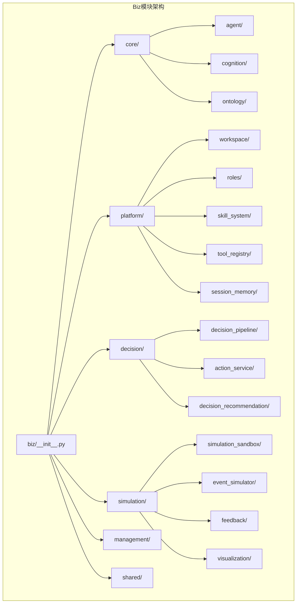
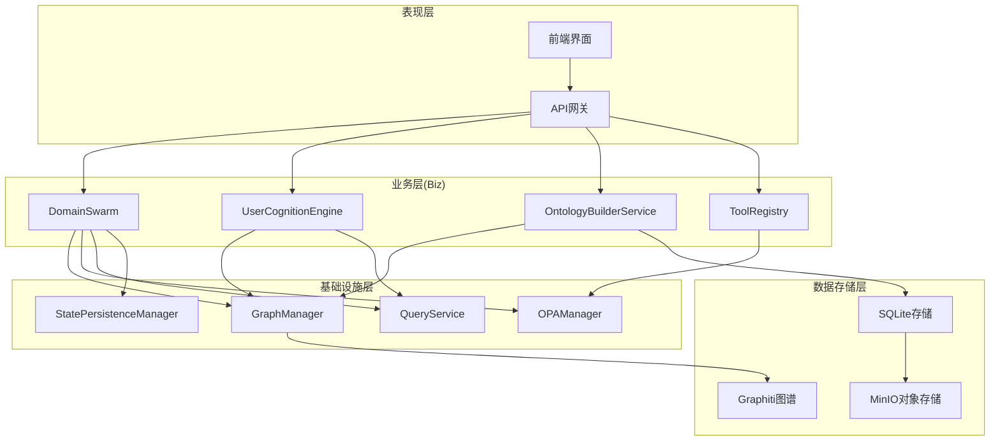
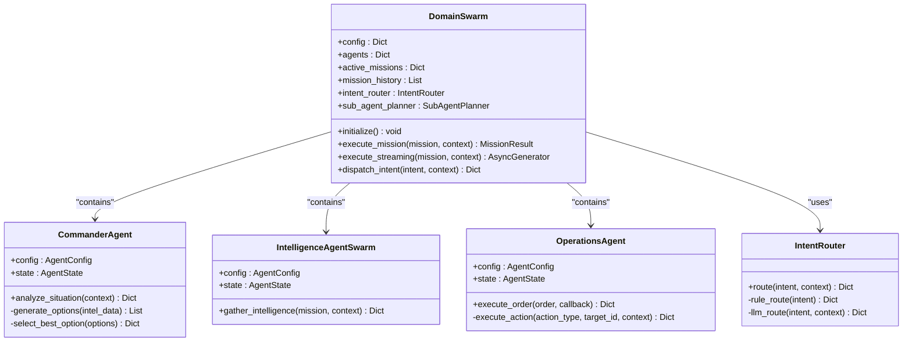
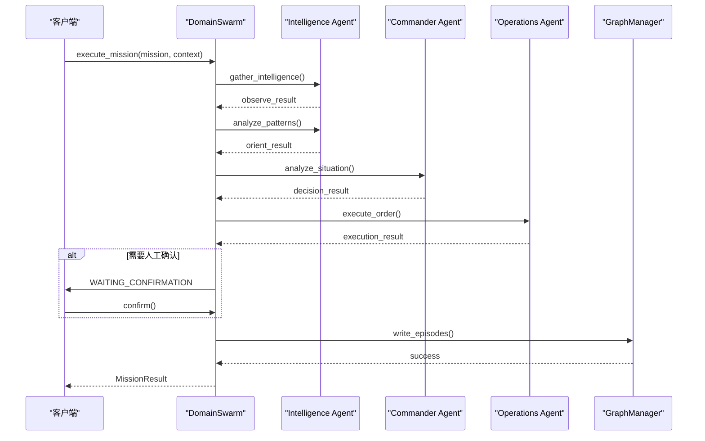
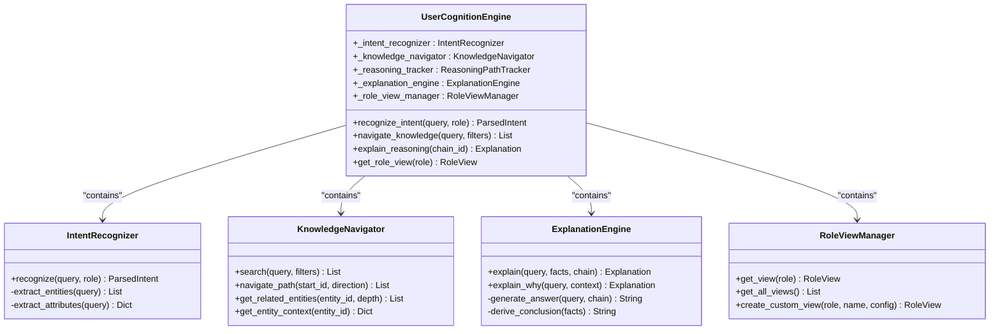
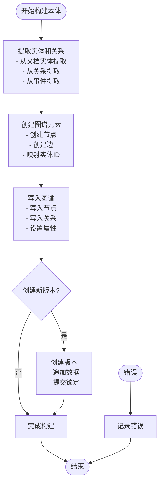
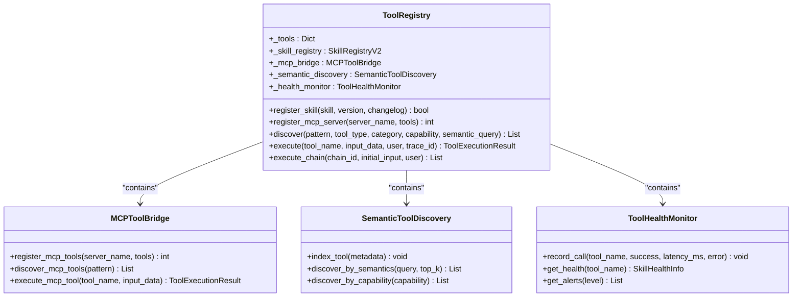
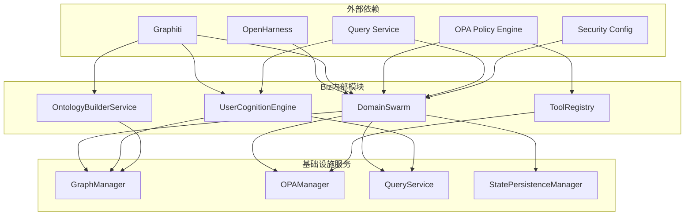

# Biz模块脚手架技能

<cite>
**本文档引用的文件**
- [odap/biz/__init__.py](file://odap/biz/__init__.py)
- [odap/biz/core/__init__.py](file://odap/biz/core/__init__.py)
- [odap/biz/core/agent/swarm_orchestrator.py](file://odap/biz/core/agent/swarm_orchestrator.py)
- [odap/biz/core/cognition/user_cognition_engine.py](file://odap/biz/core/cognition/user_cognition_engine.py)
- [odap/biz/core/ontology/services/build_service.py](file://odap/biz/core/ontology/services/build_service.py)
- [odap/biz/platform/tool_registry/registry.py](file://odap/biz/platform/tool_registry/registry.py)
- [odap/biz/platform/skill_system/__init__.py](file://odap/biz/platform/skill_system/__init__.py)
- [odap/biz/decision/__init__.py](file://odap/biz/decision/__init__.py)
- [odap/biz/simulation/__init__.py](file://odap/biz/simulation/__init__.py)
- [odap/biz/management/__init__.py](file://odap/biz/management/__init__.py)
- [odap/biz/shared/__init__.py](file://odap/biz/shared/__init__.py)
</cite>

## 目录
1. [简介](#简介)
2. [项目结构](#项目结构)
3. [核心组件](#核心组件)
4. [架构概览](#架构概览)
5. [详细组件分析](#详细组件分析)
6. [依赖关系分析](#依赖关系分析)
7. [性能考虑](#性能考虑)
8. [故障排除指南](#故障排除指南)
9. [结论](#结论)

## 简介

Biz模块是ODAP平台的核心业务层框架，提供了一个完整的AI应用开发脚手架，支持多Agent协同、本体管理、认知引擎、工具注册等关键功能。该模块采用模块化设计，通过清晰的层次结构实现了业务逻辑的可扩展性和可维护性。

Biz模块的主要目标是为AI应用开发者提供一个标准化的开发框架，包含以下核心能力：
- 多Agent协同编排系统
- 本体管理和知识图谱构建
- 用户认知和意图理解
- 统一的工具注册和执行系统
- 决策支持和仿真推演功能

## 项目结构

Biz模块采用分层架构设计，按照功能域进行模块划分：

**图表来源**
- [odap/biz/__init__.py:1-2](file://odap/biz/__init__.py#L1-L2)
- [odap/biz/core/__init__.py:1-16](file://odap/biz/core/__init__.py#L1-L16)
- [odap/biz/platform/__init__.py:1-29](file://odap/biz/platform/__init__.py#L1-L29)

**章节来源**
- [odap/biz/__init__.py:1-2](file://odap/biz/__init__.py#L1-L2)
- [odap/biz/core/__init__.py:1-16](file://odap/biz/core/__init__.py#L1-L16)
- [odap/biz/platform/__init__.py:1-29](file://odap/biz/platform/__init__.py#L1-L29)

## 核心组件

Biz模块包含以下核心组件，每个组件都承担着特定的业务职责：

### 1. 多Agent协同编排器
DomainSwarm提供了完整的多Agent协同系统，支持Commander、Intelligence、Operations三种Agent的OOOA循环协作。

### 2. 用户认知引擎
实现了完整的用户意图识别、知识导航、推理解释等功能，支持多角色视图管理。

### 3. 本体构建服务
提供从原始数据到本体模型的转换能力，支持图谱构建和版本管理。

### 4. 工具注册表
统一管理各种类型的工具，包括Skill、MCP、REST API等，提供语义发现和健康监控功能。

**章节来源**
- [odap/biz/core/agent/swarm_orchestrator.py:1-800](file://odap/biz/core/agent/swarm_orchestrator.py#L1-L800)
- [odap/biz/core/cognition/user_cognition_engine.py:1-800](file://odap/biz/core/cognition/user_cognition_engine.py#L1-L800)
- [odap/biz/core/ontology/services/build_service.py:1-447](file://odap/biz/core/ontology/services/build_service.py#L1-L447)
- [odap/biz/platform/tool_registry/registry.py:1-800](file://odap/biz/platform/tool_registry/registry.py#L1-L800)

## 架构概览

Biz模块采用分层架构设计，各层之间职责明确，耦合度低：

**图表来源**
- [odap/biz/core/agent/swarm_orchestrator.py:401-427](file://odap/biz/core/agent/swarm_orchestrator.py#L401-L427)
- [odap/biz/core/cognition/user_cognition_engine.py:787-799](file://odap/biz/core/cognition/user_cognition_engine.py#L787-L799)
- [odap/biz/core/ontology/services/build_service.py:47-50](file://odap/biz/core/ontology/services/build_service.py#L47-L50)

## 详细组件分析

### 多Agent协同编排器分析

DomainSwarm是Biz模块的核心组件，实现了完整的多Agent协同系统：

**图表来源**
- [odap/biz/core/agent/swarm_orchestrator.py:401-501](file://odap/biz/core/agent/swarm_orchestrator.py#L401-L501)
- [odap/biz/core/agent/swarm_orchestrator.py:102-183](file://odap/biz/core/agent/swarm_orchestrator.py#L102-L183)
- [odap/biz/core/agent/swarm_orchestrator.py:185-240](file://odap/biz/core/agent/swarm_orchestrator.py#L185-L240)
- [odap/biz/core/agent/swarm_orchestrator.py:242-288](file://odap/biz/core/agent/swarm_orchestrator.py#L242-L288)
- [odap/biz/core/agent/swarm_orchestrator.py:291-378](file://odap/biz/core/agent/swarm_orchestrator.py#L291-L378)

#### OODA循环执行流程

DomainSwarm实现了完整的OODA循环，支持同步和异步两种执行模式：

**图表来源**
- [odap/biz/core/agent/swarm_orchestrator.py:524-601](file://odap/biz/core/agent/swarm_orchestrator.py#L524-L601)
- [odap/biz/core/agent/swarm_orchestrator.py:713-757](file://odap/biz/core/agent/swarm_orchestrator.py#L713-L757)

**章节来源**
- [odap/biz/core/agent/swarm_orchestrator.py:1-800](file://odap/biz/core/agent/swarm_orchestrator.py#L1-L800)

### 用户认知引擎分析

UserCognitionEngine提供了完整的用户认知处理能力：

**图表来源**
- [odap/biz/core/cognition/user_cognition_engine.py:787-799](file://odap/biz/core/cognition/user_cognition_engine.py#L787-L799)
- [odap/biz/core/cognition/user_cognition_engine.py:140-226](file://odap/biz/core/cognition/user_cognition_engine.py#L140-L226)
- [odap/biz/core/cognition/user_cognition_engine.py:305-465](file://odap/biz/core/cognition/user_cognition_engine.py#L305-L465)
- [odap/biz/core/cognition/user_cognition_engine.py:563-680](file://odap/biz/core/cognition/user_cognition_engine.py#L563-L680)
- [odap/biz/core/cognition/user_cognition_engine.py:682-784](file://odap/biz/core/cognition/user_cognition_engine.py#L682-L784)

**章节来源**
- [odap/biz/core/cognition/user_cognition_engine.py:1-800](file://odap/biz/core/cognition/user_cognition_engine.py#L1-L800)

### 本体构建服务分析

OntologyBuilderService提供了完整的本体构建和管理能力：

**图表来源**
- [odap/biz/core/ontology/services/build_service.py:51-135](file://odap/biz/core/ontology/services/build_service.py#L51-L135)
- [odap/biz/core/ontology/services/build_service.py:137-209](file://odap/biz/core/ontology/services/build_service.py#L137-L209)
- [odap/biz/core/ontology/services/build_service.py:211-254](file://odap/biz/core/ontology/services/build_service.py#L211-L254)
- [odap/biz/core/ontology/services/build_service.py:256-302](file://odap/biz/core/ontology/services/build_service.py#L256-L302)

**章节来源**
- [odap/biz/core/ontology/services/build_service.py:1-447](file://odap/biz/core/ontology/services/build_service.py#L1-L447)

### 工具注册表分析

ToolRegistry提供了统一的工具管理能力：

**图表来源**
- [odap/biz/platform/tool_registry/registry.py:403-425](file://odap/biz/platform/tool_registry/registry.py#L403-L425)
- [odap/biz/platform/tool_registry/registry.py:149-214](file://odap/biz/platform/tool_registry/registry.py#L149-L214)
- [odap/biz/platform/tool_registry/registry.py:216-299](file://odap/biz/platform/tool_registry/registry.py#L216-L299)
- [odap/biz/platform/tool_registry/registry.py:304-401](file://odap/biz/platform/tool_registry/registry.py#L304-L401)

**章节来源**
- [odap/biz/platform/tool_registry/registry.py:1-800](file://odap/biz/platform/tool_registry/registry.py#L1-L800)

## 依赖关系分析

Biz模块的依赖关系呈现清晰的分层特征：

**图表来源**
- [odap/biz/core/agent/swarm_orchestrator.py:407-419](file://odap/biz/core/agent/swarm_orchestrator.py#L407-L419)
- [odap/biz/core/cognition/user_cognition_engine.py:308-311](file://odap/biz/core/cognition/user_cognition_engine.py#L308-L311)
- [odap/biz/core/ontology/services/build_service.py:265-267](file://odap/biz/core/ontology/services/build_service.py#L265-L267)

**章节来源**
- [odap/biz/core/agent/swarm_orchestrator.py:1-800](file://odap/biz/core/agent/swarm_orchestrator.py#L1-L800)
- [odap/biz/core/cognition/user_cognition_engine.py:1-800](file://odap/biz/core/cognition/user_cognition_engine.py#L1-L800)
- [odap/biz/core/ontology/services/build_service.py:1-447](file://odap/biz/core/ontology/services/build_service.py#L1-L447)
- [odap/biz/platform/tool_registry/registry.py:1-800](file://odap/biz/platform/tool_registry/registry.py#L1-L800)

## 性能考虑

Biz模块在设计时充分考虑了性能优化：

### 1. 异步处理
- DomainSwarm支持异步执行，提高并发处理能力
- ToolRegistry提供异步执行方法，支持高并发场景

### 2. 缓存机制
- UserCognitionEngine内置缓存机制，减少重复查询
- ToolRegistry维护工具健康状态缓存

### 3. 流式处理
- DomainSwarm支持流式执行，实时返回进度信息
- 减少长任务的等待时间

### 4. 错误恢复
- 完善的异常处理和错误恢复机制
- 健康监控和告警系统

## 故障排除指南

### 常见问题及解决方案

#### 1. Agent初始化失败
**症状**: Agent无法正常启动
**可能原因**:
- Graphiti连接失败
- OPA权限检查失败
- 配置参数错误

**解决方法**:
- 检查Graphiti服务连接状态
- 验证OPA策略配置
- 确认Agent配置参数

#### 2. 工具执行失败
**症状**: 工具调用返回错误
**可能原因**:
- 权限不足
- 工具不可用
- 输入参数错误

**解决方法**:
- 检查OPA权限配置
- 验证工具注册状态
- 校验输入参数格式

#### 3. 本体构建失败
**症状**: 本体构建过程中断
**可能原因**:
- 数据格式不正确
- 图谱写入失败
- 版本管理异常

**解决方法**:
- 验证OntologyDocument格式
- 检查Graphiti写入权限
- 查看版本管理日志

**章节来源**
- [odap/biz/core/agent/swarm_orchestrator.py:584-596](file://odap/biz/core/agent/swarm_orchestrator.py#L584-L596)
- [odap/biz/platform/tool_registry/registry.py:649-662](file://odap/biz/platform/tool_registry/registry.py#L649-L662)
- [odap/biz/core/ontology/services/build_service.py:126-135](file://odap/biz/core/ontology/services/build_service.py#L126-L135)

## 结论

Biz模块为AI应用开发提供了一个完整、可扩展的脚手架框架。通过模块化的架构设计和清晰的功能划分，开发者可以快速构建复杂的AI应用系统。

### 主要优势

1. **模块化设计**: 清晰的功能分离，便于维护和扩展
2. **多Agent支持**: 完整的协同编排系统
3. **统一工具管理**: 支持多种工具类型的统一管理
4. **认知能力**: 提供完整的用户认知处理能力
5. **本体管理**: 支持知识图谱的构建和管理

### 应用场景

- 智能决策支持系统
- 多Agent协同控制系统
- 知识图谱构建平台
- AI工具管理平台
- 认知智能应用

Biz模块为开发者提供了一个强大的基础框架，可以在此基础上构建各种复杂的AI应用场景。