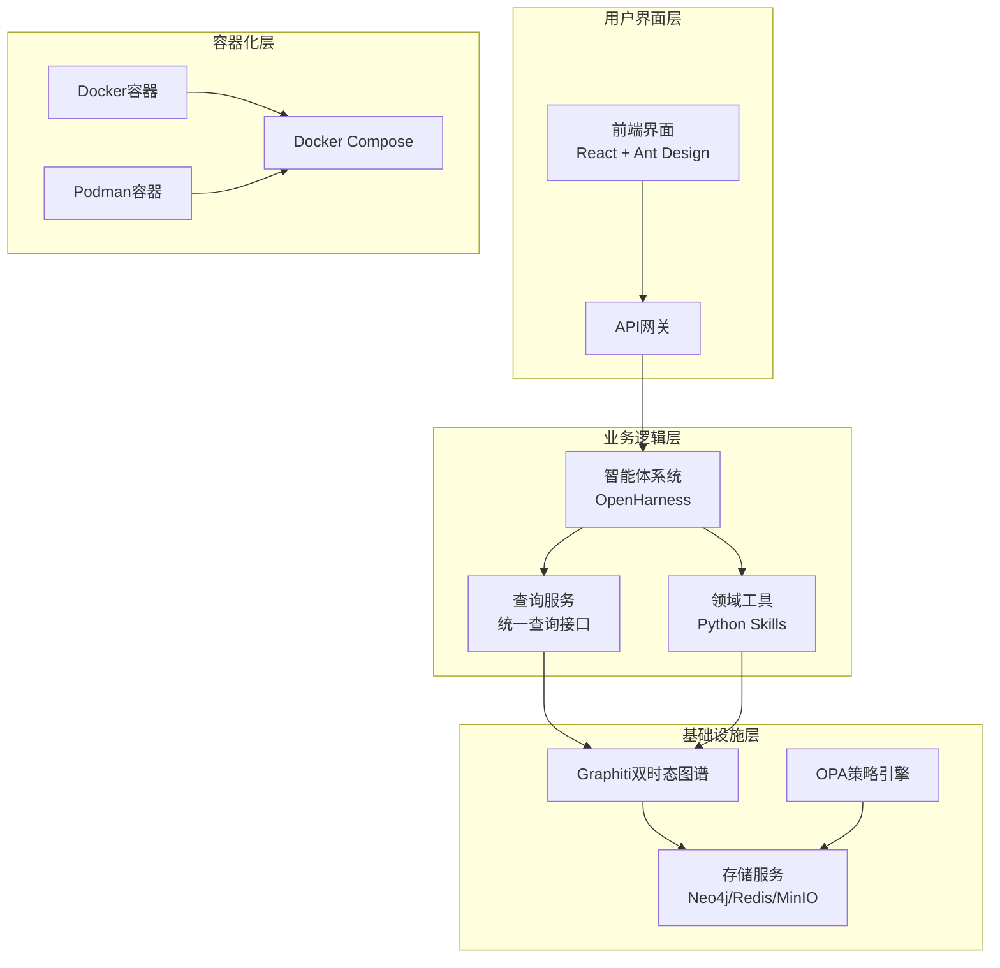
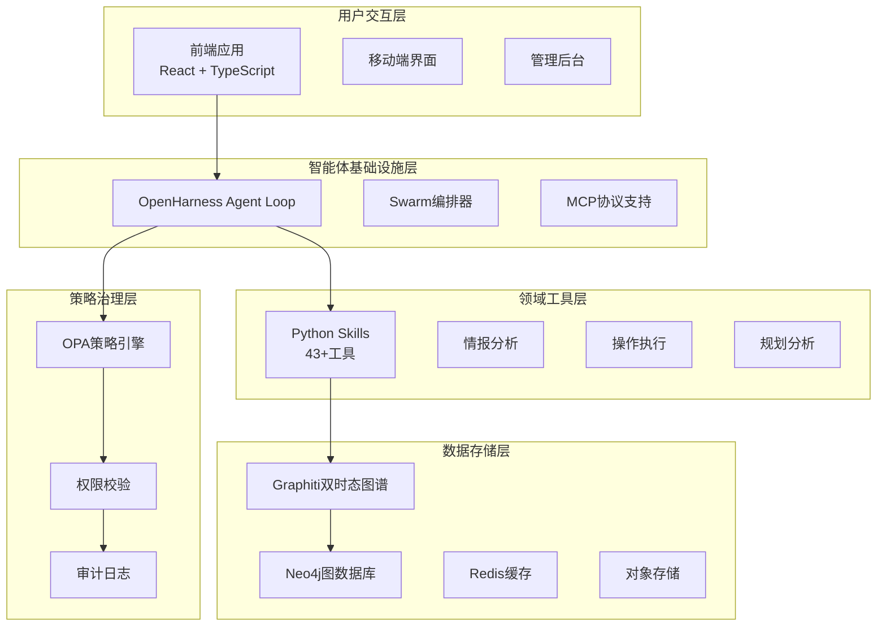
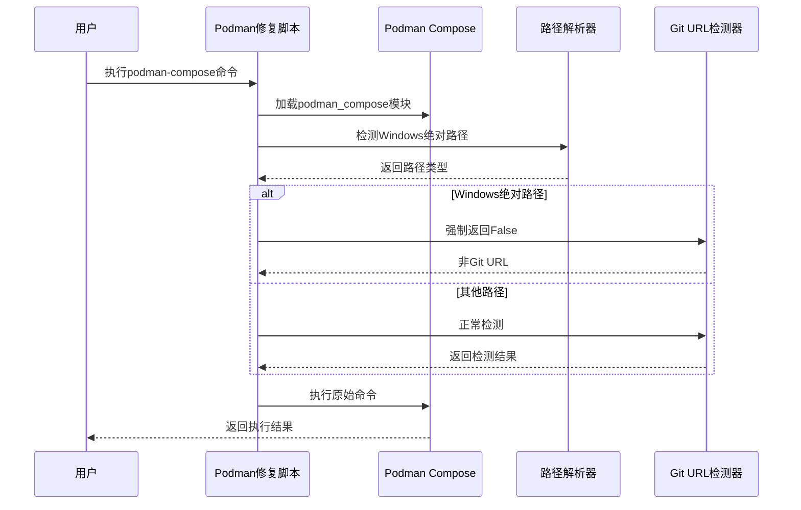
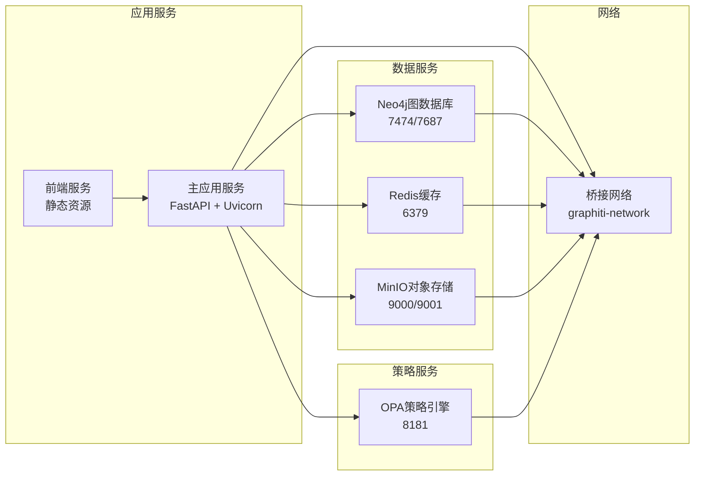
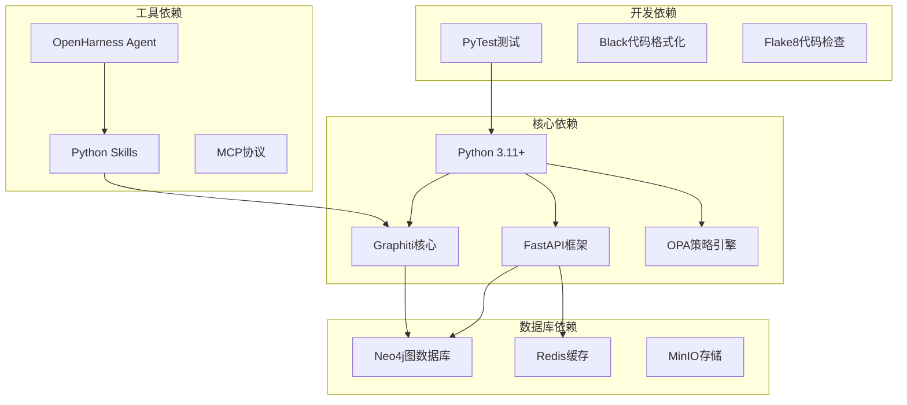
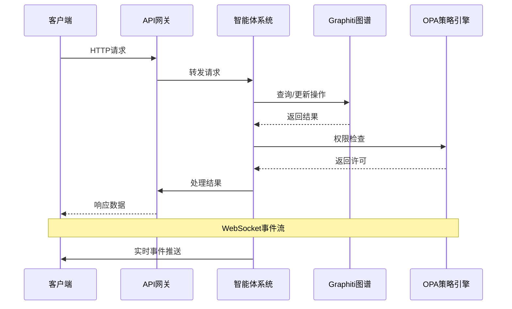
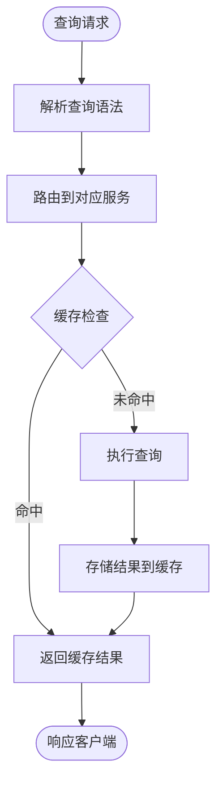

# Podman重建技能

<cite>
**本文档引用的文件**
- [docker-compose.yml](file://docker/docker-compose.yml)
- [Dockerfile](file://docker/Dockerfile)
- [Dockerfile.dev](file://docker/Dockerfile.dev)
- [docker-compose.override.yml](file://docker/docker-compose.override.yml)
- [docker-compose.test.yml](file://docker/docker-compose.test.yml)
- [podman-compose-win-fix.py](file://docker/podman-compose-win-fix.py)
- [README.md](file://README.md)
- [main.py](file://main.py)
- [requirements.txt](file://requirements.txt)
- [pyproject.toml](file://pyproject.toml)
- [docs/02-architecture/ARCHITECTURE.md](file://docs/02-architecture/ARCHITECTURE.md)
- [docs/03-modules/agent/DESIGN.md](file://docs/03-modules/agent/DESIGN.md)
</cite>

## 目录
1. [简介](#简介)
2. [项目结构](#项目结构)
3. [核心组件](#核心组件)
4. [架构概览](#架构概览)
5. [详细组件分析](#详细组件分析)
6. [依赖分析](#依赖分析)
7. [性能考虑](#性能考虑)
8. [故障排除指南](#故障排除指南)
9. [结论](#结论)

## 简介

本文档详细介绍ODAP（本体驱动分析决策平台）项目中的Podman重建技能。ODAP是一个基于Graphiti + OPA + Skill架构的通用本体驱动分析决策平台，支持多智能体协同和双时态知识图谱推理。

该项目提供了完整的容器化解决方案，包括Docker和Podman支持，以及针对Windows环境下Podman Compose的特殊修复脚本。系统采用多层架构设计，包含基础设施层、领域工具层、业务层和接口层。

## 项目结构

ODAP项目采用模块化的三层架构设计：

**图表来源**
- [README.md:27-122](file://README.md#L27-L122)
- [docs/02-architecture/ARCHITECTURE.md:392-446](file://docs/02-architecture/ARCHITECTURE.md#L392-L446)

**章节来源**
- [README.md:27-122](file://README.md#L27-L122)
- [docs/02-architecture/ARCHITECTURE.md:392-446](file://docs/02-architecture/ARCHITECTURE.md#L392-L446)

## 核心组件

### 容器编排系统

项目提供了完整的容器编排配置，支持多种部署场景：

| 组件 | 文件 | 用途 | 特性 |
|------|------|------|------|
| 主编排 | docker-compose.yml | 生产环境部署 | 多服务编排，健康检查，数据持久化 |
| 开发配置 | docker-compose.override.yml | 开发环境热重载 | 源码挂载，开发服务器 |
| 测试配置 | docker-compose.test.yml | 集成测试环境 | 独立测试网络，测试专用服务 |
| Podman修复 | podman-compose-win-fix.py | Windows兼容性 | 路径解析修复，Git URL检测 |

### 镜像构建系统

系统提供两种镜像构建配置：

| 镜像类型 | Dockerfile | 环境 | 特性 |
|----------|------------|------|------|
| 生产镜像 | Dockerfile | 生产环境 | 优化的Python包安装，最小化体积 |
| 开发镜像 | Dockerfile.dev | 开发环境 | Watchdog支持，热重载，调试工具 |

**章节来源**
- [docker/docker-compose.yml:1-123](file://docker/docker-compose.yml#L1-L123)
- [docker/Dockerfile:1-34](file://docker/Dockerfile#L1-L34)
- [docker/Dockerfile.dev:1-34](file://docker/Dockerfile.dev#L1-L34)
- [docker/docker-compose.override.yml:1-73](file://docker/docker-compose.override.yml#L1-L73)
- [docker/docker-compose.test.yml:1-99](file://docker/docker-compose.test.yml#L1-L99)

## 架构概览

ODAP采用四层架构设计，每层都有明确的职责分工：

**图表来源**
- [docs/02-architecture/ARCHITECTURE.md:448-456](file://docs/02-architecture/ARCHITECTURE.md#L448-L456)
- [docs/02-architecture/ARCHITECTURE.md:480-509](file://docs/02-architecture/ARCHITECTURE.md#L480-L509)

## 详细组件分析

### Podman重建流程

针对Windows环境下Podman Compose的特殊问题，项目提供了专门的修复脚本：

**图表来源**
- [docker/podman-compose-win-fix.py:37-73](file://docker/podman-compose-win-fix.py#L37-L73)

#### 修复机制详解

修复脚本的核心逻辑包括：

1. **路径类型检测**：使用正则表达式识别Windows绝对路径格式
2. **Monkey Patching**：动态替换`is_context_git_url`函数
3. **兼容性处理**：确保Windows路径不会被误判为Git URL

**章节来源**
- [docker/podman-compose-win-fix.py:1-73](file://docker/podman-compose-win-fix.py#L1-L73)

### 容器服务架构

系统包含多个相互协作的服务组件：

**图表来源**
- [docker/docker-compose.yml:1-123](file://docker/docker-compose.yml#L1-L123)

**章节来源**
- [docker/docker-compose.yml:1-123](file://docker/docker-compose.yml#L1-L123)

### 开发环境配置

开发环境提供了完整的热重载和调试支持：

| 组件 | 配置要点 | 功能特性 |
|------|----------|----------|
| 应用容器 | 源码挂载，开发服务器 | 实时代码更新，错误热重载 |
| 前端容器 | 源码挂载，开发服务器 | HMR热模块替换，调试工具 |
| 数据持久化 | 命名卷，数据保护 | 持久化存储，数据安全 |
| 环境变量 | 开发配置，调试选项 | 灵活配置，环境隔离 |

**章节来源**
- [docker/docker-compose.override.yml:1-73](file://docker/docker-compose.override.yml#L1-L73)

## 依赖分析

### 技术栈依赖关系

**图表来源**
- [requirements.txt:1-50](file://requirements.txt#L1-L50)
- [pyproject.toml:1-17](file://pyproject.toml#L1-L17)

### 服务间通信

系统采用RESTful API和WebSocket进行服务间通信：

**图表来源**
- [docs/02-architecture/ARCHITECTURE.md:563-588](file://docs/02-architecture/ARCHITECTURE.md#L563-L588)

**章节来源**
- [requirements.txt:1-50](file://requirements.txt#L1-L50)
- [pyproject.toml:1-17](file://pyproject.toml#L1-L17)

## 性能考虑

### 容器性能优化

系统在容器层面采用了多项性能优化措施：

1. **镜像优化**：使用多阶段构建减少镜像大小
2. **依赖管理**：集中管理Python包依赖，避免重复安装
3. **资源限制**：为关键服务设置内存和CPU限制
4. **连接池**：数据库连接池优化，减少连接开销

### 查询性能

**图表来源**
- [docs/02-architecture/ARCHITECTURE.md:480-509](file://docs/02-architecture/ARCHITECTURE.md#L480-L509)

## 故障排除指南

### 常见问题解决

| 问题类型 | 症状 | 解决方案 |
|----------|------|----------|
| Podman路径错误 | Windows路径被识别为Git URL | 使用podman-compose-win-fix.py替代podman-compose |
| 容器启动失败 | 服务健康检查失败 | 检查依赖服务是否正常启动 |
| 端口冲突 | 容器无法绑定端口 | 修改docker-compose.yml中的端口映射 |
| 权限问题 | OPA拒绝访问 | 检查OPA策略配置和用户权限 |
| 内存不足 | 容器被OOM杀死 | 调整Docker内存限制和应用配置 |

### 调试技巧

1. **查看容器日志**：使用`docker-compose logs [服务名]`
2. **进入容器调试**：使用`docker-compose exec [服务名] bash`
3. **检查网络连接**：使用`docker network ls`和`docker inspect`
4. **验证服务状态**：使用`docker-compose ps`

**章节来源**
- [docker/podman-compose-win-fix.py:1-73](file://docker/podman-compose-win-fix.py#L1-L73)
- [docker/docker-compose.yml:32-37](file://docker/docker-compose.yml#L32-L37)

## 结论

ODAP项目提供了完整的Podman重建技能，通过专门的Windows兼容性修复脚本解决了Podman Compose在Windows环境下的路径解析问题。项目采用模块化的四层架构设计，支持多智能体协同和双时态知识图谱推理，为构建复杂的本体驱动分析决策系统提供了坚实的技术基础。

该系统的容器化解决方案不仅支持Docker，还特别针对Podman进行了优化，确保在不同操作系统环境下都能稳定运行。通过合理的依赖管理和性能优化，系统能够在保证功能完整性的同时提供良好的用户体验。