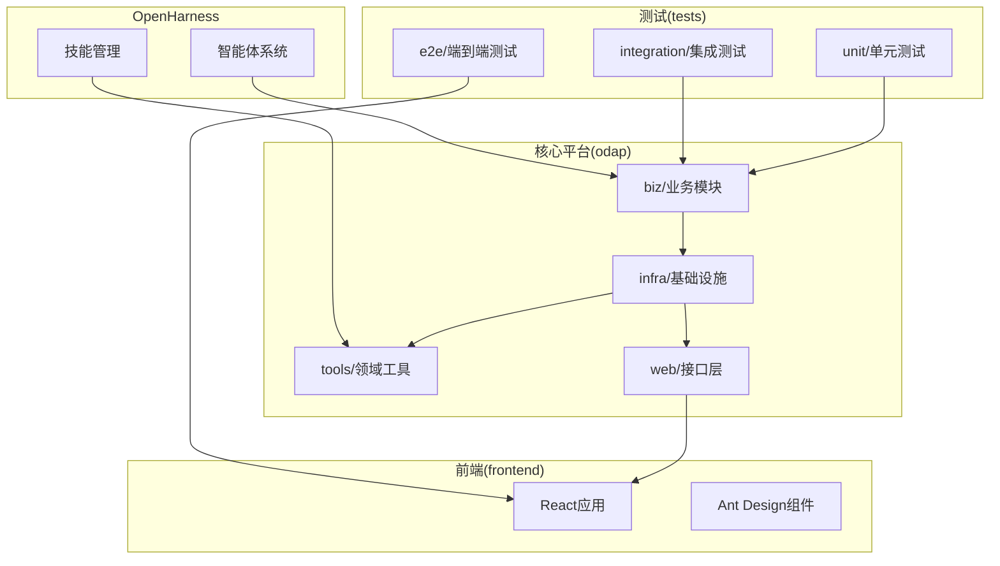
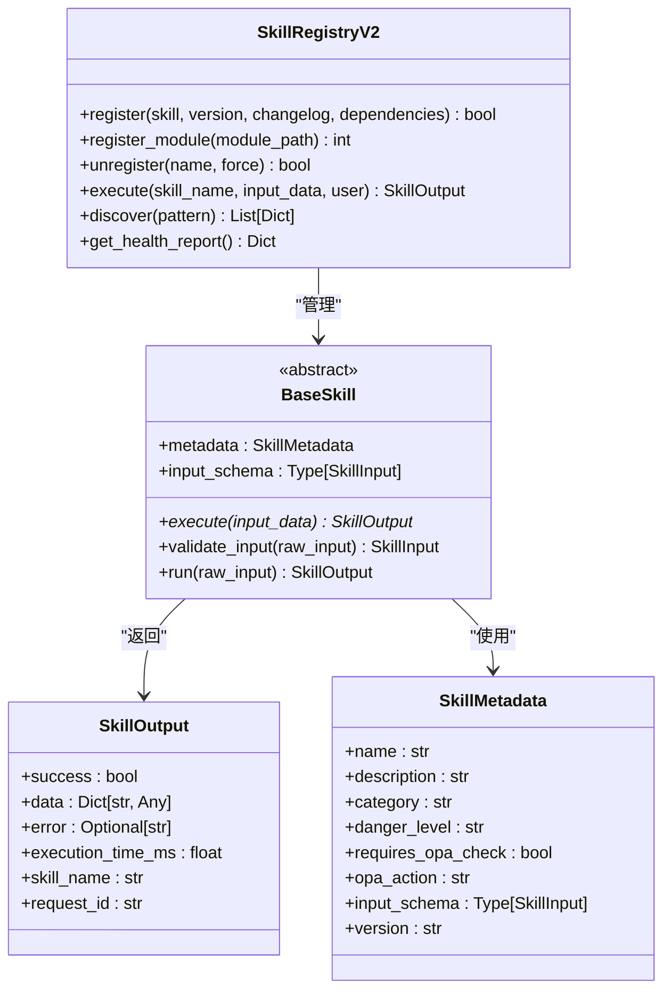
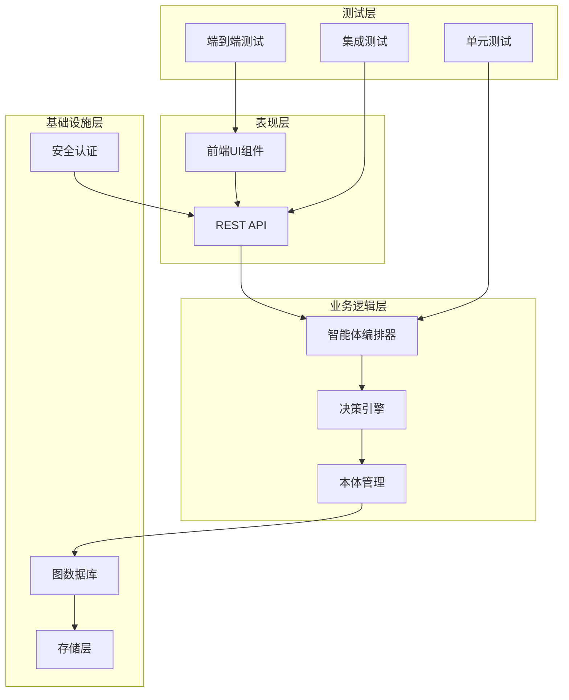
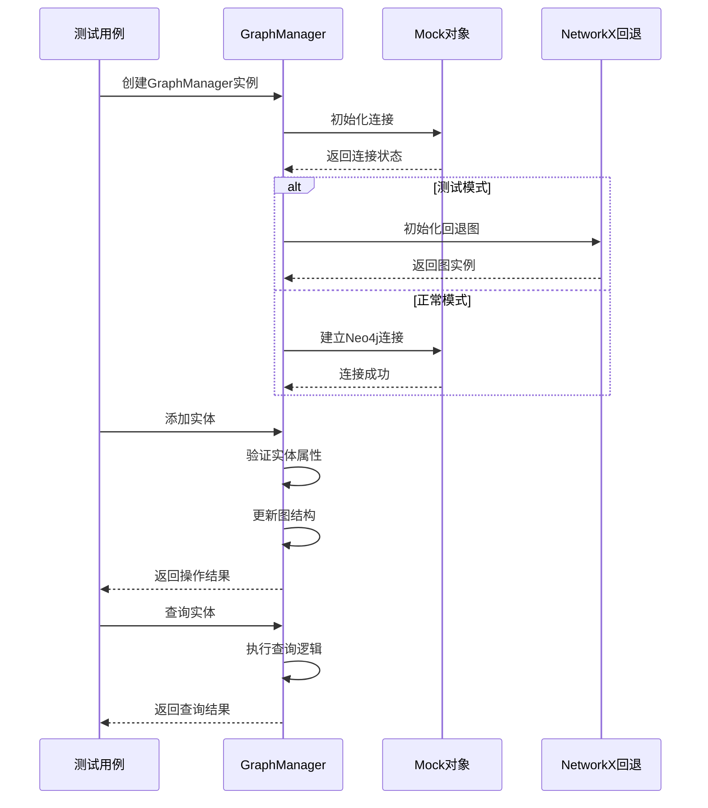
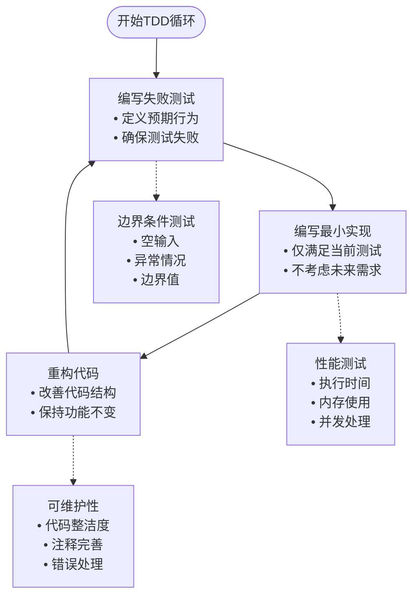
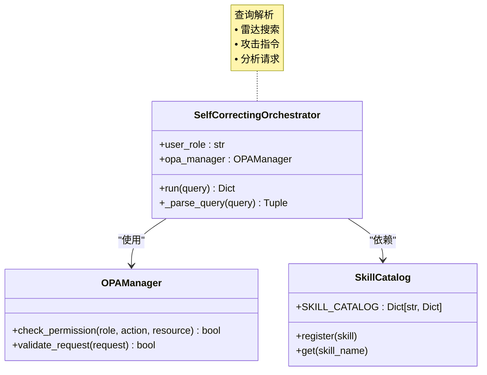
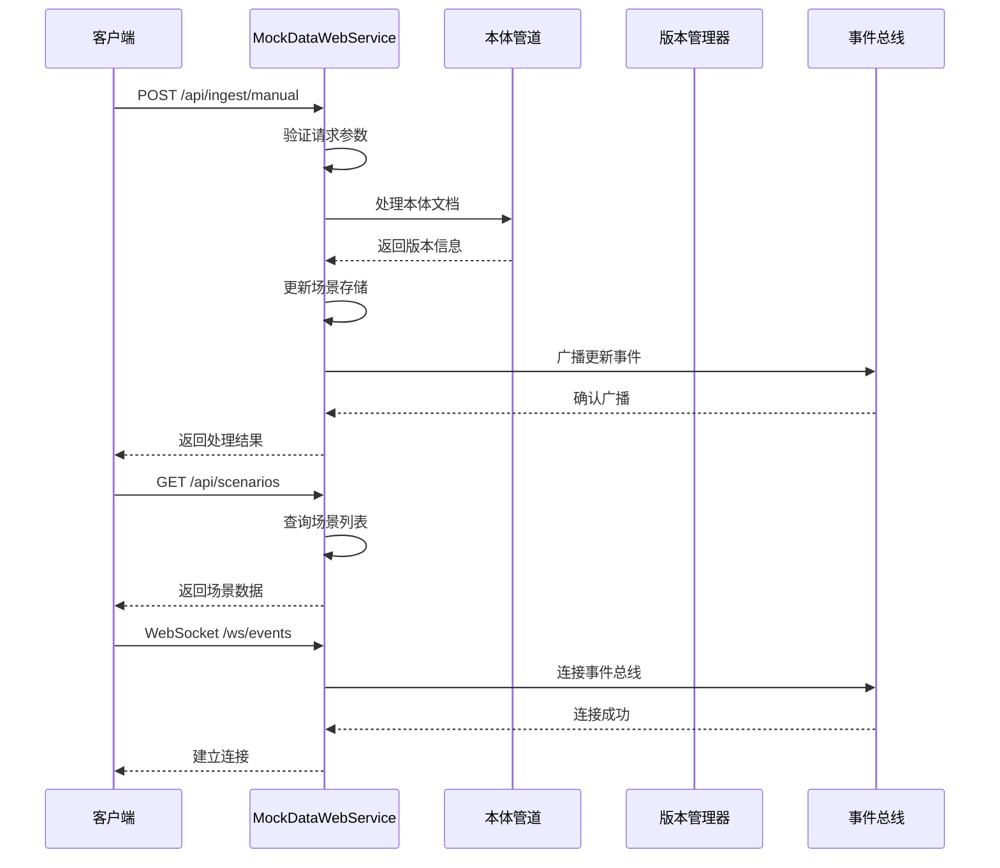
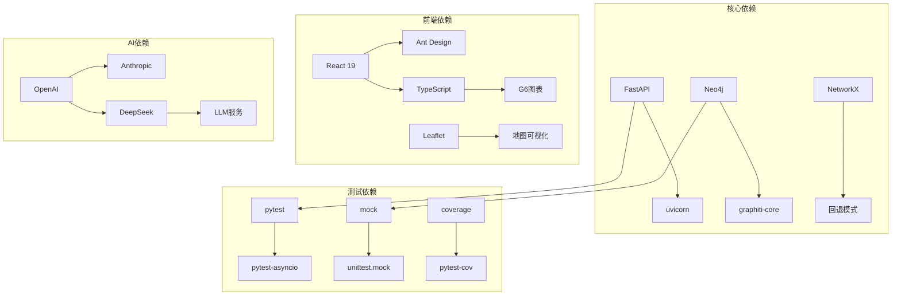
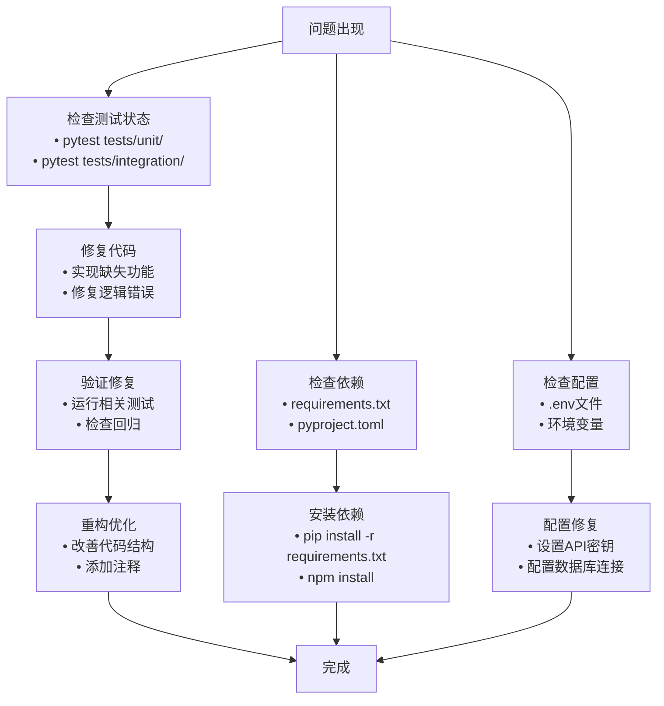

# TDD红绿重构循环技能

<cite>
**本文档引用的文件**
- [README.md](file://README.md)
- [pyproject.toml](file://pyproject.toml)
- [main.py](file://main.py)
- [odap/web/api/app.py](file://odap/web/api/app.py)
- [odap/infra/graph/graph_service.py](file://odap/infra/graph/graph_service.py)
- [odap/biz/core/agent/orchestrator.py](file://odap/biz/core/agent/orchestrator.py)
- [odap/tools/base.py](file://odap/tools/base.py)
- [tests/conftest.py](file://tests/conftest.py)
- [tests/unit/test_ontology_engine.py](file://tests/unit/test_ontology_engine.py)
- [tests/unit/test_graph_service.py](file://tests/unit/test_graph_service.py)
- [tests/unit/test_decision_recommendation.py](file://tests/unit/test_decision_recommendation.py)
- [tests/integration/test_ontology_graphiti.py](file://tests/integration/test_ontology_graphiti.py)
</cite>

## 目录
1. [简介](#简介)
2. [项目结构](#项目结构)
3. [核心组件](#核心组件)
4. [架构概览](#架构概览)
5. [详细组件分析](#详细组件分析)
6. [依赖分析](#依赖分析)
7. [性能考虑](#性能考虑)
8. [故障排除指南](#故障排除指南)
9. [结论](#结论)
10. [附录](#附录)

## 简介

本项目是一个基于本体驱动的分析决策平台，采用了全面的测试驱动开发(TDD)实践。通过红绿重构循环，开发者可以确保代码质量、功能正确性和系统的可维护性。

TDD的核心理念是在编写任何功能代码之前先编写测试，遵循"红-绿-重构"的循环过程：
- **红**：编写失败的测试
- **绿**：编写最小代码使测试通过
- **重构**：改进代码结构而不改变行为

## 项目结构

该项目采用模块化的架构设计，主要包含以下核心模块：



**图表来源**
- [README.md:27-122](file://README.md#L27-L122)

**章节来源**
- [README.md:1-241](file://README.md#L1-L241)

## 核心组件

### 测试框架配置

项目使用PyTest作为测试框架，配置了完整的测试标记和运行选项：

```mermaid
classDiagram
class PyTestConfig {
+testpaths : ["tests"]
+asyncio_mode : "auto"
+markers : [
"unit : 单元测试",
"integration : 集成测试",
"slow : 慢速测试",
"e2e : 端到端测试"
]
+addopts : "-v --tb=short"
}
class TestMarkers {
+unit : 测试标记
+integration : 集成测试标记
+slow : 慢速测试标记
+e2e : 端到端测试标记
}
PyTestConfig --> TestMarkers : "定义"
```

**图表来源**
- [pyproject.toml:1-17](file://pyproject.toml#L1-L17)

### 技能系统架构

技能系统提供了统一的抽象接口和注册机制：



**图表来源**
- [odap/tools/base.py:64-161](file://odap/tools/base.py#L64-L161)
- [odap/tools/base.py:38-46](file://odap/tools/base.py#L38-L46)
- [odap/tools/base.py:48-58](file://odap/tools/base.py#L48-L58)
- [odap/tools/base.py:599-720](file://odap/tools/base.py#L599-L720)

**章节来源**
- [odap/tools/base.py:1-720](file://odap/tools/base.py#L1-L720)

## 架构概览

系统采用分层架构设计，确保各层职责清晰分离：



**图表来源**
- [README.md:27-122](file://README.md#L27-L122)
- [main.py:58-206](file://main.py#L58-L206)

## 详细组件分析

### 图管理系统测试

图管理系统是本体驱动分析的核心组件，提供了完整的测试覆盖：



**图表来源**
- [tests/unit/test_graph_service.py:20-57](file://tests/unit/test_graph_service.py#L20-L57)
- [odap/infra/graph/graph_service.py:72-157](file://odap/infra/graph/graph_service.py#L72-L157)

#### 测试用例设计模式

系统采用多种测试设计模式确保代码质量：



**图表来源**
- [tests/unit/test_graph_service.py:78-126](file://tests/unit/test_graph_service.py#L78-L126)
- [tests/unit/test_ontology_engine.py:10-73](file://tests/unit/test_ontology_engine.py#L10-L73)

**章节来源**
- [tests/unit/test_graph_service.py:1-443](file://tests/unit/test_graph_service.py#L1-L443)
- [tests/unit/test_ontology_engine.py:1-323](file://tests/unit/test_ontology_engine.py#L1-L323)

### 智能体编排器测试

智能体编排器负责任务路由和执行逻辑，具有完善的测试覆盖：



**图表来源**
- [odap/biz/core/agent/orchestrator.py:16-115](file://odap/biz/core/agent/orchestrator.py#L16-L115)

**章节来源**
- [odap/biz/core/agent/orchestrator.py:1-151](file://odap/biz/core/agent/orchestrator.py#L1-L151)

### Web服务测试

Mock数据Web服务提供了完整的API测试环境：



**图表来源**
- [odap/web/api/app.py:43-100](file://odap/web/api/app.py#L43-L100)
- [odap/web/api/app.py:402-476](file://odap/web/api/app.py#L402-L476)

**章节来源**
- [odap/web/api/app.py:1-711](file://odap/web/api/app.py#L1-L711)

## 依赖分析

项目采用模块化依赖管理，确保各组件间的松耦合：



**图表来源**
- [README.md:16-26](file://README.md#L16-L26)

**章节来源**
- [README.md:16-26](file://README.md#L16-L26)

## 性能考虑

系统在多个层面实现了性能优化：

### 缓存策略
- LRU查询缓存：限制最大缓存大小和TTL
- 连接池管理：控制最大连接数和超时时间
- 断路器模式：防止级联故障

### 异步处理
- 异步初始化Graphiti
- 后台任务处理网络请求
- 事件驱动架构

### 性能监控
- 查询时间统计
- 缓存命中率监控
- 连接池状态跟踪

## 故障排除指南

### 常见问题及解决方案



### 调试技巧

1. **单元测试调试**：使用`pytest -v --tb=long`获取详细错误信息
2. **集成测试调试**：检查外部服务连接状态
3. **性能问题排查**：启用性能监控日志
4. **并发问题调试**：使用异步测试工具

**章节来源**
- [tests/conftest.py:1-52](file://tests/conftest.py#L1-L52)

## 结论

本项目展示了完整的TDD实践应用，通过以下关键实践确保了高质量的软件开发：

### TDD实施成果

1. **全面的测试覆盖**：单元测试、集成测试、端到端测试
2. **清晰的架构设计**：模块化、分层架构
3. **完善的工具链**：测试框架、CI/CD、监控
4. **可维护的代码**：良好的抽象、清晰的接口

### 最佳实践总结

- **测试先行**：始终先编写测试再实现功能
- **小步快跑**：持续的小重构保持代码质量
- **自动化测试**：完整的CI/CD流水线
- **文档驱动**：详细的架构文档和测试文档

这种TDD方法论的应用使得系统具有高度的可靠性、可维护性和扩展性，为复杂的企业级应用开发提供了坚实的基础。

## 附录

### 测试执行指南

```bash
# 运行所有测试
pytest tests/ -v

# 运行单元测试
pytest tests/unit/ -v

# 运行集成测试
pytest tests/integration/ -v

# 运行特定测试文件
pytest tests/unit/test_graph_service.py -v

# 生成覆盖率报告
pytest tests/ --cov=odap --cov-report=html
```

### 开发环境设置

1. **克隆项目**：`git clone <repository-url>`
2. **安装依赖**：`pip install -r requirements.txt`
3. **配置环境**：复制`.env.example`为`.env`
4. **运行测试**：`pytest tests/ -v`
5. **启动服务**：`python main.py --web`