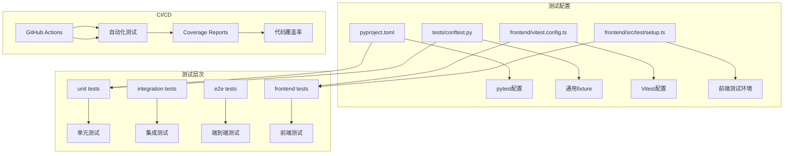
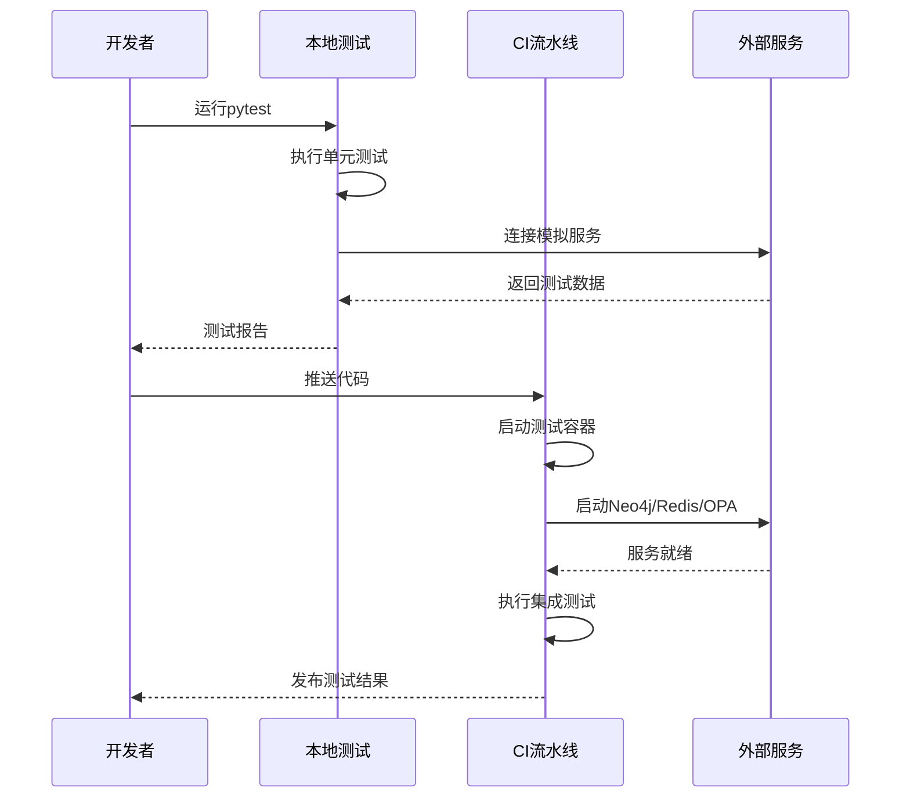
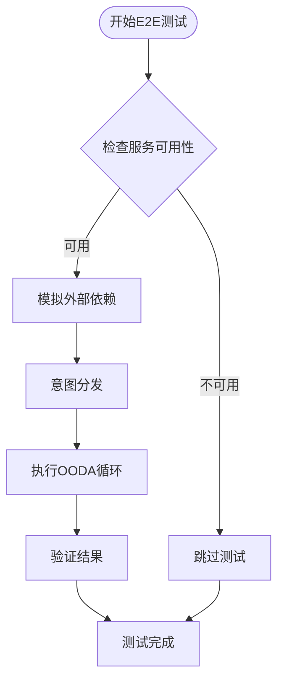
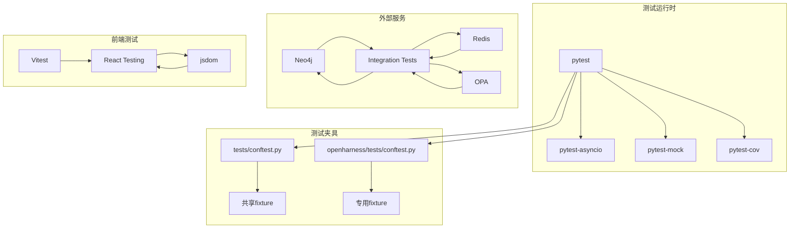

# TDD运行pytest技能

<cite>
**本文档引用的文件**
- [pyproject.toml](file://pyproject.toml)
- [tests/conftest.py](file://tests/conftest.py)
- [tests/unit/test_agent.py](file://tests/unit/test_agent.py)
- [tests/integration/test_api_integration.py](file://tests/integration/test_api_integration.py)
- [.github/workflows/test.yml](file://.github/workflows/test.yml)
- [frontend/vitest.config.ts](file://frontend/vitest.config.ts)
- [frontend/src/test/setup.ts](file://frontend/src/test/setup.ts)
- [tests/e2e/test_agent_workflow.py](file://tests/e2e/test_agent_workflow.py)
- [openharness/tests/conftest.py](file://openharness/tests/conftest.py)
- [openharness/tests/test_api/test_client.py](file://openharness/tests/test_api/test_client.py)
- [openharness/tests/test_sandbox/test_docker_backend.py](file://openharness/tests/test_sandbox/test_docker_backend.py)
</cite>

## 目录
1. [引言](#引言)
2. [项目结构](#项目结构)
3. [核心组件](#核心组件)
4. [架构概览](#架构概览)
5. [详细组件分析](#详细组件分析)
6. [依赖分析](#依赖分析)
7. [性能考虑](#性能考虑)
8. [故障排除指南](#故障排除指南)
9. [结论](#结论)

## 引言

本文档深入分析了该代码库中的TDD（测试驱动开发）和pytest运行技能，涵盖了从单元测试到端到端测试的完整测试体系。该项目采用了多层次的测试策略，包括单元测试、集成测试、端到端测试以及专门的前端测试配置。

## 项目结构

该项目采用模块化的测试架构，主要包含以下测试相关组件：

**图表来源**
- [pyproject.toml:1-17](file://pyproject.toml#L1-L17)
- [tests/conftest.py:1-52](file://tests/conftest.py#L1-L52)
- [.github/workflows/test.yml:1-122](file://.github/workflows/test.yml#L1-L122)

**章节来源**
- [pyproject.toml:1-17](file://pyproject.toml#L1-L17)
- [tests/conftest.py:1-52](file://tests/conftest.py#L1-L52)
- [.github/workflows/test.yml:1-122](file://.github/workflows/test.yml#L1-L122)

## 核心组件

### pytest配置系统

项目使用pyproject.toml集中管理pytest配置，定义了完整的测试标记系统：

| 测试标记 | 描述 | 使用场景 |
|---------|------|----------|
| `unit` | 单元测试 | 快速本地测试，不依赖外部服务 |
| `integration` | 集成测试 | 需要外部服务（Neo4j、Redis、OPA） |
| `slow` | 慢速测试 | 耗时较长的测试用例 |
| `e2e` | 端到端测试 | 完整业务流程测试 |

### 共享测试夹具

项目提供了丰富的共享测试夹具，确保测试的一致性和可维护性：

**数据库夹具**
- `mock_sqlite`: SQLite数据库模拟器
- `temp_db`: 临时数据库连接
- `tool_registry`: 工具注册表实例
- `skill_registry`: 技能注册表实例
- `audit_logger`: 审计日志记录器

**异步测试支持**
- 自动重置后台任务管理器
- 统一的任务状态等待机制
- 异步测试生命周期管理

**章节来源**
- [tests/conftest.py:11-52](file://tests/conftest.py#L11-L52)
- [openharness/tests/conftest.py:12-35](file://openharness/tests/conftest.py#L12-L35)

## 架构概览

项目采用分层测试架构，每层都有明确的职责和测试策略：

**图表来源**
- [.github/workflows/test.yml:42-84](file://.github/workflows/test.yml#L42-L84)
- [pyproject.toml:1-17](file://pyproject.toml#L1-L17)

## 详细组件分析

### 单元测试体系

单元测试专注于独立功能模块的验证，采用严格的断言模式：

**Agent测试示例**
- `TestTraceSpan`: 跟踪跨度的创建、完成和序列化
- `TestTrace`: 完整跟踪生命周期管理
- `TestTraceCollector`: 跟踪收集器的统计和查询功能
- `TestRoleManager`: 角色管理和权限验证

**测试模式特点**
- 使用`pytest.mark.asyncio`标注异步测试
- 通过`unittest.mock`创建精确的模拟对象
- 实施参数化测试覆盖边界条件
- 包含完整的异常处理测试

**章节来源**
- [tests/unit/test_agent.py:17-733](file://tests/unit/test_agent.py#L17-L733)

### 集成测试架构

集成测试使用FastAPI TestClient模拟真实API调用：

**测试覆盖范围**
- 工作空间管理API
- 本体摄入和查询API  
- 问答系统集成
- 审计日志服务
- 事件模拟器
- 技能管理系统
- 角色和权限控制

**测试策略**
- 使用`TestClient`模拟HTTP请求
- 验证完整的API端点响应
- 包含错误处理和边界条件测试
- 支持异步API调用

**章节来源**
- [tests/integration/test_api_integration.py:23-736](file://tests/integration/test_api_integration.py#L23-L736)

### 端到端测试流程

端到端测试验证完整的业务流程：

**图表来源**
- [tests/e2e/test_agent_workflow.py:25-159](file://tests/e2e/test_agent_workflow.py#L25-L159)

**章节来源**
- [tests/e2e/test_agent_workflow.py:25-159](file://tests/e2e/test_agent_workflow.py#L25-L159)

### 前端测试配置

项目同时支持Python后端测试和React前端测试：

**Vitest配置特点**
- 使用jsdom作为DOM环境
- 支持TypeScript和JSX自动转换
- 配置全局测试设置文件
- 生成多种格式的覆盖率报告

**前端测试环境准备**
- 模拟浏览器API（fetch、matchMedia等）
- 配置ResizeObserver
- 设置全局CSS样式断言
- 模块路径别名配置

**章节来源**
- [frontend/vitest.config.ts:1-29](file://frontend/vitest.config.ts#L1-L29)
- [frontend/src/test/setup.ts:1-32](file://frontend/src/test/setup.ts#L1-L32)

### OpenHarness测试体系

OpenHarness模块具有独立的测试配置和专用夹具：

**专用夹具**
- `_reset_background_task_manager`: 自动重置任务管理器
- `_wait_for_terminal_task`: 等待任务完成的辅助函数
- 支持异步测试生命周期管理

**测试覆盖**
- API客户端测试
- Docker沙箱后端测试
- 配置和设置测试
- 工具和命令测试

**章节来源**
- [openharness/tests/conftest.py:12-35](file://openharness/tests/conftest.py#L12-L35)
- [openharness/tests/test_api/test_client.py:1-194](file://openharness/tests/test_api/test_client.py#L1-L194)
- [openharness/tests/test_sandbox/test_docker_backend.py:1-294](file://openharness/tests/test_sandbox/test_docker_backend.py#L1-L294)

## 依赖分析

项目测试系统的依赖关系呈现清晰的层次结构：

**图表来源**
- [.github/workflows/test.yml:44-62](file://.github/workflows/test.yml#L44-L62)
- [pyproject.toml:1-17](file://pyproject.toml#L1-L17)

**章节来源**
- [.github/workflows/test.yml:44-62](file://.github/workflows/test.yml#L44-L62)
- [pyproject.toml:1-17](file://pyproject.toml#L1-L17)

## 性能考虑

### 测试执行优化

项目在多个层面实现了性能优化：

**并行测试执行**
- 使用pytest的内置并发支持
- 避免不必要的外部服务依赖
- 合理的测试隔离策略

**资源管理**
- 自动清理临时数据库连接
- 异步任务的及时关闭
- 内存使用监控

**测试选择策略**
- 基于标记的测试过滤
- 条件跳过不适用的测试
- 智能的外部服务检测

## 故障排除指南

### 常见测试问题

**外部服务连接失败**
- 检查服务容器是否正常启动
- 验证网络连接和端口映射
- 确认认证凭据配置正确

**测试超时问题**
- 增加适当的等待时间
- 检查异步任务的状态
- 验证资源限制设置

**覆盖率报告问题**
- 确认pytest-cov安装正确
- 检查覆盖率配置参数
- 验证源码路径设置

**章节来源**
- [.github/workflows/test.yml:76-84](file://.github/workflows/test.yml#L76-L84)

## 结论

该代码库展现了成熟的TDD实践和pytest测试框架应用。通过分层测试架构、完善的夹具系统、CI/CD集成和全面的测试覆盖，项目建立了可靠的软件质量保障体系。开发者可以借鉴其测试配置模式、夹具设计思路和测试组织方式，在其他项目中实施类似的测试驱动开发实践。