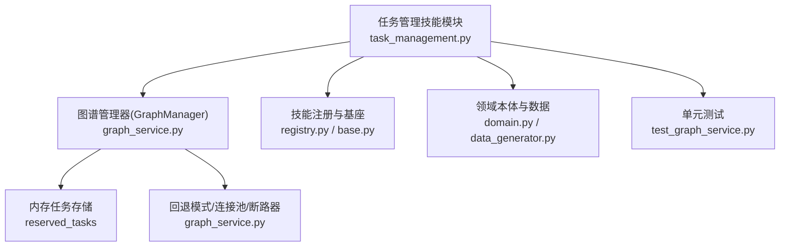
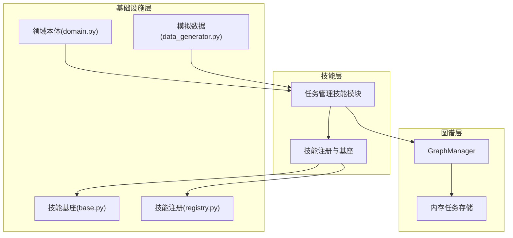
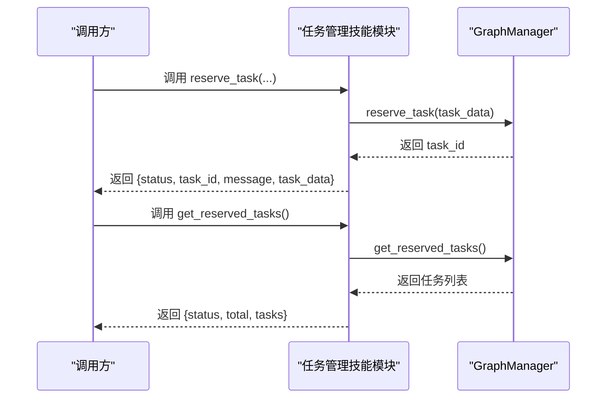
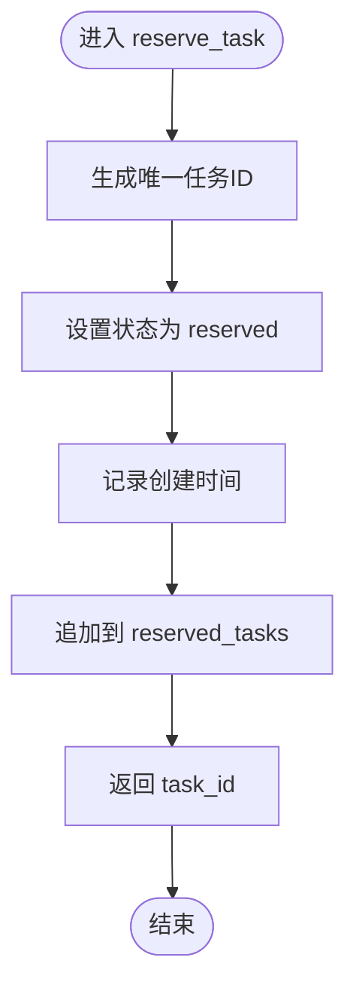
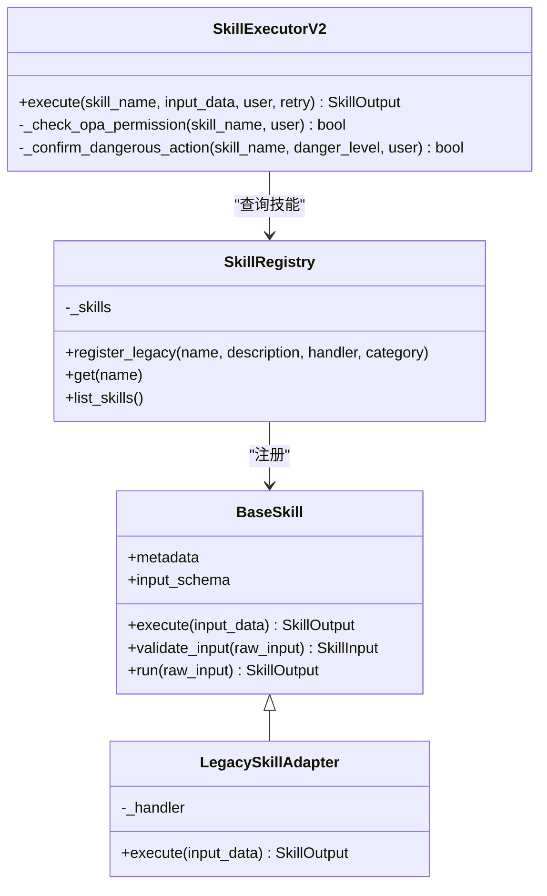
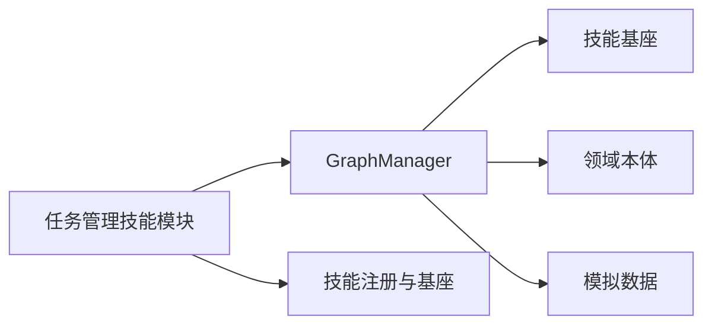

# 任务管理工具

<cite>
**本文引用的文件**
- [odap/tools/task_management/task_management.py](file://odap/tools/task_management/task_management.py)
- [odap/infra/graph/graph_service.py](file://odap/infra/graph/graph_service.py)
- [odap/tools/base.py](file://odap/tools/base.py)
- [odap/tools/registry.py](file://odap/tools/registry.py)
- [odap/biz/core/ontology/mock_data/data_generator.py](file://odap/biz/core/ontology/mock_data/data_generator.py)
- [odap/biz/core/ontology/schema/domain.py](file://odap/biz/core/ontology/schema/domain.py)
- [tests/unit/test_graph_service.py](file://tests/unit/test_graph_service.py)
- [odap/tools/planning/planning.py](file://odap/tools/planning/planning.py)
- [docs/02-architecture/ARCHITECTURE_BIZ.md](file://docs/02-architecture/ARCHITECTURE_BIZ.md)
- [docs/03-modules/swarm_orchestrator/DESIGN.md](file://docs/03-modules/swarm_orchestrator/DESIGN.md)
- [.trae/skills/speckit-tasks/SKILL.md](file://.trae/skills/speckit-tasks/SKILL.md)
- [docs/11-archive/specs/tasks.md](file://docs/11-archive/specs/tasks.md)
</cite>

## 目录
1. [简介](#简介)
2. [项目结构](#项目结构)
3. [核心组件](#核心组件)
4. [架构总览](#架构总览)
5. [详细组件分析](#详细组件分析)
6. [依赖分析](#依赖分析)
7. [性能考虑](#性能考虑)
8. [故障排查指南](#故障排查指南)
9. [结论](#结论)
10. [附录](#附录)

## 简介
本文件面向 ODAP 任务管理工具，系统性阐述其功能特性、工作流程、状态管理、优先级与资源分配策略，并提供使用指南、扩展机制、最佳实践与性能优化建议。该工具以“任务预留”为核心能力，结合图谱化的任务存储与查询，支撑任务编排、依赖管理与异常处理，适用于复杂工作流与多智能体协作场景。

## 项目结构
任务管理工具位于 odap/tools/task_management 目录，围绕以下关键模块协同工作：
- 任务管理技能模块：对外暴露 reserve_task、get_reserved_tasks、clear_reserved_tasks、get_task_by_id、cancel_task、query_tasks_by_status 等接口，封装任务生命周期管理。
- 图谱管理器：提供 reserve_task、get_reserved_tasks、clear_reserved_tasks 等底层持久化与查询能力，当前采用内存数组存储任务，具备回退模式与连接池/断路器等基础设施。
- 技能基座与注册：统一的技能抽象、输入输出模型、注册表与执行器，支持新旧两种技能注册方式与健康监控。
- 领域本体与模拟数据：提供任务、单位、事件等本体模型与模拟数据，便于任务编排与工作流落地。
- 文档与规范：任务组织、依赖关系与工作流设计文档，指导任务编排与执行。

**图表来源**
- [odap/tools/task_management/task_management.py:1-190](file://odap/tools/task_management/task_management.py#L1-L190)
- [odap/infra/graph/graph_service.py:1545-1578](file://odap/infra/graph/graph_service.py#L1545-L1578)
- [odap/tools/base.py:1-720](file://odap/tools/base.py#L1-L720)
- [odap/tools/registry.py:1-53](file://odap/tools/registry.py#L1-L53)
- [odap/biz/core/ontology/mock_data/data_generator.py:1-267](file://odap/biz/core/ontology/mock_data/data_generator.py#L1-L267)
- [odap/biz/core/ontology/schema/domain.py:1-428](file://odap/biz/core/ontology/schema/domain.py#L1-L428)

**章节来源**
- [odap/tools/task_management/task_management.py:1-190](file://odap/tools/task_management/task_management.py#L1-L190)
- [odap/infra/graph/graph_service.py:1545-1578](file://odap/infra/graph/graph_service.py#L1545-L1578)
- [odap/tools/base.py:1-720](file://odap/tools/base.py#L1-L720)
- [odap/tools/registry.py:1-53](file://odap/tools/registry.py#L1-L53)
- [odap/biz/core/ontology/mock_data/data_generator.py:1-267](file://odap/biz/core/ontology/mock_data/data_generator.py#L1-L267)
- [odap/biz/core/ontology/schema/domain.py:1-428](file://odap/biz/core/ontology/schema/domain.py#L1-L428)

## 核心组件
- 任务管理技能模块
  - 提供任务预留、查询、取消、按状态过滤等能力；内部委托 GraphManager 完成持久化与查询。
  - 通过 register_skill 注册为技能，支持统一的技能目录与执行器。
- 图谱管理器(GraphManager)
  - 提供 reserve_task/get_reserved_tasks/clear_reserved_tasks 等方法；当前以内存数组保存任务，具备回退模式与连接池/断路器等基础设施。
- 技能基座与注册
  - 统一的输入输出模型、元数据、注册表与执行器，支持健康监控、重试与 OPA 权限桥接。
- 领域本体与模拟数据
  - 提供 Unit/Mission/Event 等本体模型与模拟数据，支撑任务编排与工作流落地。
- 文档与规范
  - 任务组织、依赖关系与工作流设计文档，指导任务编排与执行。

**章节来源**
- [odap/tools/task_management/task_management.py:17-189](file://odap/tools/task_management/task_management.py#L17-L189)
- [odap/infra/graph/graph_service.py:1545-1578](file://odap/infra/graph/graph_service.py#L1545-L1578)
- [odap/tools/base.py:31-230](file://odap/tools/base.py#L31-L230)
- [odap/tools/registry.py:26-52](file://odap/tools/registry.py#L26-L52)
- [odap/biz/core/ontology/schema/domain.py:135-157](file://odap/biz/core/ontology/schema/domain.py#L135-L157)
- [odap/biz/core/ontology/mock_data/data_generator.py:25-204](file://odap/biz/core/ontology/mock_data/data_generator.py#L25-L204)

## 架构总览
任务管理工具采用“技能层-图谱层-基础设施层”的分层架构：
- 技能层：任务管理技能模块对外暴露任务生命周期接口，统一注册与执行。
- 图谱层：GraphManager 提供任务预留与查询能力，当前以内存数组存储，具备回退模式与连接池/断路器等基础设施。
- 基础设施层：技能基座提供输入输出模型、注册表、执行器与健康监控；领域本体与模拟数据为任务编排提供类型与数据支撑。

**图表来源**
- [odap/tools/task_management/task_management.py:1-190](file://odap/tools/task_management/task_management.py#L1-L190)
- [odap/infra/graph/graph_service.py:1545-1578](file://odap/infra/graph/graph_service.py#L1545-L1578)
- [odap/tools/base.py:1-720](file://odap/tools/base.py#L1-L720)
- [odap/tools/registry.py:1-53](file://odap/tools/registry.py#L1-L53)
- [odap/biz/core/ontology/schema/domain.py:1-428](file://odap/biz/core/ontology/schema/domain.py#L1-L428)
- [odap/biz/core/ontology/mock_data/data_generator.py:1-267](file://odap/biz/core/ontology/mock_data/data_generator.py#L1-L267)

## 详细组件分析

### 任务管理技能模块
- 能力概览
  - reserve_task：预留任务，分配唯一ID，设置初始状态与创建时间。
  - get_reserved_tasks：获取所有预留任务。
  - clear_reserved_tasks：清空所有预留任务。
  - get_task_by_id：按ID获取任务。
  - cancel_task：按ID取消任务。
  - query_tasks_by_status：按状态过滤任务。
- 设计要点
  - 通过 GraphManager 完成任务持久化与查询，当前采用内存数组存储。
  - 使用 register_skill 注册为技能，支持统一的技能目录与执行器。
  - 输入参数包含任务名称、类型、目标列表、优先级与用户角色等。

**图表来源**
- [odap/tools/task_management/task_management.py:17-189](file://odap/tools/task_management/task_management.py#L17-L189)
- [odap/infra/graph/graph_service.py:1545-1571](file://odap/infra/graph/graph_service.py#L1545-L1571)

**章节来源**
- [odap/tools/task_management/task_management.py:17-189](file://odap/tools/task_management/task_management.py#L17-L189)

### 图谱管理器(GraphManager)
- 能力概览
  - reserve_task：生成唯一任务ID，设置状态为 reserved，记录创建时间。
  - get_reserved_tasks：返回预留任务副本。
  - clear_reserved_tasks：清空预留任务。
- 设计要点
  - 当前以内存数组 reserved_tasks 存储任务，具备回退模式与连接池/断路器等基础设施。
  - 提供查询、更新、搜索、统计等通用图谱能力，为任务管理提供基础支撑。

**图表来源**
- [odap/infra/graph/graph_service.py:1545-1562](file://odap/infra/graph/graph_service.py#L1545-L1562)

**章节来源**
- [odap/infra/graph/graph_service.py:1545-1578](file://odap/infra/graph/graph_service.py#L1545-L1578)

### 技能基座与注册
- 能力概览
  - 统一输入输出模型、元数据、注册表与执行器，支持健康监控、重试与 OPA 权限桥接。
  - 提供 register_skill 与 LegacySkillAdapter，兼容旧式裸函数 handler。
- 设计要点
  - 新式 BaseSkill 与旧式裸函数 handler 通过 LegacySkillAdapter 适配，统一注册到 SkillRegistry。
  - SkillExecutorV2 支持 OPA 权限检查、危险级别确认与重试机制。

**图表来源**
- [odap/tools/base.py:64-230](file://odap/tools/base.py#L64-L230)
- [odap/tools/base.py:458-597](file://odap/tools/base.py#L458-L597)
- [odap/tools/registry.py:26-52](file://odap/tools/registry.py#L26-L52)

**章节来源**
- [odap/tools/base.py:1-720](file://odap/tools/base.py#L1-L720)
- [odap/tools/registry.py:1-53](file://odap/tools/registry.py#L1-L53)

### 领域本体与模拟数据
- 能力概览
  - 提供 Unit/Mission/Event 等本体模型，定义基本属性、统计属性、能力、约束、链接与动作。
  - 提供模拟数据生成器，生成 Locations/MilitaryUnits/WeaponSystems/CivilianInfrastructures/BattleEvents/Missions 等实体与事件。
- 设计要点
  - 本体模型为任务编排提供类型与关系支撑；模拟数据用于工作流与任务管理的演示与测试。

**章节来源**
- [odap/biz/core/ontology/schema/domain.py:135-157](file://odap/biz/core/ontology/schema/domain.py#L135-L157)
- [odap/biz/core/ontology/mock_data/data_generator.py:25-204](file://odap/biz/core/ontology/mock_data/data_generator.py#L25-L204)

### 工作流与编排
- 能力概览
  - planning 模块提供工作流规划与执行能力，支持按步骤执行与结果汇总。
  - swarm_orchestrator 与 ARCHITECTURE_BIZ 文档描述多智能体协作与 OODA 循环执行。
- 设计要点
  - 任务管理工具可与工作流引擎结合，形成“任务预留—工作流执行—状态回写”的闭环。

**章节来源**
- [odap/tools/planning/planning.py:113-165](file://odap/tools/planning/planning.py#L113-L165)
- [docs/02-architecture/ARCHITECTURE_BIZ.md:92-186](file://docs/02-architecture/ARCHITECTURE_BIZ.md#L92-L186)
- [docs/03-modules/swarm_orchestrator/DESIGN.md:136-230](file://docs/03-modules/swarm_orchestrator/DESIGN.md#L136-L230)

## 依赖分析
- 组件耦合
  - 任务管理技能模块依赖 GraphManager 完成任务持久化与查询。
  - GraphManager 依赖技能基座与注册机制，以支持统一的技能执行与健康监控。
- 外部依赖
  - 领域本体与模拟数据为任务编排提供类型与数据支撑。
  - 文档与规范指导任务组织与依赖关系设计。

**图表来源**
- [odap/tools/task_management/task_management.py:1-190](file://odap/tools/task_management/task_management.py#L1-L190)
- [odap/infra/graph/graph_service.py:1-2256](file://odap/infra/graph/graph_service.py#L1-L2256)
- [odap/tools/base.py:1-720](file://odap/tools/base.py#L1-L720)
- [odap/biz/core/ontology/schema/domain.py:1-428](file://odap/biz/core/ontology/schema/domain.py#L1-L428)
- [odap/biz/core/ontology/mock_data/data_generator.py:1-267](file://odap/biz/core/ontology/mock_data/data_generator.py#L1-L267)

**章节来源**
- [odap/tools/task_management/task_management.py:1-190](file://odap/tools/task_management/task_management.py#L1-L190)
- [odap/infra/graph/graph_service.py:1-2256](file://odap/infra/graph/graph_service.py#L1-L2256)
- [odap/tools/base.py:1-720](file://odap/tools/base.py#L1-L720)

## 性能考虑
- 内存存储与回退模式
  - GraphManager 当前以内存数组存储任务，适合小规模任务管理；若任务量增大，建议迁移到持久化存储（如 Neo4j）。
- 连接池与断路器
  - GraphManager 提供连接池与断路器机制，提升数据库访问稳定性；在任务管理场景中可复用该机制。
- 搜索与查询
  - GraphManager 提供查询、搜索、统计等能力，建议在高频查询场景中引入缓存与索引优化。
- 技能执行器
  - SkillExecutorV2 支持重试与健康监控，建议在任务管理的高并发场景中启用重试与熔断策略。

[本节为通用性能讨论，不直接分析具体文件]

## 故障排查指南
- 常见问题
  - 任务不存在：get_task_by_id 与 cancel_task 在任务不存在时返回错误信息。
  - 目标列表为空：reserve_task 对空目标列表进行校验并返回错误。
  - 清空任务：clear_reserved_tasks 可清空所有预留任务。
- 单元测试参考
  - 测试覆盖任务预留状态、多任务预留、任务查询返回副本、清空任务等场景。

**章节来源**
- [odap/tools/task_management/task_management.py:31-128](file://odap/tools/task_management/task_management.py#L31-L128)
- [tests/unit/test_graph_service.py:339-368](file://tests/unit/test_graph_service.py#L339-L368)

## 结论
ODAP 任务管理工具以“任务预留”为核心，结合技能层、图谱层与基础设施层，提供了任务创建、查询、取消与按状态过滤等基础能力。当前采用内存存储，适合小规模任务管理；通过 GraphManager 的回退模式与连接池/断路器机制，具备良好的扩展性。结合领域本体与工作流设计文档，可进一步完善任务编排、依赖管理与异常处理，支撑复杂工作流与多智能体协作场景。

[本节为总结性内容，不直接分析具体文件]

## 附录

### 使用指南
- 任务创建
  - 调用 reserve_task 接口，传入任务名称、类型、目标列表、优先级与用户角色，获取任务ID与预留结果。
- 任务查询
  - 使用 get_reserved_tasks 获取所有预留任务；使用 get_task_by_id 按ID获取特定任务；使用 query_tasks_by_status 按状态过滤。
- 任务管理
  - 使用 cancel_task 取消指定任务；使用 clear_reserved_tasks 清空所有预留任务。
- 与工作流结合
  - 结合 planning 模块的工作流规划与执行能力，形成“任务预留—工作流执行—状态回写”的闭环。

**章节来源**
- [odap/tools/task_management/task_management.py:17-189](file://odap/tools/task_management/task_management.py#L17-L189)
- [odap/tools/planning/planning.py:113-165](file://odap/tools/planning/planning.py#L113-L165)

### 扩展机制与集成接口
- 自定义任务类型
  - 基于领域本体模型，可在本体中新增任务类型与属性，配合模拟数据生成器扩展测试数据。
- 技能扩展
  - 通过 BaseSkill 与 register_skill 注册新技能，支持统一的输入输出模型与执行器。
- 集成接口
  - 任务管理技能模块通过 GraphManager 与基础设施层对接，支持 OPA 权限检查与健康监控。

**章节来源**
- [odap/biz/core/ontology/schema/domain.py:135-157](file://odap/biz/core/ontology/schema/domain.py#L135-L157)
- [odap/tools/base.py:64-230](file://odap/tools/base.py#L64-L230)
- [odap/tools/registry.py:26-52](file://odap/tools/registry.py#L26-L52)

### 最佳实践与性能优化建议
- 任务组织与依赖
  - 参考任务组织与依赖关系文档，合理划分任务粒度与依赖关系，降低耦合度。
- 优先级与资源分配
  - 在任务预留时明确优先级与截止时间，结合工作流引擎进行资源调度与执行。
- 性能优化
  - 在任务量增大时，考虑迁移到持久化存储；利用连接池与断路器提升稳定性；在高频查询场景引入缓存与索引。
- 异常处理
  - 通过单元测试覆盖常见异常场景，结合技能执行器的重试与健康监控机制，提升系统鲁棒性。

**章节来源**
- [.trae/skills/speckit-tasks/SKILL.md:162-196](file://.trae/skills/speckit-tasks/SKILL.md#L162-L196)
- [docs/11-archive/specs/tasks.md:107-126](file://docs/11-archive/specs/tasks.md#L107-L126)
- [odap/infra/graph/graph_service.py:1-2256](file://odap/infra/graph/graph_service.py#L1-L2256)
- [odap/tools/base.py:458-597](file://odap/tools/base.py#L458-L597)