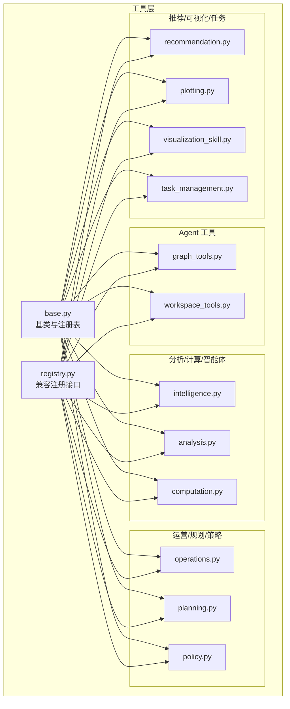
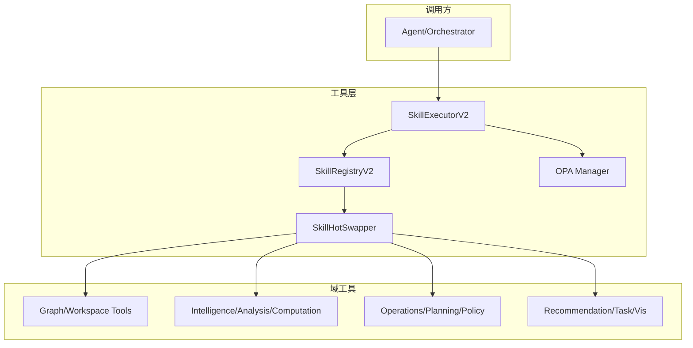
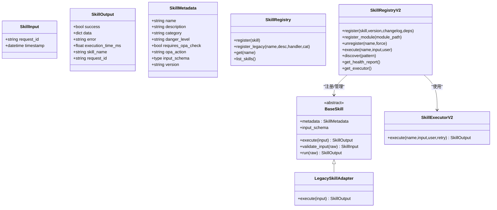
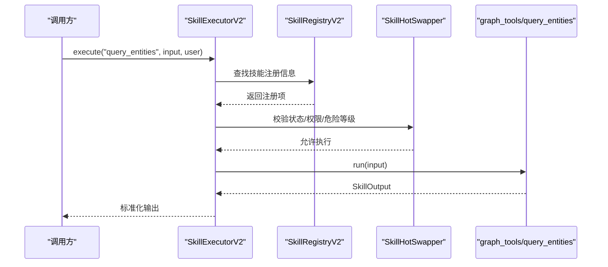
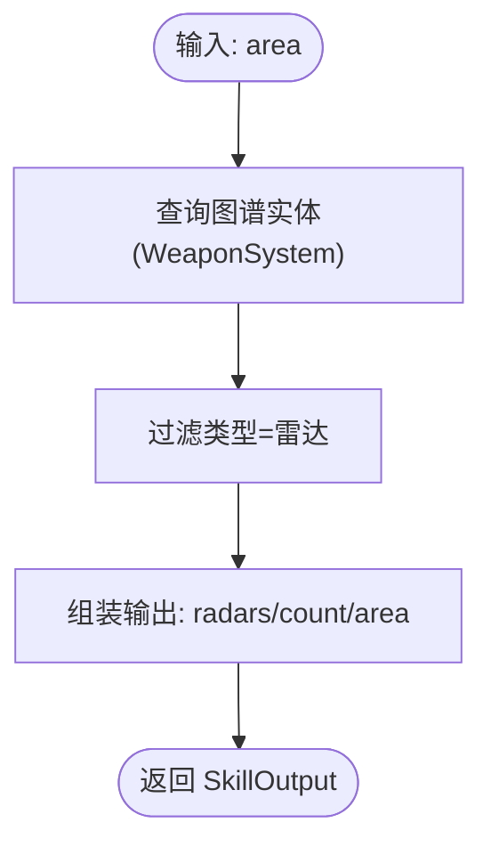
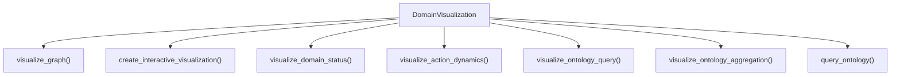
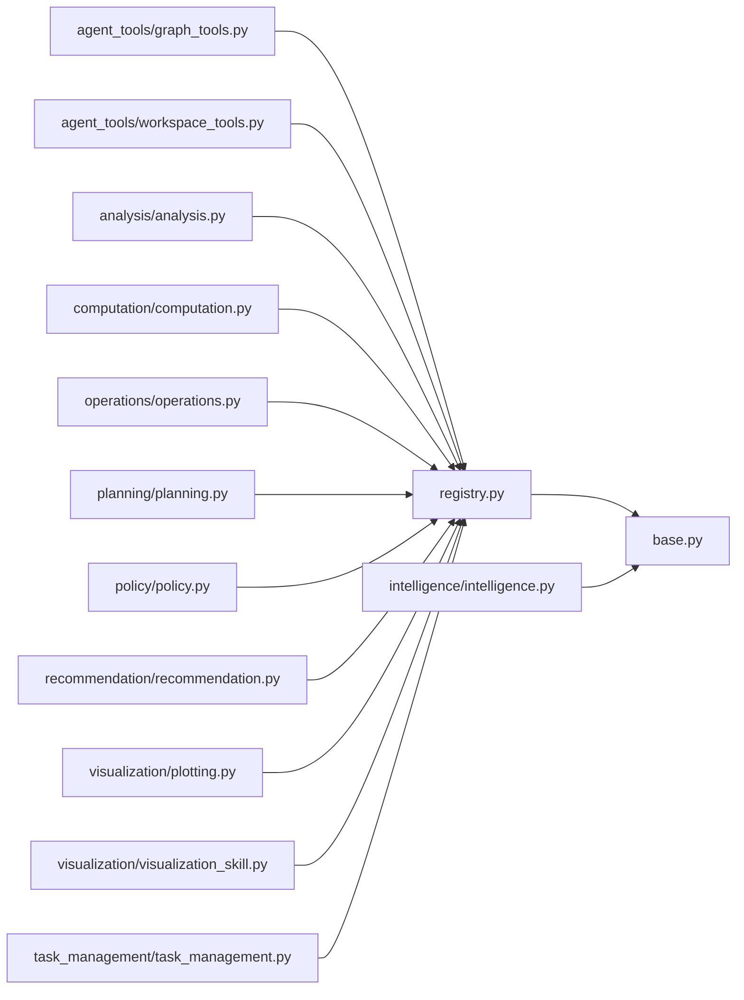

# 内置工具集

<cite>
**本文引用的文件**
- [odap/tools/__init__.py](file://odap/tools/__init__.py)
- [odap/tools/base.py](file://odap/tools/base.py)
- [odap/tools/registry.py](file://odap/tools/registry.py)
- [odap/tools/agent_tools/__init__.py](file://odap/tools/agent_tools/__init__.py)
- [odap/tools/agent_tools/graph_tools.py](file://odap/tools/agent_tools/graph_tools.py)
- [odap/tools/agent_tools/workspace_tools.py](file://odap/tools/agent_tools/workspace_tools.py)
- [odap/tools/intelligence/intelligence.py](file://odap/tools/intelligence/intelligence.py)
- [odap/tools/analysis/analysis.py](file://odap/tools/analysis/analysis.py)
- [odap/tools/computation/computation.py](file://odap/tools/computation/computation.py)
- [odap/tools/operations/operations.py](file://odap/tools/operations/operations.py)
- [odap/tools/planning/planning.py](file://odap/tools/planning/planning.py)
- [odap/tools/policy/policy.py](file://odap/tools/policy/policy.py)
- [odap/tools/recommendation/recommendation.py](file://odap/tools/recommendation/recommendation.py)
- [odap/tools/visualization/plotting.py](file://odap/tools/visualization/plotting.py)
- [odap/tools/visualization/visualization_skill.py](file://odap/tools/visualization/visualization_skill.py)
- [odap/tools/task_management/task_management.py](file://odap/tools/task_management/task_management.py)
</cite>

## 目录
1. [简介](#简介)
2. [项目结构](#项目结构)
3. [核心组件](#核心组件)
4. [架构总览](#架构总览)
5. [详细组件分析](#详细组件分析)
6. [依赖分析](#依赖分析)
7. [性能考量](#性能考量)
8. [故障排查指南](#故障排查指南)
9. [结论](#结论)
10. [附录](#附录)

## 简介
本文件系统性梳理 ODAP 内置工具集，覆盖数据分析、计算推理、可视化、智能体工具、任务管理、规划编排、策略与权限控制等模块。文档面向不同层次读者，既提供高层架构说明，也给出代码级关系图与实现要点，帮助开发者快速理解与扩展工具体系。

## 项目结构
ODAP 工具层位于 odap/tools，采用“按功能域分包 + 统一注册”的组织方式：
- 工具注册与基类：odap/tools/base.py、odap/tools/registry.py
- 工具域模块：agent_tools、intelligence、analysis、computation、operations、planning、policy、recommendation、visualization、task_management
- 工具域入口：odap/tools/agent_tools/__init__.py 等

**图示来源**
- [odap/tools/base.py](file://odap/tools/base.py)
- [odap/tools/registry.py](file://odap/tools/registry.py)
- [odap/tools/agent_tools/__init__.py](file://odap/tools/agent_tools/__init__.py)
- [odap/tools/agent_tools/graph_tools.py](file://odap/tools/agent_tools/graph_tools.py)
- [odap/tools/agent_tools/workspace_tools.py](file://odap/tools/agent_tools/workspace_tools.py)
- [odap/tools/intelligence/intelligence.py](file://odap/tools/intelligence/intelligence.py)
- [odap/tools/analysis/analysis.py](file://odap/tools/analysis/analysis.py)
- [odap/tools/computation/computation.py](file://odap/tools/computation/computation.py)
- [odap/tools/operations/operations.py](file://odap/tools/operations/operations.py)
- [odap/tools/planning/planning.py](file://odap/tools/planning/planning.py)
- [odap/tools/policy/policy.py](file://odap/tools/policy/policy.py)
- [odap/tools/recommendation/recommendation.py](file://odap/tools/recommendation/recommendation.py)
- [odap/tools/visualization/plotting.py](file://odap/tools/visualization/plotting.py)
- [odap/tools/visualization/visualization_skill.py](file://odap/tools/visualization/visualization_skill.py)
- [odap/tools/task_management/task_management.py](file://odap/tools/task_management/task_management.py)

**章节来源**
- [odap/tools/__init__.py](file://odap/tools/__init__.py)
- [odap/tools/base.py](file://odap/tools/base.py)
- [odap/tools/registry.py](file://odap/tools/registry.py)

## 核心组件
- 统一基类与输入输出模型：BaseSkill、SkillInput、SkillOutput、SkillMetadata
- 注册与发现：SKILL_CATALOG（兼容旧式）、SkillRegistry（v1）、SkillRegistryV2（v2，含热插拔、版本管理、健康监控）
- 执行器：SkillExecutorV2（支持 OPA 权限桥接、重试、危险等级确认）

关键点
- 输入输出标准化：所有输出包含 success/data/error/skill_name/request_id 等字段，便于统一处理与可观测性
- 元数据驱动：通过 category、danger_level、requires_opa_check、opa_action 控制分类、权限与安全策略
- 双注册兼容：同时维护旧式 SKILL_CATALOG 与新式 SkillRegistry，保证向后兼容

**章节来源**
- [odap/tools/base.py](file://odap/tools/base.py)
- [odap/tools/registry.py](file://odap/tools/registry.py)

## 架构总览
工具体系采用“域模块 + 统一基类 + 注册表 + 执行器”的分层架构，支持：
- 域内工具：按功能域划分，如 Agent 工具、分析工具、计算工具、可视化工具等
- 统一抽象：BaseSkill 抽象出 execute()，兼容旧式裸函数 handler
- 注册与发现：支持模块级批量注册、动态发现、健康状态上报
- 权限与安全：OPA 权限桥接、危险等级确认、重试与失败处理

**图示来源**
- [odap/tools/base.py](file://odap/tools/base.py)
- [odap/tools/registry.py](file://odap/tools/registry.py)
- [odap/tools/agent_tools/graph_tools.py](file://odap/tools/agent_tools/graph_tools.py)
- [odap/tools/agent_tools/workspace_tools.py](file://odap/tools/agent_tools/workspace_tools.py)
- [odap/tools/intelligence/intelligence.py](file://odap/tools/intelligence/intelligence.py)
- [odap/tools/analysis/analysis.py](file://odap/tools/analysis/analysis.py)
- [odap/tools/computation/computation.py](file://odap/tools/computation/computation.py)
- [odap/tools/operations/operations.py](file://odap/tools/operations/operations.py)
- [odap/tools/planning/planning.py](file://odap/tools/planning/planning.py)
- [odap/tools/policy/policy.py](file://odap/tools/policy/policy.py)
- [odap/tools/recommendation/recommendation.py](file://odap/tools/recommendation/recommendation.py)
- [odap/tools/task_management/task_management.py](file://odap/tools/task_management/task_management.py)
- [odap/tools/visualization/plotting.py](file://odap/tools/visualization/plotting.py)
- [odap/tools/visualization/visualization_skill.py](file://odap/tools/visualization/visualization_skill.py)

## 详细组件分析

### 统一基类与注册表
- BaseSkill：定义 execute() 抽象方法；run() 封装输入校验、执行与计时；validate_input() 支持自定义输入模型
- LegacySkillAdapter：兼容旧式裸函数 handler，逐步迁移到 BaseSkill
- SkillRegistry/SkillRegistryV2：v1 仅注册实例；v2 增加热插拔、版本管理、健康监控、依赖管理、执行器集成
- SkillExecutorV2：执行前进行 OPA 权限检查、危险等级确认、重试与健康指标更新

**图示来源**
- [odap/tools/base.py](file://odap/tools/base.py)
- [odap/tools/registry.py](file://odap/tools/registry.py)

**章节来源**
- [odap/tools/base.py](file://odap/tools/base.py)
- [odap/tools/registry.py](file://odap/tools/registry.py)

### Agent 工具集
- 图谱操作：查询实体、查询关系、图谱分析、全文检索、实体详情
- 工作空间：列举工作空间、获取详情、生成摘要报告
- 注册方式：沿用旧式 register_skill() 写入 SKILL_CATALOG，并同步到 SkillRegistry

**图示来源**
- [odap/tools/base.py](file://odap/tools/base.py)
- [odap/tools/agent_tools/graph_tools.py](file://odap/tools/agent_tools/graph_tools.py)

**章节来源**
- [odap/tools/agent_tools/__init__.py](file://odap/tools/agent_tools/__init__.py)
- [odap/tools/agent_tools/graph_tools.py](file://odap/tools/agent_tools/graph_tools.py)
- [odap/tools/agent_tools/workspace_tools.py](file://odap/tools/agent_tools/workspace_tools.py)

### 智能体工具（BaseSkill 迁移示例）
- RadarSearchSkill：按区域检索雷达，返回实体列表与计数
- AnalyzeDomainSkill：读取图谱统计生成态势分析与建议
- 旧式接口：search_radar()/analyze_domain() 通过 BaseSkill.run() 委托实现

**图示来源**
- [odap/tools/intelligence/intelligence.py](file://odap/tools/intelligence/intelligence.py)

**章节来源**
- [odap/tools/intelligence/intelligence.py](file://odap/tools/intelligence/intelligence.py)

### 分析工具
- 实体状态分析、领域事件分析、力量对比、武器能力分析、民用设施分析、领域态势摘要
- 数据来源：模拟数据生成器与图谱统计

**章节来源**
- [odap/tools/analysis/analysis.py](file://odap/tools/analysis/analysis.py)

### 计算工具
- 距离计算、攻击结果预测、威胁等级分析、打击毁伤评估
- 逻辑：基于模拟数据与启发式规则，输出概率、等级与建议

**章节来源**
- [odap/tools/computation/computation.py](file://odap/tools/computation/computation.py)

### 运营工具（高危/需权限）
- 攻击目标、指挥部队：通过 OPA 管理器进行权限校验，fail-close 设计确保目标存在性
- 危险等级：高危/关键操作需管理员或确认动作

**章节来源**
- [odap/tools/operations/operations.py](file://odap/tools/operations/operations.py)

### 规划工具
- 创建计划：根据目标生成步骤、所需技能、预估时间
- 执行工作流：模拟执行过程并返回阶段性结果
- 计划验证与资源估算：检查技能可用性、统计总耗时与人员成本

**章节来源**
- [odap/tools/planning/planning.py](file://odap/tools/planning/planning.py)

### 策略与权限
- 策略模拟执行：基于角色权限与限制判断操作合法性
- 策略版本管理：导出/导入/回滚策略版本
- 权限检查：OPA 桥接，支持 action/resource_type 粒度

**章节来源**
- [odap/tools/policy/policy.py](file://odap/tools/policy/policy.py)

### 推荐工具
- 打击目标推荐、任务规划推荐、兵力部署建议、打击风险评估
- 角色限制：部分功能仅指挥官或情报分析师可访问

**章节来源**
- [odap/tools/recommendation/recommendation.py](file://odap/tools/recommendation/recommendation.py)

### 可视化工具
- 领域态势可视化：静态图、交互图、实体分布饼图
- 处置动态查看：表格展示任务与事件状态
- 本体查询与聚合：按类型/区域/状态筛选与属性聚合
- 报告与地图叠加：生成态势报告、GeoJSON 叠加层

**图示来源**
- [odap/tools/visualization/plotting.py](file://odap/tools/visualization/plotting.py)
- [odap/tools/visualization/visualization_skill.py](file://odap/tools/visualization/visualization_skill.py)

**章节来源**
- [odap/tools/visualization/plotting.py](file://odap/tools/visualization/plotting.py)
- [odap/tools/visualization/visualization_skill.py](file://odap/tools/visualization/visualization_skill.py)

### 任务管理
- 任务预留、查询、取消、清理、按状态过滤
- 基于图谱的预留任务存储与检索

**章节来源**
- [odap/tools/task_management/task_management.py](file://odap/tools/task_management/task_management.py)

## 依赖分析
- 工具层依赖关系
  - 域工具通过 odap.tools.register_skill() 注册到 SKILL_CATALOG
  - 域工具通过 odap.tools.base.* 获取统一基类与注册表能力
  - 高危/运营工具依赖 OPA 管理器进行权限校验
  - 可视化工具依赖图谱管理器与第三方绘图库
- 循环依赖规避
  - 通过延迟导入（如 from odap.tools.base import ...）避免循环
  - 注册表与工具模块解耦，通过字符串名与反射配合

**图示来源**
- [odap/tools/registry.py](file://odap/tools/registry.py)
- [odap/tools/base.py](file://odap/tools/base.py)
- [odap/tools/agent_tools/graph_tools.py](file://odap/tools/agent_tools/graph_tools.py)
- [odap/tools/agent_tools/workspace_tools.py](file://odap/tools/agent_tools/workspace_tools.py)
- [odap/tools/intelligence/intelligence.py](file://odap/tools/intelligence/intelligence.py)
- [odap/tools/analysis/analysis.py](file://odap/tools/analysis/analysis.py)
- [odap/tools/computation/computation.py](file://odap/tools/computation/computation.py)
- [odap/tools/operations/operations.py](file://odap/tools/operations/operations.py)
- [odap/tools/planning/planning.py](file://odap/tools/planning/planning.py)
- [odap/tools/policy/policy.py](file://odap/tools/policy/policy.py)
- [odap/tools/recommendation/recommendation.py](file://odap/tools/recommendation/recommendation.py)
- [odap/tools/visualization/plotting.py](file://odap/tools/visualization/plotting.py)
- [odap/tools/visualization/visualization_skill.py](file://odap/tools/visualization/visualization_skill.py)
- [odap/tools/task_management/task_management.py](file://odap/tools/task_management/task_management.py)

**章节来源**
- [odap/tools/registry.py](file://odap/tools/registry.py)
- [odap/tools/base.py](file://odap/tools/base.py)

## 性能考量
- 执行计时：统一在 BaseSkill.run() 与 SkillExecutorV2.execute() 中记录耗时，便于健康监控与性能分析
- 重试机制：默认最多重试次数与固定延迟，降低瞬时异常对调用方的影响
- 健康指标：总调用次数、成功/失败次数、平均耗时、最近错误等，支持健康报告
- 可视化开销：交互式图表与大图谱渲染可能带来内存与 CPU 压力，建议按需生成与缓存

[本节为通用指导，无需特定文件引用]

## 故障排查指南
- 权限拒绝
  - 现象：输出 error="Permission denied"
  - 排查：确认 requires_opa_check/opa_action 设置、用户角色与资源类型、策略版本
- 危险操作被阻断
  - 现象：输出 Action requires confirmation
  - 排查：确认 danger_level 与用户确认动作列表或管理员角色
- 技能不存在/禁用
  - 现象：输出 Skill not found / Skill is disabled
  - 排查：检查技能注册状态与健康信息
- 执行失败
  - 现象：success=false，error 字段包含异常信息
  - 排查：查看最近错误与总失败次数，结合日志定位

**章节来源**
- [odap/tools/base.py](file://odap/tools/base.py)

## 结论
ODAP 内置工具集通过统一基类、标准化输入输出、双注册兼容与 v2 注册表，实现了从简单工具到复杂域工具的一致体验。结合 OPA 权限与健康监控，工具体系具备良好的安全性与可运维性。建议在新增工具时优先采用 BaseSkill，充分利用元数据驱动的分类、权限与安全控制，并通过 SkillRegistryV2 的热插拔与健康报告提升系统弹性。

[本节为总结，无需特定文件引用]

## 附录

### 工具分类与分级
- 按功能分类
  - 智能体/Agent：图谱查询、工作空间管理
  - 分析：实体状态、事件、力量对比、武器能力、基础设施
  - 计算：距离、威胁、结果预测、毁伤评估
  - 运营：攻击、指挥（高危/需权限）
  - 规划：计划创建、工作流执行、验证与资源估算
  - 策略：策略模拟、版本管理、权限检查
  - 推荐：目标推荐、任务规划、部署建议、风险评估
  - 可视化：图谱、态势、查询与聚合、报告
  - 任务：预留、查询、取消、清理
- 按复杂度分级
  - 简单：图谱查询、状态摘要、基础计算
  - 中等：威胁/结果预测、计划与验证
  - 复杂：可视化、策略版本管理、交互式图表
- 按权限控制
  - 低危：多数查询与分析
  - 高危/关键：攻击、指挥、策略回滚等，需 OPA 校验与确认

[本节为概念性说明，无需特定文件引用]

### 使用示例与最佳实践
- 常见用法
  - 查询实体：传入实体类型/区域/限制，返回实体列表
  - 分析领域：获取图谱统计，生成态势报告与建议
  - 计算威胁：传入区域或目标，得到威胁等级与建议
- 组合使用
  - 先检索雷达，再做威胁分析，最后生成计划并执行
- 参数调优
  - 合理设置 limit/时间范围/区域过滤，减少数据量
  - 对高危操作开启确认流程，避免误操作

[本节为概念性说明，无需特定文件引用]

### 扩展机制
- 自定义工具开发
  - 继承 BaseSkill，实现 execute()，声明 metadata 与 input_schema
  - 通过 get_registry().register() 或 SkillRegistryV2.register() 注册
- 第三方工具集成
  - 通过 register_skill() 保持向后兼容，或直接注册 BaseSkill 实例
  - 使用 SkillRegistryV2.register_module() 批量加载模块内工具
- 插件化支持
  - 借助 SkillHotSwapper 的热插拔能力，动态启用/禁用/卸载工具
  - 通过 discover() 与健康报告实现可观测与治理

**章节来源**
- [odap/tools/base.py](file://odap/tools/base.py)
- [odap/tools/registry.py](file://odap/tools/registry.py)