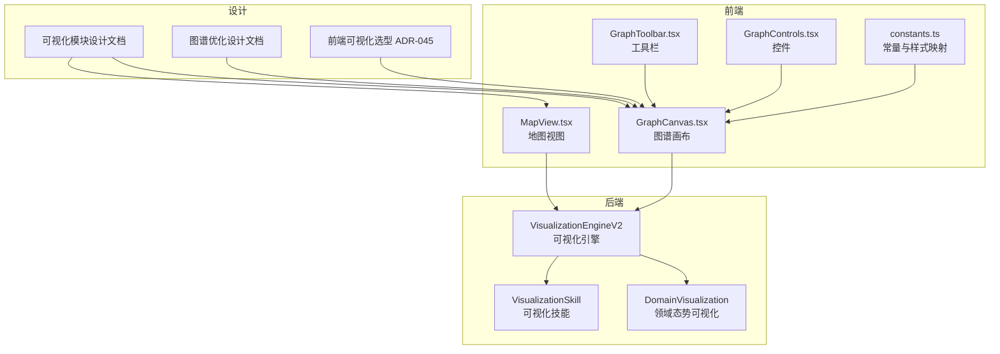
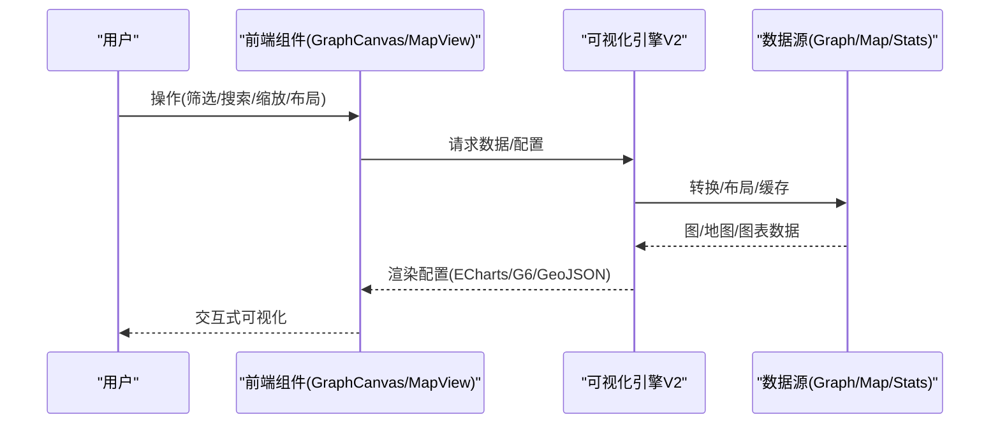
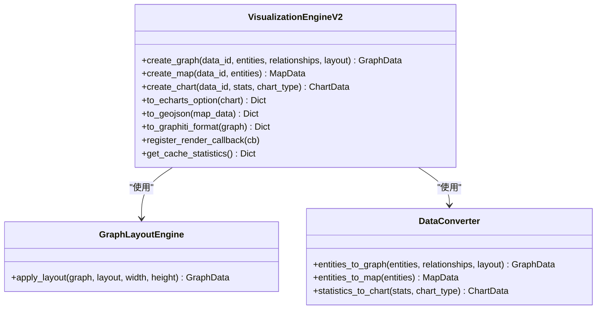
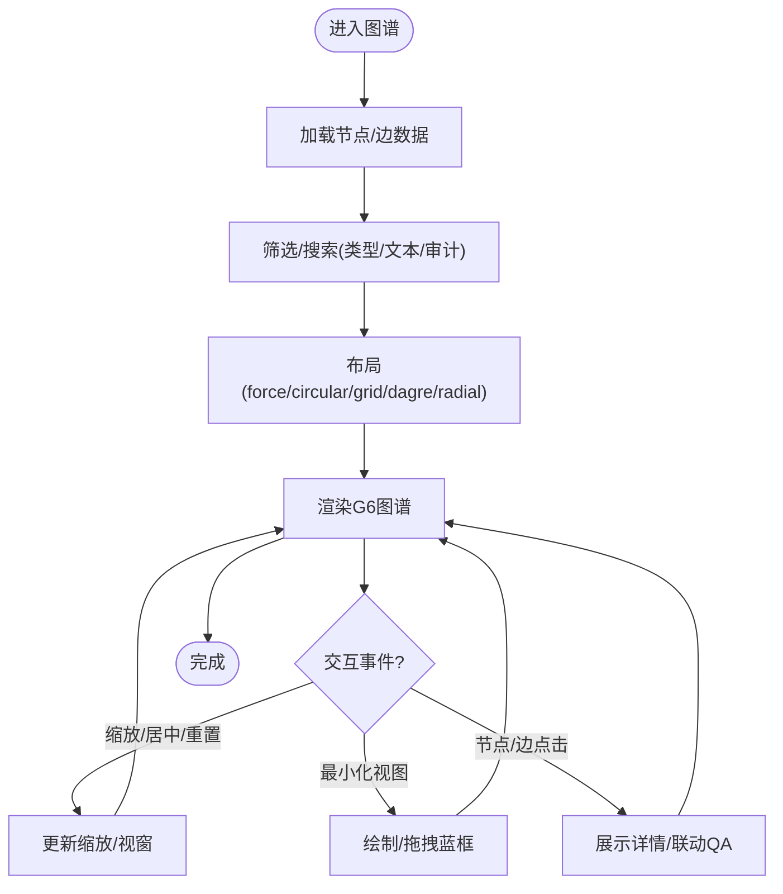
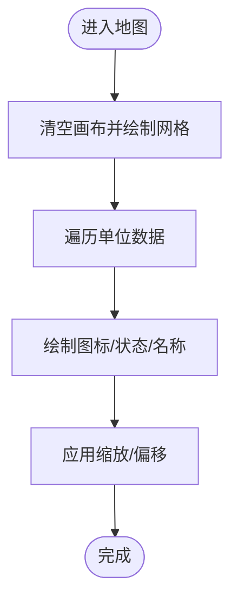
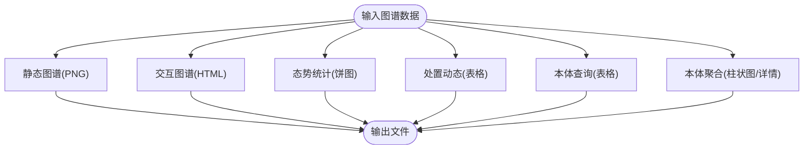
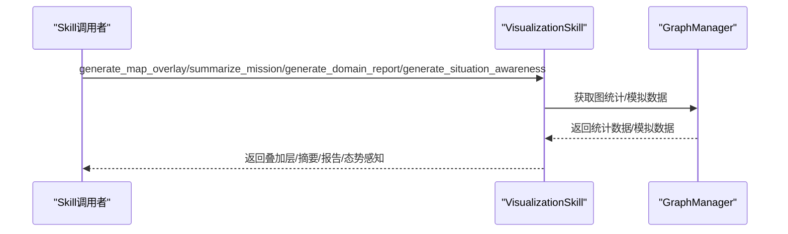

# 可视化工具

<cite>
**本文引用的文件**
- [可视化模块设计文档](file://docs/03-modules/visualization/DESIGN.md)
- [本体图谱可视化优化设计文档](file://docs/03-modules/visualization/DESIGN_GRAPH_OPTIMIZATION.md)
- [前端可视化选型 ADR-045](file://docs/07-adr/ADR-045_frontend_visualization_g6_leaflet.md)
- [可视化引擎 V2](file://odap/biz/simulation/visualization/visualization_engine.py)
- [领域态势可视化模块 plotting.py](file://odap/tools/visualization/plotting.py)
- [可视化 Skill 模块 visualization_skill.py](file://odap/tools/visualization/visualization_skill.py)
- [前端图谱画布 GraphCanvas.tsx](file://frontend/src/modules/ontology/components/GraphCanvas.tsx)
- [前端地图视图 MapView.tsx](file://frontend/src/modules/ontology/components/MapView.tsx)
- [前端图谱常量 constants.ts](file://frontend/src/modules/ontology/components/constants.ts)
- [前端图谱工具栏 GraphToolbar.tsx](file://frontend/src/modules/ontology/components/GraphToolbar.tsx)
- [前端图谱控件 GraphControls.tsx](file://frontend/src/modules/ontology/components/GraphControls.tsx)
</cite>

## 目录
1. [简介](#简介)
2. [项目结构](#项目结构)
3. [核心组件](#核心组件)
4. [架构总览](#架构总览)
5. [详细组件分析](#详细组件分析)
6. [依赖分析](#依赖分析)
7. [性能考虑](#性能考虑)
8. [故障排查指南](#故障排查指南)
9. [结论](#结论)
10. [附录](#附录)

## 简介
本文件面向 ODAP 可视化工具，系统化阐述其在态势可视化、知识图谱、地图与图表方面的功能与实现，覆盖图表类型、数据映射、样式配置、交互能力、实时推演、性能优化与扩展方法。文档同时给出前端与后端的实现要点与最佳实践，帮助用户构建专业级数据可视化解决方案。

## 项目结构
可视化能力由“前端组件 + 后端引擎 + 文档设计”三部分构成：
- 前端：基于 AntV G6 与 Leaflet 的图谱与地图组件，提供缩放、筛选、搜索、最小化视图等交互。
- 后端：统一的可视化引擎，负责图/地图/图表的数据转换与渲染配置输出，并提供缓存与回调机制。
- 设计文档：定义可视化类型、接口、模板与模拟推演增强方案，指导前后端协作与扩展。

**图表来源**
- [可视化模块设计文档:1-928](file://docs/03-modules/visualization/DESIGN.md#L1-L928)
- [本体图谱可视化优化设计文档:1-544](file://docs/03-modules/visualization/DESIGN_GRAPH_OPTIMIZATION.md#L1-L544)
- [前端可视化选型 ADR-045:1-76](file://docs/07-adr/ADR-045_frontend_visualization_g6_leaflet.md#L1-L76)
- [可视化引擎 V2:1-652](file://odap/biz/simulation/visualization/visualization_engine.py#L1-L652)
- [领域态势可视化模块 plotting.py:1-491](file://odap/tools/visualization/plotting.py#L1-L491)
- [可视化 Skill 模块 visualization_skill.py:1-261](file://odap/tools/visualization/visualization_skill.py#L1-L261)
- [前端图谱画布 GraphCanvas.tsx:1-1422](file://frontend/src/modules/ontology/components/GraphCanvas.tsx#L1-L1422)
- [前端地图视图 MapView.tsx:1-125](file://frontend/src/modules/ontology/components/MapView.tsx#L1-L125)
- [前端图谱常量 constants.ts:1-64](file://frontend/src/modules/ontology/components/constants.ts#L1-L64)
- [前端图谱工具栏 GraphToolbar.tsx:1-108](file://frontend/src/modules/ontology/components/GraphToolbar.tsx#L1-L108)
- [前端图谱控件 GraphControls.tsx:1-100](file://frontend/src/modules/ontology/components/GraphControls.tsx#L1-L100)

**章节来源**
- [可视化模块设计文档:1-928](file://docs/03-modules/visualization/DESIGN.md#L1-L928)
- [本体图谱可视化优化设计文档:1-544](file://docs/03-modules/visualization/DESIGN_GRAPH_OPTIMIZATION.md#L1-L544)
- [前端可视化选型 ADR-045:1-76](file://docs/07-adr/ADR-045_frontend_visualization_g6_leaflet.md#L1-L76)

## 核心组件
- 可视化引擎 V2：统一的图/地图/图表数据模型与转换器，支持布局、缓存、回调注册与 ECharts 配置输出。
- 前端图谱画布：基于 G6 的交互式图谱，支持多种布局、缩放、最小化视图、筛选与搜索。
- 前端地图视图：基于 Canvas 的地图绘制与交互，支持缩放、拖拽与单位标注。
- 领域态势可视化模块：提供静态图谱、交互图谱、态势统计、处置动态、本体查询与聚合等可视化能力。
- 可视化 Skill：生成地图叠加层、任务摘要、领域态势报告与态势感知数据，便于报告与汇报场景。

**章节来源**
- [可视化引擎 V2:1-652](file://odap/biz/simulation/visualization/visualization_engine.py#L1-L652)
- [前端图谱画布 GraphCanvas.tsx:1-1422](file://frontend/src/modules/ontology/components/GraphCanvas.tsx#L1-L1422)
- [前端地图视图 MapView.tsx:1-125](file://frontend/src/modules/ontology/components/MapView.tsx#L1-L125)
- [领域态势可视化模块 plotting.py:1-491](file://odap/tools/visualization/plotting.py#L1-L491)
- [可视化 Skill 模块 visualization_skill.py:1-261](file://odap/tools/visualization/visualization_skill.py#L1-L261)

## 架构总览
可视化系统采用“前端组件 + 后端引擎”的分层架构：
- 前端通过工具栏与控件触发交互，调用后端引擎或直接渲染本地数据。
- 后端引擎负责数据转换、布局计算与配置生成，支持缓存与回调，适配 ECharts/G6/Leaflet 等渲染端。
- 设计文档与 ADR 明确了技术选型与扩展边界，确保前后端一致的可视化体验。

**图表来源**
- [可视化引擎 V2:378-589](file://odap/biz/simulation/visualization/visualization_engine.py#L378-L589)
- [前端图谱画布 GraphCanvas.tsx:1-1422](file://frontend/src/modules/ontology/components/GraphCanvas.tsx#L1-L1422)
- [前端地图视图 MapView.tsx:1-125](file://frontend/src/modules/ontology/components/MapView.tsx#L1-L125)

**章节来源**
- [可视化模块设计文档:1-928](file://docs/03-modules/visualization/DESIGN.md#L1-L928)
- [本体图谱可视化优化设计文档:1-544](file://docs/03-modules/visualization/DESIGN_GRAPH_OPTIMIZATION.md#L1-L544)

## 详细组件分析

### 可视化引擎 V2（后端）
- 数据模型：GraphData/MapData/ChartData，统一节点、边、实体、图层与系列的结构化表示。
- 转换器：entities_to_graph/entities_to_map/statistics_to_chart，支持从原始数据到可视化数据的转换。
- 布局引擎：force/circular/grid/dagre/radial 等布局算法，支持宽高与中心点配置。
- 输出：to_echarts_option/to_geojson/to_graphiti_format，适配不同渲染端。
- 缓存与并发：线程安全缓存、回调注册、缓存统计，便于大规模数据与多实例场景。

**图表来源**
- [可视化引擎 V2:1-652](file://odap/biz/simulation/visualization/visualization_engine.py#L1-L652)

**章节来源**
- [可视化引擎 V2:1-652](file://odap/biz/simulation/visualization/visualization_engine.py#L1-L652)

### 前端图谱画布（GraphCanvas）
- 交互能力：缩放、居中、重置、最小化视图、拖拽、悬停高亮、右键菜单。
- 筛选与搜索：按实体类型筛选、模糊搜索、审计实体开关。
- 布局与 LOD：支持 force/circular/grid/dagre/radial 布局；根据节点数量自动调整标签可见性与细节。
- 最小化视图：实时绘制缩略图蓝框，支持拖拽定位主画布视窗。

**图表来源**
- [前端图谱画布 GraphCanvas.tsx:1-1422](file://frontend/src/modules/ontology/components/GraphCanvas.tsx#L1-L1422)
- [前端图谱常量 constants.ts:1-64](file://frontend/src/modules/ontology/components/constants.ts#L1-L64)
- [前端图谱工具栏 GraphToolbar.tsx:1-108](file://frontend/src/modules/ontology/components/GraphToolbar.tsx#L1-L108)
- [前端图谱控件 GraphControls.tsx:1-100](file://frontend/src/modules/ontology/components/GraphControls.tsx#L1-L100)

**章节来源**
- [前端图谱画布 GraphCanvas.tsx:1-1422](file://frontend/src/modules/ontology/components/GraphCanvas.tsx#L1-L1422)
- [前端图谱常量 constants.ts:1-64](file://frontend/src/modules/ontology/components/constants.ts#L1-L64)
- [前端图谱工具栏 GraphToolbar.tsx:1-108](file://frontend/src/modules/ontology/components/GraphToolbar.tsx#L1-L108)
- [前端图谱控件 GraphControls.tsx:1-100](file://frontend/src/modules/ontology/components/GraphControls.tsx#L1-L100)

### 前端地图视图（MapView）
- 交互：滚轮缩放、拖拽平移，实时显示缩放比例与单位数量。
- 绘制：网格背景、单位图标与状态指示、单位名称标注。
- 扩展：可接入真实地理坐标与瓦片地图（当前为 Canvas 自绘示意）。

**图表来源**
- [前端地图视图 MapView.tsx:1-125](file://frontend/src/modules/ontology/components/MapView.tsx#L1-L125)

**章节来源**
- [前端地图视图 MapView.tsx:1-125](file://frontend/src/modules/ontology/components/MapView.tsx#L1-L125)

### 领域态势可视化模块（plotting.py）
- 静态图谱：NetworkX + Matplotlib，支持保存 PNG。
- 交互图谱：Plotly + NetworkX，输出 HTML，支持节点/边样式与标签。
- 态势统计：饼图展示实体分布。
- 处置动态：表格展示任务与事件状态。
- 本体查询与聚合：表格与柱状图，支持属性聚合与详情页。

**图表来源**
- [领域态势可视化模块 plotting.py:1-491](file://odap/tools/visualization/plotting.py#L1-L491)

**章节来源**
- [领域态势可视化模块 plotting.py:1-491](file://odap/tools/visualization/plotting.py#L1-L491)

### 可视化 Skill（visualization_skill.py）
- 地图叠加层：生成 GeoJSON FeatureCollection，用于地图叠加展示。
- 任务摘要：提取任务属性，生成简洁摘要。
- 领域态势报告：汇总实体数量、兵力对比、雷达状态等。
- 态势感知：按区域统计兵力与设施，计算控制等级。

**图表来源**
- [可视化 Skill 模块 visualization_skill.py:1-261](file://odap/tools/visualization/visualization_skill.py#L1-L261)

**章节来源**
- [可视化 Skill 模块 visualization_skill.py:1-261](file://odap/tools/visualization/visualization_skill.py#L1-L261)

## 依赖分析
- 技术选型：前端采用 G6 与 Leaflet，后端提供统一数据模型与转换器，满足图谱、地图与图表的多样化需求。
- 前后端耦合：前端通过工具栏与控件触发，后端以数据模型与配置输出为主，耦合度低，便于扩展与替换渲染端。
- 性能与扩展：前端提供 LOD 与最小化视图，后端提供缓存与回调，支持大规模数据与实时场景。

**图表来源**
- [前端可视化选型 ADR-045:1-76](file://docs/07-adr/ADR-045_frontend_visualization_g6_leaflet.md#L1-L76)
- [可视化模块设计文档:1-928](file://docs/03-modules/visualization/DESIGN.md#L1-L928)
- [本体图谱可视化优化设计文档:1-544](file://docs/03-modules/visualization/DESIGN_GRAPH_OPTIMIZATION.md#L1-L544)

**章节来源**
- [前端可视化选型 ADR-045:1-76](file://docs/07-adr/ADR-045_frontend_visualization_g6_leaflet.md#L1-L76)
- [可视化模块设计文档:1-928](file://docs/03-modules/visualization/DESIGN.md#L1-L928)
- [本体图谱可视化优化设计文档:1-544](file://docs/03-modules/visualization/DESIGN_GRAPH_OPTIMIZATION.md#L1-L544)

## 性能考虑
- 前端性能
  - LOD 分级渲染：根据缩放级别与节点数量动态调整标签与细节，降低渲染开销。
  - 最小化视图：实时绘制蓝框，减少主画布重绘频率。
  - 布局优化：限制最大迭代次数与画布尺寸，避免布局计算阻塞。
- 后端性能
  - 缓存：按 data_id 缓存图/地图/图表，减少重复计算。
  - 回调：支持注册渲染回调，异步推送更新。
  - 数据转换：批量转换与合并更新，降低频繁渲染成本。

**章节来源**
- [前端图谱画布 GraphCanvas.tsx:1-1422](file://frontend/src/modules/ontology/components/GraphCanvas.tsx#L1-L1422)
- [可视化引擎 V2:378-589](file://odap/biz/simulation/visualization/visualization_engine.py#L378-L589)
- [本体图谱可视化优化设计文档:494-544](file://docs/03-modules/visualization/DESIGN_GRAPH_OPTIMIZATION.md#L494-L544)

## 故障排查指南
- 图谱渲染异常
  - 检查节点/边数据完整性，确认类型与 ID 唯一性。
  - 调整布局参数（如 force 的 nodeSpacing/linkDistance），避免重叠与溢出。
- 前端交互失效
  - 确认最小化视图是否开启，检查蓝框绘制与拖拽事件绑定。
  - 校验缩放范围与缩放步进，避免超出阈值导致的异常。
- 后端配置错误
  - 核对 to_echarts_option/GeoJSON/Graphiti 格式的字段映射。
  - 检查缓存清理与回调注册，避免旧数据污染。
- 报告与技能执行失败
  - 确认模拟数据加载与 GraphManager 统计数据可用。
  - 校验任务 ID 与区域过滤逻辑。

**章节来源**
- [前端图谱画布 GraphCanvas.tsx:1-1422](file://frontend/src/modules/ontology/components/GraphCanvas.tsx#L1-L1422)
- [可视化引擎 V2:476-589](file://odap/biz/simulation/visualization/visualization_engine.py#L476-L589)
- [可视化 Skill 模块 visualization_skill.py:1-261](file://odap/tools/visualization/visualization_skill.py#L1-L261)

## 结论
ODAP 可视化工具通过“前端交互组件 + 后端统一引擎”的架构，实现了从静态图谱到实时推演、从本体查询到态势报告的全链路可视化能力。设计文档与 ADR 明确了技术选型与扩展边界，前端与后端均提供了性能优化与交互增强方案，能够满足复杂场景下的数据探索、结果展示与报告生成需求。

## 附录
- 使用示例（流程示意）
  - 数据探索：在前端图谱中进行筛选/搜索/布局切换，观察节点与关系变化。
  - 结果展示：导出交互图谱 HTML 或静态图 PNG，嵌入报告。
  - 报告生成：调用可视化 Skill 生成地图叠加层、任务摘要与态势报告。
  - 实时推演：通过 WebSocket 推送仿真更新，前端实时刷新指标与动画。
- 定制与扩展
  - 新增图表类型：在后端 DataConverter 中扩展转换逻辑，前端适配 ECharts 配置。
  - 新增交互：在前端 GraphCanvas 中扩展事件处理与工具栏控件。
  - 性能优化：结合 LOD 与最小化视图，必要时引入 WebGL 渲染与虚拟滚动。

**章节来源**
- [可视化模块设计文档:252-919](file://docs/03-modules/visualization/DESIGN.md#L252-L919)
- [本体图谱可视化优化设计文档:312-544](file://docs/03-modules/visualization/DESIGN_GRAPH_OPTIMIZATION.md#L312-L544)
- [前端可视化选型 ADR-045:1-76](file://docs/07-adr/ADR-045_frontend_visualization_g6_leaflet.md#L1-L76)
- [领域态势可视化模块 plotting.py:1-491](file://odap/tools/visualization/plotting.py#L1-L491)
- [可视化 Skill 模块 visualization_skill.py:1-261](file://odap/tools/visualization/visualization_skill.py#L1-L261)
- [可视化引擎 V2:1-652](file://odap/biz/simulation/visualization/visualization_engine.py#L1-L652)