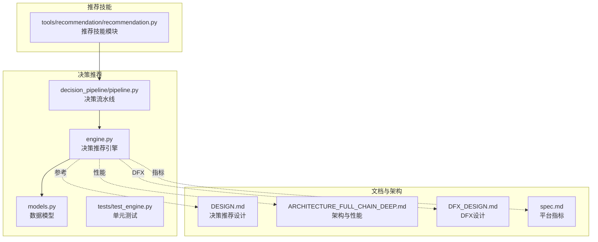
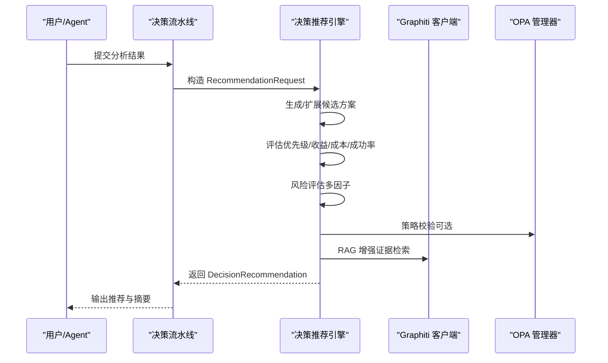
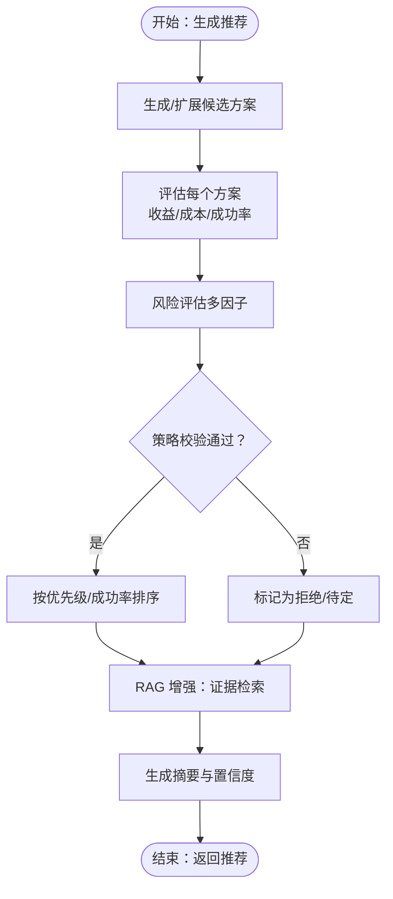
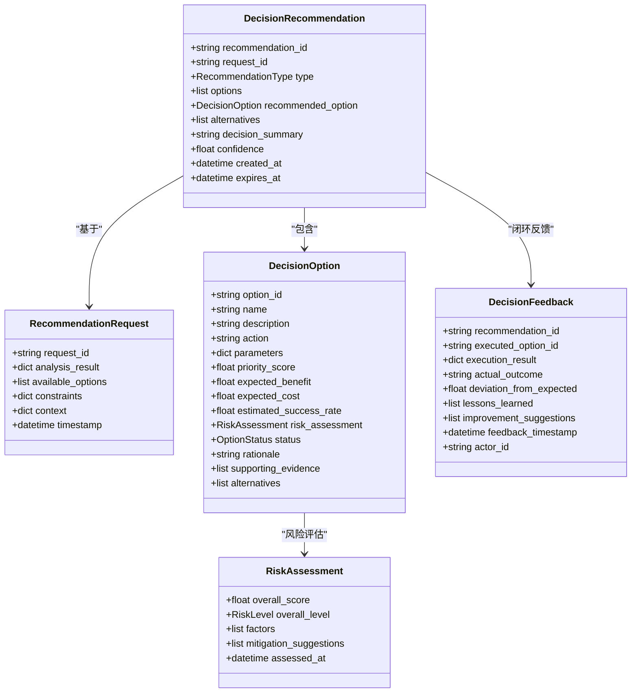
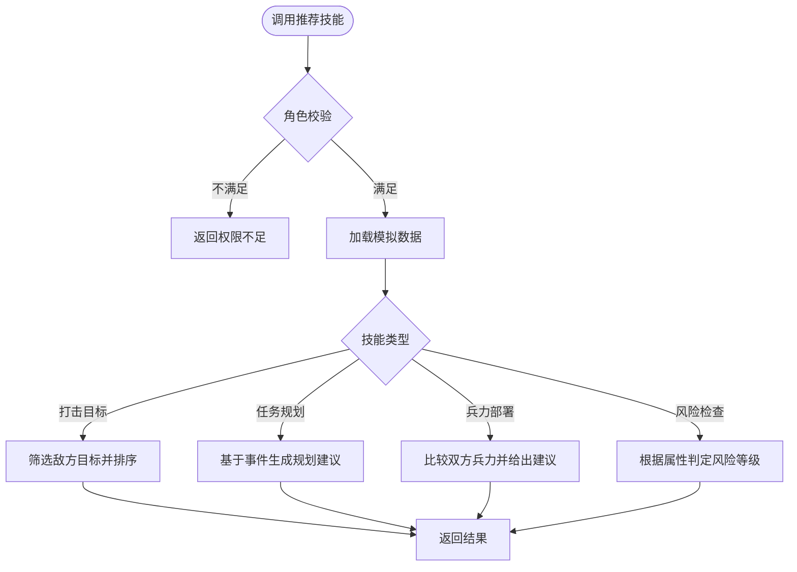
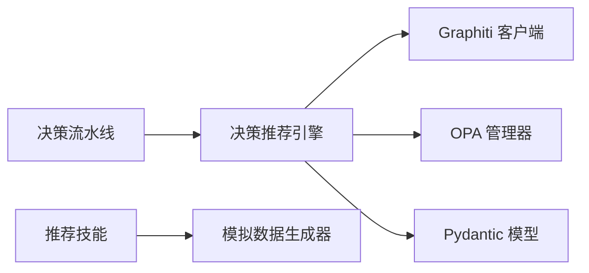

# 推荐工具

<cite>
**本文引用的文件**
- [odap/biz/decision/decision_recommendation/engine.py](file://odap/biz/decision/decision_recommendation/engine.py)
- [odap/biz/decision/decision_recommendation/models.py](file://odap/biz/decision/decision_recommendation/models.py)
- [odap/biz/decision/decision_recommendation/tests/test_engine.py](file://odap/biz/decision/decision_recommendation/tests/test_engine.py)
- [odap/biz/decision/decision_pipeline/pipeline.py](file://odap/biz/decision/decision_pipeline/pipeline.py)
- [odap/tools/recommendation/recommendation.py](file://odap/tools/recommendation/recommendation.py)
- [docs/03-modules/decision_recommendation/DESIGN.md](file://docs/03-modules/decision_recommendation/DESIGN.md)
- [docs/02-architecture/ARCHITECTURE_FULL_CHAIN_DEEP.md](file://docs/02-architecture/ARCHITECTURE_FULL_CHAIN_DEEP.md)
- [docs/06-dfx/DFX_DESIGN.md](file://docs/06-dfx/DFX_DESIGN.md)
- [specs/001-odap-platform/spec.md](file://specs/001-odap-platform/spec.md)
</cite>

## 目录
1. [简介](#简介)
2. [项目结构](#项目结构)
3. [核心组件](#核心组件)
4. [架构总览](#架构总览)
5. [详细组件分析](#详细组件分析)
6. [依赖分析](#依赖分析)
7. [性能考量](#性能考量)
8. [故障排查指南](#故障排查指南)
9. [结论](#结论)
10. [附录](#附录)

## 简介
本文件面向 ODAP 推荐工具，系统化梳理其在“决策推荐”与“通用推荐技能”两个层面的能力与实现。前者聚焦“基于知识图谱增强的决策推荐”，后者提供面向打击目标、任务规划、兵力部署等场景的推荐技能。文档涵盖算法原理（优先级评分、风险评估、策略校验）、数据处理（请求/选项/评估模型）、相似度与证据检索（RAG 增强）、排序机制、使用示例、性能优化、冷启动与多样性控制、评估指标与 A/B 测试方法。

## 项目结构
推荐相关代码主要分布在以下模块：
- 决策推荐引擎与模型：odap/biz/decision/decision_recommendation
- 推荐技能：odap/tools/recommendation
- 决策流水线对接：odap/biz/decision/decision_pipeline
- 设计文档与架构文档：docs/03-modules/decision_recommendation/DESIGN.md、docs/02-architecture/ARCHITECTURE_FULL_CHAIN_DEEP.md
- 性能与 DFX 设计：docs/06-dfx/DFX_DESIGN.md
- 平台成功标准与指标：specs/001-odap-platform/spec.md

**图表来源**
- [odap/biz/decision/decision_recommendation/engine.py:1-603](file://odap/biz/decision/decision_recommendation/engine.py#L1-L603)
- [odap/biz/decision/decision_recommendation/models.py:1-244](file://odap/biz/decision/decision_recommendation/models.py#L1-L244)
- [odap/biz/decision/decision_pipeline/pipeline.py:154-206](file://odap/biz/decision/decision_pipeline/pipeline.py#L154-L206)
- [odap/tools/recommendation/recommendation.py:1-268](file://odap/tools/recommendation/recommendation.py#L1-L268)
- [docs/03-modules/decision_recommendation/DESIGN.md:1-860](file://docs/03-modules/decision_recommendation/DESIGN.md#L1-L860)
- [docs/02-architecture/ARCHITECTURE_FULL_CHAIN_DEEP.md:5105-5136](file://docs/02-architecture/ARCHITECTURE_FULL_CHAIN_DEEP.md#L5105-L5136)
- [docs/06-dfx/DFX_DESIGN.md:38-69](file://docs/06-dfx/DFX_DESIGN.md#L38-L69)
- [specs/001-odap-platform/spec.md:213-225](file://specs/001-odap-platform/spec.md#L213-L225)

**章节来源**
- [odap/biz/decision/decision_recommendation/engine.py:1-603](file://odap/biz/decision/decision_recommendation/engine.py#L1-L603)
- [odap/biz/decision/decision_recommendation/models.py:1-244](file://odap/biz/decision/decision_recommendation/models.py#L1-L244)
- [odap/biz/decision/decision_pipeline/pipeline.py:154-206](file://odap/biz/decision/decision_pipeline/pipeline.py#L154-L206)
- [odap/tools/recommendation/recommendation.py:1-268](file://odap/tools/recommendation/recommendation.py#L1-L268)
- [docs/03-modules/decision_recommendation/DESIGN.md:1-860](file://docs/03-modules/decision_recommendation/DESIGN.md#L1-L860)
- [docs/02-architecture/ARCHITECTURE_FULL_CHAIN_DEEP.md:5105-5136](file://docs/02-architecture/ARCHITECTURE_FULL_CHAIN_DEEP.md#L5105-L5136)
- [docs/06-dfx/DFX_DESIGN.md:38-69](file://docs/06-dfx/DFX_DESIGN.md#L38-L69)
- [specs/001-odap-platform/spec.md:213-225](file://specs/001-odap-platform/spec.md#L213-L225)

## 核心组件
- 决策推荐引擎：负责接收分析结果，生成/扩展候选方案，评估优先级与风险，策略校验，排序并输出推荐结论，支持 RAG 增强与反馈闭环。
- 数据模型：定义推荐请求、决策选项、风险评估、推荐结果、反馈等核心数据结构。
- 推荐技能：提供打击目标、任务规划、兵力部署、风险检查等技能，便于在 Agent 或工作流中直接调用。
- 决策流水线：将理解阶段的结果转化为推荐，并与策略引擎、知识图谱客户端集成。

关键要点
- 优先级评分：收益、成本、成功率加权聚合。
- 风险评估：多因子加权，输出整体风险等级与缓解建议。
- 策略校验：通过 OPA 管理器进行策略一致性检查。
- RAG 增强：基于 Graphiti 的检索与证据抽取。
- 置信度：综合方案数量、评分与证据充分度计算。

**章节来源**
- [odap/biz/decision/decision_recommendation/engine.py:63-123](file://odap/biz/decision/decision_recommendation/engine.py#L63-L123)
- [odap/biz/decision/decision_recommendation/models.py:38-244](file://odap/biz/decision/decision_recommendation/models.py#L38-L244)
- [odap/biz/decision/decision_pipeline/pipeline.py:162-198](file://odap/biz/decision/decision_pipeline/pipeline.py#L162-L198)
- [odap/tools/recommendation/recommendation.py:20-139](file://odap/tools/recommendation/recommendation.py#L20-L139)

## 架构总览
推荐工具在 ODAP 中的定位与交互如下：

**图表来源**
- [odap/biz/decision/decision_pipeline/pipeline.py:162-198](file://odap/biz/decision/decision_pipeline/pipeline.py#L162-L198)
- [odap/biz/decision/decision_recommendation/engine.py:63-123](file://odap/biz/decision/decision_recommendation/engine.py#L63-L123)

## 详细组件分析

### 决策推荐引擎（优先级评分、风险评估、策略校验、排序）
- 优先级评分：以收益、成本、成功率加权聚合，成本越低、成功率越高，评分越高。
- 成本估算：基于约束条件归一化。
- 成功率估算：基于分析结果与约束（如严格模式）调整。
- 风险评估：执行风险、资源风险、时间风险、外部风险四类因子加权，输出整体等级与缓解建议。
- 策略校验：构造输入并调用 OPA，依据结果设置状态（推荐/备选/拒绝），并记录理由。
- 排序：按优先级与成功率降序，更新状态为推荐/备选。
- RAG 增强：对方案名称与描述进行检索，抽取知识图谱实体作为证据。
- 置信度：综合方案数量、评分与证据数量计算。

**图表来源**
- [odap/biz/decision/decision_recommendation/engine.py:83-123](file://odap/biz/decision/decision_recommendation/engine.py#L83-L123)
- [odap/biz/decision/decision_recommendation/engine.py:160-195](file://odap/biz/decision/decision_recommendation/engine.py#L160-L195)
- [odap/biz/decision/decision_recommendation/engine.py:270-338](file://odap/biz/decision/decision_recommendation/engine.py#L270-L338)
- [odap/biz/decision/decision_recommendation/engine.py:351-395](file://odap/biz/decision/decision_recommendation/engine.py#L351-L395)
- [odap/biz/decision/decision_recommendation/engine.py:397-426](file://odap/biz/decision/decision_recommendation/engine.py#L397-L426)
- [odap/biz/decision/decision_recommendation/engine.py:453-469](file://odap/biz/decision/decision_recommendation/engine.py#L453-L469)
- [odap/biz/decision/decision_recommendation/engine.py:509-530](file://odap/biz/decision/decision_recommendation/engine.py#L509-L530)

**章节来源**
- [odap/biz/decision/decision_recommendation/engine.py:197-268](file://odap/biz/decision/decision_recommendation/engine.py#L197-L268)
- [odap/biz/decision/decision_recommendation/engine.py:270-338](file://odap/biz/decision/decision_recommendation/engine.py#L270-L338)
- [odap/biz/decision/decision_recommendation/engine.py:351-395](file://odap/biz/decision/decision_recommendation/engine.py#L351-L395)
- [odap/biz/decision/decision_recommendation/engine.py:397-426](file://odap/biz/decision/decision_recommendation/engine.py#L397-L426)
- [odap/biz/decision/decision_recommendation/engine.py:453-469](file://odap/biz/decision/decision_recommendation/engine.py#L453-L469)
- [odap/biz/decision/decision_recommendation/engine.py:509-530](file://odap/biz/decision/decision_recommendation/engine.py#L509-L530)

### 数据模型（请求、选项、风险、推荐、反馈）
- RecommendationRequest：请求标识、分析结果、候选方案、约束、上下文、时间戳。
- DecisionOption：方案标识、名称、描述、动作、参数、评估指标（优先级、收益、成本、成功率）、风险评估、状态、理由、证据、备选方案。
- RiskAssessment：综合评分、等级、因子列表、缓解建议、评估时间。
- DecisionRecommendation：推荐标识、关联请求、推荐类型、候选/推荐/备选方案、摘要、置信度、创建/过期时间。
- DecisionFeedback：推荐ID、执行方案ID、执行结果、实际结果、偏差、经验教训、改进建议、反馈时间、执行者ID。

**图表来源**
- [odap/biz/decision/decision_recommendation/models.py:38-244](file://odap/biz/decision/decision_recommendation/models.py#L38-L244)

**章节来源**
- [odap/biz/decision/decision_recommendation/models.py:14-244](file://odap/biz/decision/decision_recommendation/models.py#L14-L244)

### 推荐技能（打击目标、任务规划、兵力部署、风险检查）
- recommend_strike_targets：按角色与区域/类型筛选敌方目标，按优先级排序。
- recommend_task_planning：基于最近事件生成任务规划建议（侦察/压制/巡逻）。
- recommend_force_deployment：按区域兵力对比给出部署建议与优先级。
- check_strike_risk：根据目标属性判断打击风险等级与原因。

**图表来源**
- [odap/tools/recommendation/recommendation.py:20-139](file://odap/tools/recommendation/recommendation.py#L20-L139)
- [odap/tools/recommendation/recommendation.py:187-240](file://odap/tools/recommendation/recommendation.py#L187-L240)

**章节来源**
- [odap/tools/recommendation/recommendation.py:20-139](file://odap/tools/recommendation/recommendation.py#L20-L139)
- [odap/tools/recommendation/recommendation.py:187-240](file://odap/tools/recommendation/recommendation.py#L187-L240)

### 决策流水线对接
- 将分析结果封装为 RecommendationRequest，调用决策引擎生成推荐，回填决策结果到决策流水线。

**章节来源**
- [odap/biz/decision/decision_pipeline/pipeline.py:162-198](file://odap/biz/decision/decision_pipeline/pipeline.py#L162-L198)

## 依赖分析
- 决策推荐引擎依赖：
  - Graphiti 客户端：用于 RAG 增强与证据检索。
  - OPA 管理器：用于策略校验。
  - Pydantic 模型：用于数据结构与校验。
- 推荐技能依赖：
  - 模拟数据生成器：提供样例数据。
  - 工具注册：将技能暴露给 Agent/工作流。

**图表来源**
- [odap/biz/decision/decision_recommendation/engine.py:46-61](file://odap/biz/decision/decision_recommendation/engine.py#L46-L61)
- [odap/tools/recommendation/recommendation.py:15-18](file://odap/tools/recommendation/recommendation.py#L15-L18)
- [odap/biz/decision/decision_pipeline/pipeline.py:162-175](file://odap/biz/decision/decision_pipeline/pipeline.py#L162-L175)

**章节来源**
- [odap/biz/decision/decision_recommendation/engine.py:46-61](file://odap/biz/decision/decision_recommendation/engine.py#L46-L61)
- [odap/tools/recommendation/recommendation.py:15-18](file://odap/tools/recommendation/recommendation.py#L15-L18)
- [odap/biz/decision/decision_pipeline/pipeline.py:162-175](file://odap/biz/decision/decision_pipeline/pipeline.py#L162-L175)

## 性能考量
- RAG 策略自适应：根据查询复杂度动态选择轻量/标准/深度检索策略，平衡延迟与召回。
- 图谱查询优化：三级缓存（内存/Redis/Disk）、索引优化、连接池复用、批量查询减少往返。
- 并发与容量：API 网关、Graphiti 客户端、LLM Provider 的并发模型与限流策略。
- 响应时间目标：问答与图谱查询 P95 延迟目标明确，配套 DFX 策略保障。

实践建议
- 在高并发场景下启用连接池与批量查询。
- 对高频检索建立缓存与预热策略。
- 使用自适应 RAG 策略，降低复杂查询的延迟。

**章节来源**
- [docs/02-architecture/ARCHITECTURE_FULL_CHAIN_DEEP.md:5122-5136](file://docs/02-architecture/ARCHITECTURE_FULL_CHAIN_DEEP.md#L5122-L5136)
- [docs/06-dfx/DFX_DESIGN.md:38-69](file://docs/06-dfx/DFX_DESIGN.md#L38-L69)
- [specs/001-odap-platform/spec.md:213-225](file://specs/001-odap-platform/spec.md#L213-L225)

## 故障排查指南
常见问题与处理
- OPA 校验失败：记录错误并保留方案但标记为待定，便于人工复核。
- RAG 查询异常：记录告警并降级为空证据，保证流程继续。
- 权限不足：技能调用前先做角色校验，返回明确错误信息。
- 无候选方案：引擎会生成默认方案，确保推荐流程可用。

测试覆盖
- 单元测试覆盖推荐生成、优先级计算、风险评估、排序、置信度、摘要生成、反馈记录等关键路径。

**章节来源**
- [odap/biz/decision/decision_recommendation/engine.py:375-394](file://odap/biz/decision/decision_recommendation/engine.py#L375-L394)
- [odap/biz/decision/decision_recommendation/engine.py:459-469](file://odap/biz/decision/decision_recommendation/engine.py#L459-L469)
- [odap/tools/recommendation/recommendation.py:32-33](file://odap/tools/recommendation/recommendation.py#L32-L33)
- [odap/biz/decision/decision_recommendation/tests/test_engine.py:70-181](file://odap/biz/decision/decision_recommendation/tests/test_engine.py#L70-L181)

## 结论
ODAP 推荐工具在“决策推荐”与“通用推荐技能”两条主线协同工作：前者以知识图谱增强为核心，结合优先级评分、风险评估与策略校验，形成可解释、可回溯的推荐；后者提供贴近实战场景的推荐技能，便于快速落地。配合 DFX 与性能优化策略，可在高并发与复杂查询场景下稳定运行。建议在实际部署中结合 A/B 测试与闭环反馈，持续迭代推荐质量与策略有效性。

## 附录

### 使用示例（流程与要点）
- 用户画像与物品特征
  - 用户画像：通过角色与上下文信息参与推荐策略（如仅指挥官可获取打击目标）。
  - 物品特征：目标类型、区域、敌我属性、状态等，作为优先级与风险评估输入。
- 推荐结果生成
  - 决策流水线将分析结果封装为 RecommendationRequest，引擎生成候选方案并评估，最终输出推荐摘要与置信度。
- 技能调用
  - 直接调用推荐技能（如 recommend_strike_targets），返回结构化结果，便于前端展示或进一步处理。

**章节来源**
- [odap/biz/decision/decision_pipeline/pipeline.py:162-198](file://odap/biz/decision/decision_pipeline/pipeline.py#L162-L198)
- [odap/tools/recommendation/recommendation.py:20-139](file://odap/tools/recommendation/recommendation.py#L20-L139)

### 算法原理与实现要点
- 优先级评分：收益、成本、成功率加权聚合，成本越低、成功率越高，优先级越高。
- 风险评估：四类风险因子加权，输出整体等级与缓解建议。
- 策略校验：基于 OPA 输入（动作、参数、上下文、约束）进行一致性检查。
- RAG 增强：对方案名称与描述进行检索，抽取知识图谱实体作为证据。
- 排序与置信度：综合评分与证据数量，输出推荐/备选与置信度。

**章节来源**
- [odap/biz/decision/decision_recommendation/engine.py:197-268](file://odap/biz/decision/decision_recommendation/engine.py#L197-L268)
- [odap/biz/decision/decision_recommendation/engine.py:270-338](file://odap/biz/decision/decision_recommendation/engine.py#L270-L338)
- [odap/biz/decision/decision_recommendation/engine.py:351-395](file://odap/biz/decision/decision_recommendation/engine.py#L351-L395)
- [odap/biz/decision/decision_recommendation/engine.py:397-426](file://odap/biz/decision/decision_recommendation/engine.py#L397-L426)
- [odap/biz/decision/decision_recommendation/engine.py:453-469](file://odap/biz/decision/decision_recommendation/engine.py#L453-L469)
- [odap/biz/decision/decision_recommendation/engine.py:509-530](file://odap/biz/decision/decision_recommendation/engine.py#L509-L530)

### 评估指标与 A/B 测试方法
- 评估指标
  - 任务成功率、风险等级分布、资源效率、决策质量、置信度等。
- A/B 测试
  - 通过 A/B 测试框架对提示词版本或策略变体进行分流与统计显著性检验，自动应用胜出版本。
- 指标采集
  - 基于会话 ID 一致性哈希分配组别，记录评分、成功率等指标，进行统计分析。

**章节来源**
- [docs/02-architecture/ARCHITECTURE_FULL_CHAIN_DEEP.md:4410-4610](file://docs/02-architecture/ARCHITECTURE_FULL_CHAIN_DEEP.md#L4410-L4610)