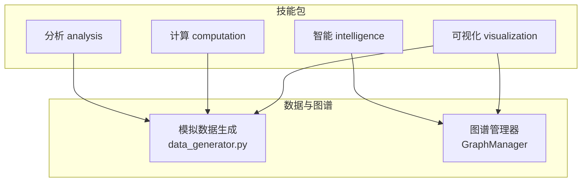
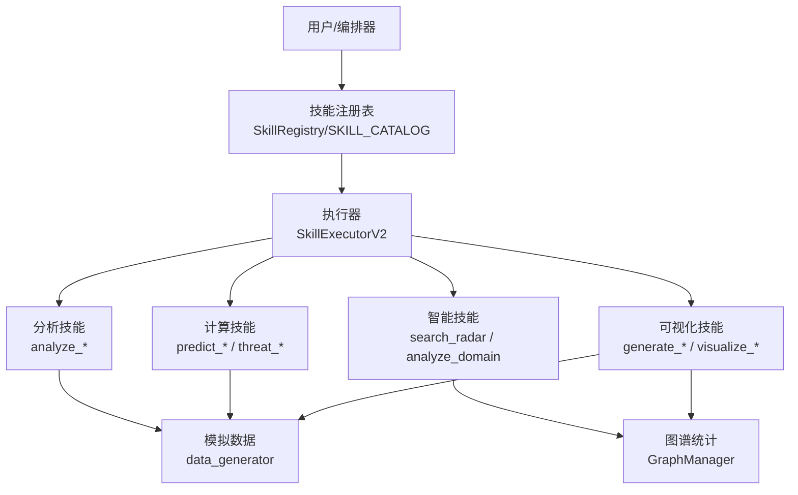
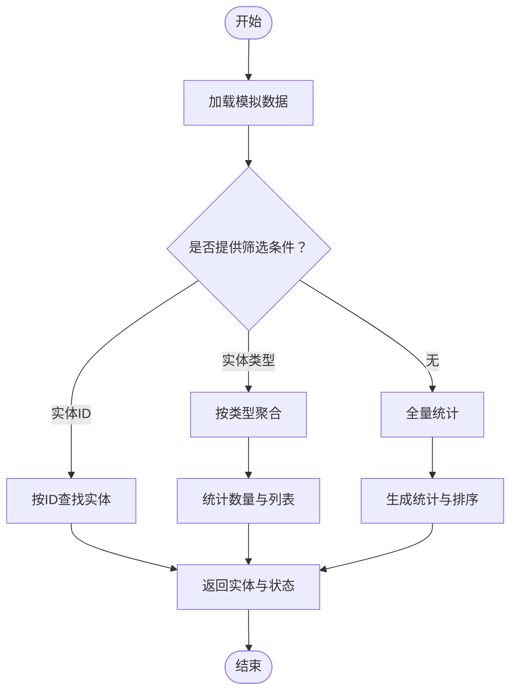
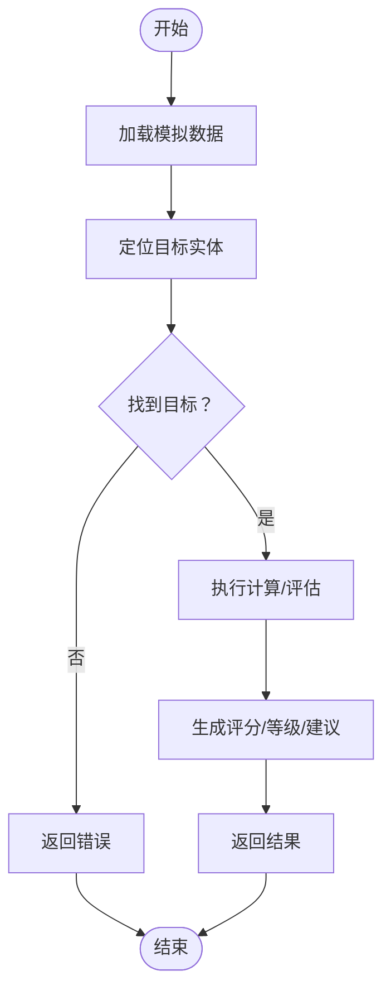
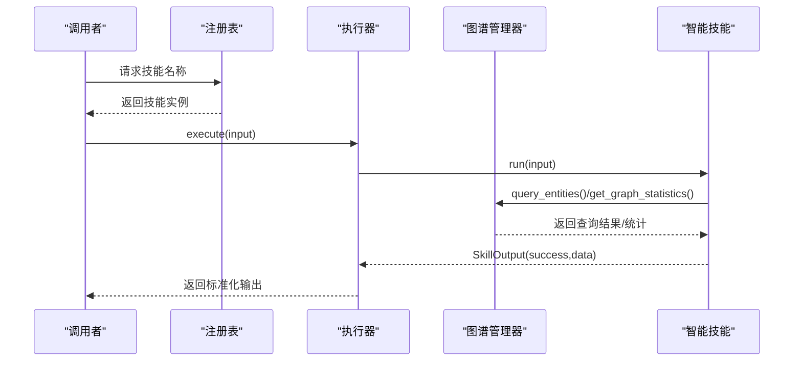
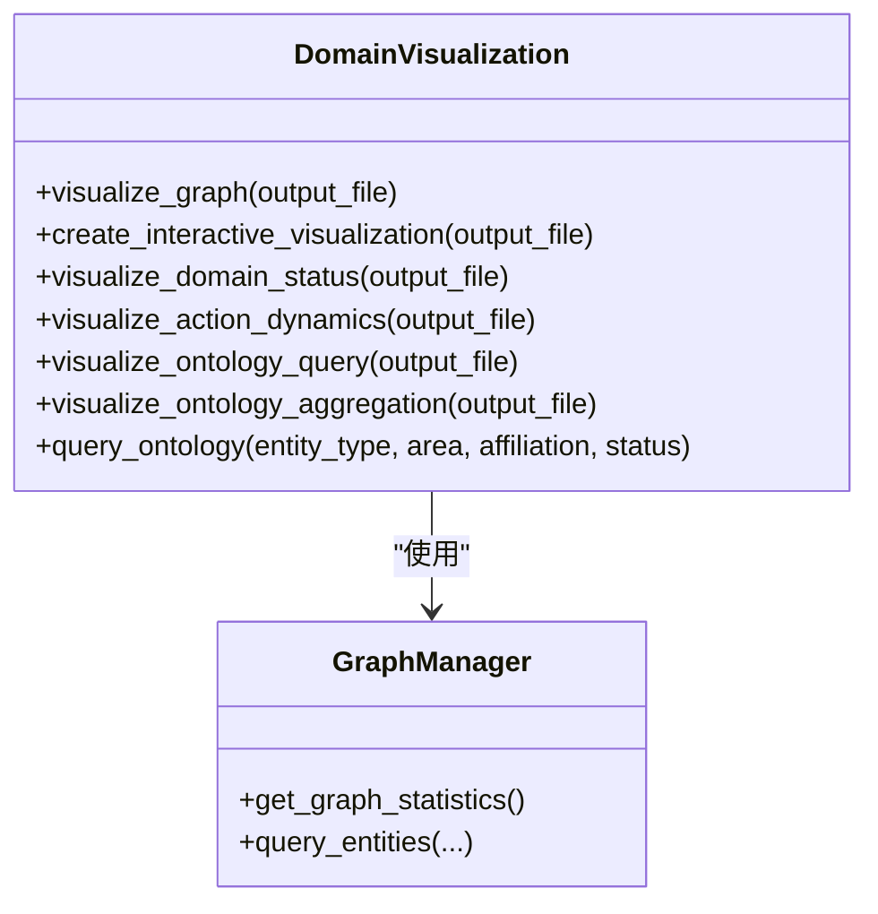
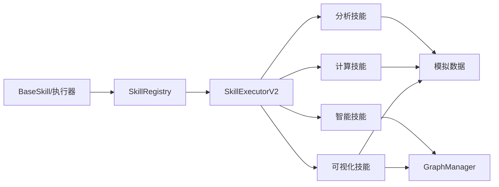

# 数据分析工具

<cite>
**本文引用的文件**   
- [odap/tools/analysis/analysis.py](file://odap/tools/analysis/analysis.py)
- [odap/tools/computation/computation.py](file://odap/tools/computation/computation.py)
- [odap/tools/intelligence/intelligence.py](file://odap/tools/intelligence/intelligence.py)
- [odap/tools/visualization/visualization_skill.py](file://odap/tools/visualization/visualization_skill.py)
- [odap/tools/visualization/plotting.py](file://odap/tools/visualization/plotting.py)
- [odap/biz/core/ontology/mock_data/data_generator.py](file://odap/biz/core/ontology/mock_data/data_generator.py)
- [odap/tools/base.py](file://odap/tools/base.py)
- [odap/tools/registry.py](file://odap/tools/registry.py)
- [odap/infra/data_pipeline/multimodal_processor.py](file://odap/infra/data_pipeline/multimodal_processor.py)
- [config/agent_config.yaml](file://config/agent_config.yaml)
- [docs/02-architecture/ARCHITECTURE_FULL_CHAIN_DEEP.md](file://docs/02-architecture/ARCHITECTURE_FULL_CHAIN_DEEP.md)
- [docs/03-modules/visualization/DESIGN.md](file://docs/03-modules/visualization/DESIGN.md)
</cite>

## 目录
1. [简介](#简介)
2. [项目结构](#项目结构)
3. [核心组件](#核心组件)
4. [架构总览](#架构总览)
5. [详细组件分析](#详细组件分析)
6. [依赖分析](#依赖分析)
7. [性能考虑](#性能考虑)
8. [故障排查指南](#故障排查指南)
9. [结论](#结论)
10. [附录](#附录)

## 简介
本文件面向 ODAP 数据分析工具，系统性梳理其在“统计分析、数据挖掘、趋势预测”等方面的能力与实现，覆盖数据输入格式、处理流程、输出结果、配置参数、性能优化与参数调优方法，并提供典型使用示例与最佳实践，帮助用户正确选择与使用分析工具。

## 项目结构
ODAP 将数据分析能力以“技能（Skill）”形式组织，围绕四类核心技能包展开：
- 分析（analysis）：实体状态、事件、力量对比、武器能力、基础设施分布、领域摘要等统计分析
- 计算（computation）：距离计算、威胁等级分析、打击毁伤评估、攻击结果预测
- 智能（intelligence）：雷达搜索、领域态势分析（图谱驱动）
- 可视化（visualization）：地图叠加层、任务摘要、态势报告、领域图谱可视化、处置动态与本体查询/聚合

**图示来源**
- [odap/tools/analysis/analysis.py:1-267](file://odap/tools/analysis/analysis.py#L1-L267)
- [odap/tools/computation/computation.py:1-247](file://odap/tools/computation/computation.py#L1-L247)
- [odap/tools/intelligence/intelligence.py:1-187](file://odap/tools/intelligence/intelligence.py#L1-L187)
- [odap/tools/visualization/visualization_skill.py:1-261](file://odap/tools/visualization/visualization_skill.py#L1-L261)
- [odap/biz/core/ontology/mock_data/data_generator.py:1-267](file://odap/biz/core/ontology/mock_data/data_generator.py#L1-L267)

**章节来源**
- [odap/tools/analysis/analysis.py:1-267](file://odap/tools/analysis/analysis.py#L1-L267)
- [odap/tools/computation/computation.py:1-247](file://odap/tools/computation/computation.py#L1-L247)
- [odap/tools/intelligence/intelligence.py:1-187](file://odap/tools/intelligence/intelligence.py#L1-L187)
- [odap/tools/visualization/visualization_skill.py:1-261](file://odap/tools/visualization/visualization_skill.py#L1-L261)
- [odap/biz/core/ontology/mock_data/data_generator.py:1-267](file://odap/biz/core/ontology/mock_data/data_generator.py#L1-L267)

## 核心组件
- 技能注册与执行框架
  - 新式 BaseSkill：统一输入输出、元数据、版本与健康监控，支持热插拔与执行器
  - 旧式 register_skill：向后兼容，同时写入 SKILL_CATALOG 与 SkillRegistry
- 图谱驱动分析
  - GraphManager 提供图统计、查询能力，支撑智能与分析类技能
- 模拟数据与多模态处理
  - 模拟数据生成器提供统一的领域实体与事件数据
  - 多模态处理器提供图像/音频处理的优先级与降级策略

**章节来源**
- [odap/tools/base.py:1-720](file://odap/tools/base.py#L1-L720)
- [odap/tools/registry.py:1-53](file://odap/tools/registry.py#L1-L53)
- [odap/biz/core/ontology/mock_data/data_generator.py:1-267](file://odap/biz/core/ontology/mock_data/data_generator.py#L1-L267)
- [odap/infra/data_pipeline/multimodal_processor.py:1-125](file://odap/infra/data_pipeline/multimodal_processor.py#L1-L125)

## 架构总览
ODAP 的数据分析工具采用“技能即服务”的架构：技能通过统一注册表暴露，执行器负责权限校验、重试与健康监控；分析与计算类技能读取模拟数据或图谱统计，可视化类技能输出静态图片与交互 HTML。

**图示来源**
- [odap/tools/base.py:458-597](file://odap/tools/base.py#L458-L597)
- [odap/tools/registry.py:26-38](file://odap/tools/registry.py#L26-L38)
- [odap/tools/intelligence/intelligence.py:36-187](file://odap/tools/intelligence/intelligence.py#L36-L187)
- [odap/tools/analysis/analysis.py:17-267](file://odap/tools/analysis/analysis.py#L17-L267)
- [odap/tools/computation/computation.py:19-247](file://odap/tools/computation/computation.py#L19-L247)
- [odap/tools/visualization/visualization_skill.py:18-261](file://odap/tools/visualization/visualization_skill.py#L18-L261)

## 详细组件分析

### 分析技能（统计分析）
- 能力清单
  - 实体状态分析：按实体 ID 或类型筛选
  - 领域事件分析：按时间范围过滤，统计事件类型分布
  - 力量对比分析：按区域统计交战方兵力与武器强度
  - 武器能力分析：按类型筛选，按火力排序
  - 民用基础设施分析：按类型与区域统计，标注受保护设施
  - 领域态势摘要：基于图谱统计生成推荐
- 输入/输出
  - 输入：可选参数（实体 ID、实体类型、时间范围、区域、武器类型等）
  - 输出：结构化 JSON，包含状态码、统计结果、排序列表、推荐等
- 算法要点
  - 过滤与聚合：字典遍历、计数、排序
  - 排序：按强度/火力/数量等指标降序
- 使用示例路径
  - [分析实体状态:17-61](file://odap/tools/analysis/analysis.py#L17-L61)
  - [分析领域事件:63-90](file://odap/tools/analysis/analysis.py#L63-L90)
  - [分析力量对比:92-132](file://odap/tools/analysis/analysis.py#L92-L132)
  - [分析武器能力:134-170](file://odap/tools/analysis/analysis.py#L134-L170)
  - [分析民用基础设施:172-204](file://odap/tools/analysis/analysis.py#L172-L204)
  - [获取领域摘要:206-225](file://odap/tools/analysis/analysis.py#L206-L225)

**图示来源**
- [odap/tools/analysis/analysis.py:17-204](file://odap/tools/analysis/analysis.py#L17-L204)
- [odap/biz/core/ontology/mock_data/data_generator.py:240-247](file://odap/biz/core/ontology/mock_data/data_generator.py#L240-L247)

**章节来源**
- [odap/tools/analysis/analysis.py:17-225](file://odap/tools/analysis/analysis.py#L17-L225)
- [odap/biz/core/ontology/mock_data/data_generator.py:240-247](file://odap/biz/core/ontology/mock_data/data_generator.py#L240-L247)

### 计算技能（预测与评估）
- 能力清单
  - 距离计算：两点坐标欧氏距离
  - 威胁等级分析：按兵力与武器强度加权评分
  - 打击毁伤评估：按武器火力与目标装甲计算损毁百分比
  - 攻击结果预测：基于目标类型与状态调整成功率
- 输入/输出
  - 输入：实体 ID、区域、武器 ID、目标 ID、攻击类型等
  - 输出：结构化 JSON，包含评分、等级、建议、估计时间等
- 算法要点
  - 距离：平方差求和再开方
  - 威胁：按阵营与强度加权累加，分级阈值判定
  - 毁伤：线性组合后归一化，分级判定
  - 成功率：基础概率 + 状态修正，分级建议
- 使用示例路径
  - [计算距离:19-59](file://odap/tools/computation/computation.py#L19-L59)
  - [分析威胁等级:117-167](file://odap/tools/computation/computation.py#L117-L167)
  - [计算打击毁伤:169-219](file://odap/tools/computation/computation.py#L169-L219)
  - [预测攻击结果:61-115](file://odap/tools/computation/computation.py#L61-L115)

**图示来源**
- [odap/tools/computation/computation.py:19-115](file://odap/tools/computation/computation.py#L19-L115)
- [odap/biz/core/ontology/mock_data/data_generator.py:240-247](file://odap/biz/core/ontology/mock_data/data_generator.py#L240-L247)

**章节来源**
- [odap/tools/computation/computation.py:19-219](file://odap/tools/computation/computation.py#L19-L219)
- [odap/biz/core/ontology/mock_data/data_generator.py:240-247](file://odap/biz/core/ontology/mock_data/data_generator.py#L240-L247)

### 智能技能（图谱驱动）
- 能力清单
  - 雷达搜索：按区域查询图谱中的雷达实体
  - 领域态势分析：基于图谱统计生成态势报告与建议
- 输入/输出
  - 输入：区域、请求 ID、时间戳等
  - 输出：结构化 JSON，包含雷达列表、数量、统计与建议
- 算法要点
  - 图谱查询：按实体类型与属性过滤
  - 统计聚合：节点类型计数、模式识别
- 使用示例路径
  - [雷达搜索:63-78](file://odap/tools/intelligence/intelligence.py#L63-L78)
  - [领域态势分析:101-121](file://odap/tools/intelligence/intelligence.py#L101-L121)

**图示来源**
- [odap/tools/intelligence/intelligence.py:36-121](file://odap/tools/intelligence/intelligence.py#L36-L121)
- [odap/tools/base.py:131-160](file://odap/tools/base.py#L131-L160)

**章节来源**
- [odap/tools/intelligence/intelligence.py:36-121](file://odap/tools/intelligence/intelligence.py#L36-L121)
- [odap/tools/base.py:131-160](file://odap/tools/base.py#L131-L160)

### 可视化技能（报告与图谱）
- 能力清单
  - 地图叠加层：生成 GeoJSON，标注位置、部队与颜色
  - 任务摘要：按任务 ID 汇总目标、状态、时间
  - 领域态势报告：汇总兵力、武器、雷达与控制态势
  - 态势感知：按区域统计蓝红双方兵力与控制等级
  - 领域图谱可视化：静态图与交互图谱、实体分布饼图、处置动态表格、本体查询与聚合
- 输入/输出
  - 输入：区域、任务 ID、输出文件名等
  - 输出：GeoJSON、HTML、图片或结构化 JSON
- 使用示例路径
  - [生成地图叠加层:18-88](file://odap/tools/visualization/visualization_skill.py#L18-L88)
  - [生成任务摘要:90-127](file://odap/tools/visualization/visualization_skill.py#L90-L127)
  - [生成领域报告:129-167](file://odap/tools/visualization/visualization_skill.py#L129-L167)
  - [生成态势感知:169-233](file://odap/tools/visualization/visualization_skill.py#L169-L233)
  - [图谱可视化:45-233](file://odap/tools/visualization/plotting.py#L45-L233)

**图示来源**
- [odap/tools/visualization/plotting.py:23-491](file://odap/tools/visualization/plotting.py#L23-L491)

**章节来源**
- [odap/tools/visualization/visualization_skill.py:18-233](file://odap/tools/visualization/visualization_skill.py#L18-L233)
- [odap/tools/visualization/plotting.py:23-233](file://odap/tools/visualization/plotting.py#L23-L233)
- [docs/03-modules/visualization/DESIGN.md:1-21](file://docs/03-modules/visualization/DESIGN.md#L1-L21)

## 依赖分析
- 技能注册与执行
  - 新式 BaseSkill 与执行器：统一输入输出、权限校验、重试与健康监控
  - 旧式 register_skill：向后兼容，写入 SKILL_CATALOG 与 SkillRegistry
- 数据与图谱
  - 模拟数据生成器：统一的领域实体与事件数据源
  - GraphManager：提供图统计与查询能力
- 多模态处理
  - 多模态处理器：图像/音频模型优先级与降级策略

**图示来源**
- [odap/tools/base.py:458-597](file://odap/tools/base.py#L458-L597)
- [odap/tools/registry.py:26-38](file://odap/tools/registry.py#L26-L38)
- [odap/biz/core/ontology/mock_data/data_generator.py:240-247](file://odap/biz/core/ontology/mock_data/data_generator.py#L240-L247)

**章节来源**
- [odap/tools/base.py:458-597](file://odap/tools/base.py#L458-L597)
- [odap/tools/registry.py:26-38](file://odap/tools/registry.py#L26-L38)
- [odap/biz/core/ontology/mock_data/data_generator.py:240-247](file://odap/biz/core/ontology/mock_data/data_generator.py#L240-L247)

## 性能考虑
- 执行器重试与健康监控
  - 执行器支持重试次数与延迟配置，记录总调用、成功/失败次数与平均耗时
- 多模态处理降级
  - 图像/音频模型按优先级尝试，失败自动降级，保证可用性
- 架构层面优化
  - 图谱查询可通过索引与连接池预热优化
  - 并行化与流式输出可降低响应延迟

**章节来源**
- [odap/tools/base.py:458-597](file://odap/tools/base.py#L458-L597)
- [odap/infra/data_pipeline/multimodal_processor.py:23-125](file://odap/infra/data_pipeline/multimodal_processor.py#L23-L125)
- [docs/02-architecture/ARCHITECTURE_FULL_CHAIN_DEEP.md:5091-5136](file://docs/02-architecture/ARCHITECTURE_FULL_CHAIN_DEEP.md#L5091-L5136)

## 故障排查指南
- 技能执行失败
  - 检查执行器返回的错误信息与执行耗时，确认输入参数与权限
- 模拟数据缺失
  - 确认模拟数据生成器是否已生成默认 JSON；若缺失则触发自动生成
- 可视化输出异常
  - 检查图谱数据是否可用；确认输出文件路径与权限
- 多模态处理失败
  - 检查环境变量（如 API Key）是否配置；观察日志中模型切换与降级提示

**章节来源**
- [odap/tools/base.py:148-160](file://odap/tools/base.py#L148-L160)
- [odap/biz/core/ontology/mock_data/data_generator.py:240-247](file://odap/biz/core/ontology/mock_data/data_generator.py#L240-L247)
- [odap/infra/data_pipeline/multimodal_processor.py:65-125](file://odap/infra/data_pipeline/multimodal_processor.py#L65-L125)

## 结论
ODAP 数据分析工具以技能为核心，结合模拟数据与图谱统计，提供从统计分析、预测评估到可视化的完整能力链。通过统一的注册与执行框架，用户可以灵活组合不同技能，快速完成数据预处理、特征提取、模型训练与结果解读，并在性能与可靠性方面具备良好的工程化保障。

## 附录

### 使用示例（步骤化）
- 数据预处理
  - 使用模拟数据生成器准备领域实体与事件数据
  - 可选：通过多模态处理器对图像/音频进行预处理
- 特征提取
  - 使用分析技能提取实体分布、事件类型、力量对比等统计特征
  - 使用智能技能从图谱中抽取雷达与态势信息
- 模型训练与预测
  - 使用计算技能进行威胁评估与打击毁伤预测
  - 使用预测技能评估攻击成功率与风险等级
- 结果解读与可视化
  - 使用可视化技能生成报告、地图叠加层与交互图谱
  - 使用图谱可视化模块导出静态图与 HTML

**章节来源**
- [odap/biz/core/ontology/mock_data/data_generator.py:240-247](file://odap/biz/core/ontology/mock_data/data_generator.py#L240-L247)
- [odap/infra/data_pipeline/multimodal_processor.py:23-125](file://odap/infra/data_pipeline/multimodal_processor.py#L23-L125)
- [odap/tools/analysis/analysis.py:17-225](file://odap/tools/analysis/analysis.py#L17-L225)
- [odap/tools/intelligence/intelligence.py:36-121](file://odap/tools/intelligence/intelligence.py#L36-L121)
- [odap/tools/computation/computation.py:19-219](file://odap/tools/computation/computation.py#L19-L219)
- [odap/tools/visualization/visualization_skill.py:18-233](file://odap/tools/visualization/visualization_skill.py#L18-L233)
- [odap/tools/visualization/plotting.py:45-233](file://odap/tools/visualization/plotting.py#L45-L233)

### 配置与参数调优
- LLM 与多模态配置
  - 通过 YAML 配置大模型提供商、模型名称、温度与令牌上限
  - 多模态配置可启用 OCR 与选择视觉/音频模型
- 性能优化
  - 执行器重试与健康监控参数
  - 多模态模型优先级与降级策略
  - 架构层面的图谱索引与连接池预热

**章节来源**
- [config/agent_config.yaml:1-23](file://config/agent_config.yaml#L1-L23)
- [odap/tools/base.py:458-597](file://odap/tools/base.py#L458-L597)
- [odap/infra/data_pipeline/multimodal_processor.py:23-125](file://odap/infra/data_pipeline/multimodal_processor.py#L23-L125)
- [docs/02-architecture/ARCHITECTURE_FULL_CHAIN_DEEP.md:5091-5136](file://docs/02-architecture/ARCHITECTURE_FULL_CHAIN_DEEP.md#L5091-L5136)