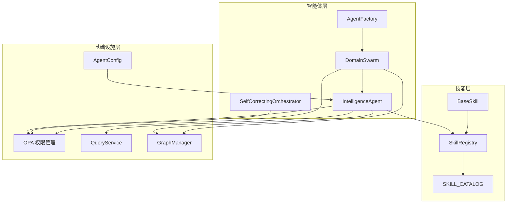
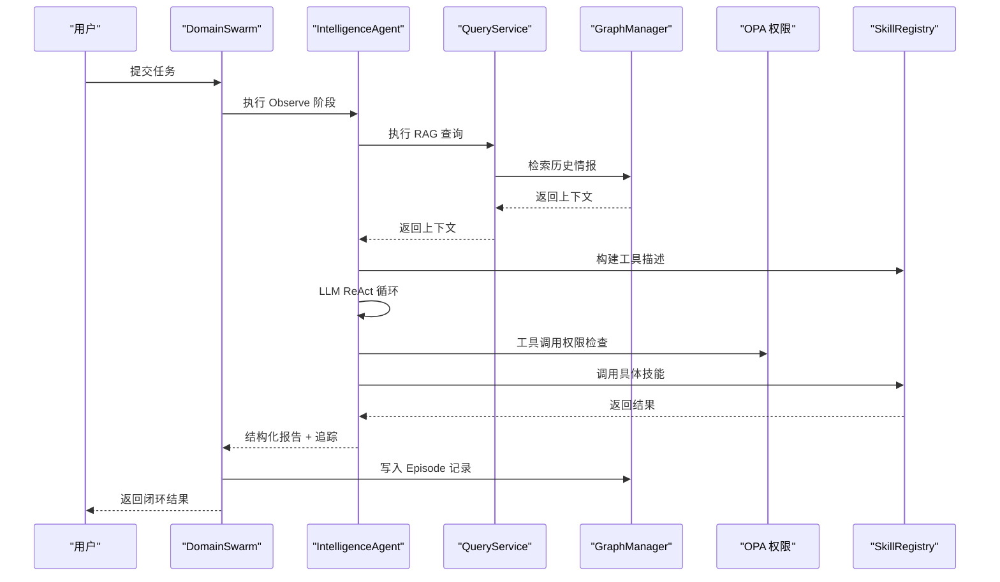
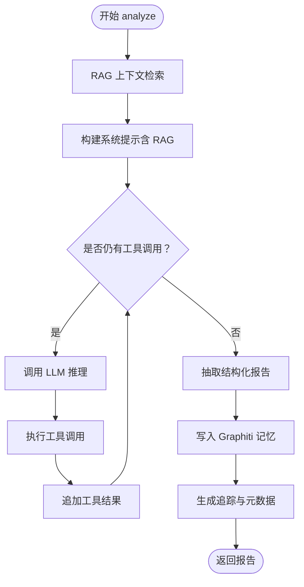
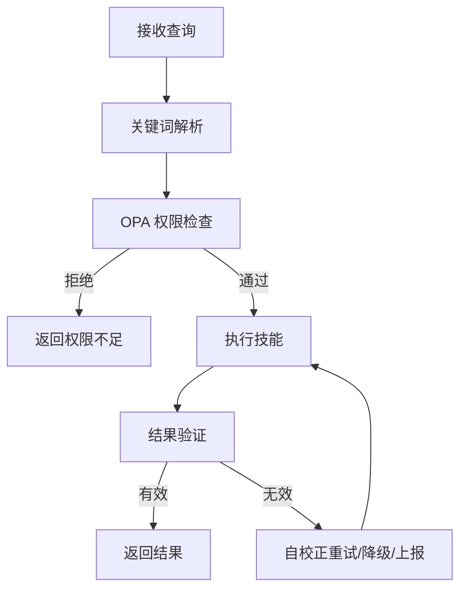
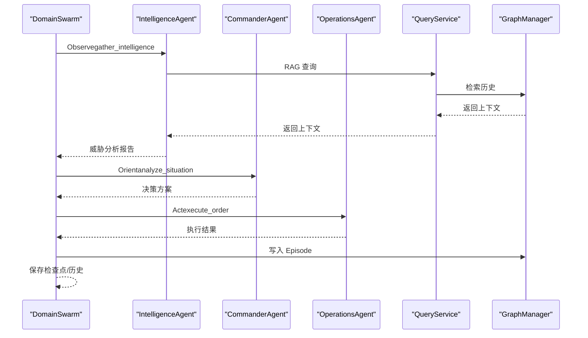
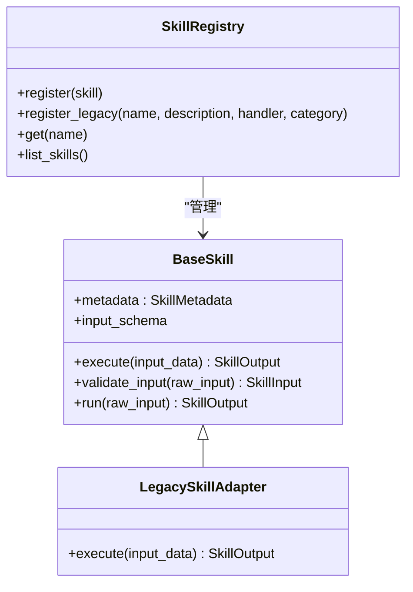
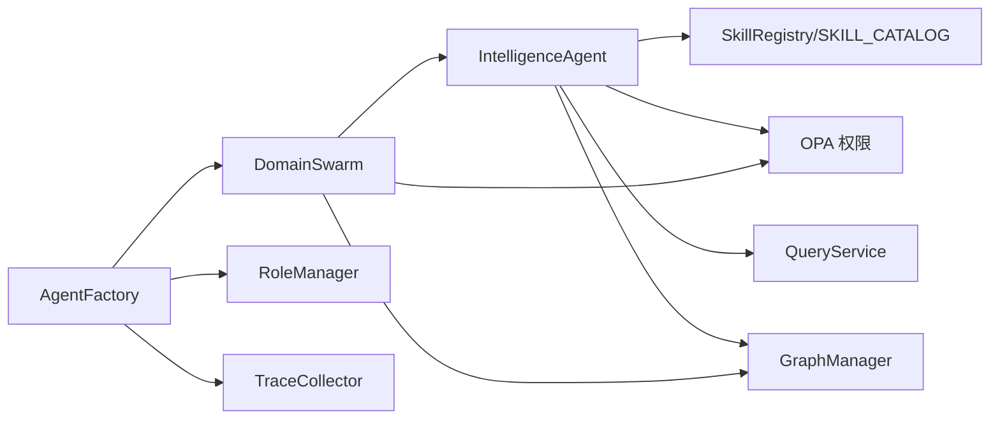

# 智能体工具

<cite>
**本文档引用的文件**
- [intelligence_agent.py](file://odap/biz/core/agent/intelligence_agent.py)
- [orchestrator.py](file://odap/biz/core/agent/orchestrator.py)
- [swarm_orchestrator.py](file://odap/biz/core/agent/swarm_orchestrator.py)
- [agent_factory.py](file://odap/biz/core/agent/agent_factory.py)
- [base.py](file://odap/tools/base.py)
- [registry.py](file://odap/tools/registry.py)
- [graph_tools.py](file://odap/tools/agent_tools/graph_tools.py)
- [workspace_tools.py](file://odap/tools/agent_tools/workspace_tools.py)
- [opa_service.py](file://odap/infra/opa/opa_service.py)
- [service.py](file://odap/infra/query/service.py)
- [graph_service.py](file://odap/infra/graph/graph_service.py)
- [agent_config.yaml](file://config/agent_config.yaml)
- [DESIGN.md](file://docs/03-modules/agent/DESIGN.md)
</cite>

## 目录
1. [简介](#简介)
2. [项目结构](#项目结构)
3. [核心组件](#核心组件)
4. [架构总览](#架构总览)
5. [详细组件分析](#详细组件分析)
6. [依赖关系分析](#依赖关系分析)
7. [性能考虑](#性能考虑)
8. [故障排查指南](#故障排查指南)
9. [结论](#结论)
10. [附录](#附录)

## 简介
本文件为 ODAP 智能体工具的技术文档，聚焦“智能体工具”的功能与应用，涵盖意图识别、行为预测、决策支持等核心能力。文档基于仓库中的 Agent 模块、技能体系、权限控制、图谱查询与存储等基础设施，系统阐述智能体工具的工作原理、算法模型、训练数据来源、适用场景，并提供实际应用案例、配置参数、性能调优与结果解释方法，以及集成与二次开发指南。

## 项目结构
智能体工具位于 odap/biz/core/agent 目录，围绕 IntelligenceAgent、SelfCorrectingOrchestrator、DomainSwarm 三大核心模块构建；技能体系位于 odap/tools，权限控制位于 odap/infra/opa，知识图谱访问位于 odap/infra/graph，查询服务位于 odap/infra/query。整体采用“多 Agent 协同 + 技能驱动 + 权限治理 + 图谱增强”的分层架构。

**图表来源**
- [intelligence_agent.py:73-527](file://odap/biz/core/agent/intelligence_agent.py#L73-L527)
- [swarm_orchestrator.py:288-657](file://odap/biz/core/agent/swarm_orchestrator.py#L288-L657)
- [agent_factory.py:340-441](file://odap/biz/core/agent/agent_factory.py#L340-L441)
- [base.py:64-161](file://odap/tools/base.py#L64-L161)
- [registry.py:26-38](file://odap/tools/registry.py#L26-L38)
- [opa_service.py:455-717](file://odap/infra/opa/opa_service.py#L455-L717)
- [service.py:11-126](file://odap/infra/query/service.py#L11-L126)
- [graph_service.py:71-800](file://odap/infra/graph/graph_service.py#L71-L800)
- [agent_config.yaml:1-23](file://config/agent_config.yaml#L1-L23)

**章节来源**
- [DESIGN.md:1-409](file://docs/03-modules/agent/DESIGN.md#L1-L409)

## 核心组件
- IntelligenceAgent：基于 LLM ReAct 的情报分析 Agent，具备 RAG 增强、工具调用、链路追踪与结果结构化输出能力。
- SelfCorrectingOrchestrator：面向简单任务的关键词路由与权限校验编排器，支持自校正机制。
- DomainSwarm：多 Agent 协同编排器，实现 OODA（观察-理解-决策-行动）闭环，支持流式进度返回与状态持久化。
- AgentFactory：Agent 生命周期与追踪管理工厂，提供角色能力、追踪收集与统计。
- 技能体系：BaseSkill 抽象、SkillRegistry 注册表、SKILL_CATALOG 目录，支持新旧两种技能形态。
- 权限控制：OPA 策略评估、ABAC/角色策略、策略热更新与沙箱模拟。
- 图谱与查询：GraphManager（三层降级）、QueryService（统一查询入口）、RAG 历史上下文注入。

**章节来源**
- [intelligence_agent.py:73-527](file://odap/biz/core/agent/intelligence_agent.py#L73-L527)
- [orchestrator.py:16-151](file://odap/biz/core/agent/orchestrator.py#L16-L151)
- [swarm_orchestrator.py:288-657](file://odap/biz/core/agent/swarm_orchestrator.py#L288-L657)
- [agent_factory.py:340-441](file://odap/biz/core/agent/agent_factory.py#L340-L441)
- [base.py:64-161](file://odap/tools/base.py#L64-L161)
- [registry.py:26-38](file://odap/tools/registry.py#L26-L38)
- [opa_service.py:455-717](file://odap/infra/opa/opa_service.py#L455-L717)
- [service.py:11-126](file://odap/infra/query/service.py#L11-L126)
- [graph_service.py:71-800](file://odap/infra/graph/graph_service.py#L71-L800)

## 架构总览
智能体工具采用“多 Agent 协同 + 技能驱动 + 权限治理 + 图谱增强”的分层架构。DomainSwarm 作为编排中枢，驱动 IntelligenceAgent（观察与分析）、CommanderAgent（理解与决策）、OperationsAgent（执行与确认）。IntelligenceAgent 在 ReAct 循环中结合 RAG 历史上下文与工具调用，最终生成结构化报告并写入 Graphiti 记忆。权限控制贯穿工具调用与高危操作，技能体系提供统一抽象与注册机制。

**图表来源**
- [swarm_orchestrator.py:568-613](file://odap/biz/core/agent/swarm_orchestrator.py#L568-L613)
- [intelligence_agent.py:277-500](file://odap/biz/core/agent/intelligence_agent.py#L277-L500)
- [service.py:33-59](file://odap/infra/query/service.py#L33-L59)
- [graph_service.py:649-756](file://odap/infra/graph/graph_service.py#L649-L756)
- [opa_service.py:538-598](file://odap/infra/opa/opa_service.py#L538-L598)

## 详细组件分析

### IntelligenceAgent（情报分析 Agent）
- 工作原理
  - 使用 LLM ReAct 模式：先由 LLM 决定调用哪些工具，再执行工具获取数据，最后综合生成结构化报告。
  - RAG 增强：在系统提示词中注入历史情报上下文，提升分析准确性。
  - 链路追踪：TraceSpan 记录每次调用、工具执行与最终回答，便于可观测性与性能基线。
  - 权限控制：对高危工具（如 operations 类别）进行 OPA 权限检查。
- 核心流程
  - RAG 上下文检索 → 构建系统提示 → ReAct 循环（LLM 推理 + 工具调用）→ 结构化报告抽取 → 写入 Graphiti 记忆 → 追踪与日志。
- 关键参数
  - 最大迭代轮次（MAX_ITERATIONS）、温度（temperature）、最大令牌数（max_tokens）。
  - LLM 基础地址、模型名、API Key 从安全配置读取。
- 输出结构
  - 包含 summary、threat_level、enemy_units、civilian_risk、recommendations、historical_patterns 等字段，以及 _metadata（执行时间、工具调用历史、RAG 是否启用）与 _trace（链路追踪）。

**图表来源**
- [intelligence_agent.py:307-527](file://odap/biz/core/agent/intelligence_agent.py#L307-L527)

**章节来源**
- [intelligence_agent.py:73-527](file://odap/biz/core/agent/intelligence_agent.py#L73-L527)

### SelfCorrectingOrchestrator（自校正编排器）
- 功能定位：面向简单任务的关键词路由与权限校验，支持自校正（权限不足、执行错误、结果无效、超时）。
- 关键流程：解析查询 → 权限检查（OPA）→ 执行技能 → 结果验证 → 自我修正。
- 适用场景：低复杂度、规则明确的任务，如搜索雷达、分析领域态势、推荐打击目标等。

**图表来源**
- [orchestrator.py:33-151](file://odap/biz/core/agent/orchestrator.py#L33-L151)

**章节来源**
- [orchestrator.py:16-151](file://odap/biz/core/agent/orchestrator.py#L16-L151)

### DomainSwarm（多 Agent 协同编排器）
- OODA 闭环：Observe（情报收集）→ Orient（态势理解）→ Decide（决策制定）→ Act（执行）。
- 流式进度：支持 execute_streaming 返回阶段性进度（等待人工确认、错误等）。
- 状态持久化：检查点保存、健康监控、故障恢复、任务历史记录。
- 高危操作：对需要 OPA 审批的操作（如 operations）进行二次确认。

**图表来源**
- [swarm_orchestrator.py:379-657](file://odap/biz/core/agent/swarm_orchestrator.py#L379-L657)
- [service.py:33-59](file://odap/infra/query/service.py#L33-L59)
- [graph_service.py:649-756](file://odap/infra/graph/graph_service.py#L649-L756)

**章节来源**
- [swarm_orchestrator.py:288-657](file://odap/biz/core/agent/swarm_orchestrator.py#L288-L657)

### AgentFactory（工厂与追踪）
- 职责：注册 Agent 类、创建实例、生命周期管理、追踪收集与统计。
- 能力枚举：态势感知、目标探测、威胁分析、图谱搜索、决策制定、任务执行、报告生成、解释说明等。
- 追踪：TraceSpan/Trace 支持阶段化记录、时延统计与错误归档。

**章节来源**
- [agent_factory.py:340-441](file://odap/biz/core/agent/agent_factory.py#L340-L441)

### 技能体系（BaseSkill 与注册表）
- BaseSkill：统一输入输出模型（SkillInput/SkillOutput）、元数据（SkillMetadata）、执行流程（validate_input → execute → 计时）。
- 注册表：SKILL_CATALOG（旧式裸函数 handler）、SkillRegistry（新式 BaseSkill 子类），两者保持同步。
- 兼容性：LegacySkillAdapter 适配旧式 handler，支持向后兼容。

**图表来源**
- [base.py:64-230](file://odap/tools/base.py#L64-L230)
- [registry.py:26-38](file://odap/tools/registry.py#L26-L38)

**章节来源**
- [base.py:64-720](file://odap/tools/base.py#L64-L720)
- [registry.py:26-38](file://odap/tools/registry.py#L26-L38)

### 权限控制（OPA）
- 策略模型：ABAC（基于属性、角色、环境条件），支持 RBAC/PBAC/CBAC 等扩展。
- 能力范围：权限检查、批量检查、策略热更新 Bundle、策略沙箱（What-If 模拟）。
- 缓存与回退：本地缓存命中率统计、Mock 回退、历史记录与性能指标。

**章节来源**
- [opa_service.py:455-717](file://odap/infra/opa/opa_service.py#L455-L717)

### 图谱与查询（GraphManager 与 QueryService）
- GraphManager：三层降级（Graphiti → Neo4j Driver → NetworkX fallback），支持实体查询、关系查询、图谱统计、Episode 写入。
- QueryService：统一查询入口，解析查询语法，路由到 Schema/Entity/Topo/Temporal 源，支持 explain 与 limit 控制。

**章节来源**
- [graph_service.py:71-800](file://odap/infra/graph/graph_service.py#L71-L800)
- [service.py:11-126](file://odap/infra/query/service.py#L11-L126)

## 依赖关系分析
- 智能体工具依赖技能体系（SKILL_CATALOG/BaseSkill）、权限控制（OPA）、图谱与查询（GraphManager/QueryService）。
- DomainSwarm 依赖 IntelligenceAgent/CommanderAgent/OperationsAgent，以及 GraphManager/OPA/健康监控。
- AgentFactory 依赖 RoleManager 与 TraceCollector，提供角色能力与追踪统计。

**图表来源**
- [intelligence_agent.py:89-125](file://odap/biz/core/agent/intelligence_agent.py#L89-L125)
- [swarm_orchestrator.py:288-360](file://odap/biz/core/agent/swarm_orchestrator.py#L288-L360)
- [agent_factory.py:340-441](file://odap/biz/core/agent/agent_factory.py#L340-L441)

**章节来源**
- [intelligence_agent.py:89-125](file://odap/biz/core/agent/intelligence_agent.py#L89-L125)
- [swarm_orchestrator.py:288-360](file://odap/biz/core/agent/swarm_orchestrator.py#L288-L360)
- [agent_factory.py:340-441](file://odap/biz/core/agent/agent_factory.py#L340-L441)

## 性能考虑
- LLM 调用：指数退避重试、连接池与超时设置、温度与最大令牌数调优。
- 图谱访问：连接池、断路器、缓存命中率、批量加载与回退模式。
- 技能执行：健康监控、成功率统计、重试与降级策略。
- 追踪与日志：结构化链路追踪、性能基线、缓存统计与健康报告。

**章节来源**
- [intelligence_agent.py:172-214](file://odap/biz/core/agent/intelligence_agent.py#L172-L214)
- [graph_service.py:299-443](file://odap/infra/graph/graph_service.py#L299-L443)
- [base.py:458-597](file://odap/tools/base.py#L458-L597)
- [opa_service.py:707-714](file://odap/infra/opa/opa_service.py#L707-L714)

## 故障排查指南
- LLM 调用失败：检查 API Key/Base/Model 配置、网络连通性、重试日志与指数退避。
- 权限不足：核对 OPA 策略、角色属性与资源限制，必要时使用策略沙箱模拟。
- 图谱不可用：查看三层降级日志（Graphiti → Neo4j Driver → NetworkX fallback），检查连接池与断路器状态。
- 技能执行异常：查看 SkillOutput 错误信息、健康统计与重试记录，必要时降级到旧式 handler。
- 追踪与诊断：通过 _trace 与链路追踪收集器获取执行阶段、耗时与错误信息。

**章节来源**
- [intelligence_agent.py:192-213](file://odap/biz/core/agent/intelligence_agent.py#L192-L213)
- [opa_service.py:538-598](file://odap/infra/opa/opa_service.py#L538-L598)
- [graph_service.py:145-213](file://odap/infra/graph/graph_service.py#L145-L213)
- [base.py:458-597](file://odap/tools/base.py#L458-L597)
- [agent_factory.py:180-242](file://odap/biz/core/agent/agent_factory.py#L180-L242)

## 结论
ODAP 智能体工具通过“多 Agent 协同 + 技能驱动 + 权限治理 + 图谱增强”实现了从意图识别到行为预测再到决策支持的完整闭环。其模块化设计、统一技能抽象、严格的权限控制与可观测性追踪，使其适用于复杂领域的智能分析与自动化执行场景。通过合理的配置与调优，可在保证安全性的同时获得稳定的性能表现。

## 附录

### 实际应用案例
- 案例一：威胁分析与推荐
  - 场景：分析 B 区威胁并推荐行动方案。
  - 流程：DomainSwarm → IntelligenceAgent（RAG + 工具调用）→ CommanderAgent（决策）→ OperationsAgent（执行）。
  - 结果：生成威胁等级、敌方单位、建议行动与历史模式引用。
- 案例二：领域态势分析
  - 场景：分析当前领域态势与力量对比。
  - 流程：IntelligenceAgent（analyze_domain/analyze_force_comparison）→ 结构化报告。
- 案例三：雷达搜索与目标打击
  - 场景：搜索 D 区雷达并授权打击。
  - 流程：SelfCorrectingOrchestrator（关键词路由）→ OPA 权限检查 → IntelligenceAgent（search_radar）→ OperationsAgent（attack_target）。

**章节来源**
- [swarm_orchestrator.py:379-657](file://odap/biz/core/agent/swarm_orchestrator.py#L379-L657)
- [intelligence_agent.py:307-527](file://odap/biz/core/agent/intelligence_agent.py#L307-L527)
- [orchestrator.py:33-151](file://odap/biz/core/agent/orchestrator.py#L33-L151)

### 配置参数与调优
- LLM 配置
  - provider：openai（可切换 anthropic/http）
  - model、max_tokens、temperature、base_url
- Agent 行为
  - MAX_ITERATIONS（ReAct 最大轮次）、温度、最大令牌数
- 权限与安全
  - OPENAI_API_KEY/OPENAI_API_BASE/OPENAI_MODEL、NEO4J_URI/USER/PASSWORD
- 性能调优
  - 连接池大小、超时、断路器阈值、缓存命中率与健康监控

**章节来源**
- [agent_config.yaml:1-23](file://config/agent_config.yaml#L1-L23)
- [intelligence_agent.py:89-125](file://odap/biz/core/agent/intelligence_agent.py#L89-L125)
- [graph_service.py:122-133](file://odap/infra/graph/graph_service.py#L122-L133)
- [opa_service.py:707-714](file://odap/infra/opa/opa_service.py#L707-L714)

### 集成与二次开发指南
- 集成步骤
  - 初始化 AgentFactory → 创建 DomainSwarm → 注册 Agent 类型 → 执行 execute/execute_streaming。
  - 配置 LLM 与图谱连接，确保 OPA 可用。
- 二次开发
  - 新增技能：实现 BaseSkill 或使用 register_skill 注册旧式 handler，加入 SKILL_CATALOG。
  - 自定义 Agent：继承相应 Agent 基类，实现 analyze/execute 等方法，通过 AgentFactory 注册。
  - 权限策略：通过 PolicyBundleManager 热更新策略，或使用策略沙箱进行 What-If 分析。
  - 图谱扩展：通过 GraphManager 的三层降级模式接入 Graphiti/Neo4j/NetworkX。

**章节来源**
- [agent_factory.py:340-441](file://odap/biz/core/agent/agent_factory.py#L340-L441)
- [base.py:64-161](file://odap/tools/base.py#L64-L161)
- [registry.py:26-38](file://odap/tools/registry.py#L26-L38)
- [opa_service.py:227-314](file://odap/infra/opa/opa_service.py#L227-L314)
- [graph_service.py:145-184](file://odap/infra/graph/graph_service.py#L145-L184)