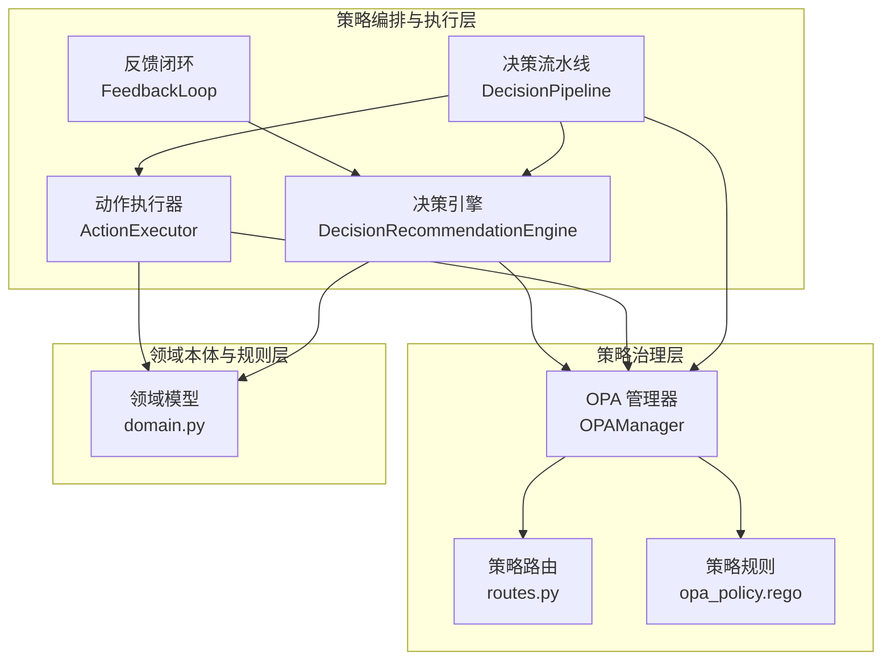
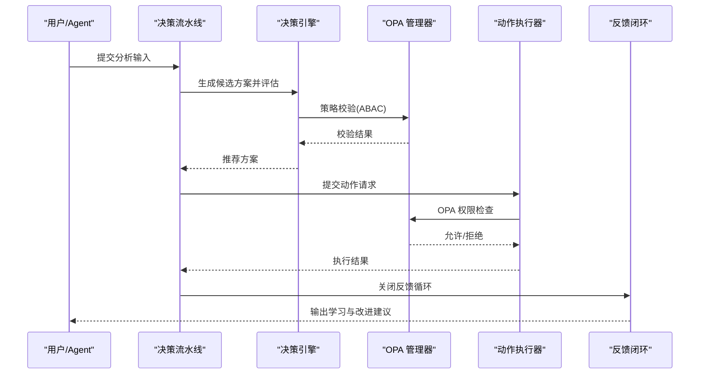
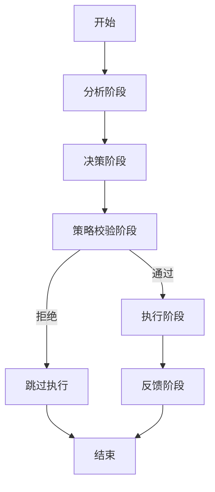
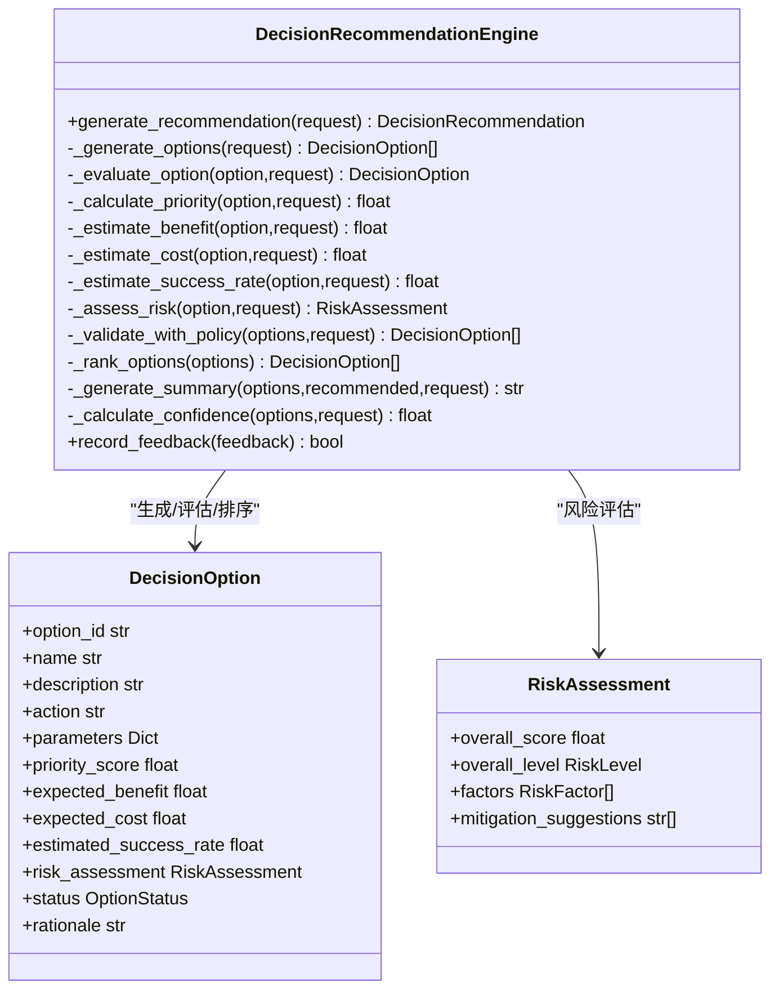
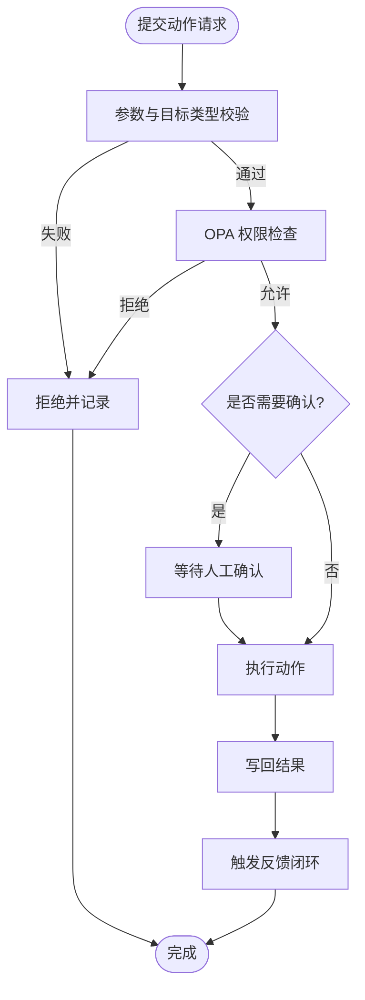
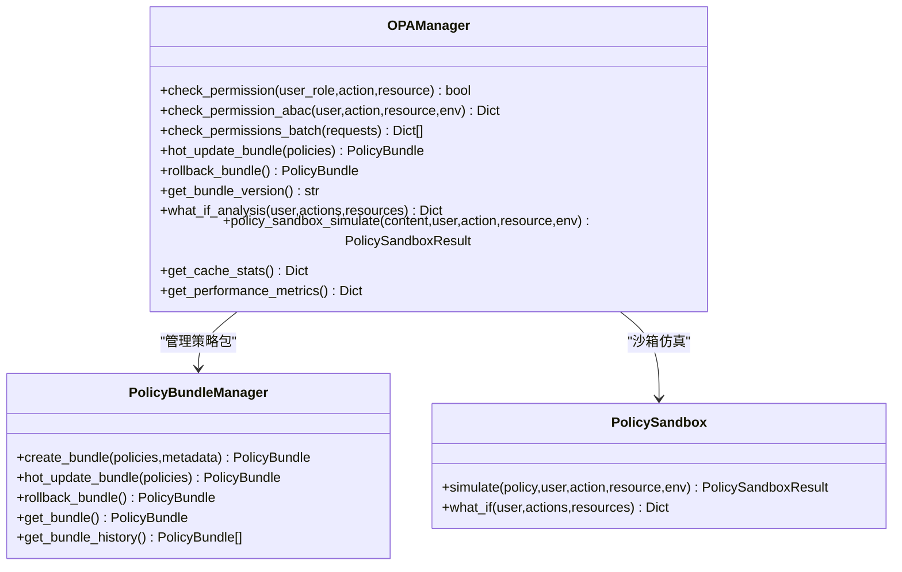
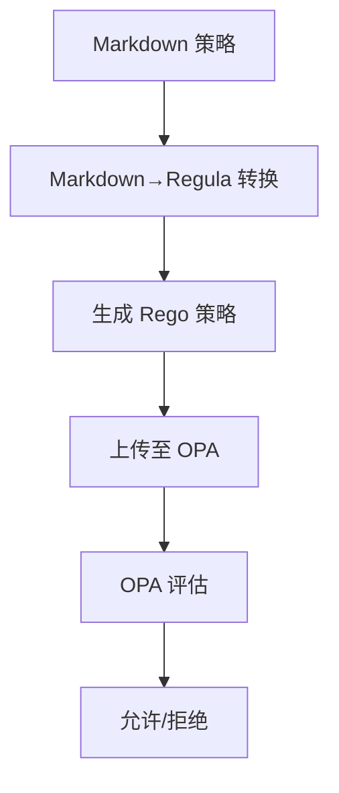
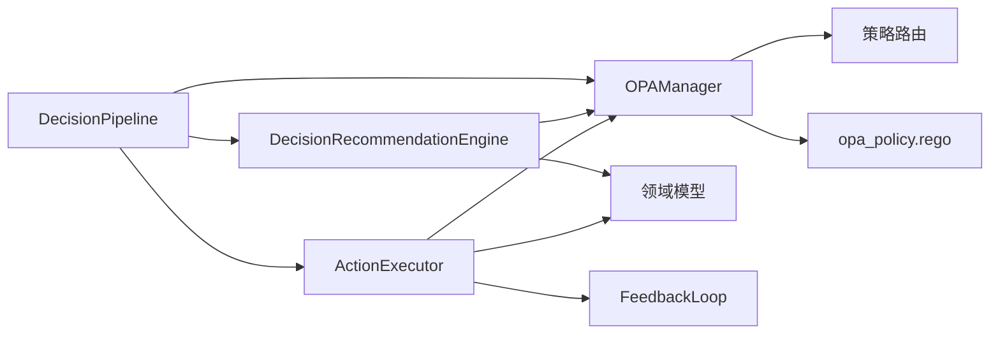

# 策略工具

<cite>
**本文引用的文件**
- [odap/tools/policy/policy.py](file://odap/tools/policy/policy.py)
- [odap/infra/opa/opa_service.py](file://odap/infra/opa/opa_service.py)
- [odap/infra/opa/opa_policy.rego](file://odap/infra/opa/opa_policy.rego)
- [odap/infra/opa/routes.py](file://odap/infra/opa/routes.py)
- [odap/biz/decision/decision_recommendation/engine.py](file://odap/biz/decision/decision_recommendation/engine.py)
- [odap/biz/decision/decision_recommendation/models.py](file://odap/biz/decision/decision_recommendation/models.py)
- [odap/biz/decision/action_service/executor.py](file://odap/biz/decision/action_service/executor.py)
- [odap/biz/decision/action_service/schemas.py](file://odap/biz/decision/action_service/schemas.py)
- [odap/biz/decision/decision_pipeline/pipeline.py](file://odap/biz/decision/decision_pipeline/pipeline.py)
- [odap/biz/decision/decision_pipeline/schemas.py](file://odap/biz/decision/decision_pipeline/schemas.py)
- [odap/biz/decision/action_service/feedback_loop.py](file://odap/biz/decision/action_service/feedback_loop.py)
- [odap/biz/core/ontology/schema/domain.py](file://odap/biz/core/ontology/schema/domain.py)
</cite>

## 目录
1. [引言](#引言)
2. [项目结构](#项目结构)
3. [核心组件](#核心组件)
4. [架构总览](#架构总览)
5. [详细组件分析](#详细组件分析)
6. [依赖分析](#依赖分析)
7. [性能考虑](#性能考虑)
8. [故障排查指南](#故障排查指南)
9. [结论](#结论)
10. [附录](#附录)

## 引言
本文件面向 ODAP 策略工具的技术文档，系统阐述策略工具在“策略制定、效果评估、动态调整”方面的理论基础、算法模型、实施流程与监控机制，并结合仓库现有实现，给出应用实例、参数配置、风险控制与合规检查要点，以及优化方法与持续改进路径，帮助读者建立完善的策略管理体系。

## 项目结构
策略工具贯穿三层：
- 策略编排与执行层：决策流水线、决策引擎、动作执行器、反馈闭环
- 策略治理层：OPA 权限管理、策略路由、策略沙箱、策略版本与回滚
- 领域本体与规则层：角色权限、动作类型、实体类型、Regula 策略

**图表来源**
- [odap/biz/decision/decision_pipeline/pipeline.py:64-139](file://odap/biz/decision/decision_pipeline/pipeline.py#L64-L139)
- [odap/biz/decision/decision_recommendation/engine.py:63-123](file://odap/biz/decision/decision_recommendation/engine.py#L63-L123)
- [odap/biz/decision/action_service/executor.py:48-92](file://odap/biz/decision/action_service/executor.py#L48-L92)
- [odap/infra/opa/opa_service.py:455-717](file://odap/infra/opa/opa_service.py#L455-L717)
- [odap/infra/opa/routes.py:11-422](file://odap/infra/opa/routes.py#L11-L422)
- [odap/infra/opa/opa_policy.rego:11-137](file://odap/infra/opa/opa_policy.rego#L11-L137)
- [odap/biz/core/ontology/schema/domain.py:284-371](file://odap/biz/core/ontology/schema/domain.py#L284-L371)

**章节来源**
- [odap/biz/decision/decision_pipeline/pipeline.py:13-139](file://odap/biz/decision/decision_pipeline/pipeline.py#L13-L139)
- [odap/infra/opa/opa_service.py:455-717](file://odap/infra/opa/opa_service.py#L455-L717)
- [odap/biz/core/ontology/schema/domain.py:12-179](file://odap/biz/core/ontology/schema/domain.py#L12-L179)

## 核心组件
- 决策流水线：串联“理解—决策—策略校验—执行—反馈”，提供阶段状态与错误处理
- 决策引擎：基于分析结果生成候选方案，评估优先级、收益、成本、成功率与风险，进行策略校验与排序
- 动作执行器：校验参数与目标类型，调用 OPA 进行策略校验，执行动作并写回
- OPA 管理器：ABAC 策略评估、策略热更新 Bundle、策略沙箱、批量权限检查与缓存
- 策略路由：策略 CRUD、Markdown→Regula 转换、版本管理
- 领域模型：角色权限、动作类型、实体类型、场景配置

**章节来源**
- [odap/biz/decision/decision_pipeline/pipeline.py:64-139](file://odap/biz/decision/decision_pipeline/pipeline.py#L64-L139)
- [odap/biz/decision/decision_recommendation/engine.py:34-123](file://odap/biz/decision/decision_recommendation/engine.py#L34-L123)
- [odap/biz/decision/action_service/executor.py:10-92](file://odap/biz/decision/action_service/executor.py#L10-L92)
- [odap/infra/opa/opa_service.py:455-717](file://odap/infra/opa/opa_service.py#L455-L717)
- [odap/infra/opa/routes.py:110-240](file://odap/infra/opa/routes.py#L110-L240)
- [odap/biz/core/ontology/schema/domain.py:284-371](file://odap/biz/core/ontology/schema/domain.py#L284-L371)

## 架构总览
策略工具以“流水线驱动+策略治理+本体规则”为核心，形成“输入分析→生成方案→评估与校验→执行→反馈”的闭环。

**图表来源**
- [odap/biz/decision/decision_pipeline/pipeline.py:64-139](file://odap/biz/decision/decision_pipeline/pipeline.py#L64-L139)
- [odap/biz/decision/decision_recommendation/engine.py:351-395](file://odap/biz/decision/decision_recommendation/engine.py#L351-L395)
- [odap/biz/decision/action_service/executor.py:119-137](file://odap/biz/decision/action_service/executor.py#L119-L137)
- [odap/biz/decision/action_service/feedback_loop.py:296-300](file://odap/biz/decision/action_service/feedback_loop.py#L296-L300)

## 详细组件分析

### 决策流水线（DecisionPipeline）
- 职责：按阶段推进，封装异常与状态；在“策略校验”阶段调用 OPA；在“执行”阶段提交动作请求；在“反馈”阶段关闭闭环
- 关键点：阶段状态机、回退策略（引擎不可用时的降级）、OPA fail-closed 设计

**图表来源**
- [odap/biz/decision/decision_pipeline/pipeline.py:64-139](file://odap/biz/decision/decision_pipeline/pipeline.py#L64-L139)

**章节来源**
- [odap/biz/decision/decision_pipeline/pipeline.py:13-139](file://odap/biz/decision/decision_pipeline/pipeline.py#L13-L139)
- [odap/biz/decision/decision_pipeline/schemas.py:14-74](file://odap/biz/decision/decision_pipeline/schemas.py#L14-L74)

### 决策引擎（DecisionRecommendationEngine）
- 职责：生成候选方案、评估优先级、估算收益/成本/成功率、风险评估、策略校验、排序与总结
- 评估模型：加权评分（收益、成本、成功率），风险多因子聚合，置信度合成
- 策略校验：调用 OPA，失败时标记为待定并保留方案
- RAG 增强：可选的知识检索支撑证据

**图表来源**
- [odap/biz/decision/decision_recommendation/engine.py:34-531](file://odap/biz/decision/decision_recommendation/engine.py#L34-L531)
- [odap/biz/decision/decision_recommendation/models.py:69-206](file://odap/biz/decision/decision_recommendation/models.py#L69-L206)

**章节来源**
- [odap/biz/decision/decision_recommendation/engine.py:63-123](file://odap/biz/decision/decision_recommendation/engine.py#L63-L123)
- [odap/biz/decision/decision_recommendation/models.py:14-206](file://odap/biz/decision/decision_recommendation/models.py#L14-L206)

### 动作执行器（ActionExecutor）
- 职责：参数校验、OPA 策略检查、动作执行、写回、失败回退、触发反馈闭环
- 设计：fail-closed（OPA 未就绪时拒绝），支持多种动作类型（更新、创建、删除、链接等）

**图表来源**
- [odap/biz/decision/action_service/executor.py:48-175](file://odap/biz/decision/action_service/executor.py#L48-L175)

**章节来源**
- [odap/biz/decision/action_service/executor.py:10-175](file://odap/biz/decision/action_service/executor.py#L10-L175)
- [odap/biz/decision/action_service/schemas.py:17-57](file://odap/biz/decision/action_service/schemas.py#L17-L57)

### OPA 管理器（OPAManager）
- 职责：ABAC 策略评估、策略 Bundle 热更新与回滚、策略沙箱、批量权限检查、缓存与性能指标
- 模式：Mock 与真实 OPA Server 自动切换；健康检查失败时自动回退到本地评估
- 策略版本：当前/上一版本记录与历史维护

**图表来源**
- [odap/infra/opa/opa_service.py:455-717](file://odap/infra/opa/opa_service.py#L455-L717)

**章节来源**
- [odap/infra/opa/opa_service.py:455-717](file://odap/infra/opa/opa_service.py#L455-L717)

### 策略路由与规则（routes + opa_policy.rego）
- 路由：策略 CRUD、Markdown→Regula 转换、版本号递增、启用/禁用
- 规则：基于角色与权限映射的 allow 主规则，限制检查（如攻击民用设施），调试辅助规则与元数据

**图表来源**
- [odap/infra/opa/routes.py:242-422](file://odap/infra/opa/routes.py#L242-L422)
- [odap/infra/opa/opa_policy.rego:11-137](file://odap/infra/opa/opa_policy.rego#L11-L137)

**章节来源**
- [odap/infra/opa/routes.py:110-240](file://odap/infra/opa/routes.py#L110-L240)
- [odap/infra/opa/opa_policy.rego:11-137](file://odap/infra/opa/opa_policy.rego#L11-L137)

### 领域本体与动作类型（domain.py）
- 角色权限：pilot/commander/intelligence_analyst 的权限与限制
- 动作类型：移动、攻击、防御、增援、撤退、观察、通信等，含参数、所需角色、是否需要确认
- 场景配置：交战方、区域、随机事件等

**章节来源**
- [odap/biz/core/ontology/schema/domain.py:284-371](file://odap/biz/core/ontology/schema/domain.py#L284-L371)

### 反馈闭环（FeedbackLoop）
- 收集：从动作记录提取执行结果
- 分析：偏差评分、根因归类、生成经验教训
- 聚合：更新图谱实体、创建反馈 Episode、发出钩子事件

**章节来源**
- [odap/biz/decision/action_service/feedback_loop.py:290-311](file://odap/biz/decision/action_service/feedback_loop.py#L290-L311)

## 依赖分析
- 决策流水线依赖：决策引擎、动作执行器、OPA 管理器、反馈闭环
- 决策引擎依赖：OPA 管理器、Graphiti（可选 RAG）、领域模型
- 动作执行器依赖：OMS（动作类型定义）、OPA 管理器、图谱服务、写回管理器
- OPA 管理器依赖：OPA REST 客户端、策略沙箱、策略 Bundle 管理器、缓存与历史

**图表来源**
- [odap/biz/decision/decision_pipeline/pipeline.py:21-62](file://odap/biz/decision/decision_pipeline/pipeline.py#L21-L62)
- [odap/biz/decision/decision_recommendation/engine.py:46-59](file://odap/biz/decision/decision_recommendation/engine.py#L46-L59)
- [odap/biz/decision/action_service/executor.py:24-46](file://odap/biz/decision/action_service/executor.py#L24-L46)
- [odap/infra/opa/opa_service.py:466-471](file://odap/infra/opa/opa_service.py#L466-L471)
- [odap/biz/core/ontology/schema/domain.py:284-371](file://odap/biz/core/ontology/schema/domain.py#L284-L371)

**章节来源**
- [odap/biz/decision/decision_pipeline/pipeline.py:21-62](file://odap/biz/decision/decision_pipeline/pipeline.py#L21-L62)
- [odap/biz/decision/decision_recommendation/engine.py:46-59](file://odap/biz/decision/decision_recommendation/engine.py#L46-L59)
- [odap/biz/decision/action_service/executor.py:24-46](file://odap/biz/decision/action_service/executor.py#L24-L46)
- [odap/infra/opa/opa_service.py:466-471](file://odap/infra/opa/opa_service.py#L466-L471)

## 性能考虑
- 缓存与批量：OPA 管理器内置缓存与批量检查，降低重复调用开销
- 模式回退：健康检查失败自动切换到本地评估，保证系统可用性
- 评估复杂度：决策引擎的优先级与风险评估为线性复杂度，受候选方案数量影响
- I/O 优化：动作执行器的写回与图谱更新可异步化，避免阻塞主流程

[本节为通用指导，无需具体文件引用]

## 故障排查指南
- OPA 服务不可用
  - 现象：策略校验失败，动作被拒绝
  - 措施：检查 OPA 服务健康状态、网络连通性；确认策略已上传；查看缓存命中率
  - 参考
    - [odap/infra/opa/opa_service.py:444-449](file://odap/infra/opa/opa_service.py#L444-L449)
    - [odap/infra/opa/opa_service.py:684-695](file://odap/infra/opa/opa_service.py#L684-L695)
- 动作执行失败
  - 现象：执行结果失败、错误信息
  - 措施：检查参数校验、目标对象类型、OPA 权限；查看写回配置
  - 参考
    - [odap/biz/decision/action_service/executor.py:85-91](file://odap/biz/decision/action_service/executor.py#L85-L91)
    - [odap/biz/decision/action_service/executor.py:177-245](file://odap/biz/decision/action_service/executor.py#L177-L245)
- 策略版本问题
  - 现象：策略回滚后仍不生效
  - 措施：确认 Bundle 当前版本、策略上传状态、OPA 策略路径
  - 参考
    - [odap/infra/opa/opa_service.py:298-314](file://odap/infra/opa/opa_service.py#L298-L314)
    - [odap/infra/opa/opa_service.py:649-660](file://odap/infra/opa/opa_service.py#L649-L660)
- 反馈闭环异常
  - 现象：反馈未写入图谱或未触发钩子
  - 措施：检查图谱服务、钩子注册、日志警告
  - 参考
    - [odap/biz/decision/action_service/feedback_loop.py:177-212](file://odap/biz/decision/action_service/feedback_loop.py#L177-L212)
    - [odap/biz/decision/action_service/feedback_loop.py:274-287](file://odap/biz/decision/action_service/feedback_loop.py#L274-L287)

**章节来源**
- [odap/infra/opa/opa_service.py:444-449](file://odap/infra/opa/opa_service.py#L444-L449)
- [odap/infra/opa/opa_service.py:649-660](file://odap/infra/opa/opa_service.py#L649-L660)
- [odap/biz/decision/action_service/executor.py:85-91](file://odap/biz/decision/action_service/executor.py#L85-L91)
- [odap/biz/decision/action_service/feedback_loop.py:177-212](file://odap/biz/decision/action_service/feedback_loop.py#L177-L212)

## 结论
ODAP 策略工具通过“流水线驱动 + 策略治理 + 本体规则”的架构，实现了从“理解—决策—校验—执行—反馈”的闭环。其核心优势在于：
- 清晰的阶段划分与 fail-closed 设计，保障安全与稳定
- OPA 的 ABAC 模型与策略沙箱，支持灵活的策略制定与验证
- 决策引擎的多维评估与风险聚合，提升推荐质量与可解释性
- 反馈闭环促进持续改进，形成“策略—执行—学习—优化”的正向循环

[本节为总结，无需具体文件引用]

## 附录

### 应用实例：策略设计与 A/B 测试
- 策略设计
  - 使用策略路由创建/更新策略，Markdown→Regula 转换后上传 OPA
  - 参考
    - [odap/infra/opa/routes.py:137-240](file://odap/infra/opa/routes.py#L137-L240)
    - [odap/infra/opa/routes.py:242-422](file://odap/infra/opa/routes.py#L242-L422)
- A/B 测试
  - 使用策略沙箱进行“What-If”分析，对比不同策略下的权限结果
  - 参考
    - [odap/infra/opa/opa_service.py:316-371](file://odap/infra/opa/opa_service.py#L316-L371)
- 效果量化
  - 通过反馈闭环收集偏差评分、根因与经验教训，用于策略迭代
  - 参考
    - [odap/biz/decision/action_service/feedback_loop.py:54-153](file://odap/biz/decision/action_service/feedback_loop.py#L54-L153)

**章节来源**
- [odap/infra/opa/routes.py:137-240](file://odap/infra/opa/routes.py#L137-L240)
- [odap/infra/opa/opa_service.py:316-371](file://odap/infra/opa/opa_service.py#L316-L371)
- [odap/biz/decision/action_service/feedback_loop.py:54-153](file://odap/biz/decision/action_service/feedback_loop.py#L54-L153)

### 参数配置与风险控制
- 参数配置
  - 动作类型参数、所需角色、是否需要确认、OPA 策略路径
  - 参考
    - [odap/biz/core/ontology/schema/domain.py:187-282](file://odap/biz/core/ontology/schema/domain.py#L187-L282)
- 风险控制
  - 决策引擎的风险因子与缓解建议；OPA 的限制规则（如攻击民用设施）
  - 参考
    - [odap/biz/decision/decision_recommendation/engine.py:270-338](file://odap/biz/decision/decision_recommendation/engine.py#L270-L338)
    - [odap/infra/opa/opa_policy.rego:106-111](file://odap/infra/opa/opa_policy.rego#L106-L111)

**章节来源**
- [odap/biz/core/ontology/schema/domain.py:187-282](file://odap/biz/core/ontology/schema/domain.py#L187-L282)
- [odap/biz/decision/decision_recommendation/engine.py:270-338](file://odap/biz/decision/decision_recommendation/engine.py#L270-L338)
- [odap/infra/opa/opa_policy.rego:106-111](file://odap/infra/opa/opa_policy.rego#L106-L111)

### 合规检查与审计
- 合规策略：通过策略路由创建合规审计策略，上传至 OPA
- 审计追踪：动作执行记录、OPA 决策记录、反馈闭环事件
- 参考
  - [odap/infra/opa/routes.py:39-94](file://odap/infra/opa/routes.py#L39-L94)
  - [odap/infra/opa/opa_service.py:622-630](file://odap/infra/opa/opa_service.py#L622-L630)
  - [odap/biz/decision/action_service/feedback_loop.py:214-287](file://odap/biz/decision/action_service/feedback_loop.py#L214-L287)

**章节来源**
- [odap/infra/opa/routes.py:39-94](file://odap/infra/opa/routes.py#L39-L94)
- [odap/infra/opa/opa_service.py:622-630](file://odap/infra/opa/opa_service.py#L622-L630)
- [odap/biz/decision/action_service/feedback_loop.py:214-287](file://odap/biz/decision/action_service/feedback_loop.py#L214-L287)

### 优化方法与持续改进
- 策略优化
  - 使用策略沙箱进行策略变更预演，减少上线风险
  - 参考
    - [odap/infra/opa/opa_service.py:316-371](file://odap/infra/opa/opa_service.py#L316-L371)
- 决策优化
  - 调整评估权重、引入更多证据（RAG）、扩展风险因子
  - 参考
    - [odap/biz/decision/decision_recommendation/engine.py:197-221](file://odap/biz/decision/decision_recommendation/engine.py#L197-L221)
    - [odap/biz/decision/decision_recommendation/engine.py:453-470](file://odap/biz/decision/decision_recommendation/engine.py#L453-L470)
- 执行优化
  - 异步写回、批量权限检查、缓存命中率监控
  - 参考
    - [odap/infra/opa/opa_service.py:585-598](file://odap/infra/opa/opa_service.py#L585-L598)
    - [odap/infra/opa/opa_service.py:668-677](file://odap/infra/opa/opa_service.py#L668-L677)

**章节来源**
- [odap/infra/opa/opa_service.py:316-371](file://odap/infra/opa/opa_service.py#L316-L371)
- [odap/biz/decision/decision_recommendation/engine.py:197-221](file://odap/biz/decision/decision_recommendation/engine.py#L197-L221)
- [odap/infra/opa/opa_service.py:585-598](file://odap/infra/opa/opa_service.py#L585-L598)
- [odap/infra/opa/opa_service.py:668-677](file://odap/infra/opa/opa_service.py#L668-L677)