# 规划工具

<cite>
**本文引用的文件**
- [odap/tools/planning/planning.py](file://odap/tools/planning/planning.py)
- [odap/biz/decision/decision_recommendation/engine.py](file://odap/biz/decision/decision_recommendation/engine.py)
- [odap/biz/decision/decision_recommendation/models.py](file://odap/biz/decision/decision_recommendation/models.py)
- [odap/biz/decision/decision_pipeline/pipeline.py](file://odap/biz/decision/decision_pipeline/pipeline.py)
- [odap/biz/decision/decision_pipeline/schemas.py](file://odap/biz/decision/decision_pipeline/schemas.py)
- [odap/biz/core/agent/orchestrator.py](file://odap/biz/core/agent/orchestrator.py)
- [odap/tools/registry.py](file://odap/tools/registry.py)
- [odap/biz/simulation/event_simulator/services/simulator_service.py](file://odap/biz/simulation/event_simulator/services/simulator_service.py)
- [odap/biz/simulation/feedback/loop.py](file://odap/biz/simulation/feedback/loop.py)
- [docs/03-modules/decision_recommendation/DESIGN.md](file://docs/03-modules/decision_recommendation/DESIGN.md)
- [docs/03-modules/visualization/DESIGN.md](file://docs/03-modules/visualization/DESIGN.md)
- [specs/001-odap-platform/spec.md](file://specs/001-odap-platform/spec.md)
</cite>

## 目录
1. [引言](#引言)
2. [项目结构](#项目结构)
3. [核心组件](#核心组件)
4. [架构总览](#架构总览)
5. [详细组件分析](#详细组件分析)
6. [依赖分析](#依赖分析)
7. [性能考虑](#性能考虑)
8. [故障排查指南](#故障排查指南)
9. [结论](#结论)
10. [附录](#附录)

## 引言
本文件面向 ODAP 规划工具，系统化阐述其在“战略规划、资源配置、风险评估”等方面的能力与实现方式，涵盖建模方法、算法原理、参数设置、结果输出、实际应用案例、迭代优化与不确定性处理，并提供使用技巧与专家经验，帮助用户制定科学合理的业务规划。

## 项目结构
ODAP 的规划工具由“计划生成与执行”“决策推荐与风险评估”“推演与反馈闭环”三大子系统构成，配合“智能体编排器”与“技能注册中心”，形成从“目标设定—方案生成—策略校验—执行—反馈”的完整闭环。

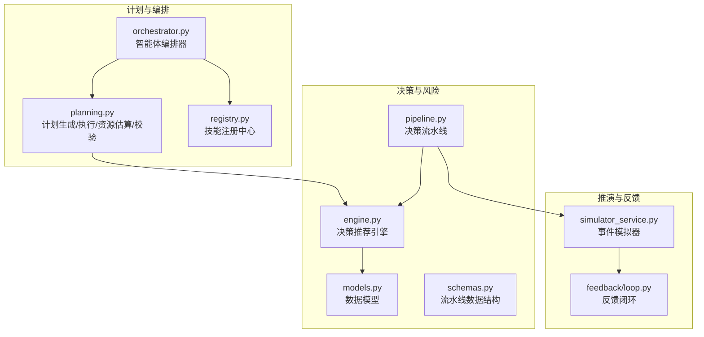

**图表来源**
- [odap/tools/planning/planning.py:1-289](file://odap/tools/planning/planning.py#L1-L289)
- [odap/biz/core/agent/orchestrator.py:1-151](file://odap/biz/core/agent/orchestrator.py#L1-L151)
- [odap/tools/registry.py:1-53](file://odap/tools/registry.py#L1-L53)
- [odap/biz/decision/decision_recommendation/engine.py:1-603](file://odap/biz/decision/decision_recommendation/engine.py#L1-L603)
- [odap/biz/decision/decision_recommendation/models.py:1-244](file://odap/biz/decision/decision_recommendation/models.py#L1-L244)
- [odap/biz/decision/decision_pipeline/pipeline.py:1-283](file://odap/biz/decision/decision_pipeline/pipeline.py#L1-L283)
- [odap/biz/decision/decision_pipeline/schemas.py:1-74](file://odap/biz/decision/decision_pipeline/schemas.py#L1-L74)
- [odap/biz/simulation/event_simulator/services/simulator_service.py:1-134](file://odap/biz/simulation/event_simulator/services/simulator_service.py#L1-L134)
- [odap/biz/simulation/feedback/loop.py:1-45](file://odap/biz/simulation/feedback/loop.py#L1-L45)

**章节来源**
- [odap/tools/planning/planning.py:1-289](file://odap/tools/planning/planning.py#L1-L289)
- [odap/biz/core/agent/orchestrator.py:1-151](file://odap/biz/core/agent/orchestrator.py#L1-L151)
- [odap/tools/registry.py:1-53](file://odap/tools/registry.py#L1-L53)
- [odap/biz/decision/decision_recommendation/engine.py:1-603](file://odap/biz/decision/decision_recommendation/engine.py#L1-L603)
- [odap/biz/decision/decision_recommendation/models.py:1-244](file://odap/biz/decision/decision_recommendation/models.py#L1-L244)
- [odap/biz/decision/decision_pipeline/pipeline.py:1-283](file://odap/biz/decision/decision_pipeline/pipeline.py#L1-L283)
- [odap/biz/decision/decision_pipeline/schemas.py:1-74](file://odap/biz/decision/decision_pipeline/schemas.py#L1-L74)
- [odap/biz/simulation/event_simulator/services/simulator_service.py:1-134](file://odap/biz/simulation/event_simulator/services/simulator_service.py#L1-L134)
- [odap/biz/simulation/feedback/loop.py:1-45](file://odap/biz/simulation/feedback/loop.py#L1-L45)

## 核心组件
- 计划生成与执行：根据目标自动生成执行步骤、校验可行性、估算资源与成本。
- 决策推荐与风险评估：基于收益、成本、成功率与多维风险因子，生成优先级评分与推荐方案。
- 推演与反馈闭环：在沙箱中执行推演，收集偏差并沉淀经验，驱动后续优化。
- 智能体编排与技能注册：解析用户意图，路由到合适技能，统一注册与调用。

**章节来源**
- [odap/tools/planning/planning.py:18-119](file://odap/tools/planning/planning.py#L18-L119)
- [odap/biz/decision/decision_recommendation/engine.py:63-123](file://odap/biz/decision/decision_recommendation/engine.py#L63-L123)
- [odap/biz/simulation/event_simulator/services/simulator_service.py:47-104](file://odap/biz/simulation/event_simulator/services/simulator_service.py#L47-L104)
- [odap/biz/simulation/feedback/loop.py:18-30](file://odap/biz/simulation/feedback/loop.py#L18-L30)
- [odap/biz/core/agent/orchestrator.py:33-114](file://odap/biz/core/agent/orchestrator.py#L33-L114)
- [odap/tools/registry.py:26-38](file://odap/tools/registry.py#L26-L38)

## 架构总览
下图展示了从“目标输入”到“执行与反馈”的端到端流程，强调“计划—决策—推演—反馈”的闭环。

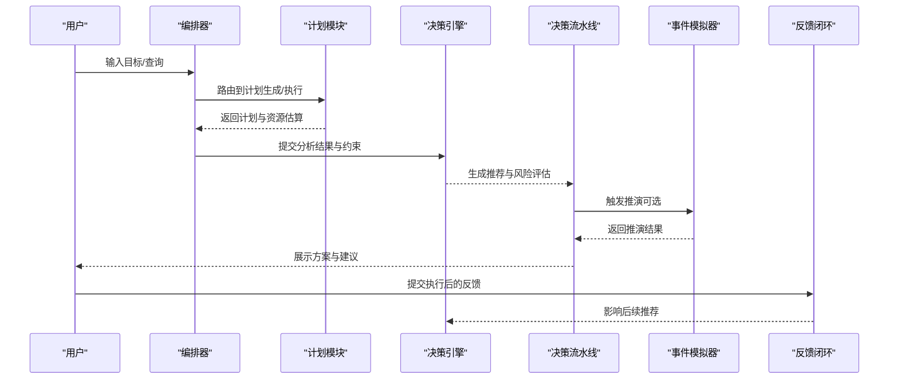

**图表来源**
- [odap/biz/core/agent/orchestrator.py:33-114](file://odap/biz/core/agent/orchestrator.py#L33-L114)
- [odap/tools/planning/planning.py:18-119](file://odap/tools/planning/planning.py#L18-L119)
- [odap/biz/decision/decision_recommendation/engine.py:63-123](file://odap/biz/decision/decision_recommendation/engine.py#L63-L123)
- [odap/biz/decision/decision_pipeline/pipeline.py:64-139](file://odap/biz/decision/decision_pipeline/pipeline.py#L64-L139)
- [odap/biz/simulation/event_simulator/services/simulator_service.py:47-104](file://odap/biz/simulation/event_simulator/services/simulator_service.py#L47-L104)
- [odap/biz/simulation/feedback/loop.py:18-30](file://odap/biz/simulation/feedback/loop.py#L18-L30)

## 详细组件分析

### 计划生成与执行（planning.py）
- 功能要点
  - 目标到步骤映射：根据目标关键词生成侦察、威胁分析、授权、执行、毁伤评估等步骤。
  - 可行性校验：检查步骤所需技能是否可用、步骤数量是否合理。
  - 资源估算：汇总耗时、统计技能使用频次，给出人员与成本等级。
  - 执行工作流：按步骤返回执行结果，便于与策略校验与反馈闭环衔接。
- 关键流程（创建计划）

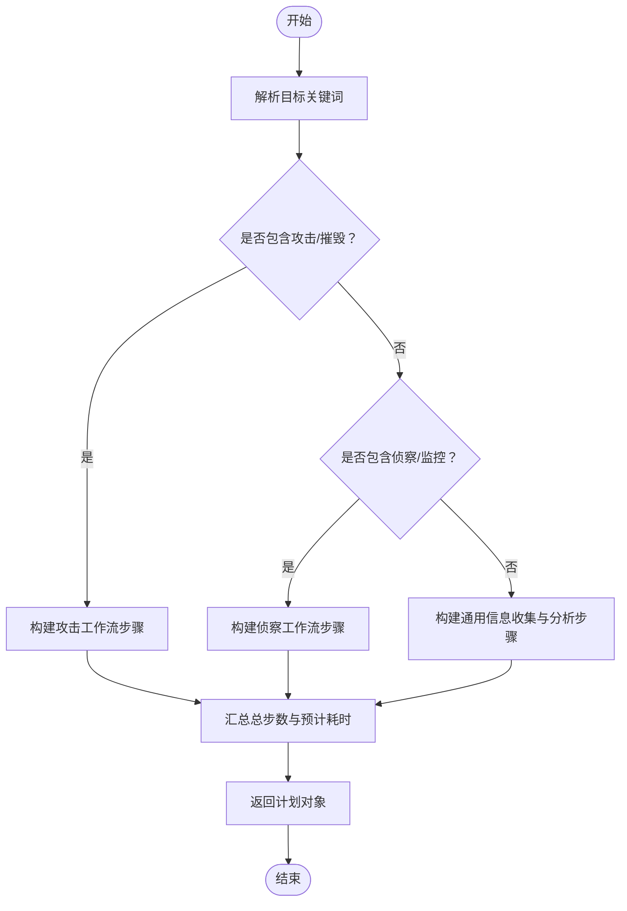

**图表来源**
- [odap/tools/planning/planning.py:18-119](file://odap/tools/planning/planning.py#L18-L119)

- 关键流程（资源估算）

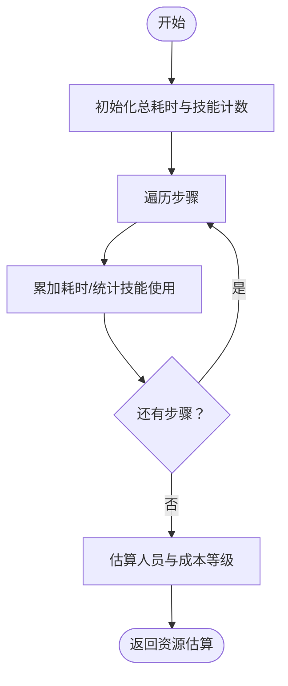

**图表来源**
- [odap/tools/planning/planning.py:234-261](file://odap/tools/planning/planning.py#L234-L261)

- 关键流程（可行性校验）

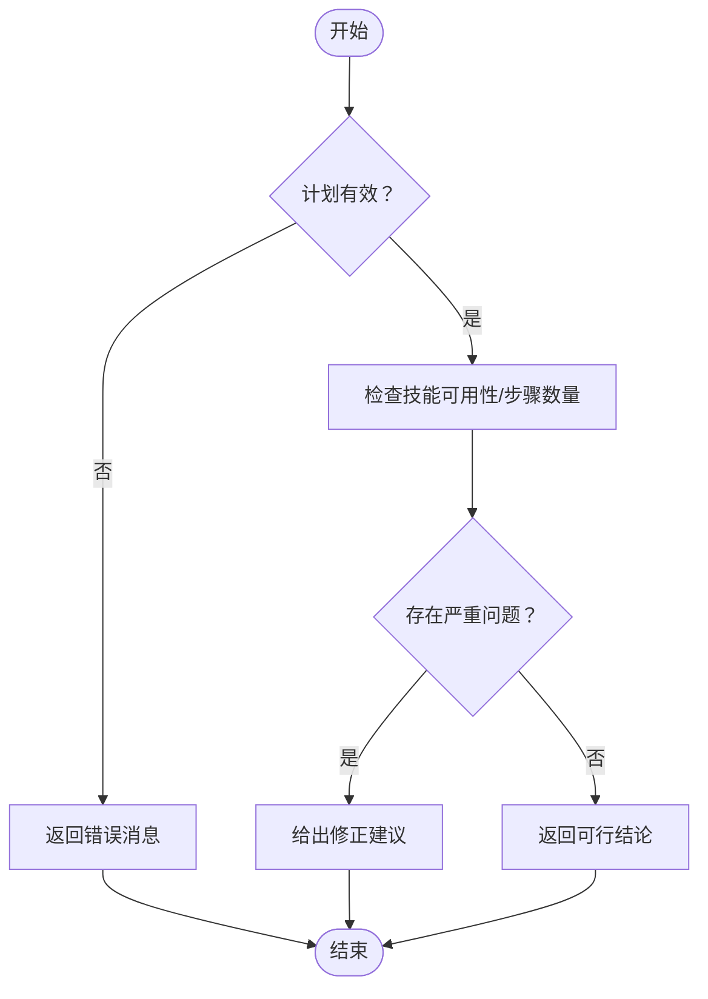

**图表来源**
- [odap/tools/planning/planning.py:198-232](file://odap/tools/planning/planning.py#L198-L232)

**章节来源**
- [odap/tools/planning/planning.py:18-119](file://odap/tools/planning/planning.py#L18-L119)
- [odap/tools/planning/planning.py:198-232](file://odap/tools/planning/planning.py#L198-L232)
- [odap/tools/planning/planning.py:234-261](file://odap/tools/planning/planning.py#L234-L261)

### 决策推荐与风险评估（engine.py + models.py）
- 功能要点
  - 候选方案生成：若请求中无方案，则基于分析结果生成默认方案。
  - 评估指标：优先级评分（收益、成本、成功率加权）、预期收益/成本、成功率、风险评估。
  - 风险评估：执行风险、资源风险、时间风险、外部风险，加权汇总并分级。
  - 策略校验：对接 OPA，允许/拒绝或标记待定。
  - 排序与推荐：按优先级与成功率排序，标注推荐/备选。
  - 置信度与摘要：综合方案数量、评分与证据充分度，生成摘要。
- 关键流程（生成推荐）

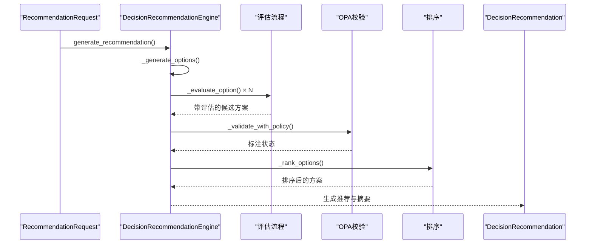

**图表来源**
- [odap/biz/decision/decision_recommendation/engine.py:63-123](file://odap/biz/decision/decision_recommendation/engine.py#L63-L123)
- [odap/biz/decision/decision_recommendation/engine.py:125-195](file://odap/biz/decision/decision_recommendation/engine.py#L125-L195)
- [odap/biz/decision/decision_recommendation/engine.py:351-395](file://odap/biz/decision/decision_recommendation/engine.py#L351-L395)
- [odap/biz/decision/decision_recommendation/engine.py:397-426](file://odap/biz/decision/decision_recommendation/engine.py#L397-L426)

- 关键类关系（模型）

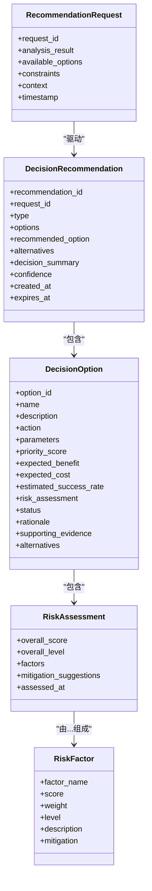

**图表来源**
- [odap/biz/decision/decision_recommendation/models.py:38-244](file://odap/biz/decision/decision_recommendation/models.py#L38-L244)

**章节来源**
- [odap/biz/decision/decision_recommendation/engine.py:63-123](file://odap/biz/decision/decision_recommendation/engine.py#L63-L123)
- [odap/biz/decision/decision_recommendation/engine.py:160-195](file://odap/biz/decision/decision_recommendation/engine.py#L160-L195)
- [odap/biz/decision/decision_recommendation/engine.py:270-338](file://odap/biz/decision/decision_recommendation/engine.py#L270-L338)
- [odap/biz/decision/decision_recommendation/engine.py:351-395](file://odap/biz/decision/decision_recommendation/engine.py#L351-L395)
- [odap/biz/decision/decision_recommendation/engine.py:397-426](file://odap/biz/decision/decision_recommendation/engine.py#L397-L426)
- [odap/biz/decision/decision_recommendation/models.py:38-244](file://odap/biz/decision/decision_recommendation/models.py#L38-L244)

### 决策流水线（pipeline.py + schemas.py）
- 功能要点
  - 分析阶段：语义检索、实体抽取、模式与风险识别。
  - 决策阶段：调用决策引擎生成推荐，或回退到基于本体的动作类型生成。
  - 策略校验：基于 OPA 的 ABAC 权限检查。
  - 执行阶段：提交动作请求给动作执行器。
  - 反馈阶段：闭环收集偏差、生成经验并更新。
- 关键流程（流水线执行）

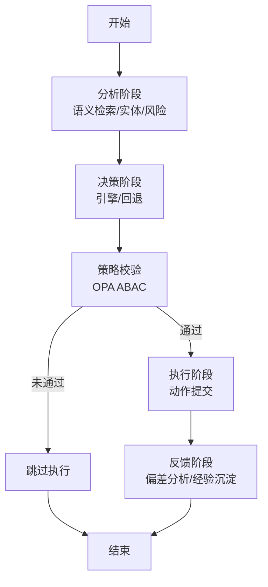

**图表来源**
- [odap/biz/decision/decision_pipeline/pipeline.py:64-139](file://odap/biz/decision/decision_pipeline/pipeline.py#L64-L139)
- [odap/biz/decision/decision_pipeline/pipeline.py:232-255](file://odap/biz/decision/decision_pipeline/pipeline.py#L232-L255)

**章节来源**
- [odap/biz/decision/decision_pipeline/pipeline.py:1-283](file://odap/biz/decision/decision_pipeline/pipeline.py#L1-L283)
- [odap/biz/decision/decision_pipeline/schemas.py:14-74](file://odap/biz/decision/decision_pipeline/schemas.py#L14-L74)

### 推演与反馈闭环（事件模拟器 + 反馈闭环）
- 功能要点
  - 事件模拟器：模板化事件生成、时间控制、触发器机制。
  - 反馈闭环：偏差分析、经验提炼、聚合更新，形成学习闭环。
- 关键流程（推演与反馈）

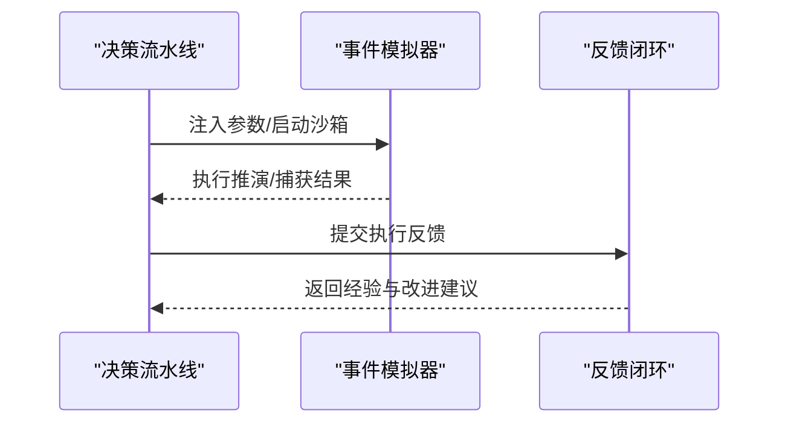

**图表来源**
- [odap/biz/simulation/event_simulator/services/simulator_service.py:47-104](file://odap/biz/simulation/event_simulator/services/simulator_service.py#L47-L104)
- [odap/biz/simulation/feedback/loop.py:18-30](file://odap/biz/simulation/feedback/loop.py#L18-L30)

**章节来源**
- [odap/biz/simulation/event_simulator/services/simulator_service.py:1-134](file://odap/biz/simulation/event_simulator/services/simulator_service.py#L1-L134)
- [odap/biz/simulation/feedback/loop.py:1-45](file://odap/biz/simulation/feedback/loop.py#L1-L45)

### 智能体编排与技能注册（orchestrator.py + registry.py）
- 功能要点
  - 编排器：解析用户查询，路由到对应技能，执行并返回结果。
  - 注册中心：统一注册旧版技能与新版技能注册表，保持双向同步。
- 关键流程（查询解析与执行）

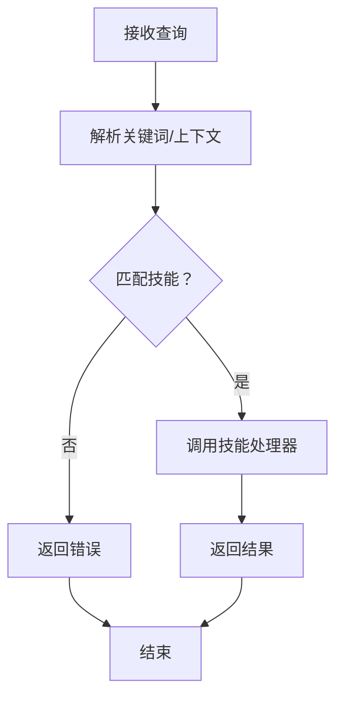

**图表来源**
- [odap/biz/core/agent/orchestrator.py:64-114](file://odap/biz/core/agent/orchestrator.py#L64-L114)
- [odap/tools/registry.py:26-38](file://odap/tools/registry.py#L26-L38)

**章节来源**
- [odap/biz/core/agent/orchestrator.py:1-151](file://odap/biz/core/agent/orchestrator.py#L1-L151)
- [odap/tools/registry.py:1-53](file://odap/tools/registry.py#L1-L53)

## 依赖分析
- 组件耦合
  - 计划模块与编排器/注册中心：通过技能目录与注册表解耦。
  - 决策引擎与模型：以 Pydantic 模型作为契约，降低耦合。
  - 决策流水线：依赖引擎、OPA、动作执行器与反馈闭环。
  - 推演与反馈：事件模拟器与反馈闭环独立，通过流水线集成。
- 外部依赖
  - OPA：策略校验（fail-closed）。
  - Graphiti：RAG 增强与知识图谱写入。
  - 事件模拟器：沙箱执行与时间控制。
- 潜在风险
  - 技能缺失：计划校验会发出警告，需补齐技能或调整计划。
  - OPA 不可用：流水线在 fail-closed 模式下拒绝执行。
  - 推演性能：并发与单次推演时延需满足平台指标。

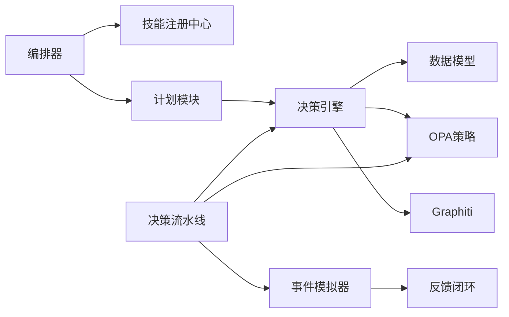

**图表来源**
- [odap/biz/core/agent/orchestrator.py:1-151](file://odap/biz/core/agent/orchestrator.py#L1-L151)
- [odap/tools/registry.py:1-53](file://odap/tools/registry.py#L1-L53)
- [odap/tools/planning/planning.py:1-289](file://odap/tools/planning/planning.py#L1-L289)
- [odap/biz/decision/decision_recommendation/engine.py:1-603](file://odap/biz/decision/decision_recommendation/engine.py#L1-L603)
- [odap/biz/decision/decision_pipeline/pipeline.py:1-283](file://odap/biz/decision/decision_pipeline/pipeline.py#L1-L283)
- [odap/biz/simulation/event_simulator/services/simulator_service.py:1-134](file://odap/biz/simulation/event_simulator/services/simulator_service.py#L1-L134)
- [odap/biz/simulation/feedback/loop.py:1-45](file://odap/biz/simulation/feedback/loop.py#L1-L45)

**章节来源**
- [odap/biz/core/agent/orchestrator.py:1-151](file://odap/biz/core/agent/orchestrator.py#L1-L151)
- [odap/tools/registry.py:1-53](file://odap/tools/registry.py#L1-L53)
- [odap/biz/decision/decision_pipeline/pipeline.py:1-283](file://odap/biz/decision/decision_pipeline/pipeline.py#L1-L283)

## 性能考虑
- 并发与响应
  - 平台指标要求：问答响应 P95 < 3s，图谱查询 P95 < 500ms；推演沙箱支持至少 10 个方案并行，单次推演平均时长 < 30s。
- 资源与成本
  - 计划模块提供粗粒度资源估算（耗时、技能使用、人员、成本等级），可用于调度与预算控制。
- 策略校验
  - OPA 校验失败时采用 fail-closed，确保安全；建议提前准备策略热更新与可观测性。
- 推演与可视化
  - 可视化模块支持 What-if 分析的参数影响、敏感性与趋势图，辅助快速定位关键变量。

**章节来源**
- [specs/001-odap-platform/spec.md:213-225](file://specs/001-odap-platform/spec.md#L213-L225)
- [odap/tools/planning/planning.py:234-261](file://odap/tools/planning/planning.py#L234-L261)
- [odap/biz/simulation/feedback/loop.py:1-45](file://odap/biz/simulation/feedback/loop.py#L1-L45)
- [docs/03-modules/visualization/DESIGN.md:486-625](file://docs/03-modules/visualization/DESIGN.md#L486-L625)

## 故障排查指南
- 技能缺失或不可用
  - 现象：计划校验出现警告。
  - 处理：补充缺失技能或调整计划步骤；必要时在编排器中增加容错分支。
- OPA 校验失败
  - 现象：决策流水线拒绝执行或标记待定。
  - 处理：检查策略配置、环境变量与权限上下文；启用 fail-closed 时需确保策略正确。
- 推演异常
  - 现象：沙箱创建/注入参数/清理失败。
  - 处理：查看事件模拟器日志，确认模板与参数 Schema；检查时间控制与触发器配置。
- 反馈未闭环
  - 现象：执行完成后未生成经验。
  - 处理：确认反馈收集器与分析器正常运行，检查聚合更新逻辑。

**章节来源**
- [odap/tools/planning/planning.py:214-232](file://odap/tools/planning/planning.py#L214-L232)
- [odap/biz/decision/decision_pipeline/pipeline.py:232-255](file://odap/biz/decision/decision_pipeline/pipeline.py#L232-L255)
- [odap/biz/simulation/event_simulator/services/simulator_service.py:47-104](file://odap/biz/simulation/event_simulator/services/simulator_service.py#L47-L104)
- [odap/biz/simulation/feedback/loop.py:18-30](file://odap/biz/simulation/feedback/loop.py#L18-L30)

## 结论
ODAP 规划工具通过“计划—决策—推演—反馈”的闭环，实现了从目标设定到方案比较、可行性分析、资源配置与风险评估的全链路自动化与可解释化。依托技能注册中心与编排器，系统具备良好的扩展性；结合 OPA 与知识图谱，确保策略合规与经验沉淀。平台指标与可视化能力进一步保障了性能与决策质量。

## 附录

### 实际应用案例（示例流程）
- 目标设定：某区域发现高价值目标，要求在有限时间内完成侦察与打击。
- 方案比较：编排器根据目标关键词路由到计划模块，生成攻击工作流；同时调用决策引擎生成多个备选方案并进行风险评估与排序。
- 可行性分析：计划模块校验技能可用性与步骤数量；决策流水线进行策略校验与执行。
- 推演与可视化：在沙箱中执行推演，生成参数影响与敏感性分析图，辅助最终决策。
- 迭代优化：执行后通过反馈闭环沉淀经验，指导后续推荐。

**章节来源**
- [odap/biz/core/agent/orchestrator.py:64-114](file://odap/biz/core/agent/orchestrator.py#L64-L114)
- [odap/tools/planning/planning.py:18-119](file://odap/tools/planning/planning.py#L18-L119)
- [odap/biz/decision/decision_recommendation/engine.py:63-123](file://odap/biz/decision/decision_recommendation/engine.py#L63-L123)
- [odap/biz/decision/decision_pipeline/pipeline.py:64-139](file://odap/biz/decision/decision_pipeline/pipeline.py#L64-L139)
- [docs/03-modules/visualization/DESIGN.md:486-625](file://docs/03-modules/visualization/DESIGN.md#L486-L625)

### 参数设置与结果输出
- 计划模块
  - 输入：目标描述、约束条件。
  - 输出：计划对象（步骤、耗时、约束、创建时间）、资源估算（总耗时、技能使用、人员、成本等级）、校验结果（问题/警告/建议）。
- 决策模块
  - 输入：分析结果、可用方案、约束、上下文。
  - 输出：推荐方案、备选方案、风险评估、置信度、决策摘要。
- 推演模块
  - 输入：沙箱配置、参数注入。
  - 输出：推演结果（方案、风险评估、排序、最佳方案）、可视化图表。
- 反馈模块
  - 输入：执行反馈（结果、偏差、经验教训）。
  - 输出：经验总结、改进建议、知识图谱写入。

**章节来源**
- [odap/tools/planning/planning.py:18-119](file://odap/tools/planning/planning.py#L18-L119)
- [odap/tools/planning/planning.py:234-261](file://odap/tools/planning/planning.py#L234-L261)
- [odap/biz/decision/decision_recommendation/models.py:161-206](file://odap/biz/decision/decision_recommendation/models.py#L161-L206)
- [odap/biz/decision/decision_pipeline/schemas.py:45-74](file://odap/biz/decision/decision_pipeline/schemas.py#L45-L74)
- [odap/biz/simulation/event_simulator/services/simulator_service.py:47-104](file://odap/biz/simulation/event_simulator/services/simulator_service.py#L47-L104)
- [odap/biz/simulation/feedback/loop.py:18-30](file://odap/biz/simulation/feedback/loop.py#L18-L30)

### 迭代优化与不确定性处理
- 迭代优化
  - 基于反馈闭环持续改进推荐质量与策略有效性。
  - 通过流水线阶段状态与错误信息定位瓶颈，逐步优化。
- 不确定性处理
  - 风险评估模块提供多维风险因子与缓解建议。
  - 推演模块支持 What-if 分析，量化参数变化对指标的影响与敏感性。

**章节来源**
- [odap/biz/simulation/feedback/loop.py:1-45](file://odap/biz/simulation/feedback/loop.py#L1-L45)
- [odap/biz/decision/decision_recommendation/engine.py:270-338](file://odap/biz/decision/decision_recommendation/engine.py#L270-L338)
- [docs/03-modules/visualization/DESIGN.md:486-625](file://docs/03-modules/visualization/DESIGN.md#L486-L625)

### 使用技巧与专家经验
- 目标描述应明确关键词（如攻击/侦察/监控），便于编排器精准路由。
- 在计划生成前先进行资源估算，合理安排人员与成本。
- 决策阶段优先关注风险评估与策略校验，确保合规与稳健。
- 利用推演与可视化进行方案比较与敏感性分析，提高决策质量。
- 建立反馈闭环，沉淀经验，持续优化推荐与策略。

**章节来源**
- [odap/biz/core/agent/orchestrator.py:64-114](file://odap/biz/core/agent/orchestrator.py#L64-L114)
- [odap/tools/planning/planning.py:234-261](file://odap/tools/planning/planning.py#L234-L261)
- [odap/biz/decision/decision_recommendation/engine.py:351-395](file://odap/biz/decision/decision_recommendation/engine.py#L351-L395)
- [docs/03-modules/visualization/DESIGN.md:486-625](file://docs/03-modules/visualization/DESIGN.md#L486-L625)