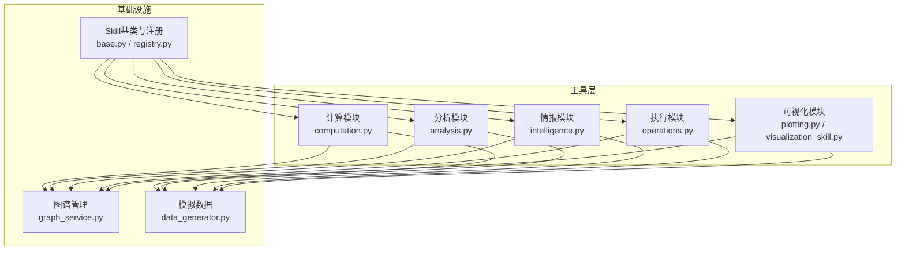
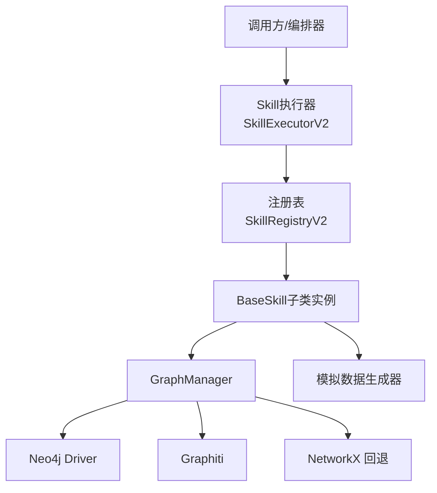
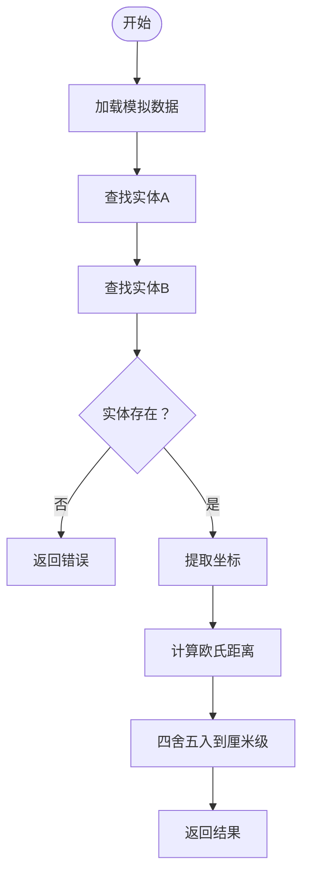
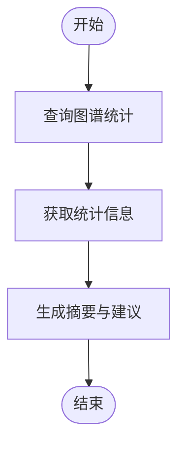
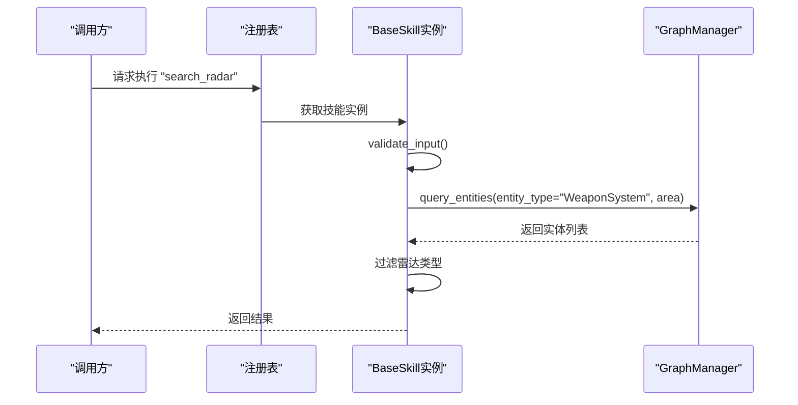
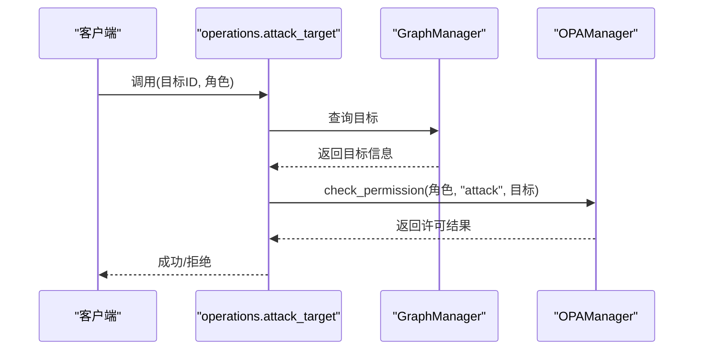
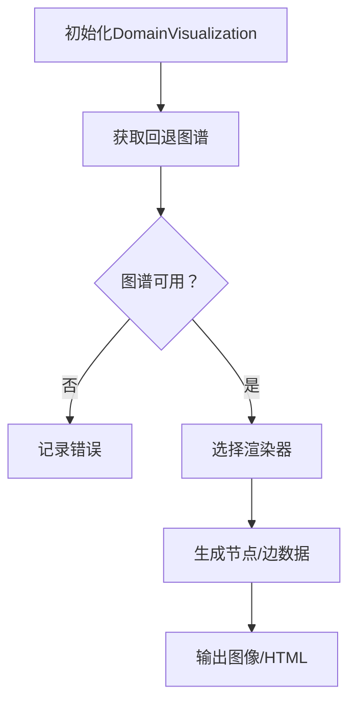
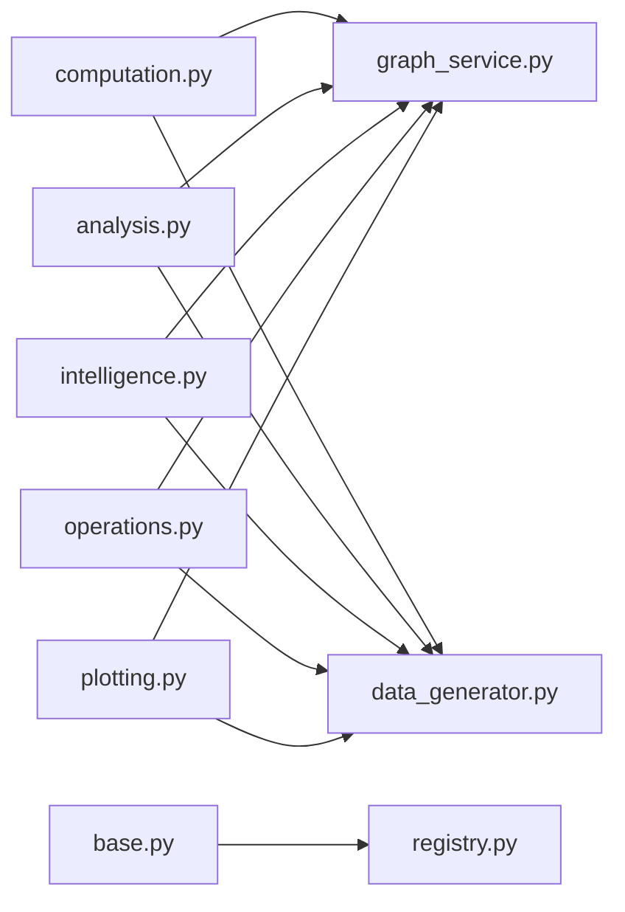
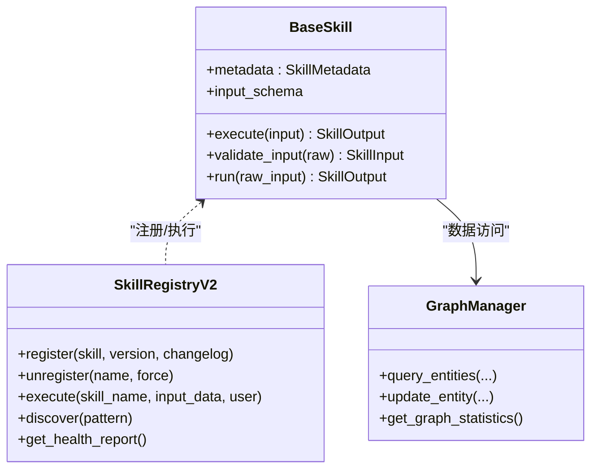

# 计算工具

<cite>
**本文引用的文件**
- [computation.py](file://odap/tools/computation/computation.py)
- [analysis.py](file://odap/tools/analysis/analysis.py)
- [intelligence.py](file://odap/tools/intelligence/intelligence.py)
- [operations.py](file://odap/tools/operations/operations.py)
- [base.py](file://odap/tools/base.py)
- [registry.py](file://odap/tools/registry.py)
- [graph_service.py](file://odap/infra/graph/graph_service.py)
- [data_generator.py](file://odap/biz/core/ontology/mock_data/data_generator.py)
- [plotting.py](file://odap/tools/visualization/plotting.py)
- [visualization_skill.py](file://odap/tools/visualization/visualization_skill.py)
- [test_tools_root.py](file://tests/unit/test_tools_root.py)
</cite>

## 目录
1. [简介](#简介)
2. [项目结构](#项目结构)
3. [核心组件](#核心组件)
4. [架构总览](#架构总览)
5. [详细组件分析](#详细组件分析)
6. [依赖分析](#依赖分析)
7. [性能考虑](#性能考虑)
8. [故障排查指南](#故障排查指南)
9. [结论](#结论)
10. [附录](#附录)

## 简介
本文件面向 ODAP 计算工具，系统梳理其数值计算、矩阵运算、科学计算等核心能力，结合仓库中的“计算”“分析”“情报”“执行”“可视化”等技能模块，给出数学原理、算法实现、精度控制、性能特征、并行与内存优化、错误处理机制，并提供复杂计算、批量处理与结果验证的实践示例，以及扩展与自定义计算函数的开发指南。

## 项目结构
ODAP 计算工具位于 odap/tools 下，围绕 Skill 抽象与注册机制组织，底层通过 GraphManager 访问图谱数据，部分模块使用模拟数据生成器提供测试与演示数据。关键模块如下：
- 计算模块：数值距离计算、打击毁伤评估、威胁等级分析、结果预测
- 分析模块：实体状态、事件、力量对比、武器能力、基础设施、领域摘要
- 情报模块：雷达搜索、领域态势分析（新旧两种实现方式）
- 执行模块：攻击目标、指挥部队（含 OPA 权限校验）
- 可视化模块：图谱可视化、态势报告、叠加层生成、态势感知
- 基础设施：Skill 基类、注册表、图谱管理、模拟数据

**图表来源**
- [computation.py:1-247](file://odap/tools/computation/computation.py#L1-L247)
- [analysis.py:1-267](file://odap/tools/analysis/analysis.py#L1-L267)
- [intelligence.py:1-187](file://odap/tools/intelligence/intelligence.py#L1-L187)
- [operations.py:1-113](file://odap/tools/operations/operations.py#L1-L113)
- [plotting.py:1-491](file://odap/tools/visualization/plotting.py#L1-L491)
- [visualization_skill.py:1-261](file://odap/tools/visualization/visualization_skill.py#L1-L261)
- [base.py:1-720](file://odap/tools/base.py#L1-L720)
- [registry.py:1-53](file://odap/tools/registry.py#L1-L53)
- [graph_service.py:1-800](file://odap/infra/graph/graph_service.py#L1-L800)
- [data_generator.py:1-267](file://odap/biz/core/ontology/mock_data/data_generator.py#L1-L267)

**章节来源**
- [computation.py:1-247](file://odap/tools/computation/computation.py#L1-L247)
- [analysis.py:1-267](file://odap/tools/analysis/analysis.py#L1-L267)
- [intelligence.py:1-187](file://odap/tools/intelligence/intelligence.py#L1-L187)
- [operations.py:1-113](file://odap/tools/operations/operations.py#L1-L113)
- [plotting.py:1-491](file://odap/tools/visualization/plotting.py#L1-L491)
- [visualization_skill.py:1-261](file://odap/tools/visualization/visualization_skill.py#L1-L261)
- [base.py:1-720](file://odap/tools/base.py#L1-L720)
- [registry.py:1-53](file://odap/tools/registry.py#L1-L53)
- [graph_service.py:1-800](file://odap/infra/graph/graph_service.py#L1-L800)
- [data_generator.py:1-267](file://odap/biz/core/ontology/mock_data/data_generator.py#L1-L267)

## 核心组件
- Skill 抽象与注册
  - BaseSkill：统一的技能抽象，提供输入校验、执行流程、标准化输出封装
  - LegacySkillAdapter：兼容旧式裸函数 handler 的适配器
  - SkillRegistry/SkillRegistryV2：注册表与热插拔、版本管理、健康监控
  - register_skill：向后兼容的注册接口，同时写入旧 catalog 与新注册表
- 图谱访问
  - GraphManager：三层降级（Graphiti → Neo4j Driver → NetworkX fallback），提供统一查询、更新、统计接口
- 模拟数据
  - data_generator：生成领域态势的模拟数据，供计算与分析模块使用
- 计算与分析
  - 计算模块：距离、威胁、打击毁伤、结果预测
  - 分析模块：实体状态、事件、力量对比、武器能力、基础设施、领域摘要
  - 情报模块：雷达搜索、领域态势分析（新旧两种实现）
  - 执行模块：攻击目标、指挥部队（含 OPA 权限校验）
  - 可视化模块：图谱可视化、态势报告、叠加层、态势感知

**章节来源**
- [base.py:64-161](file://odap/tools/base.py#L64-L161)
- [registry.py:26-38](file://odap/tools/registry.py#L26-L38)
- [graph_service.py:71-144](file://odap/infra/graph/graph_service.py#L71-L144)
- [data_generator.py:25-204](file://odap/biz/core/ontology/mock_data/data_generator.py#L25-L204)
- [computation.py:19-247](file://odap/tools/computation/computation.py#L19-L247)
- [analysis.py:17-267](file://odap/tools/analysis/analysis.py#L17-L267)
- [intelligence.py:40-187](file://odap/tools/intelligence/intelligence.py#L40-L187)
- [operations.py:24-113](file://odap/tools/operations/operations.py#L24-L113)
- [plotting.py:23-491](file://odap/tools/visualization/plotting.py#L23-L491)
- [visualization_skill.py:18-261](file://odap/tools/visualization/visualization_skill.py#L18-L261)

## 架构总览
ODAP 计算工具采用“技能（Skill）+ 注册表 + 图谱访问”的分层架构。新式技能通过 BaseSkill 统一实现，旧式技能通过 register_skill 与 LegacySkillAdapter 保持兼容；图谱访问由 GraphManager 提供统一接口，支持多后端降级与性能监控；模拟数据为计算与分析提供稳定输入。

**图表来源**
- [base.py:458-597](file://odap/tools/base.py#L458-L597)
- [graph_service.py:145-185](file://odap/infra/graph/graph_service.py#L145-L185)
- [data_generator.py:240-247](file://odap/biz/core/ontology/mock_data/data_generator.py#L240-L247)

## 详细组件分析

### 计算模块（数值与科学计算）
- 距离计算
  - 数学原理：欧几里得距离公式，基于坐标差平方和开方
  - 算法实现：遍历模拟数据定位实体，提取坐标并计算距离，保留两位小数
  - 精度控制：浮点数四舍五入至厘米级精度
  - 性能特点：O(n) 查找实体，常数级计算，适合批量处理
- 威胁等级分析
  - 数学原理：加权求和威胁因子，阈值分级
  - 算法实现：按所属方筛选敌方单位与武器，累加强度/功率权重，分级判定
  - 精度控制：威胁分数保留两位小数
  - 性能特点：线性扫描实体列表，适合区域过滤后的小规模分析
- 打击毁伤评估
  - 数学原理：武器威力与目标装甲的差值归一化，映射为损毁等级
  - 算法实现：线性组合武器功率与目标装甲，计算损毁百分比并分级
  - 精度控制：百分比保留一位小数
  - 性能特点：常数时间计算，适合大规模批量评估
- 结果预测
  - 数学原理：基础成功率受目标类型与状态影响，附加风险等级与建议
  - 算法实现：根据目标类型与状态调整基础概率，限制上限并分级
  - 精度控制：概率值限制在合理区间
  - 性能特点：常数时间，适合实时决策

**图表来源**
- [computation.py:19-59](file://odap/tools/computation/computation.py#L19-L59)

**章节来源**
- [computation.py:19-247](file://odap/tools/computation/computation.py#L19-L247)

### 分析模块（统计与聚合）
- 实体状态分析
  - 功能：按实体 ID 或类型返回状态与统计
  - 算法：字典键映射与列表过滤，支持时间范围过滤
- 事件分析
  - 功能：统计事件类型分布与数量
  - 算法：哈希计数与切片输出
- 力量对比
  - 功能：按所属方聚合单位与武器强度
  - 算法：字典聚合与排序
- 武器能力
  - 功能：按类型筛选并按威力排序
  - 算法：过滤与排序
- 民用基础设施
  - 功能：按类型与区域统计，识别受保护设施
  - 算法：计数与集合维护
- 领域摘要
  - 功能：调用图谱统计生成摘要
  - 算法：图统计接口封装

**图表来源**
- [analysis.py:206-225](file://odap/tools/analysis/analysis.py#L206-L225)

**章节来源**
- [analysis.py:17-267](file://odap/tools/analysis/analysis.py#L17-L267)

### 情报模块（图谱查询与态势）
- 雷达搜索
  - 新式实现：继承 BaseSkill，使用 GraphManager 查询实体并过滤类型
  - 旧式实现：兼容 register_skill 接口，委托给新式实现
- 领域态势分析
  - 新式实现：读取图谱统计并生成结构化报告
  - 旧式实现：兼容 register_skill 接口

**图表来源**
- [intelligence.py:40-121](file://odap/tools/intelligence/intelligence.py#L40-L121)
- [graph_service.py:649-730](file://odap/infra/graph/graph_service.py#L649-L730)

**章节来源**
- [intelligence.py:40-187](file://odap/tools/intelligence/intelligence.py#L40-L187)

### 执行模块（权限与操作）
- 攻击目标
  - 功能：根据用户角色与目标信息进行 OPA 权限校验后执行
  - 算法：查询目标、OPA 检查、执行并返回结果
- 指挥部队
  - 功能：根据用户角色与部队信息进行 OPA 权限校验后执行
  - 算法：查询部队、OPA 检查、执行并返回结果

**图表来源**
- [operations.py:24-98](file://odap/tools/operations/operations.py#L24-L98)

**章节来源**
- [operations.py:24-113](file://odap/tools/operations/operations.py#L24-L113)

### 可视化模块（图形与报告）
- 图谱可视化
  - 功能：静态图与交互式图谱绘制，支持导出
  - 算法：NetworkX 图构建与布局，Matplotlib/Plotly 渲染
- 态势报告与叠加层
  - 功能：生成领域报告、任务摘要、地图叠加层、态势感知
  - 算法：聚合统计与 GeoJSON 生成

**图表来源**
- [plotting.py:45-111](file://odap/tools/visualization/plotting.py#L45-L111)

**章节来源**
- [plotting.py:23-491](file://odap/tools/visualization/plotting.py#L23-L491)
- [visualization_skill.py:18-261](file://odap/tools/visualization/visualization_skill.py#L18-L261)

## 依赖分析
- 组件耦合
  - 计算/分析/情报/执行/可视化均依赖 GraphManager 与模拟数据生成器
  - 新式 BaseSkill 与注册表解耦旧式 handler，便于渐进式迁移
- 外部依赖
  - Neo4j Driver、Graphiti、NetworkX、Matplotlib、Plotly 等
- 循环依赖
  - 通过延迟导入与模块拆分避免循环依赖

**图表来源**
- [computation.py:13-15](file://odap/tools/computation/computation.py#L13-L15)
- [analysis.py:11-13](file://odap/tools/analysis/analysis.py#L11-L13)
- [intelligence.py:19-29](file://odap/tools/intelligence/intelligence.py#L19-L29)
- [operations.py:15-21](file://odap/tools/operations/operations.py#L15-L21)
- [plotting.py:21-22](file://odap/tools/visualization/plotting.py#L21-L22)
- [base.py:1-25](file://odap/tools/base.py#L1-L25)
- [registry.py:14-23](file://odap/tools/registry.py#L14-L23)

**章节来源**
- [computation.py:1-247](file://odap/tools/computation/computation.py#L1-L247)
- [analysis.py:1-267](file://odap/tools/analysis/analysis.py#L1-L267)
- [intelligence.py:1-187](file://odap/tools/intelligence/intelligence.py#L1-L187)
- [operations.py:1-113](file://odap/tools/operations/operations.py#L1-L113)
- [plotting.py:1-491](file://odap/tools/visualization/plotting.py#L1-L491)
- [base.py:1-720](file://odap/tools/base.py#L1-L720)
- [registry.py:1-53](file://odap/tools/registry.py#L1-L53)

## 性能考虑
- 图谱访问
  - 三层降级策略：Graphiti（核心）→ Neo4j Driver → NetworkX 回退，保证可用性
  - 连接池与断路器：限制并发、超时与失败熔断，提升稳定性
  - 批量加载：Neo4j 批量 MERGE 提升初始数据注入效率
- 计算模块
  - 常数时间算法为主，适合大规模批量处理
  - 距离计算与打击毁伤评估均为 O(1)，威胁分析 O(n)
- 可视化
  - 静态图适合快速预览，交互式图适合深入探索
  - 大规模图建议分区域渲染或采样

**章节来源**
- [graph_service.py:145-185](file://odap/infra/graph/graph_service.py#L145-L185)
- [graph_service.py:299-443](file://odap/infra/graph/graph_service.py#L299-L443)
- [graph_service.py:217-289](file://odap/infra/graph/graph_service.py#L217-L289)
- [computation.py:19-247](file://odap/tools/computation/computation.py#L19-L247)
- [plotting.py:45-111](file://odap/tools/visualization/plotting.py#L45-L111)

## 故障排查指南
- 技能注册与执行
  - 使用单元测试验证技能注册与执行路径
  - 检查 SKILL_CATALOG 与注册表一致性
- 权限问题
  - 执行高危操作前确认 OPA 权限与用户角色
  - 若返回拒绝，检查目标是否存在与权限策略
- 图谱连接
  - 若回退模式启用，检查模拟数据加载与图谱初始化
  - 关注连接池与断路器状态
- 可视化失败
  - 确认依赖库安装（Matplotlib、Plotly、NetworkX）
  - 检查输出路径与文件权限

**章节来源**
- [test_tools_root.py:26-61](file://tests/unit/test_tools_root.py#L26-L61)
- [operations.py:42-59](file://odap/tools/operations/operations.py#L42-L59)
- [graph_service.py:145-185](file://odap/infra/graph/graph_service.py#L145-L185)
- [plotting.py:45-111](file://odap/tools/visualization/plotting.py#L45-L111)

## 结论
ODAP 计算工具以 Skill 抽象为核心，结合图谱访问与模拟数据，提供了从数值计算、统计分析到情报查询与可视化的完整能力。通过三层降级与性能监控保障可用性与稳定性，通过权限校验与健康监控提升安全性与可观测性。新旧技能并存的迁移策略降低了升级成本，便于扩展与定制。

## 附录

### 计算示例与最佳实践
- 复杂计算
  - 威胁等级分析：先按区域过滤，再聚合敌方单位与武器，最后分级
  - 打击毁伤评估：对多个武器-目标组合进行批量计算，汇总损毁等级分布
- 批量处理
  - 使用图谱查询接口批量获取实体，再在 Python 层进行聚合与计算
  - 可视化模块支持导出 HTML/PNG，便于报告生成
- 结果验证
  - 单元测试验证技能注册与执行路径
  - 对关键计算步骤进行边界值与异常输入测试

**章节来源**
- [analysis.py:92-132](file://odap/tools/analysis/analysis.py#L92-L132)
- [computation.py:169-219](file://odap/tools/computation/computation.py#L169-L219)
- [test_tools_root.py:45-61](file://tests/unit/test_tools_root.py#L45-L61)

### 扩展与自定义计算函数开发指南
- 新增技能
  - 方式一：新式（推荐）——继承 BaseSkill，实现 execute()，使用 SkillRegistryV2 注册
  - 方式二：旧式（兼容）——使用 register_skill 注册裸函数，内部由适配器包装
- 输入输出
  - 使用 SkillInput/SkillOutput 确保输入校验与输出标准化
- 权限与安全
  - 在 metadata 中声明 requires_opa_check 与 opa_action，执行器会自动进行权限校验
- 性能与可靠性
  - 使用断路器与连接池，避免雪崩
  - 对高危操作要求二次确认或管理员角色
- 可观测性
  - 通过健康监控与重试机制提升鲁棒性

**图表来源**
- [base.py:64-161](file://odap/tools/base.py#L64-L161)
- [base.py:599-709](file://odap/tools/base.py#L599-L709)
- [graph_service.py:649-730](file://odap/infra/graph/graph_service.py#L649-L730)

**章节来源**
- [base.py:64-161](file://odap/tools/base.py#L64-L161)
- [base.py:599-709](file://odap/tools/base.py#L599-L709)
- [registry.py:26-38](file://odap/tools/registry.py#L26-L38)