# 运营工具

<cite>
**本文引用的文件**
- [odap/tools/analysis/analysis.py](file://odap/tools/analysis/analysis.py)
- [odap/tools/computation/computation.py](file://odap/tools/computation/computation.py)
- [odap/tools/intelligence/intelligence.py](file://odap/tools/intelligence/intelligence.py)
- [odap/tools/operations/operations.py](file://odap/tools/operations/operations.py)
- [odap/tools/policy/policy.py](file://odap/tools/policy/policy.py)
- [odap/tools/recommendation/recommendation.py](file://odap/tools/recommendation/recommendation.py)
- [odap/tools/task_management/task_management.py](file://odap/tools/task_management/task_management.py)
- [odap/tools/visualization/visualization_skill.py](file://odap/tools/visualization/visualization_skill.py)
- [odap/tools/visualization/plotting.py](file://odap/tools/visualization/plotting.py)
- [odap/infra/monitoring/performance_monitor.py](file://odap/infra/monitoring/performance_monitor.py)
- [odap/infra/security/__init__.py](file://odap/infra/security/__init__.py)
- [odap/biz/core/ontology/services/pipeline_service.py](file://odap/biz/core/ontology/services/pipeline_service.py)
- [docs/02-architecture/ARCHITECTURE_OPS.md](file://docs/02-architecture/ARCHITECTURE_OPS.md)
- [docs/03-modules/audit_log/DESIGN.md](file://docs/03-modules/audit_log/DESIGN.md)
- [docs/03-modules/audit_log/GRAPHITI_INTEGRATION.md](file://docs/03-modules/audit_log/GRAPHITI_INTEGRATION.md)
- [docs/03-modules/visualization/DESIGN.md](file://docs/03-modules/visualization/DESIGN.md)
- [odap/tools/planning/planning.py](file://odap/tools/planning/planning.py)
</cite>

## 目录
1. [简介](#简介)
2. [项目结构](#项目结构)
3. [核心组件](#核心组件)
4. [架构总览](#架构总览)
5. [详细组件分析](#详细组件分析)
6. [依赖分析](#依赖分析)
7. [性能考量](#性能考量)
8. [故障排查指南](#故障排查指南)
9. [结论](#结论)
10. [附录](#附录)

## 简介
本技术文档面向 ODAP 运营工具，系统阐述其在业务分析、流程监控、绩效评估、可视化与报告、策略与权限控制、自动化流程等方面的能力与实现。文档以“可读性优先”的原则组织内容，既适合一线运营人员快速上手，也为工程师提供了深入的架构与实现参考。

## 项目结构
ODAP 运营工具围绕“技能（Skill）”抽象组织，各功能模块以“分析、计算、情报、执行、策略、推荐、任务、可视化”为主线，配合“性能监控、审计日志、可视化渲染”等基础设施，形成完整的运营闭环。

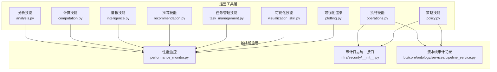

**图示来源**
- [odap/tools/analysis/analysis.py:1-267](file://odap/tools/analysis/analysis.py#L1-L267)
- [odap/tools/computation/computation.py:1-247](file://odap/tools/computation/computation.py#L1-L247)
- [odap/tools/intelligence/intelligence.py:1-187](file://odap/tools/intelligence/intelligence.py#L1-L187)
- [odap/tools/operations/operations.py:1-113](file://odap/tools/operations/operations.py#L1-L113)
- [odap/tools/policy/policy.py:1-311](file://odap/tools/policy/policy.py#L1-L311)
- [odap/tools/recommendation/recommendation.py:1-268](file://odap/tools/recommendation/recommendation.py#L1-L268)
- [odap/tools/task_management/task_management.py:1-190](file://odap/tools/task_management/task_management.py#L1-L190)
- [odap/tools/visualization/visualization_skill.py:1-261](file://odap/tools/visualization/visualization_skill.py#L1-L261)
- [odap/tools/visualization/plotting.py:1-491](file://odap/tools/visualization/plotting.py#L1-L491)
- [odap/infra/monitoring/performance_monitor.py:1-184](file://odap/infra/monitoring/performance_monitor.py#L1-L184)
- [odap/infra/security/__init__.py:1-108](file://odap/infra/security/__init__.py#L1-L108)
- [odap/biz/core/ontology/services/pipeline_service.py:108-144](file://odap/biz/core/ontology/services/pipeline_service.py#L108-L144)

**章节来源**
- [odap/tools/analysis/analysis.py:1-267](file://odap/tools/analysis/analysis.py#L1-L267)
- [odap/tools/computation/computation.py:1-247](file://odap/tools/computation/computation.py#L1-L247)
- [odap/tools/intelligence/intelligence.py:1-187](file://odap/tools/intelligence/intelligence.py#L1-L187)
- [odap/tools/operations/operations.py:1-113](file://odap/tools/operations/operations.py#L1-L113)
- [odap/tools/policy/policy.py:1-311](file://odap/tools/policy/policy.py#L1-L311)
- [odap/tools/recommendation/recommendation.py:1-268](file://odap/tools/recommendation/recommendation.py#L1-L268)
- [odap/tools/task_management/task_management.py:1-190](file://odap/tools/task_management/task_management.py#L1-L190)
- [odap/tools/visualization/visualization_skill.py:1-261](file://odap/tools/visualization/visualization_skill.py#L1-L261)
- [odap/tools/visualization/plotting.py:1-491](file://odap/tools/visualization/plotting.py#L1-L491)
- [odap/infra/monitoring/performance_monitor.py:1-184](file://odap/infra/monitoring/performance_monitor.py#L1-L184)
- [odap/infra/security/__init__.py:1-108](file://odap/infra/security/__init__.py#L1-L108)
- [odap/biz/core/ontology/services/pipeline_service.py:108-144](file://odap/biz/core/ontology/services/pipeline_service.py#L108-L144)

## 核心组件
- 分析技能：实体状态、事件、力量对比、武器能力、基础设施分布、领域摘要等分析能力，支撑业务洞察与趋势判断。
- 计算技能：距离计算、结果预测、威胁等级、打击毁伤评估等，提供量化评估与风险预判。
- 情报技能：雷达搜索、领域态势分析，结合图谱统计生成结构化情报。
- 执行技能：攻击目标、指挥部队，内置权限校验与审计记录。
- 策略技能：策略模拟执行、版本管理、导入导出、历史查询、权限检查，支撑策略治理与合规。
- 推荐技能：打击目标推荐、任务规划推荐、兵力部署推荐、打击风险评估，辅助决策与规划。
- 任务管理技能：任务预留、查询、取消、清理、按状态过滤，支撑运营流程编排。
- 可视化技能：地图叠加层、任务摘要、领域报告、态势感知，输出可视化与报告。
- 可视化渲染：图谱关系可视化、交互式图谱、实体分布饼图、处置动态表、本体查询与聚合。
- 性能监控：LLM 调用、数据库查询、API 请求、工具执行的耗时统计与导出。
- 审计日志：统一审计接口、存储适配、防篡改校验、与 Hook 系统集成。
- 流水线审计：本体构建与处理阶段的审计记录与统一审计通道。

**章节来源**
- [odap/tools/analysis/analysis.py:17-225](file://odap/tools/analysis/analysis.py#L17-L225)
- [odap/tools/computation/computation.py:19-167](file://odap/tools/computation/computation.py#L19-L167)
- [odap/tools/intelligence/intelligence.py:40-121](file://odap/tools/intelligence/intelligence.py#L40-L121)
- [odap/tools/operations/operations.py:24-98](file://odap/tools/operations/operations.py#L24-L98)
- [odap/tools/policy/policy.py:20-240](file://odap/tools/policy/policy.py#L20-L240)
- [odap/tools/recommendation/recommendation.py:20-240](file://odap/tools/recommendation/recommendation.py#L20-L240)
- [odap/tools/task_management/task_management.py:17-148](file://odap/tools/task_management/task_management.py#L17-L148)
- [odap/tools/visualization/visualization_skill.py:18-233](file://odap/tools/visualization/visualization_skill.py#L18-L233)
- [odap/tools/visualization/plotting.py:23-491](file://odap/tools/visualization/plotting.py#L23-L491)
- [odap/infra/monitoring/performance_monitor.py:12-184](file://odap/infra/monitoring/performance_monitor.py#L12-L184)
- [odap/infra/security/__init__.py:1-108](file://odap/infra/security/__init__.py#L1-L108)
- [odap/biz/core/ontology/services/pipeline_service.py:108-144](file://odap/biz/core/ontology/services/pipeline_service.py#L108-L144)

## 架构总览
ODAP 运营工具以“技能即服务”的方式对外提供能力，底层通过图谱管理器、OPA 策略引擎、审计通道与性能监控器提供支撑；监控与告警体系通过 Prometheus/Grafana 实现可观测性；可视化模块提供静态与交互式图表输出。

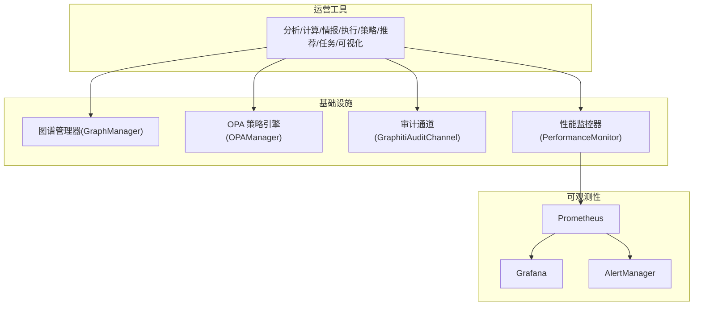

**图示来源**
- [odap/tools/analysis/analysis.py:1-267](file://odap/tools/analysis/analysis.py#L1-L267)
- [odap/tools/computation/computation.py:1-247](file://odap/tools/computation/computation.py#L1-L247)
- [odap/tools/intelligence/intelligence.py:1-187](file://odap/tools/intelligence/intelligence.py#L1-L187)
- [odap/tools/operations/operations.py:1-113](file://odap/tools/operations/operations.py#L1-L113)
- [odap/tools/policy/policy.py:1-311](file://odap/tools/policy/policy.py#L1-L311)
- [odap/tools/recommendation/recommendation.py:1-268](file://odap/tools/recommendation/recommendation.py#L1-L268)
- [odap/tools/task_management/task_management.py:1-190](file://odap/tools/task_management/task_management.py#L1-L190)
- [odap/tools/visualization/visualization_skill.py:1-261](file://odap/tools/visualization/visualization_skill.py#L1-L261)
- [odap/infra/monitoring/performance_monitor.py:1-184](file://odap/infra/monitoring/performance_monitor.py#L1-L184)
- [docs/02-architecture/ARCHITECTURE_OPS.md:19-152](file://docs/02-architecture/ARCHITECTURE_OPS.md#L19-L152)

## 详细组件分析

### 分析技能模块
- 能力清单
  - 实体状态分析：按实体 ID 或类型返回状态与统计。
  - 领域事件分析：按时间范围统计事件类型与数量。
  - 力量对比分析：按所属方统计单位与武器数量与强度。
  - 武器能力分析：按类型排序武器能力指标。
  - 民用基础设施分析：按类型与区域统计与受保护设施。
  - 领域摘要：基于图谱统计生成推荐与摘要。
- 数据来源与计算
  - 使用模拟数据生成器加载仿真数据，按实体类型与属性字段进行聚合与筛选。
- 报告生成
  - 返回结构化 JSON，便于前端或下游系统进一步渲染。

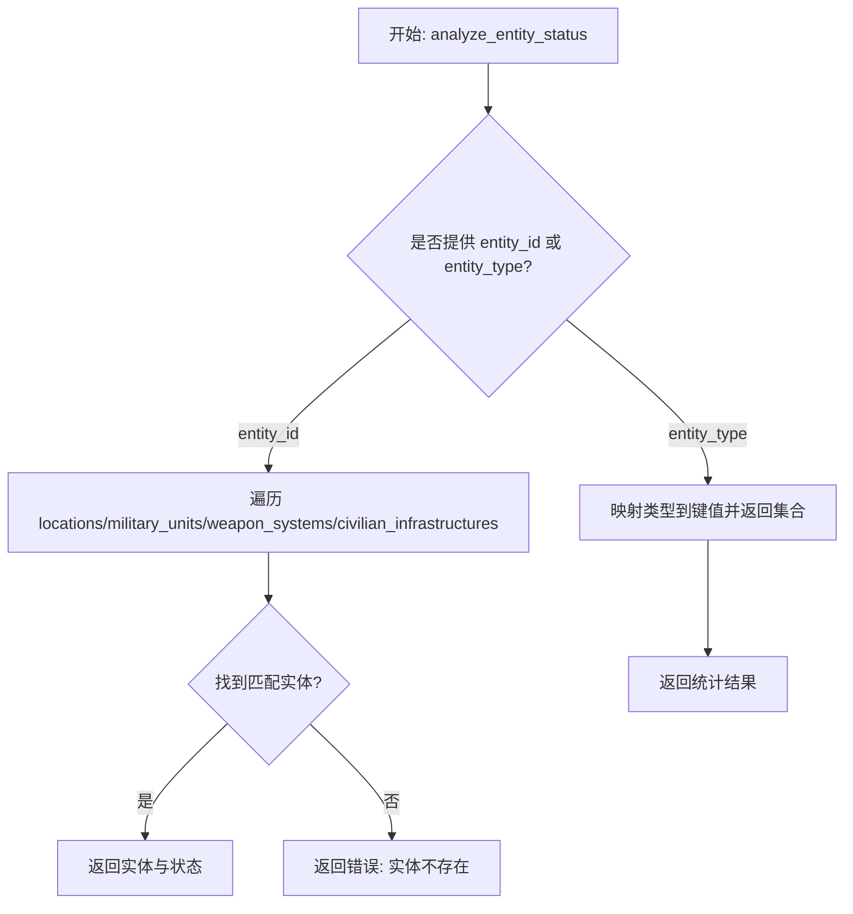

**图示来源**
- [odap/tools/analysis/analysis.py:17-61](file://odap/tools/analysis/analysis.py#L17-L61)

**章节来源**
- [odap/tools/analysis/analysis.py:17-225](file://odap/tools/analysis/analysis.py#L17-L225)

### 计算技能模块
- 能力清单
  - 距离计算：两点坐标欧氏距离。
  - 结果预测：基于目标类型与状态计算成功率与风险等级。
  - 威胁等级：按单位与武器强度加权计算威胁分数与等级。
  - 打击毁伤：基于武器威力与目标装甲计算毁伤百分比与剩余强度。
- 数据来源与计算
  - 使用模拟数据生成器加载实体与属性，按规则计算指标。
- 报告生成
  - 返回预测与评估结果，含建议与风险提示。

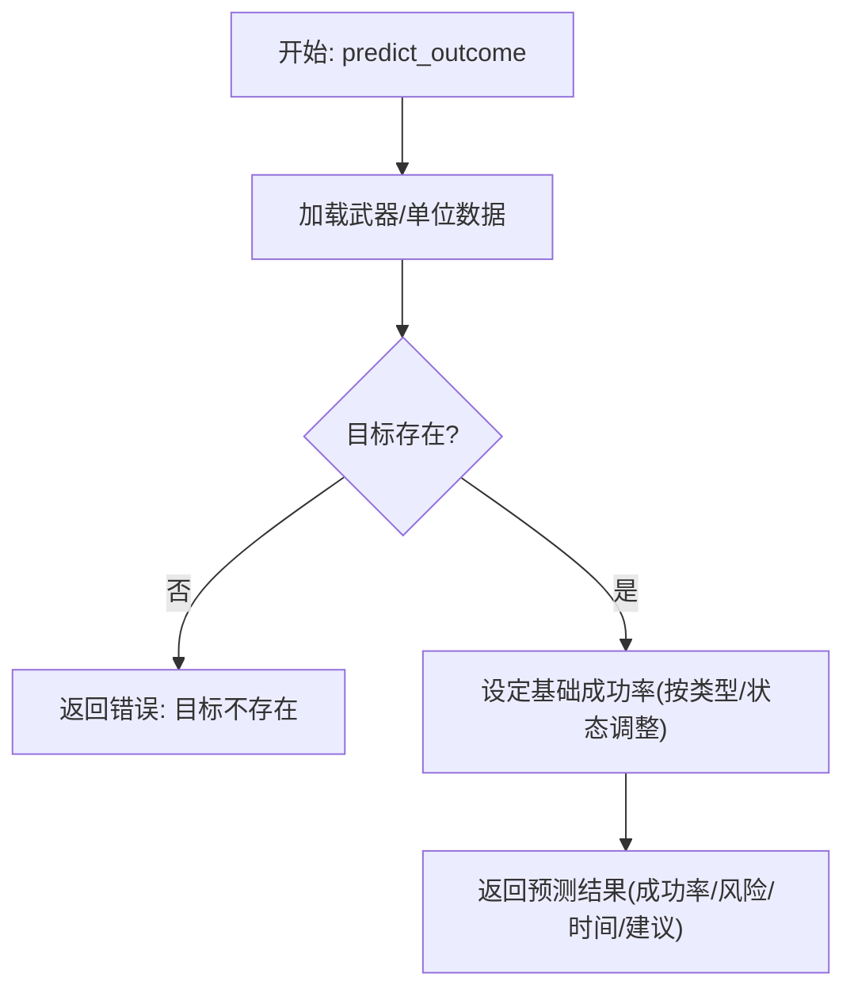

**图示来源**
- [odap/tools/computation/computation.py:61-115](file://odap/tools/computation/computation.py#L61-L115)

**章节来源**
- [odap/tools/computation/computation.py:19-167](file://odap/tools/computation/computation.py#L19-L167)

### 情报技能模块
- 能力清单
  - 雷达搜索：按区域检索武器系统中的“雷达”类型。
  - 领域态势分析：基于图谱统计生成态势摘要与建议。
- 数据来源与计算
  - 通过图谱管理器查询实体，过滤类型并返回结构化结果。
- 报告生成
  - 返回 JSON 结构，包含统计与建议。

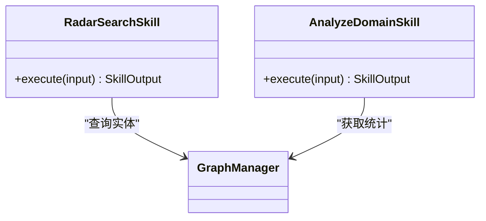

**图示来源**
- [odap/tools/intelligence/intelligence.py:40-121](file://odap/tools/intelligence/intelligence.py#L40-L121)

**章节来源**
- [odap/tools/intelligence/intelligence.py:40-121](file://odap/tools/intelligence/intelligence.py#L40-L121)

### 执行技能模块
- 能力清单
  - 攻击目标：校验目标存在性与权限，执行后返回结果。
  - 指挥部队：校验部队存在性与权限，执行后返回结果。
- 数据来源与计算
  - 通过图谱管理器统一查询实体；权限通过 OPA 管理器校验；执行后记录审计日志。
- 报告生成
  - 返回执行状态、目标/部队信息与用户角色。

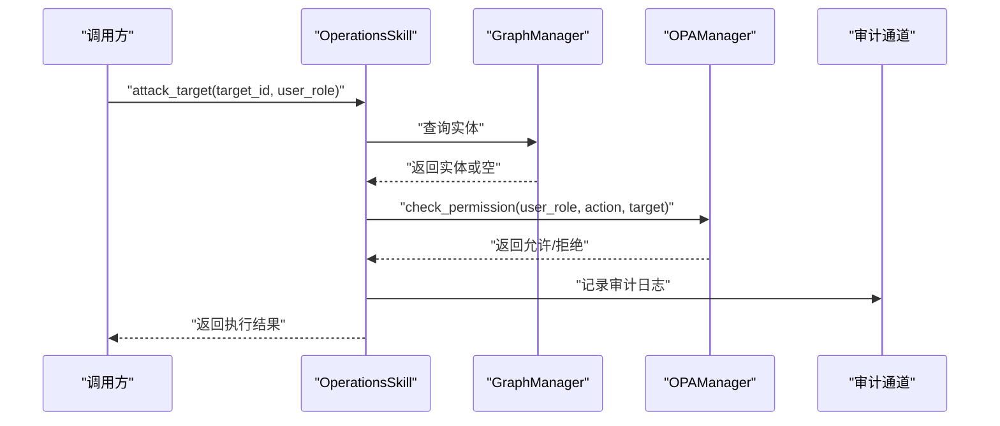

**图示来源**
- [odap/tools/operations/operations.py:24-98](file://odap/tools/operations/operations.py#L24-L98)
- [odap/biz/core/ontology/services/pipeline_service.py:108-144](file://odap/biz/core/ontology/services/pipeline_service.py#L108-L144)

**章节来源**
- [odap/tools/operations/operations.py:24-98](file://odap/tools/operations/operations.py#L24-L98)
- [odap/biz/core/ontology/services/pipeline_service.py:108-144](file://odap/biz/core/ontology/services/pipeline_service.py#L108-L144)

### 策略技能模块
- 能力清单
  - 策略模拟执行：基于角色权限与限制判断操作许可。
  - 策略版本管理：获取版本、回退版本、导出/导入策略文件。
  - 历史查询与清空：维护策略执行历史。
  - 权限检查：委托 OPA 管理器进行细粒度权限校验。
- 数据来源与计算
  - 角色与域配置来自领域模型；策略文件以 JSON 存储于本地目录。
- 报告生成
  - 返回状态、版本信息、文件路径与消息。

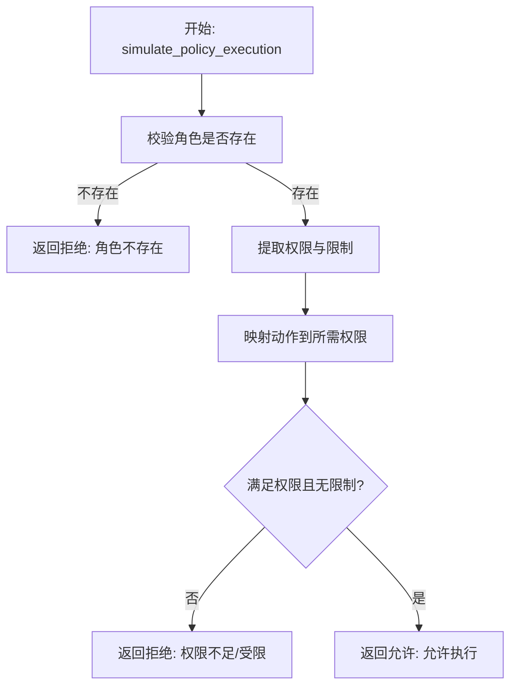

**图示来源**
- [odap/tools/policy/policy.py:20-77](file://odap/tools/policy/policy.py#L20-L77)

**章节来源**
- [odap/tools/policy/policy.py:20-240](file://odap/tools/policy/policy.py#L20-L240)

### 推荐技能模块
- 能力清单
  - 打击目标推荐：按区域与类型优先级生成目标列表。
  - 任务规划推荐：基于近期事件生成任务建议。
  - 兵力部署推荐：按区域兵力对比给出部署建议。
  - 打击风险评估：基于目标类型与状态给出风险等级。
- 数据来源与计算
  - 使用模拟数据生成器加载实体，按归属方与状态筛选并排序。
- 报告生成
  - 返回推荐列表、建议与原因。

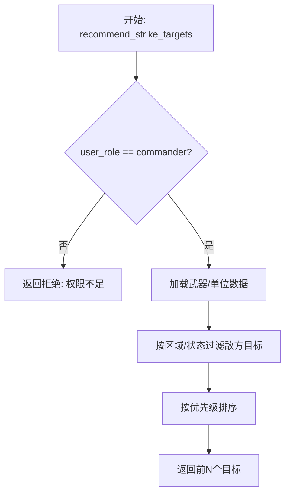

**图示来源**
- [odap/tools/recommendation/recommendation.py:20-86](file://odap/tools/recommendation/recommendation.py#L20-L86)

**章节来源**
- [odap/tools/recommendation/recommendation.py:20-240](file://odap/tools/recommendation/recommendation.py#L20-L240)

### 任务管理技能模块
- 能力清单
  - 任务预留：创建并保存任务，返回任务ID。
  - 查询任务：获取所有预留任务或按ID查询。
  - 取消任务：按ID从预留列表移除。
  - 清除任务：清空所有预留任务。
  - 按状态过滤：按状态筛选任务。
- 数据来源与计算
  - 通过图谱管理器预留与查询任务，支持内存态任务集合。
- 报告生成
  - 返回任务列表、总数与状态。

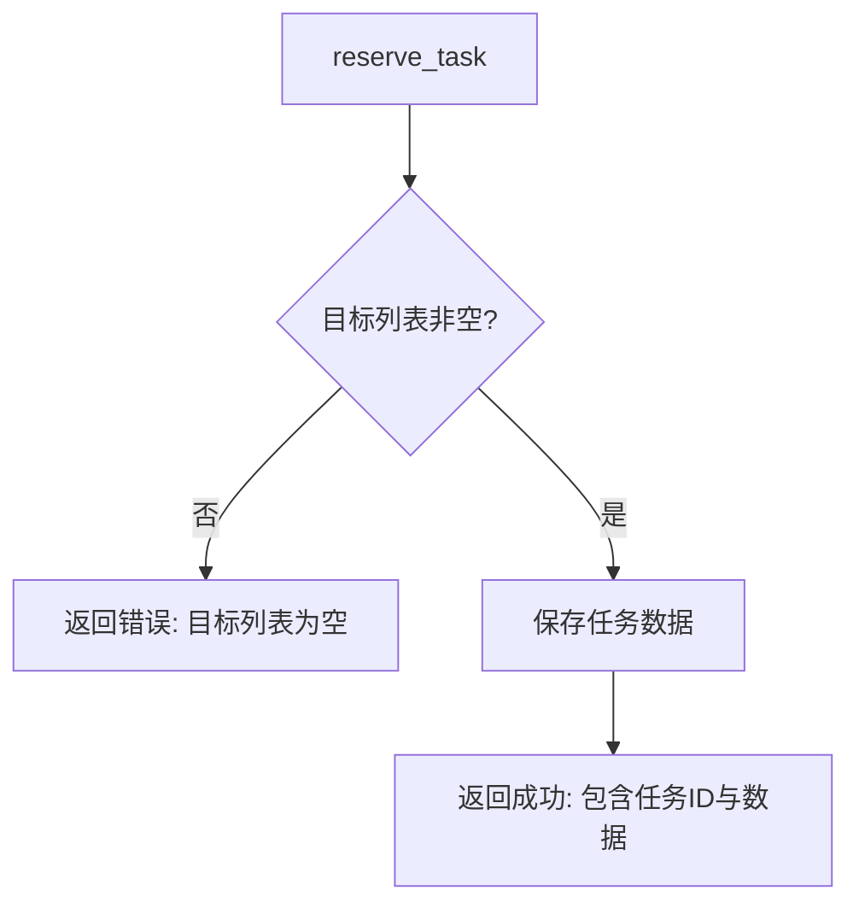

**图示来源**
- [odap/tools/task_management/task_management.py:17-50](file://odap/tools/task_management/task_management.py#L17-L50)

**章节来源**
- [odap/tools/task_management/task_management.py:17-148](file://odap/tools/task_management/task_management.py#L17-L148)

### 可视化技能与渲染模块
- 能力清单
  - 可视化技能：地图叠加层、任务摘要、领域报告、态势感知。
  - 可视化渲染：图谱关系可视化、交互式图谱、实体分布、处置动态、本体查询与聚合。
- 数据来源与计算
  - 可视化技能基于模拟数据与图谱统计生成；渲染模块基于 NetworkX/Plotly/Matplotlib 输出静态与交互式图表。
- 报告生成
  - 输出 GeoJSON、HTML 文件与统计图表。

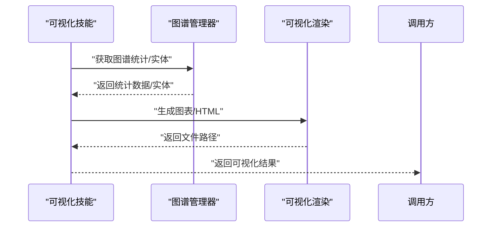

**图示来源**
- [odap/tools/visualization/visualization_skill.py:18-233](file://odap/tools/visualization/visualization_skill.py#L18-L233)
- [odap/tools/visualization/plotting.py:45-491](file://odap/tools/visualization/plotting.py#L45-L491)

**章节来源**
- [odap/tools/visualization/visualization_skill.py:18-233](file://odap/tools/visualization/visualization_skill.py#L18-L233)
- [odap/tools/visualization/plotting.py:45-491](file://odap/tools/visualization/plotting.py#L45-L491)

### 性能监控模块
- 能力清单
  - 计时与统计：支持 LLM 调用、数据库查询、API 请求、工具执行的耗时统计。
  - 百分位与导出：提供均值、中位数、最小/最大、P95/P99，并可导出原始指标。
  - 装饰器：为同步/异步函数提供自动监控。
- 数据来源与计算
  - 通过内部队列记录开始时间与结束时间，计算耗时并统计。
- 报告生成
  - 返回统计字典与导出数据。

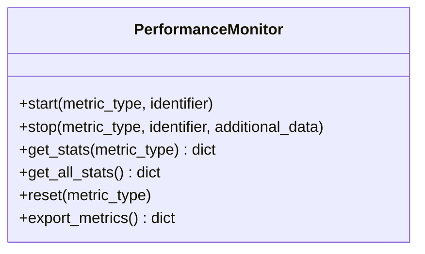

**图示来源**
- [odap/infra/monitoring/performance_monitor.py:12-184](file://odap/infra/monitoring/performance_monitor.py#L12-L184)

**章节来源**
- [odap/infra/monitoring/performance_monitor.py:12-184](file://odap/infra/monitoring/performance_monitor.py#L12-L184)

### 审计日志与流水线审计
- 统一审计接口
  - 提供 log_audit、log_ingest、log_query、log_workspace、log_error 等统一入口，支持查询与统计。
- 存储适配
  - 通过 GraphitiAuditChannel 将审计事件写入图谱，支持查询与过滤。
- 防篡改设计
  - 事件链式校验，任一篡改可被检测。
- 流水线审计
  - 在本体处理流水线各阶段记录执行时长、状态与详情，并统一写入审计通道。

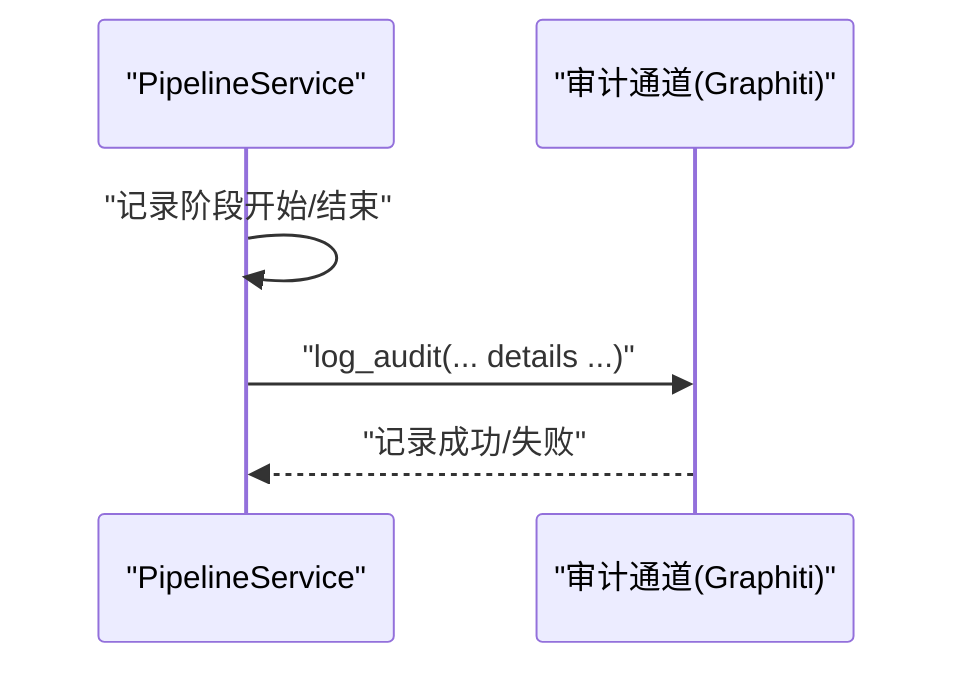

**图示来源**
- [odap/biz/core/ontology/services/pipeline_service.py:108-144](file://odap/biz/core/ontology/services/pipeline_service.py#L108-L144)
- [odap/infra/security/__init__.py:44-62](file://odap/infra/security/__init__.py#L44-L62)
- [docs/03-modules/audit_log/GRAPHITI_INTEGRATION.md:27-112](file://docs/03-modules/audit_log/GRAPHITI_INTEGRATION.md#L27-L112)
- [docs/03-modules/audit_log/DESIGN.md:441-470](file://docs/03-modules/audit_log/DESIGN.md#L441-L470)

**章节来源**
- [odap/infra/security/__init__.py:1-108](file://odap/infra/security/__init__.py#L1-L108)
- [docs/03-modules/audit_log/DESIGN.md:1-513](file://docs/03-modules/audit_log/DESIGN.md#L1-L513)
- [docs/03-modules/audit_log/GRAPHITI_INTEGRATION.md:27-112](file://docs/03-modules/audit_log/GRAPHITI_INTEGRATION.md#L27-L112)
- [odap/biz/core/ontology/services/pipeline_service.py:108-144](file://odap/biz/core/ontology/services/pipeline_service.py#L108-L144)

### 监控告警与可视化看板
- 监控架构
  - FastAPI + Prometheus + Grafana + AlertManager，采集 Golden Signals 指标。
- 告警规则
  - 错误率、延迟、资源使用率、业务成功率等阈值告警。
- 可视化看板
  - API QPS/Latency、错误率热力图、Neo4j 节点/关系增长、LLM 使用与成本、工作区资源使用、技能执行成功率等。

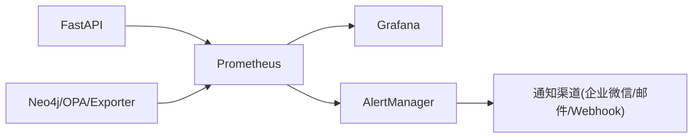

**图示来源**
- [docs/02-architecture/ARCHITECTURE_OPS.md:19-152](file://docs/02-architecture/ARCHITECTURE_OPS.md#L19-L152)

**章节来源**
- [docs/02-architecture/ARCHITECTURE_OPS.md:19-152](file://docs/02-architecture/ARCHITECTURE_OPS.md#L19-L152)

## 依赖分析
- 组件耦合
  - 各技能模块依赖图谱管理器与 OPA 管理器，确保数据访问与权限控制的一致性。
  - 执行类技能与审计通道紧密耦合，保证操作可追溯。
- 外部依赖
  - Prometheus/Grafana 用于运行时监控与可视化。
  - 图数据库与图管理器用于本体与关系数据的持久化与查询。
- 潜在循环依赖
  - 技能注册与图谱管理器之间通过模块导入避免直接循环，保持低耦合。

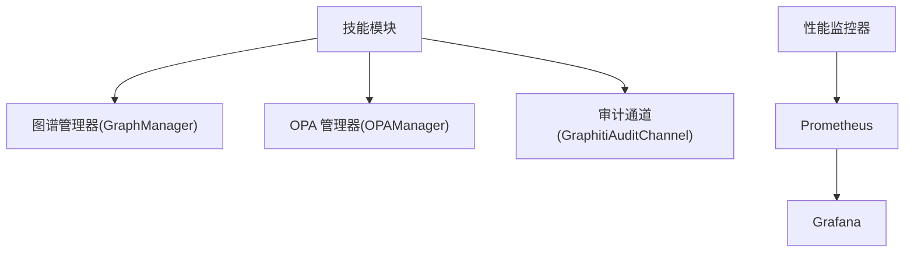

**图示来源**
- [odap/tools/operations/operations.py:19-21](file://odap/tools/operations/operations.py#L19-L21)
- [odap/tools/policy/policy.py:9-12](file://odap/tools/policy/policy.py#L9-L12)
- [odap/infra/security/__init__.py:44-62](file://odap/infra/security/__init__.py#L44-L62)
- [odap/infra/monitoring/performance_monitor.py:1-184](file://odap/infra/monitoring/performance_monitor.py#L1-L184)
- [docs/02-architecture/ARCHITECTURE_OPS.md:19-152](file://docs/02-architecture/ARCHITECTURE_OPS.md#L19-L152)

**章节来源**
- [odap/tools/operations/operations.py:19-21](file://odap/tools/operations/operations.py#L19-L21)
- [odap/tools/policy/policy.py:9-12](file://odap/tools/policy/policy.py#L9-L12)
- [odap/infra/security/__init__.py:44-62](file://odap/infra/security/__init__.py#L44-L62)
- [odap/infra/monitoring/performance_monitor.py:1-184](file://odap/infra/monitoring/performance_monitor.py#L1-L184)
- [docs/02-architecture/ARCHITECTURE_OPS.md:19-152](file://docs/02-architecture/ARCHITECTURE_OPS.md#L19-L152)

## 性能考量
- 指标采集
  - 通过装饰器与计时器自动采集关键路径耗时，支持同步/异步函数。
- 统计维度
  - 提供均值、中位数、P95/P99、最小/最大等指标，便于容量规划与性能优化。
- 导出与分析
  - 支持导出原始指标，结合 Grafana 进行趋势分析与异常检测。

**章节来源**
- [odap/infra/monitoring/performance_monitor.py:63-140](file://odap/infra/monitoring/performance_monitor.py#L63-L140)
- [docs/02-architecture/ARCHITECTURE_OPS.md:52-150](file://docs/02-architecture/ARCHITECTURE_OPS.md#L52-L150)

## 故障排查指南
- 审计日志
  - 使用统一审计接口查询事件，核对时间线与状态；若怀疑篡改，启用防篡改校验链。
- 权限问题
  - 通过策略技能检查权限与限制，确认角色配置与动作映射；必要时回退策略版本。
- 执行失败
  - 查看执行技能返回的拒绝原因与目标状态；结合图谱管理器确认实体存在性。
- 性能异常
  - 通过性能监控器导出指标，定位慢调用与热点路径；结合 Prometheus/Grafana 查看延迟与错误率。
- 可视化异常
  - 检查渲染模块输出文件路径与权限；确认图谱数据可用性。

**章节来源**
- [odap/infra/security/__init__.py:44-62](file://odap/infra/security/__init__.py#L44-L62)
- [odap/tools/policy/policy.py:209-240](file://odap/tools/policy/policy.py#L209-L240)
- [odap/tools/operations/operations.py:46-49](file://odap/tools/operations/operations.py#L46-L49)
- [odap/infra/monitoring/performance_monitor.py:131-140](file://odap/infra/monitoring/performance_monitor.py#L131-L140)
- [docs/03-modules/audit_log/DESIGN.md:441-470](file://docs/03-modules/audit_log/DESIGN.md#L441-L470)

## 结论
ODAP 运营工具以“技能即服务”为核心，结合图谱、策略、审计与监控，形成从数据到洞察、从决策到执行、从可视化到告警的完整闭环。通过统一的审计与策略接口、完善的性能监控与可视化看板，能够有效支撑业务分析、流程监控与绩效评估，帮助运营人员高效开展业务管理与异常处置。

## 附录
- 使用指南（建议）
  - 业务洞察：使用分析与计算技能生成实体状态、威胁等级与预测结果，结合可视化技能生成态势图与报告。
  - 趋势分析：利用性能监控器导出指标，结合 Grafana 看板观察延迟与错误率趋势。
  - 异常告警：配置 Prometheus 告警规则，联动 AlertManager 与通知渠道，实现自动化告警。
  - 配置管理：通过策略技能导出/导入策略文件，维护角色与权限配置；必要时回退策略版本。
  - 权限控制：在执行技能中启用 OPA 校验，确保操作合规；审计通道记录所有关键操作。
  - 自动化流程：结合任务管理技能与工作流（planning.py）实现任务编排与执行跟踪。

**章节来源**
- [odap/tools/planning/planning.py:113-165](file://odap/tools/planning/planning.py#L113-L165)
- [docs/03-modules/visualization/DESIGN.md:1-919](file://docs/03-modules/visualization/DESIGN.md#L1-L919)