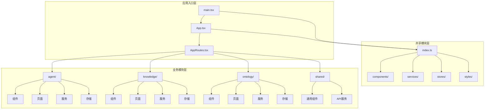
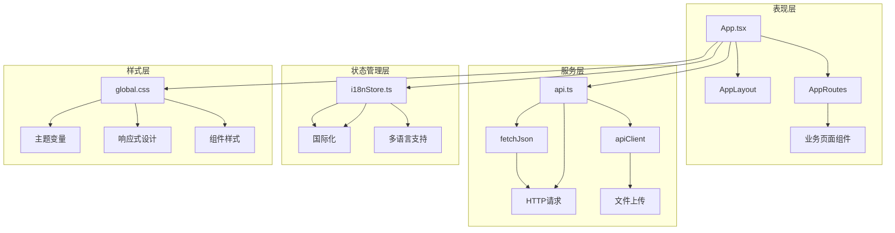
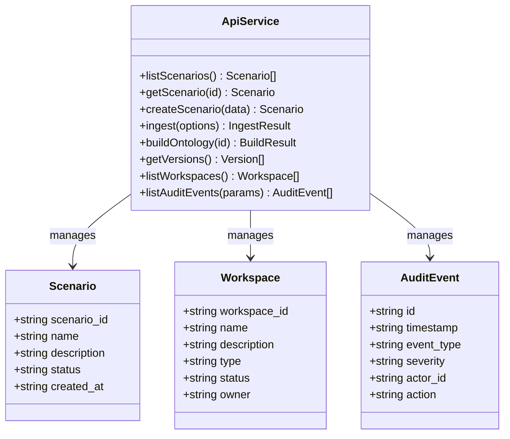
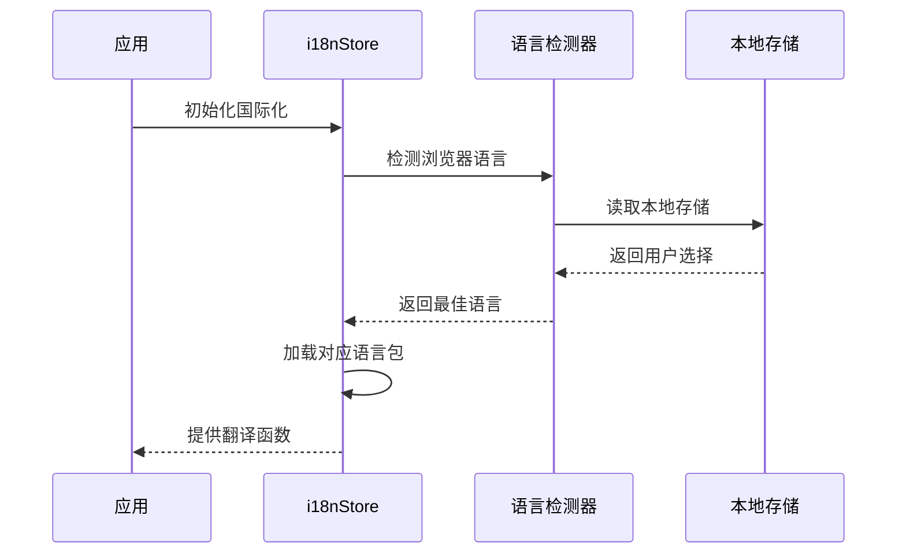
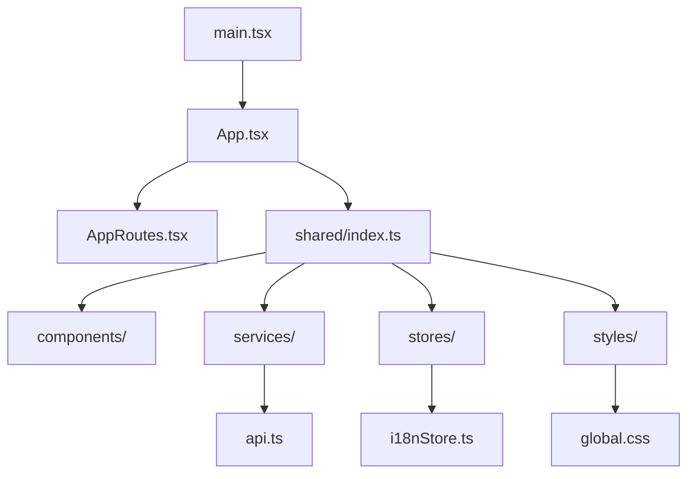
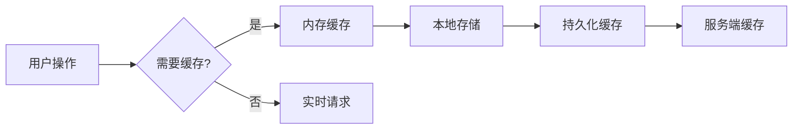

# 前端模块脚手架技能

<cite>
**本文档引用的文件**
- [package.json](file://frontend/package.json)
- [vite.config.ts](file://frontend/vite.config.ts)
- [main.tsx](file://frontend/src/main.tsx)
- [App.tsx](file://frontend/src/App.tsx)
- [AppRoutes.tsx](file://frontend/src/AppRoutes.tsx)
- [index.ts](file://frontend/src/modules/shared/index.ts)
- [global.css](file://frontend/src/modules/shared/styles/global.css)
- [i18nStore.ts](file://frontend/src/modules/shared/stores/i18nStore.ts)
- [api.ts](file://frontend/src/modules/shared/services/api.ts)
- [config.ts](file://frontend/src/config.ts)
</cite>

## 目录
1. [简介](#简介)
2. [项目结构](#项目结构)
3. [核心组件](#核心组件)
4. [架构概览](#架构概览)
5. [详细组件分析](#详细组件分析)
6. [依赖分析](#依赖分析)
7. [性能考虑](#性能考虑)
8. [故障排除指南](#故障排除指南)
9. [结论](#结论)

## 简介

这是一个基于现代前端技术栈构建的模块化脚手架项目，采用React 19、TypeScript、Vite开发环境，集成了Ant Design、AntV图表库、OpenHarness React组件等现代化工具链。该项目为复杂的本体图谱管理系统提供了完整的前端基础设施，支持多工作空间、多语言、权限控制等企业级特性。

## 项目结构

前端项目采用模块化架构设计，主要分为以下几个层次：



**图表来源**
- [main.tsx:1-12](file://frontend/src/main.tsx#L1-L12)
- [App.tsx:1-65](file://frontend/src/App.tsx#L1-L65)
- [AppRoutes.tsx:1-73](file://frontend/src/AppRoutes.tsx#L1-L73)

**章节来源**
- [main.tsx:1-12](file://frontend/src/main.tsx#L1-L12)
- [App.tsx:1-65](file://frontend/src/App.tsx#L1-L65)
- [AppRoutes.tsx:1-73](file://frontend/src/AppRoutes.tsx#L1-L73)

## 核心组件

### 应用入口组件

应用入口通过React.StrictMode包装，确保开发时能够检测潜在问题。主要职责包括：
- 初始化全局样式和国际化配置
- 加载共享状态管理
- 渲染主应用组件

### 路由控制系统

采用React Router DOM实现的受保护路由系统，支持：
- 登录状态验证
- 动态工作空间切换
- 页面访问权限控制
- 响应式布局适配

### API服务层

统一的API服务封装，提供以下功能：
- 场景管理API
- 本体构建API
- 工作空间管理API
- 审计日志API
- 数据查询API

**章节来源**
- [App.tsx:8-62](file://frontend/src/App.tsx#L8-L62)
- [AppRoutes.tsx:22-28](file://frontend/src/AppRoutes.tsx#L22-L28)
- [api.ts:77-800](file://frontend/src/modules/shared/services/api.ts#L77-L800)

## 架构概览

前端采用分层架构设计，确保各层职责清晰分离：



**图表来源**
- [App.tsx:1-65](file://frontend/src/App.tsx#L1-L65)
- [api.ts:1-800](file://frontend/src/modules/shared/services/api.ts#L1-L800)
- [i18nStore.ts:1-99](file://frontend/src/modules/shared/stores/i18nStore.ts#L1-L99)
- [global.css:1-332](file://frontend/src/modules/shared/styles/global.css#L1-L332)

## 详细组件分析

### API服务架构

API服务采用模块化设计，按功能域划分不同的API组：



**图表来源**
- [api.ts:27-56](file://frontend/src/modules/shared/services/api.ts#L27-L56)
- [api.ts:77-800](file://frontend/src/modules/shared/services/api.ts#L77-L800)

### 国际化系统

采用i18next实现的多语言支持系统：



**图表来源**
- [i18nStore.ts:1-99](file://frontend/src/modules/shared/stores/i18nStore.ts#L1-L99)

### 开发服务器配置

Vite配置支持代理转发和热重载：

```mermaid
flowchart TD
A[Vite开发服务器] --> B[React插件]
A --> C[路径别名]
A --> D[代理配置]
D --> E[/api代理]
D --> F[/health代理]
E --> G[目标服务器]
F --> G
C --> H[@别名指向src]
B --> I[热重载]
```

**图表来源**
- [vite.config.ts:10-45](file://frontend/vite.config.ts#L10-L45)

**章节来源**
- [api.ts:1-800](file://frontend/src/modules/shared/services/api.ts#L1-L800)
- [i18nStore.ts:1-99](file://frontend/src/modules/shared/stores/i18nStore.ts#L1-L99)
- [vite.config.ts:1-46](file://frontend/vite.config.ts#L1-L46)

## 依赖分析

### 核心依赖关系

前端项目采用现代化的技术栈组合：

```mermaid
graph LR
subgraph "运行时依赖"
A[react] --> B[react-dom]
C[antd] --> D[@ant-design/icons]
E[echarts] --> F[leaflet]
G[zustand] --> H[状态管理]
I[react-router-dom] --> J[路由控制]
end
subgraph "开发依赖"
K[vite] --> L[构建工具]
M[typescript] --> N[类型检查]
O[eslint] --> P[代码质量]
Q[vitest] --> R[测试框架]
end
subgraph "可视化库"
S[AntV G6] --> T[图可视化]
U[AntV Charts] --> V[图表组件]
W[React Flow] --> X[节点连接]
end
```

**图表来源**
- [package.json:15-38](file://frontend/package.json#L15-L38)
- [package.json:39-59](file://frontend/package.json#L39-L59)

### 模块导入关系



**图表来源**
- [main.tsx:1-12](file://frontend/src/main.tsx#L1-L12)
- [App.tsx:1-65](file://frontend/src/App.tsx#L1-L65)
- [index.ts:1-11](file://frontend/src/modules/shared/index.ts#L1-L11)

**章节来源**
- [package.json:1-61](file://frontend/package.json#L1-L61)
- [index.ts:1-11](file://frontend/src/modules/shared/index.ts#L1-L11)

## 性能考虑

### 代码分割策略

项目采用按需加载和懒加载策略：
- 路由级别的代码分割
- 组件级别的动态导入
- 图表库的按需加载
- 国际化资源的分模块加载

### 缓存策略



### 性能监控

- 组件渲染性能监控
- API响应时间统计
- 图表渲染优化
- 资源加载优化

## 故障排除指南

### 常见问题诊断

1. **API请求失败**
   - 检查代理配置是否正确
   - 验证后端服务状态
   - 查看网络请求错误信息

2. **国际化显示异常**
   - 确认语言包文件完整性
   - 检查本地存储的语言设置
   - 验证i18n初始化流程

3. **样式加载问题**
   - 检查CSS变量定义
   - 验证主题配置
   - 确认样式优先级

**章节来源**
- [vite.config.ts:23-44](file://frontend/vite.config.ts#L23-L44)
- [i18nStore.ts:45-86](file://frontend/src/modules/shared/stores/i18nStore.ts#L45-L86)
- [global.css:1-332](file://frontend/src/modules/shared/styles/global.css#L1-L332)

## 结论

这个前端模块脚手架项目展现了现代前端开发的最佳实践，通过模块化架构、完善的API抽象、强大的国际化支持和优化的性能策略，为企业级应用提供了坚实的基础。项目采用的技术栈成熟稳定，文档完善，易于维护和扩展。