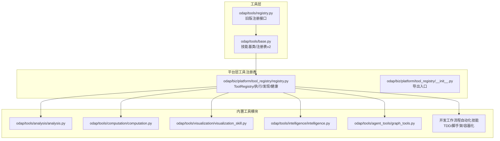
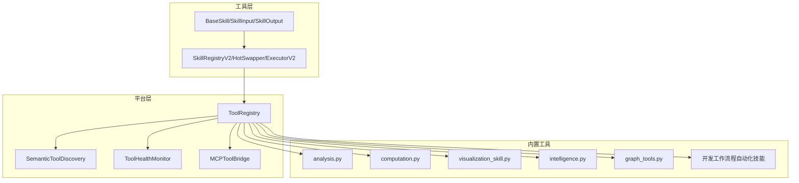
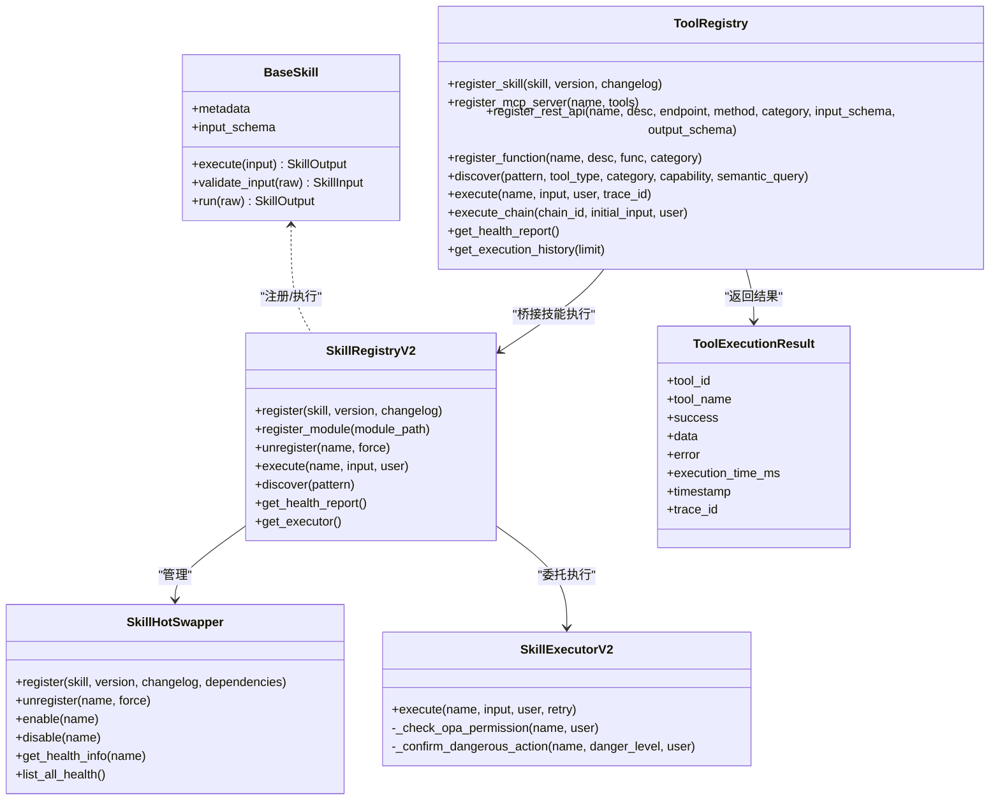
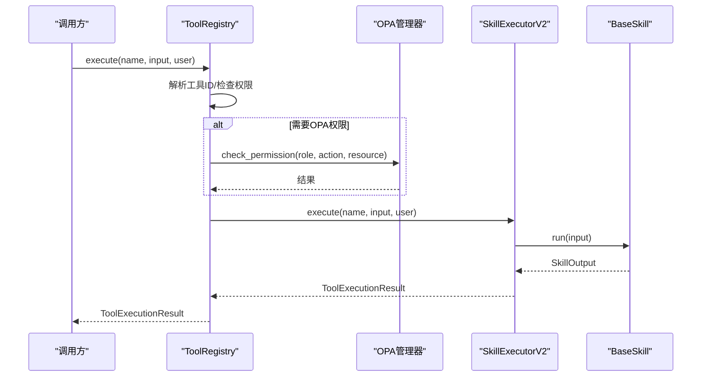
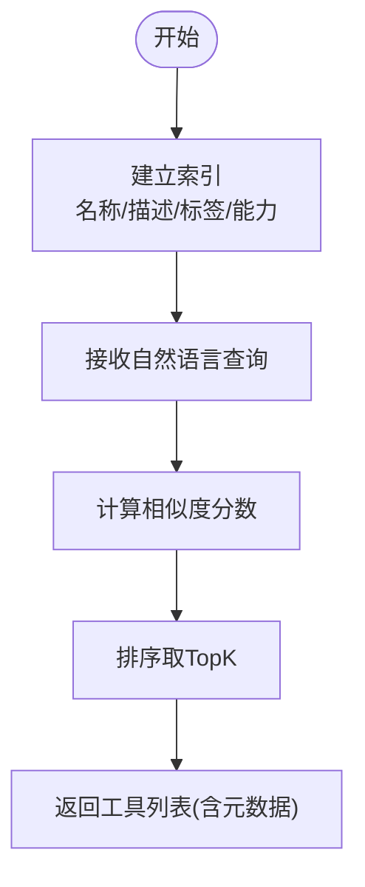
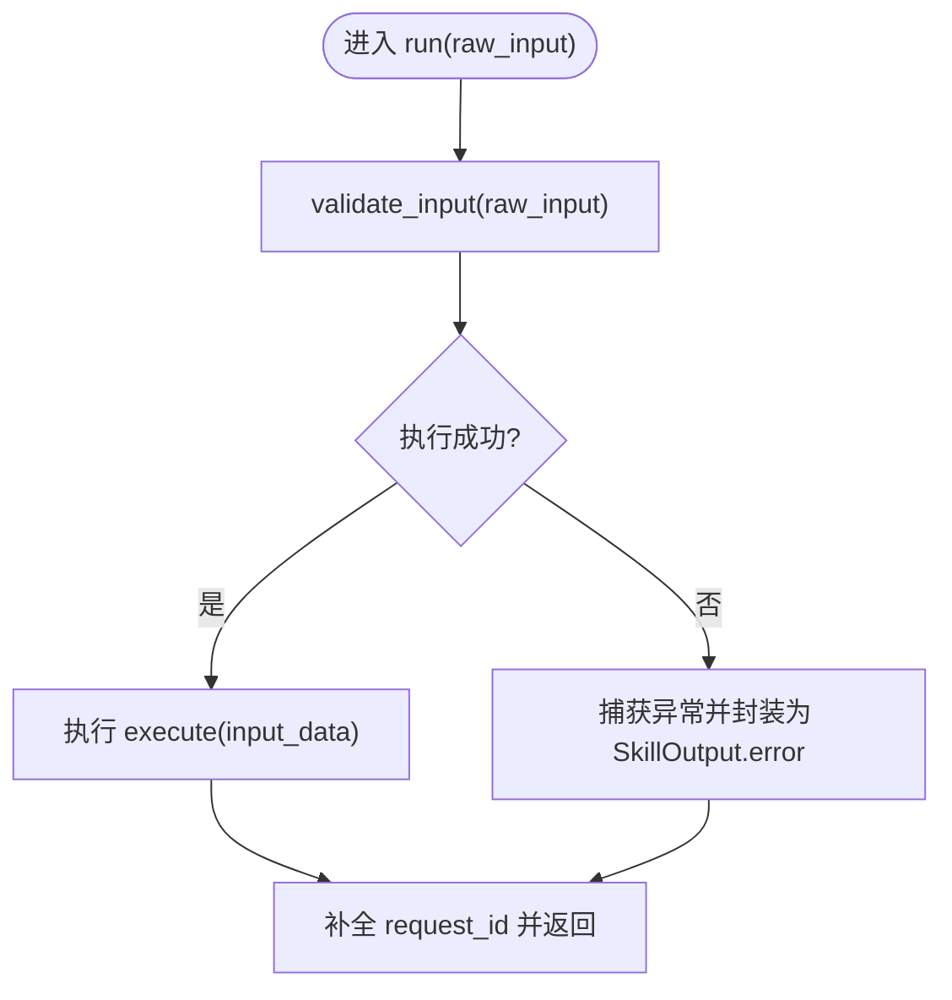
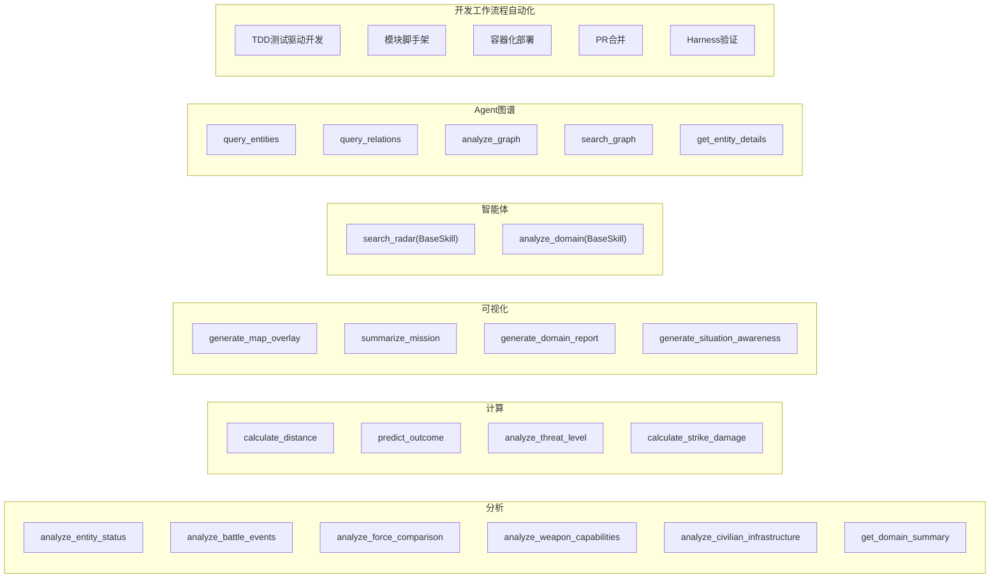
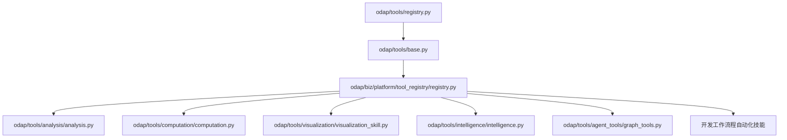

# 工具技能系统

<cite>
**本文引用的文件**
- [odap/tools/base.py](file://odap/tools/base.py)
- [odap/tools/registry.py](file://odap/tools/registry.py)
- [odap/biz/platform/tool_registry/registry.py](file://odap/biz/platform/tool_registry/registry.py)
- [odap/biz/platform/tool_registry/__init__.py](file://odap/biz/platform/tool_registry/__init__.py)
- [odap/tools/analysis/analysis.py](file://odap/tools/analysis/analysis.py)
- [odap/tools/computation/computation.py](file://odap/tools/computation/computation.py)
- [odap/tools/visualization/visualization_skill.py](file://odap/tools/visualization/visualization_skill.py)
- [odap/tools/intelligence/intelligence.py](file://odap/tools/intelligence/intelligence.py)
- [odap/tools/agent_tools/graph_tools.py](file://odap/tools/agent_tools/graph_tools.py)
- [openharness/.claude/skills/harness-eval/SKILL.md](file://openharness/.claude/skills/harness-eval/SKILL.md)
- [openharness/.claude/skills/pr-merge/SKILL.md](file://openharness/.claude/skills/pr-merge/SKILL.md)
</cite>

## 更新摘要
**所做更改**
- 新增开发工作流程自动化技能章节，涵盖 TDD 测试驱动开发、模块脚手架和容器化部署技能
- 更新内置工具类别，增加开发自动化相关工具
- 扩展技能系统架构，支持更多开发工作流程场景
- 增强工具注册表功能，支持开发工具的动态加载和管理

## 目录
1. [简介](#简介)
2. [项目结构](#项目结构)
3. [核心组件](#核心组件)
4. [架构总览](#架构总览)
5. [详细组件分析](#详细组件分析)
6. [开发工作流程自动化技能](#开发工作流程自动化技能)
7. [依赖关系分析](#依赖关系分析)
8. [性能考量](#性能考量)
9. [故障排查指南](#故障排查指南)
10. [结论](#结论)
11. [附录](#附录)

## 简介
本文件面向 ODAP 工具技能系统，系统性阐述工具注册表的设计与实现、技能系统的架构与管理、工具基类与执行流程、内置工具类别与使用方法、扩展机制与最佳实践。重点覆盖以下方面：
- 工具注册表：统一注册、动态加载、工具链、语义发现、健康监控、OPA 权限桥接
- 技能系统：技能定义、分类管理、权限控制、版本管理、热插拔与生命周期
- 工具基类：接口规范、参数校验、执行流程、错误处理
- 内置工具：数据分析、计算、可视化、智能体工具、开发工作流程自动化工具等
- 扩展机制：自定义工具开发、插件集成、热插拔支持
- 最佳实践：开发、性能优化与调试技巧

**更新** 新增开发工作流程自动化技能章节，涵盖 TDD 测试驱动开发、模块脚手架和容器化部署技能，显著增强 ODAP 平台的开发自动化能力。

## 项目结构
ODAP 工具技能系统由"工具层""平台层工具注册表""内置技能模块"三部分组成：
- 工具层：提供技能基类、输入输出模型、注册接口与全局注册表
- 平台层工具注册表：统一管理技能、MCP、REST、函数等工具，提供发现、执行、健康监控、工具链编排
- 内置工具模块：分析、计算、可视化、智能体、Agent 图谱工具、开发工作流程自动化工具等

**图表来源**
- [odap/tools/base.py:64-160](file://odap/tools/base.py#L64-L160)
- [odap/tools/registry.py:26-52](file://odap/tools/registry.py#L26-L52)
- [odap/biz/platform/tool_registry/registry.py:403-425](file://odap/biz/platform/tool_registry/registry.py#L403-L425)
- [odap/biz/platform/tool_registry/__init__.py:6-19](file://odap/biz/platform/tool_registry/__init__.py#L6-L19)
- [odap/tools/analysis/analysis.py:227-267](file://odap/tools/analysis/analysis.py#L227-L267)
- [odap/tools/computation/computation.py:221-247](file://odap/tools/computation/computation.py#L221-L247)
- [odap/tools/visualization/visualization_skill.py:235-261](file://odap/tools/visualization/visualization_skill.py#L235-L261)
- [odap/tools/intelligence/intelligence.py:170-187](file://odap/tools/intelligence/intelligence.py#L170-L187)
- [odap/tools/agent_tools/graph_tools.py:164-198](file://odap/tools/agent_tools/graph_tools.py#L164-L198)

**章节来源**
- [odap/tools/base.py:1-120](file://odap/tools/base.py#L1-L120)
- [odap/biz/platform/tool_registry/registry.py:1-120](file://odap/biz/platform/tool_registry/registry.py#L1-L120)

## 核心组件
- 技能基类与注册表
  - 技能基类提供统一的输入输出模型、元数据、执行流程与错误处理；支持新式 BaseSkill 与旧式裸函数 handler 的兼容
  - 注册表 v2 支持热插拔、版本管理、健康监控、OPA 权限桥接与执行器
- 平台工具注册表
  - 统一管理技能、MCP、REST、函数等工具；提供语义发现、工具链、健康监控、OPA 权限检查
- 内置工具模块
  - 分析、计算、可视化、智能体、Agent 图谱工具、开发工作流程自动化工具等，按领域分类注册

**章节来源**
- [odap/tools/base.py:64-160](file://odap/tools/base.py#L64-L160)
- [odap/tools/base.py:599-720](file://odap/tools/base.py#L599-L720)
- [odap/biz/platform/tool_registry/registry.py:403-425](file://odap/biz/platform/tool_registry/registry.py#L403-L425)

## 架构总览
系统采用"工具层 + 平台层 + 内置工具"的分层架构：
- 工具层负责技能抽象与注册
- 平台层负责统一工具管理、发现与执行
- 内置工具模块提供具体能力，包括开发工作流程自动化工具

**图表来源**
- [odap/tools/base.py:599-720](file://odap/tools/base.py#L599-L720)
- [odap/biz/platform/tool_registry/registry.py:403-425](file://odap/biz/platform/tool_registry/registry.py#L403-L425)
- [odap/biz/platform/tool_registry/registry.py:216-299](file://odap/biz/platform/tool_registry/registry.py#L216-L299)
- [odap/biz/platform/tool_registry/registry.py:304-401](file://odap/biz/platform/tool_registry/registry.py#L304-L401)
- [odap/biz/platform/tool_registry/registry.py:149-214](file://odap/biz/platform/tool_registry/registry.py#L149-L214)
- [odap/tools/analysis/analysis.py:227-267](file://odap/tools/analysis/analysis.py#L227-L267)
- [odap/tools/computation/computation.py:221-247](file://odap/tools/computation/computation.py#L221-L247)
- [odap/tools/visualization/visualization_skill.py:235-261](file://odap/tools/visualization/visualization_skill.py#L235-L261)
- [odap/tools/intelligence/intelligence.py:170-187](file://odap/tools/intelligence/intelligence.py#L170-L187)
- [odap/tools/agent_tools/graph_tools.py:164-198](file://odap/tools/agent_tools/graph_tools.py#L164-L198)

## 详细组件分析

### 工具注册表与技能系统
- 统一注册与动态加载
  - 平台工具注册表支持注册技能、MCP、REST、函数；提供 discover、execute、execute_chain 等核心能力
  - 技能注册表 v2 支持模块动态加载（importlib + inspect），自动发现并实例化 BaseSkill 子类
- 技能生命周期与热插拔
  - HotSwapper 提供注册、版本更新、启用/禁用、卸载与健康监控
  - ExecutorV2 支持 OPA 权限检查、危险级别确认、重试机制与健康指标统计
- 权限控制与版本管理
  - 元数据包含 requires_opa_check、opa_action、danger_level、version 等字段
  - 健康监控记录调用次数、成功率、平均耗时与最近错误

**图表来源**
- [odap/tools/base.py:64-160](file://odap/tools/base.py#L64-L160)
- [odap/tools/base.py:599-720](file://odap/tools/base.py#L599-L720)
- [odap/biz/platform/tool_registry/registry.py:403-425](file://odap/biz/platform/tool_registry/registry.py#L403-L425)
- [odap/biz/platform/tool_registry/registry.py:132-147](file://odap/biz/platform/tool_registry/registry.py#L132-L147)

**章节来源**
- [odap/tools/base.py:599-720](file://odap/tools/base.py#L599-L720)
- [odap/biz/platform/tool_registry/registry.py:403-425](file://odap/biz/platform/tool_registry/registry.py#L403-L425)

### 工具执行流程与权限校验
- 执行流程
  - ToolRegistry.execute 解析工具 ID、检查 OPA 权限、路由到对应执行器（技能/函数/MCP/REST）、记录健康与历史
  - 异步执行通过 execute_async 在线程池中执行同步逻辑
- 权限与危险级别
  - 若 requires_opa_check 为真，使用 OPAManagerV2 校验用户角色与动作
  - 高危/临界危险级别需管理员确认或用户显式确认

**图表来源**
- [odap/biz/platform/tool_registry/registry.py:579-662](file://odap/biz/platform/tool_registry/registry.py#L579-L662)
- [odap/biz/platform/tool_registry/registry.py:761-771](file://odap/biz/platform/tool_registry/registry.py#L761-L771)
- [odap/tools/base.py:458-597](file://odap/tools/base.py#L458-L597)

**章节来源**
- [odap/biz/platform/tool_registry/registry.py:579-662](file://odap/biz/platform/tool_registry/registry.py#L579-L662)
- [odap/tools/base.py:458-597](file://odap/tools/base.py#L458-L597)

### 语义发现与工具链
- 语义发现
  - 基于名称、描述、标签、能力的关键词索引，支持自然语言查询排序
- 工具链
  - 支持步骤映射、条件判断、链式执行与上下文传递

**图表来源**
- [odap/biz/platform/tool_registry/registry.py:216-299](file://odap/biz/platform/tool_registry/registry.py#L216-L299)

**章节来源**
- [odap/biz/platform/tool_registry/registry.py:216-299](file://odap/biz/platform/tool_registry/registry.py#L216-L299)
- [odap/biz/platform/tool_registry/registry.py:670-717](file://odap/biz/platform/tool_registry/registry.py#L670-L717)

### 工具基类设计与执行流程
- 接口规范
  - BaseSkill 必须实现 execute；支持 input_schema 自动校验
  - SkillInput/SkillOutput 提供标准化输入输出与追踪字段
- 参数验证与执行
  - validate_input 使用 Pydantic 模型进行参数校验
  - run 封装计时、异常捕获与输出补全
- 错误处理
  - 统一返回 SkillOutput，包含 success、data、error、execution_time_ms、request_id

**图表来源**
- [odap/tools/base.py:112-160](file://odap/tools/base.py#L112-L160)

**章节来源**
- [odap/tools/base.py:31-160](file://odap/tools/base.py#L31-L160)

### 内置工具类别与使用方法
- 分析类工具
  - 实体状态分析、事件分析、力量对比、武器能力分析、民用基础设施分析、领域态势摘要
- 计算类工具
  - 距离计算、攻击结果预测、威胁等级分析、打击毁伤评估
- 可视化类工具
  - 地图叠加层生成、任务摘要、领域态势报告、态势感知
- 智能体类工具
  - 雷达搜索、领域态势分析（BaseSkill 实现）
- Agent 图谱工具
  - 实体查询、关系查询、图谱分析、搜索、实体详情
- **开发工作流程自动化工具**（新增）
  - TDD 测试驱动开发、模块脚手架、容器化部署、PR 合并、Harness 验证

**图表来源**
- [odap/tools/analysis/analysis.py:227-267](file://odap/tools/analysis/analysis.py#L227-L267)
- [odap/tools/computation/computation.py:221-247](file://odap/tools/computation/computation.py#L221-L247)
- [odap/tools/visualization/visualization_skill.py:235-261](file://odap/tools/visualization/visualization_skill.py#L235-L261)
- [odap/tools/intelligence/intelligence.py:170-187](file://odap/tools/intelligence/intelligence.py#L170-L187)
- [odap/tools/agent_tools/graph_tools.py:164-198](file://odap/tools/agent_tools/graph_tools.py#L164-L198)

**章节来源**
- [odap/tools/analysis/analysis.py:17-267](file://odap/tools/analysis/analysis.py#L17-L267)
- [odap/tools/computation/computation.py:19-247](file://odap/tools/computation/computation.py#L19-L247)
- [odap/tools/visualization/visualization_skill.py:18-261](file://odap/tools/visualization/visualization_skill.py#L18-L261)
- [odap/tools/intelligence/intelligence.py:36-187](file://odap/tools/intelligence/intelligence.py#L36-L187)
- [odap/tools/agent_tools/graph_tools.py:15-198](file://odap/tools/agent_tools/graph_tools.py#L15-L198)

### 扩展机制与热插拔
- 自定义工具开发
  - 继承 BaseSkill 并实现 execute；通过 get_registry_v2().register 注册
  - 或使用 register_skill 保持向后兼容
- 插件集成
  - ToolRegistry.register_mcp_server 与 MCPToolBridge 支持 MCP 工具桥接
  - register_module 动态加载模块中的所有 BaseSkill 子类
- 热插拔与生命周期
  - HotSwapper 支持版本更新、启用/禁用、卸载与健康监控
  - ExecutorV2 提供重试与危险级别确认

**章节来源**
- [odap/tools/base.py:616-644](file://odap/tools/base.py#L616-L644)
- [odap/biz/platform/tool_registry/registry.py:469-482](file://odap/biz/platform/tool_registry/registry.py#L469-L482)
- [odap/biz/platform/tool_registry/registry.py:149-214](file://odap/biz/platform/tool_registry/registry.py#L149-L214)

## 开发工作流程自动化技能

### TDD 测试驱动开发技能
TDD（测试驱动开发）技能为开发者提供完整的测试驱动开发工作流程，包括测试编写、执行和重构指导。

- 核心功能
  - 自动生成测试用例模板
  - 执行单元测试并提供结果分析
  - 提供重构建议和代码质量改进
  - 集成持续集成流程

- 工作流程
  1. **测试设计阶段**：根据需求生成测试用例骨架
  2. **快速实现**：编写最小化代码通过测试
  3. **重构优化**：清理代码结构，提高可维护性
  4. **持续集成**：与 CI/CD 流程集成

- 使用场景
  - 新功能开发的 TDD 实践
  - 代码重构过程中的质量保证
  - 团队协作中的测试标准制定

### 模块脚手架技能
模块脚手架技能为开发者提供标准化的项目初始化和模块创建能力。

- 核心功能
  - 自动生成项目结构模板
  - 创建标准的配置文件
  - 生成基础代码框架
  - 集成版本控制系统初始化

- 支持的项目类型
  - Python 包项目
  - JavaScript/TypeScript 项目
  - Go 语言项目
  - Java 项目

- 自动化特性
  - 依赖管理配置
  - 测试框架集成
  - 文档生成工具配置
  - 代码格式化工具设置

### 容器化部署技能
容器化部署技能提供完整的应用打包和部署解决方案。

- 核心功能
  - 自动生成 Dockerfile 和容器配置
  - 生成 Kubernetes 部署清单
  - 配置 CI/CD 流水线
  - 云平台部署支持

- 支持的部署平台
  - Docker 容器化
  - Kubernetes 集群部署
  - 云平台（AWS、Azure、GCP）部署
  - 本地开发环境配置

- 自动化特性
  - 多环境配置管理
  - 健康检查和服务发现
  - 负载均衡和扩缩容配置
  - 监控和日志收集

### PR 合并技能
PR（Pull Request）合并技能为团队协作提供自动化的工作流程。

- 核心功能
  - PR 冲突检测和解决
  - 自动化代码审查
  - 质量门禁检查
  - 合并策略执行

- 工作流程
  1. **PR 创建**：自动分配审查者
  2. **代码审查**：自动化质量检查
  3. **冲突解决**：智能冲突检测和修复
  4. **合并执行**：安全的代码合并

- 质量保证
  - 代码风格检查
  - 单元测试覆盖率
  - 安全漏洞扫描
  - 性能基准测试

### Harness 验证技能
Harness 验证技能专门用于 OpenHarness 框架的功能验证和端到端测试。

- 核心功能
  - 端到端功能验证
  - 性能基准测试
  - 兼容性测试
  - 回归测试执行

- 测试场景
  - Agent 循环功能测试
  - 工具链执行验证
  - 多代理协调测试
  - 安全边界测试

- 验证流程
  1. **环境准备**：克隆目标项目
  2. **配置设置**：真实 API 调用配置
  3. **功能测试**：多轮对话和工具调用
  4. **结果分析**：工具执行和输出验证

**章节来源**
- [openharness/.claude/skills/harness-eval/SKILL.md:1-194](file://openharness/.claude/skills/harness-eval/SKILL.md#L1-L194)
- [openharness/.claude/skills/pr-merge/SKILL.md:1-100](file://openharness/.claude/skills/pr-merge/SKILL.md#L1-L100)

## 依赖关系分析
- 工具层依赖
  - odap/tools/base.py 提供技能基类与注册表 v2
  - odap/tools/registry.py 提供旧版注册接口与全局目录
- 平台层依赖
  - odap/biz/platform/tool_registry/registry.py 依赖工具层技能基类与注册表，并引入 OPA 管理器
- 内置工具依赖
  - 各模块依赖 odap.infra.graph.GraphManager 与模拟数据生成器
  - **开发工作流程自动化技能** 依赖 OpenHarness 生态系统和相关工具链

**图表来源**
- [odap/tools/base.py:14-41](file://odap/tools/base.py#L14-L41)
- [odap/tools/registry.py:14-23](file://odap/tools/registry.py#L14-L23)
- [odap/biz/platform/tool_registry/registry.py:30-41](file://odap/biz/platform/tool_registry/registry.py#L30-L41)
- [odap/tools/analysis/analysis.py:9-15](file://odap/tools/analysis/analysis.py#L9-L15)
- [odap/tools/computation/computation.py:11-15](file://odap/tools/computation/computation.py#L11-L15)
- [odap/tools/visualization/visualization_skill.py:10-14](file://odap/tools/visualization/visualization_skill.py#L10-L14)
- [odap/tools/intelligence/intelligence.py:17-30](file://odap/tools/intelligence/intelligence.py#L17-L30)
- [odap/tools/agent_tools/graph_tools.py:8-12](file://odap/tools/agent_tools/graph_tools.py#L8-L12)

**章节来源**
- [odap/tools/base.py:14-41](file://odap/tools/base.py#L14-L41)
- [odap/biz/platform/tool_registry/registry.py:30-41](file://odap/biz/platform/tool_registry/registry.py#L30-L41)

## 性能考量
- 执行性能
  - 使用线程锁保护并发注册与执行；异步执行通过线程池隔离阻塞
  - 健康监控记录平均耗时与错误率，支持阈值告警
- 发现与索引
  - 语义发现基于关键词与能力索引，复杂查询建议限制 TopK 与预过滤
- 资源管理
  - 工具链执行支持条件判断与上下文映射，减少无效调用
  - 历史记录限制大小，避免内存膨胀
- **开发工作流程自动化性能**
  - 容器化部署使用缓存层减少构建时间
  - TDD 测试执行优化测试选择和并行化
  - PR 合并自动化减少人工干预

## 故障排查指南
- 常见问题
  - 工具未找到：检查 discover 结果与工具 ID 解析逻辑
  - 权限拒绝：确认 requires_opa_check 与 opa_action 设置，核对用户角色
  - 危险操作被阻止：确认管理员角色或用户显式确认
  - 执行失败：查看 ToolExecutionResult.error 与 ToolHealthMonitor 健康报告
  - **开发工作流程问题**：检查相关工具链配置和环境变量设置
- 调试建议
  - 使用 get_health_report 查看总体健康状况
  - 通过 get_execution_history 获取最近执行记录
  - 对高危工具设置较低危险级别或临时关闭
  - **开发工作流程调试**：查看 CI/CD 日志和容器化构建输出

**章节来源**
- [odap/biz/platform/tool_registry/registry.py:719-740](file://odap/biz/platform/tool_registry/registry.py#L719-L740)
- [odap/biz/platform/tool_registry/registry.py:742-744](file://odap/biz/platform/tool_registry/registry.py#L742-L744)
- [odap/biz/platform/tool_registry/registry.py:610-619](file://odap/biz/platform/tool_registry/registry.py#L610-L619)

## 结论
ODAP 工具技能系统通过"工具层 + 平台层 + 内置工具"的分层设计，实现了统一的工具注册、动态加载、权限控制、健康监控与工具链编排。技能系统支持热插拔、版本管理与生命周期管理，满足运行时配置与热生效需求。内置工具覆盖分析、计算、可视化、智能体、图谱操作等关键领域，**新增的开发工作流程自动化技能进一步增强了平台的开发自动化能力**，包括 TDD 测试驱动开发、模块脚手架、容器化部署、PR 合并和 Harness 验证等功能。这些技能的加入使得 ODAP 平台能够更好地支持现代软件开发生命周期，从开发、测试到部署的全流程自动化。

## 附录
- 最佳实践
  - 使用 BaseSkill 定义技能，明确 category、danger_level、requires_opa_check、opa_action、version
  - 为输入定义 input_schema，确保参数校验与文档生成
  - 为高危工具增加危险级别与确认流程
  - 使用 ToolRegistry.register_mcp_server 与 MCPToolBridge 集成外部工具
  - 通过 register_module 动态加载自定义技能模块
  - **开发工作流程技能**：合理配置 CI/CD 环境，确保测试和部署的一致性
- 性能优化
  - 控制语义发现 TopK，避免大规模扫描
  - 合理设置健康监控阈值，及时发现异常
  - 使用工具链减少重复调用，提升整体吞吐
  - **开发工作流程优化**：利用缓存和并行化提升构建和测试效率
- 调试技巧
  - 开启 ToolHealthMonitor 告警，关注错误率与延迟
  - 使用 get_execution_history 快速定位失败原因
  - 对复杂工具链分步执行，逐步缩小问题范围
  - **开发工作流程调试**：检查工具链依赖和环境配置，查看详细的构建日志