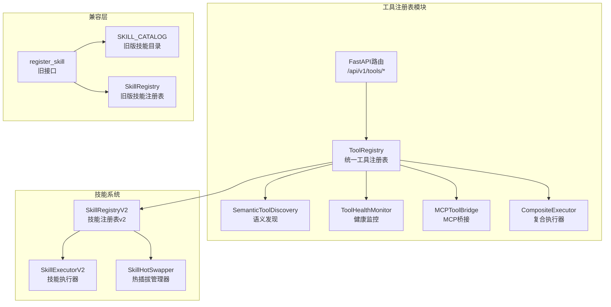
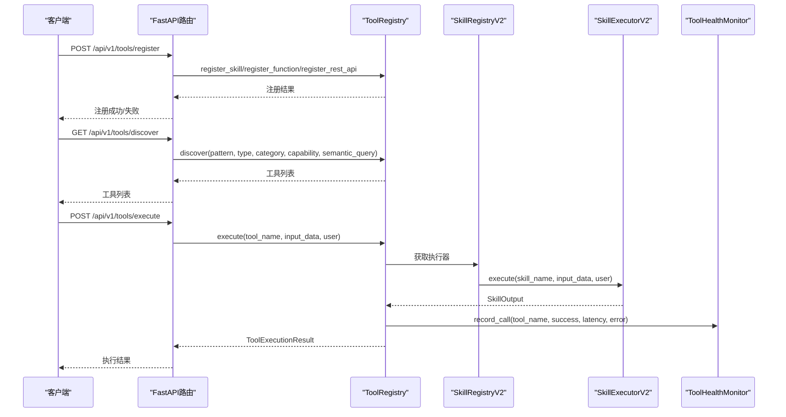
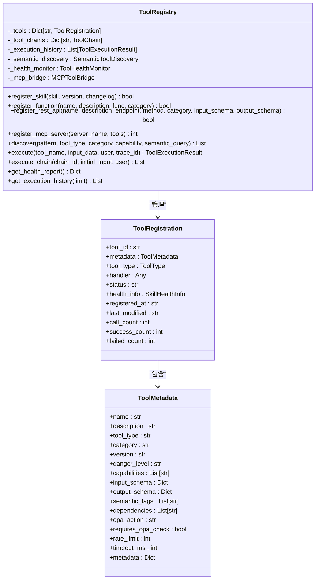
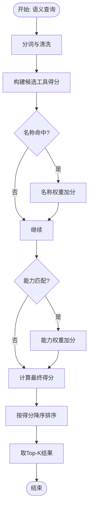
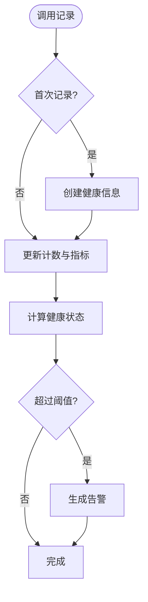
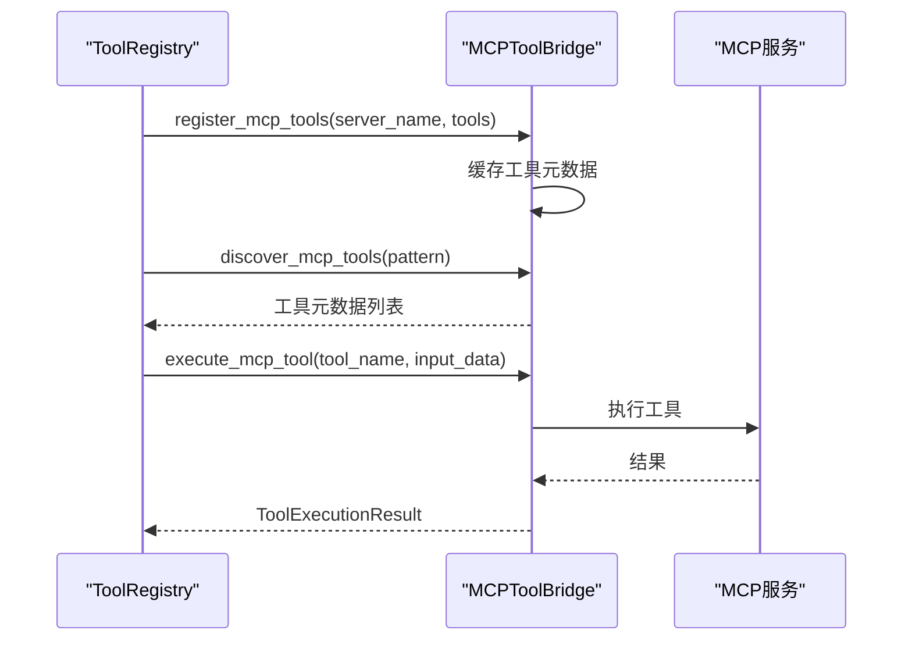
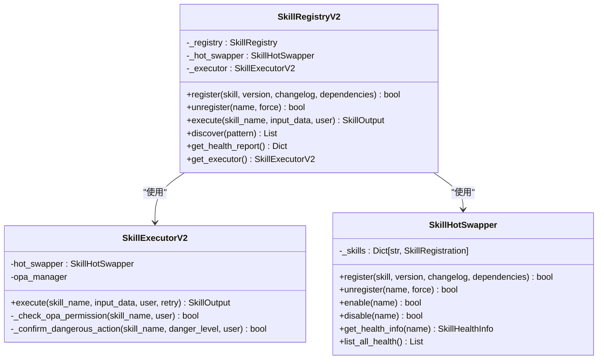
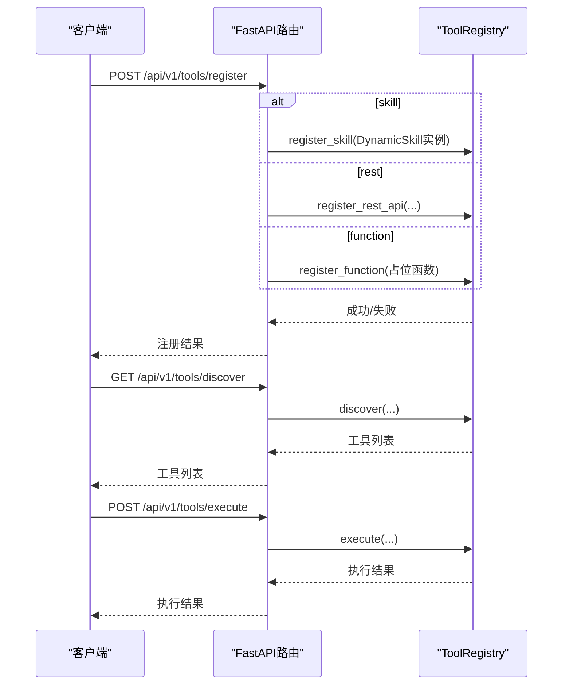
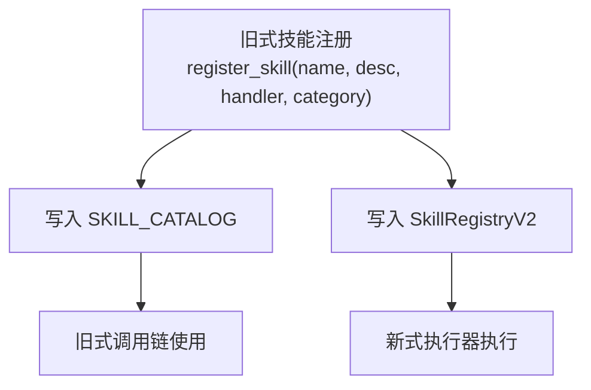
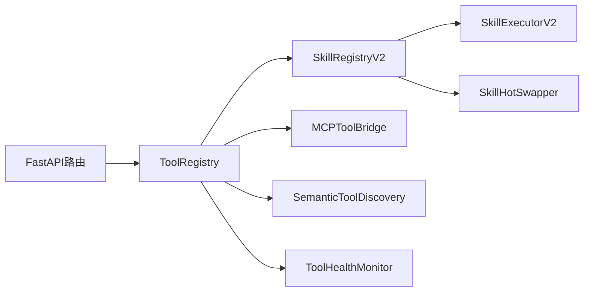

# 工具注册表

<cite>
**本文引用的文件**
- [odap/biz/platform/tool_registry/registry.py](file://odap/biz/platform/tool_registry/registry.py)
- [odap/biz/platform/tool_registry/__init__.py](file://odap/biz/platform/tool_registry/__init__.py)
- [odap/biz/platform/tool_registry/api/routes.py](file://odap/biz/platform/tool_registry/api/routes.py)
- [odap/biz/platform/tool_registry/composite_executor.py](file://odap/biz/platform/tool_registry/composite_executor.py)
- [odap/biz/platform/tool_registry/semantic_discovery.py](file://odap/biz/platform/tool_registry/semantic_discovery.py)
- [odap/tools/base.py](file://odap/tools/base.py)
- [odap/tools/registry.py](file://odap/tools/registry.py)
- [odap/tools/__init__.py](file://odap/tools/__init__.py)
- [tests/unit/test_tool_registry.py](file://tests/unit/test_tool_registry.py)
</cite>

## 目录
1. [简介](#简介)
2. [项目结构](#项目结构)
3. [核心组件](#核心组件)
4. [架构总览](#架构总览)
5. [详细组件分析](#详细组件分析)
6. [依赖关系分析](#依赖关系分析)
7. [性能考量](#性能考量)
8. [故障排查指南](#故障排查指南)
9. [结论](#结论)
10. [附录](#附录)

## 简介
本文件面向 ODAP 工具注册表系统，系统性阐述其设计原理、双模式兼容机制（SKILL_CATALOG 旧模式与 SkillRegistry 新模式）、工具发现与动态加载、注册表数据结构、工具生命周期管理、最佳实践以及具体示例路径。目标读者既包括工程开发人员，也包括对系统架构感兴趣的非技术读者。

## 项目结构
工具注册表位于 odap/biz/platform/tool_registry 模块，围绕统一工具注册表 ToolRegistry 提供跨类型工具（Skill、MCP、REST、Function）的注册、发现、执行与健康监控，并通过 FastAPI 提供 REST API。同时，odap/tools 提供旧版技能注册与兼容层，确保平滑过渡。

图示来源
- [odap/biz/platform/tool_registry/registry.py:403-425](file://odap/biz/platform/tool_registry/registry.py#L403-L425)
- [odap/biz/platform/tool_registry/api/routes.py:11-11](file://odap/biz/platform/tool_registry/api/routes.py#L11-L11)
- [odap/tools/base.py:599-610](file://odap/tools/base.py#L599-L610)
- [odap/tools/registry.py:26-38](file://odap/tools/registry.py#L26-L38)

章节来源
- [odap/biz/platform/tool_registry/registry.py:1-100](file://odap/biz/platform/tool_registry/registry.py#L1-L100)
- [odap/biz/platform/tool_registry/__init__.py:1-34](file://odap/biz/platform/tool_registry/__init__.py#L1-L34)
- [odap/biz/platform/tool_registry/api/routes.py:1-310](file://odap/biz/platform/tool_registry/api/routes.py#L1-L310)
- [odap/tools/base.py:1-120](file://odap/tools/base.py#L1-L120)
- [odap/tools/registry.py:1-53](file://odap/tools/registry.py#L1-L53)

## 核心组件
- ToolRegistry：统一管理各类工具，提供注册、发现、执行、工具链、健康报告与执行历史等能力。
- ToolMetadata/ToolRegistration：标准化工具元数据与注册信息，支持分类、能力、权限、超时、速率限制等。
- SemanticToolDiscovery：基于关键字、语义标签与能力的语义发现引擎。
- ToolHealthMonitor：工具健康状态记录与告警阈值控制。
- MCPToolBridge：MCP 工具服务器的桥接与缓存。
- SkillRegistryV2/SkillExecutorV2：技能注册表 v2 与执行器，支持热插拔、版本管理、OPA 权限检查。
- FastAPI 路由：提供 REST API，支持注册、发现、执行、工具链、健康与历史查询。
- 兼容层：SKILL_CATALOG 与 register_skill 保持向后兼容。

章节来源
- [odap/biz/platform/tool_registry/registry.py:49-147](file://odap/biz/platform/tool_registry/registry.py#L49-L147)
- [odap/biz/platform/tool_registry/registry.py:403-425](file://odap/biz/platform/tool_registry/registry.py#L403-L425)
- [odap/biz/platform/tool_registry/api/routes.py:14-67](file://odap/biz/platform/tool_registry/api/routes.py#L14-L67)
- [odap/tools/base.py:48-110](file://odap/tools/base.py#L48-L110)
- [odap/tools/registry.py:26-38](file://odap/tools/registry.py#L26-L38)

## 架构总览
工具注册表采用“统一注册表 + 多执行通道”的架构，将 Skill、MCP、REST、Function 统一抽象为 ToolRegistration，通过 ToolRegistry 统一调度。Skill 通过 SkillRegistryV2 与 SkillExecutorV2 执行；MCP 通过 MCPToolBridge 桥接；REST 当前占位；Function 直接执行。注册表内置语义发现与健康监控，支持工具链编排与历史审计。

图示来源
- [odap/biz/platform/tool_registry/api/routes.py:75-178](file://odap/biz/platform/tool_registry/api/routes.py#L75-L178)
- [odap/biz/platform/tool_registry/registry.py:426-662](file://odap/biz/platform/tool_registry/registry.py#L426-L662)
- [odap/tools/base.py:458-597](file://odap/tools/base.py#L458-L597)

## 详细组件分析

### 统一工具注册表（ToolRegistry）
- 设计目标：统一管理 Skill、MCP、REST、Function 四类工具，提供注册、发现、执行、工具链、健康监控与历史审计。
- 关键能力：
  - register_skill/register_function/register_rest_api/register_mcp_server：四类工具注册。
  - discover：支持名称模式、类型、分类、能力与语义查询。
  - execute/execute_async/execute_chain：执行工具与工具链。
  - get_health_report/get_execution_history：健康与历史查询。
- 数据结构：
  - _tools：工具名到 ToolRegistration 的映射。
  - _tool_chains：工具链 ID 到 ToolChain 的映射。
  - _execution_history：执行历史队列。
  - _semantic_discovery/_health_monitor/_mcp_bridge：内嵌子系统。
- 执行流程：
  - 解析工具 ID → 权限检查（OPA）→ 分发到对应执行器（Skill/Function/MCP/REST）→ 更新统计与健康 → 记录历史。

图示来源
- [odap/biz/platform/tool_registry/registry.py:403-937](file://odap/biz/platform/tool_registry/registry.py#L403-L937)

章节来源
- [odap/biz/platform/tool_registry/registry.py:403-937](file://odap/biz/platform/tool_registry/registry.py#L403-L937)

### 语义发现（SemanticToolDiscovery）
- 索引策略：基于工具名称拆分、语义标签与能力建立倒排索引。
- 查询策略：对自然语言查询进行词法分析，结合名称、描述、标签与能力计算相似度，返回排序结果。
- 适用场景：根据用户自然语言意图推荐最合适的工具集合。

图示来源
- [odap/biz/platform/tool_registry/registry.py:216-298](file://odap/biz/platform/tool_registry/registry.py#L216-L298)

章节来源
- [odap/biz/platform/tool_registry/registry.py:216-298](file://odap/biz/platform/tool_registry/registry.py#L216-L298)

### 健康监控（ToolHealthMonitor）
- 记录指标：总调用次数、成功/失败次数、平均执行时延、最近一次错误与时间。
- 健康状态：健康/轻度异常/严重异常，依据错误率与延迟阈值判定。
- 告警机制：达到阈值时生成告警，支持按工具或级别筛选与清理。

图示来源
- [odap/biz/platform/tool_registry/registry.py:304-401](file://odap/biz/platform/tool_registry/registry.py#L304-L401)

章节来源
- [odap/biz/platform/tool_registry/registry.py:304-401](file://odap/biz/platform/tool_registry/registry.py#L304-L401)

### MCP 工具桥接（MCPToolBridge）
- 缓存策略：将 MCP 服务器工具元数据缓存至内存，便于快速发现与执行。
- 发现与执行：支持按模式匹配发现、按名称获取元数据、异步执行并封装为 ToolExecutionResult。

图示来源
- [odap/biz/platform/tool_registry/registry.py:149-214](file://odap/biz/platform/tool_registry/registry.py#L149-L214)

章节来源
- [odap/biz/platform/tool_registry/registry.py:149-214](file://odap/biz/platform/tool_registry/registry.py#L149-L214)

### 技能系统（SkillRegistryV2/SkillExecutorV2）
- 热插拔与版本管理：支持技能注册、版本切换、启用/禁用与卸载。
- 执行器增强：支持 OPA 权限检查、危险级别确认、重试机制与健康指标更新。
- 与 ToolRegistry 协作：ToolRegistry 在执行 Skill 时委托 SkillRegistryV2 的执行器。

图示来源
- [odap/tools/base.py:599-719](file://odap/tools/base.py#L599-L719)

章节来源
- [odap/tools/base.py:458-719](file://odap/tools/base.py#L458-L719)

### REST API 路由（FastAPI）
- 提供工具注册、发现、执行、工具链注册与执行、健康报告与执行历史查询等接口。
- 注册接口支持 skill、rest、function 三类工具，内部根据类型选择不同注册路径。

图示来源
- [odap/biz/platform/tool_registry/api/routes.py:75-277](file://odap/biz/platform/tool_registry/api/routes.py#L75-L277)

章节来源
- [odap/biz/platform/tool_registry/api/routes.py:1-310](file://odap/biz/platform/tool_registry/api/routes.py#L1-L310)

### 兼容层（SKILL_CATALOG 与 register_skill）
- 旧模式：SKILL_CATALOG 字典保存旧式技能，register_skill 同时写入旧目录与新注册表。
- 新模式：SkillRegistryV2 与 BaseSkill 抽象，支持热插拔、版本管理与健康监控。
- 平滑过渡：兼容层确保旧式技能仍可被发现与执行，逐步迁移到新接口。

图示来源
- [odap/tools/registry.py:26-38](file://odap/tools/registry.py#L26-L38)
- [odap/tools/base.py:239-296](file://odap/tools/base.py#L239-L296)

章节来源
- [odap/tools/registry.py:1-53](file://odap/tools/registry.py#L1-L53)
- [odap/tools/base.py:239-296](file://odap/tools/base.py#L239-L296)

## 依赖关系分析
- 内部耦合：
  - ToolRegistry 依赖 SkillRegistryV2、MCPToolBridge、SemanticToolDiscovery、ToolHealthMonitor。
  - SkillRegistryV2 依赖 SkillHotSwapper 与 SkillExecutorV2。
- 外部依赖：
  - OPA 权限检查（可选）。
  - FastAPI 路由层提供 REST 接口。
- 潜在风险：
  - OPA 未就绪时默认放行，需谨慎配置 requires_opa_check。
  - MCP/REST 执行当前为占位，需后续完善。

图示来源
- [odap/biz/platform/tool_registry/registry.py:414-421](file://odap/biz/platform/tool_registry/registry.py#L414-L421)
- [odap/biz/platform/tool_registry/api/routes.py:69-72](file://odap/biz/platform/tool_registry/api/routes.py#L69-L72)

章节来源
- [odap/biz/platform/tool_registry/registry.py:414-421](file://odap/biz/platform/tool_registry/registry.py#L414-L421)
- [odap/biz/platform/tool_registry/api/routes.py:69-72](file://odap/biz/platform/tool_registry/api/routes.py#L69-L72)

## 性能考量
- 索引与查询：语义发现使用倒排索引与相似度评分，建议合理设置 semantic_tags 与能力，减少无关噪声。
- 健康监控：健康状态计算与告警触发为常量开销，注意阈值设置避免误报。
- 执行路径：Skill 通过执行器统一调度，Function 直接执行，MCP/REST 为异步占位，建议优先使用 Function 与 Skill。
- 历史与统计：执行历史队列有上限，避免长期运行导致内存膨胀。

## 故障排查指南
- 工具未找到：检查 discover 过滤参数与工具 ID 命名规则（如 func:name）。
- 权限拒绝：确认 requires_opa_check 与 opa_action 设置，核对用户角色与权限策略。
- 执行异常：查看 ToolExecutionResult.error 与 ToolHealthMonitor 健康状态，定位失败原因。
- 健康告警：通过 get_health_report 与 get_alerts 查看工具健康与告警列表。

章节来源
- [odap/biz/platform/tool_registry/registry.py:579-662](file://odap/biz/platform/tool_registry/registry.py#L579-L662)
- [odap/biz/platform/tool_registry/registry.py:719-740](file://odap/biz/platform/tool_registry/registry.py#L719-L740)
- [odap/biz/platform/tool_registry/registry.py:381-394](file://odap/biz/platform/tool_registry/registry.py#L381-L394)

## 结论
ODAP 工具注册表通过统一抽象与模块化设计，实现了对多类型工具的一致管理与高效执行。双模式兼容机制保障了平滑迁移，语义发现与健康监控提升了可用性与可观测性。建议在实际使用中遵循命名规范、分类策略与权限配置，结合工具链与历史审计提升整体稳定性与可维护性。

## 附录

### 工具注册生命周期
- 注册：register_skill/register_function/register_rest_api/register_mcp_server。
- 激活：Skill 通过 SkillRegistryV2 启用，Function/Skill/MCP 可直接使用。
- 停用/卸载：Skill 支持禁用与卸载，需满足无调用或强制条件。
- 卸载：Skill 支持强制卸载，其他类型工具可通过重新注册替换。

章节来源
- [odap/tools/base.py:415-447](file://odap/tools/base.py#L415-L447)
- [odap/biz/platform/tool_registry/registry.py:426-537](file://odap/biz/platform/tool_registry/registry.py#L426-L537)

### 工具发现机制
- 精确匹配：名称、类型、分类、能力过滤。
- 语义查询：基于关键字、标签与能力的相似度评分。
- MCP 发现：从缓存中按模式匹配返回工具元数据。

章节来源
- [odap/biz/platform/tool_registry/registry.py:539-577](file://odap/biz/platform/tool_registry/registry.py#L539-L577)
- [odap/biz/platform/tool_registry/registry.py:175-182](file://odap/biz/platform/tool_registry/registry.py#L175-L182)

### 数据结构与复杂度
- ToolMetadata/ToolRegistration：O(1) 访问与更新。
- 语义索引：索引构建 O(N*(W+T))，查询 O(N) 扫描候选集。
- 健康监控：每次调用 O(1) 更新与阈值判断。
- 执行历史：固定上限队列，插入 O(1)，空间 O(K)。

章节来源
- [odap/biz/platform/tool_registry/registry.py:64-147](file://odap/biz/platform/tool_registry/registry.py#L64-L147)
- [odap/biz/platform/tool_registry/registry.py:216-298](file://odap/biz/platform/tool_registry/registry.py#L216-L298)
- [odap/biz/platform/tool_registry/registry.py:304-401](file://odap/biz/platform/tool_registry/registry.py#L304-L401)

### 最佳实践
- 命名规范：使用清晰、可读性强的工具名与分类，避免特殊字符。
- 分类策略：将工具归类到明确类别，便于 discover 与工具链编排。
- 权限映射：为高危工具开启 requires_opa_check，并配置 opa_action。
- 错误处理：利用 ToolExecutionResult.error 与 ToolHealthMonitor 健康状态进行统一处理。
- 工具链：使用 ToolChainStep 的输入/输出映射与条件表达式，确保链路健壮性。

### 代码示例（示例路径）
- 注册自定义技能（Skill）：参考测试用例中的动态技能注册与执行路径
  - [odap/biz/platform/tool_registry/registry.py:940-999](file://odap/biz/platform/tool_registry/registry.py#L940-L999)
  - [tests/unit/test_tool_registry.py:94-97](file://tests/unit/test_tool_registry.py#L94-L97)
- 注册原生函数工具（Function）
  - [odap/biz/platform/tool_registry/registry.py:513-537](file://odap/biz/platform/tool_registry/registry.py#L513-L537)
  - [tests/unit/test_tool_registry.py:146-210](file://tests/unit/test_tool_registry.py#L146-L210)
- 注册 REST 工具
  - [odap/biz/platform/tool_registry/registry.py:484-511](file://odap/biz/platform/tool_registry/registry.py#L484-L511)
  - [odap/biz/platform/tool_registry/api/routes.py:108-128](file://odap/biz/platform/tool_registry/api/routes.py#L108-L128)
- 工具链编排
  - [odap/biz/platform/tool_registry/registry.py:670-703](file://odap/biz/platform/tool_registry/registry.py#L670-L703)
  - [tests/unit/test_tool_registry.py:580-622](file://tests/unit/test_tool_registry.py#L580-L622)