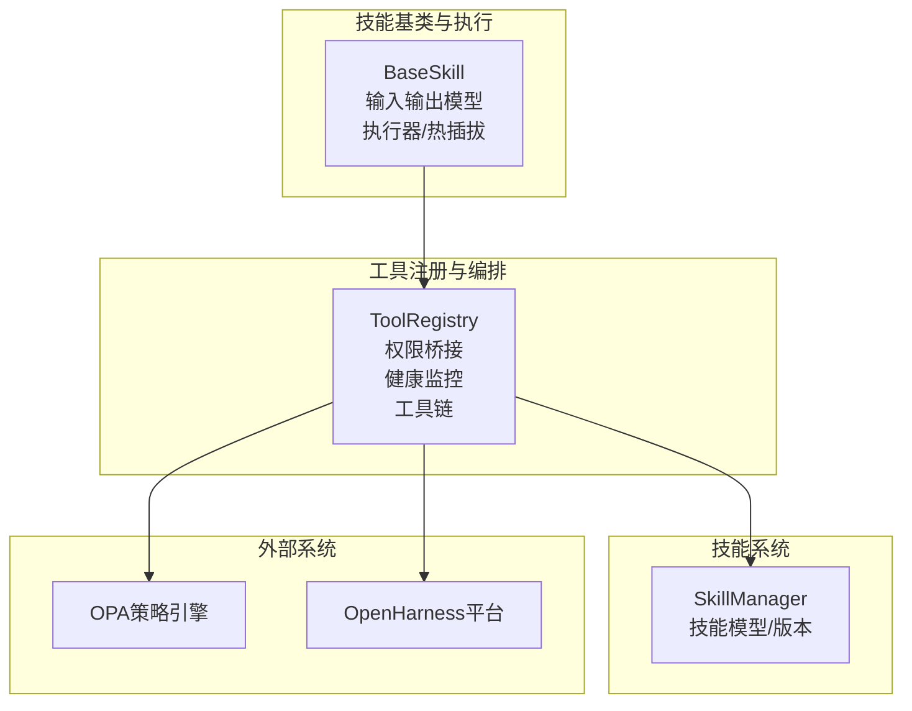
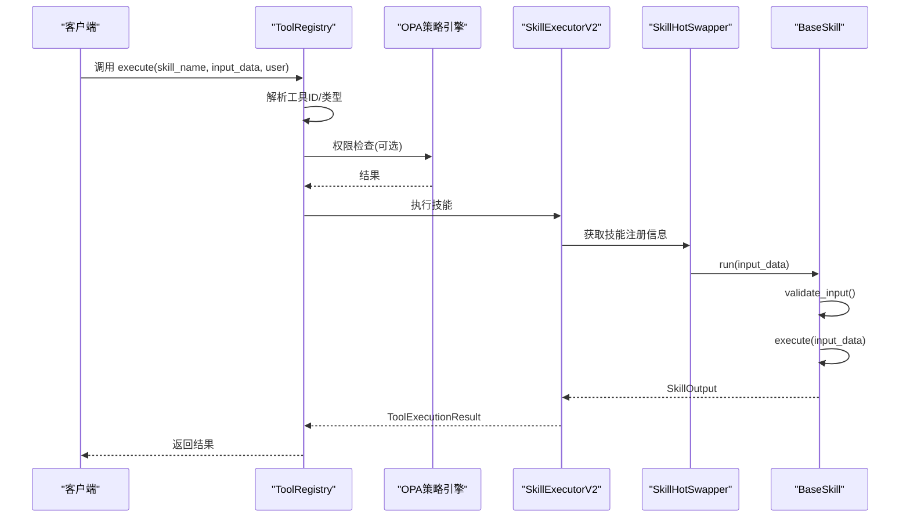
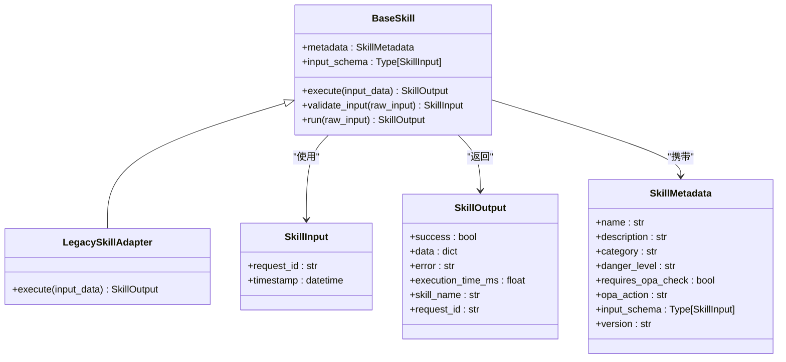
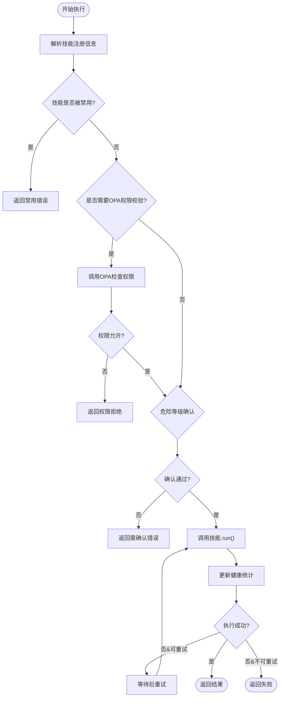
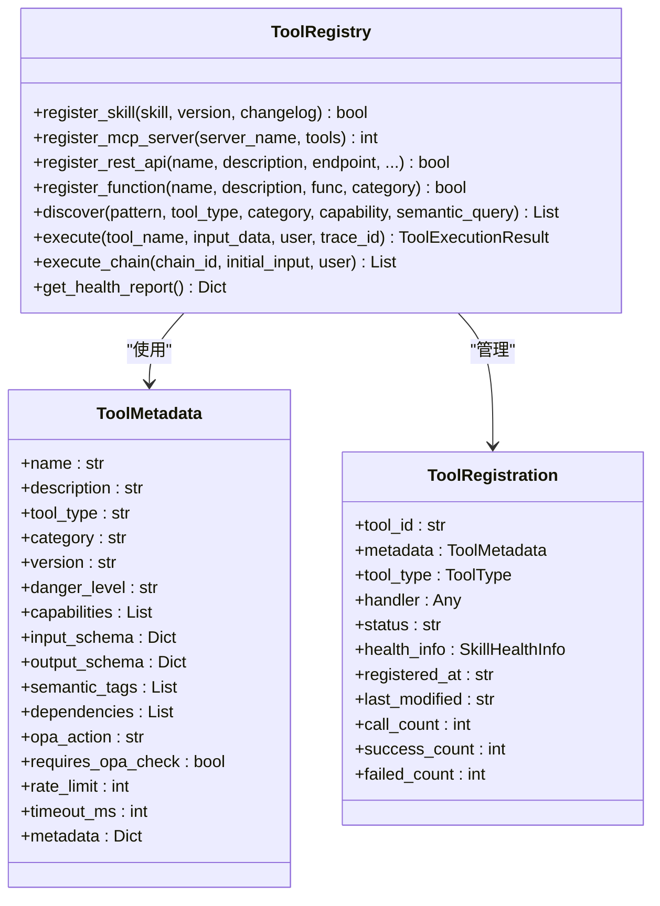
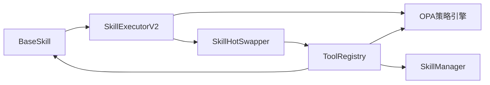

# 技能基类设计

<cite>
**本文档引用的文件**
- [odap/tools/base.py](file://odap/tools/base.py)
- [odap/biz/platform/tool_registry/registry.py](file://odap/biz/platform/tool_registry/registry.py)
- [odap/biz/platform/skill_system/models/skill.py](file://odap/biz/platform/skill_system/models/skill.py)
- [odap/biz/platform/skill_system/models/instance.py](file://odap/biz/platform/skill_system/models/instance.py)
- [odap/biz/platform/skill_system/interfaces/skill_manager.py](file://odap/biz/platform/skill_system/interfaces/skill_manager.py)
- [odap/biz/platform/skill_system/impl/skill_manager.py](file://odap/biz/platform/skill_system/impl/skill_manager.py)
- [openharness/src/openharness/tools/base.py](file://openharness/src/openharness/tools/base.py)
- [docs/02-architecture/ARCHITECTURE_FULL_CHAIN_DEEP.md](file://docs/02-architecture/ARCHITECTURE_FULL_CHAIN_DEEP.md)
- [docs/02-architecture/ARCHITECTURE_FULL_CHAIN.md](file://docs/02-architecture/ARCHITECTURE_FULL_CHAIN.md)
- [docs/00-requirements/req-ok.md](file://docs/00-requirements/req-ok.md)
</cite>

## 目录
1. [简介](#简介)
2. [项目结构](#项目结构)
3. [核心组件](#核心组件)
4. [架构总览](#架构总览)
5. [详细组件分析](#详细组件分析)
6. [依赖分析](#依赖分析)
7. [性能考虑](#性能考虑)
8. [故障排查指南](#故障排查指南)
9. [结论](#结论)
10. [附录](#附录)

## 简介
本文件面向ODAP技能基类系统，系统性阐述BaseSkill抽象基类的设计模式、技能输入输出模型（SkillInput/SkillOutput）、技能元数据（SkillMetadata）结构、技能执行流程、以及技能开发指南。文档同时覆盖技能版本化、热重载、权限校验、健康监控等工程化能力，并提供最佳实践与实现参考。

## 项目结构
ODAP技能系统由三层协作构成：
- 技能基类与执行层：odap/tools/base.py 提供BaseSkill、输入输出模型、执行器与热插拔能力
- 工具注册与编排层：odap/biz/platform/tool_registry/registry.py 提供统一工具注册表、权限桥接、健康监控、工具链编排
- 技能生命周期与版本管理：odap/biz/platform/skill_system/models与interfaces/impl提供技能模型、管理器与版本化能力

**图表来源**
- [odap/tools/base.py:64-161](file://odap/tools/base.py#L64-L161)
- [odap/biz/platform/tool_registry/registry.py:403-425](file://odap/biz/platform/tool_registry/registry.py#L403-L425)
- [odap/biz/platform/skill_system/impl/skill_manager.py:33-40](file://odap/biz/platform/skill_system/impl/skill_manager.py#L33-L40)

**章节来源**
- [odap/tools/base.py:1-120](file://odap/tools/base.py#L1-L120)
- [odap/biz/platform/tool_registry/registry.py:1-60](file://odap/biz/platform/tool_registry/registry.py#L1-L60)

## 核心组件
- BaseSkill抽象基类：定义execute接口、输入校验、统一执行流程run
- 输入输出模型：SkillInput/SkillOutput标准化请求与响应
- 元数据模型：SkillMetadata承载技能描述、分类、危险等级、OPA权限声明、版本等
- 执行器与热插拔：SkillExecutorV2负责权限校验、重试、健康统计；SkillHotSwapper支持版本管理与热加载
- 工具注册表：ToolRegistry统一管理技能、函数、MCP、REST等工具，提供发现、执行、健康监控、权限校验
- 技能管理器：ISkillManager/SkillManager提供技能注册、版本添加、启停、查询等能力

**章节来源**
- [odap/tools/base.py:64-161](file://odap/tools/base.py#L64-L161)
- [odap/tools/base.py:31-58](file://odap/tools/base.py#L31-L58)
- [odap/biz/platform/tool_registry/registry.py:403-425](file://odap/biz/platform/tool_registry/registry.py#L403-L425)
- [odap/biz/platform/skill_system/interfaces/skill_manager.py:8-121](file://odap/biz/platform/skill_system/interfaces/skill_manager.py#L8-L121)
- [odap/biz/platform/skill_system/impl/skill_manager.py:33-120](file://odap/biz/platform/skill_system/impl/skill_manager.py#L33-L120)

## 架构总览
技能执行从ToolRegistry入口进入，经OPA权限校验与健康监控，最终委派给SkillExecutorV2执行BaseSkill的execute方法。执行期间进行输入校验、计时、错误捕获与健康统计。

**图表来源**
- [odap/biz/platform/tool_registry/registry.py:579-662](file://odap/biz/platform/tool_registry/registry.py#L579-L662)
- [odap/tools/base.py:458-566](file://odap/tools/base.py#L458-L566)

**章节来源**
- [odap/biz/platform/tool_registry/registry.py:579-662](file://odap/biz/platform/tool_registry/registry.py#L579-L662)
- [odap/tools/base.py:458-566](file://odap/tools/base.py#L458-L566)

## 详细组件分析

### BaseSkill抽象基类与执行流程
- 设计要点
  - execute为抽象方法，子类必须实现
  - run封装完整执行流程：计时、输入校验、执行、异常捕获与标准化输出
  - validate_input支持自定义输入Schema或回退到SkillInput字段
- 多态与继承
  - 所有技能继承BaseSkill并实现execute，形成统一的多态接口
  - LegacySkillAdapter兼容旧式裸函数，通过适配器实现向后兼容
- 执行流程
  - run内部先validate_input，再调用execute，最后补全缺失的request_id并返回SkillOutput

**图表来源**
- [odap/tools/base.py:64-161](file://odap/tools/base.py#L64-L161)
- [odap/tools/base.py:31-58](file://odap/tools/base.py#L31-L58)

**章节来源**
- [odap/tools/base.py:64-161](file://odap/tools/base.py#L64-L161)

### 技能输入输出模型（SkillInput/SkillOutput）
- SkillInput
  - 标准字段：request_id、timestamp
  - 可扩展：子类可增加业务字段，如区域、深度等
- SkillOutput
  - 标准字段：success、data、error、execution_time_ms、skill_name、request_id
  - 统一性：所有技能输出遵循同一结构，便于上层编排与监控
- 数据转换与序列化
  - 输入通过Pydantic模型校验与转换
  - 输出通过model_json_schema等机制参与API导出

**章节来源**
- [odap/tools/base.py:31-58](file://odap/tools/base.py#L31-L58)

### 技能元数据（SkillMetadata）
- 字段说明
  - name/description：技能标识与描述
  - category：技能分类（intelligence/operations/analysis等）
  - danger_level：危险等级（low/medium/high/critical）
  - requires_opa_check/opa_action：声明式权限校验
  - input_schema：输入Schema类
  - version：技能版本
- 用途
  - 用于工具注册表的分类、能力映射、权限桥接与健康展示

**章节来源**
- [odap/tools/base.py:48-58](file://odap/tools/base.py#L48-L58)

### 技能执行器与热插拔（SkillExecutorV2/SkillHotSwapper）
- SkillExecutorV2
  - 权限校验：当requires_opa_check为真时，调用OPA策略引擎
  - 危险等级确认：对high/critical级别技能进行二次确认
  - 重试机制：内置重试次数与延迟
  - 健康统计：维护总调用次数、成功/失败次数、平均耗时、最近错误
- SkillHotSwapper
  - 版本管理：记录版本、加载时间、变更日志，激活最新版本
  - 状态管理：registered/loading/ready/running/disabled/failed/unloaded
  - 热插拔：支持注册、更新版本、启用/禁用、卸载

**图表来源**
- [odap/tools/base.py:458-566](file://odap/tools/base.py#L458-L566)
- [odap/tools/base.py:362-456](file://odap/tools/base.py#L362-L456)

**章节来源**
- [odap/tools/base.py:458-566](file://odap/tools/base.py#L458-L566)
- [odap/tools/base.py:362-456](file://odap/tools/base.py#L362-L456)

### 工具注册表（ToolRegistry）与权限校验
- 统一管理
  - 支持技能、函数、MCP、REST等多种工具类型
  - 提供discover、execute、execute_chain等能力
- 权限桥接
  - 当工具元数据requires_opa_check为真时，调用OPA策略引擎进行权限检查
- 健康监控
  - 记录调用次数、成功率、平均耗时、最近错误
  - 告警阈值：错误率与平均延迟
- 语义发现
  - 基于名称、描述、标签、能力的多维索引与检索

**图表来源**
- [odap/biz/platform/tool_registry/registry.py:403-425](file://odap/biz/platform/tool_registry/registry.py#L403-L425)
- [odap/biz/platform/tool_registry/registry.py:64-105](file://odap/biz/platform/tool_registry/registry.py#L64-L105)

**章节来源**
- [odap/biz/platform/tool_registry/registry.py:403-425](file://odap/biz/platform/tool_registry/registry.py#L403-L425)
- [odap/biz/platform/tool_registry/registry.py:579-662](file://odap/biz/platform/tool_registry/registry.py#L579-L662)

### 技能生命周期与版本管理（SkillManager）
- 能力范围
  - 注册/查询/更新/删除技能
  - 添加版本、激活/停用技能
  - 与SKILL_CATALOG双向同步
- 分类到类型的映射
  - 将category映射为SkillType（ACTION/QUERY/TRANSFORM/INTEGRATION）

**章节来源**
- [odap/biz/platform/skill_system/interfaces/skill_manager.py:8-121](file://odap/biz/platform/skill_system/interfaces/skill_manager.py#L8-L121)
- [odap/biz/platform/skill_system/impl/skill_manager.py:33-120](file://odap/biz/platform/skill_system/impl/skill_manager.py#L33-L120)

### 技能版本化与热重载
- 版本化
  - 基于语义化版本规则（主/次/补丁）与变更日志自动递增
  - 激活指定版本并同步到OpenHarness
- 热重载
  - 文件系统监听Markdown技能文件变更，合并短时间内的多次变更
  - 支持创建/修改/删除三种变更类型，自动注册或卸载

**章节来源**
- [docs/02-architecture/ARCHITECTURE_FULL_CHAIN_DEEP.md:3838-4026](file://docs/02-architecture/ARCHITECTURE_FULL_CHAIN_DEEP.md#L3838-L4026)

## 依赖分析
- 组件耦合
  - BaseSkill与ToolRegistry解耦：通过ToolRegistry.execute间接调用
  - OPA策略引擎作为可选依赖，通过ToolRegistry桥接
  - SkillExecutorV2依赖SkillHotSwapper进行状态与版本管理
- 外部依赖
  - OpenHarness平台：技能状态同步、工具列表刷新
  - 文件系统：技能热重载监听

**图表来源**
- [odap/tools/base.py:458-566](file://odap/tools/base.py#L458-L566)
- [odap/biz/platform/tool_registry/registry.py:403-425](file://odap/biz/platform/tool_registry/registry.py#L403-L425)
- [odap/biz/platform/skill_system/impl/skill_manager.py:211-225](file://odap/biz/platform/skill_system/impl/skill_manager.py#L211-L225)

**章节来源**
- [odap/tools/base.py:458-566](file://odap/tools/base.py#L458-L566)
- [odap/biz/platform/tool_registry/registry.py:403-425](file://odap/biz/platform/tool_registry/registry.py#L403-L425)

## 性能考虑
- 执行计时与重试
  - run与SkillExecutorV2均包含计时与重试逻辑，降低瞬时失败影响
- 健康监控
  - ToolHealthMonitor记录错误率与平均延迟，及时发现性能退化
- 版本化与热重载
  - 防抖机制减少频繁变更带来的重复加载开销

[本节为通用指导，无需具体文件引用]

## 故障排查指南
- 权限相关
  - 若requires_opa_check为真但未配置OPA，需在ToolRegistry初始化时注入OPA策略管理器
  - 检查opa_action是否正确设置，确保策略引擎可识别动作
- 危险等级确认
  - high/critical级别的技能需管理员或具备确认动作的用户才能执行
- 执行失败
  - 查看ToolExecutionResult.error与SkillOutput.error
  - 检查ToolHealthMonitor告警，定位错误率与延迟异常
- 热重载问题
  - 确认技能文件监听目录与文件扩展名（.md）
  - 检查文件变更是否触发防抖合并

**章节来源**
- [odap/biz/platform/tool_registry/registry.py:761-771](file://odap/biz/platform/tool_registry/registry.py#L761-L771)
- [odap/tools/base.py:567-596](file://odap/tools/base.py#L567-L596)
- [docs/02-architecture/ARCHITECTURE_FULL_CHAIN_DEEP.md:3624-3721](file://docs/02-architecture/ARCHITECTURE_FULL_CHAIN_DEEP.md#L3624-L3721)

## 结论
ODAP技能基类系统通过BaseSkill抽象与标准化输入输出模型，结合ToolRegistry的统一编排、OPA权限桥接与健康监控，形成了可扩展、可观测、可演进的技能生态。版本化与热重载进一步提升了技能的生命周期管理效率。建议在新技能开发中遵循本文档的最佳实践，充分利用元数据声明、输入Schema与执行器特性，确保安全、稳定与高性能。

[本节为总结性内容，无需具体文件引用]

## 附录

### 技能开发指南（从零到一）
- 继承BaseSkill并实现execute
  - 定义输入Schema（可选），继承SkillInput并添加业务字段
  - 在metadata中填写name、description、category、danger_level、requires_opa_check、opa_action、version
  - 实现execute，返回SkillOutput
- 注册与执行
  - 使用ToolRegistry.register_skill注册技能
  - 通过ToolRegistry.execute执行技能，传入用户上下文以启用权限校验
- 错误处理与性能优化
  - 在execute中捕获并格式化异常，保证SkillOutput.success与error字段正确
  - 对耗时操作进行异步化与缓存，合理设置重试与超时
- 版本管理与热重载
  - 使用SkillManager.add_version添加新版本
  - 通过热重载监听机制实现技能文件变更的自动同步

**章节来源**
- [odap/tools/base.py:64-161](file://odap/tools/base.py#L64-L161)
- [odap/biz/platform/tool_registry/registry.py:426-467](file://odap/biz/platform/tool_registry/registry.py#L426-L467)
- [odap/biz/platform/skill_system/impl/skill_manager.py:178-197](file://odap/biz/platform/skill_system/impl/skill_manager.py#L178-L197)
- [docs/02-architecture/ARCHITECTURE_FULL_CHAIN_DEEP.md:3624-3721](file://docs/02-architecture/ARCHITECTURE_FULL_CHAIN_DEEP.md#L3624-L3721)

### API与需求背景
- 关键API
  - 技能列表、创建、更新、启用/禁用、执行、同步等接口见架构文档
- 需求背景
  - 技能注册与发现、配置与生命周期、版本管理等需求明确要求P0优先级

**章节来源**
- [docs/02-architecture/ARCHITECTURE_FULL_CHAIN.md:607-636](file://docs/02-architecture/ARCHITECTURE_FULL_CHAIN.md#L607-L636)
- [docs/00-requirements/req-ok.md:181-224](file://docs/00-requirements/req-ok.md#L181-L224)