# 技能系统管理

<cite>
**本文引用的文件**
- [odap/biz/platform/skill_system/__init__.py](file://odap/biz/platform/skill_system/__init__.py)
- [odap/biz/platform/skill_system/models/skill.py](file://odap/biz/platform/skill_system/models/skill.py)
- [odap/biz/platform/skill_system/services/skill_service.py](file://odap/biz/platform/skill_system/services/skill_service.py)
- [odap/biz/platform/skill_system/impl/skill_manager.py](file://odap/biz/platform/skill_system/impl/skill_manager.py)
- [odap/biz/platform/skill_system/impl/hotplug.py](file://odap/biz/platform/skill_system/impl/hotplug.py)
- [odap/biz/platform/skill_system/services/hotplug_service.py](file://odap/biz/platform/skill_system/services/hotplug_service.py)
- [odap/biz/platform/skill_system/interfaces/skill_manager.py](file://odap/biz/platform/skill_system/interfaces/skill_manager.py)
- [odap/tools/base.py](file://odap/tools/base.py)
- [odap/tools/registry.py](file://odap/tools/registry.py)
- [odap/infra/opa/opa_service.py](file://odap/infra/opa/opa_service.py)
- [odap/infra/monitoring/performance_monitor.py](file://odap/infra/monitoring/performance_monitor.py)
- [docs/02-architecture/ARCHITECTURE_FULL_CHAIN_DEEP.md](file://docs/02-architecture/ARCHITECTURE_FULL_CHAIN_DEEP.md)
- [docs/03-modules/audit_log/DESIGN.md](file://docs/03-modules/audit_log/DESIGN.md)
- [tests/unit/test_skill_system.py](file://tests/unit/test_skill_system.py)
- [openharness/src/openharness/skills/registry.py](file://openharness/src/openharness/skills/registry.py)
</cite>

## 目录
1. [简介](#简介)
2. [项目结构](#项目结构)
3. [核心组件](#核心组件)
4. [架构总览](#架构总览)
5. [详细组件分析](#详细组件分析)
6. [依赖分析](#依赖分析)
7. [性能考量](#性能考量)
8. [故障排查指南](#故障排查指南)
9. [结论](#结论)
10. [附录](#附录)

## 简介
本文件面向ODAP技能系统管理，系统性阐述技能生命周期管理、版本控制、权限管理、分类管理、服务层实现、存储与缓存、监控与审计、运维与扩展等内容。文档以代码为依据，结合架构设计文档与测试用例，帮助开发者与运维人员快速理解并高效使用技能系统。

## 项目结构
技能系统位于odap/biz/platform/skill_system模块，围绕“服务层-管理器-热插拔-模型”分层组织，并与工具注册表、OpenHarness、OPA策略引擎、性能监控等基础设施协同工作。

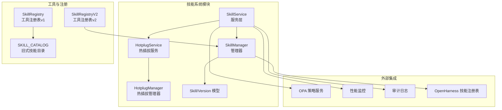

**图表来源**
- [odap/biz/platform/skill_system/services/skill_service.py](file://odap/biz/platform/skill_system/services/skill_service.py)
- [odap/biz/platform/skill_system/impl/skill_manager.py](file://odap/biz/platform/skill_system/impl/skill_manager.py)
- [odap/biz/platform/skill_system/impl/hotplug.py](file://odap/biz/platform/skill_system/impl/hotplug.py)
- [odap/tools/base.py](file://odap/tools/base.py)
- [odap/tools/registry.py](file://odap/tools/registry.py)
- [openharness/src/openharness/skills/registry.py](file://openharness/src/openharness/skills/registry.py)

**章节来源**
- [odap/biz/platform/skill_system/__init__.py](file://odap/biz/platform/skill_system/__init__.py)
- [odap/biz/platform/skill_system/models/skill.py](file://odap/biz/platform/skill_system/models/skill.py)
- [odap/biz/platform/skill_system/services/skill_service.py](file://odap/biz/platform/skill_system/services/skill_service.py)
- [odap/biz/platform/skill_system/impl/skill_manager.py](file://odap/biz/platform/skill_system/impl/skill_manager.py)
- [odap/biz/platform/skill_system/impl/hotplug.py](file://odap/biz/platform/skill_system/impl/hotplug.py)
- [odap/biz/platform/skill_system/services/hotplug_service.py](file://odap/biz/platform/skill_system/services/hotplug_service.py)
- [odap/tools/base.py](file://odap/tools/base.py)
- [odap/tools/registry.py](file://odap/tools/registry.py)
- [openharness/src/openharness/skills/registry.py](file://openharness/src/openharness/skills/registry.py)

## 核心组件
- 服务层：提供对外API，封装管理器与热插拔能力，负责技能注册、查询、更新、删除、版本添加、启停、加载/卸载、目录同步等。
- 管理器：维护技能内存索引、状态、版本、分类与标签；与SKILL_CATALOG双向同步；与OpenHarness状态联动。
- 热插拔：动态导入/重载/卸载技能模块，支持按需加载与模块映射。
- 模型：Skill、SkillVersion、SkillStatus、SkillType等数据结构与枚举。
- 工具注册表：兼容旧式SKILL_CATALOG与新式SkillRegistryV2，统一技能生命周期。
- 权限与安全：通过OPA策略引擎在执行前进行权限校验与高危操作确认。
- 监控与审计：性能监控埋点、审计事件记录与存储、健康状态统计。

**章节来源**
- [odap/biz/platform/skill_system/services/skill_service.py](file://odap/biz/platform/skill_system/services/skill_service.py)
- [odap/biz/platform/skill_system/impl/skill_manager.py](file://odap/biz/platform/skill_system/impl/skill_manager.py)
- [odap/biz/platform/skill_system/impl/hotplug.py](file://odap/biz/platform/skill_system/impl/hotplug.py)
- [odap/biz/platform/skill_system/models/skill.py](file://odap/biz/platform/skill_system/models/skill.py)
- [odap/tools/base.py](file://odap/tools/base.py)
- [odap/tools/registry.py](file://odap/tools/registry.py)
- [odap/infra/opa/opa_service.py](file://odap/infra/opa/opa_service.py)
- [odap/infra/monitoring/performance_monitor.py](file://odap/infra/monitoring/performance_monitor.py)

## 架构总览
技能系统采用“服务-管理-热插拔-模型”的分层架构，配合工具注册表与OpenHarness实现技能的统一注册与状态同步；权限方面通过OPA策略引擎在执行前进行校验；监控与审计贯穿服务层，保障可观测性与合规。

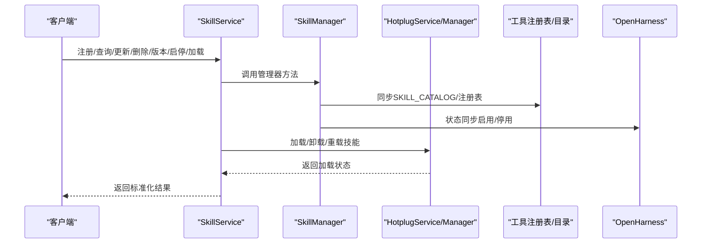

**图表来源**
- [odap/biz/platform/skill_system/services/skill_service.py](file://odap/biz/platform/skill_system/services/skill_service.py)
- [odap/biz/platform/skill_system/impl/skill_manager.py](file://odap/biz/platform/skill_system/impl/skill_manager.py)
- [odap/biz/platform/skill_system/impl/hotplug.py](file://odap/biz/platform/skill_system/impl/hotplug.py)
- [odap/tools/registry.py](file://odap/tools/registry.py)
- [openharness/src/openharness/skills/registry.py](file://openharness/src/openharness/skills/registry.py)

## 详细组件分析

### 服务层：SkillService
- 职责：封装管理器与热插拔服务，提供统一的技能管理API。
- 能力：
  - 注册、查询、按名称查询、更新、删除
  - 列表过滤（类型、状态、分类、名称）
  - 添加版本、激活/停用、加载/卸载、获取目录信息、手动同步目录
- 输出：统一字典结构，包含状态、消息、技能元数据、版本信息等。

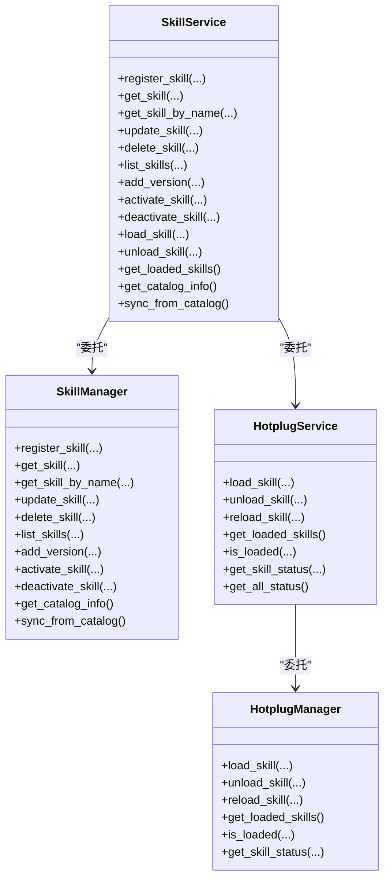

**图表来源**
- [odap/biz/platform/skill_system/services/skill_service.py](file://odap/biz/platform/skill_system/services/skill_service.py)
- [odap/biz/platform/skill_system/impl/skill_manager.py](file://odap/biz/platform/skill_system/impl/skill_manager.py)
- [odap/biz/platform/skill_system/services/hotplug_service.py](file://odap/biz/platform/skill_system/services/hotplug_service.py)
- [odap/biz/platform/skill_system/impl/hotplug.py](file://odap/biz/platform/skill_system/impl/hotplug.py)

**章节来源**
- [odap/biz/platform/skill_system/services/skill_service.py](file://odap/biz/platform/skill_system/services/skill_service.py)

### 管理器：SkillManager
- 职责：维护技能内存索引、状态、版本、分类与标签；与SKILL_CATALOG双向同步；与OpenHarness状态联动。
- 关键能力：
  - 从SKILL_CATALOG自动同步技能
  - 注册新技能并同步到SKILL_CATALOG
  - 更新/删除/列表过滤
  - 添加版本、激活/停用（同步到DomainHarness）
  - 获取目录信息与同步状态

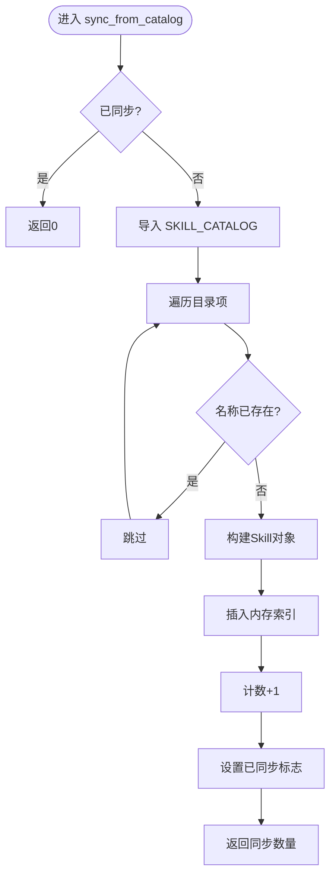

**图表来源**
- [odap/biz/platform/skill_system/impl/skill_manager.py](file://odap/biz/platform/skill_system/impl/skill_manager.py)

**章节来源**
- [odap/biz/platform/skill_system/impl/skill_manager.py](file://odap/biz/platform/skill_system/impl/skill_manager.py)

### 热插拔：HotplugService/HotplugManager
- 职责：动态导入/重载/卸载技能模块，支持模块名映射与状态查询。
- 关键能力：
  - 加载/卸载/重载技能
  - 查询已加载技能、技能状态
  - 注册模块映射

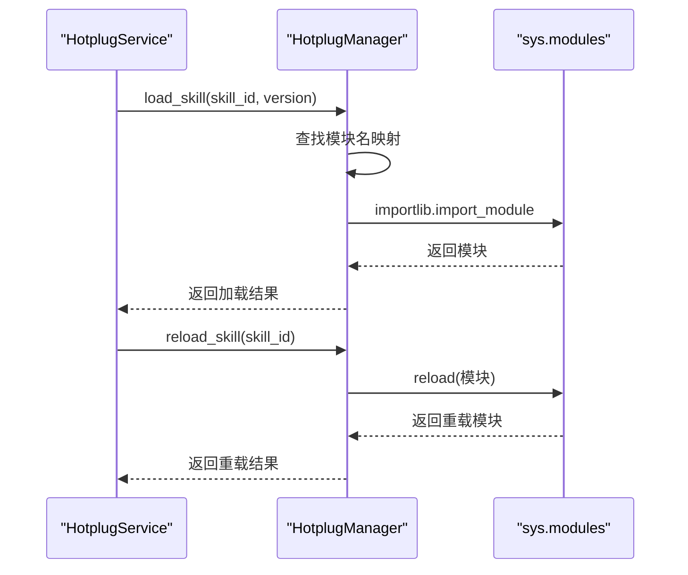

**图表来源**
- [odap/biz/platform/skill_system/services/hotplug_service.py](file://odap/biz/platform/skill_system/services/hotplug_service.py)
- [odap/biz/platform/skill_system/impl/hotplug.py](file://odap/biz/platform/skill_system/impl/hotplug.py)

**章节来源**
- [odap/biz/platform/skill_system/services/hotplug_service.py](file://odap/biz/platform/skill_system/services/hotplug_service.py)
- [odap/biz/platform/skill_system/impl/hotplug.py](file://odap/biz/platform/skill_system/impl/hotplug.py)

### 模型：Skill/Version/枚举
- Skill：包含名称、描述、类型、状态、分类、标签、版本列表、配置、时间戳等。
- SkillVersion：版本号、数据Schema、实现内容、变更日志、创建时间、作者、稳定性标记等。
- 枚举：SkillStatus（草稿/激活/停用/弃用）、SkillType（动作/查询/变换/集成）。

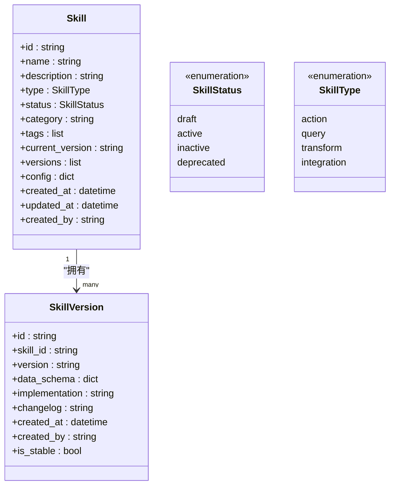

**图表来源**
- [odap/biz/platform/skill_system/models/skill.py](file://odap/biz/platform/skill_system/models/skill.py)

**章节来源**
- [odap/biz/platform/skill_system/models/skill.py](file://odap/biz/platform/skill_system/models/skill.py)

### 工具注册与目录同步
- 兼容两套注册机制：
  - 旧式：SKILL_CATALOG（字典），用于orchestrator调用链
  - 新式：SkillRegistryV2，支持BaseSkill子类注册、热插拔、版本管理、健康监控
- 双向同步：管理器在注册/启停时同步到SKILL_CATALOG，初始化时从SKILL_CATALOG加载。

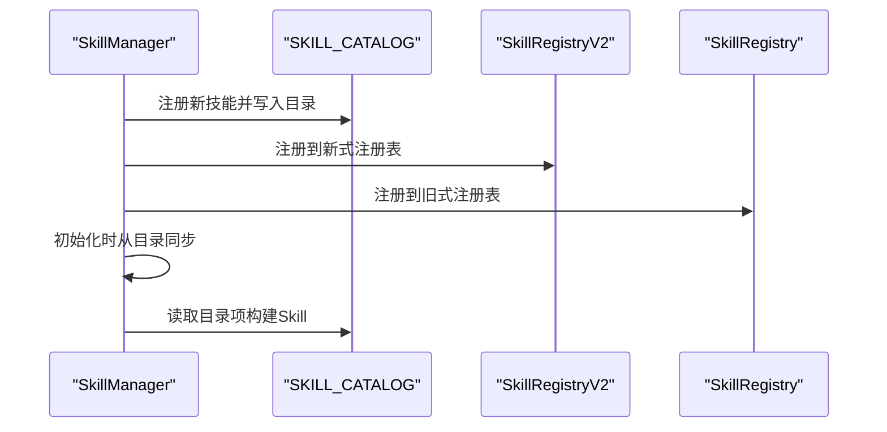

**图表来源**
- [odap/biz/platform/skill_system/impl/skill_manager.py](file://odap/biz/platform/skill_system/impl/skill_manager.py)
- [odap/tools/registry.py](file://odap/tools/registry.py)
- [odap/tools/base.py](file://odap/tools/base.py)

**章节来源**
- [odap/tools/registry.py](file://odap/tools/registry.py)
- [odap/tools/base.py](file://odap/tools/base.py)
- [odap/biz/platform/skill_system/impl/skill_manager.py](file://odap/biz/platform/skill_system/impl/skill_manager.py)

### 权限管理：OPA策略集成
- 在执行前进行权限校验，支持高危操作二次确认。
- 通过OPA策略引擎评估用户角色与动作，必要时记录审计事件。

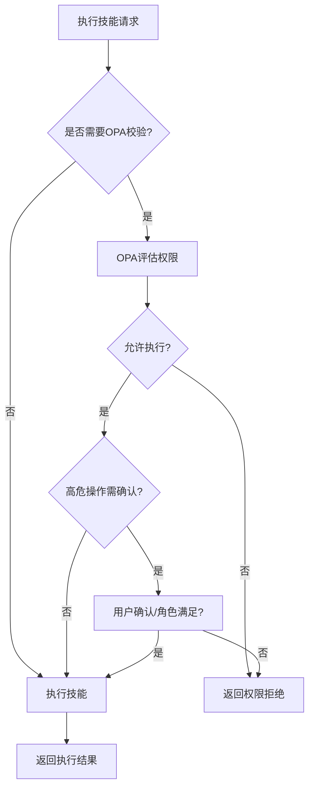

**图表来源**
- [odap/infra/opa/opa_service.py](file://odap/infra/opa/opa_service.py)
- [odap/biz/platform/skill_system/services/skill_service.py](file://odap/biz/platform/skill_system/services/skill_service.py)

**章节来源**
- [odap/infra/opa/opa_service.py](file://odap/infra/opa/opa_service.py)
- [odap/biz/platform/skill_system/services/skill_service.py](file://odap/biz/platform/skill_system/services/skill_service.py)

### 版本控制与灰度发布
- 支持语义化版本生成、内容哈希、变更日志、激活原因等。
- 提供版本激活、回滚、历史查询等能力，支持与OpenHarness同步。

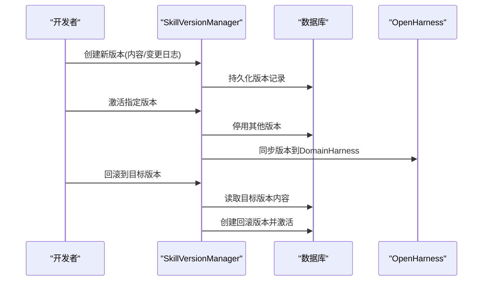

**图表来源**
- [docs/02-architecture/ARCHITECTURE_FULL_CHAIN_DEEP.md](file://docs/02-architecture/ARCHITECTURE_FULL_CHAIN_DEEP.md)

**章节来源**
- [docs/02-architecture/ARCHITECTURE_FULL_CHAIN_DEEP.md](file://docs/02-architecture/ARCHITECTURE_FULL_CHAIN_DEEP.md)

### 分类与标签管理
- 通过category与tags字段实现技能分类与多标签管理。
- 列表接口支持按类型、状态、分类、名称过滤。

**章节来源**
- [odap/biz/platform/skill_system/models/skill.py](file://odap/biz/platform/skill_system/models/skill.py)
- [odap/biz/platform/skill_system/impl/skill_manager.py](file://odap/biz/platform/skill_system/impl/skill_manager.py)
- [odap/biz/platform/skill_system/services/skill_service.py](file://odap/biz/platform/skill_system/services/skill_service.py)

### 存储与缓存
- 内存存储：技能对象、版本列表、状态、目录映射均驻留内存，支持快速查询与更新。
- 缓存策略：通过热插拔模块映射与sys.modules缓存已加载模块，避免重复导入。
- 一致性：管理器与SKILL_CATALOG双向同步，确保目录与内存状态一致；版本管理器持久化版本历史。

**章节来源**
- [odap/biz/platform/skill_system/impl/skill_manager.py](file://odap/biz/platform/skill_system/impl/skill_manager.py)
- [odap/biz/platform/skill_system/impl/hotplug.py](file://odap/biz/platform/skill_system/impl/hotplug.py)
- [docs/02-architecture/ARCHITECTURE_FULL_CHAIN_DEEP.md](file://docs/02-architecture/ARCHITECTURE_FULL_CHAIN_DEEP.md)

### 监控与审计
- 性能监控：提供装饰器与监控器，记录LLM调用、数据库查询、API请求、工具执行等指标。
- 审计日志：定义审计事件表结构与保留策略，支持按严重级别归档与查询。

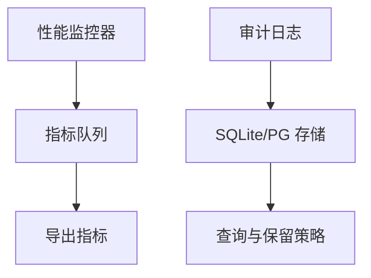

**图表来源**
- [odap/infra/monitoring/performance_monitor.py](file://odap/infra/monitoring/performance_monitor.py)
- [docs/03-modules/audit_log/DESIGN.md](file://docs/03-modules/audit_log/DESIGN.md)

**章节来源**
- [odap/infra/monitoring/performance_monitor.py](file://odap/infra/monitoring/performance_monitor.py)
- [docs/03-modules/audit_log/DESIGN.md](file://docs/03-modules/audit_log/DESIGN.md)

## 依赖分析
- 服务层依赖管理器与热插拔服务，管理器依赖模型与工具注册表，热插拔依赖sys.modules与importlib。
- 权限与监控作为横切关注点注入服务层。
- OpenHarness技能注册表用于状态同步与热加载。

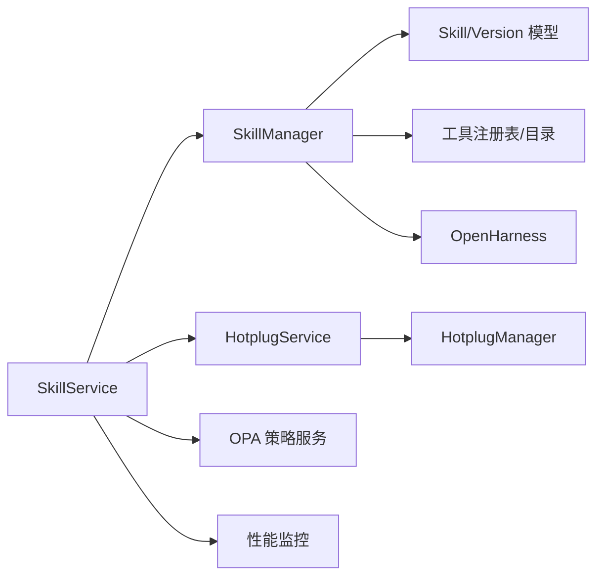

**图表来源**
- [odap/biz/platform/skill_system/services/skill_service.py](file://odap/biz/platform/skill_system/services/skill_service.py)
- [odap/biz/platform/skill_system/impl/skill_manager.py](file://odap/biz/platform/skill_system/impl/skill_manager.py)
- [odap/biz/platform/skill_system/impl/hotplug.py](file://odap/biz/platform/skill_system/impl/hotplug.py)
- [odap/tools/base.py](file://odap/tools/base.py)
- [odap/tools/registry.py](file://odap/tools/registry.py)
- [openharness/src/openharness/skills/registry.py](file://openharness/src/openharness/skills/registry.py)

**章节来源**
- [odap/biz/platform/skill_system/services/skill_service.py](file://odap/biz/platform/skill_system/services/skill_service.py)
- [odap/biz/platform/skill_system/impl/skill_manager.py](file://odap/biz/platform/skill_system/impl/skill_manager.py)
- [odap/biz/platform/skill_system/impl/hotplug.py](file://odap/biz/platform/skill_system/impl/hotplug.py)
- [odap/tools/base.py](file://odap/tools/base.py)
- [odap/tools/registry.py](file://odap/tools/registry.py)
- [openharness/src/openharness/skills/registry.py](file://openharness/src/openharness/skills/registry.py)

## 性能考量
- 热插拔模块缓存：通过sys.modules缓存已加载模块，降低重复导入开销。
- 并发控制：可结合架构文档中的并发控制器进行限流与超时控制，避免资源争用。
- 监控埋点：使用性能监控器记录关键路径耗时，便于定位瓶颈。
- 建议：
  - 对高频技能启用模块缓存与版本复用
  - 合理设置重试次数与超时时间
  - 定期清理未使用技能与历史版本

[本节为通用指导，无需特定文件引用]

## 故障排查指南
- 目录同步问题：检查SKILL_CATALOG是否存在重复名称、导入异常；确认管理器同步逻辑是否执行。
- 热插拔失败：检查模块名映射、模块路径、sys.modules状态；查看日志中的导入/重载异常。
- 权限拒绝：确认OPA策略配置、用户角色与动作映射、高危操作确认流程。
- 性能异常：查看性能监控指标，定位慢调用与高失败率技能；结合审计日志定位异常请求。
- 测试验证：参考单元测试对目录同步、启停状态同步、类型推断等场景进行回归验证。

**章节来源**
- [tests/unit/test_skill_system.py](file://tests/unit/test_skill_system.py)
- [odap/biz/platform/skill_system/impl/skill_manager.py](file://odap/biz/platform/skill_system/impl/skill_manager.py)
- [odap/biz/platform/skill_system/impl/hotplug.py](file://odap/biz/platform/skill_system/impl/hotplug.py)
- [odap/infra/monitoring/performance_monitor.py](file://odap/infra/monitoring/performance_monitor.py)

## 结论
ODAP技能系统通过清晰的服务-管理-热插拔分层，结合工具注册表与OpenHarness的统一管理，实现了技能的全生命周期管理与可观测性。权限与版本控制完善，监控与审计覆盖全面，适合在复杂业务场景中稳定演进与扩展。

[本节为总结性内容，无需特定文件引用]

## 附录

### API与操作一览
- 注册技能：register_skill(name, type, description, category, tags)
- 查询技能：get_skill(skill_id)、get_skill_by_name(name)
- 更新技能：update_skill(skill_id, updates)
- 删除技能：delete_skill(skill_id)
- 列出技能：list_skills(filters, page, page_size)
- 添加版本：add_version(skill_id, version, implementation, schema, changelog)
- 启停技能：activate_skill(skill_id)、deactivate_skill(skill_id)
- 加载/卸载：load_skill(skill_id, version)、unload_skill(skill_id)
- 目录同步：get_catalog_info()、sync_from_catalog()

**章节来源**
- [odap/biz/platform/skill_system/services/skill_service.py](file://odap/biz/platform/skill_system/services/skill_service.py)
- [odap/biz/platform/skill_system/impl/skill_manager.py](file://odap/biz/platform/skill_system/impl/skill_manager.py)
- [odap/biz/platform/skill_system/services/hotplug_service.py](file://odap/biz/platform/skill_system/services/hotplug_service.py)

### 扩展与自定义开发指南
- 新增技能：实现BaseSkill子类，定义metadata与execute，通过SkillRegistryV2注册。
- 自定义分类：在metadata中设置category，管理器会据此推断SkillType。
- 自定义权限：在metadata中开启requires_opa_check并配置opa_action，执行前由OPA校验。
- 自定义版本：通过add_version添加版本，结合版本管理器进行激活/回滚。
- 与OpenHarness集成：管理器在启停时同步状态到DomainHarness，确保UI与运行时一致。

**章节来源**
- [odap/tools/base.py](file://odap/tools/base.py)
- [odap/biz/platform/skill_system/impl/skill_manager.py](file://odap/biz/platform/skill_system/impl/skill_manager.py)
- [docs/02-architecture/ARCHITECTURE_FULL_CHAIN_DEEP.md](file://docs/02-architecture/ARCHITECTURE_FULL_CHAIN_DEEP.md)