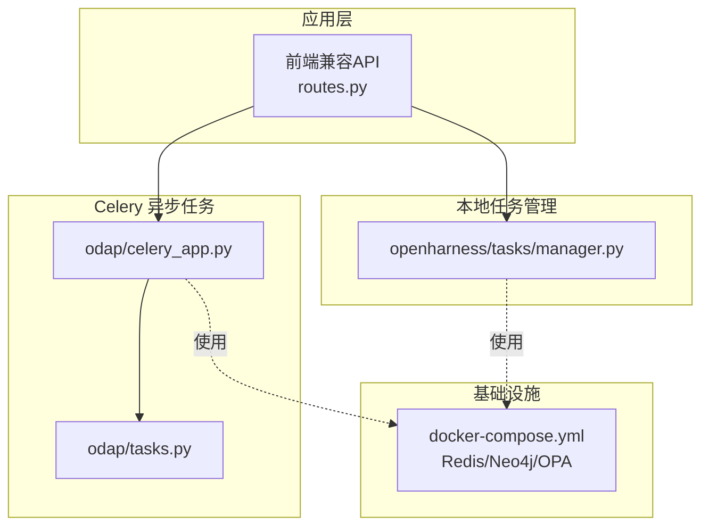
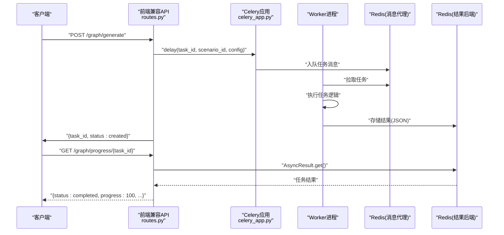
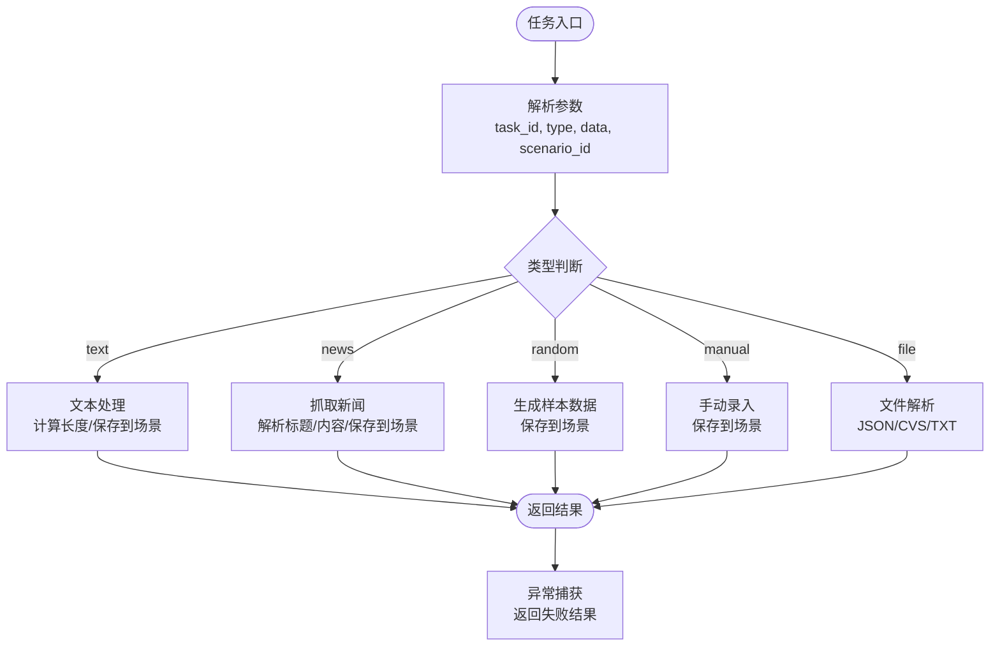
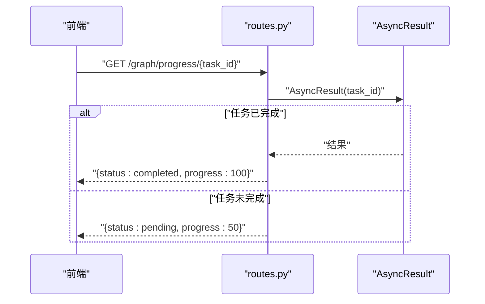
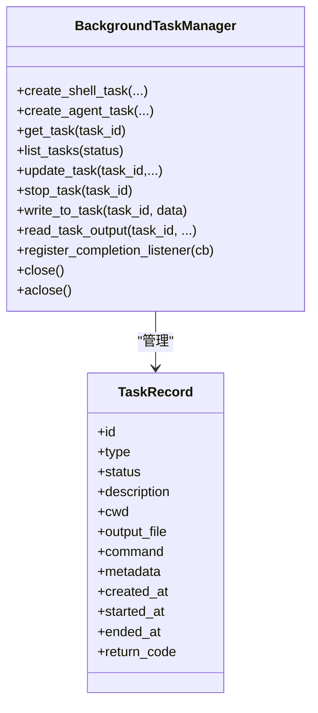
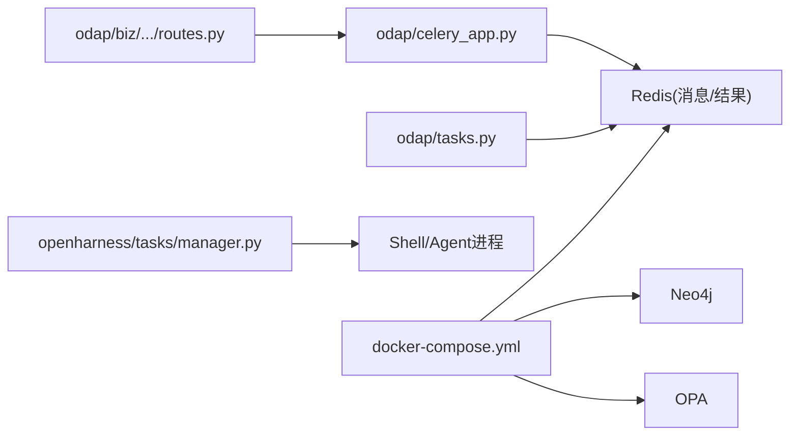

# 异步任务处理

<cite>
**本文引用的文件**
- [odap/celery_app.py](file://odap/celery_app.py)
- [odap/tasks.py](file://odap/tasks.py)
- [odap/biz/integration/frontend_compat/api/routes.py](file://odap/biz/integration/frontend_compat/api/routes.py)
- [odap/tools/task_management/task_management.py](file://odap/tools/task_management/task_management.py)
- [openharness/src/openharness/tasks/manager.py](file://openharness/src/openharness/tasks/manager.py)
- [openharness/tests/test_tasks/test_manager.py](file://openharness/tests/test_tasks/test_manager.py)
- [openharness/tests/test_services/test_cron_scheduler.py](file://openharness/tests/test_services/test_cron_scheduler.py)
- [docs/02-architecture/ARCHITECTURE_FULL_CHAIN_DEEP.md](file://docs/02-architecture/ARCHITECTURE_FULL_CHAIN_DEEP.md)
- [docker/docker-compose.yml](file://docker/docker-compose.yml)
</cite>

## 目录
1. [简介](#简介)
2. [项目结构](#项目结构)
3. [核心组件](#核心组件)
4. [架构总览](#架构总览)
5. [详细组件分析](#详细组件分析)
6. [依赖分析](#依赖分析)
7. [性能考虑](#性能考虑)
8. [故障排查指南](#故障排查指南)
9. [结论](#结论)
10. [附录](#附录)

## 简介
本文件面向 ODAP 异步任务处理系统，围绕 Celery 集成架构、任务定义与执行流程、调度策略、监控与管理、安全机制、开发与优化实践等方面进行全面技术说明。文档以仓库现有实现为依据，结合架构文档与测试用例，帮助读者快速理解并高效使用该系统。

## 项目结构
ODAP 的异步任务处理由两部分组成：
- 基于 Celery 的后台任务：负责数据摄入、图谱生成、文件上传等任务的异步执行与结果存储。
- OpenHarness 的本地任务管理器：负责本地 Shell/Agent 子进程任务的生命周期管理、输出读取、停止与重启等。

**图表来源**
- [odap/celery_app.py:1-29](file://odap/celery_app.py#L1-L29)
- [odap/tasks.py:1-166](file://odap/tasks.py#L1-L166)
- [odap/biz/integration/frontend_compat/api/routes.py:770-822](file://odap/biz/integration/frontend_compat/api/routes.py#L770-L822)
- [openharness/src/openharness/tasks/manager.py:1-416](file://openharness/src/openharness/tasks/manager.py#L1-L416)
- [docker/docker-compose.yml:1-97](file://docker/docker-compose.yml#L1-L97)

**章节来源**
- [odap/celery_app.py:1-29](file://odap/celery_app.py#L1-L29)
- [odap/tasks.py:1-166](file://odap/tasks.py#L1-L166)
- [odap/biz/integration/frontend_compat/api/routes.py:770-822](file://odap/biz/integration/frontend_compat/api/routes.py#L770-L822)
- [openharness/src/openharness/tasks/manager.py:1-416](file://openharness/src/openharness/tasks/manager.py#L1-L416)
- [docker/docker-compose.yml:1-97](file://docker/docker-compose.yml#L1-L97)

## 核心组件
- Celery 应用与配置：定义 broker/backend、序列化、时区等全局配置，并注册任务模块。
- 任务定义：包含数据摄入、图谱生成、文件上传等任务，具备参数校验、异常捕获与结果封装。
- 前端兼容 API：对外暴露任务创建、进度查询、取消等接口，内部委托 Celery 任务执行。
- 本地任务管理器：管理本地 Shell/Agent 子进程任务，支持写入输入、读取输出、停止与重启。
- 任务管理技能：基于图谱的任务预留与查询能力，便于业务侧进行任务编排与治理。
- 架构与队列：基于 Redis 的异步摄取队列，支持优先级、并发控制、超时与取消。
- Docker 编排：统一的服务网络与环境变量，确保 Redis、Neo4j、OPA 等依赖可用。

**章节来源**
- [odap/celery_app.py:1-29](file://odap/celery_app.py#L1-L29)
- [odap/tasks.py:1-166](file://odap/tasks.py#L1-L166)
- [odap/biz/integration/frontend_compat/api/routes.py:770-822](file://odap/biz/integration/frontend_compat/api/routes.py#L770-L822)
- [openharness/src/openharness/tasks/manager.py:1-416](file://openharness/src/openharness/tasks/manager.py#L1-L416)
- [odap/tools/task_management/task_management.py:1-190](file://odap/tools/task_management/task_management.py#L1-L190)
- [docs/02-architecture/ARCHITECTURE_FULL_CHAIN_DEEP.md:1064-1165](file://docs/02-architecture/ARCHITECTURE_FULL_CHAIN_DEEP.md#L1064-L1165)

## 架构总览
下图展示从 API 到 Celery 任务执行、结果存储与前端轮询的整体流程。

**图表来源**
- [odap/biz/integration/frontend_compat/api/routes.py:770-822](file://odap/biz/integration/frontend_compat/api/routes.py#L770-L822)
- [odap/celery_app.py:1-29](file://odap/celery_app.py#L1-L29)
- [odap/tasks.py:102-126](file://odap/tasks.py#L102-L126)

**章节来源**
- [odap/biz/integration/frontend_compat/api/routes.py:770-822](file://odap/biz/integration/frontend_compat/api/routes.py#L770-L822)
- [odap/celery_app.py:1-29](file://odap/celery_app.py#L1-L29)
- [odap/tasks.py:102-126](file://odap/tasks.py#L102-L126)

## 详细组件分析

### Celery 集成与任务定义
- 应用初始化：指定 broker/backend 为 Redis，include 注册任务模块，启用 JSON 序列化。
- 任务类型：
  - 数据摄入任务：根据类型分支处理文本、新闻、随机、手动录入、文件等，支持保存到场景。
  - 图谱生成任务：模拟耗时处理，返回生成实体与关系数量。
  - 文件上传任务：解析 JSON/CVS/TXT，统计关键指标并返回。
- 错误处理：统一捕获异常，返回标准化失败结果，包含错误信息与堆栈。

**图表来源**
- [odap/tasks.py:11-79](file://odap/tasks.py#L11-L79)

**章节来源**
- [odap/celery_app.py:1-29](file://odap/celery_app.py#L1-L29)
- [odap/tasks.py:1-166](file://odap/tasks.py#L1-L166)

### 前端兼容 API 与任务状态
- 任务创建：生成 task_id，调用 Celery 任务 delay，返回创建成功。
- 进度查询：通过 AsyncResult 查询任务是否 ready，ready 则获取结果；否则返回 pending。
- 取消任务：通过 AsyncResult.revoke 终止执行。

**图表来源**
- [odap/biz/integration/frontend_compat/api/routes.py:790-822](file://odap/biz/integration/frontend_compat/api/routes.py#L790-L822)

**章节来源**
- [odap/biz/integration/frontend_compat/api/routes.py:770-822](file://odap/biz/integration/frontend_compat/api/routes.py#L770-L822)

### 本地任务管理器（OpenHarness）
- 能力范围：管理本地 Shell/Agent 子进程，支持创建、写入输入、读取输出、停止、重启、监听完成事件。
- 输出与锁：每个任务独立输出文件与读写锁，避免竞争。
- 重启策略：当子进程断开或不可写时自动重启，保留元数据并记录重启次数。
- 单例管理：提供默认任务管理器单例，路径变化时自动重建。

**图表来源**
- [openharness/src/openharness/tasks/manager.py:50-416](file://openharness/src/openharness/tasks/manager.py#L50-L416)

**章节来源**
- [openharness/src/openharness/tasks/manager.py:1-416](file://openharness/src/openharness/tasks/manager.py#L1-L416)

### 任务管理技能（基于图谱）
- 功能：预留任务、查询预留任务、清空、按ID查询、按状态过滤、取消任务。
- 数据来源：通过图管理器进行任务预留与查询，便于业务侧进行任务编排与治理。

**章节来源**
- [odap/tools/task_management/task_management.py:1-190](file://odap/tools/task_management/task_management.py#L1-L190)

### 摄取队列与异步处理（Redis）
- 队列模型：基于 Redis ZSET 实现优先级队列，Hash 记录任务状态与时间戳。
- 并发与超时：通过信号量控制最大并发，执行时设置超时，超时标记失败并记录。
- 取消与清理：支持取消排队与运行中任务，清理运行记录。

**章节来源**
- [docs/02-architecture/ARCHITECTURE_FULL_CHAIN_DEEP.md:1064-1165](file://docs/02-architecture/ARCHITECTURE_FULL_CHAIN_DEEP.md#L1064-L1165)

### 定时与周期性任务
- Cron 调度：OpenHarness 提供 cron 调度服务测试用例，验证作业触发、失败与超时处理。
- 实践建议：可在 Celery 中引入周期性任务（如定时清理、健康检查），或在应用层使用 cron 服务定期触发任务。

**章节来源**
- [openharness/tests/test_services/test_cron_scheduler.py:113-171](file://openharness/tests/test_services/test_cron_scheduler.py#L113-L171)

## 依赖分析
- Celery 依赖 Redis 作为消息代理与结果后端，容器编排中通过 docker-compose 统一管理。
- 任务执行依赖业务服务（如场景存储、Web 抓取、数据生成等），需确保服务可达与权限正确。
- 本地任务管理器依赖系统 Shell/Agent 运行环境，需配置 API Key 与模型参数。

**图表来源**
- [odap/celery_app.py:1-29](file://odap/celery_app.py#L1-L29)
- [odap/tasks.py:1-166](file://odap/tasks.py#L1-L166)
- [odap/biz/integration/frontend_compat/api/routes.py:770-822](file://odap/biz/integration/frontend_compat/api/routes.py#L770-L822)
- [openharness/src/openharness/tasks/manager.py:1-416](file://openharness/src/openharness/tasks/manager.py#L1-L416)
- [docker/docker-compose.yml:1-97](file://docker/docker-compose.yml#L1-L97)

**章节来源**
- [odap/celery_app.py:1-29](file://odap/celery_app.py#L1-L29)
- [odap/tasks.py:1-166](file://odap/tasks.py#L1-L166)
- [odap/biz/integration/frontend_compat/api/routes.py:770-822](file://odap/biz/integration/frontend_compat/api/routes.py#L770-L822)
- [openharness/src/openharness/tasks/manager.py:1-416](file://openharness/src/openharness/tasks/manager.py#L1-L416)
- [docker/docker-compose.yml:1-97](file://docker/docker-compose.yml#L1-L97)

## 性能考虑
- 序列化与时区：统一使用 JSON 序列化，设置 Asia/Shanghai 时区，避免跨时区问题。
- 并发与超时：摄取队列支持最大并发与单任务超时，防止资源耗尽。
- I/O 与锁：本地任务管理器为每个任务分配独立输出文件与锁，降低竞争与阻塞。
- 资源隔离：Docker 编排中为各服务分配独立容器与卷，便于资源限制与故障隔离。

**章节来源**
- [odap/celery_app.py:19-26](file://odap/celery_app.py#L19-L26)
- [docs/02-architecture/ARCHITECTURE_FULL_CHAIN_DEEP.md:1064-1165](file://docs/02-architecture/ARCHITECTURE_FULL_CHAIN_DEEP.md#L1064-L1165)
- [openharness/src/openharness/tasks/manager.py:1-416](file://openharness/src/openharness/tasks/manager.py#L1-L416)
- [docker/docker-compose.yml:1-97](file://docker/docker-compose.yml#L1-L97)

## 故障排查指南
- 任务未完成或进度停滞
  - 检查 Redis 是否可用与连接字符串是否正确。
  - 查看任务日志与输出文件，确认是否抛出异常。
  - 对于本地任务，确认子进程是否存活，必要时触发重启。
- 任务被取消或超时
  - 摄取队列支持取消与超时处理，检查任务状态与错误记录。
  - 对于 Celery 任务，可通过 revoke 终止执行。
- 本地任务无法写入或断开
  - 管理器会自动重启任务并记录重启次数，检查 API Key、命令与工作目录。
- 单元测试参考
  - 本地任务管理器测试：验证任务创建、停止、重启、监听回调等行为。
  - Cron 调度测试：验证作业触发、失败与超时处理。

**章节来源**
- [openharness/src/openharness/tasks/manager.py:160-179](file://openharness/src/openharness/tasks/manager.py#L160-L179)
- [openharness/tests/test_tasks/test_manager.py](file://openharness/tests/test_tasks/test_manager.py)
- [openharness/tests/test_services/test_cron_scheduler.py:113-171](file://openharness/tests/test_services/test_cron_scheduler.py#L113-L171)

## 结论
ODAP 异步任务处理系统以 Celery 为核心，结合 Redis 实现高可靠的任务队列与结果存储；同时通过 OpenHarness 提供本地任务管理能力，满足多样化执行场景。系统在并发控制、超时保护、错误恢复与可观测性方面具备良好基础，适合在生产环境中进一步扩展周期性任务、增强监控与告警、完善权限与资源限制策略。

## 附录

### 开发与调试要点
- 任务参数与返回值：遵循统一的参数与结果结构，便于前端与监控系统对接。
- 异常处理：捕获异常并返回标准化失败信息，保留错误堆栈以便定位。
- 日志与输出：本地任务管理器将输出写入独立文件，便于离线分析。
- 单元测试：参考本地任务管理器与 Cron 调度测试，确保关键路径覆盖。

**章节来源**
- [odap/tasks.py:72-79](file://odap/tasks.py#L72-L79)
- [openharness/src/openharness/tasks/manager.py:197-204](file://openharness/src/openharness/tasks/manager.py#L197-L204)
- [openharness/tests/test_tasks/test_manager.py](file://openharness/tests/test_tasks/test_manager.py)
- [openharness/tests/test_services/test_cron_scheduler.py:113-171](file://openharness/tests/test_services/test_cron_scheduler.py#L113-L171)