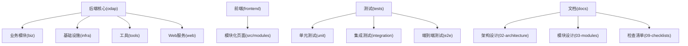
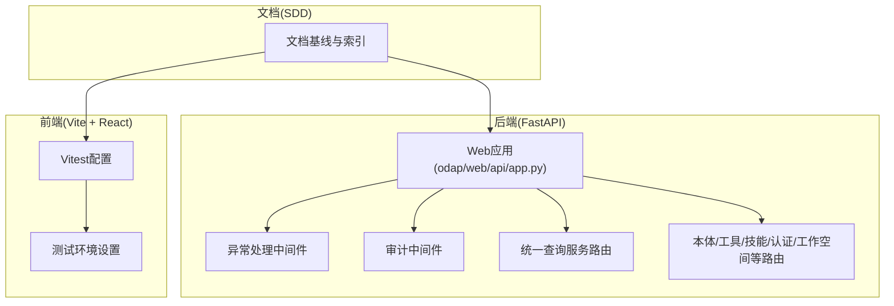
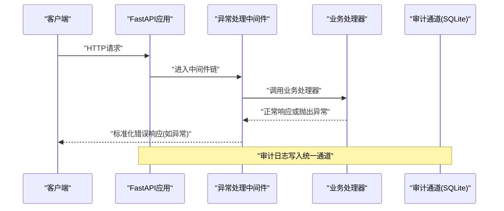
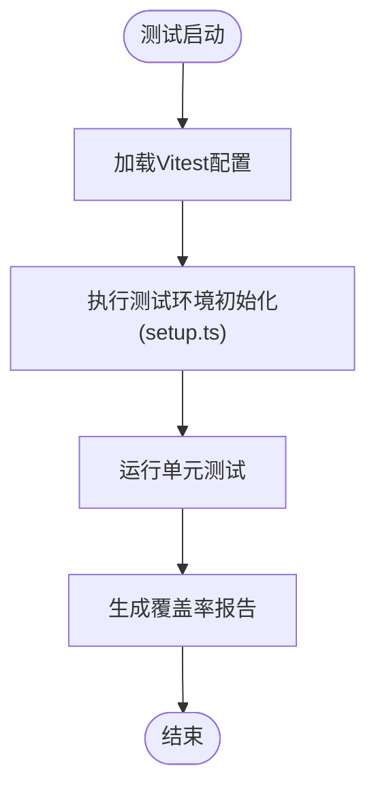
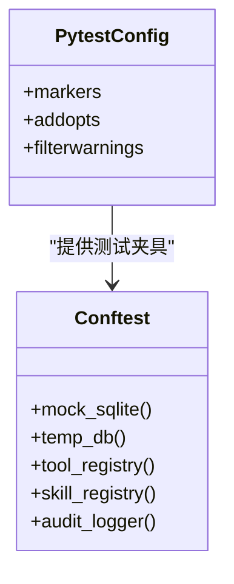
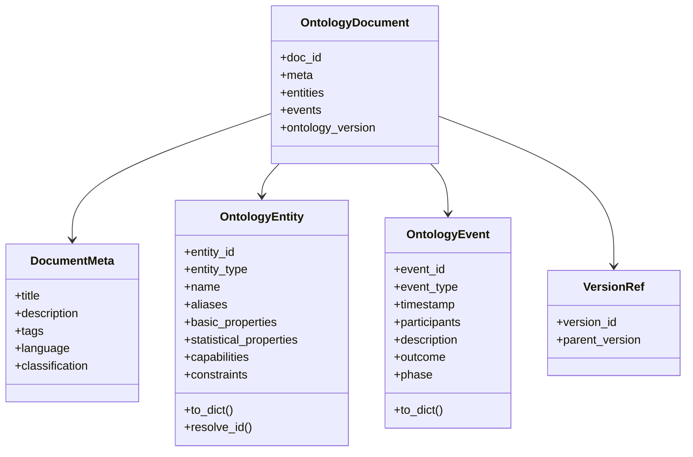
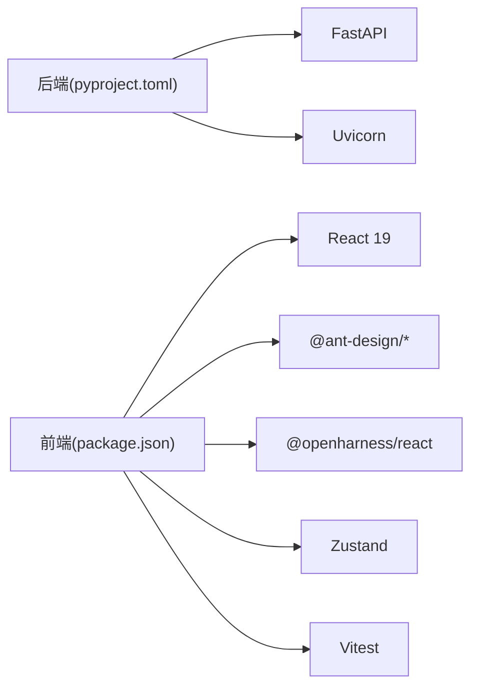
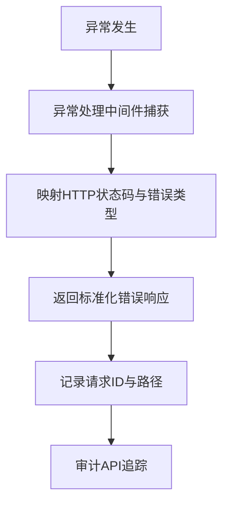

# 代码规范与最佳实践

<cite>
**本文引用的文件**   
- [README.md](file://README.md)
- [pyproject.toml](file://pyproject.toml)
- [frontend/package.json](file://frontend/package.json)
- [frontend/eslint.config.js](file://frontend/eslint.config.js)
- [frontend/vitest.config.ts](file://frontend/vitest.config.ts)
- [frontend/tsconfig.json](file://frontend/tsconfig.json)
- [frontend/src/test/setup.ts](file://frontend/src/test/setup.ts)
- [odap/web/api/app.py](file://odap/web/api/app.py)
- [odap/infra/middleware/exception_handler.py](file://odap/infra/middleware/exception_handler.py)
- [odap/infra/security/audit_api.py](file://odap/infra/security/audit_api.py)
- [tests/conftest.py](file://tests/conftest.py)
- [odap/biz/core/ontology/schema/document.py](file://odap/biz/core/ontology/schema/document.py)
- [docs/DOCUMENT_BASELINE_v1.0.0.md](file://docs/DOCUMENT_BASELINE_v1.0.0.md)
</cite>

## 目录
1. [简介](#简介)
2. [项目结构](#项目结构)
3. [核心组件](#核心组件)
4. [架构总览](#架构总览)
5. [详细组件分析](#详细组件分析)
6. [依赖分析](#依赖分析)
7. [性能考虑](#性能考虑)
8. [故障排查指南](#故障排查指南)
9. [结论](#结论)
10. [附录](#附录)

## 简介
本指南面向ODAP平台的Python后端与TypeScript/React前端团队，结合现有代码库与文档，制定统一的代码规范与最佳实践，覆盖以下方面：
- Python代码规范：PEP8风格、类型注解、异常处理模式
- TypeScript/JavaScript前端规范：命名约定、组件设计模式、状态管理最佳实践
- GraphQL查询规范、API设计原则、错误处理策略
- Git提交消息规范、分支命名约定、代码审查检查清单
- 单元测试编写规范、测试覆盖率要求、Mock使用最佳实践
- 文档注释标准、API文档生成、代码注释规范
- 性能优化建议、内存管理、并发编程最佳实践
- 代码重构指导、技术债务管理、代码质量度量标准

## 项目结构
ODAP采用“多模块分层”的工程化组织方式，后端以odap为核心，前端位于frontend目录，测试位于tests，文档位于docs。整体结构清晰，便于职责分离与独立演进。

**章节来源**
- [README.md: 27-122:27-122](file://README.md#L27-L122)

## 核心组件
- 后端应用入口与路由聚合：odap/web/api/app.py集中注册各领域路由，统一CORS与审计中间件，提供健康检查与场景管理等REST接口。
- 全局异常处理：odap/infra/middleware/exception_handler.py提供统一错误响应格式，区分HTTP状态码与错误类型。
- 审计日志API：odap/infra/security/audit_api.py提供审计事件查询、时间线、追踪与统计接口，支持SQLite通道与统一审计写入。
- 前端测试配置：frontend/vitest.config.ts启用jsdom环境、别名与覆盖率；frontend/src/test/setup.ts提供全局Mock与环境适配。
- Python测试配置：pyproject.toml定义pytest标记与输出格式，tests/conftest.py提供常用fixture。

**章节来源**
- [odap/web/api/app.py: 516-800:516-800](file://odap/web/api/app.py#L516-L800)
- [odap/infra/middleware/exception_handler.py: 14-137:14-137](file://odap/infra/middleware/exception_handler.py#L14-L137)
- [odap/infra/security/audit_api.py: 16-487:16-487](file://odap/infra/security/audit_api.py#L16-L487)
- [frontend/vitest.config.ts: 1-29:1-29](file://frontend/vitest.config.ts#L1-L29)
- [frontend/src/test/setup.ts: 1-32:1-32](file://frontend/src/test/setup.ts#L1-L32)
- [pyproject.toml: 1-17:1-17](file://pyproject.toml#L1-L17)
- [tests/conftest.py: 11-52:11-52](file://tests/conftest.py#L11-L52)

## 架构总览
ODAP后端以FastAPI为核心，通过中间件与路由模块化组织各能力域；前端采用React 19 + TypeScript + Ant Design，使用Vitest进行单元测试与覆盖率统计；文档体系遵循SDD（有序设计文档）方法论，形成可追溯的架构决策与模块设计。

**图表来源**
- [odap/web/api/app.py: 516-800:516-800](file://odap/web/api/app.py#L516-L800)
- [odap/infra/middleware/exception_handler.py: 70-73:70-73](file://odap/infra/middleware/exception_handler.py#L70-L73)
- [frontend/vitest.config.ts: 6-28:6-28](file://frontend/vitest.config.ts#L6-L28)
- [docs/DOCUMENT_BASELINE_v1.0.0.md: 10-38:10-38](file://docs/DOCUMENT_BASELINE_v1.0.0.md#L10-L38)

**章节来源**
- [README.md: 16-26:16-26](file://README.md#L16-L26)
- [docs/DOCUMENT_BASELINE_v1.0.0.md: 10-38:10-38](file://docs/DOCUMENT_BASELINE_v1.0.0.md#L10-L38)

## 详细组件分析

### Python后端：API与异常处理
- 路由组织：统一在odap/web/api/app.py中注册各领域路由，便于集中治理与版本演进。
- 中间件：CORS与审计中间件在应用启动时注入，保障跨域与审计合规。
- 异常处理：全局中间件统一捕获未处理异常，按类型映射HTTP状态码，并记录请求ID与路径，便于问题定位。
- 审计API：提供事件查询、时间线、追踪与统计接口，支持关键字过滤与分页。

**图表来源**
- [odap/web/api/app.py: 516-800:516-800](file://odap/web/api/app.py#L516-L800)
- [odap/infra/middleware/exception_handler.py: 20-67:20-67](file://odap/infra/middleware/exception_handler.py#L20-L67)
- [odap/infra/security/audit_api.py: 120-209:120-209](file://odap/infra/security/audit_api.py#L120-L209)

**章节来源**
- [odap/web/api/app.py: 516-800:516-800](file://odap/web/api/app.py#L516-L800)
- [odap/infra/middleware/exception_handler.py: 14-137:14-137](file://odap/infra/middleware/exception_handler.py#L14-L137)
- [odap/infra/security/audit_api.py: 16-487:16-487](file://odap/infra/security/audit_api.py#L16-L487)

### 前端：测试与配置
- Vitest配置：启用jsdom环境、别名与覆盖率，支持多种报告器输出。
- 测试环境：setup.ts提供fetch、matchMedia、ResizeObserver等全局Mock，以及API基础地址Mock，确保测试稳定性。
- ESLint配置：基于TypeScript ESLint推荐规则，集成React Hooks与React Refresh插件，统一前端代码风格。

**图表来源**
- [frontend/vitest.config.ts: 17-27:17-27](file://frontend/vitest.config.ts#L17-L27)
- [frontend/src/test/setup.ts: 5-31:5-31](file://frontend/src/test/setup.ts#L5-L31)
- [frontend/eslint.config.js: 8-23:8-23](file://frontend/eslint.config.js#L8-L23)

**章节来源**
- [frontend/vitest.config.ts: 1-29:1-29](file://frontend/vitest.config.ts#L1-L29)
- [frontend/src/test/setup.ts: 1-32:1-32](file://frontend/src/test/setup.ts#L1-L32)
- [frontend/eslint.config.js: 1-24:1-24](file://frontend/eslint.config.js#L1-L24)

### Python测试：Fixture与Mock
- 常用Fixture：提供SQLite连接Mock、临时数据库、工具注册表、技能注册表与审计日志器等，减少外部依赖对测试的影响。
- 测试标记：pytest配置中定义unit、integration、slow、e2e等标记，便于分层执行与CI流水线编排。

**图表来源**
- [pyproject.toml: 4-13:4-13](file://pyproject.toml#L4-L13)
- [tests/conftest.py: 11-52:11-52](file://tests/conftest.py#L11-L52)

**章节来源**
- [pyproject.toml: 1-17:1-17](file://pyproject.toml#L1-L17)
- [tests/conftest.py: 11-52:11-52](file://tests/conftest.py#L11-L52)

### 本体文档模型：类型与结构
- 统一本体文档格式：定义实体、关系、事件、行动、规则、约束等核心数据结构，支持确定性实体ID生成与版本引用。
- 枚举与元数据：DocType、SourceType、EntityType、ActionStatus等枚举统一语义，DocumentMeta提供标题、描述、标签、语言等元信息。

**图表来源**
- [odap/biz/core/ontology/schema/document.py: 77-200:77-200](file://odap/biz/core/ontology/schema/document.py#L77-L200)

**章节来源**
- [odap/biz/core/ontology/schema/document.py: 1-200:1-200](file://odap/biz/core/ontology/schema/document.py#L1-L200)

## 依赖分析
- 后端依赖：FastAPI、uvicorn、CORS中间件、审计中间件、各领域路由模块。
- 前端依赖：React 19、Ant Design、@openharness/react、@ant-design/graphs、@antv/g6、Leaflet、Zustand等。
- 测试依赖：Vitest、jsdom、@testing-library、ESLint与TypeScript ESLint。

**图表来源**
- [pyproject.toml: 1-17:1-17](file://pyproject.toml#L1-L17)
- [frontend/package.json: 15-53:15-53](file://frontend/package.json#L15-L53)

**章节来源**
- [pyproject.toml: 1-17:1-17](file://pyproject.toml#L1-L17)
- [frontend/package.json: 1-55:1-55](file://frontend/package.json#L1-L55)

## 性能考虑
- 异步与并发：后端大量使用异步任务与线程池处理耗时操作（如新闻摄入），避免阻塞主请求线程。
- 中间件开销：CORS与审计中间件应保持轻量，避免对高频接口造成延迟。
- 前端渲染：合理拆分组件与懒加载，减少首屏体积；使用Zustand进行局部状态管理，避免全局重渲染。
- 测试性能：Vitest默认jsdom环境，建议在单测中使用Mock替代真实网络与DOM副作用，提升执行速度。

**章节来源**
- [odap/web/api/app.py: 683-702:683-702](file://odap/web/api/app.py#L683-L702)
- [frontend/vitest.config.ts: 17-27:17-27](file://frontend/vitest.config.ts#L17-L27)

## 故障排查指南
- 统一错误响应：全局异常中间件将未捕获异常转换为标准化JSON响应，包含错误类型、消息、请求ID与路径，便于快速定位。
- 审计追踪：通过审计API的时间线与追踪接口，结合trace_id串联一次请求的完整链路。
- 日志与告警：后端应用记录关键日志，前端测试环境提供Mock与断言，便于回归与问题复现。

**图表来源**
- [odap/infra/middleware/exception_handler.py: 29-67:29-67](file://odap/infra/middleware/exception_handler.py#L29-L67)
- [odap/infra/security/audit_api.py: 269-292:269-292](file://odap/infra/security/audit_api.py#L269-L292)

**章节来源**
- [odap/infra/middleware/exception_handler.py: 14-137:14-137](file://odap/infra/middleware/exception_handler.py#L14-L137)
- [odap/infra/security/audit_api.py: 16-487:16-487](file://odap/infra/security/audit_api.py#L16-L487)

## 结论
本指南基于ODAP现有代码与文档，提出了覆盖后端、前端、测试与文档的统一规范与最佳实践。建议在团队内推广并持续演进，结合CI/CD与文档基线，确保代码质量与可维护性。

## 附录

### Python代码规范（PEP8、类型注解、异常处理）
- 风格与格式：遵循PEP8，使用类型注解明确参数与返回值；长函数拆分、清晰命名。
- 异常处理：优先使用具体异常类型，避免裸except；全局中间件统一错误响应格式。
- 日志与审计：关键路径记录结构化日志，配合审计通道与追踪ID。

**章节来源**
- [odap/infra/middleware/exception_handler.py: 14-137:14-137](file://odap/infra/middleware/exception_handler.py#L14-L137)

### TypeScript/JavaScript前端规范（命名、组件、状态）
- 命名约定：文件与组件采用帕斯卡命名，hooks使用use前缀，常量全大写。
- 组件设计：高内聚低耦合，Props最小化；使用React 19特性提升性能。
- 状态管理：Zustand用于轻量状态，避免过度全局化；复杂场景考虑Context或状态机。

**章节来源**
- [frontend/package.json: 15-53:15-53](file://frontend/package.json#L15-L53)
- [frontend/vitest.config.ts: 1-29:1-29](file://frontend/vitest.config.ts#L1-L29)

### GraphQL查询规范与API设计
- 查询规范：字段选择最小化、分页与过滤参数规范化；避免N+1查询。
- API设计：REST与GraphQL互补，后端提供统一查询服务路由，前端按需封装查询。
- 错误处理：统一错误响应格式，区分业务错误与系统错误，提供错误码与详情。

**章节来源**
- [odap/web/api/app.py: 516-800:516-800](file://odap/web/api/app.py#L516-L800)

### Git提交与分支规范、代码审查清单
- 提交消息：采用“类型: 主题”格式，简明描述变更意图与影响范围。
- 分支命名：feature/xxx、fix/xxx、docs/xxx、refactor/xxx等，保持语义清晰。
- 代码审查：关注安全性、性能、可测试性与可维护性；确保新增/修改逻辑有测试覆盖。

[本节为通用实践建议，不直接分析具体文件]

### 单元测试规范、覆盖率与Mock
- 编写规范：每个模块至少覆盖核心逻辑；使用Mock替代外部依赖。
- 覆盖率：建议功能模块覆盖率≥80%，关键路径≥90%。
- 前端测试：Vitest + jsdom，使用@testing-library进行交互测试；配置覆盖率报告。

**章节来源**
- [tests/conftest.py: 11-52:11-52](file://tests/conftest.py#L11-L52)
- [frontend/vitest.config.ts: 17-27:17-27](file://frontend/vitest.config.ts#L17-L27)

### 文档注释与API文档生成
- 文档基线：遵循SDD方法论，核心文档添加元数据，定期更新与校验。
- API文档：后端使用FastAPI自动文档；前端使用TypeDoc或类似工具生成API参考。
- 代码注释：函数与类提供简要说明，复杂逻辑补充注释与示例路径。

**章节来源**
- [docs/DOCUMENT_BASELINE_v1.0.0.md: 10-38:10-38](file://docs/DOCUMENT_BASELINE_v1.0.0.md#L10-L38)

### 性能优化、内存管理与并发
- 后端：异步I/O与线程池分离CPU密集型任务；缓存热点数据；数据库查询优化。
- 前端：组件懒加载、虚拟滚动、图片与资源压缩；避免频繁重渲染。
- 并发：合理使用async/await与线程池；避免死锁与竞态条件。

**章节来源**
- [odap/web/api/app.py: 683-702:683-702](file://odap/web/api/app.py#L683-L702)

### 重构指导、技术债务与质量度量
- 重构原则：小步快跑、持续集成；先加测试再改代码。
- 技术债务：建立债务清单与偿还计划；定期评估与清理。
- 质量度量：代码覆盖率、圈复杂度、重复率、文档完整性与一致性。

[本节为通用实践建议，不直接分析具体文件]