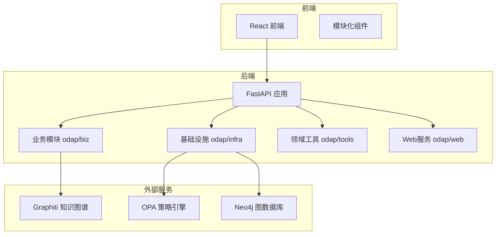
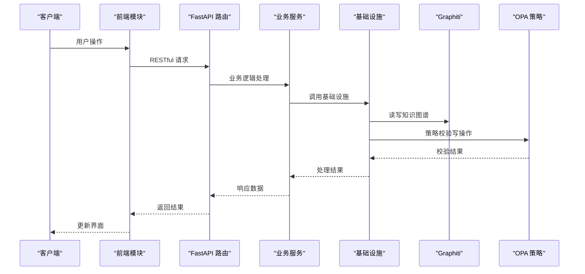
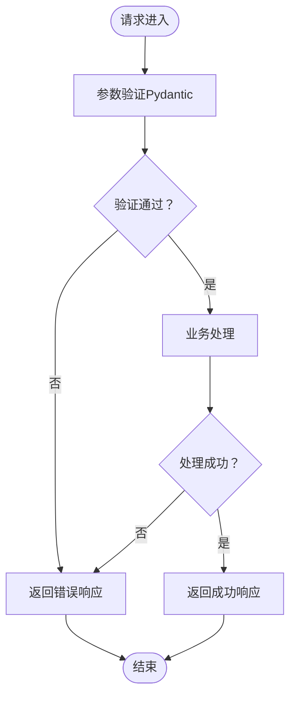
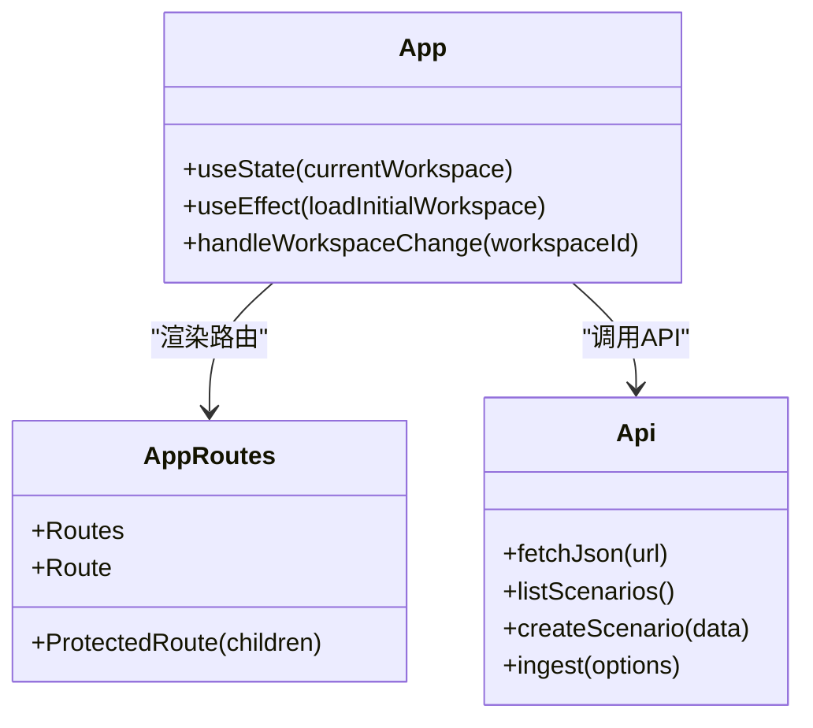
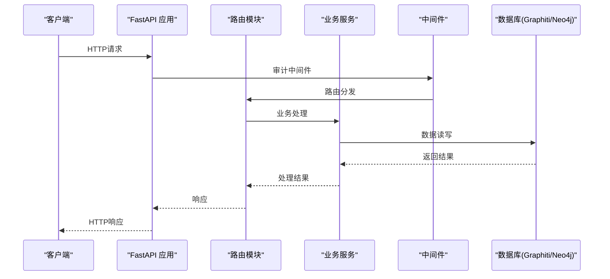
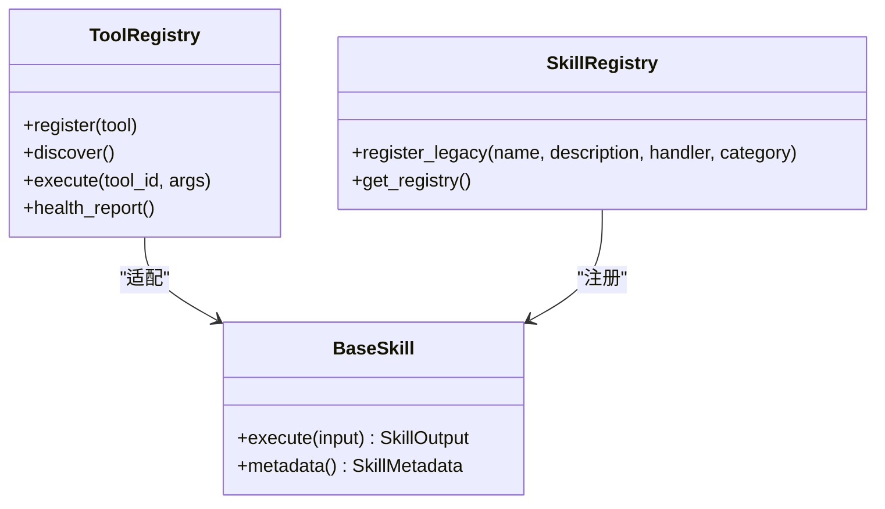
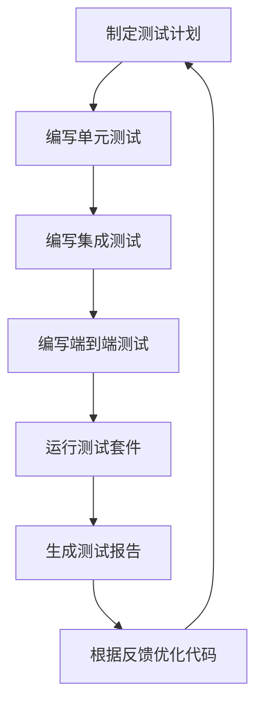
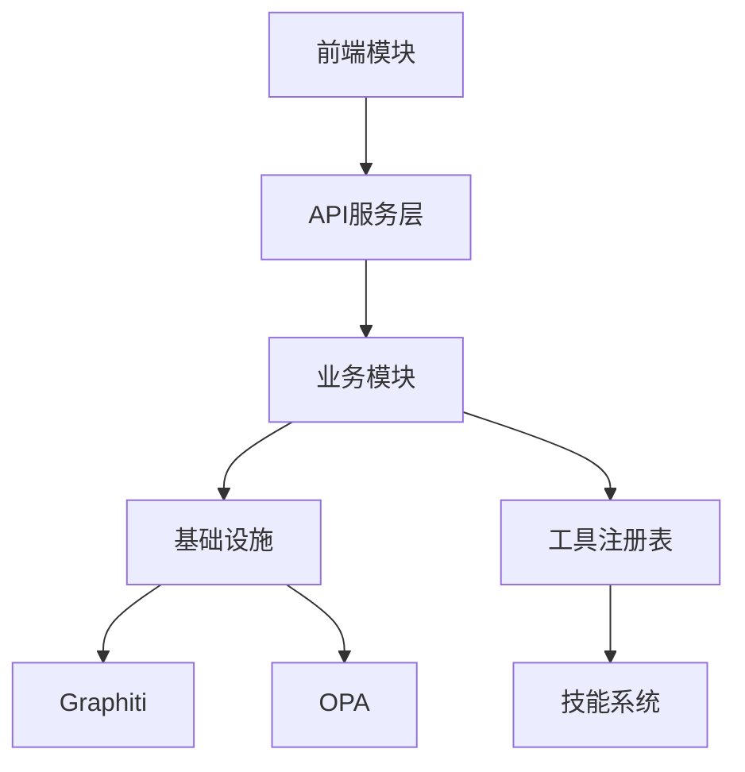

# 功能开发指南

<cite>
**本文档引用的文件**
- [README.md](file://README.md)
- [ARCHITECTURE.md](file://docs/02-architecture/ARCHITECTURE.md)
- [BACKEND_API_DESIGN.md](file://docs/10-api/BACKEND_API_DESIGN.md)
- [FRONTEND_COMPONENT_DESIGN.md](file://docs/04-ui/FRONTEND_COMPONENT_DESIGN.md)
- [App.tsx](file://frontend/src/App.tsx)
- [AppRoutes.tsx](file://frontend/src/AppRoutes.tsx)
- [api.ts](file://frontend/src/modules/shared/services/api.ts)
- [app.py](file://odap/web/api/app.py)
- [README.md](file://tests/README.md)
- [test_military_e2e_flow.py](file://tests/e2e/test_military_e2e_flow.py)
- [test_v2_integration.py](file://tests/integration/test_v2_integration.py)
- [registry.py](file://odap/tools/registry.py)
- [__init__.py](file://odap/biz/platform/tool_registry/__init__.py)
- [docs-design-adr-full-implementation-plan.md](file://.trae/documents/docs-design-adr-full-implementation-plan.md)
</cite>

## 目录
1. [简介](#简介)
2. [项目结构](#项目结构)
3. [核心组件](#核心组件)
4. [架构概览](#架构概览)
5. [详细组件分析](#详细组件分析)
6. [依赖分析](#依赖分析)
7. [性能考虑](#性能考虑)
8. [故障排除指南](#故障排除指南)
9. [结论](#结论)
10. [附录](#附录)

## 简介
本指南面向ODAP平台的新功能开发，提供从需求分析到实现交付的完整流程规范，涵盖模块化开发原则、API接口设计、前端组件开发、后端服务开发、工具与技能系统扩展、以及测试驱动开发（TDD）的实践方法。ODAP是一个本体驱动的分析决策平台，采用分层架构：基础设施层（OpenHarness、Graphiti、OPA）、领域工具层（Python Skills）、业务层（Agent协同、本体管理、工作空间）、接口层（前端界面、API端点）。平台通过工作空间实现多场景隔离，支持任意领域的本体建模与分析决策。

## 项目结构
ODAP项目采用模块化分层结构，核心目录与职责如下：
- odap：核心平台代码，按领域分层组织
  - biz：业务模块（core、decision、integration、platform、simulation、management）
  - infra：基础设施（query、graph、openharness、opa、security、storage、utils、llm、monitoring、resilience）
  - tools：领域工具（intelligence、operations、planning、analysis、recommendation、task_management、visualization）
  - web：Web服务（FastAPI应用入口与路由）
- frontend：React前端项目，按模块组织（agent、audit、business、config、ingest、knowledge、ontology、qa、roles、shared、system、version、workspace）
- openharness：OpenHarness子模块（Git submodule）
- tests：测试（unit、integration、e2e）
- docs：架构与设计文档（12个分类目录）

**图表来源**
- [README.md:27-122](file://README.md#L27-L122)
- [ARCHITECTURE.md:392-446](file://docs/02-architecture/ARCHITECTURE.md#L392-L446)

**章节来源**
- [README.md:27-122](file://README.md#L27-L122)

## 核心组件
- 基础设施层：OpenHarness Agent基础设施、Graphiti双时态知识图谱、OPA策略治理、审计日志
- 领域工具层：Python Skills领域工具，通过工具注册表统一管理
- 业务层：Agent协同（Swarm + OODA）、本体管理（OMS + Schema + 摄入管道）、工作空间管理、角色权限
- 接口层：前端界面（React + Ant Design）、API端点（FastAPI路由）

**章节来源**
- [ARCHITECTURE.md:448-456](file://docs/02-architecture/ARCHITECTURE.md#L448-L456)

## 架构概览
ODAP采用四层架构，强调“本体为核心”的语义层设计与“Query First”原则。统一查询服务（QueryService）抽象了Schema、Entity、Topo、Temporal四种查询源，Agent默认只读，写操作通过OPA策略校验与Hook系统保护。前端通过模块化组件与状态管理（Zustand）实现交互，后端通过FastAPI路由模块化组织API。

**图表来源**
- [ARCHITECTURE.md:480-555](file://docs/02-architecture/ARCHITECTURE.md#L480-L555)
- [BACKEND_API_DESIGN.md:14-29](file://docs/10-api/BACKEND_API_DESIGN.md#L14-L29)

**章节来源**
- [ARCHITECTURE.md:457-588](file://docs/02-architecture/ARCHITECTURE.md#L457-L588)

## 详细组件分析

### 需求分析与技术设计流程
- 需求收集：基于模块设计文档与产品设计文档，明确功能边界与优先级
- 技术设计：确定模块归属（biz/infra/tools/web），评估与现有模块的耦合关系
- 架构评估：遵循“Query First”原则，避免绕过统一查询服务；确认Agent安全默认策略
- 实现计划：制定迭代计划，明确前后端接口契约与测试策略

**章节来源**
- [README.md:108-122](file://README.md#L108-L122)
- [ARCHITECTURE.md:556-562](file://docs/02-architecture/ARCHITECTURE.md#L556-L562)

### 模块化开发原则与目录规范
- odap/biz/core：核心业务逻辑，按领域划分（ontology、cognition、agent）
- odap/biz/platform：平台能力（workspace、roles、skill_system、tool_registry、session_memory）
- odap/biz/simulation：仿真与反馈（event_simulator、simulation_sandbox、feedback、simulation_deduction）
- odap/infra：基础设施（query、graph、openharness、opa、security、storage、utils、llm、monitoring、resilience）
- odap/tools：领域工具（intelligence、operations、planning、analysis、recommendation、task_management、visualization）
- frontend/src/modules：前端模块化开发，按功能域组织（agent、audit、business、config、ingest、knowledge、ontology、qa、roles、shared、system、version、workspace）

**章节来源**
- [README.md:31-107](file://README.md#L31-L107)

### API接口设计规范
- RESTful设计：统一前缀与命名，使用HTTP方法语义化标识资源操作
- 参数验证：使用Pydantic模型进行请求体与查询参数验证
- 响应格式：成功响应包含data与message字段；分页响应包含page、page_size、total、has_more；错误响应包含error.code、error.message、error.details与request_id
- 错误码定义：参考后端API设计文档中的错误响应格式与已知问题，建立统一的错误码体系

**图表来源**
- [BACKEND_API_DESIGN.md:31-62](file://docs/10-api/BACKEND_API_DESIGN.md#L31-L62)

**章节来源**
- [BACKEND_API_DESIGN.md:14-617](file://docs/10-api/BACKEND_API_DESIGN.md#L14-L617)

### 前端组件开发模式
- React组件设计：采用函数式组件与Hooks，组件按功能域拆分，避免单文件过大
- 状态管理：局部状态使用useState，全局状态使用Zustand Store，保持一致性
- 路由配置：通过React Router配置模块化路由，支持受保护路由与登录路由
- 国际化支持：通过共享模块的locales目录组织多语言资源

**图表来源**
- [App.tsx:8-54](file://frontend/src/App.tsx#L8-L54)
- [AppRoutes.tsx:19-58](file://frontend/src/AppRoutes.tsx#L19-L58)
- [api.ts:77-200](file://frontend/src/modules/shared/services/api.ts#L77-L200)

**章节来源**
- [FRONTEND_COMPONENT_DESIGN.md:26-682](file://docs/04-ui/FRONTEND_COMPONENT_DESIGN.md#L26-L682)
- [App.tsx:1-65](file://frontend/src/App.tsx#L1-L65)
- [AppRoutes.tsx:1-61](file://frontend/src/AppRoutes.tsx#L1-L61)
- [api.ts:1-200](file://frontend/src/modules/shared/services/api.ts#L1-L200)

### 后端服务开发流程
- FastAPI路由设计：按模块注册路由，统一CORS与中间件配置
- 数据库操作：通过基础设施层服务访问Graphiti与Neo4j，遵循工作空间隔离策略
- 中间件使用：审计中间件记录请求与响应，确保合规性
- 异常处理：统一异常捕获与错误响应格式，保证API稳定性

**图表来源**
- [app.py:516-540](file://odap/web/api/app.py#L516-L540)
- [app.py:303-480](file://odap/web/api/app.py#L303-L480)

**章节来源**
- [app.py:1-862](file://odap/web/api/app.py#L1-L862)

### 工具与技能系统扩展
- 工具注册表：通过ToolRegistry统一管理工具与工具链，支持健康监控与语义发现
- 技能加载机制：支持BaseSkill子类注册与LegacySkillAdapter兼容，实现向后兼容
- 插件开发规范：遵循工具接口契约，提供输入输出模型与元数据描述

**图表来源**
- [__init__.py:6-19](file://odap/biz/platform/tool_registry/__init__.py#L6-L19)
- [registry.py:26-38](file://odap/tools/registry.py#L26-L38)

**章节来源**
- [__init__.py:1-34](file://odap/biz/platform/tool_registry/__init__.py#L1-L34)
- [registry.py:1-53](file://odap/tools/registry.py#L1-L53)

### 测试驱动开发（TDD）实践
- 单元测试：针对核心服务与工具进行单元测试，确保功能正确性
- 集成测试：覆盖模块间协作与外部服务集成（如Graphiti、OPA）
- 端到端测试：模拟完整业务流程，验证从前端到后端的端到端链路
- 测试文件管理：按功能域组织测试文件，使用pytest与测试数据库

**图表来源**
- [tests/README.md:18-134](file://tests/README.md#L18-L134)
- [test_military_e2e_flow.py:39-43](file://tests/e2e/test_military_e2e_flow.py#L39-L43)
- [test_v2_integration.py:149-152](file://tests/integration/test_v2_integration.py#L149-L152)

**章节来源**
- [tests/README.md:1-134](file://tests/README.md#L1-L134)
- [test_military_e2e_flow.py:1-43](file://tests/e2e/test_military_e2e_flow.py#L1-L43)
- [test_v2_integration.py:109-152](file://tests/integration/test_v2_integration.py#L109-L152)

### 性能测试、安全测试、兼容性测试
- 性能测试：关注查询性能与并发处理能力，结合监控指标进行压测
- 安全测试：验证OPA策略校验、认证授权中间件、审计日志完整性
- 兼容性测试：跨浏览器与设备的前端兼容性，后端API版本兼容性

**章节来源**
- [docs-design-adr-full-implementation-plan.md:112-135](file://.trae/documents/docs-design-adr-full-implementation-plan.md#L112-L135)

## 依赖分析
ODAP模块间的依赖关系体现了清晰的分层与解耦：
- 前端依赖后端API，通过统一的API服务层进行通信
- 业务模块依赖基础设施层（Graphiti、OPA、Security）
- 工具与技能系统通过注册表解耦，支持动态加载与热插拔

**图表来源**
- [FRONTEND_COMPONENT_DESIGN.md:604-631](file://docs/04-ui/FRONTEND_COMPONENT_DESIGN.md#L604-L631)
- [ARCHITECTURE.md:480-555](file://docs/02-architecture/ARCHITECTURE.md#L480-L555)

**章节来源**
- [FRONTEND_COMPONENT_DESIGN.md:600-682](file://docs/04-ui/FRONTEND_COMPONENT_DESIGN.md#L600-L682)
- [ARCHITECTURE.md:448-456](file://docs/02-architecture/ARCHITECTURE.md#L448-L456)

## 性能考虑
- 查询优化：统一通过QueryService进行查询，避免分散的域读取端点
- 缓存策略：前端使用状态缓存，后端使用工具与技能的健康监控
- 并发处理：异步任务与WebSocket事件流提升实时性
- 监控与告警：通过监控中间件与日志系统持续观测性能指标

## 故障排除指南
- API路由冲突：BUSINESS_ROUTER与FRONTEND_COMPAT路由前缀均为/api，需为business_router分配独立前缀
- 路由文件过大：frontend_compat路由文件2031行，建议按功能域拆分为独立路由文件
- 认证授权缺失：所有端点缺少JWT认证中间件，需添加认证保护
- 类型安全：ingest通用端点使用Dict[str, Any]绕过验证，应使用Pydantic模型
- 错误日志：log_error函数体为空，需实现错误日志记录

**章节来源**
- [BACKEND_API_DESIGN.md:595-610](file://docs/10-api/BACKEND_API_DESIGN.md#L595-L610)

## 结论
ODAP平台提供了完整的模块化开发框架与严格的架构约束。新功能开发应遵循“Query First”原则，严格使用统一查询服务与工具注册表，确保前后端接口契约一致，并通过完善的测试体系保障质量。通过本指南的流程与规范，开发团队可以高效、稳定地交付高质量功能。

## 附录
- 快速开始与环境配置：参考README中的环境准备与启动说明
- 架构文档索引：参考ARCHITECTURE.md与模块设计文档
- 测试运行：参考tests/README.md中的测试运行命令与规范

**章节来源**
- [README.md:124-174](file://README.md#L124-L174)
- [ARCHITECTURE.md:12-32](file://docs/02-architecture/ARCHITECTURE.md#L12-L32)
- [tests/README.md:86-134](file://tests/README.md#L86-L134)