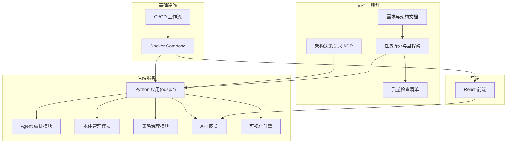
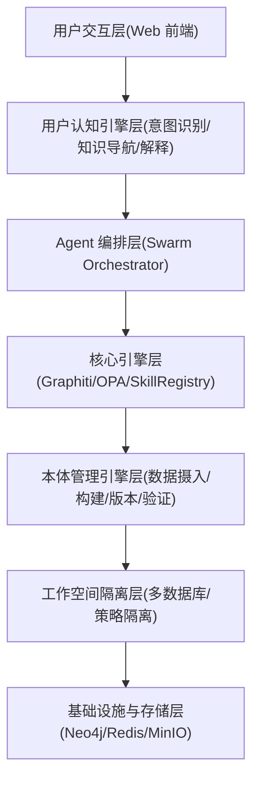
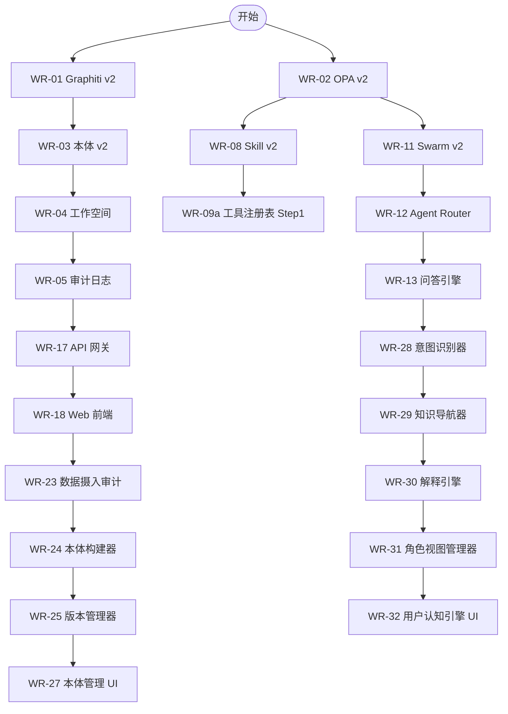
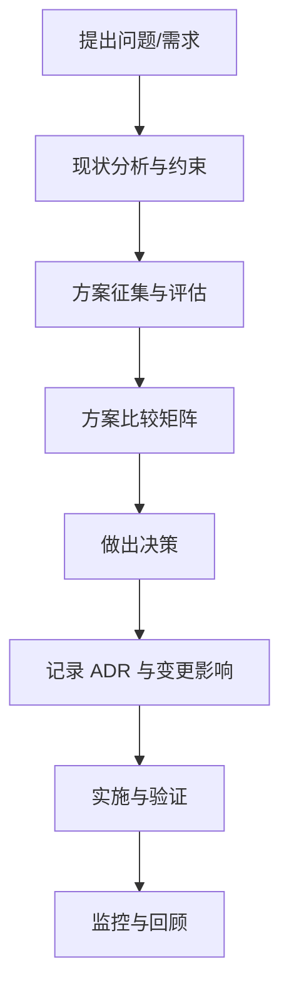
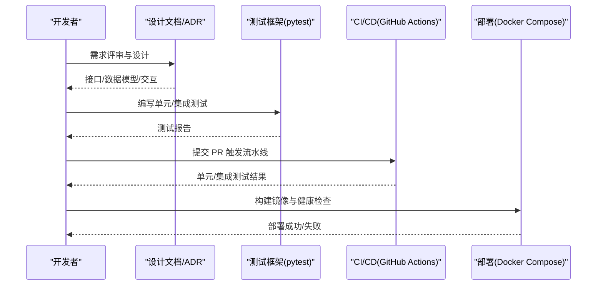
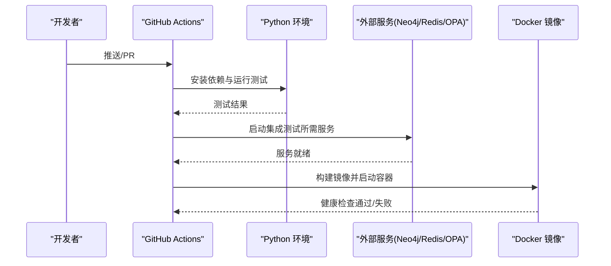
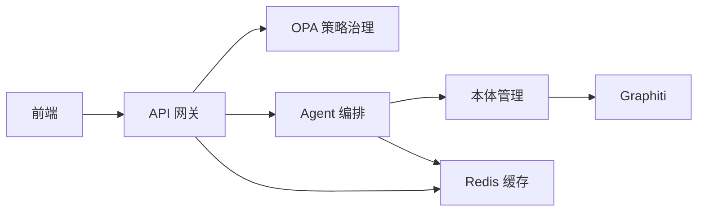

# 开发工作流程

<cite>
**本文引用的文件**
- [任务拆分与工作项清单](file://docs/08-tasks/TASK_BREAKDOWN.md)
- [完整 Checklist v2.0](file://docs/09-checklists/CHECKLIST_v2.md)
- [CI 工作流](file://.github/workflows/ci.yml)
- [集成测试工作流](file://.github/workflows/test.yml)
- [Docker Compose 编排](file://docker/docker-compose.yml)
- [PyTest 配置](file://pyproject.toml)
- [OPA 策略治理引擎 ADR](file://docs/07-adr/ADR-003_opa_策略治理引擎mvp_生产化.md)
- [分层 Agent 架构 ADR](file://docs/07-adr/ADR-005_分层_agent_架构openharness_原生_领域扩展.md)
- [前端技术栈 ADR](file://docs/07-adr/ADR-007_前端采用_react_ant_design_技术栈.md)
- [原子提交规范 ADR](file://docs/07-adr/ADR-017_原子提交规范.md)
- [OADP 业务语义体系 ADR](file://docs/07-adr/ADR-050_OADP业务语义体系架构.md)
- [Agent 模块设计](file://docs/03-modules/agent/DESIGN.md)
- [本体模块设计](file://docs/03-modules/ontology/DESIGN.md)
- [OPA 策略模块设计](file://docs/03-modules/opa_policy/DESIGN.md)
</cite>

## 目录
1. [简介](#简介)
2. [项目结构](#项目结构)
3. [核心组件](#核心组件)
4. [架构总览](#架构总览)
5. [详细组件分析](#详细组件分析)
6. [依赖分析](#依赖分析)
7. [性能考量](#性能考量)
8. [故障排查指南](#故障排查指南)
9. [结论](#结论)
10. [附录](#附录)

## 简介
本指南面向 ODAP 平台的开发团队，提供从需求分析到产品发布的完整工作流程，涵盖任务分解、优先级排序、里程碑规划、架构决策记录（ADR）编写、功能开发流程、代码审查规范、CI/CD 流程、问题跟踪与缺陷管理、版本发布与变更日志维护等。文档结合仓库现有任务拆分、检查清单、ADR、模块设计与 CI/CD 配置，形成可落地的工程实践。

## 项目结构
ODAP 项目采用“模块化 + 分层架构”的组织方式，前端与后端分别独立开发与测试，通过 Docker Compose 进行本地联调与集成测试。关键结构如下：
- 文档体系：需求、架构、模块设计、ADR、任务与检查清单、API/数据库设计等
- 后端核心：Python 服务、Agent 编排、本体管理、策略治理、API 网关、可视化等
- 前端：React + Ant Design，支持图谱、地图、图表等可视化
- CI/CD：GitHub Actions + Docker Compose，覆盖单元、集成与构建验证

**图表来源**
- [任务拆分与工作项清单:1-491](file://docs/08-tasks/TASK_BREAKDOWN.md#L1-L491)
- [CI 工作流:1-99](file://.github/workflows/ci.yml#L1-L99)
- [Docker Compose 编排:1-97](file://docker/docker-compose.yml#L1-L97)

**章节来源**
- [任务拆分与工作项清单:1-491](file://docs/08-tasks/TASK_BREAKDOWN.md#L1-L491)
- [CI 工作流:1-99](file://.github/workflows/ci.yml#L1-L99)
- [Docker Compose 编排:1-97](file://docker/docker-compose.yml#L1-L97)

## 核心组件
- 任务与里程碑：以 WR- 编号的工作项为主线，按 L1→L7 层级与关键路径推进，设定阶段性里程碑与验收标准
- 质量检查：Checklist 覆盖需求、架构、模块、ADR、任务与质量指标，确保交付物一致性
- 架构决策：以 ADR 记录技术选型与演进路径，如 OPA 策略治理、分层 Agent、前端技术栈、原子提交规范等
- 模块设计：Agent、本体、策略治理等模块具备清晰接口、数据模型与交互关系

**章节来源**
- [任务拆分与工作项清单:1-491](file://docs/08-tasks/TASK_BREAKDOWN.md#L1-L491)
- [完整 Checklist v2.0:1-717](file://docs/09-checklists/CHECKLIST_v2.md#L1-L717)
- [OPA 策略治理引擎 ADR:1-436](file://docs/07-adr/ADR-003_opa_策略治理引擎mvp_生产化.md#L1-L436)
- [分层 Agent 架构 ADR:1-208](file://docs/07-adr/ADR-005_分层_agent_架构openharness_原生_领域扩展.md#L1-L208)
- [前端技术栈 ADR:1-74](file://docs/07-adr/ADR-007_前端采用_react_ant_design_技术栈.md#L1-L74)
- [原子提交规范 ADR:1-65](file://docs/07-adr/ADR-017_原子提交规范.md#L1-L65)

## 架构总览
ODAP 采用七层架构：用户交互层、用户认知引擎层、Agent 编排层、核心引擎层、本体管理引擎层、工作空间隔离层、基础设施与存储层。关键能力包括：
- Graphiti 双时态知识图谱
- OPA 策略治理与权限校验
- 多 Agent 协同（Swarm）与意图路由
- 本体管理与版本控制
- 工作空间资源隔离
- 审计日志与防篡改链
- API 网关与前端可视化

**图表来源**
- [任务拆分与工作项清单:167-197](file://docs/08-tasks/TASK_BREAKDOWN.md#L167-L197)
- [Agent 模块设计:31-50](file://docs/03-modules/agent/DESIGN.md#L31-L50)
- [本体模块设计:1-55](file://docs/03-modules/ontology/DESIGN.md#L1-L55)
- [OPA 策略模块设计:1-21](file://docs/03-modules/opa_policy/DESIGN.md#L1-L21)

**章节来源**
- [任务拆分与工作项清单:167-197](file://docs/08-tasks/TASK_BREAKDOWN.md#L167-L197)
- [Agent 模块设计:31-50](file://docs/03-modules/agent/DESIGN.md#L31-L50)
- [本体模块设计:1-55](file://docs/03-modules/ontology/DESIGN.md#L1-L55)
- [OPA 策略模块设计:1-21](file://docs/03-modules/opa_policy/DESIGN.md#L1-L21)

## 详细组件分析

### 任务分解与里程碑规划
- 采用 WR- 编号的工作项，按 P0/P1/P2 优先级与依赖关系推进
- 关键路径：Graphiti v2 → 本体 v2 → 工作空间 → 审计日志 → API 网关 → Web 前端
- 阶段性里程碑：Phase 4 基础设施就绪、编排闭环、应用可用、用户可感、生产就绪；Phase 5 本体管理引擎与用户认知引擎就绪与可感

**图表来源**
- [任务拆分与工作项清单:167-197](file://docs/08-tasks/TASK_BREAKDOWN.md#L167-L197)

**章节来源**
- [任务拆分与工作项清单:74-296](file://docs/08-tasks/TASK_BREAKDOWN.md#L74-L296)

### 架构决策记录（ADR）编写流程
- 决策背景：明确技术选型或架构演进的背景与约束
- 方案比较：列出备选方案及其优缺点
- 决策与后果：明确最终决策、预期收益与潜在代价
- 可逆性：评估方案可逆程度与迁移策略
- 示例 ADR：OPA 策略治理（MVP→生产化）、分层 Agent 架构、前端技术栈、原子提交规范、OADP 业务语义体系

**图表来源**
- [OPA 策略治理引擎 ADR:1-436](file://docs/07-adr/ADR-003_opa_策略治理引擎mvp_生产化.md#L1-L436)
- [分层 Agent 架构 ADR:1-208](file://docs/07-adr/ADR-005_分层_agent_架构openharness_原生_领域扩展.md#L1-L208)
- [前端技术栈 ADR:1-74](file://docs/07-adr/ADR-007_前端采用_react_ant_design_技术栈.md#L1-L74)
- [原子提交规范 ADR:1-65](file://docs/07-adr/ADR-017_原子提交规范.md#L1-L65)
- [OADP 业务语义体系 ADR:1-350](file://docs/07-adr/ADR-050_OADP业务语义体系架构.md#L1-L350)

**章节来源**
- [OPA 策略治理引擎 ADR:1-436](file://docs/07-adr/ADR-003_opa_策略治理引擎mvp_生产化.md#L1-L436)
- [分层 Agent 架构 ADR:1-208](file://docs/07-adr/ADR-005_分层_agent_架构openharness_原生_领域扩展.md#L1-L208)
- [前端技术栈 ADR:1-74](file://docs/07-adr/ADR-007_前端采用_react_ant_design_技术栈.md#L1-L74)
- [原子提交规范 ADR:1-65](file://docs/07-adr/ADR-017_原子提交规范.md#L1-L65)
- [OADP 业务语义体系 ADR:1-350](file://docs/07-adr/ADR-050_OADP业务语义体系架构.md#L1-L350)

### 功能开发标准流程
- 需求评审：以 req-ok 为权威来源，结合模块设计与 ADR 对齐
- 设计文档：模块设计文档（含接口、数据模型、交互关系）
- 原型开发：前端页面与后端接口原型，Checklist 验证
- 代码实现：遵循模块接口与数据模型，最小可行提交
- 测试验证：单元测试（pytest 标记）、集成测试（Docker Compose）、端到端测试
- 文档更新：设计文档与 ADR 同步更新
- 部署上线：Docker Compose 构建与健康检查，CI/CD 自动化

**图表来源**
- [PyTest 配置:1-17](file://pyproject.toml#L1-L17)
- [CI 工作流:1-99](file://.github/workflows/ci.yml#L1-L99)
- [集成测试工作流:1-122](file://.github/workflows/test.yml#L1-L122)
- [Docker Compose 编排:1-97](file://docker/docker-compose.yml#L1-L97)

**章节来源**
- [PyTest 配置:1-17](file://pyproject.toml#L1-L17)
- [CI 工作流:1-99](file://.github/workflows/ci.yml#L1-L99)
- [集成测试工作流:1-122](file://.github/workflows/test.yml#L1-L122)
- [Docker Compose 编排:1-97](file://docker/docker-compose.yml#L1-L97)

### 代码审查流程规范
- PR 模板：建议包含变更摘要、影响范围、测试验证、风险与回滚预案
- 审查清单：Checklist 覆盖设计、实现、测试、验收四项，P0 必须全部通过
- 反馈处理：针对问题逐一回复与修正，必要时进行二次审查
- 合并策略：优先使用 Squash Merge，配合原子提交规范，确保提交历史清晰

**章节来源**
- [完整 Checklist v2.0:154-159](file://docs/09-checklists/CHECKLIST_v2.md#L154-L159)
- [原子提交规范 ADR:1-65](file://docs/07-adr/ADR-017_原子提交规范.md#L1-L65)

### 持续集成/持续部署（CI/CD）流程
- 触发条件：push 到 main/develop，或 PR 到 main
- 单元测试：Python 依赖安装与 pytest 执行
- 集成测试：启动 Neo4j/Redis/OPA 等服务，执行集成测试
- 构建与健康检查：构建 Docker 镜像并启动容器，健康检查端点
- 覆盖率：生成 XML/HTML 报告并上传至 Codecov

**图表来源**
- [CI 工作流:1-99](file://.github/workflows/ci.yml#L1-L99)
- [集成测试工作流:1-122](file://.github/workflows/test.yml#L1-L122)
- [Docker Compose 编排:1-97](file://docker/docker-compose.yml#L1-L97)

**章节来源**
- [CI 工作流:1-99](file://.github/workflows/ci.yml#L1-L99)
- [集成测试工作流:1-122](file://.github/workflows/test.yml#L1-L122)
- [Docker Compose 编排:1-97](file://docker/docker-compose.yml#L1-L97)

### 问题跟踪与缺陷管理
- Bug 分类：按严重程度（P0/P1/P2）与影响范围划分
- 修复优先级：P0 必须阻断发布，P1 可延期但需记录降级原因，P2 作为迭代补齐
- 回归测试：变更涉及的模块需补充或回归相关测试
- 追溯与验证：通过 Checklist 与验收标准核对修复效果

**章节来源**
- [完整 Checklist v2.0:154-159](file://docs/09-checklists/CHECKLIST_v2.md#L154-L159)

### 版本发布管理与变更日志
- 版本策略：以里程碑为节点，结合 Phase 4/5 的阶段性成果
- 变更日志：基于 ADR 与任务拆分，记录重大变更与影响范围
- 向后兼容：严格遵循接口契约，避免破坏性变更；必要时提供迁移指南

**章节来源**
- [任务拆分与工作项清单:478-491](file://docs/08-tasks/TASK_BREAKDOWN.md#L478-L491)
- [原子提交规范 ADR:1-65](file://docs/07-adr/ADR-017_原子提交规范.md#L1-L65)

## 依赖分析
- 模块间依赖：Agent 编排依赖 OPA 与 Graphiti；本体管理依赖 Graphiti；API 网关依赖 OPA；前端依赖后端 API
- 外部依赖：Neo4j、Redis、OPA、Docker Compose、GitHub Actions
- 依赖可视化

**图表来源**
- [Agent 模块设计:330-341](file://docs/03-modules/agent/DESIGN.md#L330-L341)
- [本体模块设计:387-456](file://docs/03-modules/ontology/DESIGN.md#L387-L456)
- [OPA 策略模块设计:1-21](file://docs/03-modules/opa_policy/DESIGN.md#L1-L21)
- [Docker Compose 编排:1-97](file://docker/docker-compose.yml#L1-L97)

**章节来源**
- [Agent 模块设计:330-341](file://docs/03-modules/agent/DESIGN.md#L330-L341)
- [本体模块设计:387-456](file://docs/03-modules/ontology/DESIGN.md#L387-L456)
- [OPA 策略模块设计:1-21](file://docs/03-modules/opa_policy/DESIGN.md#L1-L21)
- [Docker Compose 编排:1-97](file://docker/docker-compose.yml#L1-L97)

## 性能考量
- 性能基线：问答 P99 < 3s，图谱查询 P99 < 500ms
- 压力测试：并发用户数、推演并发数、参数配置响应时间
- 稳定性测试：24 小时运行、无内存泄漏
- 优化手段：连接池/断路器、查询缓存、批量评估、策略预编译缓存

**章节来源**
- [完整 Checklist v2.0:657-664](file://docs/09-checklists/CHECKLIST_v2.md#L657-L664)
- [任务拆分与工作项清单:466-475](file://docs/08-tasks/TASK_BREAKDOWN.md#L466-L475)

## 故障排查指南
- CI 失败：检查单元/集成测试日志，确认依赖服务（Neo4j/Redis/OPA）是否就绪
- Docker 启动失败：查看健康检查端点与容器日志，确认环境变量与卷挂载
- 权限校验失败：检查 OPA 策略包与输入数据，使用策略沙盒进行调试
- 前端联调问题：确认 API 网关路由、CORS 配置与后端健康状态

**章节来源**
- [CI 工作流:1-99](file://.github/workflows/ci.yml#L1-L99)
- [集成测试工作流:1-122](file://.github/workflows/test.yml#L1-L122)
- [Docker Compose 编排:1-97](file://docker/docker-compose.yml#L1-L97)
- [OPA 策略模块设计:312-430](file://docs/03-modules/opa_policy/DESIGN.md#L312-L430)

## 结论
本指南将 ODAP 项目的任务拆分、ADR、模块设计与 CI/CD 流水线有机结合，形成从需求到发布的闭环工作流程。通过严格的 Checklist 与验收标准、规范化的代码审查与版本管理，确保交付质量与可维护性。建议在实际执行中持续更新 ADR 与任务清单，保持文档与代码一致性。

## 附录
- 相关文档与模块
  - [Agent 模块设计:1-409](file://docs/03-modules/agent/DESIGN.md#L1-L409)
  - [本体模块设计:1-800](file://docs/03-modules/ontology/DESIGN.md#L1-L800)
  - [OPA 策略模块设计:1-658](file://docs/03-modules/opa_policy/DESIGN.md#L1-L658)
  - [任务拆分与工作项清单:1-491](file://docs/08-tasks/TASK_BREAKDOWN.md#L1-L491)
  - [完整 Checklist v2.0:1-717](file://docs/09-checklists/CHECKLIST_v2.md#L1-L717)
  - [CI 工作流:1-99](file://.github/workflows/ci.yml#L1-L99)
  - [集成测试工作流:1-122](file://.github/workflows/test.yml#L1-L122)
  - [Docker Compose 编排:1-97](file://docker/docker-compose.yml#L1-L97)
  - [PyTest 配置:1-17](file://pyproject.toml#L1-L17)