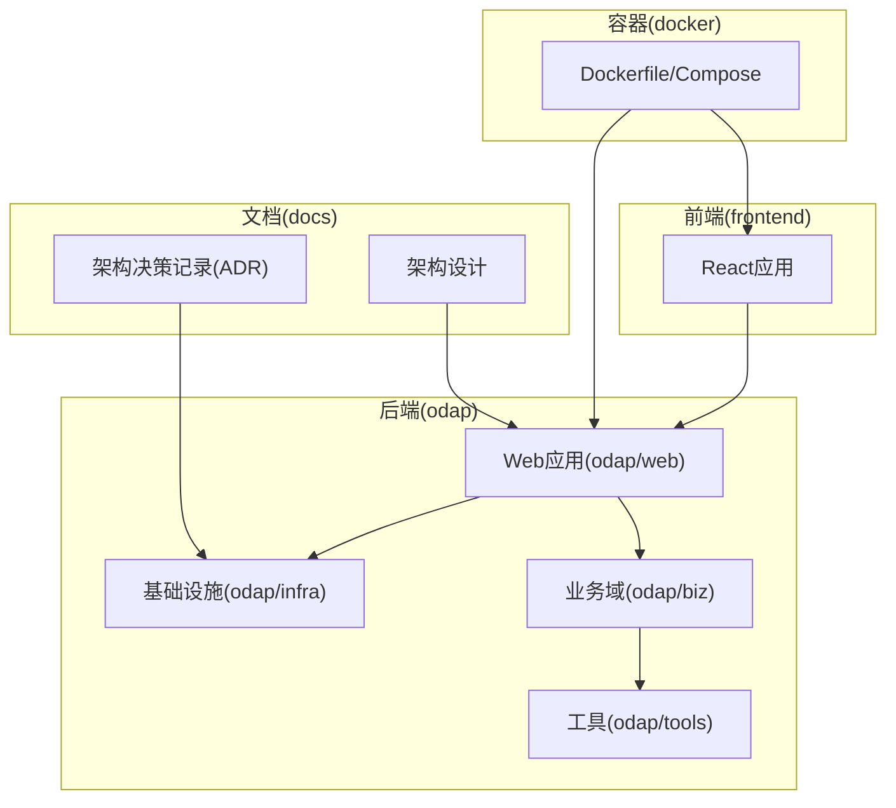
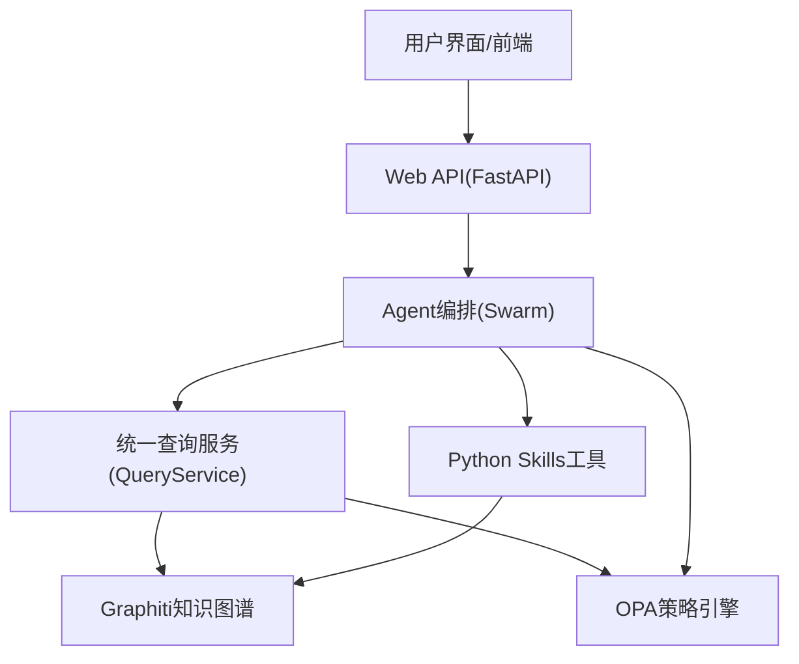
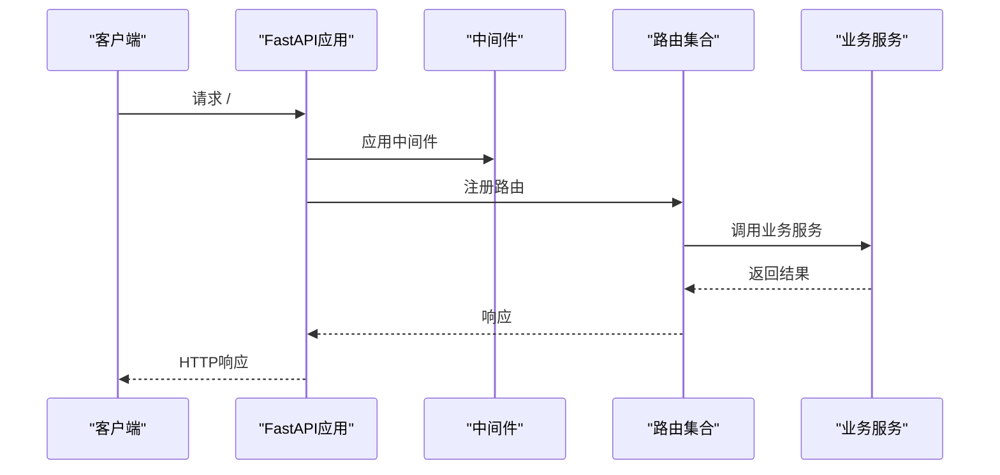
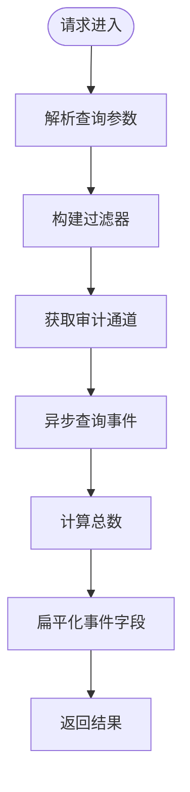
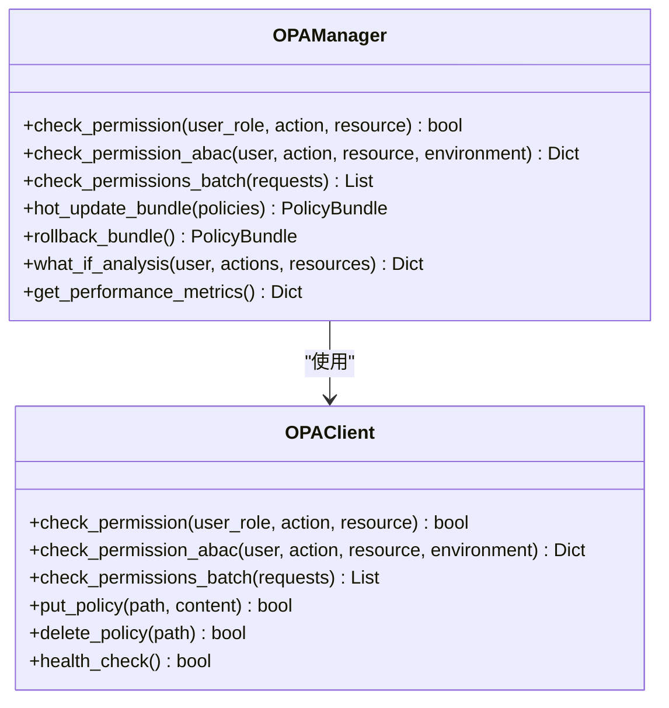
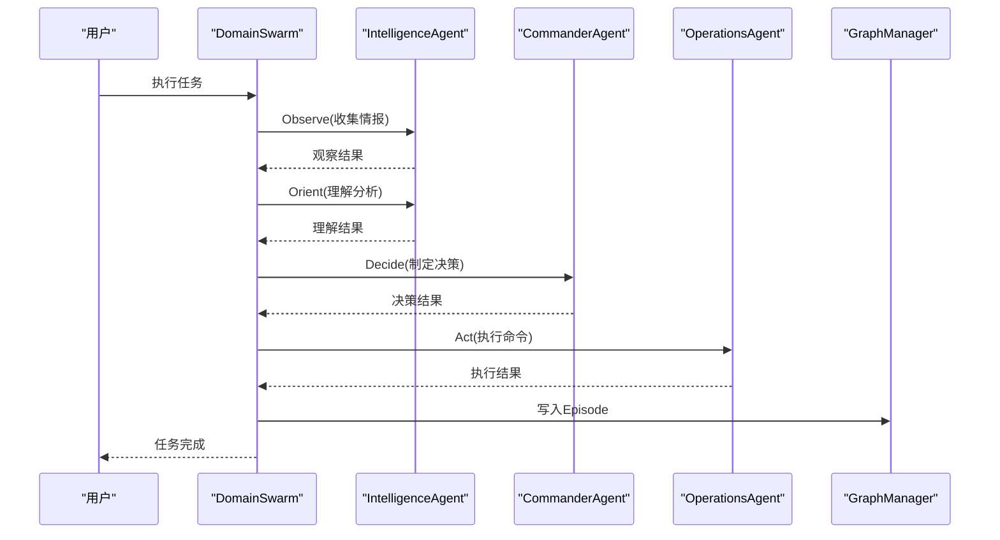
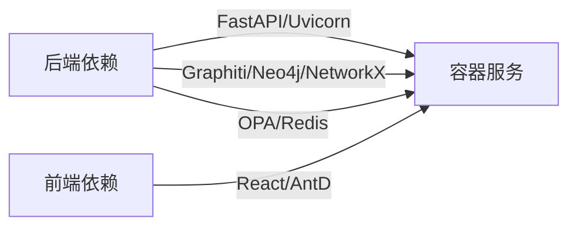

# 开发指南

<cite>
**本文档引用的文件**
- [README.md](file://README.md)
- [pyproject.toml](file://pyproject.toml)
- [requirements.txt](file://requirements.txt)
- [package.json](file://frontend/package.json)
- [eslint.config.js](file://frontend/eslint.config.js)
- [vite.config.ts](file://frontend/vite.config.ts)
- [Dockerfile](file://docker/Dockerfile)
- [docker-compose.yml](file://docker/docker-compose.yml)
- [main.py](file://main.py)
- [odap/web/app.py](file://odap/web/app.py)
- [odap/infra/security/audit_api.py](file://odap/infra/security/audit_api.py)
- [odap/infra/opa/opa_service.py](file://odap/infra/opa/opa_service.py)
- [odap/biz/core/agent/swarm_orchestrator.py](file://odap/biz/core/agent/swarm_orchestrator.py)
- [docs/07-adr/ADR-003_opa_策略治理引擎mvp_生产化.md](file://docs/07-adr/ADR-003_opa_策略治理引擎mvp_生产化.md)
- [docs/07-adr/ADR-005_分层_agent_架构openharness_原生_领域扩展.md](file://docs/07-adr/ADR-005_分层_agent_架构openharness_原生_领域扩展.md)
- [docs/07-adr/ADR-017_原子提交规范.md](file://docs/07-adr/ADR-017_原子提交规范.md)
- [docs/02-architecture/ARCHITECTURE.md](file://docs/02-architecture/ARCHITECTURE.md)
</cite>

## 目录
1. [简介](#简介)
2. [项目结构](#项目结构)
3. [核心组件](#核心组件)
4. [架构总览](#架构总览)
5. [详细组件分析](#详细组件分析)
6. [依赖分析](#依赖分析)
7. [性能考虑](#性能考虑)
8. [故障排查指南](#故障排查指南)
9. [结论](#结论)
10. [附录](#附录)

## 简介
本开发指南面向ODAP平台新老开发者，提供从环境搭建、代码规范、架构决策、分支与评审流程，到功能开发、插件与工具扩展、第三方集成、性能优化与安全实践的全流程指引。ODAP是一个通用的本体驱动分析决策平台，围绕工作空间隔离、统一查询服务、多智能体协同、双时态知识图谱、策略治理与安全边界展开。

## 项目结构
- 后端核心位于 odap/，包含业务域（biz）、基础设施（infra）、工具（tools）、Web服务（web）等模块。
- 前端位于 frontend/，采用React 19 + TypeScript + Ant Design + Vite。
- 文档位于 docs/，包含架构设计、模块设计、ADR、任务与检查清单等。
- 容器化部署位于 docker/，包含生产镜像与Compose编排。
- 根目录提供快速启动脚本与测试入口。

**图表来源**
- [README.md:27-122](file://README.md#L27-L122)
- [docker/docker-compose.yml:1-97](file://docker/docker-compose.yml#L1-L97)

**章节来源**
- [README.md:27-122](file://README.md#L27-L122)
- [docker/docker-compose.yml:1-97](file://docker/docker-compose.yml#L1-L97)

## 核心组件
- Web应用入口与路由：FastAPI应用，注册各类业务路由，配置CORS与审计中间件，提供健康检查与性能监控端点。
- 基础设施层：OpenHarness Agent基础设施、Graphiti双时态知识图谱、OPA策略治理、安全与审计、监控与韧性系统。
- 业务域：Agent协同（Swarm OODA）、决策与动作执行、本体管理与运行时、仿真与反馈、平台能力（工作空间、角色、技能、会话记忆）。
- 工具层：Python Skills作为领域工具，统一接入OpenHarness Tool接口。
- 前端：React模块化页面，Ant Design组件库，Vite开发服务器与代理配置。

**章节来源**
- [odap/web/app.py:1-262](file://odap/web/app.py#L1-L262)
- [docs/02-architecture/ARCHITECTURE.md:448-456](file://docs/02-architecture/ARCHITECTURE.md#L448-L456)

## 架构总览
ODAP采用四层架构：基础设施层（OpenHarness、Graphiti、OPA）、工具层（Python Skills）、业务层（Agent协同、本体管理、工作空间）、接口层（Web与前端）。统一查询服务(QueryService)贯穿业务与基础设施，遵循“查询优先”与“Agent安全默认”的原则，通过OpenHarness Hook实现写操作的OPA校验。

**图表来源**
- [docs/02-architecture/ARCHITECTURE.md:457-555](file://docs/02-architecture/ARCHITECTURE.md#L457-L555)
- [odap/web/app.py:146-191](file://odap/web/app.py#L146-L191)

## 详细组件分析

### Web应用与路由
- 应用生命周期：启动时初始化OpenHarness v2适配，创建默认工作空间与场景。
- 中间件：异常处理器、审计中间件、CORS配置。
- 路由：涵盖本体管理、工作空间、角色、审计、技能、Hook、MCP、事件模拟、Agent、业务管理、策略、会话记忆、数据仓库、查询、问答、认知、反馈、仿真、运行时、内存同步、服务化与蓝图等。
- 健康检查：返回OpenHarness v1/v2状态、Graphiti可用性与版本信息。
- 性能监控：提供性能指标查询与重置端点。

**图表来源**
- [odap/web/app.py:122-191](file://odap/web/app.py#L122-L191)

**章节来源**
- [odap/web/app.py:68-121](file://odap/web/app.py#L68-L121)
- [odap/web/app.py:193-262](file://odap/web/app.py#L193-L262)

### 审计日志API
- 提供审计事件查询、时间线、Trace链、统计与导出接口。
- 使用SQLite通道与统一审计通道，支持按时间、事件类型、严重级别、Actor/Resource、工作空间、Trace ID等过滤。
- 提供日志创建与分页查询接口。

**图表来源**
- [odap/infra/security/audit_api.py:120-209](file://odap/infra/security/audit_api.py#L120-L209)

**章节来源**
- [odap/infra/security/audit_api.py:16-487](file://odap/infra/security/audit_api.py#L16-L487)

### OPA策略治理
- 支持ABAC策略模型、策略热更新Bundle、策略沙箱与批量权限检查。
- 提供OPAClient封装、PolicyBundleManager、PolicySandbox与OPAManager。
- 支持Mock模式与真实OPA服务，自动加载策略并带缓存与历史记录。

**图表来源**
- [odap/infra/opa/opa_service.py:373-450](file://odap/infra/opa/opa_service.py#L373-L450)
- [odap/infra/opa/opa_service.py:455-717](file://odap/infra/opa/opa_service.py#L455-L717)

**章节来源**
- [odap/infra/opa/opa_service.py:1-750](file://odap/infra/opa/opa_service.py#L1-L750)

### Swarm OODA编排器
- 三Agent协同：Intelligence（情报）、Commander（决策）、Operations（执行）。
- OODA循环：Observe → Orient → Decide → Act，支持流式进度返回与Graphiti Episode写入。
- 集成Fault Recovery、State Persistence、Health Monitor，提供任务历史与健康报告。

**图表来源**
- [odap/biz/core/agent/swarm_orchestrator.py:379-456](file://odap/biz/core/agent/swarm_orchestrator.py#L379-L456)
- [odap/biz/core/agent/swarm_orchestrator.py:568-613](file://odap/biz/core/agent/swarm_orchestrator.py#L568-L613)

**章节来源**
- [odap/biz/core/agent/swarm_orchestrator.py:288-687](file://odap/biz/core/agent/swarm_orchestrator.py#L288-L687)

### 统一查询服务与Agent安全默认
- QueryService提供.schema/.entity/.topo/.temporal四种查询源，统一解析与执行。
- 通过OpenHarness Hook实现写操作的OPA校验，Agent默认只读。
- 通过架构守卫强制“查询优先”，禁止在QueryService之外暴露域读取API。

**章节来源**
- [docs/02-architecture/ARCHITECTURE.md:457-555](file://docs/02-architecture/ARCHITECTURE.md#L457-L555)

### 开发环境搭建与IDE配置
- 环境要求：Python 3.11+、Node.js 18+、Docker/Podman。
- 依赖安装：后端pip安装requirements.txt；前端npm install。
- IDE建议：VS Code + Python/ESLint/ES7+React/TypeScript插件；启用格式化与类型检查。
- 调试工具：后端使用uvicorn；前端使用Vite HMR；容器化一键启动。

**章节来源**
- [README.md:124-174](file://README.md#L124-L174)
- [requirements.txt:1-48](file://requirements.txt#L1-L48)
- [frontend/package.json:1-55](file://frontend/package.json#L1-L55)

### 代码规范与最佳实践
- Python：使用pytest标记与配置，单元/集成/端到端测试分离；依赖black/flake8进行格式化与静态检查。
- 前端：ESLint配置与TypeScript类型检查；Vite代理配置支持API转发。
- 命名约定：模块按领域分层，类/方法/变量采用清晰语义；路由前缀与标签统一。
- 注释标准：模块顶部提供职责说明，关键函数/类提供用途与参数说明；复杂流程使用注释框。
- 错误处理：统一异常处理器与审计中间件；OPA降级到Mock模式；Swarm异常记录与回溯。

**章节来源**
- [pyproject.toml:1-17](file://pyproject.toml#L1-L17)
- [frontend/eslint.config.js:1-24](file://frontend/eslint.config.js#L1-L24)
- [frontend/vite.config.ts:1-46](file://frontend/vite.config.ts#L1-L46)

### 架构决策记录（ADR）编写与管理
- ADR-003：OPA策略治理引擎（MVP+生产化），支持Markdown策略、转换引擎、热更新与可视化管理。
- ADR-005：分层Agent架构（OpenHarness原生+领域扩展），区分平台通用Agent与领域特定Agent。
- ADR-017：原子提交规范，明确提交格式与类型，提升可追溯性与自动化支持。
- 管理流程：ADR文档集中于docs/07-adr，采用“已接受”状态与版本化管理；与架构文档联动。

**章节来源**
- [docs/07-adr/ADR-003_opa_策略治理引擎mvp_生产化.md:1-436](file://docs/07-adr/ADR-003_opa_策略治理引擎mvp_生产化.md#L1-L436)
- [docs/07-adr/ADR-005_分层_agent_架构openharness_原生_领域扩展.md:1-208](file://docs/07-adr/ADR-005_分层_agent_架构openharness_原生_领域扩展.md#L1-L208)
- [docs/07-adr/ADR-017_原子提交规范.md:1-65](file://docs/07-adr/ADR-017_原子提交规范.md#L1-L65)

### 分支管理策略、代码审查与合并规范
- 分支策略：基于README中的贡献流程，采用feature/your-feature命名。
- 代码审查：PR需包含需求背景、变更说明与测试覆盖；至少一名Reviewer批准。
- 合并规范：优先使用squash合并，提交信息遵循ADR-017规范；避免大范围破坏性变更。

**章节来源**
- [README.md:230-237](file://README.md#L230-L237)
- [docs/07-adr/ADR-017_原子提交规范.md:22-30](file://docs/07-adr/ADR-017_原子提交规范.md#L22-L30)

### 功能开发工作流程
- 需求分析：参考需求文档与ADR，明确业务目标与约束。
- 设计：依据架构文档确定模块边界与接口；必要时补充ADR。
- 开发：后端按领域模块开发，前端按业务模块组织；统一使用统一查询服务与Agent安全默认。
- 测试：单元测试（pytest）+ 集成测试（Neo4j/MongoDB）+ 端到端测试（Vitest）。
- 部署：Docker镜像构建与Compose编排；支持开发（HMR）与生产（Nginx）两种模式。

**章节来源**
- [README.md:200-217](file://README.md#L200-L217)
- [docker/Dockerfile:1-34](file://docker/Dockerfile#L1-L34)
- [docker/docker-compose.yml:1-97](file://docker/docker-compose.yml#L1-L97)

### 插件开发、工具扩展与第三方集成
- 插件与工具：Python Skills作为领域工具，通过OpenHarness Tool接口注册；支持热插拔与版本管理。
- 第三方集成：MCP协议适配（MCP Adapter）；OpenHarness v2适配；外部Agent桥接。
- 集成原则：最小侵入、Hook保护、策略校验、可观测性与回滚能力。

**章节来源**
- [docs/02-architecture/ARCHITECTURE.md:448-456](file://docs/02-architecture/ARCHITECTURE.md#L448-L456)
- [odap/web/app.py:57-58](file://odap/web/app.py#L57-L58)

## 依赖分析
- 后端依赖：FastAPI、Uvicorn、Graphiti、Neo4j、NetworkX、OPA、Redis、Pydantic、HTTPX、OpenAI等。
- 前端依赖：React 19、Ant Design、@openpolicyagent/opa、@antv/g6、@ant-design/graphs、Leaflet等。
- 容器化：基于Python Slim镜像，安装核心依赖与OPA/Redis/Neo4j服务。

**图表来源**
- [requirements.txt:3-48](file://requirements.txt#L3-L48)
- [frontend/package.json:15-33](file://frontend/package.json#L15-L33)
- [docker/Dockerfile:9-27](file://docker/Dockerfile#L9-L27)

**章节来源**
- [requirements.txt:1-48](file://requirements.txt#L1-L48)
- [frontend/package.json:1-55](file://frontend/package.json#L1-L55)
- [docker/Dockerfile:1-34](file://docker/Dockerfile#L1-L34)

## 性能考虑
- 缓存与降级：OPA Manager内置缓存与Mock降级，减少外部依赖抖动。
- 监控与可观测：健康检查端点、性能监控指标、审计日志与Trace链。
- 查询优化：统一查询服务减少重复解析与执行；Graphiti双时态查询需注意索引与限制。
- 并发与韧性：Swarm支持并发Agent与重试；Fault Recovery与State Persistence保障稳定性。

**章节来源**
- [odap/infra/opa/opa_service.py:473-481](file://odap/infra/opa/opa_service.py#L473-L481)
- [odap/web/app.py:244-262](file://odap/web/app.py#L244-L262)
- [odap/biz/core/agent/swarm_orchestrator.py:304-306](file://odap/biz/core/agent/swarm_orchestrator.py#L304-L306)

## 故障排查指南
- 后端启动：检查requirements.txt依赖安装与环境变量；查看日志与健康检查端点。
- 前端开发：确认Vite代理配置与后端API可达；浏览器控制台与网络面板排查跨域与404。
- 审计与日志：通过审计API查询事件与Trace链，定位异常环节。
- OPA策略：检查策略Bundle版本与热更新；必要时回滚到上一版本。
- Swarm任务：查看任务历史与健康报告，定位Agent执行异常。

**章节来源**
- [README.md:175-186](file://README.md#L175-L186)
- [odap/infra/security/audit_api.py:269-292](file://odap/infra/security/audit_api.py#L269-L292)
- [odap/infra/opa/opa_service.py:649-661](file://odap/infra/opa/opa_service.py#L649-L661)
- [odap/biz/core/agent/swarm_orchestrator.py:639-657](file://odap/biz/core/agent/swarm_orchestrator.py#L639-L657)

## 结论
本指南提供了ODAP平台从环境搭建到功能交付的完整开发路径，强调“查询优先”“Agent安全默认”“策略治理”“可观测性”等核心原则。建议新开发者先通读架构文档与ADR，再按模块逐步深入，严格遵循代码规范与评审流程，确保高质量交付与长期可维护性。

## 附录
- 快速开始：Docker一键部署与本地开发命令。
- 测试：pytest与Vitest分别覆盖后端与前端测试。
- 容器：Dockerfile与docker-compose提供生产与开发环境。

**章节来源**
- [README.md:124-186](file://README.md#L124-L186)
- [README.md:200-217](file://README.md#L200-L217)
- [docker/docker-compose.yml:1-97](file://docker/docker-compose.yml#L1-L97)