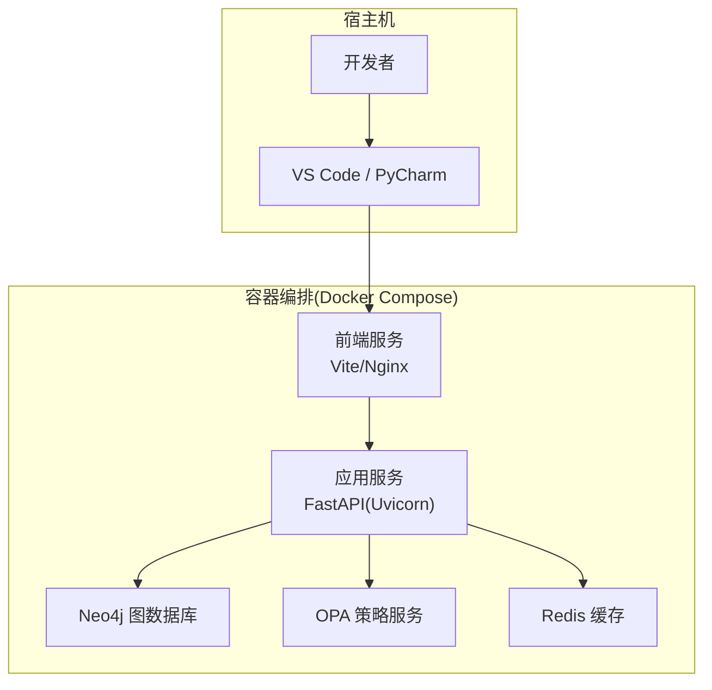
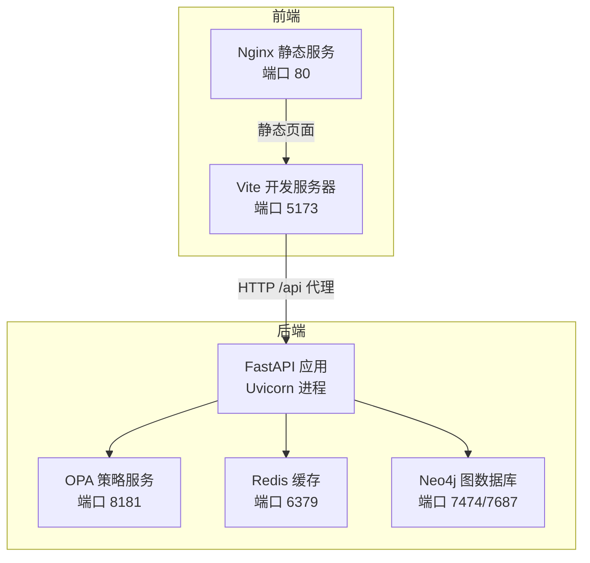
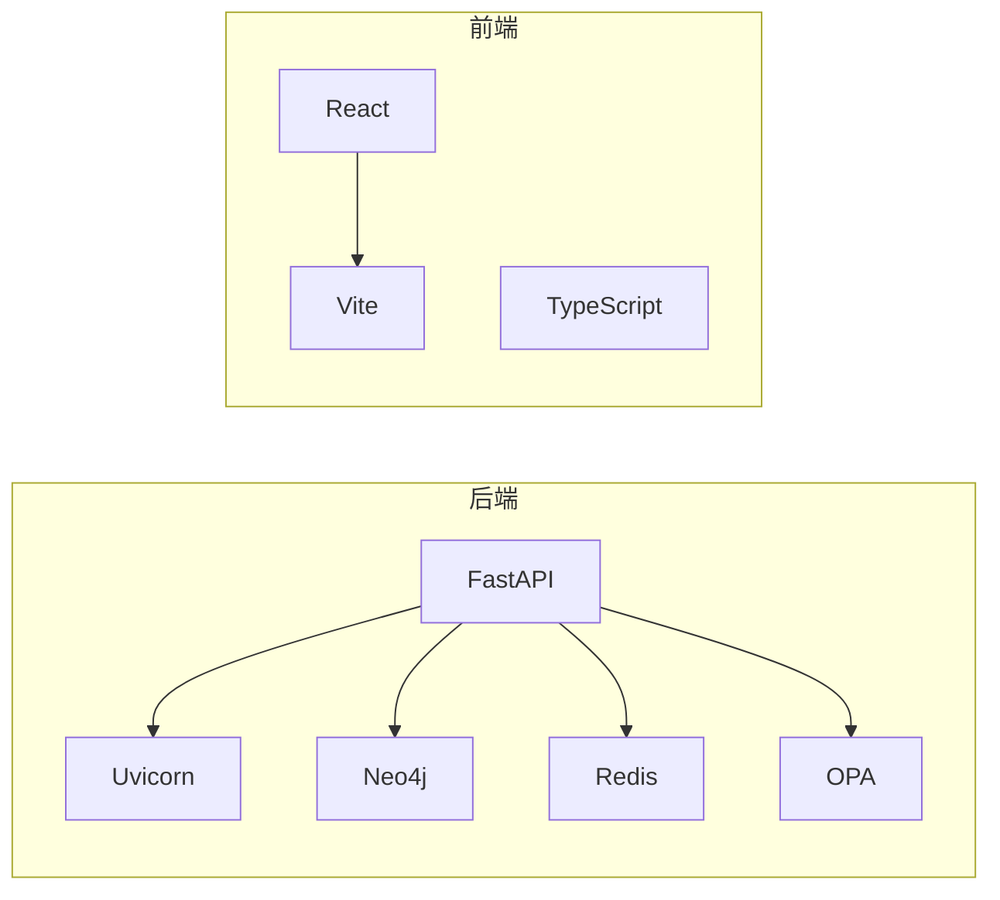

# 开发环境搭建

<cite>
**本文引用的文件**
- [README.md](file://README.md)
- [pyproject.toml](file://pyproject.toml)
- [requirements.txt](file://requirements.txt)
- [docker-compose.yml](file://docker/docker-compose.yml)
- [Dockerfile](file://docker/Dockerfile)
- [Dockerfile.dev](file://docker/Dockerfile.dev)
- [bootstep.py](file://bootstep.py)
- [package.json](file://frontend/package.json)
- [vite.config.ts](file://frontend/vite.config.ts)
- [eslint.config.js](file://frontend/eslint.config.js)
- [tsconfig.json](file://frontend/tsconfig.json)
- [agent_config.yaml](file://config/agent_config.yaml)
</cite>

## 目录
1. [简介](#简介)
2. [项目结构](#项目结构)
3. [核心组件](#核心组件)
4. [架构总览](#架构总览)
5. [详细组件分析](#详细组件分析)
6. [依赖分析](#依赖分析)
7. [性能考虑](#性能考虑)
8. [故障排查指南](#故障排查指南)
9. [结论](#结论)
10. [附录](#附录)

## 简介
本指南面向ODAP平台开发者，提供从零搭建本地开发环境的完整流程，覆盖以下方面：
- Python 3.11+ 环境配置与虚拟环境
- 依赖安装（后端Python、前端Node.js/npm）
- React前端开发环境与Vite代理配置
- Docker与Docker Compose容器化开发环境
- IDE配置建议（VS Code、PyCharm等）
- 数据库Neo4j、缓存Redis的本地安装与配置
- Git工作流与代码格式化工具（Ruff、Prettier）设置
- 环境变量与API密钥管理最佳实践
- 常见环境问题排查与解决方案

## 项目结构
ODAP采用前后端分离与容器化部署的典型结构：
- 后端：Python 3.11+，FastAPI，Neo4j/NetworkX，OPA策略治理，Redis缓存
- 前端：React 19 + TypeScript + Ant Design + Vite
- 基础设施：Docker Compose编排Neo4j、OPA、Redis、应用与前端
- 开发辅助：bootstep.py一键脚本，pytest测试配置

**章节来源**
- [README.md: 16-26:16-26](file://README.md#L16-L26)
- [README.md: 124-173:124-173](file://README.md#L124-L173)

## 核心组件
- 后端运行时与框架
  - Python 3.11+（容器内使用3.10镜像，建议本地使用3.11+）
  - FastAPI + Uvicorn
  - 依赖清单参见 requirements.txt
- 前端运行时与工具链
  - Node.js 18+（容器内使用node:20-alpine）
  - Vite + React 19 + TypeScript
  - ESLint + Vitest + Ant Design
- 基础设施
  - Neo4j（图数据库）
  - Redis（缓存）
  - OPA（策略治理）

**章节来源**
- [README.md: 16-26:16-26](file://README.md#L16-L26)
- [requirements.txt: 1-48:1-48](file://requirements.txt#L1-L48)
- [package.json: 1-55:1-55](file://frontend/package.json#L1-L55)

## 架构总览
下图展示ODAP开发环境的容器化架构与服务交互：

**图表来源**
- [docker-compose.yml: 1-97:1-97](file://docker/docker-compose.yml#L1-L97)
- [vite.config.ts: 10-46:10-46](file://frontend/vite.config.ts#L10-L46)

**章节来源**
- [docker-compose.yml: 1-97:1-97](file://docker/docker-compose.yml#L1-L97)
- [bootstep.py: 173-246:173-246](file://bootstep.py#L173-L246)

## 详细组件分析

### Python 3.11+ 环境与虚拟环境
- 建议使用Python 3.11或更高版本进行本地开发
- 使用虚拟环境隔离项目依赖
  - 推荐：venv 或 conda
  - 激活后安装后端依赖：pip install -r requirements.txt
- 容器内使用Python 3.10镜像，建议本地保持版本一致以减少差异

**章节来源**
- [README.md: 129](file://README.md#L129)
- [requirements.txt: 1-48:1-48](file://requirements.txt#L1-L48)

### 依赖安装步骤
- 后端依赖
  - 安装：pip install -r requirements.txt
  - 关键依赖：FastAPI、Uvicorn、Neo4j、Redis、OPA、Pydantic、OpenAI、AIOHTTP等
- 前端依赖
  - 进入 frontend 目录，安装：npm install
  - 开发脚本：npm run dev（Vite热更新）
  - 构建：npm run build
  - 测试：npm test / npm run test:watch / npm run test:coverage
  - Lint：npm run lint

**章节来源**
- [requirements.txt: 1-48:1-48](file://requirements.txt#L1-L48)
- [package.json: 6-14:6-14](file://frontend/package.json#L6-L14)

### Node.js 与 npm/yarn 配置
- Node.js 18+（容器内使用node:20-alpine）
- 前端工程使用Vite作为开发服务器与打包工具
- 包管理器：npm（亦可使用yarn/pnpm，需自行替换命令）
- 前端TypeScript配置：tsconfig.json分拆为app与node两份配置

**章节来源**
- [README.md: 130](file://README.md#L130)
- [package.json: 1-55:1-55](file://frontend/package.json#L1-L55)
- [tsconfig.json: 1-8:1-8](file://frontend/tsconfig.json#L1-L8)

### React 前端开发环境设置
- Vite配置要点
  - 别名：@ -> src
  - 代理：/api 与 /health 代理至后端（默认 http://localhost:8765，可通过环境变量覆盖）
  - 热重载：host: true，port: 5173
- ESLint配置
  - 推荐使用ESLint + TypeScript ESlint + React Hooks + React Refresh
  - 文件范围：**/*.{ts,tsx}
- Vitest测试
  - 单测：vitest run
  - 监听：vitest
  - 覆盖率：--coverage

**章节来源**
- [vite.config.ts: 1-46:1-46](file://frontend/vite.config.ts#L1-L46)
- [eslint.config.js: 1-24:1-24](file://frontend/eslint.config.js#L1-L24)
- [package.json: 6-14:6-14](file://frontend/package.json#L6-L14)

### Docker 与 Docker Compose 安装使用
- 安装Docker/Podman与Compose
- 使用bootstep.py一键管理容器生命周期
  - 拉取镜像：python bootstep.py pull
  - 开发模式：python bootstep.py dev（前端热重载，访问 :5173）
  - 生产模式：python bootstep.py up（前端静态服务，访问 :80）
  - 常用命令：status、logs、down、rebuild、clean
- Compose编排的服务
  - app：后端FastAPI应用
  - frontend：前端Vite/Nginx
  - graphiti-neo4j：Neo4j图数据库
  - graphiti-policy-service：OPA策略服务
  - graphiti-cache：Redis缓存

**章节来源**
- [README.md: 128-157:128-157](file://README.md#L128-L157)
- [bootstep.py: 1-401:1-401](file://bootstep.py#L1-L401)
- [docker-compose.yml: 1-97:1-97](file://docker/docker-compose.yml#L1-L97)

### 容器化开发环境搭建
- 开发镜像
  - Dockerfile.dev：开发镜像，启用reload（--reload）
  - Dockerfile：生产镜像，使用多进程Uvicorn（--workers 4）
- 环境变量
  - 通过 .env.docker 注入（参考README中的复制与编辑说明）
  - Compose中注入IN_DOCKER、Neo4j/Redis/OPA连接参数
- 健康检查
  - app服务对 /health 的健康检查，确保服务可用

**章节来源**
- [Dockerfile.dev: 1-34:1-34](file://docker/Dockerfile.dev#L1-L34)
- [Dockerfile: 1-34:1-34](file://docker/Dockerfile#L1-L34)
- [docker-compose.yml: 9-33:9-33](file://docker/docker-compose.yml#L9-L33)
- [README.md: 132-137:132-137](file://README.md#L132-L137)

### IDE 配置建议（VS Code、PyCharm）
- VS Code
  - 插件推荐：Python、Pylance、Black、Ruff、ESLint、Prettier、EditorConfig、Docker
  - 设置：Python解释器指向虚拟环境；启用格式化与Lint；Vite代理端口5173
- PyCharm
  - 使用项目Python解释器（虚拟环境）
  - 启用Python内置工具：Ruff、Black、pytest
  - 前端开发：在终端中使用npm脚本；或在PyCharm中配置Vite运行配置
- 前端开发
  - 在VS Code中启用ESLint与TypeScript检查
  - 使用Prettier统一代码风格

[本节为通用实践建议，不直接分析具体文件，故无“章节来源”]

### 数据库与缓存本地安装与配置
- Neo4j
  - 容器映射端口：7474（浏览器）、7687（驱动）
  - 默认凭据：NEO4J_AUTH=neo4j/neo4j123456
  - 初始化：首次启动后可在浏览器访问 http://localhost:7474
- Redis
  - 容器映射端口：6379
  - 用途：缓存、会话存储、消息队列（Celery）
- OPA
  - 容器映射端口：8181
  - 策略挂载：/policies（Compose中挂载odap/infra/opa目录）

**章节来源**
- [docker-compose.yml: 48-86:48-86](file://docker/docker-compose.yml#L48-L86)

### Git 工作流与代码格式化
- Git工作流
  - Fork -> 分支 -> 提交 -> 推送 -> 创建PR
  - 遵循项目贡献流程
- 代码格式化与校验
  - Python：Ruff（替代Flake8，提升速度与兼容性）
  - 前端：ESLint + Prettier
  - 建议在VS Code中配置保存时自动格式化
- 测试
  - 后端：pytest（单元/集成/E2E）
  - 前端：Vitest（单测/覆盖率）

**章节来源**
- [README.md: 200-217:200-217](file://README.md#L200-L217)
- [pyproject.toml: 1-17:1-17](file://pyproject.toml#L1-L17)
- [eslint.config.js: 1-24:1-24](file://frontend/eslint.config.js#L1-L24)

### 环境变量与API密钥管理最佳实践
- 环境变量
  - 复制示例：cp .env.example .env.docker
  - 编辑 .env.docker，填写OPENAI_API_KEY等
  - Compose通过env_file注入，IN_DOCKER、CORS_ORIGINS、数据库连接等
- API密钥
  - 不提交到仓库；使用环境变量或安全的密钥管理服务
  - 在本地开发时使用 .env.docker，生产环境使用容器编排或云平台密钥管理
- 代理与跨域
  - 前端代理目标可通过环境变量覆盖（PROXY_TARGET/VITE_API_BASE）

**章节来源**
- [README.md: 132-137:132-137](file://README.md#L132-L137)
- [docker-compose.yml: 9-18:9-18](file://docker/docker-compose.yml#L9-L18)
- [vite.config.ts: 5-8:5-8](file://frontend/vite.config.ts#L5-L8)

## 依赖分析
- 后端依赖关系
  - Web框架：FastAPI + Uvicorn
  - 数据库：Neo4j（图谱）、Redis（缓存）
  - 策略治理：OPA
  - 工具库：Pydantic、HTTPX、AIOHTTP、OpenAI、日期处理、序列化等
- 前端依赖关系
  - React生态：React 19、Ant Design、Leaflet、G6、Zustand
  - 构建与测试：Vite、TypeScript、ESLint、Vitest
- 容器依赖
  - 基础镜像：python:3.10-slim、node:20-alpine、nginx、redis、neo4j、opa
  - Compose服务间依赖：app depends_on neo4j/opa/cache

**图表来源**
- [requirements.txt: 1-48:1-48](file://requirements.txt#L1-L48)
- [package.json: 15-53:15-53](file://frontend/package.json#L15-L53)
- [docker-compose.yml: 1-97:1-97](file://docker/docker-compose.yml#L1-L97)

**章节来源**
- [requirements.txt: 1-48:1-48](file://requirements.txt#L1-L48)
- [package.json: 15-53:15-53](file://frontend/package.json#L15-L53)
- [docker-compose.yml: 1-97:1-97](file://docker/docker-compose.yml#L1-L97)

## 性能考虑
- 生产镜像使用多进程Uvicorn（--workers 4），提升并发能力
- 前端开发使用Vite热重载，减少冷启动时间
- Neo4j内存配置：dbms_memory_heap_max__size=2G（按宿主内存调整）
- Redis持久化：使用卷挂载，避免数据丢失
- OPA策略服务：开启决策日志，便于审计与性能分析

[本节提供一般性指导，不直接分析具体文件，故无“章节来源”]

## 故障排查指南
- 容器无法启动或健康检查失败
  - 检查日志：python bootstep.py logs（可指定app/neo4j/redis/opa/frontend）
  - 确认端口占用：Neo4j(7474/7687)、OPA(8181)、Redis(6379)、后端(8000)、前端(80/5173)
  - 重新构建：python bootstep.py rebuild
- 前端代理失败
  - 检查Vite代理配置：/api 与 /health 代理目标是否正确
  - 通过环境变量覆盖代理目标：PROXY_TARGET 或 VITE_API_BASE
- 依赖安装失败
  - 后端：确认pip镜像源可用；必要时切换国内镜像
  - 前端：清理node_modules与lock文件后重装
- 数据库初始化
  - Neo4j首次启动后，浏览器访问 http://localhost:7474 初始化密码
- 环境变量缺失
  - 确保 .env.docker 存在且包含OPENAI_API_KEY等必需项

**章节来源**
- [bootstep.py: 276-295:276-295](file://bootstep.py#L276-L295)
- [vite.config.ts: 5-8:5-8](file://frontend/vite.config.ts#L5-L8)
- [docker-compose.yml: 7-18:7-18](file://docker/docker-compose.yml#L7-L18)

## 结论
通过本指南，您可以完成ODAP平台的开发环境搭建与日常开发工作流。推荐优先使用Docker Compose进行容器化开发，结合bootstep.py简化运维；本地开发时使用Python虚拟环境与Node包管理器，配合VS Code/PyCharm与ESLint/Ruff保证代码质量。

[本节为总结性内容，不直接分析具体文件，故无“章节来源”]

## 附录

### A. 本地开发与容器开发对比
- 本地开发
  - 后端：python main.py --web
  - 前端：cd frontend && npm run dev
- 容器开发
  - 开发模式：python bootstep.py dev（前端热重载，访问 :5173）
  - 生产模式：python bootstep.py up（前端静态服务，访问 :80）

**章节来源**
- [README.md: 159-173:159-173](file://README.md#L159-L173)
- [bootstep.py: 210-246:210-246](file://bootstep.py#L210-L246)

### B. LLM Provider 配置参考
- agent_config.yaml示例展示了不同Provider的启用与参数配置
- 建议根据实际API选择启用对应Provider，并设置base_url与认证信息

**章节来源**
- [agent_config.yaml: 1-23:1-23](file://config/agent_config.yaml#L1-L23)