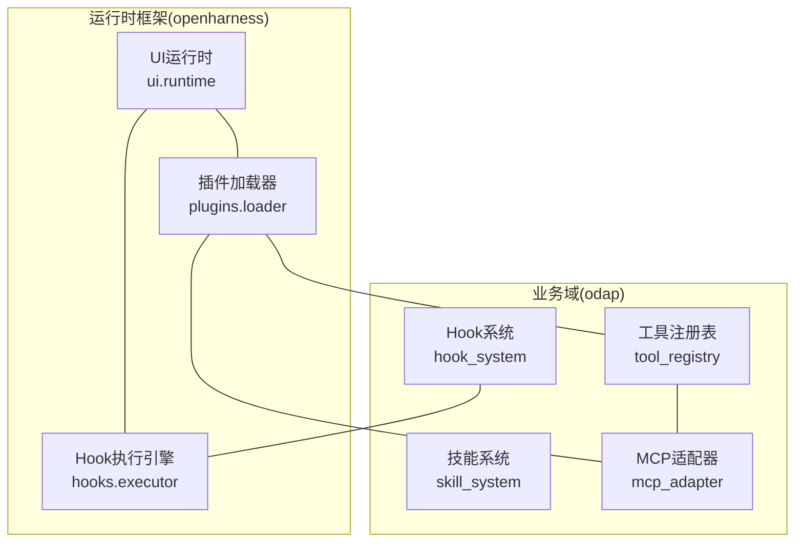
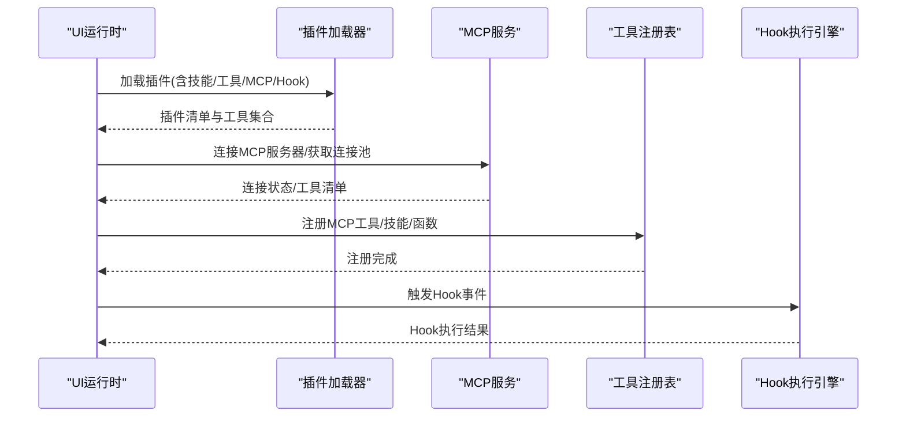
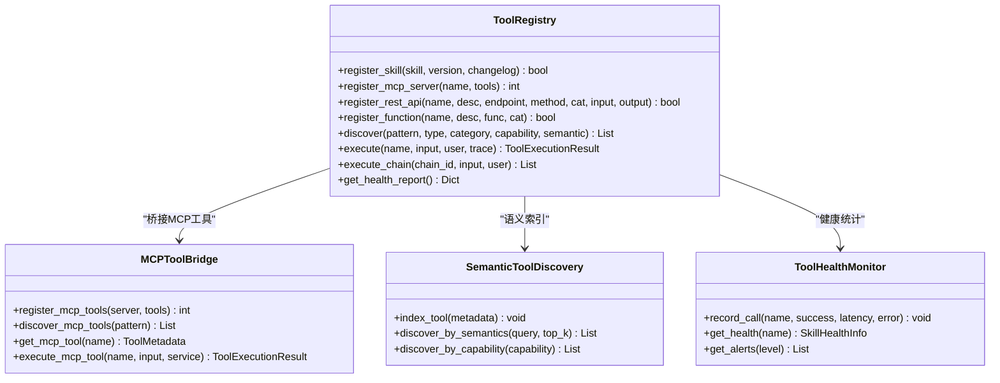
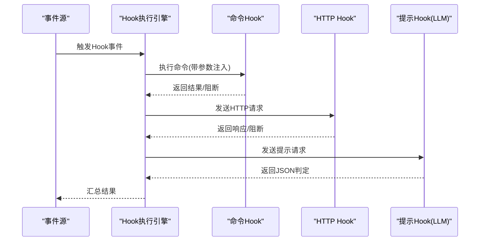
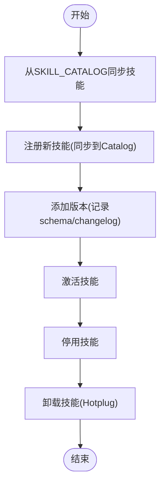
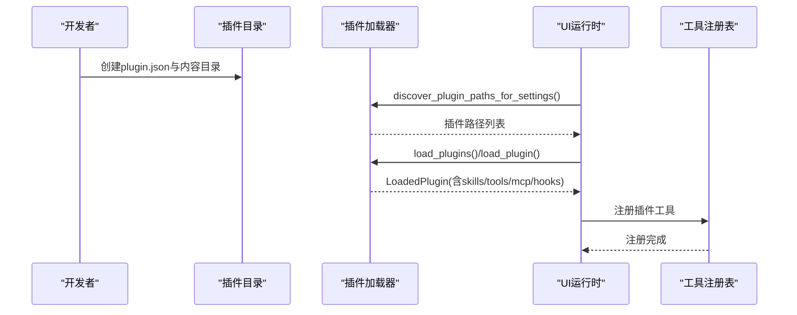
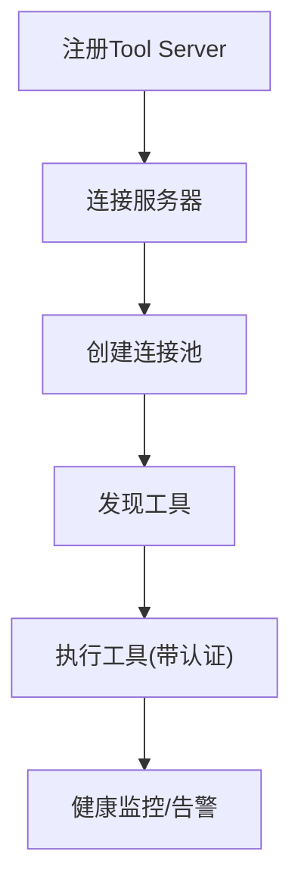
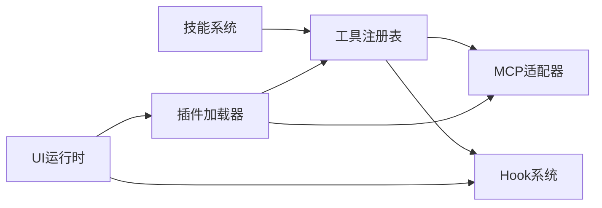

# 插件与扩展开发

<cite>
**本文引用的文件**
- [odap/biz/platform/tool_registry/__init__.py](file://odap/biz/platform/tool_registry/__init__.py)
- [odap/biz/platform/tool_registry/registry.py](file://odap/biz/platform/tool_registry/registry.py)
- [odap/biz/integration/hook_system/__init__.py](file://odap/biz/integration/hook_system/__init__.py)
- [odap/biz/integration/hook_system/services/hook_service.py](file://odap/biz/integration/hook_system/services/hook_service.py)
- [odap/biz/integration/hook_system/impl/hook_manager.py](file://odap/biz/integration/hook_system/impl/hook_manager.py)
- [odap/biz/platform/skill_system/__init__.py](file://odap/biz/platform/skill_system/__init__.py)
- [odap/biz/platform/skill_system/services/skill_service.py](file://odap/biz/platform/skill_system/services/skill_service.py)
- [odap/biz/platform/skill_system/impl/skill_manager.py](file://odap/biz/platform/skill_system/impl/skill_manager.py)
- [odap/biz/integration/mcp_adapter/__init__.py](file://odap/biz/integration/mcp_adapter/__init__.py)
- [odap/biz/integration/mcp_adapter/services/mcp_service.py](file://odap/biz/integration/mcp_adapter/services/mcp_service.py)
- [odap/biz/integration/mcp_adapter/impl/server_manager.py](file://odap/biz/integration/mcp_adapter/impl/server_manager.py)
- [odap/biz/integration/mcp_adapter/mcp_server_manager.py](file://odap/biz/integration/mcp_adapter/mcp_server_manager.py)
- [openharness/src/openharness/plugins/loader.py](file://openharness/src/openharness/plugins/loader.py)
- [openharness/src/openharness/ui/runtime.py](file://openharness/src/openharness/ui/runtime.py)
- [openharness/scripts/local_system_scenarios.py](file://openharness/scripts/local_system_scenarios.py)
- [openharness/tests/test_plugins/test_lifecycle_flow.py](file://openharness/tests/test_plugins/test_lifecycle_flow.py)
- [openharness/src/openharness/hooks/executor.py](file://openharness/src/openharness/hooks/executor.py)
</cite>

## 目录
1. [简介](#简介)
2. [项目结构](#项目结构)
3. [核心组件](#核心组件)
4. [架构总览](#架构总览)
5. [详细组件分析](#详细组件分析)
6. [依赖分析](#依赖分析)
7. [性能考虑](#性能考虑)
8. [故障排查指南](#故障排查指南)
9. [结论](#结论)
10. [附录](#附录)

## 简介
本指南面向ODAP平台的插件与扩展开发者，覆盖以下主题：
- 工具注册表系统：统一注册、发现、执行与健康监控，支持Skill、MCP、REST与原生函数工具。
- Hook系统：Hook类型、生命周期、事件处理与沙箱机制。
- 技能系统：技能定义、加载机制、生命周期管理与热插拔支持。
- OpenHarness插件：插件接口、配置管理、依赖注入、错误处理与生命周期。
- MCP协议适配器：连接池管理、工具服务器集成、认证机制。
- 第三方系统集成：最佳实践（API适配、数据转换、同步机制、故障恢复）。
- 性能优化与资源管理：内存使用、并发控制、缓存策略。
- 调试技巧、日志记录与监控指标配置。

## 项目结构
ODAP平台由“业务域”与“运行时框架”两部分组成：
- 业务域（odap）：工具注册表、Hook系统、技能系统、MCP适配等。
- 运行时框架（openharness）：插件加载、Hook执行引擎、UI运行时、MCP客户端等。

图示来源
- [odap/biz/platform/tool_registry/registry.py:403-800](file://odap/biz/platform/tool_registry/registry.py#L403-L800)
- [odap/biz/integration/hook_system/services/hook_service.py:9-82](file://odap/biz/integration/hook_system/services/hook_service.py#L9-L82)
- [odap/biz/platform/skill_system/services/skill_service.py:9-184](file://odap/biz/platform/skill_system/services/skill_service.py#L9-L184)
- [odap/biz/integration/mcp_adapter/services/mcp_service.py:8-71](file://odap/biz/integration/mcp_adapter/services/mcp_service.py#L8-L71)
- [openharness/src/openharness/plugins/loader.py:107-162](file://openharness/src/openharness/plugins/loader.py#L107-L162)
- [openharness/src/openharness/hooks/executor.py:41-78](file://openharness/src/openharness/hooks/executor.py#L41-L78)
- [openharness/src/openharness/ui/runtime.py:216-276](file://openharness/src/openharness/ui/runtime.py#L216-L276)

章节来源
- [odap/biz/platform/tool_registry/__init__.py:1-34](file://odap/biz/platform/tool_registry/__init__.py#L1-L34)
- [odap/biz/integration/hook_system/__init__.py:1-8](file://odap/biz/integration/hook_system/__init__.py#L1-L8)
- [odap/biz/platform/skill_system/__init__.py:1-10](file://odap/biz/platform/skill_system/__init__.py#L1-L10)
- [odap/biz/integration/mcp_adapter/__init__.py:1-8](file://odap/biz/integration/mcp_adapter/__init__.py#L1-L8)
- [openharness/src/openharness/plugins/loader.py:107-162](file://openharness/src/openharness/plugins/loader.py#L107-L162)

## 核心组件
- 工具注册表（统一管理Skill/MCP/REST/函数工具）
  - 提供注册、发现、执行、工具链、健康监控与语义发现。
  - 关键类：ToolRegistry、MCPToolBridge、SemanticToolDiscovery、ToolHealthMonitor。
- Hook系统（事件驱动的扩展点）
  - HookService封装注册、执行、列表；HookManager负责存储与执行；Sandbox隔离执行。
- 技能系统（技能定义、版本、生命周期与热插拔）
  - SkillService对外接口；SkillManager与Catalog双向同步；Hotplug支持加载/卸载。
- MCP适配器（Tool Server集成）
  - MCPService协调ToolServerManager与ConnectionPoolManager，提供连接池与工具发现。
- OpenHarness插件（插件生态）
  - 插件发现与加载、命令/技能/代理/工具/钩子/MCP配置解析、安装/卸载生命周期。

章节来源
- [odap/biz/platform/tool_registry/registry.py:403-800](file://odap/biz/platform/tool_registry/registry.py#L403-L800)
- [odap/biz/integration/hook_system/services/hook_service.py:9-82](file://odap/biz/integration/hook_system/services/hook_service.py#L9-L82)
- [odap/biz/platform/skill_system/services/skill_service.py:9-184](file://odap/biz/platform/skill_system/services/skill_service.py#L9-L184)
- [odap/biz/integration/mcp_adapter/services/mcp_service.py:8-71](file://odap/biz/integration/mcp_adapter/services/mcp_service.py#L8-L71)
- [openharness/src/openharness/plugins/loader.py:107-162](file://openharness/src/openharness/plugins/loader.py#L107-L162)

## 架构总览
ODAP平台通过“统一工具注册表”聚合各类工具来源，并在运行时由OpenHarness进行插件装配与Hook执行。MCP适配器负责与外部工具服务器交互，技能系统与Hook系统分别支撑“能力扩展”和“生命周期扩展”。

图示来源
- [openharness/src/openharness/ui/runtime.py:216-276](file://openharness/src/openharness/ui/runtime.py#L216-L276)
- [openharness/src/openharness/plugins/loader.py:107-162](file://openharness/src/openharness/plugins/loader.py#L107-L162)
- [odap/biz/integration/mcp_adapter/services/mcp_service.py:8-71](file://odap/biz/integration/mcp_adapter/services/mcp_service.py#L8-L71)
- [odap/biz/platform/tool_registry/registry.py:403-800](file://odap/biz/platform/tool_registry/registry.py#L403-L800)
- [openharness/src/openharness/hooks/executor.py:64-78](file://openharness/src/openharness/hooks/executor.py#L64-L78)

## 详细组件分析

### 工具注册表系统
- 设计目标
  - 统一管理Skill、MCP、REST与原生函数工具。
  - 支持运行时发现、健康监控、权限校验与工具链编排。
- 关键能力
  - 注册：register_skill/register_mcp_server/register_rest_api/register_function。
  - 发现：discover(pattern/type/category/capability/semantic_query)。
  - 执行：execute/execute_async，支持OPA权限检查与健康统计。
  - 工具链：register_tool_chain/execute_chain。
  - 健康监控：ToolHealthMonitor记录调用次数、成功率、平均耗时与告警。
  - 语义发现：SemanticToolDiscovery基于关键词、标签与能力打分排序。
- 数据模型
  - ToolMetadata/ToolRegistration/ToolChain/ToolChainStep/ToolExecutionResult。
  - ToolType/ToolCapability枚举。
- 使用建议
  - 优先通过统一注册表暴露工具，便于权限与健康治理。
  - 对MCP工具通过MCPToolBridge桥接，自动填充元数据与缓存。

图示来源
- [odap/biz/platform/tool_registry/registry.py:403-800](file://odap/biz/platform/tool_registry/registry.py#L403-L800)

章节来源
- [odap/biz/platform/tool_registry/registry.py:403-800](file://odap/biz/platform/tool_registry/registry.py#L403-L800)

### Hook系统
- Hook类型
  - 命令型：通过子进程执行外部脚本或二进制。
  - HTTP型：向远端HTTP端点发送事件负载。
  - 提示型/代理型：通过大模型判断是否允许事件继续。
- 生命周期与事件处理
  - HookService提供注册、查询、执行与列表接口。
  - HookExecutor根据事件类型选择执行路径：命令/HTTP/提示。
  - HookManager负责存储与执行记录。
- 沙箱机制
  - 命令Hook通过子进程执行，结合超时与阻断策略。
  - 提示型Hook通过LLM判定，返回严格JSON以决定是否放行。
- 最佳实践
  - 为Hook设置合理超时与阻断策略，避免影响主流程。
  - 将敏感逻辑放入沙箱或HTTP端点，减少直接命令执行。

图示来源
- [openharness/src/openharness/hooks/executor.py:64-78](file://openharness/src/openharness/hooks/executor.py#L64-L78)
- [openharness/src/openharness/hooks/executor.py:80-136](file://openharness/src/openharness/hooks/executor.py#L80-L136)
- [openharness/src/openharness/hooks/executor.py:138-167](file://openharness/src/openharness/hooks/executor.py#L138-L167)
- [openharness/src/openharness/hooks/executor.py:169-212](file://openharness/src/openharness/hooks/executor.py#L169-L212)
- [odap/biz/integration/hook_system/services/hook_service.py:9-82](file://odap/biz/integration/hook_system/services/hook_service.py#L9-L82)
- [odap/biz/integration/hook_system/impl/hook_manager.py:9-97](file://odap/biz/integration/hook_system/impl/hook_manager.py#L9-L97)

章节来源
- [odap/biz/integration/hook_system/services/hook_service.py:9-82](file://odap/biz/integration/hook_system/services/hook_service.py#L9-L82)
- [odap/biz/integration/hook_system/impl/hook_manager.py:9-97](file://odap/biz/integration/hook_system/impl/hook_manager.py#L9-L97)
- [openharness/src/openharness/hooks/executor.py:41-243](file://openharness/src/openharness/hooks/executor.py#L41-L243)

### 技能系统
- 技能定义与版本
  - SkillService提供注册、查询、更新、删除、版本添加、激活/停用等接口。
  - SkillManager与SKILL_CATALOG双向同步，保证持久化与一致性。
- 热插拔支持
  - HotplugManager配合SkillService实现加载/卸载技能，支持运行时启用/禁用。
- 生命周期管理
  - 从Catalog同步初始技能，Web端注册/变更同步回Catalog，状态变更同步至DomainHarness工具列表。
- 最佳实践
  - 为技能定义清晰的分类与标签，便于工具注册表语义发现。
  - 使用版本管理记录变更日志，便于审计与回滚。

图示来源
- [odap/biz/platform/skill_system/services/skill_service.py:9-184](file://odap/biz/platform/skill_system/services/skill_service.py#L9-L184)
- [odap/biz/platform/skill_system/impl/skill_manager.py:41-244](file://odap/biz/platform/skill_system/impl/skill_manager.py#L41-L244)

章节来源
- [odap/biz/platform/skill_system/services/skill_service.py:9-184](file://odap/biz/platform/skill_system/services/skill_service.py#L9-L184)
- [odap/biz/platform/skill_system/impl/skill_manager.py:33-244](file://odap/biz/platform/skill_system/impl/skill_manager.py#L33-L244)

### OpenHarness插件开发
- 插件接口与清单
  - 插件根目录需包含plugin.json或.claude-plugin/plugin.json。
  - 支持skills_dir/commands_dir/agents_dir/tools_dir/hooks_file/mcp_file等配置项。
- 配置管理
  - 插件发现：discover_plugin_paths/discover_plugin_paths_for_settings。
  - 加载：load_plugins/load_plugin，解析技能、命令、代理、工具、Hook、MCP配置。
- 依赖注入与运行时装配
  - UI运行时加载插件后，构建工具注册表，注册插件提供的工具。
  - Hook执行引擎根据配置加载Hook注册表并执行。
- 错误处理
  - 插件加载失败会记录调试日志；命令Hook超时/失败可阻断后续流程。
- 生命周期
  - 安装/卸载：测试用例展示安装、加载、执行、卸载完整流程。

图示来源
- [openharness/src/openharness/plugins/loader.py:107-162](file://openharness/src/openharness/plugins/loader.py#L107-L162)
- [openharness/src/openharness/plugins/loader.py:660-711](file://openharness/src/openharness/plugins/loader.py#L660-L711)
- [openharness/src/openharness/ui/runtime.py:216-276](file://openharness/src/openharness/ui/runtime.py#L216-L276)
- [openharness/scripts/local_system_scenarios.py:96-136](file://openharness/scripts/local_system_scenarios.py#L96-L136)
- [openharness/tests/test_plugins/test_lifecycle_flow.py:56-95](file://openharness/tests/test_plugins/test_lifecycle_flow.py#L56-L95)

章节来源
- [openharness/src/openharness/plugins/loader.py:107-162](file://openharness/src/openharness/plugins/loader.py#L107-L162)
- [openharness/src/openharness/plugins/loader.py:660-711](file://openharness/src/openharness/plugins/loader.py#L660-L711)
- [openharness/src/openharness/ui/runtime.py:216-276](file://openharness/src/openharness/ui/runtime.py#L216-L276)
- [openharness/scripts/local_system_scenarios.py:96-136](file://openharness/scripts/local_system_scenarios.py#L96-L136)
- [openharness/tests/test_plugins/test_lifecycle_flow.py:56-95](file://openharness/tests/test_plugins/test_lifecycle_flow.py#L56-L95)

### MCP协议适配器
- 连接池管理
  - MCPService协调ToolServerManager与ConnectionPoolManager，提供连接获取/释放与池状态查询。
- 工具服务器集成
  - ToolServerManager负责注册/连接/断开/发现工具；MCPService封装上层API。
- 认证机制
  - 通过MCP协议标准字段与环境变量传递认证信息（如令牌），在工具服务器侧验证。
- 开发流程
  - 注册Tool Server → 连接 → 获取连接池 → 发现工具 → 执行工具 → 健康监控。

图示来源
- [odap/biz/integration/mcp_adapter/services/mcp_service.py:8-71](file://odap/biz/integration/mcp_adapter/services/mcp_service.py#L8-L71)
- [odap/biz/integration/mcp_adapter/impl/server_manager.py:9-81](file://odap/biz/integration/mcp_adapter/impl/server_manager.py#L9-L81)
- [odap/biz/integration/mcp_adapter/mcp_server_manager.py:1-57](file://odap/biz/integration/mcp_adapter/mcp_server_manager.py#L1-L57)

章节来源
- [odap/biz/integration/mcp_adapter/services/mcp_service.py:8-71](file://odap/biz/integration/mcp_adapter/services/mcp_service.py#L8-L71)
- [odap/biz/integration/mcp_adapter/impl/server_manager.py:9-81](file://odap/biz/integration/mcp_adapter/impl/server_manager.py#L9-L81)
- [odap/biz/integration/mcp_adapter/mcp_server_manager.py:1-57](file://odap/biz/integration/mcp_adapter/mcp_server_manager.py#L1-L57)

### 第三方系统集成最佳实践
- API适配
  - 使用统一工具注册表的REST工具类型，定义输入输出Schema，便于权限与健康治理。
- 数据转换
  - 在工具执行前后进行Schema校验与转换，确保跨系统兼容性。
- 同步机制
  - 对外服务采用幂等设计，必要时引入重试与去重。
- 故障恢复
  - 结合健康监控阈值与告警，自动降级与熔断；对关键路径提供降级方案。

[本节为通用指导，不直接分析具体文件]

## 依赖分析
- 组件耦合
  - 工具注册表与MCP适配器通过MCPToolBridge解耦，便于扩展不同工具服务器。
  - Hook系统与运行时框架通过Hook执行引擎解耦，支持多事件源。
  - 技能系统与Catalog双向同步，保证一致性与持久化。
- 外部依赖
  - MCP协议、HTTP客户端、子进程沙箱、LLM推理服务等。

图示来源
- [odap/biz/platform/tool_registry/registry.py:403-800](file://odap/biz/platform/tool_registry/registry.py#L403-L800)
- [odap/biz/integration/mcp_adapter/services/mcp_service.py:8-71](file://odap/biz/integration/mcp_adapter/services/mcp_service.py#L8-L71)
- [odap/biz/integration/hook_system/services/hook_service.py:9-82](file://odap/biz/integration/hook_system/services/hook_service.py#L9-L82)
- [openharness/src/openharness/plugins/loader.py:107-162](file://openharness/src/openharness/plugins/loader.py#L107-L162)
- [openharness/src/openharness/ui/runtime.py:216-276](file://openharness/src/openharness/ui/runtime.py#L216-L276)

章节来源
- [odap/biz/platform/tool_registry/registry.py:403-800](file://odap/biz/platform/tool_registry/registry.py#L403-L800)
- [odap/biz/integration/mcp_adapter/services/mcp_service.py:8-71](file://odap/biz/integration/mcp_adapter/services/mcp_service.py#L8-L71)
- [odap/biz/integration/hook_system/services/hook_service.py:9-82](file://odap/biz/integration/hook_system/services/hook_service.py#L9-L82)
- [openharness/src/openharness/plugins/loader.py:107-162](file://openharness/src/openharness/plugins/loader.py#L107-L162)
- [openharness/src/openharness/ui/runtime.py:216-276](file://openharness/src/openharness/ui/runtime.py#L216-L276)

## 性能考虑
- 内存使用
  - 工具注册表维护工具元数据与执行历史，注意限制历史大小（默认1000条）。
  - Hook执行引擎按事件异步执行，避免阻塞主线程。
- 并发控制
  - 工具执行支持同步/异步两种模式；MCP连接池按服务器维度管理连接。
- 缓存策略
  - MCP工具元数据缓存，减少重复发现成本。
  - 健康监控阈值可调，平衡告警灵敏度与系统压力。

[本节为通用指导，不直接分析具体文件]

## 故障排查指南
- 插件安装/卸载问题
  - 使用测试用例中的安装/加载/卸载流程定位问题；确认插件清单与目录结构正确。
- Hook执行失败
  - 检查命令Hook超时、阻断策略与沙箱可用性；HTTP Hook检查网络与鉴权头。
- 工具执行异常
  - 查看工具健康报告与告警；核对权限配置与Schema校验。
- MCP连接异常
  - 检查服务器连接状态、连接池可用性与工具发现结果。

章节来源
- [openharness/tests/test_plugins/test_lifecycle_flow.py:56-95](file://openharness/tests/test_plugins/test_lifecycle_flow.py#L56-L95)
- [openharness/src/openharness/hooks/executor.py:80-136](file://openharness/src/openharness/hooks/executor.py#L80-L136)
- [odap/biz/platform/tool_registry/registry.py:719-740](file://odap/biz/platform/tool_registry/registry.py#L719-L740)
- [odap/biz/integration/mcp_adapter/services/mcp_service.py:56-71](file://odap/biz/integration/mcp_adapter/services/mcp_service.py#L56-L71)

## 结论
ODAP平台通过统一工具注册表、Hook系统、技能系统与MCP适配器，构建了可扩展、可观测、可治理的插件生态。OpenHarness进一步提供了完善的插件加载、运行时装配与Hook执行能力。遵循本文档的开发与集成最佳实践，可在保障安全与性能的前提下快速扩展平台能力。

[本节为总结，不直接分析具体文件]

## 附录
- 快速开发清单
  - 插件：准备plugin.json与内容目录，实现技能/工具/MCP/Hook配置。
  - 工具：通过工具注册表统一暴露，定义输入输出Schema与能力标签。
  - Hook：按事件类型选择命令/HTTP/提示型，设置超时与阻断策略。
  - MCP：注册服务器、建立连接池、发现工具、执行并监控健康。
  - 技能：定义分类与标签，使用版本管理与热插拔。

[本节为通用指导，不直接分析具体文件]