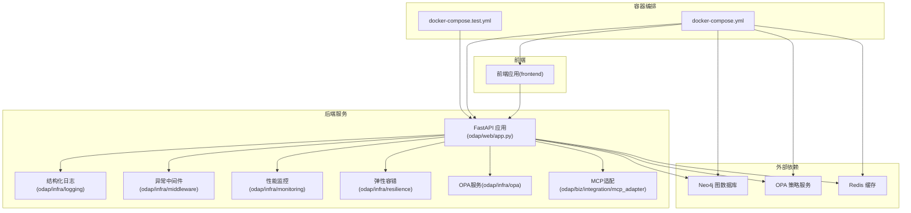
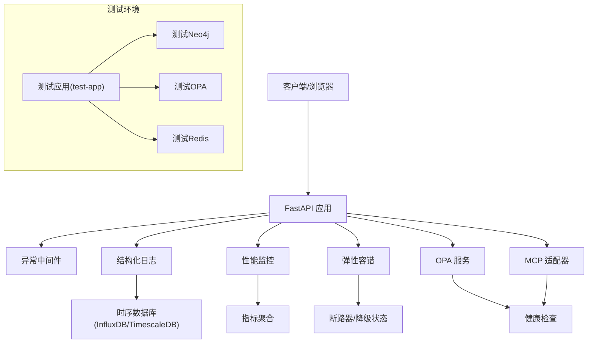
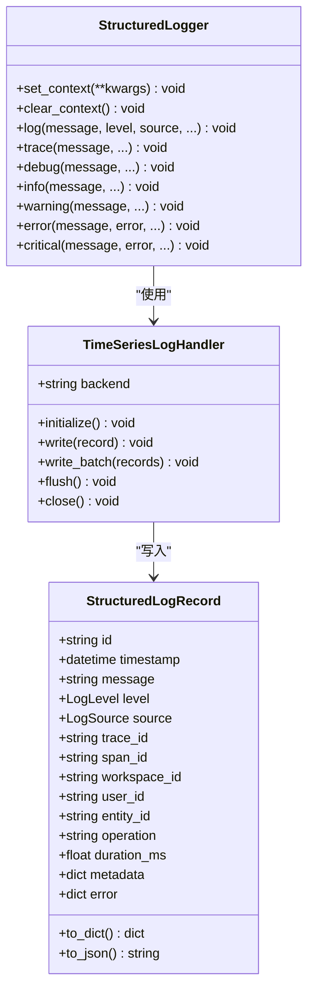
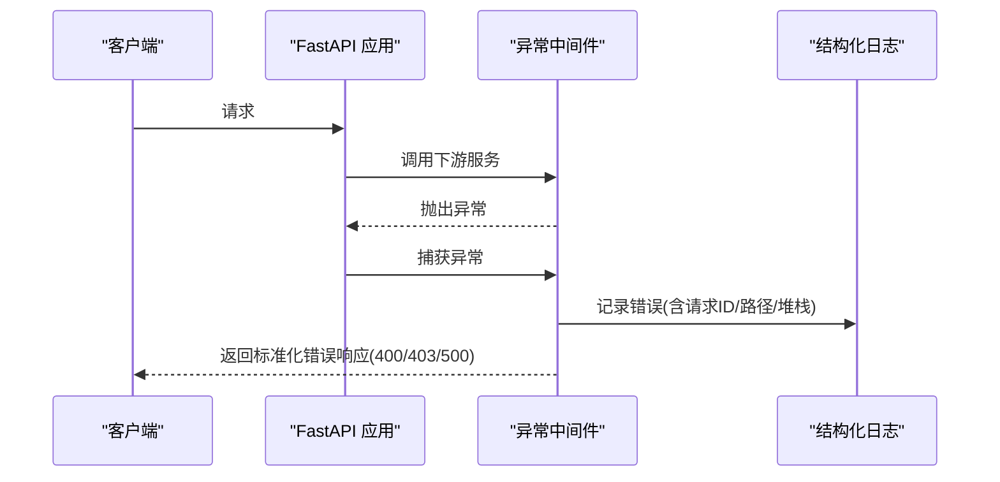
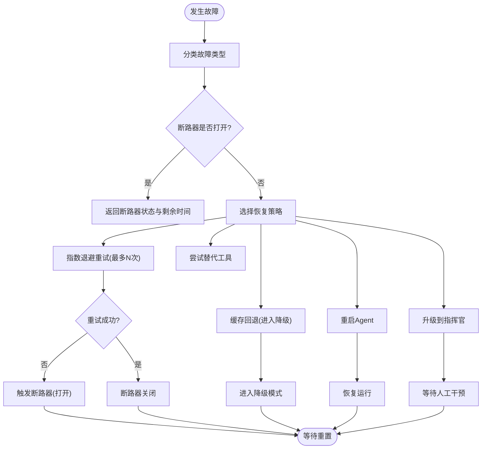
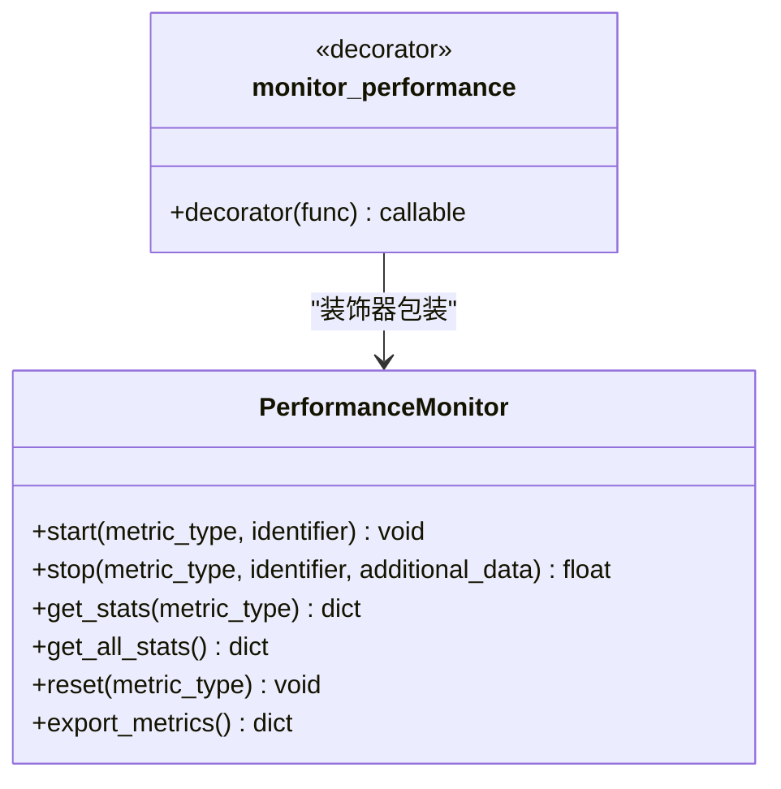
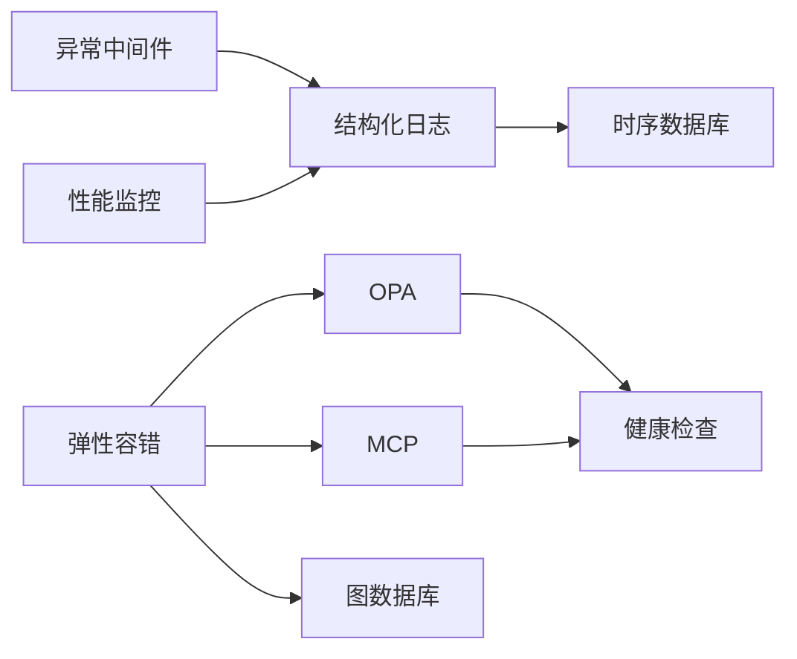

# 故障排除与调试

<cite>
**本文引用的文件**
- [odap/infra/logging/structured_logging.py](file://odap/infra/logging/structured_logging.py)
- [odap/infra/middleware/exception_handler.py](file://odap/infra/middleware/exception_handler.py)
- [odap/infra/resilience/fault_tolerance.py](file://odap/infra/resilience/fault_tolerance.py)
- [odap/infra/monitoring/performance_monitor.py](file://odap/infra/monitoring/performance_monitor.py)
- [odap/infra/opa/opa_service.py](file://odap/infra/opa/opa_service.py)
- [odap/biz/integration/mcp_adapter/mcp_server_manager.py](file://odap/biz/integration/mcp_adapter/mcp_server_manager.py)
- [odap/biz/integration/frontend_compat/api/routes.py](file://odap/biz/integration/frontend_compat/api/routes.py)
- [odap/biz/core/swarm_orchestrator/DESIGN.md](file://docs/03-modules/swarm_orchestrator/DESIGN.md)
- [tests/integration/test_api_integration.py](file://tests/integration/test_api_integration.py)
- [tests/e2e/test_e2e_flows.py](file://tests/e2e/test_e2e_flows.py)
- [tests/e2e/test_military_e2e_flow.py](file://tests/e2e/test_military_e2e_flow.py)
- [docker/docker-compose.yml](file://docker/docker-compose.yml)
- [docker/docker-compose.test.yml](file://docker/docker-compose.test.yml)
- [config/agent_config.yaml](file://config/agent_config.yaml)
- [docs/02-architecture/ARCHITECTURE_FULL_CHAIN_DEEP.md](file://docs/02-architecture/ARCHITECTURE_FULL_CHAIN_DEEP.md)
- [openharness/scripts/test_docker_sandbox_e2e.py](file://openharness/scripts/test_docker_sandbox_e2e.py)
</cite>

## 目录
1. [简介](#简介)
2. [项目结构](#项目结构)
3. [核心组件](#核心组件)
4. [架构总览](#架构总览)
5. [详细组件分析](#详细组件分析)
6. [依赖分析](#依赖分析)
7. [性能考量](#性能考量)
8. [故障排除指南](#故障排除指南)
9. [结论](#结论)
10. [附录](#附录)

## 简介
本指南面向ODAP平台的运维与开发人员，提供系统化的故障排除与调试方法。内容涵盖启动失败、连接超时、内存泄漏、性能瓶颈等常见问题的诊断步骤；日志系统的使用与结构化日志格式、日志级别配置、关键指标监控与日志分析技巧；调试工具与技巧（Python调试器、浏览器开发者工具、网络抓包、性能分析工具）；错误处理与异常管理（异常类型、错误码定义、降级策略、重试机制）；测试环境搭建与使用（单元测试、集成测试、端到端测试）；性能分析与优化建议（CPU使用率、内存占用、数据库查询、缓存策略）；以及监控告警配置与故障自愈机制。

## 项目结构
ODAP平台由后端Python服务、前端React应用、容器编排与测试环境组成。后端包含基础设施层（日志、中间件、监控、弹性、OPA、MCP适配）、业务域模块（本体、Agent、决策、仿真等），并通过FastAPI提供REST接口。容器编排使用Docker Compose，测试环境独立于主服务，便于隔离执行。

**图表来源**
- [docker/docker-compose.yml](file://docker/docker-compose.yml)
- [docker/docker-compose.test.yml](file://docker/docker-compose.test.yml)

**章节来源**
- [docker/docker-compose.yml](file://docker/docker-compose.yml)
- [docker/docker-compose.test.yml](file://docker/docker-compose.test.yml)

## 核心组件
- 结构化日志系统：统一日志格式、支持时序数据库持久化、OpenTelemetry追踪上下文。
- 全局异常处理中间件：标准化错误响应、区分HTTP状态码与错误类型。
- 弹性容错与断路器：故障分类、降级策略、断路器状态机与恢复动作。
- 性能监控：指标采集、统计分析、装饰器埋点。
- OPA健康检查与策略管理：健康探测、策略热更新、缓存与回退。
- MCP服务器健康检查：连接探测、连续失败计数、延迟统计。
- 前端兼容API错误记录：统一错误日志与审计上报。
- 测试环境：独立Compose配置，集成测试与端到端测试执行。

**章节来源**
- [odap/infra/logging/structured_logging.py](file://odap/infra/logging/structured_logging.py)
- [odap/infra/middleware/exception_handler.py](file://odap/infra/middleware/exception_handler.py)
- [odap/infra/resilience/fault_tolerance.py](file://odap/infra/resilience/fault_tolerance.py)
- [odap/infra/monitoring/performance_monitor.py](file://odap/infra/monitoring/performance_monitor.py)
- [odap/infra/opa/opa_service.py](file://odap/infra/opa/opa_service.py)
- [odap/biz/integration/mcp_adapter/mcp_server_manager.py](file://odap/biz/integration/mcp_adapter/mcp_server_manager.py)
- [odap/biz/integration/frontend_compat/api/routes.py](file://odap/biz/integration/frontend_compat/api/routes.py)

## 架构总览
下图展示了故障排除与调试相关的架构交互：日志系统记录结构化事件，异常中间件拦截未处理异常并输出统一错误响应，弹性容错模块对Agent故障进行分类与恢复，性能监控模块采集关键指标，OPA与MCP适配器提供外部依赖健康检查，测试环境通过Compose快速拉起服务并执行测试。

**图表来源**
- [odap/infra/logging/structured_logging.py](file://odap/infra/logging/structured_logging.py)
- [odap/infra/middleware/exception_handler.py](file://odap/infra/middleware/exception_handler.py)
- [odap/infra/monitoring/performance_monitor.py](file://odap/infra/monitoring/performance_monitor.py)
- [odap/infra/resilience/fault_tolerance.py](file://odap/infra/resilience/fault_tolerance.py)
- [odap/infra/opa/opa_service.py](file://odap/infra/opa/opa_service.py)
- [odap/biz/integration/mcp_adapter/mcp_server_manager.py](file://odap/biz/integration/mcp_adapter/mcp_server_manager.py)
- [docker/docker-compose.test.yml](file://docker/docker-compose.test.yml)

## 详细组件分析

### 结构化日志系统
- 设计要点：统一日志级别、来源、追踪ID与跨度ID，支持元数据与错误对象，时序数据库持久化（InfluxDB/TimescaleDB）。
- 使用建议：在关键路径埋点，设置上下文（如workspace_id、user_id、entity_id），确保错误对象包含类型与消息。
- 存储后端：默认内存回退，生产环境建议配置InfluxDB或TimescaleDB。

**图表来源**
- [odap/infra/logging/structured_logging.py](file://odap/infra/logging/structured_logging.py)

**章节来源**
- [odap/infra/logging/structured_logging.py](file://odap/infra/logging/structured_logging.py)

### 全局异常处理中间件
- 设计要点：拦截未捕获异常，区分HTTP状态码（如400/403/500），记录请求ID与路径，输出标准化错误响应。
- 建议：结合结构化日志记录异常堆栈，便于后续检索与分析。

**图表来源**
- [odap/infra/middleware/exception_handler.py](file://odap/infra/middleware/exception_handler.py)
- [odap/infra/logging/structured_logging.py](file://odap/infra/logging/structured_logging.py)

**章节来源**
- [odap/infra/middleware/exception_handler.py](file://odap/infra/middleware/exception_handler.py)

### 弹性容错与断路器
- 设计要点：故障类型分类（超时、OPA拒绝、图数据库不可用、网络错误、工具执行错误、意外异常），恢复策略（指数退避重试、升级指挥官、缓存回退、替代工具、重启Agent、降级模式），断路器状态机（open/half_open/closed）。
- 建议：针对不同Agent类型配置差异化降级能力与限制，结合健康监控与告警联动。

**图表来源**
- [odap/infra/resilience/fault_tolerance.py](file://odap/infra/resilience/fault_tolerance.py)

**章节来源**
- [odap/infra/resilience/fault_tolerance.py](file://odap/infra/resilience/fault_tolerance.py)

### 性能监控
- 设计要点：支持LLM调用、数据库查询、API请求、工具执行等指标的开始/结束计时，统计P95/P99等分位数，装饰器埋点。
- 建议：在关键路径（如本体摄入、问答、Agent执行）添加监控，结合日志追踪ID定位慢调用。

**图表来源**
- [odap/infra/monitoring/performance_monitor.py](file://odap/infra/monitoring/performance_monitor.py)

**章节来源**
- [odap/infra/monitoring/performance_monitor.py](file://odap/infra/monitoring/performance_monitor.py)

### OPA健康检查与策略管理
- 设计要点：OPA健康检查（短超时）、策略热更新、策略沙箱、批量权限检查与缓存、自动加载策略。
- 建议：当OPA不可用时启用回退策略，结合断路器避免雪崩。

**章节来源**
- [odap/infra/opa/opa_service.py](file://odap/infra/opa/opa_service.py)

### MCP服务器健康检查
- 设计要点：定期GET /health，记录连续失败次数、最后错误、延迟，支持自动健康检查线程。
- 建议：与断路器联动，超过阈值进入降级或熔断。

**章节来源**
- [odap/biz/integration/mcp_adapter/mcp_server_manager.py](file://odap/biz/integration/mcp_adapter/mcp_server_manager.py)

### 前端兼容API错误记录
- 设计要点：统一记录错误日志并异步上报审计系统，便于溯源与追踪。
- 建议：在前端兼容层捕获异常并调用此接口，确保上下文信息完整。

**章节来源**
- [odap/biz/integration/frontend_compat/api/routes.py](file://odap/biz/integration/frontend_compat/api/routes.py)

## 依赖分析
- 组件耦合：异常中间件与日志系统强耦合，性能监控与日志系统弱耦合但可共享追踪ID；弹性容错与断路器与外部依赖（OPA/MCP/图数据库）交互频繁。
- 外部依赖：Neo4j、OPA、Redis、InfluxDB/TimescaleDB。
- 测试依赖：独立Compose服务，隔离数据库、策略服务与缓存。

**图表来源**
- [odap/infra/middleware/exception_handler.py](file://odap/infra/middleware/exception_handler.py)
- [odap/infra/logging/structured_logging.py](file://odap/infra/logging/structured_logging.py)
- [odap/infra/resilience/fault_tolerance.py](file://odap/infra/resilience/fault_tolerance.py)
- [odap/infra/opa/opa_service.py](file://odap/infra/opa/opa_service.py)
- [odap/biz/integration/mcp_adapter/mcp_server_manager.py](file://odap/biz/integration/mcp_adapter/mcp_server_manager.py)

**章节来源**
- [docker/docker-compose.yml](file://docker/docker-compose.yml)
- [docker/docker-compose.test.yml](file://docker/docker-compose.test.yml)

## 性能考量
- CPU与内存：结合系统资源监控（psutil）与容器资源限制，识别热点路径与内存泄漏。
- 数据库：关注Neo4j查询计划与索引，避免全表扫描；合理使用事务与批处理。
- 缓存：利用Redis缓存热点数据与策略结果，结合OPA策略缓存与回退。
- 指标定义：参考架构文档中的关键指标集合，建立P95/P99延迟、吞吐量、错误率等KPI。

**章节来源**
- [docs/02-architecture/ARCHITECTURE_FULL_CHAIN_DEEP.md](file://docs/02-architecture/ARCHITECTURE_FULL_CHAIN_DEEP.md)
- [odap/infra/monitoring/performance_monitor.py](file://odap/infra/monitoring/performance_monitor.py)

## 故障排除指南

### 启动失败
- 排查步骤
  - 查看容器健康检查与日志：确认应用端口、依赖服务（Neo4j、OPA、Redis）健康。
  - 检查环境变量与配置文件：核对数据库URL、OPA地址、缓存地址。
  - 使用测试Compose快速定位：在测试环境中执行pytest，观察依赖服务是否就绪。
- 关联文件
  - [docker/docker-compose.yml](file://docker/docker-compose.yml)
  - [docker/docker-compose.test.yml](file://docker/docker-compose.test.yml)

**章节来源**
- [docker/docker-compose.yml](file://docker/docker-compose.yml)
- [docker/docker-compose.test.yml](file://docker/docker-compose.test.yml)

### 连接超时
- 排查步骤
  - OPA连接：检查OPA健康端点与超时设置，必要时启用回退策略。
  - MCP连接：检查MCP服务器健康检查与延迟统计，超过阈值触发断路器。
  - 数据库连接：确认Neo4j连接参数、驱动版本与网络连通性。
- 关联文件
  - [odap/infra/opa/opa_service.py](file://odap/infra/opa/opa_service.py)
  - [odap/biz/integration/mcp_adapter/mcp_server_manager.py](file://odap/biz/integration/mcp_adapter/mcp_server_manager.py)

**章节来源**
- [odap/infra/opa/opa_service.py](file://odap/infra/opa/opa_service.py)
- [odap/biz/integration/mcp_adapter/mcp_server_manager.py](file://odap/biz/integration/mcp_adapter/mcp_server_manager.py)

### 内存泄漏
- 排查步骤
  - 使用系统资源监控（psutil）与容器内存指标，识别异常增长。
  - 在关键路径添加性能监控，定位长时间运行的任务或未释放的对象。
  - 检查缓存与策略缓存大小与TTL，避免无限增长。
- 关联文件
  - [odap/infra/monitoring/performance_monitor.py](file://odap/infra/monitoring/performance_monitor.py)

**章节来源**
- [odap/infra/monitoring/performance_monitor.py](file://odap/infra/monitoring/performance_monitor.py)

### 性能瓶颈
- 排查步骤
  - 采集关键指标：LLM调用、数据库查询、API请求、工具执行的P95/P99延迟。
  - 结合结构化日志与追踪ID，定位慢调用与异常堆栈。
  - 优化策略：引入缓存、批量处理、异步执行、断路器与降级。
- 关联文件
  - [odap/infra/monitoring/performance_monitor.py](file://odap/infra/monitoring/performance_monitor.py)
  - [odap/infra/logging/structured_logging.py](file://odap/infra/logging/structured_logging.py)

**章节来源**
- [odap/infra/monitoring/performance_monitor.py](file://odap/infra/monitoring/performance_monitor.py)
- [odap/infra/logging/structured_logging.py](file://odap/infra/logging/structured_logging.py)

### 日志系统使用
- 结构化日志格式
  - 字段：id、timestamp、message、level、source、trace_id、span_id、workspace_id、user_id、entity_id、operation、duration_ms、metadata、error。
  - 输出：JSON字符串，便于解析与查询。
- 日志级别配置
  - 使用结构化日志记录器设置上下文，统一错误与警告级别。
- 关键指标监控
  - 将日志写入时序数据库，建立查询与告警规则。
- 日志分析技巧
  - 利用trace_id串联一次请求的全链路日志，结合性能监控定位慢点。
- 关联文件
  - [odap/infra/logging/structured_logging.py](file://odap/infra/logging/structured_logging.py)

**章节来源**
- [odap/infra/logging/structured_logging.py](file://odap/infra/logging/structured_logging.py)

### 调试工具与技巧
- Python调试器：在异常中间件捕获异常后，结合结构化日志堆栈定位问题。
- 浏览器开发者工具：检查网络请求、响应状态码与错误信息。
- 网络抓包：使用Wireshark或tcpdump分析服务间通信（如Neo4j Bolt、OPA gRPC）。
- 性能分析工具：使用pprof、py-spy或cProfile分析CPU与内存热点。
- 关联文件
  - [odap/infra/middleware/exception_handler.py](file://odap/infra/middleware/exception_handler.py)
  - [odap/infra/logging/structured_logging.py](file://odap/infra/logging/structured_logging.py)

**章节来源**
- [odap/infra/middleware/exception_handler.py](file://odap/infra/middleware/exception_handler.py)
- [odap/infra/logging/structured_logging.py](file://odap/infra/logging/structured_logging.py)

### 错误处理与异常管理
- 异常类型与错误码
  - 自定义API错误类型（ValidationError、NotFoundError、ConflictError），统一错误响应结构。
- 降级策略
  - 断路器打开时返回推荐动作与剩余时间；缓存回退进入降级模式。
- 重试机制
  - 指数退避重试，超过最大次数触发断路器；区分可重试异常与不可重试异常。
- 关联文件
  - [odap/infra/middleware/exception_handler.py](file://odap/infra/middleware/exception_handler.py)
  - [odap/infra/resilience/fault_tolerance.py](file://odap/infra/resilience/fault_tolerance.py)

**章节来源**
- [odap/infra/middleware/exception_handler.py](file://odap/infra/middleware/exception_handler.py)
- [odap/infra/resilience/fault_tolerance.py](file://odap/infra/resilience/fault_tolerance.py)

### 测试环境搭建与使用
- 单元测试调试：使用pytest，配合Mock与AsyncMock隔离外部依赖。
- 集成测试执行：通过测试Compose拉起Neo4j、OPA、Redis，执行端到端API测试。
- 端到端测试定位：使用TestClient与Mock注入，覆盖工作空间、本体管理、场景管理、数据摄入、问答等核心流程。
- 关联文件
  - [docker/docker-compose.test.yml](file://docker/docker-compose.test.yml)
  - [tests/integration/test_api_integration.py](file://tests/integration/test_api_integration.py)
  - [tests/e2e/test_e2e_flows.py](file://tests/e2e/test_e2e_flows.py)
  - [tests/e2e/test_military_e2e_flow.py](file://tests/e2e/test_military_e2e_flow.py)
  - [openharness/scripts/test_docker_sandbox_e2e.py](file://openharness/scripts/test_docker_sandbox_e2e.py)

**章节来源**
- [docker/docker-compose.test.yml](file://docker/docker-compose.test.yml)
- [tests/integration/test_api_integration.py](file://tests/integration/test_api_integration.py)
- [tests/e2e/test_e2e_flows.py](file://tests/e2e/test_e2e_flows.py)
- [tests/e2e/test_military_e2e_flow.py](file://tests/e2e/test_military_e2e_flow.py)
- [openharness/scripts/test_docker_sandbox_e2e.py](file://openharness/scripts/test_docker_sandbox_e2e.py)

### 监控告警与故障自愈
- 关键指标定义：参考架构文档中的阶段关键指标（解析成功率、实体抽取准确率、处理耗时、LLM调用次数、队列积压、并发饱和度、响应延迟、会话摘要压缩率、上下文token利用率、Skill执行成功率、OPA拒绝率、执行延迟、参数有效性、热重载延迟、版本切换频率等）。
- 阈值设置：基于历史数据与SLA设定P95/P99阈值，结合断路器与降级策略。
- 告警规则：基于健康监控组件（系统资源、外部依赖、性能指标）生成告警。
- 故障自愈：断路器自动重置、缓存回退、降级模式、重启Agent等。
- 关联文件
  - [docs/02-architecture/ARCHITECTURE_FULL_CHAIN_DEEP.md](file://docs/02-architecture/ARCHITECTURE_FULL_CHAIN_DEEP.md)
  - [odap/biz/core/swarm_orchestrator/DESIGN.md](file://docs/03-modules/swarm_orchestrator/DESIGN.md)
  - [odap/infra/resilience/fault_tolerance.py](file://odap/infra/resilience/fault_tolerance.py)

**章节来源**
- [docs/02-architecture/ARCHITECTURE_FULL_CHAIN_DEEP.md](file://docs/02-architecture/ARCHITECTURE_FULL_CHAIN_DEEP.md)
- [odap/biz/core/swarm_orchestrator/DESIGN.md](file://docs/03-modules/swarm_orchestrator/DESIGN.md)
- [odap/infra/resilience/fault_tolerance.py](file://odap/infra/resilience/fault_tolerance.py)

## 结论
本指南提供了ODAP平台从日志、异常、弹性、监控到测试与告警的全链路故障排除与调试方法。建议在日常运维中：
- 统一日志格式与追踪ID，结合时序数据库建立可检索的日志体系；
- 使用断路器与降级策略保护系统，避免级联故障；
- 以性能监控为抓手，持续优化关键路径；
- 通过测试环境快速复现与验证问题；
- 基于架构文档的关键指标建立完善的监控告警与自愈机制。

## 附录
- 配置示例：Agent Provider配置（默认OpenAI，可切换Anthropic/HTTP）。
- 关联文件
  - [config/agent_config.yaml](file://config/agent_config.yaml)

**章节来源**
- [config/agent_config.yaml](file://config/agent_config.yaml)