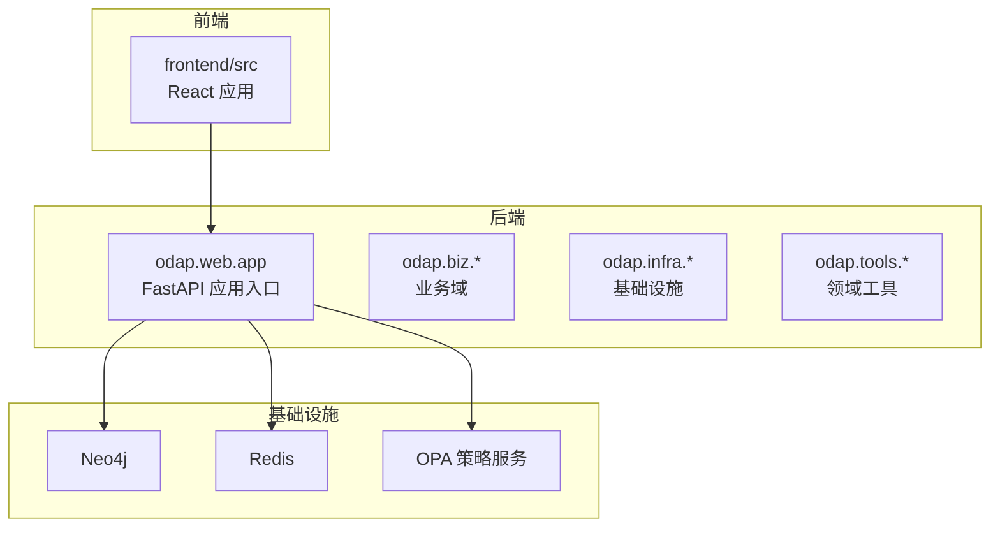
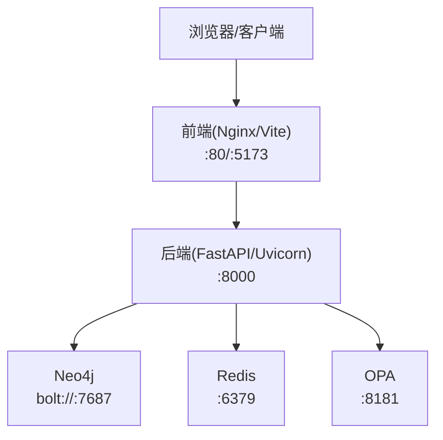
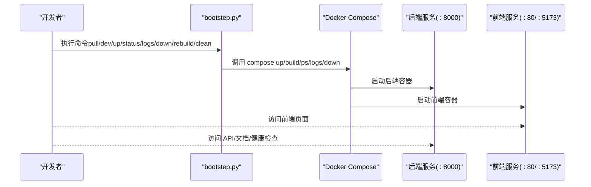
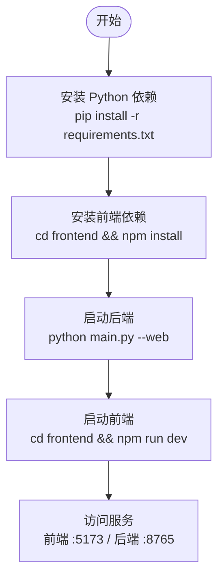
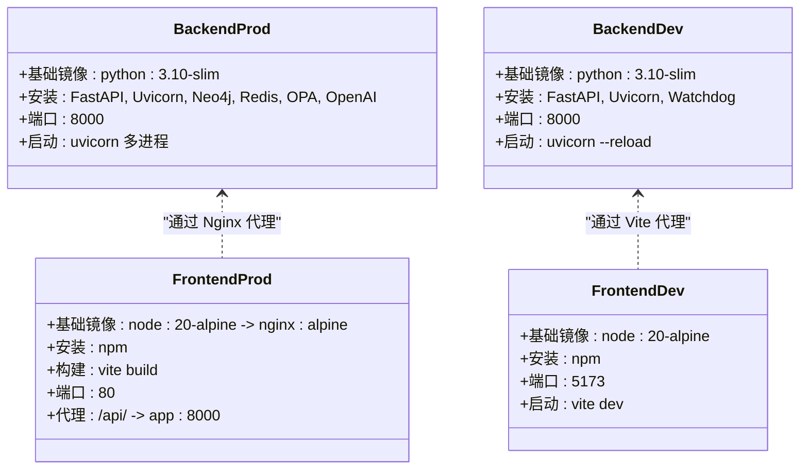
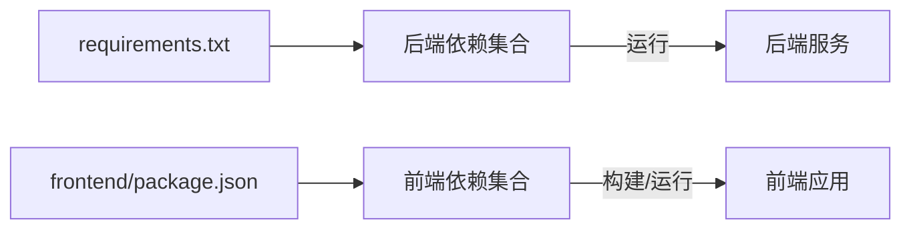

# 快速开始

<cite>
**本文引用的文件**
- [README.md](file://README.md)
- [bootstep.py](file://bootstep.py)
- [docker/docker-compose.yml](file://docker/docker-compose.yml)
- [docker/docker-compose.override.yml](file://docker/docker-compose.override.yml)
- [docker/Dockerfile](file://docker/Dockerfile)
- [docker/Dockerfile.dev](file://docker/Dockerfile.dev)
- [docker/podman-compose-win-fix.py](file://docker/podman-compose-win-fix.py)
- [frontend/Dockerfile](file://frontend/Dockerfile)
- [frontend/Dockerfile.dev](file://frontend/Dockerfile.dev)
- [frontend/package.json](file://frontend/package.json)
- [requirements.txt](file://requirements.txt)
- [main.py](file://main.py)
- [pyproject.toml](file://pyproject.toml)
</cite>

## 目录
1. [简介](#简介)
2. [项目结构](#项目结构)
3. [核心组件](#核心组件)
4. [架构总览](#架构总览)
5. [详细组件分析](#详细组件分析)
6. [依赖分析](#依赖分析)
7. [性能考虑](#性能考虑)
8. [故障排除指南](#故障排除指南)
9. [结论](#结论)
10. [附录](#附录)

## 简介
本指南面向首次接触 ODAP（本体驱动分析与决策平台）的用户，提供从环境准备、环境变量配置、Docker 一键部署（推荐）到本地开发部署的完整流程，并说明常用管理命令、服务访问地址与默认端口、以及基本故障排除步骤。ODAP 基于 Python/FastAPI 后端、React 前端、Neo4j/Redis/OPA 等基础设施，通过 Docker Compose 提供开箱即用的一键部署体验。

## 项目结构
- 后端核心位于 odap/，提供业务域、基础设施、工具与 Web 服务入口。
- 前端位于 frontend/，采用 React + Ant Design + Vite。
- Docker 相关配置位于 docker/，包含生产与开发镜像、Compose 编排与覆盖配置。
- 顶层入口与一键脚本：README.md、bootstep.py、main.py、requirements.txt、pyproject.toml。

**章节来源**
- [README.md:124-173](file://README.md#L124-L173)

## 核心组件
- 后端服务（app）：基于 Uvicorn 运行的 FastAPI 应用，默认暴露 8000 端口；健康检查端点 /health。
- 前端服务（frontend）：开发模式使用 Vite（:5173），生产模式使用 Nginx 静态服务（:80）。
- Neo4j：图数据库，提供浏览器访问（:7474）与 Bolt 连接（:7687）。
- Redis：缓存与会话存储。
- OPA：策略引擎，提供决策日志与安全边界。

**章节来源**
- [docker/docker-compose.yml:1-97](file://docker/docker-compose.yml#L1-L97)
- [frontend/Dockerfile:1-45](file://frontend/Dockerfile#L1-L45)

## 架构总览
下图展示 ODAP 的典型部署形态：后端、前端、Neo4j、Redis、OPA 通过 Docker 网络互联，前端通过反向代理转发 API 请求至后端。

**图表来源**
- [docker/docker-compose.yml:1-97](file://docker/docker-compose.yml#L1-L97)
- [frontend/Dockerfile:15-41](file://frontend/Dockerfile#L15-L41)

**章节来源**
- [docker/docker-compose.yml:1-97](file://docker/docker-compose.yml#L1-L97)

## 详细组件分析

### 环境准备与前置条件
- 容器运行时：Podman 或 Docker（二选一）。
- Python：3.11+（注意 README 技术栈标注为 3.11+，但镜像基础为 3.10，建议在宿主机使用 3.11+ 以避免不一致）。
- Node.js：18+（前端开发与构建使用 Node 20 镜像，建议宿主机保持一致或使用容器内环境）。

**章节来源**
- [README.md:126-131](file://README.md#L126-L131)
- [docker/Dockerfile:1](file://docker/Dockerfile#L1)
- [frontend/Dockerfile.dev:1](file://frontend/Dockerfile.dev#L1)

### 环境变量配置
- 复制示例文件并编辑关键配置项（例如 OPENAI_API_KEY）。
- Docker 环境变量通过 .env.docker 注入，包含数据库、缓存、CORS、OPA 等连接参数。

常用配置项（示例说明，具体值需根据实际环境填写）：
- OPENAI_API_KEY：用于 LLM 能力（如 Intelligence Agent）。
- NEO4J_URI/NEO4J_USER/NEO4J_PASSWORD：Neo4j 连接信息。
- REDIS_URL：Redis 连接信息。
- OPA_URL：OPA 策略服务地址。
- CORS_ORIGINS：允许的前端来源（开发模式默认包含 :5173、:80、:8000）。

**章节来源**
- [README.md:132-137](file://README.md#L132-L137)
- [docker/docker-compose.yml:9-18](file://docker/docker-compose.yml#L9-L18)

### Docker 一键部署（推荐）
- 拉取基础镜像：使用一键脚本拉取所需镜像。
- 开发模式：启用前端热重载，访问前端 :5173，后端 :8000。
- 生产模式：使用 Nginx 提供静态服务，前端访问 :80。
- 常用管理命令：status、logs、down、rebuild、clean。

**图表来源**
- [README.md:139-157](file://README.md#L139-L157)
- [bootstep.py](file://bootstep.py)

**章节来源**
- [README.md:139-157](file://README.md#L139-L157)
- [bootstep.py](file://bootstep.py)

### 本地开发部署
- 安装后端依赖：pip 安装 requirements.txt。
- 安装前端依赖：进入 frontend 目录执行 npm install。
- 启动后端：使用 main.py 的 --web 模式启动本地 Web 服务（默认端口 8765，Swagger 文档与 UI 可用）。
- 启动前端：在 frontend 目录执行 npm run dev（Vite 默认端口 5173）。

**图表来源**
- [README.md:159-173](file://README.md#L159-L173)
- [requirements.txt:1-48](file://requirements.txt#L1-L48)
- [frontend/package.json:6-14](file://frontend/package.json#L6-L14)

**章节来源**
- [README.md:159-173](file://README.md#L159-L173)
- [requirements.txt:1-48](file://requirements.txt#L1-L48)
- [frontend/package.json:1-55](file://frontend/package.json#L1-L55)

### 服务访问地址与默认端口
- 前端（开发）：http://localhost:5173
- 前端（生产）：http://localhost:80
- 后端 API：http://localhost:8000
- API 文档：http://localhost:8000/docs
- 健康检查：http://localhost:8000/health
- Neo4j 浏览器：http://localhost:7474
- OPA：http://localhost:8181

**章节来源**
- [README.md:175-186](file://README.md#L175-L186)

### 常用管理命令
- 状态查看：python bootstep.py status
- 查看日志：python bootstep.py logs
- 停止服务：python bootstep.py down
- 重新构建：python bootstep.py rebuild
- 清理资源：python bootstep.py clean

**章节来源**
- [README.md:151-156](file://README.md#L151-L156)

### Dockerfile 与镜像构建
- 生产镜像（后端）：基于 Python 3.10 slim，安装 FastAPI、Uvicorn、Neo4j、Redis、OPA 客户端、OpenAI 等依赖，暴露 8000 端口，使用多进程 Uvicorn 启动。
- 开发镜像（后端）：与生产镜像类似，但启用 --reload 以便热重载，适合本地开发。
- 前端镜像（生产）：使用 Node 20 构建产物，Nginx 提供静态服务，反向代理 /api/ 到后端。
- 前端镜像（开发）：Node 20 + Vite，暴露 5173 端口。

**图表来源**
- [docker/Dockerfile:1-34](file://docker/Dockerfile#L1-L34)
- [docker/Dockerfile.dev:1-34](file://docker/Dockerfile.dev#L1-L34)
- [frontend/Dockerfile:1-45](file://frontend/Dockerfile#L1-L45)
- [frontend/Dockerfile.dev:1-12](file://frontend/Dockerfile.dev#L1-L12)

**章节来源**
- [docker/Dockerfile:1-34](file://docker/Dockerfile#L1-L34)
- [docker/Dockerfile.dev:1-34](file://docker/Dockerfile.dev#L1-L34)
- [frontend/Dockerfile:1-45](file://frontend/Dockerfile#L1-L45)
- [frontend/Dockerfile.dev:1-12](file://frontend/Dockerfile.dev#L1-L12)

### Podman 与 Windows 兼容性
- Windows 下使用 podman-compose 时，存在绝对路径被误判为 Git URL 的问题，可通过提供的修复脚本替代 podman-compose 使用，避免 Dockerfile 查找不到的问题。

**章节来源**
- [docker/podman-compose-win-fix.py:1-73](file://docker/podman-compose-win-fix.py#L1-L73)

## 依赖分析
- 后端依赖：graphiti-core、neo4j、networkx、opa-python、fastapi、uvicorn、redis、pydantic、httpx、openai、aiohttp 等。
- 前端依赖：React、Ant Design、@ant-design/graphs、@antv/g6、leaflet、@openharness/react 等。
- 测试与开发工具：pytest、black、flake8、typescript、vite、vitest 等。

**图表来源**
- [requirements.txt:1-48](file://requirements.txt#L1-L48)
- [frontend/package.json:15-53](file://frontend/package.json#L15-L53)

**章节来源**
- [requirements.txt:1-48](file://requirements.txt#L1-L48)
- [frontend/package.json:1-55](file://frontend/package.json#L1-L55)

## 性能考虑
- 后端使用多进程 Uvicorn（生产镜像），建议根据 CPU 核心数调整 workers 数量。
- 前端生产镜像采用 Nginx 提供静态资源，减少 Node 进程负载。
- Neo4j/Redis/OPA 建议独立资源规划，避免单节点瓶颈。
- 健康检查与重启策略已在 Compose 中配置，确保服务可用性。

[本节为通用指导，无需特定文件引用]

## 故障排除指南
- 容器无法启动或端口冲突
  - 检查端口占用：确认 :80、:8000、:5173、:7474、:8181 未被占用。
  - 使用状态命令查看容器状态：python bootstep.py status。
- 前端无法访问后端 API
  - 确认前端代理配置指向后端容器（Nginx 反向代理 /api/ 到 :8000）。
  - 检查后端健康检查是否正常：http://localhost:8000/health。
- LLM 功能不可用
  - 检查 OPENAI_API_KEY 是否正确配置于 .env.docker。
  - 确认后端日志中是否存在 LLM 相关错误。
- Windows 使用 Podman
  - 使用修复脚本替代 podman-compose：python docker/podman-compose-win-fix.py up -d。
- 开发模式热重载无效
  - 确认使用开发 Compose 覆盖文件（docker-compose.override.yml），并挂载源码卷。
- 依赖安装失败
  - 后端依赖较多，建议使用国内镜像源安装；若 graphiti-core 安装失败，系统会回退到 Neo4j Driver 模式。

**章节来源**
- [README.md:139-157](file://README.md#L139-L157)
- [docker/docker-compose.yml:28-33](file://docker/docker-compose.yml#L28-L33)
- [docker/docker-compose.override.yml:27-36](file://docker/docker-compose.override.yml#L27-L36)
- [docker/podman-compose-win-fix.py:20-26](file://docker/podman-compose-win-fix.py#L20-L26)
- [main.py:158](file://main.py#L158)

## 结论
通过本指南，您可以在本地快速完成 ODAP 的环境准备与部署，优先推荐使用 Docker 一键部署以获得最佳一致性与可维护性。若需进行二次开发，可参考本地开发流程启动前后端服务。遇到问题时，结合健康检查、日志与本指南的故障排除步骤可快速定位与解决。

[本节为总结性内容，无需特定文件引用]

## 附录

### 常用命令清单
- 拉取镜像：python bootstep.py pull
- 开发模式：python bootstep.py dev
- 生产模式：python bootstep.py up
- 查看状态：python bootstep.py status
- 查看日志：python bootstep.py logs
- 停止服务：python bootstep.py down
- 重新构建：python bootstep.py rebuild
- 清理资源：python bootstep.py clean

**章节来源**
- [README.md:139-157](file://README.md#L139-L157)

### 一键脚本与 Compose 关系
- bootstep.py 封装了对 docker-compose 的调用，简化常用运维操作。
- docker-compose.yml 定义核心服务编排；docker-compose.override.yml 为开发模式提供热重载与源码挂载。

**章节来源**
- [bootstep.py](file://bootstep.py)
- [docker/docker-compose.yml:1-97](file://docker/docker-compose.yml#L1-L97)
- [docker/docker-compose.override.yml:1-73](file://docker/docker-compose.override.yml#L1-L73)