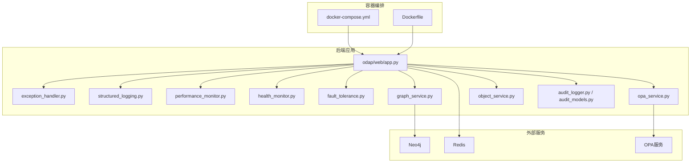
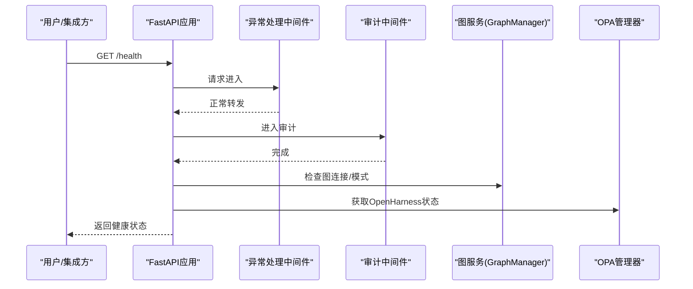
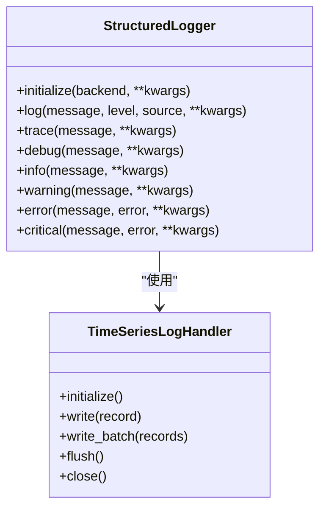
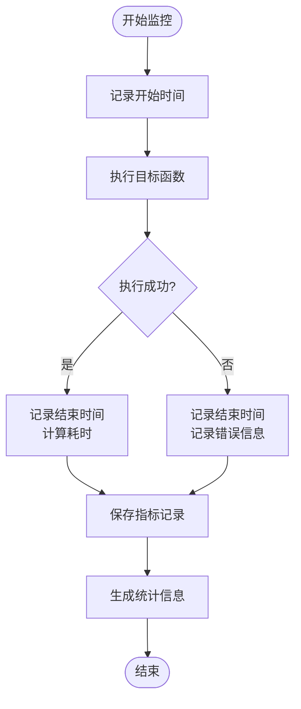
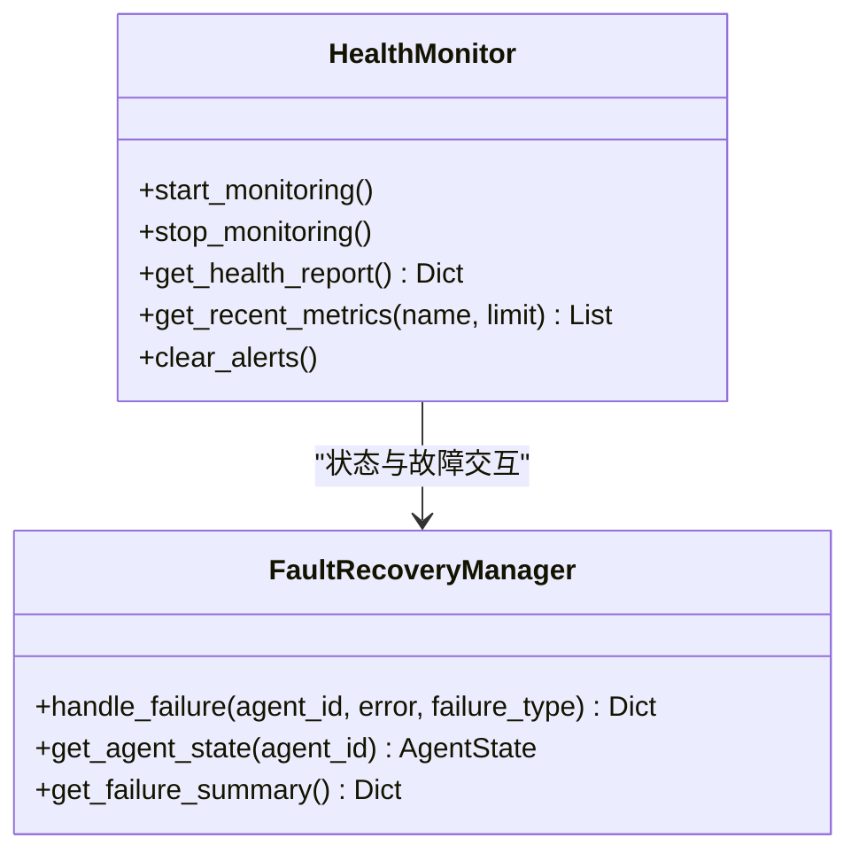
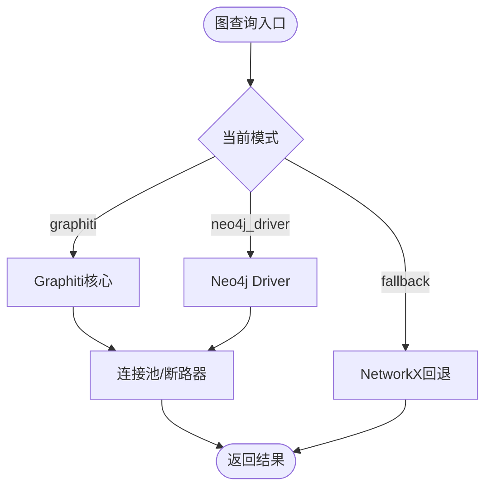
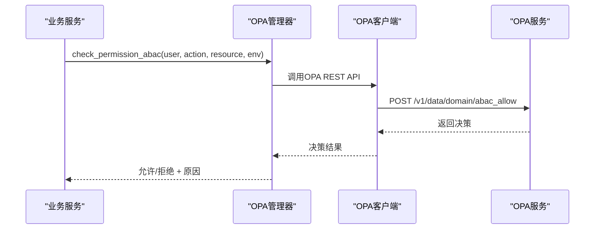
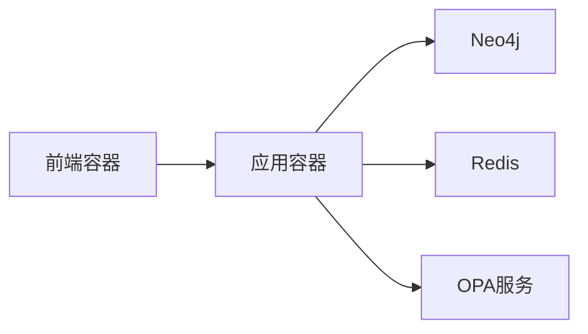

# 故障排除与FAQ

<cite>
**本文引用的文件**   
- [odap/web/app.py](file://odap/web/app.py)
- [odap/infra/middleware/exception_handler.py](file://odap/infra/middleware/exception_handler.py)
- [odap/infra/logging/structured_logging.py](file://odap/infra/logging/structured_logging.py)
- [odap/infra/monitoring/performance_monitor.py](file://odap/infra/monitoring/performance_monitor.py)
- [odap/infra/resilience/health_monitor.py](file://odap/infra/resilience/health_monitor.py)
- [odap/infra/resilience/fault_tolerance.py](file://odap/infra/resilience/fault_tolerance.py)
- [odap/infra/graph/graph_service.py](file://odap/infra/graph/graph_service.py)
- [odap/infra/opa/opa_service.py](file://odap/infra/opa/opa_service.py)
- [odap/infra/object_service/object_service.py](file://odap/infra/object_service/object_service.py)
- [odap/infra/security/audit_logger.py](file://odap/infra/security/audit_logger.py)
- [odap/infra/security/audit_models.py](file://odap/infra/security/audit_models.py)
- [docker/docker-compose.yml](file://docker/docker-compose.yml)
- [docker/Dockerfile](file://docker/Dockerfile)
- [config/agent_config.yaml](file://config/agent_config.yaml)
</cite>

## 目录
1. [简介](#简介)
2. [项目结构](#项目结构)
3. [核心组件](#核心组件)
4. [架构总览](#架构总览)
5. [详细组件分析](#详细组件分析)
6. [依赖分析](#依赖分析)
7. [性能考虑](#性能考虑)
8. [故障排除指南](#故障排除指南)
9. [结论](#结论)
10. [附录](#附录)

## 简介
本文件面向ODAP平台的技术支持与运维人员，提供系统化的故障排除与常见问题解答（FAQ）。内容覆盖部署与环境问题、系统性能诊断、日志分析与关键错误解读、监控指标含义与异常处理流程，并给出开发/测试/生产三类环境的差异化处理策略，以及紧急情况下的应急响应与恢复方案。

## 项目结构
ODAP平台由Python后端FastAPI应用、容器编排（Docker Compose）、多组件基础设施（图数据库、缓存、策略引擎、审计与监控）构成。核心入口为Web应用，负责注册中间件、路由与健康检查；基础设施模块提供日志、异常处理、性能监控、健康监控、故障恢复、图谱访问、权限控制、对象服务与审计能力。



**图表来源**
- [docker/docker-compose.yml:1-97](file://docker/docker-compose.yml#L1-L97)
- [docker/Dockerfile:1-34](file://docker/Dockerfile#L1-L34)
- [odap/web/app.py:1-262](file://odap/web/app.py#L1-L262)
- [odap/infra/graph/graph_service.py:1-2256](file://odap/infra/graph/graph_service.py#L1-L2256)
- [odap/infra/opa/opa_service.py:1-750](file://odap/infra/opa/opa_service.py#L1-L750)
- [odap/infra/object_service/object_service.py:1-448](file://odap/infra/object_service/object_service.py#L1-L448)
- [odap/infra/logging/structured_logging.py:1-403](file://odap/infra/logging/structured_logging.py#L1-L403)
- [odap/infra/monitoring/performance_monitor.py:1-184](file://odap/infra/monitoring/performance_monitor.py#L1-L184)
- [odap/infra/resilience/health_monitor.py:1-216](file://odap/infra/resilience/health_monitor.py#L1-L216)
- [odap/infra/resilience/fault_tolerance.py:1-309](file://odap/infra/resilience/fault_tolerance.py#L1-L309)
- [odap/infra/security/audit_logger.py:1-378](file://odap/infra/security/audit_logger.py#L1-L378)
- [odap/infra/security/audit_models.py:1-167](file://odap/infra/security/audit_models.py#L1-L167)

**章节来源**
- [docker/docker-compose.yml:1-97](file://docker/docker-compose.yml#L1-L97)
- [docker/Dockerfile:1-34](file://docker/Dockerfile#L1-L34)
- [odap/web/app.py:1-262](file://odap/web/app.py#L1-L262)

## 核心组件
- Web应用与中间件
  - 应用入口注册全局异常处理、审计中间件、CORS与大量业务路由。
  - 提供健康检查端点与性能监控端点。
- 日志系统
  - 结构化日志记录器，支持时序数据库落盘与内存回退。
- 性能监控
  - 统一的性能监控器，支持LLM调用、数据库查询、API请求、工具执行等指标采集与统计。
- 健康监控与故障恢复
  - 健康监控器定期采集Swarm/Agent状态并生成告警；故障恢复管理器实现断路器、重试、降级与重启策略。
- 图谱访问与连接池
  - 三层降级：Graphiti（核心）→Neo4j Driver直连→NetworkX回退；内置连接池与断路器。
- 权限控制（OPA）
  - 支持ABAC策略、策略Bundle热更新、策略沙箱与批量权限检查。
- 对象服务
  - 统一对象查询、语义查询、链接与动作装配，聚合图谱、业务、知识库、Agent等多源数据。
- 审计系统
  - 结构化审计事件模型与SQLite通道，支持批量写入与查询。

**章节来源**
- [odap/web/app.py:122-262](file://odap/web/app.py#L122-L262)
- [odap/infra/logging/structured_logging.py:287-403](file://odap/infra/logging/structured_logging.py#L287-L403)
- [odap/infra/monitoring/performance_monitor.py:12-184](file://odap/infra/monitoring/performance_monitor.py#L12-L184)
- [odap/infra/resilience/health_monitor.py:28-216](file://odap/infra/resilience/health_monitor.py#L28-L216)
- [odap/infra/resilience/fault_tolerance.py:41-309](file://odap/infra/resilience/fault_tolerance.py#L41-L309)
- [odap/infra/graph/graph_service.py:71-800](file://odap/infra/graph/graph_service.py#L71-L800)
- [odap/infra/opa/opa_service.py:455-750](file://odap/infra/opa/opa_service.py#L455-L750)
- [odap/infra/object_service/object_service.py:14-448](file://odap/infra/object_service/object_service.py#L14-L448)
- [odap/infra/security/audit_logger.py:19-378](file://odap/infra/security/audit_logger.py#L19-L378)
- [odap/infra/security/audit_models.py:110-167](file://odap/infra/security/audit_models.py#L110-L167)

## 架构总览
ODAP平台采用“容器化+微服务”架构，后端以FastAPI为核心，通过中间件与基础设施模块提供高可用与可观测性。容器编排文件定义应用、前端、Neo4j、Redis、OPA服务之间的依赖与网络拓扑。

```mermaid
sequenceDiagram
participant C as "客户端"
participant F as "前端容器"
participant A as "应用容器(Uvicorn)"
participant G as "图数据库(Neo4j)"
participant R as "缓存(Redis)"
participant P as "策略(OPA)"
C->>F : 访问UI
F->>A : HTTP请求
A->>A : 异常/审计/CORS中间件
A->>G : 图查询/写入(Cypher/Graphiti)
A->>R : 缓存读写
A->>P : 权限检查(ABAC/策略)
A-->>F : 响应
Note over A,G,R,P : 多组件协同与降级策略
```

**图表来源**
- [docker/docker-compose.yml:1-97](file://docker/docker-compose.yml#L1-L97)
- [odap/web/app.py:122-262](file://odap/web/app.py#L122-L262)
- [odap/infra/graph/graph_service.py:145-800](file://odap/infra/graph/graph_service.py#L145-L800)
- [odap/infra/opa/opa_service.py:373-450](file://odap/infra/opa/opa_service.py#L373-L450)

## 详细组件分析

### Web应用与健康检查
- 全局异常处理中间件统一捕获未处理异常，按类型返回标准化错误响应。
- 审计中间件与CORS中间件在应用启动时注册。
- 健康检查端点返回OpenHarness状态、Graphiti模式与连接状态等关键信息。
- 性能监控端点提供统一指标查询与重置。



**图表来源**
- [odap/web/app.py:141-242](file://odap/web/app.py#L141-L242)
- [odap/infra/middleware/exception_handler.py:14-73](file://odap/infra/middleware/exception_handler.py#L14-L73)
- [odap/infra/graph/graph_service.py:71-144](file://odap/infra/graph/graph_service.py#L71-L144)
- [odap/infra/opa/opa_service.py:455-489](file://odap/infra/opa/opa_service.py#L455-L489)

**章节来源**
- [odap/web/app.py:122-262](file://odap/web/app.py#L122-L262)
- [odap/infra/middleware/exception_handler.py:14-137](file://odap/infra/middleware/exception_handler.py#L14-L137)

### 结构化日志系统
- 支持多种后端（InfluxDB/TimescaleDB/内存），自动回退与批量缓冲。
- 提供结构化日志记录器与上下文设置，便于跨模块统一输出。
- 适合用于审计、性能与错误追踪。



**图表来源**
- [odap/infra/logging/structured_logging.py:287-403](file://odap/infra/logging/structured_logging.py#L287-L403)

**章节来源**
- [odap/infra/logging/structured_logging.py:1-403](file://odap/infra/logging/structured_logging.py#L1-L403)

### 性能监控
- 统一指标采集：LLM调用、数据库查询、API请求、工具执行。
- 提供均值、中位数、最小/最大、P95/P99等统计，支持重置与导出。
- 可通过装饰器对函数进行自动监控。



**图表来源**
- [odap/infra/monitoring/performance_monitor.py:30-184](file://odap/infra/monitoring/performance_monitor.py#L30-L184)

**章节来源**
- [odap/infra/monitoring/performance_monitor.py:1-184](file://odap/infra/monitoring/performance_monitor.py#L1-L184)

### 健康监控与故障恢复
- 健康监控器周期性采集Agent状态、活动任务数等指标并生成告警。
- 故障恢复管理器实现断路器、指数退避重试、降级模式与重启策略。
- 二者配合保障系统在异常情况下保持稳定与可恢复。



**图表来源**
- [odap/infra/resilience/health_monitor.py:28-216](file://odap/infra/resilience/health_monitor.py#L28-L216)
- [odap/infra/resilience/fault_tolerance.py:41-309](file://odap/infra/resilience/fault_tolerance.py#L41-L309)

**章节来源**
- [odap/infra/resilience/health_monitor.py:1-216](file://odap/infra/resilience/health_monitor.py#L1-L216)
- [odap/infra/resilience/fault_tolerance.py:1-309](file://odap/infra/resilience/fault_tolerance.py#L1-L309)

### 图谱访问与连接池
- 三层降级：Graphiti（核心）→Neo4j Driver直连→NetworkX回退。
- 内置连接池与断路器，支持批量加载、连接清理与超时控制。
- 提供查询、更新、性能指标获取等能力。



**图表来源**
- [odap/infra/graph/graph_service.py:145-443](file://odap/infra/graph/graph_service.py#L145-L443)

**章节来源**
- [odap/infra/graph/graph_service.py:71-800](file://odap/infra/graph/graph_service.py#L71-L800)

### 权限控制（OPA）
- 支持ABAC策略、策略Bundle热更新、策略沙箱与批量权限检查。
- 提供Mock与真实OPA Server双模式，自动降级与缓存优化。



**图表来源**
- [odap/infra/opa/opa_service.py:373-450](file://odap/infra/opa/opa_service.py#L373-L450)

**章节来源**
- [odap/infra/opa/opa_service.py:455-750](file://odap/infra/opa/opa_service.py#L455-L750)

### 对象服务
- 统一对象查询、语义查询、链接与动作装配，聚合多源数据。
- 对各子系统失败进行隔离与降级记录，保证整体可用性。

**章节来源**
- [odap/infra/object_service/object_service.py:14-448](file://odap/infra/object_service/object_service.py#L14-L448)

### 审计系统
- 审计事件模型涵盖用户、工作空间、本体、Agent、策略、推演、系统、数据摄入、查询、问答、反馈等事件类型。
- 提供SQLite通道与批量写入、查询、统计与完整性报告能力。

**章节来源**
- [odap/infra/security/audit_models.py:150-167](file://odap/infra/security/audit_models.py#L150-L167)
- [odap/infra/security/audit_logger.py:19-378](file://odap/infra/security/audit_logger.py#L19-L378)

## 依赖分析
- 容器依赖
  - 应用容器依赖Neo4j、Redis、OPA服务；前端容器反向代理应用。
- 运行时依赖
  - Python包、FastAPI、Uvicorn、Neo4j/Redis驱动、OPA客户端、结构化日志后端等。
- 环境变量
  - Docker Compose中集中配置数据库、缓存、策略服务地址与CORS白名单。



**图表来源**
- [docker/docker-compose.yml:1-97](file://docker/docker-compose.yml#L1-L97)
- [docker/Dockerfile:1-34](file://docker/Dockerfile#L1-L34)

**章节来源**
- [docker/docker-compose.yml:1-97](file://docker/docker-compose.yml#L1-L97)
- [docker/Dockerfile:1-34](file://docker/Dockerfile#L1-L34)

## 性能考虑
- 连接池与断路器
  - 图服务连接池上限、空闲超时与断路器阈值，避免资源耗尽与雪崩。
- 指标采集
  - 使用性能监控器对关键路径进行采样与统计，结合P95/P99定位瓶颈。
- 缓存与降级
  - Redis缓存与回退模式减少对外部依赖的强耦合。
- 并发与超时
  - Uvicorn多进程/多协程模式与合理超时配置，避免阻塞。

[本节为通用指导，无需特定文件引用]

## 故障排除指南

### 一、部署与环境问题

- Docker配置错误
  - 症状：容器启动失败、端口占用、网络不通。
  - 排查步骤：
    - 检查端口映射与占用：确认宿主机端口未被占用。
    - 检查网络：确认容器网络桥接正常，服务间可达。
    - 检查卷挂载：确认数据卷存在且权限正确。
  - 解决方案：调整端口、重建网络、修复权限或重新挂载卷。
  
  **章节来源**
  - [docker/docker-compose.yml:7-46](file://docker/docker-compose.yml#L7-L46)
  - [docker/Dockerfile:31-34](file://docker/Dockerfile#L31-L34)

- 依赖冲突
  - 症状：pip安装失败、包版本冲突。
  - 排查步骤：
    - 查看Dockerfile中的安装顺序与镜像源。
    - 在容器内执行安装命令，定位具体失败包。
  - 解决方案：锁定版本、更换镜像源、分步安装或使用虚拟环境。
  
  **章节来源**
  - [docker/Dockerfile:9-27](file://docker/Dockerfile#L9-L27)

- 端口占用
  - 症状：应用无法绑定端口。
  - 排查步骤：使用系统工具查看占用进程，释放端口。
  - 解决方案：修改映射端口或释放占用进程。
  
  **章节来源**
  - [docker/docker-compose.yml:7-46](file://docker/docker-compose.yml#L7-L46)

- CORS与跨域问题
  - 症状：浏览器跨域报错。
  - 排查步骤：检查CORS_ORIGINS环境变量与中间件配置。
  - 解决方案：在Docker Compose中补充允许的Origin。
  
  **章节来源**
  - [odap/web/app.py:129-139](file://odap/web/app.py#L129-L139)
  - [docker/docker-compose.yml:18-18](file://docker/docker-compose.yml#L18-L18)

- Agent配置问题
  - 症状：第三方LLM接入失败或模型不可用。
  - 排查步骤：检查agent_config.yaml中的provider配置与base_url。
  - 解决方案：修正base_url或切换启用的provider。
  
  **章节来源**
  - [config/agent_config.yaml:1-23](file://config/agent_config.yaml#L1-L23)

### 二、系统性能问题

- 内存泄漏
  - 症状：容器内存持续增长。
  - 排查步骤：
    - 使用性能监控端点查看API请求与工具执行指标。
    - 检查对象服务与图服务的批量操作是否正确释放资源。
  - 解决方案：优化批量处理、及时释放连接、限制并发。
  
  **章节来源**
  - [odap/web/app.py:244-262](file://odap/web/app.py#L244-L262)
  - [odap/infra/monitoring/performance_monitor.py:107-141](file://odap/infra/monitoring/performance_monitor.py#L107-L141)
  - [odap/infra/object_service/object_service.py:52-93](file://odap/infra/object_service/object_service.py#L52-L93)

- CPU占用过高
  - 症状：CPU飙升。
  - 排查步骤：
    - 查看性能监控统计，识别热点指标（如LLM调用、数据库查询）。
    - 检查是否存在长时间运行的任务或死循环。
  - 解决方案：限流、拆分任务、优化算法或增加资源。
  
  **章节来源**
  - [odap/infra/monitoring/performance_monitor.py:63-88](file://odap/infra/monitoring/performance_monitor.py#L63-L88)

- 数据库连接池耗尽
  - 症状：数据库连接超时、请求堆积。
  - 排查步骤：
    - 检查图服务连接池配置与断路器状态。
    - 查看连接清理与超时设置。
  - 解决方案：增大连接池上限、缩短空闲超时、优化查询与事务。
  
  **章节来源**
  - [odap/infra/graph/graph_service.py:299-443](file://odap/infra/graph/graph_service.py#L299-L443)

- 缓存命中率低
  - 症状：缓存频繁失效。
  - 排查步骤：检查OPA缓存统计与命中率。
  - 解决方案：调整缓存TTL、优化键生成策略。
  
  **章节来源**
  - [odap/infra/opa/opa_service.py:511-537](file://odap/infra/opa/opa_service.py#L511-L537)

### 三、日志分析与关键错误解读

- 结构化日志
  - 使用结构化日志记录器输出统一格式，便于检索与聚合。
  - 关注trace_id/span_id与错误字段，串联请求链路。
  
  **章节来源**
  - [odap/infra/logging/structured_logging.py:324-390](file://odap/infra/logging/structured_logging.py#L324-L390)

- 全局异常处理
  - 未捕获异常会被中间件统一包装为标准错误响应，便于前端展示与日志记录。
  - 注意区分400/403/500等状态码与错误类型。
  
  **章节来源**
  - [odap/infra/middleware/exception_handler.py:14-137](file://odap/infra/middleware/exception_handler.py#L14-L137)

- 审计日志
  - 使用审计模型记录关键事件，支持按类型、严重级别、时间范围查询。
  - 适用于合规审计与问题回溯。
  
  **章节来源**
  - [odap/infra/security/audit_models.py:110-167](file://odap/infra/security/audit_models.py#L110-L167)
  - [odap/infra/security/audit_logger.py:230-256](file://odap/infra/security/audit_logger.py#L230-L256)

### 四、监控指标含义与异常处理流程

- 性能监控指标
  - LLM调用、数据库查询、API请求、工具执行的次数、均值、P95/P99。
  - 异常：指标突增或P99显著升高，需定位慢查询或外部依赖异常。
  
  **章节来源**
  - [odap/infra/monitoring/performance_monitor.py:63-117](file://odap/infra/monitoring/performance_monitor.py#L63-L117)

- 健康监控
  - Agent状态、活跃任务数等指标，超过阈值产生告警。
  - 处理：根据告警级别采取降级或重启策略。
  
  **章节来源**
  - [odap/infra/resilience/health_monitor.py:175-198](file://odap/infra/resilience/health_monitor.py#L175-L198)

- 故障恢复
  - 断路器打开时拒绝请求，等待重置；重试失败后进入降级模式。
  - 处理：检查上游依赖健康状况，必要时手动重置断路器或切换降级策略。
  
  **章节来源**
  - [odap/infra/resilience/fault_tolerance.py:236-277](file://odap/infra/resilience/fault_tolerance.py#L236-L277)

### 五、不同环境的差异化处理策略

- 开发环境
  - 优先使用回退模式与Mock服务，便于离线开发。
  - 启用详细日志与本地缓存，便于调试。
- 测试环境
  - 使用轻量级依赖（如回退模式），关注性能基线与稳定性。
- 生产环境
  - 启用真实OPA、Neo4j与Redis，开启健康监控与故障恢复。
  - 严格控制CORS与鉴权，启用审计与结构化日志。

[本节为通用指导，无需特定文件引用]

### 六、紧急响应与恢复方案

- 应急流程
  - 快速定位：查看健康报告与告警、检查性能指标与日志。
  - 降级：启用回退模式、禁用非关键功能、降低并发。
  - 恢复：修复依赖、重置断路器、清理缓存、重启异常组件。
- 恢复验证
  - 通过健康检查端点与关键API回归测试验证恢复效果。

**章节来源**
- [odap/web/app.py:221-242](file://odap/web/app.py#L221-L242)
- [odap/infra/resilience/health_monitor.py:175-198](file://odap/infra/resilience/health_monitor.py#L175-L198)
- [odap/infra/resilience/fault_tolerance.py:255-277](file://odap/infra/resilience/fault_tolerance.py#L255-L277)

## 结论
通过统一的异常处理、结构化日志、性能与健康监控、故障恢复与降级策略，ODAP平台能够在复杂环境中保持稳定与可观测。建议在生产环境严格执行配置与监控策略，结合本指南的排查步骤与应急流程，快速定位并解决问题。

[本节为总结，无需特定文件引用]

## 附录

### 常见端点与配置参考
- 健康检查：GET /health
- 性能监控：GET /api/v1/monitoring/performance，POST /api/v1/monitoring/performance/reset
- CORS白名单：CORS_ORIGINS环境变量
- OPA策略：/v1/data/domain/* 与 /v1/policies/*

**章节来源**
- [odap/web/app.py:221-262](file://odap/web/app.py#L221-L262)
- [docker/docker-compose.yml:18-18](file://docker/docker-compose.yml#L18-L18)
- [odap/infra/opa/opa_service.py:382-449](file://odap/infra/opa/opa_service.py#L382-L449)