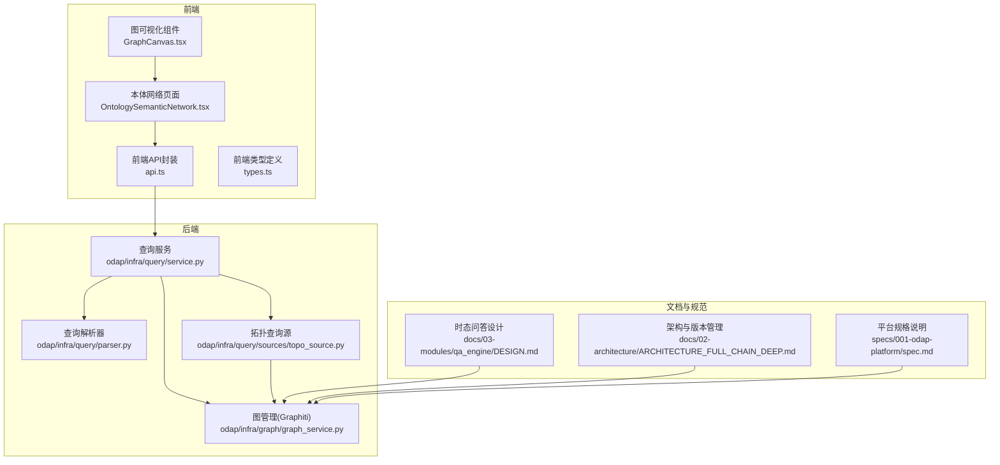
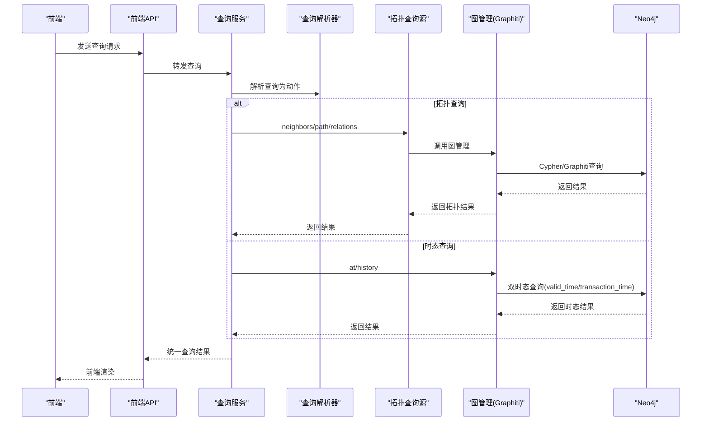
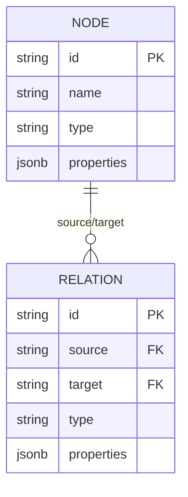
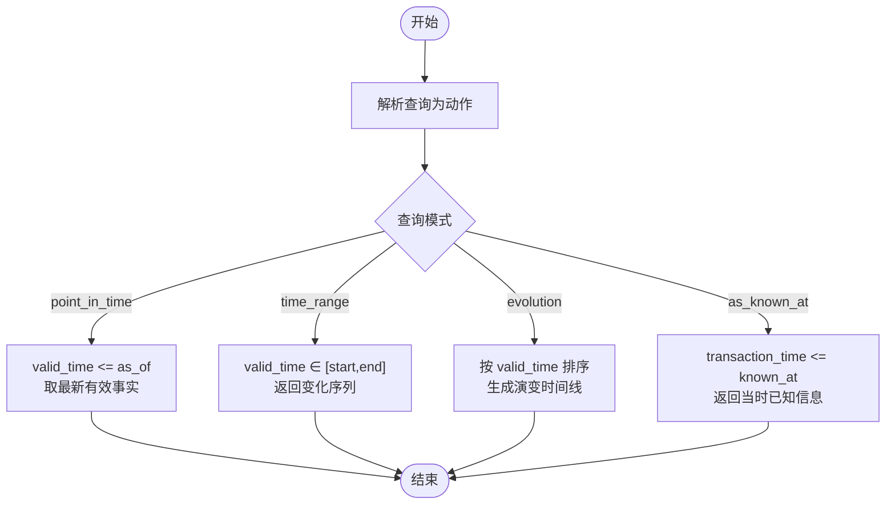
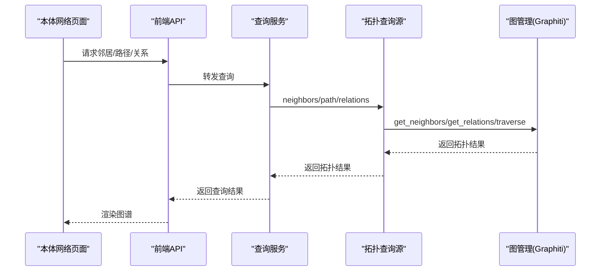
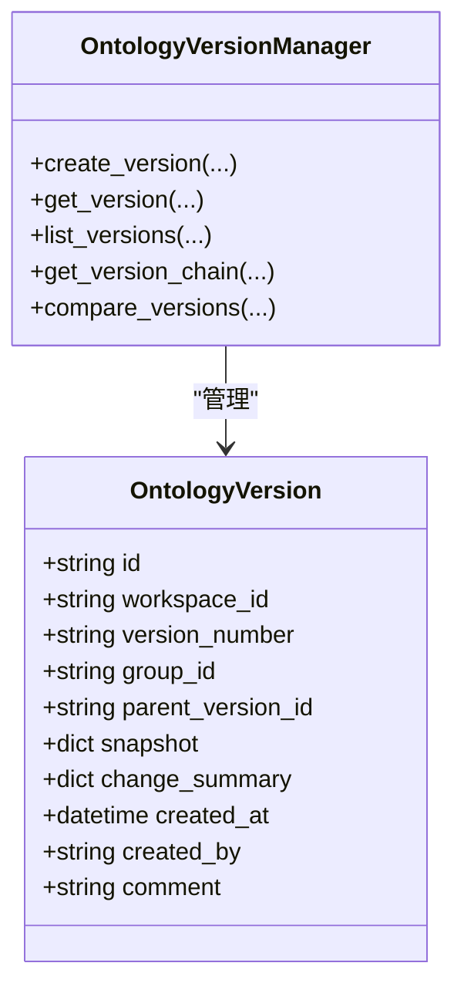
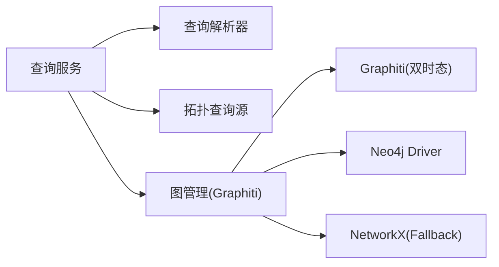

# 图数据库模型

<cite>
**本文引用的文件**
- [graph_service.py](file://odap/infra/graph/graph_service.py)
- [service.py](file://odap/infra/query/service.py)
- [parser.py](file://odap/infra/query/parser.py)
- [topo_source.py](file://odap/infra/query/sources/topo_source.py)
- [DESIGN.md](file://docs/03-modules/qa_engine/DESIGN.md)
- [ARCHITECTURE_FULL_CHAIN_DEEP.md](file://docs/02-architecture/ARCHITECTURE_FULL_CHAIN_DEEP.md)
- [spec.md](file://specs/001-odap-platform/spec.md)
- [api.ts](file://frontend/src/modules/shared/services/api.ts)
- [types.ts](file://frontend/src/modules/shared/types.ts)
- [GraphCanvas.tsx](file://frontend/src/modules/ontology/components/GraphCanvas.tsx)
- [OntologySemanticNetwork.tsx](file://frontend/src/modules/ontology/pages/OntologySemanticNetwork.tsx)
- [blueprintApi.ts](file://frontend/src/modules/ontology/services/blueprintApi.ts)
- [colors.ts](file://frontend/src/modules/shared/styles/colors.ts)
- [test_visualization.py](file://tests/unit/test_visualization.py)
- [executor.py](file://odap/biz/decision/action_service/executor.py)
- [engine.py](file://odap/infra/query/sources/topo_source.py)
- [incremental_update.py](file://docs/02-architecture/ARCHITECTURE_FULL_CHAIN_DEEP.md)
- [feedback/engine.py](file://docs/02-architecture/ARCHITECTURE_FULL_CHAIN_DEEP.md)
- [agent_config.yaml](file://config/agent_config.yaml)
</cite>

## 目录
1. [简介](#简介)
2. [项目结构](#项目结构)
3. [核心组件](#核心组件)
4. [架构总览](#架构总览)
5. [详细组件分析](#详细组件分析)
6. [依赖分析](#依赖分析)
7. [性能考量](#性能考量)
8. [故障排查指南](#故障排查指南)
9. [结论](#结论)
10. [附录](#附录)

## 简介
本文件面向图数据库工程师，系统化阐述 Graphiti 双时态知识图谱的图数据库模型设计与实现，包括节点(Node)、关系(Relationship)、属性(Property)的设计规范；有效时间(valid_time)与事务时间(transaction_time)的双时态数据结构与查询模式；索引与约束策略、查询优化与一致性保障；节点标签体系、关系类型定义与属性约束规则；图遍历、路径查找与子图匹配的实现要点；以及数据导入导出格式、Schema 演进与版本控制机制。文档同时给出前端可视化与查询接口的映射，帮助读者从工程落地角度理解与实践。

## 项目结构
围绕图数据库模型的关键代码分布在以下模块：
- 图谱管理与双时态能力：odap/infra/graph/graph_service.py
- 查询服务与解析：odap/infra/query/service.py、odap/infra/query/parser.py、odap/infra/query/sources/topo_source.py
- 时态问答与反馈闭环：docs/03-modules/qa_engine/DESIGN.md、docs/02-architecture/ARCHITECTURE_FULL_CHAIN_DEEP.md
- 前端图谱展示与交互：frontend/src/modules/ontology/components/GraphCanvas.tsx、frontend/src/modules/ontology/pages/OntologySemanticNetwork.tsx、frontend/src/modules/shared/services/api.ts、frontend/src/modules/shared/types.ts
- 版本管理与演进：docs/02-architecture/ARCHITECTURE_FULL_CHAIN_DEEP.md、specs/001-odap-platform/spec.md
- 行为执行与增量更新：odap/biz/decision/action_service/executor.py、docs/02-architecture/ARCHITECTURE_FULL_CHAIN_DEEP.md

**图表来源**
- [graph_service.py:1-200](file://odap/infra/graph/graph_service.py#L1-L200)
- [service.py:1-126](file://odap/infra/query/service.py#L1-L126)
- [parser.py:44-73](file://odap/infra/query/parser.py#L44-L73)
- [topo_source.py:1-27](file://odap/infra/query/sources/topo_source.py#L1-L27)
- [DESIGN.md:551-615](file://docs/03-modules/qa_engine/DESIGN.md#L551-L615)
- [ARCHITECTURE_FULL_CHAIN_DEEP.md:1942-2156](file://docs/02-architecture/ARCHITECTURE_FULL_CHAIN_DEEP.md#L1942-L2156)
- [spec.md:1-156](file://specs/001-odap-platform/spec.md#L1-L156)
- [api.ts:1-1828](file://frontend/src/modules/shared/services/api.ts#L1-L1828)
- [types.ts:1-85](file://frontend/src/modules/shared/types.ts#L1-L85)
- [GraphCanvas.tsx:520-566](file://frontend/src/modules/ontology/components/GraphCanvas.tsx#L520-L566)
- [OntologySemanticNetwork.tsx:194-221](file://frontend/src/modules/ontology/pages/OntologySemanticNetwork.tsx#L194-L221)

**章节来源**
- [graph_service.py:1-200](file://odap/infra/graph/graph_service.py#L1-L200)
- [service.py:1-126](file://odap/infra/query/service.py#L1-L126)
- [parser.py:44-73](file://odap/infra/query/parser.py#L44-L73)
- [topo_source.py:1-27](file://odap/infra/query/sources/topo_source.py#L1-L27)
- [DESIGN.md:551-615](file://docs/03-modules/qa_engine/DESIGN.md#L551-L615)
- [ARCHITECTURE_FULL_CHAIN_DEEP.md:1942-2156](file://docs/02-architecture/ARCHITECTURE_FULL_CHAIN_DEEP.md#L1942-L2156)
- [spec.md:1-156](file://specs/001-odap-platform/spec.md#L1-L156)
- [api.ts:1-1828](file://frontend/src/modules/shared/services/api.ts#L1-L1828)
- [types.ts:1-85](file://frontend/src/modules/shared/types.ts#L1-L85)
- [GraphCanvas.tsx:520-566](file://frontend/src/modules/ontology/components/GraphCanvas.tsx#L520-L566)
- [OntologySemanticNetwork.tsx:194-221](file://frontend/src/modules/ontology/pages/OntologySemanticNetwork.tsx#L194-L221)

## 核心组件
- 图管理(GraphManager)：封装 Graphiti 双时态能力与 Neo4j 连接，提供实体查询、属性更新、邻接查询、拓扑遍历、时序查询等能力，并内置三层降级策略（Graphiti → Neo4j Driver → NetworkX fallback）。
- 查询服务(QueryService)：统一入口，解析自然语言查询为结构化动作，路由至 Schema/Entity/Topo/Temporal 四类数据源。
- 拓扑查询源(TopoSourceImpl)：封装邻居、关系、路径与子图遍历等拓扑查询。
- 时态问答(TemporalQueryHandler)：基于 valid_time 与 transaction_time 的时态查询模式抽象。
- 前端图谱API与类型：统一节点/边结构、版本与统计信息的前后端契约。
- 版本管理与演进：基于 Graphiti group_id 的快照隔离与版本链管理，支持比较与回滚。

**章节来源**
- [graph_service.py:71-144](file://odap/infra/graph/graph_service.py#L71-L144)
- [service.py:11-71](file://odap/infra/query/service.py#L11-L71)
- [topo_source.py:4-27](file://odap/infra/query/sources/topo_source.py#L4-L27)
- [DESIGN.md:551-615](file://docs/03-modules/qa_engine/DESIGN.md#L551-L615)
- [api.ts:5-61](file://frontend/src/modules/shared/services/api.ts#L5-L61)
- [types.ts:12-19](file://frontend/src/modules/shared/types.ts#L12-L19)
- [ARCHITECTURE_FULL_CHAIN_DEEP.md:1942-2156](file://docs/02-architecture/ARCHITECTURE_FULL_CHAIN_DEEP.md#L1942-L2156)

## 架构总览
双时态知识图谱在本项目中的落地路径如下：
- 数据摄入与抽取：前端通过 API 将自然语言/新闻/随机事件等输入后端，经抽取得到实体与关系。
- 图谱写入：GraphManager 以 Graphiti 双时态写入，使用 group_id 隔离不同版本，支持 valid_time 与 transaction_time。
- 查询与可视化：QueryService 解析查询，TopoSourceImpl 提供拓扑查询，前端 GraphCanvas 与页面组件渲染图谱。
- 版本与反馈：版本管理器生成版本快照，反馈引擎记录用户修正与技能副作用，增量更新器批量刷写到 Graphiti。

**图表来源**
- [service.py:33-59](file://odap/infra/query/service.py#L33-L59)
- [parser.py:44-73](file://odap/infra/query/parser.py#L44-L73)
- [topo_source.py:14-27](file://odap/infra/query/sources/topo_source.py#L14-L27)
- [graph_service.py:649-756](file://odap/infra/graph/graph_service.py#L649-L756)

**章节来源**
- [service.py:33-59](file://odap/infra/query/service.py#L33-L59)
- [parser.py:44-73](file://odap/infra/query/parser.py#L44-L73)
- [topo_source.py:14-27](file://odap/infra/query/sources/topo_source.py#L14-L27)
- [graph_service.py:649-756](file://odap/infra/graph/graph_service.py#L649-L756)

## 详细组件分析

### 节点、关系与属性设计规范
- 节点(Node)
  - 标识：统一 id 字段，配合标签区分类型（如 Entity、具体类型标签）。
  - 属性：properties 字典承载任意键值对，前端类型定义中包含 id、name、type、properties 等字段。
  - 标签体系：前端通过颜色与标签映射定义实体类型与关系类型的视觉体系。
- 关系(Edge)
  - 标识：统一 id 字段，source/target 指向两端节点。
  - 属性：properties 字典承载关系属性。
  - 类型：type 字段表示关系类型，前端提供关系颜色映射。
- 属性(Property)
  - 基于节点/关系的 properties 字典，支持任意键值类型；前端类型定义中提供通用结构。

**图表来源**
- [types.ts:12-19](file://frontend/src/modules/shared/types.ts#L12-L19)
- [api.ts:5-25](file://frontend/src/modules/shared/services/api.ts#L5-L25)
- [colors.ts:15-30](file://frontend/src/modules/shared/styles/colors.ts#L15-L30)

**章节来源**
- [types.ts:12-19](file://frontend/src/modules/shared/types.ts#L12-L19)
- [api.ts:5-25](file://frontend/src/modules/shared/services/api.ts#L5-L25)
- [colors.ts:15-30](file://frontend/src/modules/shared/styles/colors.ts#L15-L30)

### 双时态数据结构与查询模式
- 有效时间(valid_time)：表示“事实成立的时间”，用于在某一时点检索历史事实。
- 事务时间(transaction_time)：表示“数据被写入的时间”，用于检索“当时已知”的信息。
- 查询模式
  - 截至某时点的事实查询：筛选 valid_time ≤ as_of，取最新有效事实。
  - 时间区间内的变化序列：筛选 valid_time ∈ [start, end]，返回变化序列。
  - 实体时间演变：按 valid_time 排序，生成演变时间线。
  - 当时已知查询：筛选 transaction_time ≤ known_at，返回“当时已知”信息。

**图表来源**
- [DESIGN.md:564-611](file://docs/03-modules/qa_engine/DESIGN.md#L564-L611)

**章节来源**
- [DESIGN.md:551-615](file://docs/03-modules/qa_engine/DESIGN.md#L551-L615)

### 索引策略、约束与一致性
- 索引与约束
  - Neo4j 唯一性约束：实体 id 唯一，避免重复写入。
  - 批量加载：按实体类型分组，使用 MERGE 与 UNWIND 提升写入性能。
  - 连接池与断路器：控制连接数量、空闲清理与失败熔断，提升稳定性。
- 一致性保障
  - Graphiti 双时态：通过 valid_time 与 transaction_time 实现事实与写入时间的分离，保证历史可追溯与可回溯。
  - 版本隔离：使用 group_id 形成快照隔离，避免并发写入导致的不一致。
  - 增量更新：反馈引擎与增量更新器批量刷写，减少长事务与锁竞争。

**章节来源**
- [graph_service.py:217-290](file://odap/infra/graph/graph_service.py#L217-L290)
- [graph_service.py:299-443](file://odap/infra/graph/graph_service.py#L299-L443)
- [ARCHITECTURE_FULL_CHAIN_DEEP.md:1942-2156](file://docs/02-architecture/ARCHITECTURE_FULL_CHAIN_DEEP.md#L1942-L2156)
- [feedback/engine.py:4065-4200](file://docs/02-architecture/ARCHITECTURE_FULL_CHAIN_DEEP.md#L4065-L4200)
- [incremental_update.py:4205-4262](file://docs/02-architecture/ARCHITECTURE_FULL_CHAIN_DEEP.md#L4205-L4262)

### 节点标签体系、关系类型与属性约束
- 标签体系
  - 实体标签：Entity + 具体类型（如 Location、MilitaryUnit 等），前端提供颜色与标签映射。
  - 关系标签：如 located_at、engaged_with、supports、opposes、attached_to、communicates_with 等，前端提供颜色映射。
- 属性约束
  - 前端类型定义提供 id/name/type/properties 等字段；实际约束由 Graphiti/Neo4j 约束与业务层校验共同保证。
  - 前端可视化组件根据类型与属性渲染节点与边，支持属性面板与关联关系展示。

**章节来源**
- [colors.ts:15-30](file://frontend/src/modules/shared/styles/colors.ts#L15-L30)
- [types.ts:12-19](file://frontend/src/modules/shared/types.ts#L12-L19)
- [OntologySemanticNetwork.tsx:646-674](file://frontend/src/modules/ontology/pages/OntologySemanticNetwork.tsx#L646-L674)
- [GraphCanvas.tsx:902-948](file://frontend/src/modules/ontology/components/GraphCanvas.tsx#L902-L948)

### 图遍历、路径查找与子图匹配
- 邻居查询：支持双向/单向、指定深度的邻居检索。
- 路径查询：从起点出发，按最大深度遍历子图，若目标节点在子图内则返回该子图。
- 关系查询：按实体与关系类型过滤返回关系列表。
- 前端可视化：GraphCanvas 根据节点与边渲染，支持标签显隐、状态切换与缩放定位。

**图表来源**
- [service.py:91-113](file://odap/infra/query/service.py#L91-L113)
- [topo_source.py:14-27](file://odap/infra/query/sources/topo_source.py#L14-L27)
- [graph_service.py:14-20](file://odap/infra/graph/graph_service.py#L14-L20)

**章节来源**
- [service.py:91-113](file://odap/infra/query/service.py#L91-L113)
- [topo_source.py:14-27](file://odap/infra/query/sources/topo_source.py#L14-L27)
- [graph_service.py:14-20](file://odap/infra/graph/graph_service.py#L14-L20)
- [GraphCanvas.tsx:520-566](file://frontend/src/modules/ontology/components/GraphCanvas.tsx#L520-L566)

### 数据导入导出格式与前端契约
- 导入
  - 前端提供多种摄入方式：新闻、手动录入、JSON、自然语言、随机事件等，统一通过 API 调用后端抽取与写入。
- 导出
  - 前端蓝图导出支持指定格式，后端返回蓝图或代码。
- 契约
  - GraphNode/GraphEdge：id、name、type、source/target、properties 等字段。
  - Version/DiffResult/Stats：版本、差异、统计等结构化数据。

**章节来源**
- [api.ts:233-375](file://frontend/src/modules/shared/services/api.ts#L233-L375)
- [blueprintApi.ts:139-147](file://frontend/src/modules/ontology/services/blueprintApi.ts#L139-L147)
- [types.ts:1-85](file://frontend/src/modules/shared/types.ts#L1-L85)

### Schema 演进与版本控制
- 版本管理
  - 使用语义版本号递增，生成 group_id 作为 Graphiti 快照隔离标识。
  - 快照包含实体、关系与元数据，变更摘要记录新增/修改/删除数量。
- 版本链与比较
  - 列表版本历史，形成版本链；支持版本间差异比较，返回实体/关系增删改情况。
- 回滚与分支
  - 基于父版本 ID 形成链式结构，支持回滚与分支管理。

**图表来源**
- [ARCHITECTURE_FULL_CHAIN_DEEP.md:1942-2156](file://docs/02-architecture/ARCHITECTURE_FULL_CHAIN_DEEP.md#L1942-L2156)

**章节来源**
- [ARCHITECTURE_FULL_CHAIN_DEEP.md:1942-2156](file://docs/02-architecture/ARCHITECTURE_FULL_CHAIN_DEEP.md#L1942-L2156)
- [spec.md:1-156](file://specs/001-odap-platform/spec.md#L1-L156)

### 行为执行与图谱更新
- 行为执行器支持删除实体、建立关系等操作，最终通过图管理器写入 Graphiti。
- 反馈引擎与增量更新器负责记录用户修正与技能副作用，并批量刷写到 Graphiti，保持本体实时更新。

**章节来源**
- [executor.py:205-232](file://odap/biz/decision/action_service/executor.py#L205-L232)
- [feedback/engine.py:4065-4200](file://docs/02-architecture/ARCHITECTURE_FULL_CHAIN_DEEP.md#L4065-L4200)
- [incremental_update.py:4205-4262](file://docs/02-architecture/ARCHITECTURE_FULL_CHAIN_DEEP.md#L4205-L4262)

## 依赖分析
- 组件耦合
  - QueryService 依赖 QueryParser 与四类数据源实现；TopoSourceImpl 依赖 GraphManager；GraphManager 依赖 Graphiti 与 Neo4j Driver。
- 外部依赖
  - Graphiti 为核心双时态能力；Neo4j 作为持久化存储；前端 G6/Leaflet/ECharts 用于可视化渲染。
- 降级策略
  - 当 Graphiti 不可用时，自动降级到 Neo4j Driver；再不可用则使用 NetworkX 内存图谱，保证系统可用性。

**图表来源**
- [service.py:19-32](file://odap/infra/query/service.py#L19-L32)
- [graph_service.py:145-185](file://odap/infra/graph/graph_service.py#L145-L185)

**章节来源**
- [service.py:19-32](file://odap/infra/query/service.py#L19-L32)
- [graph_service.py:145-185](file://odap/infra/graph/graph_service.py#L145-L185)

## 性能考量
- 连接池与断路器：限制最大连接数、空闲清理与失败熔断，降低抖动。
- 批量写入：按类型分组、UNWIND 批量 MERGE，显著提升写入吞吐。
- 查询缓存与命中率：记录缓存命中与查询耗时，便于性能监控与优化。
- 可视化渲染：前端组件支持缩放、定位与标签显隐，减少不必要的重绘。

**章节来源**
- [graph_service.py:299-443](file://odap/infra/graph/graph_service.py#L299-L443)
- [graph_service.py:217-290](file://odap/infra/graph/graph_service.py#L217-L290)
- [GraphCanvas.tsx:520-566](file://frontend/src/modules/ontology/components/GraphCanvas.tsx#L520-L566)

## 故障排查指南
- 连接失败与重连
  - Graphiti 初始化失败时自动降级；Neo4j Driver 连接失败时尝试重连，超过阈值触发断路器。
- 查询异常
  - QueryService 捕获异常并返回解释信息；拓扑查询失败时回退到 fallback 模式。
- 前端渲染
  - GraphCanvas 提供缩放与定位逻辑，若异常可检查视口与 zoom 状态。

**章节来源**
- [graph_service.py:145-213](file://odap/infra/graph/graph_service.py#L145-L213)
- [service.py:52-59](file://odap/infra/query/service.py#L52-L59)
- [GraphCanvas.tsx:520-566](file://frontend/src/modules/ontology/components/GraphCanvas.tsx#L520-L566)

## 结论
本项目以 Graphiti 双时态能力为核心，结合 Neo4j 持久化与前端可视化，构建了具备版本隔离、时态查询、拓扑遍历与增量更新的图数据库模型。通过严格的标签体系、属性约束与索引策略，实现了高一致性与高性能的图谱服务；借助版本管理与反馈闭环，保障了知识图谱在动态演化中的可控与可追溯。

## 附录
- 前端类型与可视化
  - 节点/边结构与颜色映射，支持属性面板与关系展示。
- 平台规格与双时态使用范围
  - 明确 Graphiti 双时态在版本管理、问答时序推理与推演历史对比中的全面使用。

**章节来源**
- [types.ts:12-19](file://frontend/src/modules/shared/types.ts#L12-L19)
- [colors.ts:15-30](file://frontend/src/modules/shared/styles/colors.ts#L15-L30)
- [spec.md:141-142](file://specs/001-odap-platform/spec.md#L141-L142)