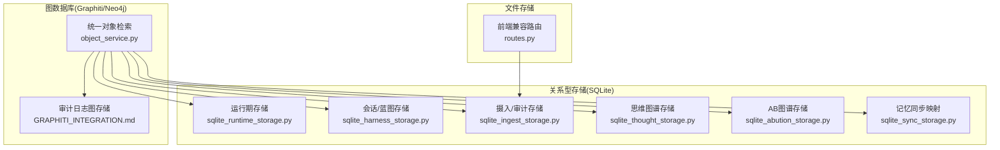
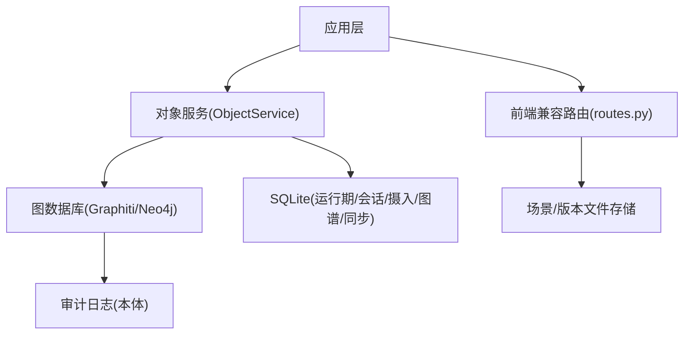
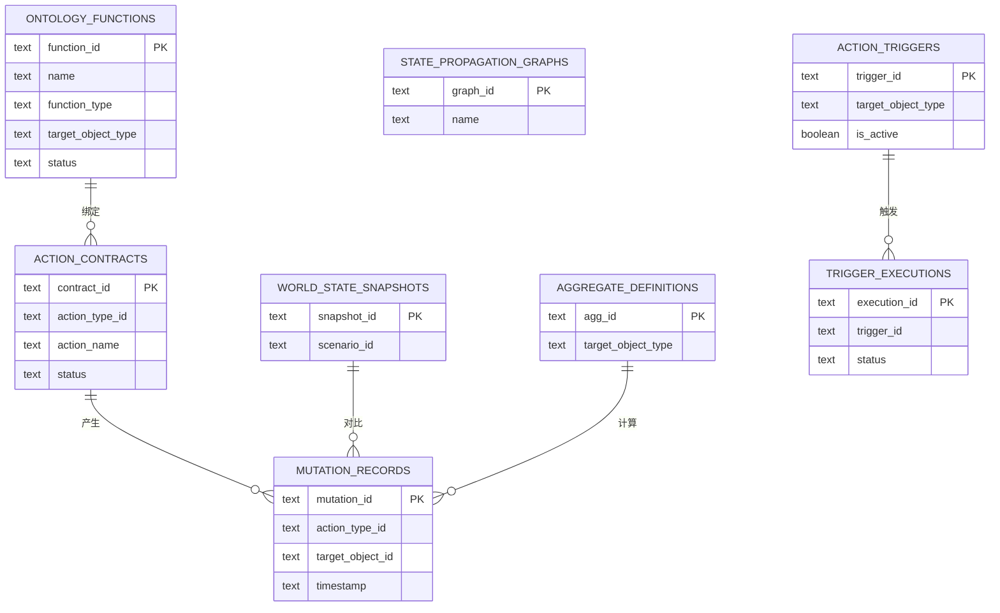
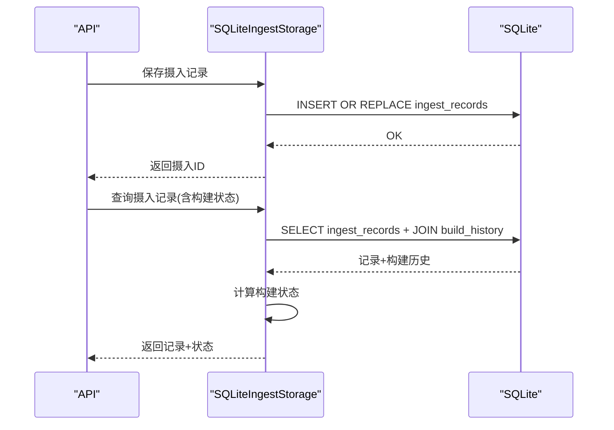
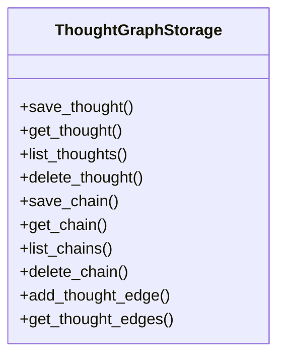
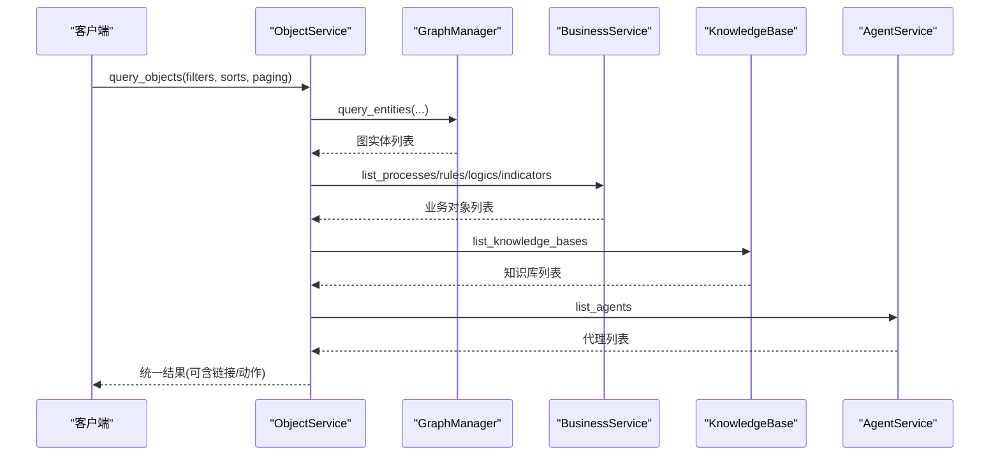
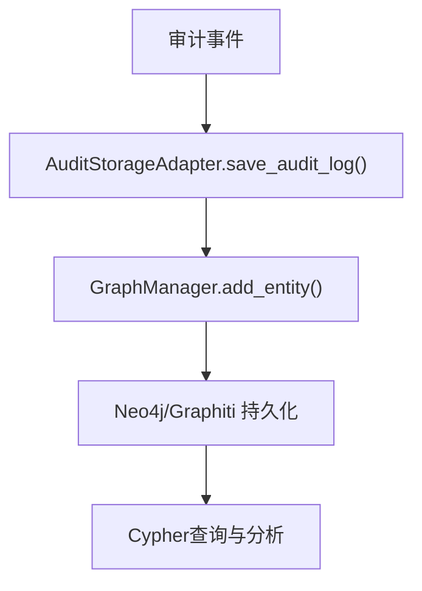
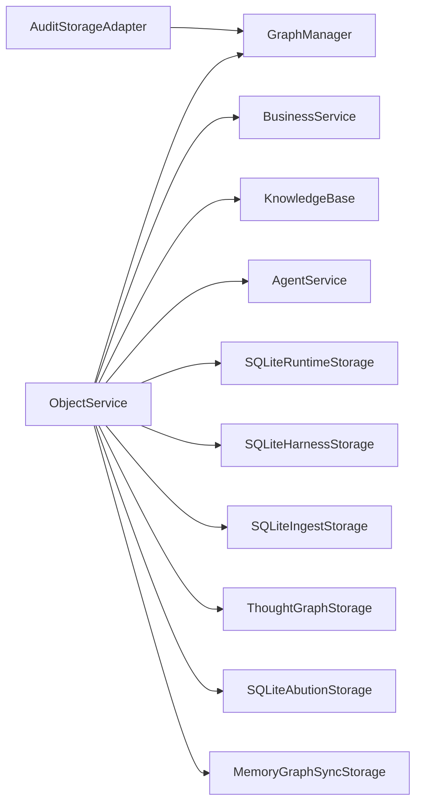

# 存储策略

<cite>
**本文引用的文件**
- [sqlite_thought_storage.py](file://odap/biz/core/cognition/thought_graph/storage/sqlite_thought_storage.py)
- [sqlite_harness_storage.py](file://odap/biz/core/ontology/harness/storage/sqlite_harness_storage.py)
- [sqlite_runtime_storage.py](file://odap/biz/core/ontology/runtime/storage/sqlite_runtime_storage.py)
- [sqlite_ingest_storage.py](file://odap/biz/core/ontology/storage/sqlite_ingest_storage.py)
- [sqlite_abution_storage.py](file://odap/biz/core/ontology/abution_graph/storage/sqlite_abution_storage.py)
- [sqlite_sync_storage.py](file://odap/biz/platform/ontology_memory/graph_sync/storage/sqlite_sync_storage.py)
- [object_service.py](file://odap/infra/object_service/object_service.py)
- [GRAPHITI_INTEGRATION.md](file://docs/03-modules/audit_log/GRAPHITI_INTEGRATION.md)
- [ADR-021_qa_driven_ontology_building.md](file://docs/07-adr/ADR-021_qa_driven_ontology_building.md)
- [routes.py](file://odap/biz/integration/frontend_compat/api/routes.py)
- [checklist.md](file://docs/11-archive/specs/storage-architecture-redesign/checklist.md)
</cite>

## 目录
1. [简介](#简介)
2. [项目结构](#项目结构)
3. [核心组件](#核心组件)
4. [架构总览](#架构总览)
5. [详细组件分析](#详细组件分析)
6. [依赖分析](#依赖分析)
7. [性能考虑](#性能考虑)
8. [故障排查指南](#故障排查指南)
9. [结论](#结论)
10. [附录](#附录)

## 简介
本文件面向ODAP平台的系统架构师与运维工程师，提供一套完整的存储策略文档。围绕多层存储架构（图数据库、关系数据库、文件存储）的设计与协调机制，系统阐述数据分区与索引策略、查询优化方案、缓存与预加载、热点数据处理、数据压缩与归档、存储空间管理、备份与恢复、灾难恢复、数据迁移、性能监控、容量规划与成本优化等主题，旨在为平台提供可落地、可演进的存储解决方案。

## 项目结构
ODAP平台采用“模块化+分层”的存储组织方式：
- 关系型存储（SQLite）：覆盖本体运行期、会话与蓝图、摄入审计、思维图谱、时态/力/行动图谱、记忆同步映射等。
- 图数据库（Neo4j/Graphiti）：用于审计日志、统一对象检索与链接查询、本体构建与查询。
- 文件存储：通过对象服务与前端兼容层对接，支撑场景与版本数据的落盘与访问。

**图示来源**
- [sqlite_runtime_storage.py:11-155](file://odap/biz/core/ontology/runtime/storage/sqlite_runtime_storage.py#L11-L155)
- [sqlite_harness_storage.py:10-64](file://odap/biz/core/ontology/harness/storage/sqlite_harness_storage.py#L10-L64)
- [sqlite_ingest_storage.py:29-265](file://odap/biz/core/ontology/storage/sqlite_ingest_storage.py#L29-L265)
- [sqlite_thought_storage.py:10-60](file://odap/biz/core/cognition/thought_graph/storage/sqlite_thought_storage.py#L10-L60)
- [sqlite_abution_storage.py:15-40](file://odap/biz/core/ontology/abution_graph/storage/sqlite_abution_storage.py#L15-L40)
- [sqlite_sync_storage.py:8-32](file://odap/biz/platform/ontology_memory/graph_sync/storage/sqlite_sync_storage.py#L8-L32)
- [object_service.py:14-93](file://odap/infra/object_service/object_service.py#L14-L93)
- [GRAPHITI_INTEGRATION.md:29-111](file://docs/03-modules/audit_log/GRAPHITI_INTEGRATION.md#L29-L111)
- [routes.py:16-32](file://odap/biz/integration/frontend_compat/api/routes.py#L16-L32)

**章节来源**
- [sqlite_runtime_storage.py:11-155](file://odap/biz/core/ontology/runtime/storage/sqlite_runtime_storage.py#L11-L155)
- [sqlite_harness_storage.py:10-64](file://odap/biz/core/ontology/harness/storage/sqlite_harness_storage.py#L10-L64)
- [sqlite_ingest_storage.py:29-265](file://odap/biz/core/ontology/storage/sqlite_ingest_storage.py#L29-L265)
- [sqlite_thought_storage.py:10-60](file://odap/biz/core/cognition/thought_graph/storage/sqlite_thought_storage.py#L10-L60)
- [sqlite_abution_storage.py:15-40](file://odap/biz/core/ontology/abution_graph/storage/sqlite_abution_storage.py#L15-L40)
- [sqlite_sync_storage.py:8-32](file://odap/biz/platform/ontology_memory/graph_sync/storage/sqlite_sync_storage.py#L8-L32)
- [object_service.py:14-93](file://odap/infra/object_service/object_service.py#L14-L93)
- [GRAPHITI_INTEGRATION.md:29-111](file://docs/03-modules/audit_log/GRAPHITI_INTEGRATION.md#L29-L111)
- [routes.py:16-32](file://odap/biz/integration/frontend_compat/api/routes.py#L16-L32)

## 核心组件
- 运行期存储（SQLiteRuntimeStorage）：承载函数、动作契约、状态传播图、变异记录、快照、聚合定义、触发器与执行记录等，提供索引与事务保障。
- 会话/蓝图存储（SQLiteHarnessStorage）：管理会话生命周期、蓝图版本化管理，支持状态与消息持久化。
- 摄入/审计存储（SQLiteIngestStorage）：记录摄入流水、审计日志、本体文档、构建历史、版本、实体注册表、校验规则与结果、处理日志、场景与场景文档等。
- 思维图谱存储（ThoughtGraphStorage）：存储思维节点、推理链条与边，支持基于类型、场景、代理的查询与索引。
- AB图谱存储（SQLiteAbutionStorage）：存储时序/模式/力/行动节点与跨维链接的快照。
- 记忆同步映射（MemoryGraphSyncStorage）：记录记忆与图实体的映射关系，支持同步状态追踪与未同步查询。
- 统一对象服务（ObjectService）：聚合图、业务、知识库、代理等多源数据，提供统一查询与链接扩展。
- 审计日志图存储（Graphiti）：将审计日志以本体形式持久化至Neo4j/Graphiti，支持复杂关系与高性能Cypher查询。
- 前端兼容路由（routes.py）：提供场景与版本数据的文件化存储访问路径。

**章节来源**
- [sqlite_runtime_storage.py:11-155](file://odap/biz/core/ontology/runtime/storage/sqlite_runtime_storage.py#L11-L155)
- [sqlite_harness_storage.py:10-64](file://odap/biz/core/ontology/harness/storage/sqlite_harness_storage.py#L10-L64)
- [sqlite_ingest_storage.py:29-265](file://odap/biz/core/ontology/storage/sqlite_ingest_storage.py#L29-L265)
- [sqlite_thought_storage.py:10-60](file://odap/biz/core/cognition/thought_graph/storage/sqlite_thought_storage.py#L10-L60)
- [sqlite_abution_storage.py:15-40](file://odap/biz/core/ontology/abution_graph/storage/sqlite_abution_storage.py#L15-L40)
- [sqlite_sync_storage.py:8-32](file://odap/biz/platform/ontology_memory/graph_sync/storage/sqlite_sync_storage.py#L8-L32)
- [object_service.py:14-93](file://odap/infra/object_service/object_service.py#L14-L93)
- [GRAPHITI_INTEGRATION.md:29-111](file://docs/03-modules/audit_log/GRAPHITI_INTEGRATION.md#L29-L111)
- [routes.py:16-32](file://odap/biz/integration/frontend_compat/api/routes.py#L16-L32)

## 架构总览
ODAP平台采用“关系型持久化 + 图数据库本体化 + 文件化场景”三层协同：
- 关系型层：以SQLite承载结构化数据与事务一致性，覆盖运行期、会话、摄入、图谱与同步映射。
- 图数据库层：以Graphiti/Neo4j承载审计日志与统一对象检索，支持复杂关系与高性能查询。
- 文件存储层：通过前端兼容路由与场景目录，提供场景与版本数据的文件化落盘与访问。

**图示来源**
- [object_service.py:52-93](file://odap/infra/object_service/object_service.py#L52-L93)
- [GRAPHITI_INTEGRATION.md:29-111](file://docs/03-modules/audit_log/GRAPHITI_INTEGRATION.md#L29-L111)
- [routes.py:16-32](file://odap/biz/integration/frontend_compat/api/routes.py#L16-L32)

## 详细组件分析

### 运行期存储（SQLiteRuntimeStorage）
- 数据模型要点
  - 函数定义、动作契约、状态传播图、变异记录、世界状态快照、聚合定义、触发器与执行记录。
  - 为高频查询字段建立索引，如函数类型、目标对象类型、契约动作类型、变异对象/动作/时间、快照场景、聚合目标类型、触发器类型与激活状态等。
- 查询与事务
  - 提供CRUD与条件查询接口，支持分页与排序；通过事务保证一致性。
- 优化建议
  - 对高并发写入场景启用WAL模式与合适的busy_timeout。
  - 对长尾查询建立复合索引或物化视图（需结合实际查询模式评估）。

**图示来源**
- [sqlite_runtime_storage.py:24-152](file://odap/biz/core/ontology/runtime/storage/sqlite_runtime_storage.py#L24-L152)

**章节来源**
- [sqlite_runtime_storage.py:11-155](file://odap/biz/core/ontology/runtime/storage/sqlite_runtime_storage.py#L11-L155)

### 会话/蓝图存储（SQLiteHarnessStorage）
- 数据模型要点
  - 会话表：状态、阶段结果、人工确认、任务、上下文记忆、场景/工作区关联、消息、规划/本体/执行输出等。
  - 蓝图表：节点/边、版本号、会话关联、创建时间。
  - 通过索引加速状态、场景与会话查询。
- 查询与迁移
  - 提供列迁移以支持流水线字段扩展，保障向前兼容。

**图示来源**
- [sqlite_harness_storage.py:66-112](file://odap/biz/core/ontology/harness/storage/sqlite_harness_storage.py#L66-L112)
- [sqlite_harness_storage.py:168-200](file://odap/biz/core/ontology/harness/storage/sqlite_harness_storage.py#L168-L200)

**章节来源**
- [sqlite_harness_storage.py:10-64](file://odap/biz/core/ontology/harness/storage/sqlite_harness_storage.py#L10-L64)
- [sqlite_harness_storage.py:66-112](file://odap/biz/core/ontology/harness/storage/sqlite_harness_storage.py#L66-L112)
- [sqlite_harness_storage.py:168-200](file://odap/biz/core/ontology/harness/storage/sqlite_harness_storage.py#L168-L200)

### 摄入/审计存储（SQLiteIngestStorage）
- 数据模型要点
  - 摄入记录、审计日志、本体文档、构建历史、版本、实体注册表、校验规则与结果、处理日志、场景与场景文档。
  - 场景表与场景文档表支持按场景聚合统计（文档数、事件数、实体数）。
- WAL与超时
  - 默认启用WAL模式与busy_timeout，提升并发写入稳定性。
- 查询与状态计算
  - 支持按场景过滤摄入记录，计算构建状态（none/pending/completed/failed/partial）。

**图示来源**
- [sqlite_ingest_storage.py:580-785](file://odap/biz/core/ontology/storage/sqlite_ingest_storage.py#L580-L785)

**章节来源**
- [sqlite_ingest_storage.py:29-265](file://odap/biz/core/ontology/storage/sqlite_ingest_storage.py#L29-L265)
- [sqlite_ingest_storage.py:580-785](file://odap/biz/core/ontology/storage/sqlite_ingest_storage.py#L580-L785)

### 思维图谱存储（ThoughtGraphStorage）
- 数据模型要点
  - 思维节点、推理链条、节点间边；支持基于类型、场景、代理的查询。
  - 为节点类型、场景、代理与链条场景建立索引。
- 边操作
  - 支持新增边、查询入边/出边/双向边。

**图示来源**
- [sqlite_thought_storage.py:10-220](file://odap/biz/core/cognition/thought_graph/storage/sqlite_thought_storage.py#L10-L220)

**章节来源**
- [sqlite_thought_storage.py:10-220](file://odap/biz/core/cognition/thought_graph/storage/sqlite_thought_storage.py#L10-L220)

### AB图谱存储（SQLiteAbutionStorage）
- 数据模型要点
  - 快照表：时序节点、模式节点、力节点、行动节点、跨维链接。
  - JSON序列化/反序列化处理复杂属性。
- 查询与删除
  - 支持按快照ID查询、列表查询与删除。

**章节来源**
- [sqlite_abution_storage.py:15-179](file://odap/biz/core/ontology/abution_graph/storage/sqlite_abution_storage.py#L15-L179)

### 记忆同步映射（MemoryGraphSyncStorage）
- 数据模型要点
  - 同步映射表：记忆ID到图实体ID的映射、同步类型、状态、时间戳、元数据。
  - 为记忆ID与图实体ID建立索引，支持未同步查询。
- 用途
  - 保障记忆与图谱的一致性与可追踪性。

**章节来源**
- [sqlite_sync_storage.py:8-95](file://odap/biz/platform/ontology_memory/graph_sync/storage/sqlite_sync_storage.py#L8-L95)

### 统一对象服务（ObjectService）
- 功能要点
  - 聚合图、业务、知识库、代理等多源数据，提供统一查询、链接扩展与动作能力。
  - 支持语义查询（文本→对象），调用图搜索进行混合检索。
- 回退机制
  - 在图模式为回退时，使用降级图查询以保障可用性。

**图示来源**
- [object_service.py:52-93](file://odap/infra/object_service/object_service.py#L52-L93)
- [object_service.py:199-341](file://odap/infra/object_service/object_service.py#L199-L341)

**章节来源**
- [object_service.py:14-93](file://odap/infra/object_service/object_service.py#L14-L93)
- [object_service.py:199-341](file://odap/infra/object_service/object_service.py#L199-L341)

### 审计日志图存储（Graphiti/Neo4j）
- 设计要点
  - 将审计日志以本体形式存储，统一实体类型与关系，支持复杂查询与分析。
  - 提供直接Cypher查询接口，支持按用户/服务/动作/状态过滤。
- 优势
  - 消除多套存储系统，持久化不丢失，支持双时态知识图谱与灵活关系模型。

**图示来源**
- [GRAPHITI_INTEGRATION.md:29-111](file://docs/03-modules/audit_log/GRAPHITI_INTEGRATION.md#L29-L111)

**章节来源**
- [GRAPHITI_INTEGRATION.md:29-111](file://docs/03-modules/audit_log/GRAPHITI_INTEGRATION.md#L29-L111)

### 前端兼容路由（routes.py）
- 作用
  - 定义场景存储目录，提供与前端兼容的API路由，承载场景与版本数据的文件化访问。
- 配置
  - 基于ODAP根目录下的storage/versions/scenarios作为场景数据落盘路径。

**章节来源**
- [routes.py:16-32](file://odap/biz/integration/frontend_compat/api/routes.py#L16-L32)

## 依赖分析
- 组件耦合
  - ObjectService对图、业务、知识库、代理等子系统存在依赖，是统一查询入口。
  - 各SQLite存储模块彼此独立，通过统一的环境变量DATA_DIR定位数据库文件。
- 外部依赖
  - Graphiti/Neo4j用于审计日志与统一对象检索。
  - 前端兼容路由依赖场景目录与文件系统。

**图示来源**
- [object_service.py:22-48](file://odap/infra/object_service/object_service.py#L22-L48)
- [sqlite_runtime_storage.py:11-15](file://odap/biz/core/ontology/runtime/storage/sqlite_runtime_storage.py#L11-L15)
- [sqlite_harness_storage.py:10-14](file://odap/biz/core/ontology/harness/storage/sqlite_harness_storage.py#L10-L14)
- [sqlite_ingest_storage.py:29-34](file://odap/biz/core/ontology/storage/sqlite_ingest_storage.py#L29-L34)
- [sqlite_thought_storage.py:10-16](file://odap/biz/core/cognition/thought_graph/storage/sqlite_thought_storage.py#L10-L16)
- [sqlite_abution_storage.py:15-21](file://odap/biz/core/ontology/abution_graph/storage/sqlite_abution_storage.py#L15-L21)
- [sqlite_sync_storage.py:8-14](file://odap/biz/platform/ontology_memory/graph_sync/storage/sqlite_sync_storage.py#L8-L14)
- [GRAPHITI_INTEGRATION.md:30-34](file://docs/03-modules/audit_log/GRAPHITI_INTEGRATION.md#L30-L34)

**章节来源**
- [object_service.py:22-48](file://odap/infra/object_service/object_service.py#L22-L48)
- [sqlite_runtime_storage.py:11-15](file://odap/biz/core/ontology/runtime/storage/sqlite_runtime_storage.py#L11-L15)
- [sqlite_harness_storage.py:10-14](file://odap/biz/core/ontology/harness/storage/sqlite_harness_storage.py#L10-L14)
- [sqlite_ingest_storage.py:29-34](file://odap/biz/core/ontology/storage/sqlite_ingest_storage.py#L29-L34)
- [sqlite_thought_storage.py:10-16](file://odap/biz/core/cognition/thought_graph/storage/sqlite_thought_storage.py#L10-L16)
- [sqlite_abution_storage.py:15-21](file://odap/biz/core/ontology/abution_graph/storage/sqlite_abution_storage.py#L15-L21)
- [sqlite_sync_storage.py:8-14](file://odap/biz/platform/ontology_memory/graph_sync/storage/sqlite_sync_storage.py#L8-L14)
- [GRAPHITI_INTEGRATION.md:30-34](file://docs/03-modules/audit_log/GRAPHITI_INTEGRATION.md#L30-L34)

## 性能考虑
- 并发与事务
  - 运行期存储与摄入存储默认启用WAL模式与busy_timeout，降低锁竞争与超时风险。
- 索引策略
  - 针对高频过滤字段（如状态、场景ID、对象类型、时间戳）建立索引，减少全表扫描。
- 查询优化
  - 使用分页与限制返回数量；对复杂查询优先走图数据库（Graphiti）的Cypher，利用索引与关系直达。
- 缓存与预加载
  - 对热点对象与常用查询结果引入缓存（建议Redis），结合失效策略与预热。
- 热点数据处理
  - 对高并发写入的摄入与审计表，采用批量写入与异步处理；对查询热点建立只读副本或近线存储。
- 数据压缩与归档
  - 对历史审计与低频查询数据进行归档，保留索引与必要字段；对大字段采用压缩存储（需权衡CPU开销）。
- 存储空间管理
  - 定期清理无效/过期数据，回收WAL日志，监控各SQLite文件大小与增长趋势。
- 成本优化
  - 通过分层存储与冷热分离降低IO成本；合理设置索引数量与大小，避免过度索引导致写放大。

[本节为通用指导，无需特定文件引用]

## 故障排查指南
- 审计日志无法持久化
  - 检查Graphiti/Neo4j连接状态与权限；确认AuditStorageAdapter的save_audit_log是否抛出异常。
- 查询性能下降
  - 检查是否存在全表扫描，补充缺失索引；核对WHERE条件与LIMIT设置。
- 摄入写入阻塞
  - 检查WAL模式与busy_timeout配置；观察是否有长时间事务占用；必要时拆分批量写入。
- 记忆同步异常
  - 使用未同步查询接口定位问题；检查同步映射表状态与元数据。
- 前端场景数据不可访问
  - 核对场景目录路径与文件权限；确认路由配置与存储初始化。

**章节来源**
- [GRAPHITI_INTEGRATION.md:66-111](file://docs/03-modules/audit_log/GRAPHITI_INTEGRATION.md#L66-L111)
- [sqlite_ingest_storage.py:37-50](file://odap/biz/core/ontology/storage/sqlite_ingest_storage.py#L37-L50)
- [sqlite_sync_storage.py:87-95](file://odap/biz/platform/ontology_memory/graph_sync/storage/sqlite_sync_storage.py#L87-L95)
- [routes.py:16-32](file://odap/biz/integration/frontend_compat/api/routes.py#L16-L32)

## 结论
ODAP平台的存储策略以“关系型持久化 + 图数据库本体化 + 文件化场景”为核心，通过模块化的SQLite存储覆盖运行期、会话、摄入、图谱与同步映射，借助Graphiti/Neo4j实现审计日志与统一对象检索的强关系表达与高效查询，辅以前端兼容路由完成场景与版本数据的文件化落盘。配合索引、WAL、缓存与归档策略，可在保证一致性的同时满足高并发与可扩展需求。建议持续监控与容量规划，结合业务增长迭代优化存储模型与查询路径。

[本节为总结，无需特定文件引用]

## 附录

### 数据分区与索引策略
- 分区建议
  - 按场景ID分区摄入与构建历史，便于清理与迁移。
  - 对审计日志按时间分区，支持滚动清理与长期归档。
- 索引建议
  - 运行期：函数类型、目标对象类型；契约动作类型；变异对象/动作/时间；快照场景；聚合目标类型；触发器类型与激活状态。
  - 摄入：场景ID、状态、时间；实体注册表按类型与名称组合索引。
  - 思维图谱：节点类型、场景、代理；链条场景。
  - 记忆同步：记忆ID、图实体ID。

**章节来源**
- [sqlite_runtime_storage.py:105-112](file://odap/biz/core/ontology/runtime/storage/sqlite_runtime_storage.py#L105-L112)
- [sqlite_ingest_storage.py:181-189](file://odap/biz/core/ontology/storage/sqlite_ingest_storage.py#L181-L189)
- [sqlite_thought_storage.py:55-58](file://odap/biz/core/cognition/thought_graph/storage/sqlite_thought_storage.py#L55-L58)
- [sqlite_sync_storage.py:29-30](file://odap/biz/platform/ontology_memory/graph_sync/storage/sqlite_sync_storage.py#L29-L30)

### 查询优化方案
- 优先使用带索引的过滤条件与LIMIT。
- 对复杂关系查询优先走图数据库（Graphiti）的Cypher。
- 对高频查询引入缓存与预热，减少重复计算。

**章节来源**
- [object_service.py:97-146](file://odap/infra/object_service/object_service.py#L97-L146)
- [GRAPHITI_INTEGRATION.md:66-111](file://docs/03-modules/audit_log/GRAPHITI_INTEGRATION.md#L66-L111)

### 缓存层设计、数据预加载与热点处理
- 缓存策略：热点对象与查询结果缓存，结合TTL与失效策略。
- 预加载：启动时预热常用对象与查询结果。
- 热点处理：批量写入、异步处理、只读副本与近线存储。

[本节为通用指导，无需特定文件引用]

### 数据压缩、归档与存储空间管理
- 压缩：对大字段与历史数据进行压缩存储。
- 归档：按时间与场景归档低频数据，保留必要索引。
- 空间管理：定期清理、回收WAL、监控文件大小与增长趋势。

[本节为通用指导，无需特定文件引用]

### 备份恢复、灾难恢复与数据迁移
- 备份：定期备份SQLite文件与图数据库快照。
- 恢复：制定恢复流程与验证步骤。
- 灾难恢复：异地备份与切换演练。
- 迁移：参考存储架构重设计检查清单，确保数据模型与索引一致。

**章节来源**
- [checklist.md:1-73](file://docs/11-archive/specs/storage-architecture-redesign/checklist.md#L1-L73)

### 存储性能监控、容量规划与成本优化
- 监控：连接数、查询延迟、索引命中率、WAL大小、磁盘空间。
- 规划：根据业务增长预测容量与性能指标阈值。
- 优化：冷热分离、索引裁剪、批量写入、缓存与异步处理。

[本节为通用指导，无需特定文件引用]