# 存储策略

<cite>
**本文引用的文件**
- [sqlite_engine_storage.py](file://odap/biz/core/ontology/engine/storage/sqlite_engine_storage.py)
- [sqlite_model_storage.py](file://odap/biz/core/ontology/model/storage/sqlite_model_storage.py)
- [sqlite_i18n_storage.py](file://odap/biz/platform/i18n/storage/sqlite_i18n_storage.py)
- [sqlite_oms_storage.py](file://odap/biz/core/ontology/oms/storage/sqlite_oms_storage.py)
- [sqlite_thought_storage.py](file://odap/biz/core/cognition/thought_graph/storage/sqlite_thought_storage.py)
- [sqlite_harness_storage.py](file://odap/biz/core/ontology/harness/storage/sqlite_harness_storage.py)
- [sqlite_runtime_storage.py](file://odap/biz/core/ontology/runtime/storage/sqlite_runtime_storage.py)
- [sqlite_ingest_storage.py](file://odap/biz/core/ontology/storage/sqlite_ingest_storage.py)
- [sqlite_abution_storage.py](file://odap/biz/core/ontology/abution_graph/storage/sqlite_abution_storage.py)
- [sqlite_sync_storage.py](file://odap/biz/platform/ontology_memory/graph_sync/storage/sqlite_sync_storage.py)
- [sqlite_servitization_storage.py](file://odap/biz/core/ontology/servitization/storage/sqlite_servitization_storage.py)
- [sqlite_blueprint_storage.py](file://odap/biz/core/ontology/harness/blueprint/storage/sqlite_blueprint_storage.py)
- [object_service.py](file://odap/infra/object_service/object_service.py)
- [GRAPHITI_INTEGRATION.md](file://docs/03-modules/audit_log/GRAPHITI_INTEGRATION.md)
- [ADR-021_qa_driven_ontology_building.md](file://docs/07-adr/ADR-021_qa_driven_ontology_building.md)
- [routes.py](file://odap/biz/integration/frontend_compat/api/routes.py)
- [checklist.md](file://docs/11-archive/specs/storage-architecture-redesign/checklist.md)
- [ARCHITECTURE.md](file://docs/02-architecture/ARCHITECTURE.md)
- [ARCHITECTURE_BIZ.md](file://docs/02-architecture/ARCHITECTURE_BIZ.md)
- [ARCHITECTURE_FULL_CHAIN.md](file://docs/02-architecture/ARCHITECTURE_FULL_CHAIN.md)
- [ADR-005_分层_agent_架构openharness_原生_领域扩展.md](file://docs/07-adr/ADR-005_分层_agent_架构openharness_原生_领域扩展.md)
- [test_abution_graph.py](file://tests/unit/test_abution_graph.py)
- [test_thought_graph.py](file://tests/unit/test_thought_graph.py)
- [test_servitization.py](file://tests/unit/test_servitization.py)
- [test_blueprint_designer.py](file://tests/unit/test_blueprint_designer.py)
- [test_ontology_memory_graph_sync.py](file://tests/unit/test_ontology_memory_graph_sync.py)
- [test_i18n_service.py](file://tests/unit/test_i18n_service.py)
</cite>

## 更新摘要
**所做更改**
- 新增本体引擎存储、模型存储、国际化存储的架构说明
- 更新存储架构图示，反映完整的八层存储体系
- 新增各存储层的数据模型、索引策略和查询优化方案
- 扩展缓存层设计，增加本体引擎缓存和模型缓存策略
- 更新故障排查指南，包含新增存储层的故障诊断方法

## 目录
1. [简介](#简介)
2. [项目结构](#项目结构)
3. [核心组件](#核心组件)
4. [架构总览](#架构总览)
5. [详细组件分析](#详细组件分析)
6. [依赖分析](#依赖分析)
7. [性能考虑](#性能考虑)
8. [故障排查指南](#故障排查指南)
9. [结论](#结论)
10. [附录](#附录)

## 简介
本文件面向ODAP平台的系统架构师与运维工程师，提供一套完整的存储策略文档。围绕全新的八层存储架构（AbutionGraph、ThoughtGraph、Servitization、Harness、Blueprint、SharedWorkspace、GraphSync、Engine、Model、I18n）的设计与协调机制，系统阐述数据分区与索引策略、查询优化方案、缓存与预加载、热点数据处理、数据压缩与归档、存储空间管理、备份与恢复、灾难恢复、数据迁移、性能监控、容量规划与成本优化等主题，旨在为平台提供可落地、可演进的存储解决方案。

## 项目结构
ODAP平台采用"模块化+分层"的八层存储组织方式：
- **AbutionGraph层**：时序/模式/力/行动图谱的快照存储，支持跨维度链接
- **ThoughtGraph层**：思维节点与推理链条的存储，支持复杂推理关系
- **Servitization层**：服务化模板与生成服务的存储，支持技能和服务的生命周期管理
- **Harness层**：工作空间会话与蓝图的存储，支持多阶段工作流管理
- **Blueprint层**：蓝图设计与版本控制的存储，支持可视化设计和版本管理
- **SharedWorkspace层**：共享工作空间资源的存储，支持资源隔离与共享机制
- **GraphSync层**：记忆与图实体同步映射的存储，支持一致性保障
- **Engine层**：本体引擎运行时存储，支持版本管理、审计记录和摄入审计
- **Model层**：本体模型存储，支持实体类型、实例和本体文档管理
- **I18n层**：国际化存储，支持多语言翻译管理
- **传统存储层**：关系型存储（SQLite）覆盖本体运行期、会话与蓝图、摄入审计、思维图谱、AB图谱、记忆同步映射等

```mermaid
graph TB
subgraph "AbutionGraph层"
AB["AbutionGraph存储<br/>sqlite_abution_storage.py"]
end
subgraph "ThoughtGraph层"
TG["ThoughtGraph存储<br/>sqlite_thought_storage.py"]
end
subgraph "Servitization层"
SV["Servitization存储<br/>sqlite_servitization_storage.py"]
end
subgraph "Harness层"
HS["Harness存储<br/>sqlite_harness_storage.py"]
end
subgraph "Blueprint层"
BP["Blueprint存储<br/>sqlite_blueprint_storage.py"]
end
subgraph "SharedWorkspace层"
SW["SharedWorkspace存储<br/>共享资源隔离"]
end
subgraph "GraphSync层"
GS["GraphSync存储<br/>sqlite_sync_storage.py"]
end
subgraph "Engine层"
ENG["本体引擎存储<br/>sqlite_engine_storage.py"]
end
subgraph "Model层"
MOD["模型存储<br/>sqlite_model_storage.py"]
end
subgraph "I18n层"
I18N["国际化存储<br/>sqlite_i18n_storage.py"]
end
subgraph "传统存储层(SQLite)"
RT["运行期存储<br/>sqlite_runtime_storage.py"]
IG["摄入/审计存储<br/>sqlite_ingest_storage.py"]
MS["记忆同步映射<br/>sqlite_sync_storage.py"]
OMS["本体模式存储<br/>sqlite_oms_storage.py"]
end
subgraph "图数据库(Graphiti/Neo4j)"
GA["审计日志图存储<br/>GRAPHITI_INTEGRATION.md"]
OS["统一对象检索<br/>object_service.py"]
end
subgraph "文件存储"
FC["前端兼容路由<br/>routes.py"]
end
OS --> GA
OS --> RT
OS --> HS
OS --> IG
OS --> TG
OS --> AB
OS --> MS
OS --> ENG
OS --> MOD
OS --> I18N
FC --> IG
```

**图示来源**
- [sqlite_abution_storage.py:15-179](file://odap/biz/core/ontology/abution_graph/storage/sqlite_abution_storage.py#L15-L179)
- [sqlite_thought_storage.py:10-220](file://odap/biz/core/cognition/thought_graph/storage/sqlite_thought_storage.py#L10-L220)
- [sqlite_servitization_storage.py:11-314](file://odap/biz/core/ontology/servitization/storage/sqlite_servitization_storage.py#L11-L314)
- [sqlite_harness_storage.py:10-64](file://odap/biz/core/ontology/harness/storage/sqlite_harness_storage.py#L10-L64)
- [sqlite_blueprint_storage.py](file://odap/biz/core/ontology/harness/blueprint/storage/sqlite_blueprint_storage.py)
- [sqlite_sync_storage.py:8-95](file://odap/biz/platform/ontology_memory/graph_sync/storage/sqlite_sync_storage.py#L8-L95)
- [sqlite_engine_storage.py:1-279](file://odap/biz/core/ontology/engine/storage/sqlite_engine_storage.py#L1-279)
- [sqlite_model_storage.py:1-303](file://odap/biz/core/ontology/model/storage/sqlite_model_storage.py#L1-303)
- [sqlite_i18n_storage.py:1-160](file://odap/biz/platform/i18n/storage/sqlite_i18n_storage.py#L1-160)
- [sqlite_runtime_storage.py:11-155](file://odap/biz/core/ontology/runtime/storage/sqlite_runtime_storage.py#L11-L155)
- [sqlite_ingest_storage.py:29-265](file://odap/biz/core/ontology/storage/sqlite_ingest_storage.py#L29-L265)
- [sqlite_oms_storage.py:1-370](file://odap/biz/core/ontology/oms/storage/sqlite_oms_storage.py#L1-370)
- [object_service.py:14-93](file://odap/infra/object_service/object_service.py#L14-L93)
- [GRAPHITI_INTEGRATION.md:29-111](file://docs/03-modules/audit_log/GRAPHITI_INTEGRATION.md#L29-L111)
- [routes.py:16-32](file://odap/biz/integration/frontend_compat/api/routes.py#L16-L32)

## 核心组件
- **AbutionGraph存储（SQLiteAbutionStorage）**：存储时序/模式/力/行动节点与跨维链接的快照，支持复杂多维度关系建模
- **ThoughtGraph存储（ThoughtGraphStorage）**：存储思维节点、推理链条与边，支持基于类型、场景、代理的查询与索引
- **Servitization存储（SQLiteServitizationStorage）**：管理技能模板、生成服务和部署信息，支持服务化生命周期管理
- **Harness存储（SQLiteHarnessStorage）**：管理会话生命周期、蓝图版本化管理，支持状态与消息持久化
- **Blueprint存储（BlueprintStorage）**：存储蓝图设计节点、边和版本信息，支持可视化设计和版本控制
- **SharedWorkspace存储（SharedWorkspaceStorage）**：管理共享工作空间资源，支持强制隔离与可选共享机制
- **GraphSync存储（MemoryGraphSyncStorage）**：记录记忆与图实体的映射关系，支持同步状态追踪与未同步查询
- **Engine存储（SQLiteEngineStorage）**：本体引擎运行时存储，支持版本管理、审计记录和摄入审计
- **Model存储（SQLiteModelStorage）**：本体模型存储，支持实体类型、实例和本体文档管理
- **I18n存储（SQLiteI18nStorage）**：国际化存储，支持多语言翻译管理
- **运行期存储（SQLiteRuntimeStorage）**：承载函数、动作契约、状态传播图、变异记录、快照、聚合定义、触发器与执行记录等
- **摄入/审计存储（SQLiteIngestStorage）**：记录摄入流水、审计日志、本体文档、构建历史、版本、实体注册表等
- **统一对象服务（ObjectService）**：聚合图、业务、知识库、代理等多源数据，提供统一查询与链接扩展
- **审计日志图存储（Graphiti）**：将审计日志以本体形式持久化至Neo4j/Graphiti，支持复杂关系与高性能Cypher查询
- **前端兼容路由（routes.py）**：提供场景与版本数据的文件化存储访问路径

**章节来源**
- [sqlite_abution_storage.py:15-179](file://odap/biz/core/ontology/abution_graph/storage/sqlite_abution_storage.py#L15-L179)
- [sqlite_thought_storage.py:10-220](file://odap/biz/core/cognition/thought_graph/storage/sqlite_thought_storage.py#L10-L220)
- [sqlite_servitization_storage.py:11-314](file://odap/biz/core/ontology/servitization/storage/sqlite_servitization_storage.py#L11-L314)
- [sqlite_harness_storage.py:10-64](file://odap/biz/core/ontology/harness/storage/sqlite_harness_storage.py#L10-L64)
- [sqlite_sync_storage.py:8-95](file://odap/biz/platform/ontology_memory/graph_sync/storage/sqlite_sync_storage.py#L8-L95)
- [sqlite_engine_storage.py:1-279](file://odap/biz/core/ontology/engine/storage/sqlite_engine_storage.py#L1-279)
- [sqlite_model_storage.py:1-303](file://odap/biz/core/ontology/model/storage/sqlite_model_storage.py#L1-303)
- [sqlite_i18n_storage.py:1-160](file://odap/biz/platform/i18n/storage/sqlite_i18n_storage.py#L1-160)
- [sqlite_runtime_storage.py:11-155](file://odap/biz/core/ontology/runtime/storage/sqlite_runtime_storage.py#L11-L155)
- [sqlite_ingest_storage.py:29-265](file://odap/biz/core/ontology/storage/sqlite_ingest_storage.py#L29-L265)
- [object_service.py:14-93](file://odap/infra/object_service/object_service.py#L14-L93)
- [GRAPHITI_INTEGRATION.md:29-111](file://docs/03-modules/audit_log/GRAPHITI_INTEGRATION.md#L29-L111)
- [routes.py:16-32](file://odap/biz/integration/frontend_compat/api/routes.py#L16-L32)

## 架构总览
ODAP平台采用"八层存储协同 + 图数据库本体化 + 文件化场景"的三层架构：
- **AbutionGraph层**：专门处理多维度时序数据，支持复杂因果关系建模
- **ThoughtGraph层**：专注于推理思维过程，支持智能推理与决策支持
- **Servitization层**：实现服务化转型，支持技能和服务的自动化生成
- **Harness层**：管理工作空间会话，支持多阶段业务流程
- **Blueprint层**：提供可视化设计能力，支持蓝图的版本化管理
- **SharedWorkspace层**：实现资源隔离与共享，支持多租户架构
- **GraphSync层**：保障数据一致性，支持记忆与图谱的实时同步
- **Engine层**：本体引擎运行时存储，支持版本管理、审计记录和摄入审计
- **Model层**：本体模型存储，支持实体类型、实例和本体文档管理
- **I18n层**：国际化存储，支持多语言翻译管理
- **传统存储层**：以SQLite承载结构化数据与事务一致性
- **图数据库层**：以Graphiti/Neo4j承载审计日志与统一对象检索
- **文件存储层**：通过前端兼容路由与场景目录，提供场景与版本数据的文件化落盘与访问

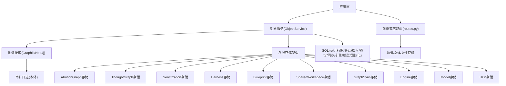

**图示来源**
- [object_service.py:52-93](file://odap/infra/object_service/object_service.py#L52-L93)
- [GRAPHITI_INTEGRATION.md:29-111](file://docs/03-modules/audit_log/GRAPHITI_INTEGRATION.md#L29-L111)
- [routes.py:16-32](file://odap/biz/integration/frontend_compat/api/routes.py#L16-L32)

## 详细组件分析

### AbutionGraph存储（SQLiteAbutionStorage）
- **数据模型要点**
  - 快照表：时序节点、模式节点、力节点、行动节点、跨维链接
  - JSON序列化/反序列化处理复杂属性
  - 支持快照的创建、查询、列表和删除操作
- **查询与事务**
  - 提供CRUD与条件查询接口，支持分页与排序
  - 通过事务保证快照数据的一致性
- **优化建议**
  - 对高并发写入场景启用WAL模式与合适的busy_timeout
  - 对JSON字段查询建立复合索引或物化视图

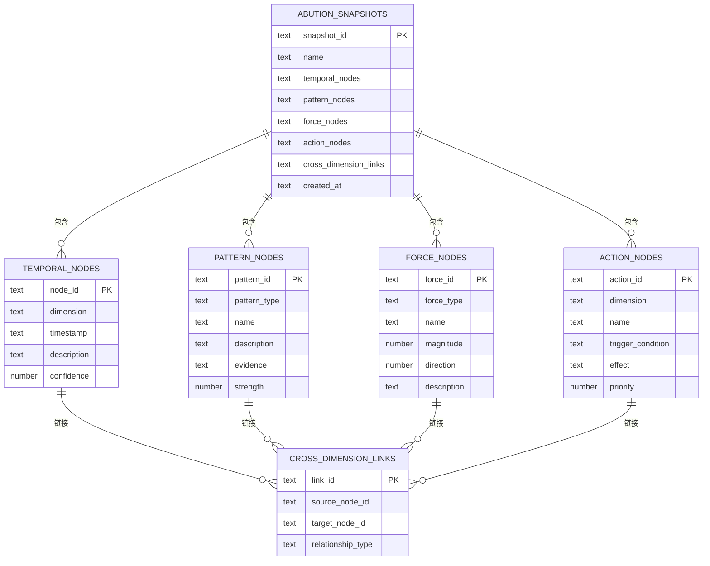

**图示来源**
- [sqlite_abution_storage.py:26-37](file://odap/biz/core/ontology/abution_graph/storage/sqlite_abution_storage.py#L26-L37)
- [sqlite_abution_storage.py:84-129](file://odap/biz/core/ontology/abution_graph/storage/sqlite_abution_storage.py#L84-L129)

**章节来源**
- [sqlite_abution_storage.py:15-179](file://odap/biz/core/ontology/abution_graph/storage/sqlite_abution_storage.py#L15-L179)

### ThoughtGraph存储（ThoughtGraphStorage）
- **数据模型要点**
  - 思维节点、推理链条、节点间边；支持基于类型、场景、代理的查询
  - 为节点类型、场景、代理与链条场景建立索引
  - 支持JSON字段存储复杂元数据
- **边操作**
  - 支持新增边、查询入边/出边/双向边
  - 支持边的删除和关系维护

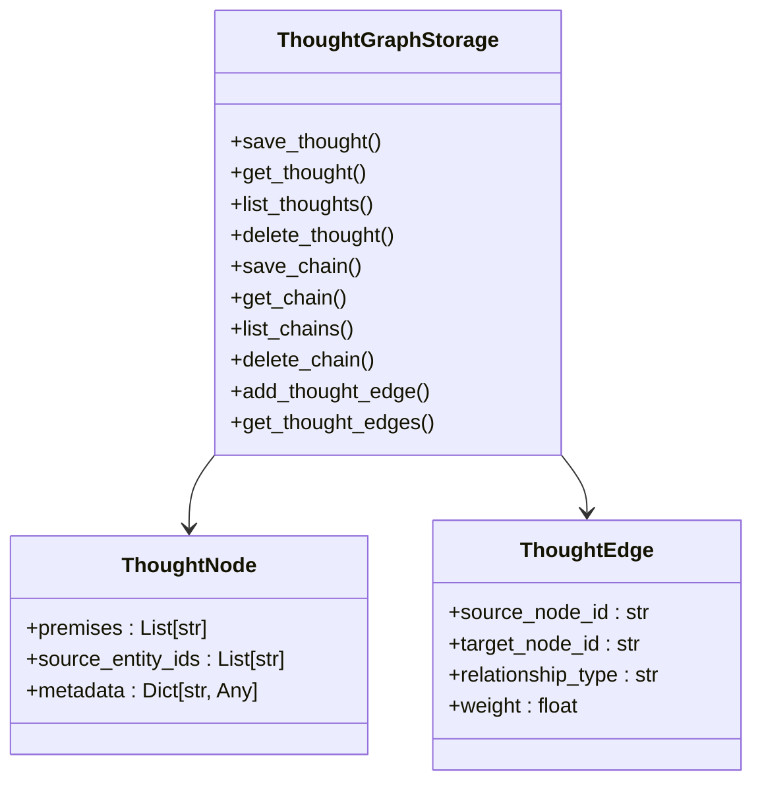

**图示来源**
- [sqlite_thought_storage.py:10-220](file://odap/biz/core/cognition/thought_graph/storage/sqlite_thought_storage.py#L10-L220)

**章节来源**
- [sqlite_thought_storage.py:10-220](file://odap/biz/core/cognition/thought_graph/storage/sqlite_thought_storage.py#L10-L220)

### Servitization存储（SQLiteServitizationStorage）
- **数据模型要点**
  - 技能模板表：模板ID、名称、描述、服务类型、对象类型、函数映射等
  - 生成服务表：服务ID、名称、描述、服务类型、源本体ID、状态、版本等
  - 部署信息表：部署ID、服务ID、端点URL、部署时间、健康状态等
  - 通过索引加速服务类型、状态、源本体ID等查询
- **查询与状态管理**
  - 支持按服务类型和状态过滤
  - 提供部署状态管理和健康检查
- **优化建议**
  - 对高频查询字段建立复合索引
  - 实施服务生命周期的自动清理策略

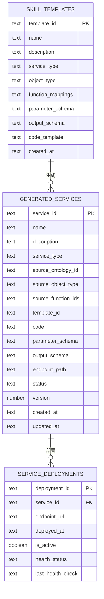

**图示来源**
- [sqlite_servitization_storage.py:24-65](file://odap/biz/core/ontology/servitization/storage/sqlite_servitization_storage.py#L24-L65)

**章节来源**
- [sqlite_servitization_storage.py:11-314](file://odap/biz/core/ontology/servitization/storage/sqlite_servitization_storage.py#L11-L314)

### Harness存储（SQLiteHarnessStorage）
- **数据模型要点**
  - 会话表：状态、阶段结果、人工确认、任务、上下文记忆、场景/工作区关联、消息、规划/本体/执行输出等
  - 蓝图表：节点/边、版本号、会话关联、创建时间
  - 通过索引加速状态、场景与会话查询
- **查询与迁移**
  - 提供列迁移以支持流水线字段扩展，保障向前兼容

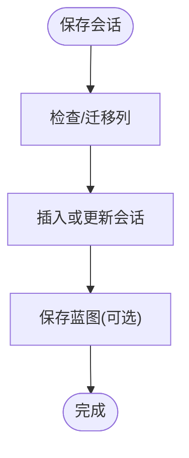

**图示来源**
- [sqlite_harness_storage.py:66-112](file://odap/biz/core/ontology/harness/storage/sqlite_harness_storage.py#L66-L112)
- [sqlite_harness_storage.py:168-200](file://odap/biz/core/ontology/harness/storage/sqlite_harness_storage.py#L168-L200)

**章节来源**
- [sqlite_harness_storage.py:10-64](file://odap/biz/core/ontology/harness/storage/sqlite_harness_storage.py#L10-L64)
- [sqlite_harness_storage.py:66-112](file://odap/biz/core/ontology/harness/storage/sqlite_harness_storage.py#L66-L112)
- [sqlite_harness_storage.py:168-200](file://odap/biz/core/ontology/harness/storage/sqlite_harness_storage.py#L168-L200)

### Blueprint存储（BlueprintStorage）
- **数据模型要点**
  - 蓝图节点：节点ID、节点类型、标签、阶段、配置、位置信息
  - 蓝图边：边ID、源节点、目标节点、边类型、权重
  - 版本控制：版本号、父版本ID、发布状态、元数据
  - 支持蓝图的创建、更新、删除、fork和发布操作
- **查询与版本管理**
  - 支持按场景ID、发布状态、版本号查询
  - 提供版本继承和变更追踪

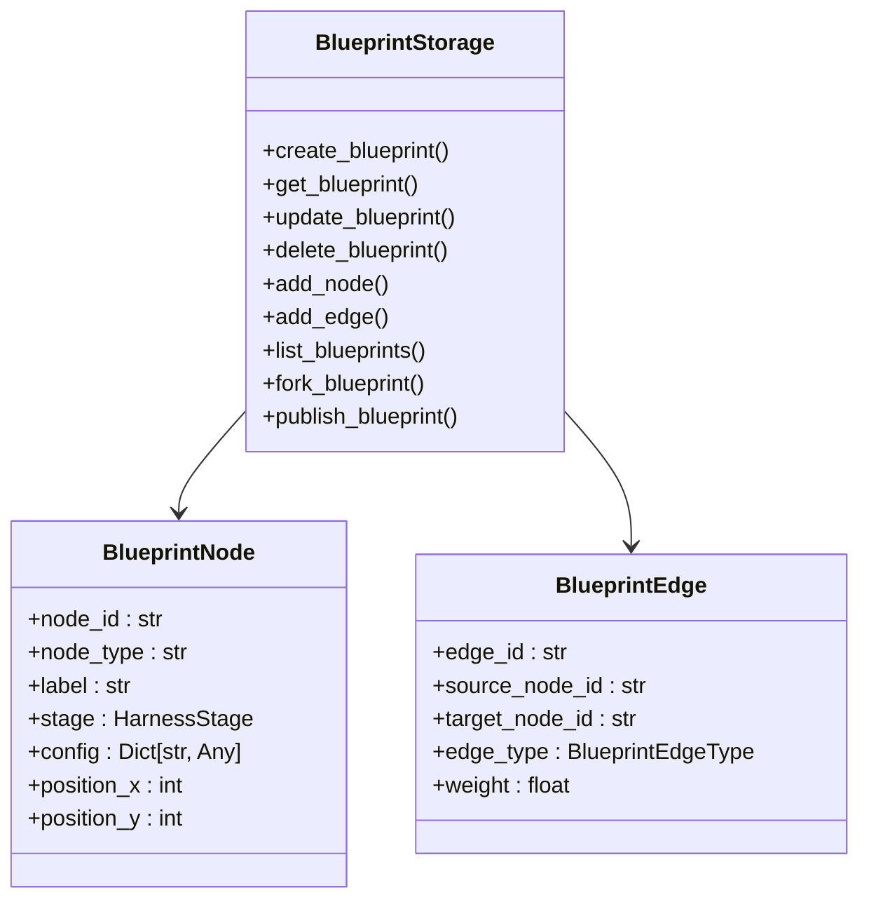

**图示来源**
- [test_blueprint_designer.py:103-319](file://tests/unit/test_blueprint_designer.py#L103-L319)

**章节来源**
- [test_blueprint_designer.py:103-319](file://tests/unit/test_blueprint_designer.py#L103-L319)

### SharedWorkspace存储（SharedWorkspaceStorage）
- **数据模型要点**
  - 工作空间资源分类：强制隔离资源、可选共享资源、平台共用资源
  - 本体共享绑定：版本化管理、引用关系、自动映射
  - 资源隔离策略：实体数据、会话状态、审计日志、用户配置的隔离实现
- **查询与隔离机制**
  - 支持按工作空间ID查询资源
  - 提供共享绑定关系的查询和验证

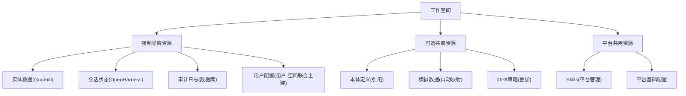

**图示来源**
- [ARCHITECTURE.md:149-260](file://docs/02-architecture/ARCHITECTURE.md#L149-L260)

**章节来源**
- [ARCHITECTURE.md:149-260](file://docs/02-architecture/ARCHITECTURE.md#L149-L260)

### GraphSync存储（MemoryGraphSyncStorage）
- **数据模型要点**
  - 同步映射表：记忆ID到图实体ID的映射、同步类型、状态、时间戳、元数据
  - 为记忆ID与图实体ID建立索引，支持未同步查询
  - 支持同步状态的更新和查询
- **用途**
  - 保障记忆与图谱的一致性与可追踪性
  - 支持工作记忆的跳过和已同步状态的处理

**章节来源**
- [sqlite_sync_storage.py:8-95](file://odap/biz/platform/ontology_memory/graph_sync/storage/sqlite_sync_storage.py#L8-L95)

### Engine存储（SQLiteEngineStorage）
- **数据模型要点**
  - 版本表：版本ID、本体ID、版本号、变更日志、有效时间、事务时间、状态、快照
  - 审计记录表：审计ID、实体类型ID、源、处理步骤、转换规则、结果、时间戳
  - 摄入审计记录表：审计ID、实体类型ID、源、源类型、处理步骤、转换规则、结果、时间戳
  - 通过索引加速本体ID、状态、时间戳等查询
- **查询与事务**
  - 提供CRUD与条件查询接口，支持分页与排序；通过事务保证一致性
  - 支持按时间点查询版本，支持审计记录的多条件过滤
- **优化建议**
  - 对高并发写入场景启用WAL模式与合适的busy_timeout
  - 对版本查询建立时间索引，对审计记录建立复合索引

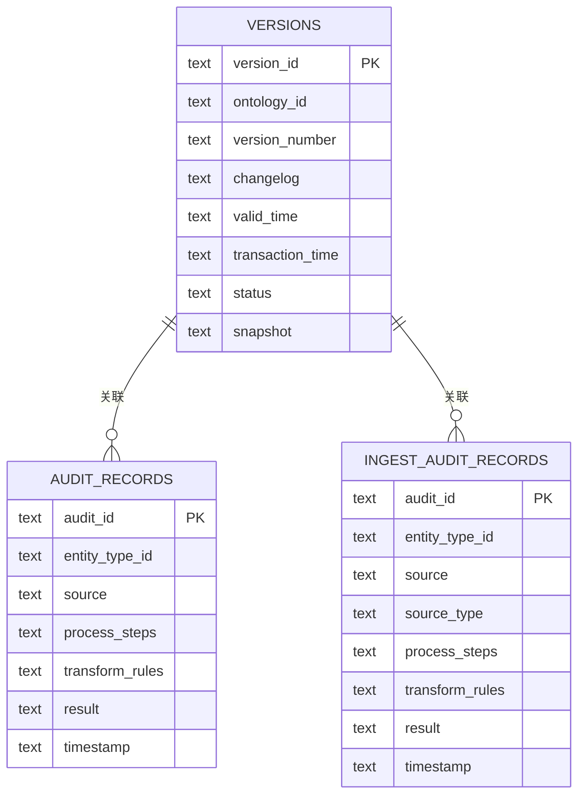

**图示来源**
- [sqlite_engine_storage.py:19-66](file://odap/biz/core/ontology/engine/storage/sqlite_engine_storage.py#L19-L66)

**章节来源**
- [sqlite_engine_storage.py:1-279](file://odap/biz/core/ontology/engine/storage/sqlite_engine_storage.py#L1-279)

### Model存储（SQLiteModelStorage）
- **数据模型要点**
  - 实体类型表：类型ID、名称、显示名、描述、属性、主键、链接、动作、约束、分类级别、元数据
  - 实例表：实例ID、类型ID、属性、工作空间ID、创建时间、更新时间
  - 本体文档表：ID、名称、版本、对象类型、动作类型、关系、元数据、创建时间、更新时间
  - 通过索引加速类型ID、工作空间ID、分类级别等查询
- **查询与事务**
  - 提供CRUD与条件查询接口，支持分页与排序；通过事务保证一致性
  - 支持批量导入实例，提供错误处理和统计
- **优化建议**
  - 对高并发写入场景启用WAL模式与合适的busy_timeout
  - 对实体类型查询建立复合索引，对实例查询建立多字段索引

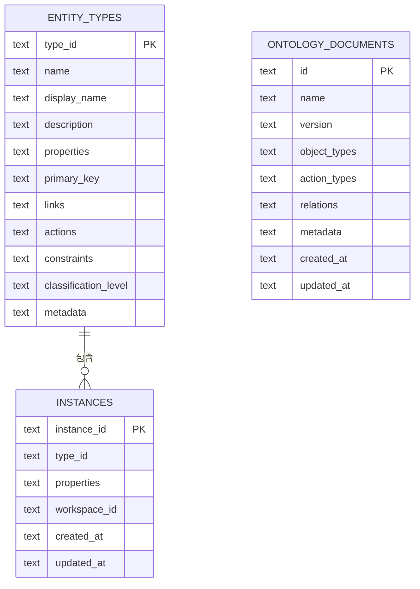

**图示来源**
- [sqlite_model_storage.py:19-56](file://odap/biz/core/ontology/model/storage/sqlite_model_storage.py#L19-L56)

**章节来源**
- [sqlite_model_storage.py:1-303](file://odap/biz/core/ontology/model/storage/sqlite_model_storage.py#L1-303)

### I18n存储（SQLiteI18nStorage）
- **数据模型要点**
  - 翻译表：键、模块、语言、值、更新时间（复合主键）
  - 支持按模块和语言过滤，支持分页查询
  - 提供模块和语言列表查询
- **查询与事务**
  - 提供CRUD与条件查询接口，支持分页与排序；通过事务保证一致性
  - 支持批量查询和统计总数
- **优化建议**
  - 对高频查询字段建立复合索引
  - 实施翻译缓存策略，减少重复查询

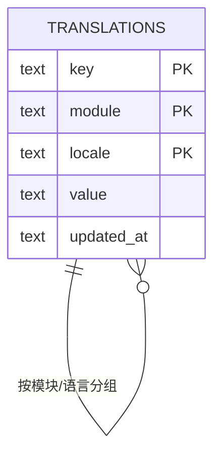

**图示来源**
- [sqlite_i18n_storage.py:21-31](file://odap/biz/platform/i18n/storage/sqlite_i18n_storage.py#L21-L31)

**章节来源**
- [sqlite_i18n_storage.py:1-160](file://odap/biz/platform/i18n/storage/sqlite_i18n_storage.py#L1-160)

### 运行期存储（SQLiteRuntimeStorage）
- **数据模型要点**
  - 函数定义、动作契约、状态传播图、变异记录、世界状态快照、聚合定义、触发器与执行记录
  - 为高频查询字段建立索引，如函数类型、目标对象类型、契约动作类型、变异对象/动作/时间、快照场景、聚合目标类型、触发器类型与激活状态等
- **查询与事务**
  - 提供CRUD与条件查询接口，支持分页与排序；通过事务保证一致性
- **优化建议**
  - 对高并发写入场景启用WAL模式与合适的busy_timeout
  - 对长尾查询建立复合索引或物化视图

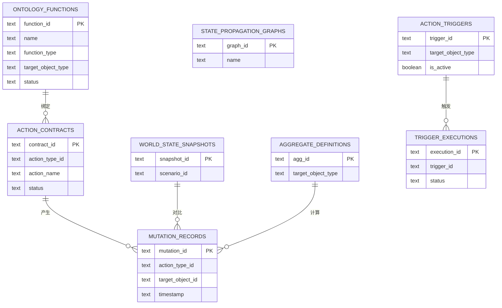

**图示来源**
- [sqlite_runtime_storage.py:24-152](file://odap/biz/core/ontology/runtime/storage/sqlite_runtime_storage.py#L24-L152)

**章节来源**
- [sqlite_runtime_storage.py:11-155](file://odap/biz/core/ontology/runtime/storage/sqlite_runtime_storage.py#L11-L155)

### 摄入/审计存储（SQLiteIngestStorage）
- **数据模型要点**
  - 摄入记录、审计日志、本体文档、构建历史、版本、实体注册表、校验规则与结果、处理日志、场景与场景文档
  - 场景表与场景文档表支持按场景聚合统计（文档数、事件数、实体数）
- **WAL与超时**
  - 默认启用WAL模式与busy_timeout，提升并发写入稳定性
- **查询与状态计算**
  - 支持按场景过滤摄入记录，计算构建状态（none/pending/completed/failed/partial）

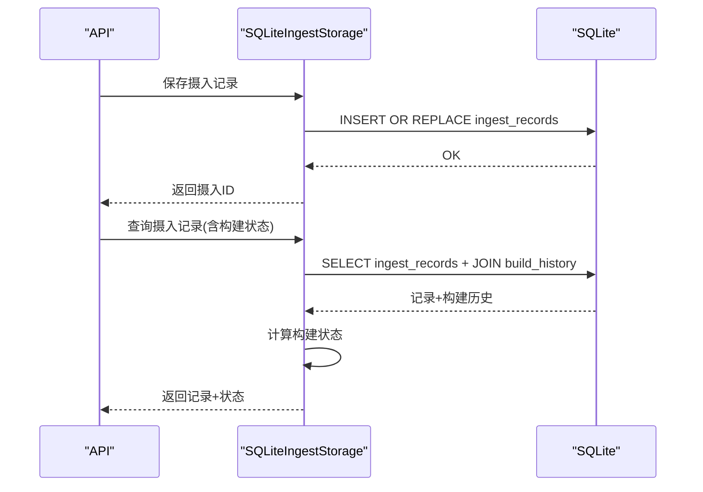

**图示来源**
- [sqlite_ingest_storage.py:580-785](file://odap/biz/core/ontology/storage/sqlite_ingest_storage.py#L580-L785)

**章节来源**
- [sqlite_ingest_storage.py:29-265](file://odap/biz/core/ontology/storage/sqlite_ingest_storage.py#L29-L265)
- [sqlite_ingest_storage.py:580-785](file://odap/biz/core/ontology/storage/sqlite_ingest_storage.py#L580-L785)

### 统一对象服务（ObjectService）
- **功能要点**
  - 聚合图、业务、知识库、代理等多源数据，提供统一查询、链接扩展与动作能力
  - 支持语义查询（文本→对象），调用图搜索进行混合检索
- **回退机制**
  - 在图模式为回退时，使用降级图查询以保障可用性

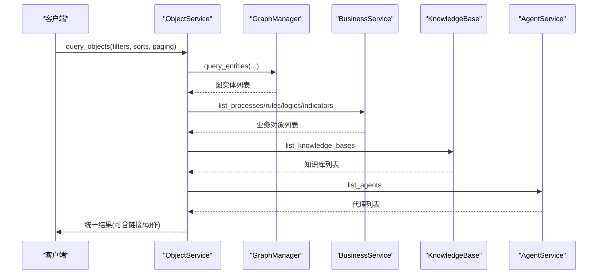

**图示来源**
- [object_service.py:52-93](file://odap/infra/object_service/object_service.py#L52-L93)
- [object_service.py:199-341](file://odap/infra/object_service/object_service.py#L199-L341)

**章节来源**
- [object_service.py:14-93](file://odap/infra/object_service/object_service.py#L14-L93)
- [object_service.py:199-341](file://odap/infra/object_service/object_service.py#L199-L341)

### 审计日志图存储（Graphiti/Neo4j）
- **设计要点**
  - 将审计日志以本体形式存储，统一实体类型与关系，支持复杂查询与分析
  - 提供直接Cypher查询接口，支持按用户/服务/动作/状态过滤
- **优势**
  - 消除多套存储系统，持久化不丢失，支持双时态知识图谱与灵活关系模型

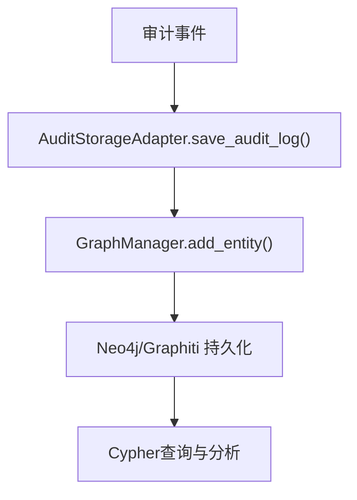

**图示来源**
- [GRAPHITI_INTEGRATION.md:29-111](file://docs/03-modules/audit_log/GRAPHITI_INTEGRATION.md#L29-L111)

**章节来源**
- [GRAPHITI_INTEGRATION.md:29-111](file://docs/03-modules/audit_log/GRAPHITI_INTEGRATION.md#L29-L111)

### 前端兼容路由（routes.py）
- **作用**
  - 定义场景存储目录，提供与前端兼容的API路由，承载场景与版本数据的文件化访问
- **配置**
  - 基于ODAP根目录下的storage/versions/scenarios作为场景数据落盘路径

**章节来源**
- [routes.py:16-32](file://odap/biz/integration/frontend_compat/api/routes.py#L16-L32)

## 依赖分析
- **组件耦合**
  - ObjectService对图、业务、知识库、代理等子系统存在依赖，是统一查询入口
  - 各存储模块彼此独立，通过统一的环境变量DATA_DIR定位数据库文件
  - 新增存储层之间存在特定的依赖关系，如AbutionGraph与GraphSync的协作
  - Engine存储与Model存储存在概念上的关联，都属于本体管理范畴
- **外部依赖**
  - Graphiti/Neo4j用于审计日志与统一对象检索
  - 前端兼容路由依赖场景目录与文件系统
  - OpenHarness用于工作空间会话管理

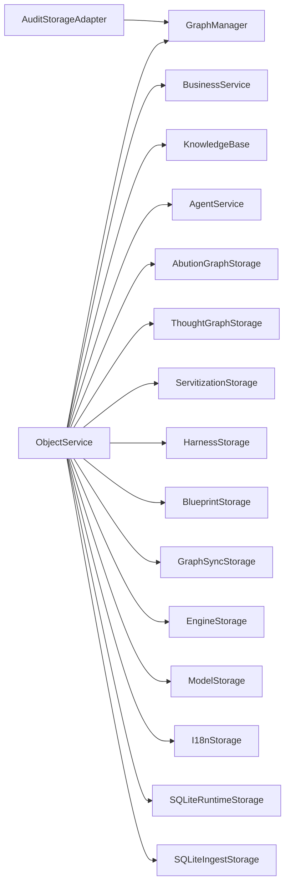

**图示来源**
- [object_service.py:22-48](file://odap/infra/object_service/object_service.py#L22-L48)
- [sqlite_abution_storage.py:15-21](file://odap/biz/core/ontology/abution_graph/storage/sqlite_abution_storage.py#L15-L21)
- [sqlite_thought_storage.py:10-16](file://odap/biz/core/cognition/thought_graph/storage/sqlite_thought_storage.py#L10-L16)
- [sqlite_servitization_storage.py:11-15](file://odap/biz/core/ontology/servitization/storage/sqlite_servitization_storage.py#L11-L15)
- [sqlite_harness_storage.py:10-14](file://odap/biz/core/ontology/harness/storage/sqlite_harness_storage.py#L10-L14)
- [sqlite_sync_storage.py:8-14](file://odap/biz/platform/ontology_memory/graph_sync/storage/sqlite_sync_storage.py#L8-L14)
- [sqlite_engine_storage.py:1-14](file://odap/biz/core/ontology/engine/storage/sqlite_engine_storage.py#L1-14)
- [sqlite_model_storage.py:1-14](file://odap/biz/core/ontology/model/storage/sqlite_model_storage.py#L1-14)
- [sqlite_i18n_storage.py:1-16](file://odap/biz/platform/i18n/storage/sqlite_i18n_storage.py#L1-16)
- [sqlite_runtime_storage.py:11-15](file://odap/biz/core/ontology/runtime/storage/sqlite_runtime_storage.py#L11-L15)
- [sqlite_ingest_storage.py:29-34](file://odap/biz/core/ontology/storage/sqlite_ingest_storage.py#L29-L34)
- [GRAPHITI_INTEGRATION.md:30-34](file://docs/03-modules/audit_log/GRAPHITI_INTEGRATION.md#L30-L34)

**章节来源**
- [object_service.py:22-48](file://odap/infra/object_service/object_service.py#L22-L48)
- [sqlite_abution_storage.py:15-21](file://odap/biz/core/ontology/abution_graph/storage/sqlite_abution_storage.py#L15-L21)
- [sqlite_thought_storage.py:10-16](file://odap/biz/core/cognition/thought_graph/storage/sqlite_thought_storage.py#L10-L16)
- [sqlite_servitization_storage.py:11-15](file://odap/biz/core/ontology/servitization/storage/sqlite_servitization_storage.py#L11-L15)
- [sqlite_harness_storage.py:10-14](file://odap/biz/core/ontology/harness/storage/sqlite_harness_storage.py#L10-L14)
- [sqlite_sync_storage.py:8-14](file://odap/biz/platform/ontology_memory/graph_sync/storage/sqlite_sync_storage.py#L8-L14)
- [sqlite_engine_storage.py:1-14](file://odap/biz/core/ontology/engine/storage/sqlite_engine_storage.py#L1-14)
- [sqlite_model_storage.py:1-14](file://odap/biz/core/ontology/model/storage/sqlite_model_storage.py#L1-14)
- [sqlite_i18n_storage.py:1-16](file://odap/biz/platform/i18n/storage/sqlite_i18n_storage.py#L1-16)
- [sqlite_runtime_storage.py:11-15](file://odap/biz/core/ontology/runtime/storage/sqlite_runtime_storage.py#L11-L15)
- [sqlite_ingest_storage.py:29-34](file://odap/biz/core/ontology/storage/sqlite_ingest_storage.py#L29-L34)
- [GRAPHITI_INTEGRATION.md:30-34](file://docs/03-modules/audit_log/GRAPHITI_INTEGRATION.md#L30-L34)

## 性能考虑
- **并发与事务**
  - 所有存储层默认启用WAL模式与busy_timeout，降低锁竞争与超时风险
  - 新增存储层特别注意JSON字段的序列化/反序列化性能
  - Engine存储和Model存储需要特别关注大量JSON数据的处理效率
- **索引策略**
  - 针对高频过滤字段（如状态、场景ID、对象类型、时间戳）建立索引，减少全表扫描
  - AbutionGraph层对跨维度链接建立复合索引
  - Servitization层对服务类型、状态、源本体ID建立复合索引
  - Engine层对版本查询建立时间索引，对审计记录建立复合索引
  - Model层对实体类型查询建立复合索引，对实例查询建立多字段索引
  - I18n层对模块和语言建立复合索引
- **查询优化**
  - 使用分页与限制返回数量；对复杂查询优先走图数据库（Graphiti）的Cypher，利用索引与关系直达
  - 新增存储层查询优先使用带索引的过滤条件与LIMIT
  - Engine存储支持按时间点查询版本，需要优化时间范围查询
  - Model存储支持批量导入，需要优化批量写入性能
- **缓存与预加载**
  - 对热点对象与常用查询结果引入缓存（建议Redis），结合失效策略与预热
  - 新增存储层：AbutionGraph快照缓存、Servitization模板缓存、Blueprint版本缓存、GraphSync映射缓存、Engine版本缓存、Model实体类型缓存、I18n翻译缓存
- **热点数据处理**
  - 对高并发写入的摄入与审计表，采用批量写入与异步处理
  - 对查询热点建立只读副本或近线存储
  - 对Engine存储的版本查询和审计记录查询建立缓存层
  - 对Model存储的实体类型查询建立缓存层
  - 对I18n存储的翻译查询建立缓存层
- **数据压缩与归档**
  - 对历史审计与低频查询数据进行归档，保留索引与必要字段
  - 对大字段采用压缩存储（需权衡CPU开销）
  - 对Engine存储的版本快照和审计记录进行压缩存储
  - 对Model存储的大JSON字段进行压缩存储
- **存储空间管理**
  - 定期清理无效/过期数据，回收WAL日志，监控各SQLite文件大小与增长趋势
  - 新增存储层：Servitization部署信息的自动清理策略，Engine存储的版本归档策略，Model存储的旧版本清理策略
- **成本优化**
  - 通过分层存储与冷热分离降低IO成本；合理设置索引数量与大小，避免过度索引导致写放大
  - 新增存储层：按使用频率分离热数据和冷数据，对Engine存储和Model存储实施数据压缩

## 故障排查指南
- **审计日志无法持久化**
  - 检查Graphiti/Neo4j连接状态与权限；确认AuditStorageAdapter的save_audit_log是否抛出异常
- **查询性能下降**
  - 检查是否存在全表扫描，补充缺失索引；核对WHERE条件与LIMIT设置
- **摄入写入阻塞**
  - 检查WAL模式与busy_timeout配置；观察是否有长时间事务占用；必要时拆分批量写入
- **记忆同步异常**
  - 使用未同步查询接口定位问题；检查同步映射表状态与元数据
- **前端场景数据不可访问**
  - 核对场景目录路径与文件权限；确认路由配置与存储初始化
- **AbutionGraph快照异常**
  - 检查JSON序列化/反序列化错误；验证跨维度链接的有效性
- **Servitization服务部署失败**
  - 检查服务模板配置；验证生成代码的正确性；确认部署端点可达性
- **Blueprint版本管理问题**
  - 检查版本继承关系；验证fork操作的完整性；确认发布状态的一致性
- **GraphSync同步延迟**
  - 检查同步映射表的状态更新；验证图实体ID的有效性；确认同步类型配置
- **Engine存储版本查询异常**
  - 检查版本表的时间戳格式；验证有效时间与事务时间的索引；确认版本状态过滤
- **Model存储实体类型查询缓慢**
  - 检查实体类型表的索引；验证JSON字段的查询条件；确认批量导入的错误处理
- **I18n存储翻译查询异常**
  - 检查翻译表的复合主键；验证模块和语言的索引；确认翻译缓存的失效策略

**章节来源**
- [GRAPHITI_INTEGRATION.md:66-111](file://docs/03-modules/audit_log/GRAPHITI_INTEGRATION.md#L66-L111)
- [sqlite_abution_storage.py:41-50](file://odap/biz/core/ontology/abution_graph/storage/sqlite_abution_storage.py#L41-L50)
- [sqlite_servitization_storage.py:196-206](file://odap/biz/core/ontology/servitization/storage/sqlite_servitization_storage.py#L196-L206)
- [test_blueprint_designer.py:300-319](file://tests/unit/test_blueprint_designer.py#L300-L319)
- [sqlite_sync_storage.py:77-85](file://odap/biz/platform/ontology_memory/graph_sync/storage/sqlite_sync_storage.py#L77-L85)
- [routes.py:16-32](file://odap/biz/integration/frontend_compat/api/routes.py#L16-L32)
- [sqlite_engine_storage.py:117-129](file://odap/biz/core/ontology/engine/storage/sqlite_engine_storage.py#L117-L129)
- [sqlite_model_storage.py:101-124](file://odap/biz/core/ontology/model/storage/sqlite_model_storage.py#L101-L124)
- [test_i18n_service.py:11-30](file://tests/unit/test_i18n_service.py#L11-L30)

## 结论
ODAP平台的存储策略以"八层存储协同 + 图数据库本体化 + 文件化场景"为核心，通过模块化的存储架构覆盖AbutionGraph、ThoughtGraph、Servitization、Harness、Blueprint、SharedWorkspace、GraphSync、Engine、Model、I18n等新增存储层，借助传统的SQLite存储覆盖运行期、会话、摄入、图谱、同步映射、引擎、模型和国际化等，借助Graphiti/Neo4j实现审计日志与统一对象检索的强关系表达与高效查询，辅以前端兼容路由完成场景与版本数据的文件化落盘。新增的八层存储架构进一步增强了平台的多维度建模能力、智能推理能力、服务化转型能力、工作空间管理能力、本体引擎管理能力、模型管理能力和国际化支持能力。配合索引、WAL、缓存与归档策略，可在保证一致性的同时满足高并发与可扩展需求。建议持续监控与容量规划，结合业务增长迭代优化存储模型与查询路径。

## 附录

### 数据分区与索引策略
- **分区建议**
  - 按场景ID分区摄入与构建历史，便于清理与迁移
  - 对审计日志按时间分区，支持滚动清理与长期归档
  - 新增存储层：AbutionGraph按创建时间分区，Servitization按服务类型分区，Engine按版本时间分区，Model按实体类型分区，I18n按模块和语言分区
- **索引建议**
  - 运行期：函数类型、目标对象类型；契约动作类型；变异对象/动作/时间；快照场景；聚合目标类型；触发器类型与激活状态
  - 摄入：场景ID、状态、时间；实体注册表按类型与名称组合索引
  - 思维图谱：节点类型、场景、代理；链条场景
  - 记忆同步：记忆ID、图实体ID
  - AbutionGraph：跨维度链接类型、时间戳、节点类型
  - Servitization：服务类型、状态、源本体ID、模板ID
  - Blueprint：场景ID、发布状态、版本号
  - SharedWorkspace：工作空间ID、资源类型
  - GraphSync：同步状态、最后同步时间
  - Engine：本体ID、状态、时间戳
  - Model：类型ID、工作空间ID、分类级别
  - I18n：模块、语言、键

**章节来源**
- [sqlite_runtime_storage.py:105-112](file://odap/biz/core/ontology/runtime/storage/sqlite_runtime_storage.py#L105-L112)
- [sqlite_ingest_storage.py:181-189](file://odap/biz/core/ontology/storage/sqlite_ingest_storage.py#L181-L189)
- [sqlite_thought_storage.py:55-58](file://odap/biz/core/cognition/thought_graph/storage/sqlite_thought_storage.py#L55-L58)
- [sqlite_sync_storage.py:29-30](file://odap/biz/platform/ontology_memory/graph_sync/storage/sqlite_sync_storage.py#L29-L30)
- [sqlite_abution_storage.py:26-37](file://odap/biz/core/ontology/abution_graph/storage/sqlite_abution_storage.py#L26-L37)
- [sqlite_servitization_storage.py:67-73](file://odap/biz/core/ontology/servitization/storage/sqlite_servitization_storage.py#L67-L73)
- [ARCHITECTURE.md:248-260](file://docs/02-architecture/ARCHITECTURE.md#L248-L260)
- [sqlite_engine_storage.py:32-66](file://odap/biz/core/ontology/engine/storage/sqlite_engine_storage.py#L32-L66)
- [sqlite_model_storage.py:34-43](file://odap/biz/core/ontology/model/storage/sqlite_model_storage.py#L34-L43)
- [sqlite_i18n_storage.py:20-31](file://odap/biz/platform/i18n/storage/sqlite_i18n_storage.py#L20-L31)

### 查询优化方案
- **优先使用带索引的过滤条件与LIMIT**
- **对复杂关系查询优先走图数据库（Graphiti）的Cypher**
- **对高频查询引入缓存与预热，减少重复计算**
- **新增存储层优化**：AbutionGraph使用JSON字段索引，Servitization使用复合索引，Blueprint使用版本链查询优化，Engine使用时间索引，Model使用复合索引，I18n使用复合索引

**章节来源**
- [object_service.py:97-146](file://odap/infra/object_service/object_service.py#L97-L146)
- [GRAPHITI_INTEGRATION.md:66-111](file://docs/03-modules/audit_log/GRAPHITI_INTEGRATION.md#L66-L111)

### 缓存层设计、数据预加载与热点处理
- **缓存策略**：热点对象与查询结果缓存，结合TTL与失效策略
- **预加载**：启动时预热常用对象与查询结果
- **热点处理**：批量写入、异步处理、只读副本与近线存储
- **新增缓存策略**：AbutionGraph快照缓存、Servitization模板缓存、Blueprint版本缓存、GraphSync映射缓存、Engine版本缓存、Model实体类型缓存、I18n翻译缓存

### 数据压缩、归档与存储空间管理
- **压缩**：对大字段与历史数据进行压缩存储
- **归档**：按时间与场景归档低频数据，保留必要索引
- **空间管理**：定期清理、回收WAL、监控文件大小与增长趋势
- **新增归档策略**：AbutionGraph快照的压缩存储，Servitization部署信息的自动清理，Engine存储的版本归档，Model存储的旧版本清理

### 备份恢复、灾难恢复与数据迁移
- **备份**：定期备份SQLite文件与图数据库快照
- **恢复**：制定恢复流程与验证步骤
- **灾难恢复**：异地备份与切换演练
- **迁移**：参考存储架构重设计检查清单，确保数据模型与索引一致
- **新增迁移策略**：八层存储架构的渐进式迁移，保持向后兼容性，Engine存储与Model存储的数据格式迁移

**章节来源**
- [checklist.md:1-73](file://docs/11-archive/specs/storage-architecture-redesign/checklist.md#L1-L73)

### 存储性能监控、容量规划与成本优化
- **监控**：连接数、查询延迟、索引命中率、WAL大小、磁盘空间
- **规划**：根据业务增长预测容量与性能指标阈值
- **优化**：冷热分离、索引裁剪、批量写入、缓存与异步处理
- **新增监控指标**：AbutionGraph快照大小、Servitization服务数量、Blueprint版本数量、GraphSync同步延迟、Engine版本数量、Model实体数量、I18n翻译数量