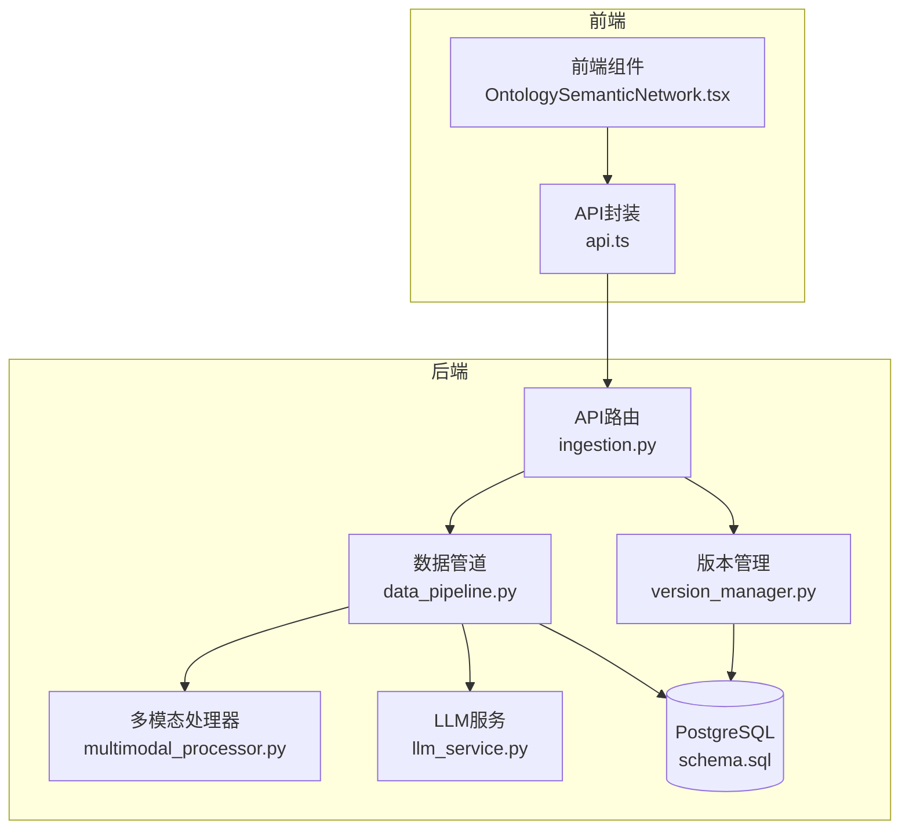
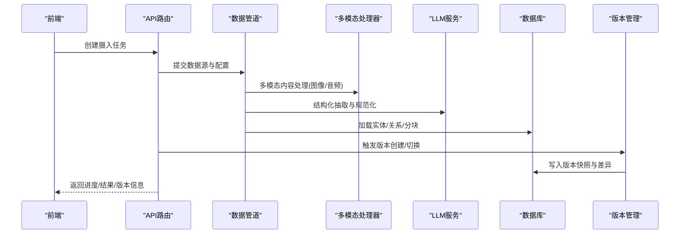
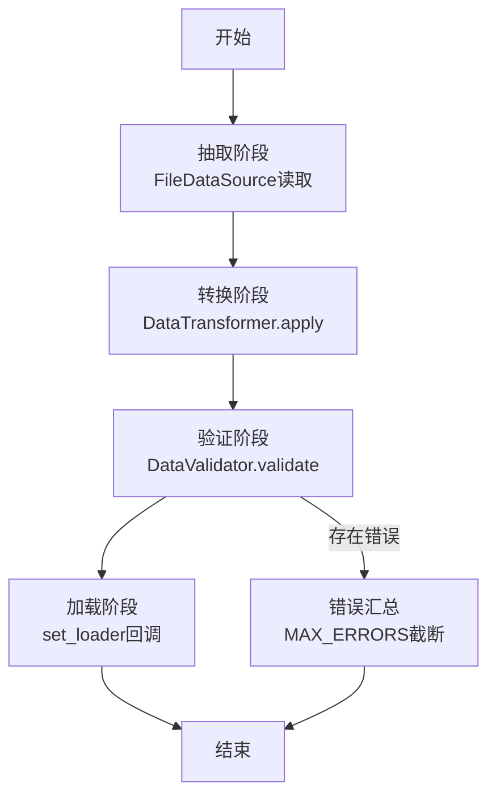
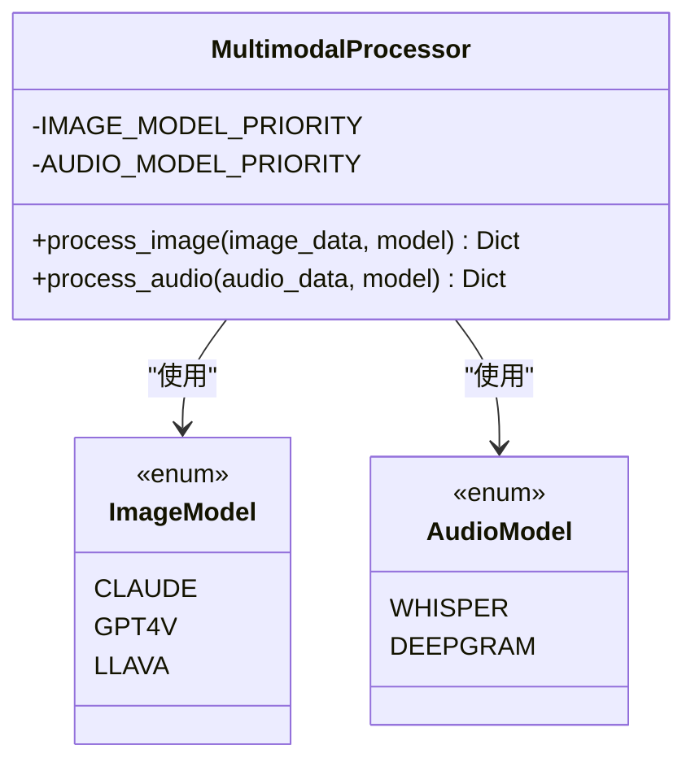
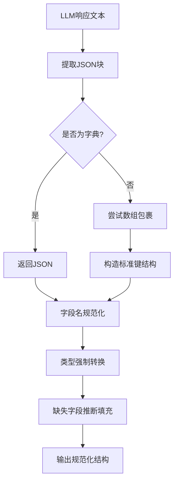
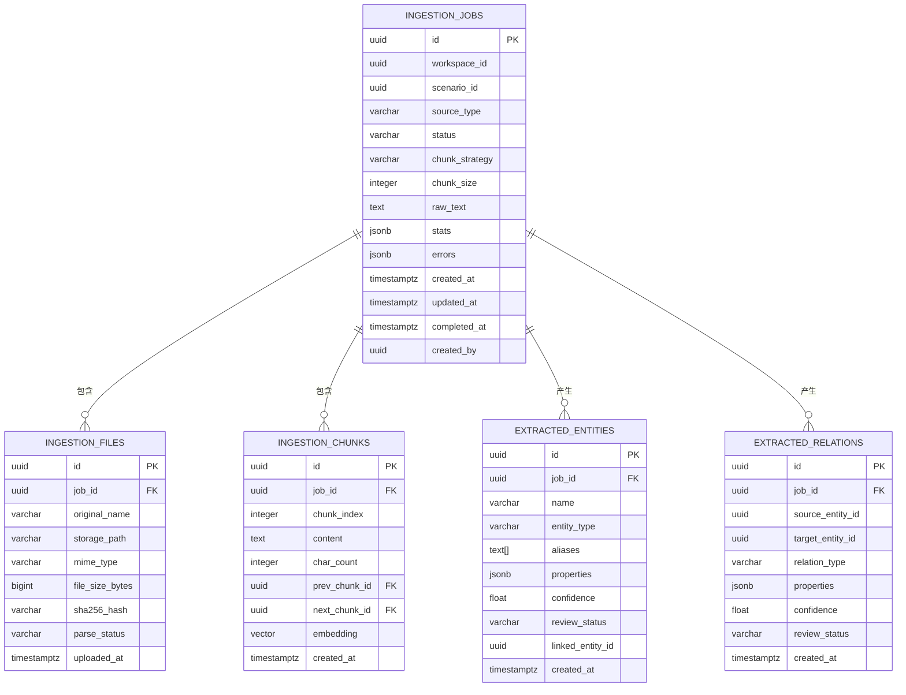
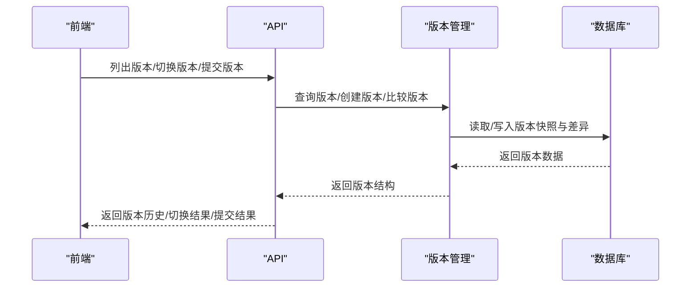
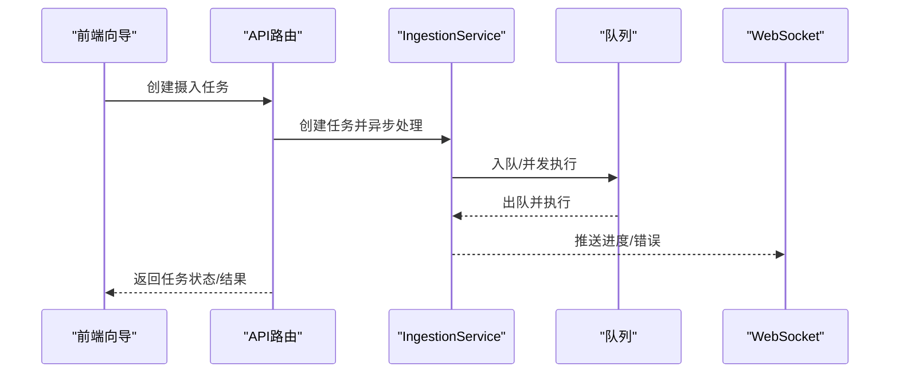
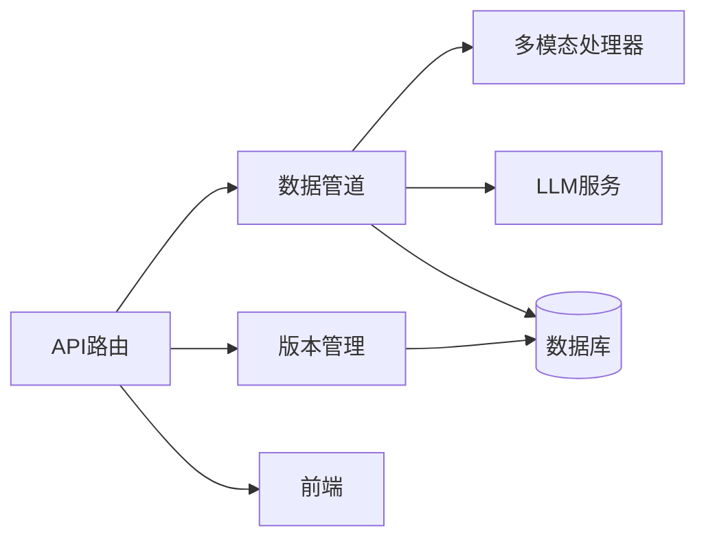

# 数据Schema

<cite>
**本文引用的文件**
- [ARCHITECTURE_FULL_CHAIN_DEEP.md](file://docs/02-architecture/ARCHITECTURE_FULL_CHAIN_DEEP.md)
- [data_pipeline.py](file://odap/infra/data_pipeline.py)
- [multimodal_processor.py](file://odap/infra/data_pipeline/multimodal_processor.py)
- [llm_service.py](file://odap/infra/llm/llm_service.py)
- [simulation_validators.py](file://docs/03-modules/ontology/DESIGN.md)
- [normalizer.py](file://docs/02-architecture/ARCHITECTURE_FULL_CHAIN_DEEP.md)
- [version_manager.py](file://docs/02-architecture/ARCHITECTURE_FULL_CHAIN_DEEP.md)
- [schema.sql](file://docs/02-architecture/ARCHITECTURE_FULL_CHAIN_DEEP.md)
- [ingestion.py](file://docs/02-architecture/ARCHITECTURE_FULL_CHAIN_DEEP.md)
- [queue.py](file://docs/02-architecture/ARCHITECTURE_FULL_CHAIN_DEEP.md)
- [ws_progress.py](file://docs/02-architecture/ARCHITECTURE_FULL_CHAIN_DEEP.md)
- [OntologySemanticNetwork.tsx](file://frontend/src/modules/ontology/pages/OntologySemanticNetwork.tsx)
- [api.ts](file://frontend/src/modules/shared/services/api.ts)
</cite>

## 目录
1. [简介](#简介)
2. [项目结构](#项目结构)
3. [核心组件](#核心组件)
4. [架构总览](#架构总览)
5. [详细组件分析](#详细组件分析)
6. [依赖分析](#依赖分析)
7. [性能考虑](#性能考虑)
8. [故障排查指南](#故障排查指南)
9. [结论](#结论)
10. [附录](#附录)

## 简介
本文件面向ODAP平台的数据Schema设计与实现，聚焦多模态数据的Schema定义与约束规则，系统阐述结构化、半结构化、非结构化数据的处理策略；明确数据类型定义、字段约束与格式验证规则；给出Schema版本管理、向后兼容与自动迁移机制；提供数据转换规则、格式标准化与质量控制流程；并总结Schema验证器实现、错误处理与异常恢复策略，为数据工程师与ETL开发人员提供完整的设计与实现指南。

## 项目结构
ODAP平台围绕“数据摄入—标准化—本体构建—版本管理—可视化”的主链路组织Schema与数据处理能力。前端通过API与后端交互，后端通过统一的数据管道与多模态处理器对接不同数据源，最终写入数据库并支持版本化管理与可视化展示。

**图表来源**
- [ingestion.py:846-927](file://docs/02-architecture/ARCHITECTURE_FULL_CHAIN_DEEP.md#L846-L927)
- [data_pipeline.py:275-426](file://odap/infra/data_pipeline.py#L275-L426)
- [multimodal_processor.py:19-125](file://odap/infra/data_pipeline/multimodal_processor.py#L19-L125)
- [llm_service.py:1-439](file://odap/infra/llm/llm_service.py#L1-L439)
- [schema.sql:987-1062](file://docs/02-architecture/ARCHITECTURE_FULL_CHAIN_DEEP.md#L987-L1062)
- [version_manager.py:1945-2156](file://docs/02-architecture/ARCHITECTURE_FULL_CHAIN_DEEP.md#L1945-L2156)

**章节来源**
- [ARCHITECTURE_FULL_CHAIN_DEEP.md:39-1165](file://docs/02-architecture/ARCHITECTURE_FULL_CHAIN_DEEP.md#L39-L1165)

## 核心组件
- 数据管道(DataPipeline)：统一的多数据源接入与编排，包含抽取、转换、验证、加载阶段，支持错误收集与阶段统计。
- 多模态处理器(MultimodalProcessor)：图像与音频处理的优先级与降级策略，提供统一输出结构。
- LLM服务(ZhipuAIClient/OpenAIClient派生)：结构化输出解析、字段规范化、类型强制与缺失字段推断。
- 数据验证器(DataValidator)：可插拔规则集，支持批量记录验证与错误汇总。
- 数据转换器(DataTransformer)：链式转换函数，支持批内逐条转换。
- 版本管理(OntologyVersionManager)：语义版本号生成、快照存储、差异计算与回滚兼容性检查。
- 数据库Schema：摄入作业、文件、分块、实体、关系等核心表结构与约束。

**章节来源**
- [data_pipeline.py:275-426](file://odap/infra/data_pipeline.py#L275-L426)
- [multimodal_processor.py:19-125](file://odap/infra/data_pipeline/multimodal_processor.py#L19-L125)
- [llm_service.py:22-439](file://odap/infra/llm/llm_service.py#L22-L439)
- [version_manager.py:1945-2156](file://docs/02-architecture/ARCHITECTURE_FULL_CHAIN_DEEP.md#L1945-L2156)
- [schema.sql:987-1062](file://docs/02-architecture/ARCHITECTURE_FULL_CHAIN_DEEP.md#L987-L1062)

## 架构总览
ODAP平台的Schema与数据处理遵循“统一抽象—多模态融合—结构化输出—版本化管理”的闭环：

**图表来源**
- [ingestion.py:846-927](file://docs/02-architecture/ARCHITECTURE_FULL_CHAIN_DEEP.md#L846-L927)
- [data_pipeline.py:275-426](file://odap/infra/data_pipeline.py#L275-L426)
- [multimodal_processor.py:19-125](file://odap/infra/data_pipeline/multimodal_processor.py#L19-L125)
- [llm_service.py:1-439](file://odap/infra/llm/llm_service.py#L1-L439)
- [version_manager.py:1945-2156](file://docs/02-architecture/ARCHITECTURE_FULL_CHAIN_DEEP.md#L1945-L2156)

## 详细组件分析

### 数据管道与Schema
- 统一数据记录(DataRecord)：包含内容、格式、元数据与摄入时间戳，支持序列化为字典。
- 管道阶段(StageResult/PipelineResult)：记录各阶段输入/输出数量、失败数、耗时与错误详情。
- 数据源(FileDataSource)：支持JSON/CSV/Parquet/PDF/TXT/Markdown/XML/YAML/Raw等格式自动识别与读取。
- 转换(DataTransformer)：链式函数，逐条应用，支持返回None跳过记录。
- 验证(DataValidator)：规则函数返回None表示通过，否则返回错误信息；批量汇总。

**图表来源**
- [data_pipeline.py:275-426](file://odap/infra/data_pipeline.py#L275-L426)

**章节来源**
- [data_pipeline.py:50-426](file://odap/infra/data_pipeline.py#L50-L426)

### 多模态Schema与处理策略
- 图像模型优先级：Claude → GPT4V → LLaVA；音频模型优先级：Whisper → Deepgram。
- 统一输出结构：图像包含描述、对象列表与置信度；音频包含转录文本、语言与置信度。
- 降级策略：任一模型失败则尝试下一个，全部失败返回降级结果并标记fallback。

**图表来源**
- [multimodal_processor.py:8-27](file://odap/infra/data_pipeline/multimodal_processor.py#L8-L27)

**章节来源**
- [multimodal_processor.py:19-125](file://odap/infra/data_pipeline/multimodal_processor.py#L19-L125)

### LLM结构化输出与Schema规范化
- JSON解析：支持直接JSON、Markdown代码块包裹、嵌套包裹层与数组形式，最终提取有效JSON。
- 字段规范化：通过Pydantic schema进行字段名映射与别名匹配，修复LLM字段名偏差。
- 类型强制与缺失字段填充：对整数/浮点/字符串等类型进行强制转换；对缺失的required字段进行上下文推断填充。
- 与抽取实体/关系/事件等Schema对齐，保证输出结构稳定。

**图表来源**
- [llm_service.py:151-218](file://odap/infra/llm/llm_service.py#L151-L218)
- [llm_service.py:240-299](file://odap/infra/llm/llm_service.py#L240-L299)
- [llm_service.py:301-366](file://odap/infra/llm/llm_service.py#L301-L366)

**章节来源**
- [llm_service.py:1-439](file://odap/infra/llm/llm_service.py#L1-L439)

### 数据库Schema与约束
- 摄入作业表：记录来源类型、状态、分块策略与大小、统计与错误、时间戳与创建者。
- 文件表：记录原始文件名、存储路径、MIME类型、大小、哈希与解析状态。
- 分块表：记录分块索引、内容、字符数、前后分块引用、向量嵌入与创建时间。
- 实体表：记录实体名称、类型、别名、属性、置信度、评审状态与链接实体。
- 关系表：记录源/目标实体ID、关系类型、属性、置信度、评审状态与创建时间。
- 索引：针对工作区、状态、实体类型与关系、向量嵌入建立索引以支撑查询与相似检索。

**图表来源**
- [schema.sql:987-1062](file://docs/02-architecture/ARCHITECTURE_FULL_CHAIN_DEEP.md#L987-L1062)

**章节来源**
- [schema.sql:987-1062](file://docs/02-architecture/ARCHITECTURE_FULL_CHAIN_DEEP.md#L987-L1062)

### 版本管理与向后兼容
- 语义版本号：每次摄入递增补丁版本，形成版本链。
- 快照与差异：保存实体/关系/元数据快照，计算新增/修改/删除数量。
- 兼容性检查：回滚目标指定需同时满足兼容性标记；版本号格式校验。
- 前端切换与提交：支持切换到指定版本、提交当前工作为新版本并返回版本信息。

**图表来源**
- [version_manager.py:1945-2156](file://docs/02-architecture/ARCHITECTURE_FULL_CHAIN_DEEP.md#L1945-L2156)
- [api.ts:880-918](file://frontend/src/modules/shared/services/api.ts#L880-L918)
- [OntologySemanticNetwork.tsx:329-372](file://frontend/src/modules/ontology/pages/OntologySemanticNetwork.tsx#L329-L372)

**章节来源**
- [version_manager.py:1945-2156](file://docs/02-architecture/ARCHITECTURE_FULL_CHAIN_DEEP.md#L1945-L2156)
- [api.ts:880-918](file://frontend/src/modules/shared/services/api.ts#L880-L918)
- [OntologySemanticNetwork.tsx:329-372](file://frontend/src/modules/ontology/pages/OntologySemanticNetwork.tsx#L329-L372)

### 模拟推演本体验证规则
- 场景参数Schema与默认参数一致性验证。
- 版本号格式与参数快照、回滚兼容性、执行计数一致性验证。
- 执行状态机、时间一致性、进度范围、资源限制与使用记录验证。
- 结果完整性、指标数值类型、存储大小与压缩比、结果版本格式验证。
- What-if分析的参数变化、类型与深度、完成态一致性与相关性验证。

**章节来源**
- [simulation_validators.py:767-953](file://docs/03-modules/ontology/DESIGN.md#L767-L953)

### 实体标准化与去重
- 同名/近名实体匹配：精确匹配、模糊相似度阈值匹配、别名匹配。
- 批内去重：按名称与类型聚合，合并别名、属性、来源分块ID与置信度。
- 链接映射：返回标准化实体与链接到已有实体的映射，便于后续写入与对齐。

**章节来源**
- [normalizer.py:1287-1374](file://docs/02-architecture/ARCHITECTURE_FULL_CHAIN_DEEP.md#L1287-L1374)

### 摄入流程与质量控制
- 前端向导：选择来源、上传文件/粘贴文本、配置分块策略与大小、轮询状态、结果预览。
- API路由：创建任务、查询状态、取消任务、列举解析器支持格式。
- 队列与超时：基于Redis的优先级队列、并发控制、超时保护与任务取消。
- WebSocket：实时推送进度与错误，便于前端交互。

**图表来源**
- [ingestion.py:846-927](file://docs/02-architecture/ARCHITECTURE_FULL_CHAIN_DEEP.md#L846-L927)
- [queue.py:1067-1165](file://docs/02-architecture/ARCHITECTURE_FULL_CHAIN_DEEP.md#L1067-L1165)
- [ws_progress.py:1169-1210](file://docs/02-architecture/ARCHITECTURE_FULL_CHAIN_DEEP.md#L1169-L1210)

**章节来源**
- [ingestion.py:846-927](file://docs/02-architecture/ARCHITECTURE_FULL_CHAIN_DEEP.md#L846-L927)
- [queue.py:1067-1165](file://docs/02-architecture/ARCHITECTURE_FULL_CHAIN_DEEP.md#L1067-L1165)
- [ws_progress.py:1169-1210](file://docs/02-architecture/ARCHITECTURE_FULL_CHAIN_DEEP.md#L1169-L1210)

## 依赖分析
- 组件耦合：数据管道作为编排核心，向上对接API与前端，向下连接多模态与LLM，最终写入数据库；版本管理独立于数据管道，通过数据库交互实现。
- 外部依赖：Redis用于队列，PostgreSQL用于持久化，HTTP客户端用于外部LLM服务，向量索引用于相似检索。
- 循环依赖：未发现循环依赖，模块边界清晰。

**图表来源**
- [ingestion.py:846-927](file://docs/02-architecture/ARCHITECTURE_FULL_CHAIN_DEEP.md#L846-L927)
- [data_pipeline.py:275-426](file://odap/infra/data_pipeline.py#L275-L426)
- [multimodal_processor.py:19-125](file://odap/infra/data_pipeline/multimodal_processor.py#L19-L125)
- [llm_service.py:1-439](file://odap/infra/llm/llm_service.py#L1-L439)
- [version_manager.py:1945-2156](file://docs/02-architecture/ARCHITECTURE_FULL_CHAIN_DEEP.md#L1945-L2156)
- [schema.sql:987-1062](file://docs/02-architecture/ARCHITECTURE_FULL_CHAIN_DEEP.md#L987-L1062)

## 性能考虑
- 并发与限流：队列最大并发数与单任务超时，避免资源争用与饥饿。
- 索引优化：对高频查询字段建立索引，向量索引支持相似检索。
- 流水线阶段：分阶段统计与错误截断，避免内存膨胀与长尾阻塞。
- 多模态降级：优先级与降级策略减少失败重试开销。
- LLM解析：仅在必要时追加JSON Schema提示，减少token消耗。

[本节为通用指导，无需特定文件引用]

## 故障排查指南
- 队列与任务
  - 现象：任务长时间无响应或堆积。
  - 排查：查看队列统计、并发数与超时设置；确认任务是否被取消或超时。
  - 参考：[queue.py:1067-1165](file://docs/02-architecture/ARCHITECTURE_FULL_CHAIN_DEEP.md#L1067-L1165)
- 多模态处理
  - 现象：图像/音频处理失败。
  - 排查：检查环境变量与API密钥、模型可用性；观察降级返回与fallback标记。
  - 参考：[multimodal_processor.py:19-125](file://odap/infra/data_pipeline/multimodal_processor.py#L19-L125)
- LLM解析
  - 现象：JSON解析失败或字段不匹配。
  - 排查：确认响应文本格式、字段别名映射与类型强制逻辑；检查缺失字段推断。
  - 参考：[llm_service.py:151-218](file://odap/infra/llm/llm_service.py#L151-L218), [llm_service.py:240-299](file://odap/infra/llm/llm_service.py#L240-L299)
- 数据库约束
  - 现象：插入失败或违反约束。
  - 排查：核对枚举值、数值范围、JSONB结构与外键关系。
  - 参考：[schema.sql:987-1062](file://docs/02-architecture/ARCHITECTURE_FULL_CHAIN_DEEP.md#L987-L1062)
- 版本管理
  - 现象：版本切换失败或兼容性检查不通过。
  - 排查：确认版本号格式、回滚目标与兼容性标记、差异计算结果。
  - 参考：[version_manager.py:1945-2156](file://docs/02-architecture/ARCHITECTURE_FULL_CHAIN_DEEP.md#L1945-L2156)

**章节来源**
- [queue.py:1067-1165](file://docs/02-architecture/ARCHITECTURE_FULL_CHAIN_DEEP.md#L1067-L1165)
- [multimodal_processor.py:19-125](file://odap/infra/data_pipeline/multimodal_processor.py#L19-L125)
- [llm_service.py:151-218](file://odap/infra/llm/llm_service.py#L151-L218)
- [schema.sql:987-1062](file://docs/02-architecture/ARCHITECTURE_FULL_CHAIN_DEEP.md#L987-L1062)
- [version_manager.py:1945-2156](file://docs/02-architecture/ARCHITECTURE_FULL_CHAIN_DEEP.md#L1945-L2156)

## 结论
ODAP平台通过统一的数据管道、多模态处理与LLM规范化能力，结合严格的数据库Schema与版本管理机制，实现了对结构化、半结构化与非结构化数据的高效处理与质量控制。该Schema体系具备良好的扩展性与向后兼容性，能够支撑从数据摄入到本体构建、版本演进与可视化的全链路需求。

[本节为总结性内容，无需特定文件引用]

## 附录

### 数据类型与字段约束清单
- 结构化数据(JSON/CSV/Parquet)
  - 类型：字符串、整数、浮点、布尔、数组、对象。
  - 约束：字段必填(required)、类型匹配、范围检查。
  - 参考：[data_pipeline.py:232-273](file://odap/infra/data_pipeline.py#L232-L273)
- 半结构化数据(文档/Markdown/文本)
  - 类型：文本内容、元数据字典。
  - 约束：分块策略与大小、置信度范围。
  - 参考：[data_pipeline.py:110-230](file://odap/infra/data_pipeline.py#L110-L230)
- 非结构化数据(图像/音频)
  - 类型：图像描述与对象、音频转录与语言。
  - 约束：降级策略与置信度阈值。
  - 参考：[multimodal_processor.py:19-125](file://odap/infra/data_pipeline/multimodal_processor.py#L19-L125)
- 本体实体/关系
  - 类型：实体名称/类型、关系类型、属性字典、置信度。
  - 约束：名称唯一性、类型枚举、置信度范围、评审状态。
  - 参考：[schema.sql:1031-1054](file://docs/02-architecture/ARCHITECTURE_FULL_CHAIN_DEEP.md#L1031-L1054)

### 格式验证与转换规则
- JSON解析：多格式兼容与包裹层剥离。
- 字段规范化：别名映射与模糊匹配。
- 类型强制：字符串/整数/浮点互转与空值处理。
- 缺失字段推断：基于上下文的合理默认值。
- 参考：[llm_service.py:151-218](file://odap/infra/llm/llm_service.py#L151-L218), [llm_service.py:240-366](file://odap/infra/llm/llm_service.py#L240-L366)

### 版本管理与迁移
- 版本号：语义版本号，摄入触发补丁递增。
- 快照：实体/关系/元数据完整快照。
- 差异：新增/修改/删除计数。
- 兼容性：回滚目标需标记兼容。
- 参考：[version_manager.py:1945-2156](file://docs/02-architecture/ARCHITECTURE_FULL_CHAIN_DEEP.md#L1945-L2156)