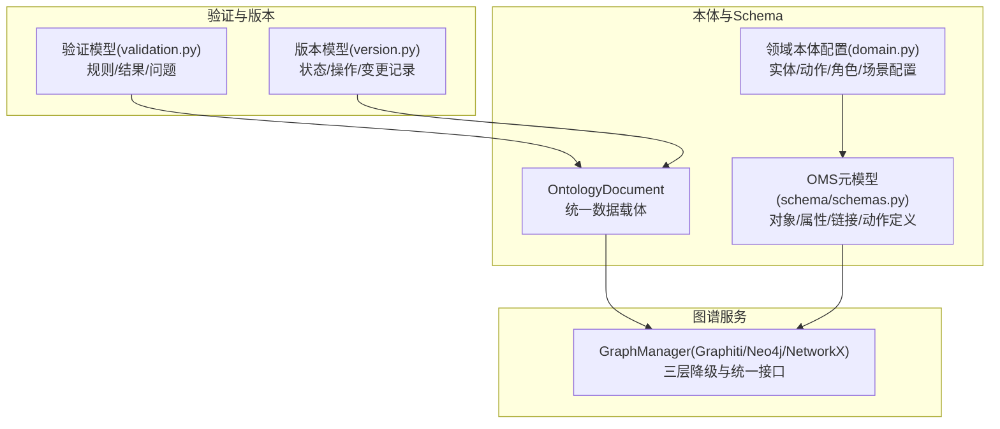
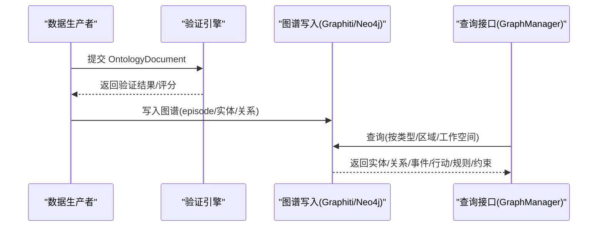
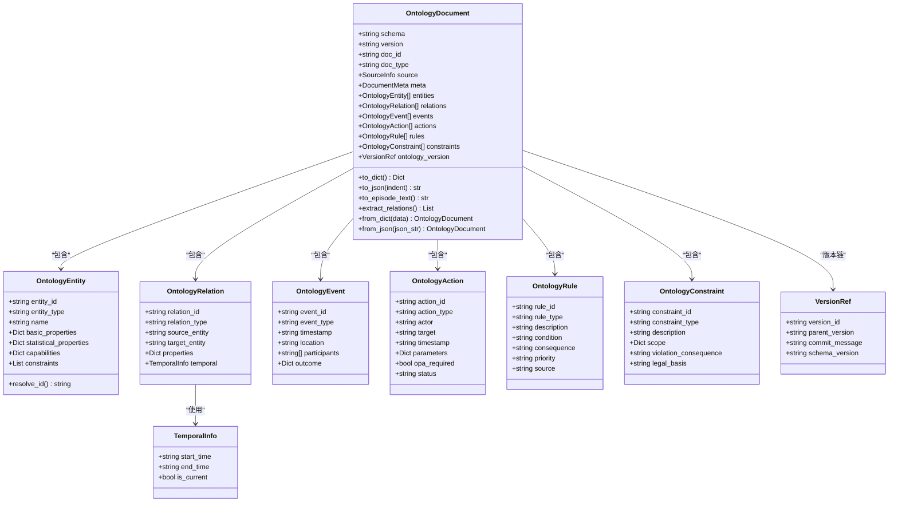
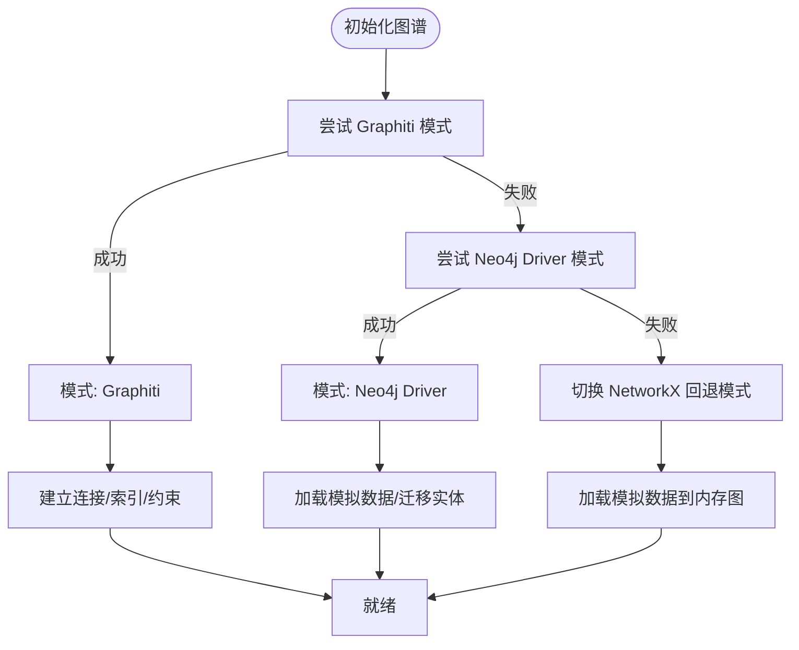
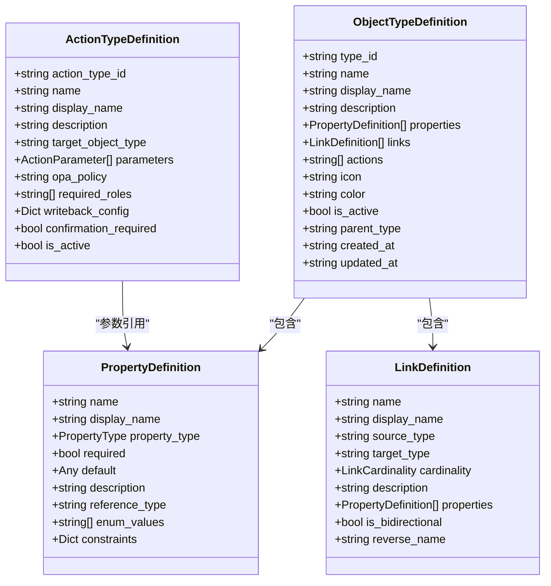
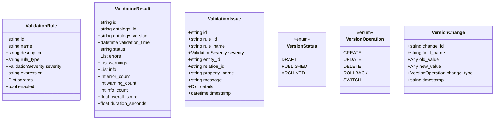
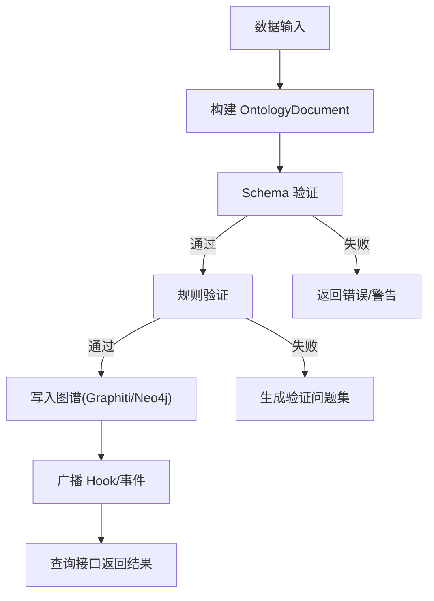
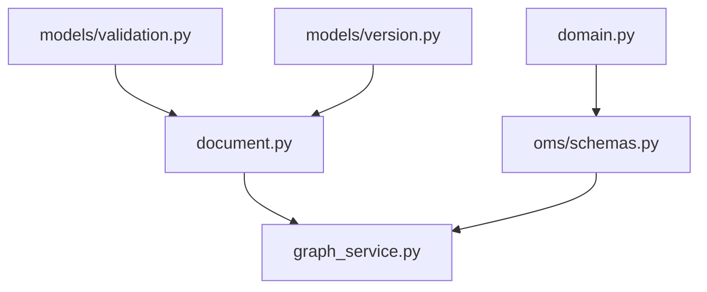

# 数据模型

<cite>
**本文引用的文件**
- [graph_service.py](file://odap/infra/graph/graph_service.py)
- [document.py](file://odap/biz/core/ontology/schema/document.py)
- [domain.py](file://odap/biz/core/ontology/schema/domain.py)
- [schemas.py](file://odap/biz/core/ontology/oms/schemas.py)
- [validation.py](file://odap/biz/core/ontology/models/validation.py)
- [version.py](file://odap/biz/core/ontology/models/version.py)
- [ontology.py](file://odap/biz/core/ontology/models/ontology.py)
- [__init__.py](file://odap/biz/core/ontology/models/__init__.py)
- [__init__.py](file://odap/biz/core/ontology/schema/__init__.py)
</cite>

## 目录
1. [简介](#简介)
2. [项目结构](#项目结构)
3. [核心组件](#核心组件)
4. [架构总览](#架构总览)
5. [详细组件分析](#详细组件分析)
6. [依赖分析](#依赖分析)
7. [性能考虑](#性能考虑)
8. [故障排查指南](#故障排查指南)
9. [结论](#结论)
10. [附录](#附录)

## 简介
本文件面向ODAP平台的数据工程师与架构师，系统化梳理基于Graphiti的双时态知识图谱数据模型设计，覆盖OMS元模型框架下的实体关系建模（Object/Property/Action/Rule四层）、数据摄入与验证、版本管理策略、图数据库节点/关系/属性设计规范、导入导出格式与Schema约束、数据访问模式与查询优化、缓存与降级策略、数据生命周期与迁移方案等。文档以“渐进复杂度”方式呈现，既提供高层概览，也给出代码级映射与可视化。

## 项目结构
围绕“本体文档模型—图谱服务—元模型定义”的主线，ODAP在以下模块形成闭环：
- 本体文档与Schema：统一的标准化数据载体，承载实体、关系、事件、行动、规则、约束及版本链。
- 图谱服务：封装Graphiti双时态知识图谱、Neo4j直连与NetworkX回退三种模式，提供统一查询与更新接口。
- 元模型（OMS）：定义对象类型、属性、链接、动作等结构化元数据，支撑运行时类型管理与权限/策略绑定。
- 验证与版本：提供验证规则、结果与评分，以及版本变更记录与回滚能力。

**图示来源**
- [graph_service.py:71-142](file://odap/infra/graph/graph_service.py#L71-L142)
- [document.py:212-279](file://odap/biz/core/ontology/schema/document.py#L212-L279)
- [domain.py:13-179](file://odap/biz/core/ontology/schema/domain.py#L13-L179)
- [schemas.py:72-136](file://odap/biz/core/ontology/oms/schemas.py#L72-L136)
- [validation.py:10-58](file://odap/biz/core/ontology/models/validation.py#L10-L58)
- [version.py:21-42](file://odap/biz/core/ontology/models/version.py#L21-L42)

**章节来源**
- [graph_service.py:1-142](file://odap/infra/graph/graph_service.py#L1-L142)
- [document.py:1-120](file://odap/biz/core/ontology/schema/document.py#L1-L120)
- [domain.py:1-120](file://odap/biz/core/ontology/schema/domain.py#L1-L120)
- [schemas.py:1-80](file://odap/biz/core/ontology/oms/schemas.py#L1-L80)

## 核心组件
- 统一本体文档：标准化的JSON数据单元，包含实体、关系、事件、行动、规则、约束与版本链，支持序列化/反序列化与Graphiti Episode文本生成。
- 图谱服务：三层降级（Graphiti→Neo4j Driver→NetworkX），提供查询、更新、连接池、断路器、性能监控与回退模式。
- 元模型（OMS）：对象类型、属性、链接、动作的结构化定义，支持运行时校验与策略绑定。
- 验证与版本：规则表达式、严重级别、验证结果与评分；版本状态、操作类型与变更记录。
- 领域本体：实体类型、动作类型、角色、场景配置等，作为运行时类型管理的种子数据源。

**章节来源**
- [document.py:212-405](file://odap/biz/core/ontology/schema/document.py#L212-L405)
- [graph_service.py:71-142](file://odap/infra/graph/graph_service.py#L71-L142)
- [schemas.py:72-136](file://odap/biz/core/ontology/oms/schemas.py#L72-L136)
- [validation.py:10-58](file://odap/biz/core/ontology/models/validation.py#L10-L58)
- [version.py:21-42](file://odap/biz/core/ontology/models/version.py#L21-L42)
- [domain.py:13-179](file://odap/biz/core/ontology/schema/domain.py#L13-L179)

## 架构总览
ODAP采用“本体文档驱动+图谱服务承载+元模型治理”的架构。数据从采集/生成后，经Schema验证与规则校验，转化为标准化的OntologyDocument，随后写入Graphiti/Neo4j或回退图谱，并通过统一查询接口对外提供服务。OMS元模型贯穿类型定义、权限策略与动作参数校验。

**图示来源**
- [document.py:280-319](file://odap/biz/core/ontology/schema/document.py#L280-L319)
- [graph_service.py:649-757](file://odap/infra/graph/graph_service.py#L649-L757)
- [validation.py:29-44](file://odap/biz/core/ontology/models/validation.py#L29-L44)

## 详细组件分析

### 统一本体文档模型（OntologyDocument）
- 设计要点
  - 四层属性：basic_properties/statistical_properties/capabilities/constraints，满足不同粒度的实体描述。
  - 关系时序：TemporalInfo包含起止时间与当前标记，支持双时态检索。
  - 事件序列：按timestamp排序，携带outcome，便于时序推理。
  - Palantir AIP四层本体：Object/Property/Action/Rule，统一建模。
  - 版本链：v{YYYYMMDD}-{seq:03d} + parent_version指针，保证可追溯性。
- 数据结构与序列化
  - 支持to_dict()/to_json()，并提供from_dict()/from_json()反序列化。
  - Episode文本生成：将文档转为Graphiti Episode的人类可读摘要。
  - 关系抽取：extract_relations()输出可用于构建实体边的结构。
- Schema验证器
  - 必填字段校验、实体ID唯一性、关系端点一致性、事件时间戳等。
  - 返回SchemaValidationResult，包含错误/警告列表。

**图示来源**
- [document.py:104-279](file://odap/biz/core/ontology/schema/document.py#L104-L279)

**章节来源**
- [document.py:1-120](file://odap/biz/core/ontology/schema/document.py#L1-L120)
- [document.py:212-405](file://odap/biz/core/ontology/schema/document.py#L212-L405)

### 图谱服务与三层降级
- 三层模式
  - Graphiti：双时态知识图谱，核心功能，支持Episode检索与索引约束。
  - Neo4j Driver：Cypher直连，适用于无graphiti-core环境或快速落地。
  - NetworkX回退：纯内存图谱，零外部依赖，适合开发/测试/离线场景。
- 连接池与断路器
  - 连接池：最大容量、超时、空闲清理，避免资源泄露。
  - 断路器：失败阈值、恢复时间窗，防止级联故障。
- 查询与更新
  - 统一查询接口：支持按类型、区域、工作空间过滤。
  - 更新接口：根据当前模式选择Cypher或回退实现。
- 性能监控
  - 查询耗时队列、缓存命中/未命中统计、连接池状态、断路器状态。

**图示来源**
- [graph_service.py:145-185](file://odap/infra/graph/graph_service.py#L145-L185)
- [graph_service.py:540-603](file://odap/infra/graph/graph_service.py#L540-L603)

**章节来源**
- [graph_service.py:71-142](file://odap/infra/graph/graph_service.py#L71-L142)
- [graph_service.py:299-443](file://odap/infra/graph/graph_service.py#L299-L443)

### 元模型（OMS）：对象/属性/链接/动作
- 对象类型定义：包含属性清单、链接清单、动作集合、图标/颜色、父子类型等。
- 属性定义：类型（字符串/整数/浮点/布尔/日期/地理点/JSON/引用）、是否必填、默认值、枚举值、约束等。
- 链接定义：源/目标类型、基数（1:1/1:N/N:1/N:N）、是否双向、反向名称、属性等。
- 动作类型定义：目标对象类型、参数列表、OPA策略、所需角色、确认要求、激活状态等。
- 与领域本体的关系：领域本体配置作为运行时类型管理的种子数据源，建议通过OMS进行统一治理。

**图示来源**
- [schemas.py:72-136](file://odap/biz/core/ontology/oms/schemas.py#L72-L136)

**章节来源**
- [schemas.py:1-136](file://odap/biz/core/ontology/oms/schemas.py#L1-L136)
- [domain.py:13-179](file://odap/biz/core/ontology/schema/domain.py#L13-L179)

### 验证与版本管理
- 验证模型
  - ValidationRule：规则ID、名称、描述、规则类型（实体/关系/属性）、严重级别、表达式、参数、启用状态。
  - ValidationResult：验证ID、本体ID/版本、时间、状态、错误/警告/信息计数、总体分数、耗时。
  - ValidationIssue：问题ID、规则ID/名称、严重级别、实体/关系/属性标识、消息、详情、时间戳。
- 版本模型
  - VersionStatus：草稿/发布/归档。
  - VersionOperation：创建/更新/删除/回滚/切换。
  - VersionChange：字段名、旧值/新值、变更类型、时间戳。

**图示来源**
- [validation.py:10-58](file://odap/biz/core/ontology/models/validation.py#L10-L58)
- [version.py:21-42](file://odap/biz/core/ontology/models/version.py#L21-L42)

**章节来源**
- [validation.py:1-58](file://odap/biz/core/ontology/models/validation.py#L1-L58)
- [version.py:1-42](file://odap/biz/core/ontology/models/version.py#L1-L42)

### 数据摄入流程与验证规则
- 摄入流程
  - 生成/采集数据→构建OntologyDocument→Schema验证→规则验证→写入图谱→广播Hook。
- 验证规则
  - 规则表达式与参数驱动，支持实体/关系/属性三类规则，严重级别区分错误/警告/信息。
  - 验证结果包含总体评分与各维度计数，便于质量评估与自动化治理。
- 版本管理策略
  - 每次写入生成新的版本号，保留父版本指针，支持回滚与切换。
  - 变更记录记录字段变化与操作类型，便于审计与追踪。

**图示来源**
- [document.py:418-486](file://odap/biz/core/ontology/schema/document.py#L418-L486)
- [validation.py:29-44](file://odap/biz/core/ontology/models/validation.py#L29-L44)
- [graph_service.py:649-757](file://odap/infra/graph/graph_service.py#L649-L757)

**章节来源**
- [document.py:418-486](file://odap/biz/core/ontology/schema/document.py#L418-L486)
- [validation.py:17-44](file://odap/biz/core/ontology/models/validation.py#L17-L44)
- [version.py:35-42](file://odap/biz/core/ontology/models/version.py#L35-L42)

### 图数据库节点、关系、属性设计规范
- 节点标签与属性
  - 节点标签：统一使用“Entity”基标签，附加实体类型标签（如“Entity_Unit”）。
  - 属性：实体ID唯一、工作空间ID用于多租户隔离、基础属性与统计属性分离。
- 关系
  - 关系类型：语义明确（如“engaged_with”、“located_at”），支持属性存储与时序信息。
  - 方向：根据业务语义决定是否双向，必要时提供反向名称。
- Episode与时序
  - Graphiti Episode内容来自OntologyDocument的摘要文本，支持按参考时间检索。
  - 关系包含TemporalInfo，支持“is_current”与起止时间，实现双时态查询。

**章节来源**
- [graph_service.py:680-757](file://odap/infra/graph/graph_service.py#L680-L757)
- [document.py:280-331](file://odap/biz/core/ontology/schema/document.py#L280-L331)

### 数据导入导出格式、Schema定义与约束
- 导入格式
  - JSON：标准的OntologyDocument结构，包含元数据、实体、关系、事件、行动、规则、约束与版本链。
  - 生成：提供工厂函数快速构造示例文档，便于测试与演示。
- 导出格式
  - JSON：to_json()输出，兼容人类阅读与系统解析。
  - Episode：to_episode_text()输出Graphiti Episode文本。
- Schema定义与约束
  - 必填字段：doc_id、doc_type、meta.title/description、entities[].entity_id等。
  - 唯一性：实体ID唯一；关系端点需指向存在的实体。
  - 时间与时序：事件timestamp必填；关系TemporalInfo可选但建议完整。

**章节来源**
- [document.py:277-319](file://odap/biz/core/ontology/schema/document.py#L277-L319)
- [document.py:418-486](file://odap/biz/core/ontology/schema/document.py#L418-L486)

### 数据访问模式、查询优化与缓存
- 访问模式
  - 统一查询接口：按实体类型、区域、工作空间过滤，返回实体ID、类型与属性。
  - 三层降级：Graphiti模式支持Episode检索；Neo4j模式使用Cypher；回退模式使用内存图。
- 查询优化
  - 连接池：限制并发、设置超时与空闲回收，降低连接抖动。
  - 断路器：失败阈值与恢复时间窗，避免雪崩。
  - 批量加载：Neo4j批量MERGE提升导入性能。
- 缓存机制
  - 查询耗时队列与缓存命中/未命中统计，便于性能评估与调优。

**章节来源**
- [graph_service.py:299-443](file://odap/infra/graph/graph_service.py#L299-L443)
- [graph_service.py:216-289](file://odap/infra/graph/graph_service.py#L216-L289)

### 数据生命周期管理、备份恢复与迁移
- 生命周期
  - 草稿→验证→发布→归档；版本链保留父版本指针，支持回滚与切换。
- 备份与恢复
  - Graphiti/Neo4j：利用数据库备份工具进行周期性快照与增量备份。
  - 回退模式：NetworkX内存图适合临时数据保存，不适合长期持久化。
- 迁移
  - Neo4j迁移：加载模拟数据并创建唯一性约束，批量导入提升效率。
  - 类型迁移：通过OMS定义与领域本体配置，统一对象/动作/链接定义，减少歧义。

**章节来源**
- [graph_service.py:216-289](file://odap/infra/graph/graph_service.py#L216-L289)
- [version.py:21-42](file://odap/biz/core/ontology/models/version.py#L21-L42)
- [domain.py:13-179](file://odap/biz/core/ontology/schema/domain.py#L13-L179)

## 依赖分析
- 模块内聚与耦合
  - OntologyDocument与GraphManager解耦：前者负责数据结构，后者负责图谱承载。
  - OMS元模型与领域本体：前者提供运行时治理，后者提供种子数据与场景配置。
  - 验证与版本：独立模块，被写入流程调用，保障质量与可追溯性。
- 外部依赖
  - Graphiti/Neo4j：核心图谱能力；NetworkX：回退模式。
  - LLM/Embedder：用于Graphiti的智能嵌入与提示词处理（可选）。

**图示来源**
- [__init__.py:3-24](file://odap/biz/core/ontology/models/__init__.py#L3-L24)
- [__init__.py:1-2](file://odap/biz/core/ontology/schema/__init__.py#L1-L2)

**章节来源**
- [__init__.py:1-25](file://odap/biz/core/ontology/models/__init__.py#L1-L25)
- [__init__.py:1-2](file://odap/biz/core/ontology/schema/__init__.py#L1-L2)

## 性能考虑
- 连接池与断路器：避免频繁创建/销毁连接，降低异常扩散风险。
- 批量写入：Neo4j批量MERGE减少网络往返与事务开销。
- 查询缓存：统计查询耗时与命中率，指导索引与查询优化。
- 回退模式：适合小规模数据与开发测试，生产环境建议使用Graphiti/Neo4j。

## 故障排查指南
- 连接失败
  - 检查Neo4j可达性与认证信息；查看断路器状态与失败计数。
- 写入异常
  - 核对Schema验证结果与实体ID唯一性；检查关系端点是否存在。
- 查询异常
  - 切换回退模式验证逻辑；检查过滤条件与工作空间ID。
- 性能问题
  - 查看连接池大小与空闲回收；分析查询耗时分布。

**章节来源**
- [graph_service.py:370-443](file://odap/infra/graph/graph_service.py#L370-L443)
- [document.py:418-486](file://odap/biz/core/ontology/schema/document.py#L418-L486)

## 结论
ODAP平台以统一的本体文档为核心，结合Graphiti双时态知识图谱与OMS元模型，实现了从数据摄入、验证、版本管理到图谱承载与查询的全链路闭环。通过三层降级与性能监控，兼顾了生产可用性与开发灵活性。建议在生产环境中优先使用Graphiti/Neo4j模式，并配合严格的Schema与规则验证、完善的版本管理与迁移策略，确保数据质量与可追溯性。

## 附录
- 快速参考
  - 统一数据载体：OntologyDocument（实体/关系/事件/行动/规则/约束/版本链）
  - 图谱承载：GraphManager（Graphiti/Neo4j/NetworkX）
  - 元模型：ObjectTypeDefinition/PropertyDefinition/LinkDefinition/ActionTypeDefinition
  - 验证：ValidationRule/ValidationResult/ValidationIssue
  - 版本：VersionStatus/VersionOperation/VersionChange