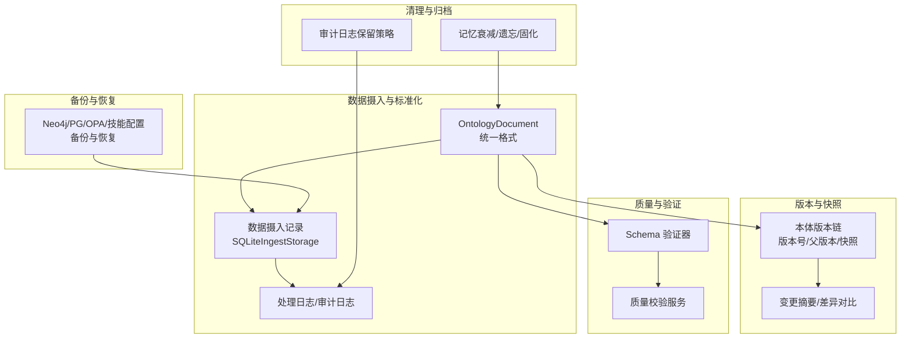
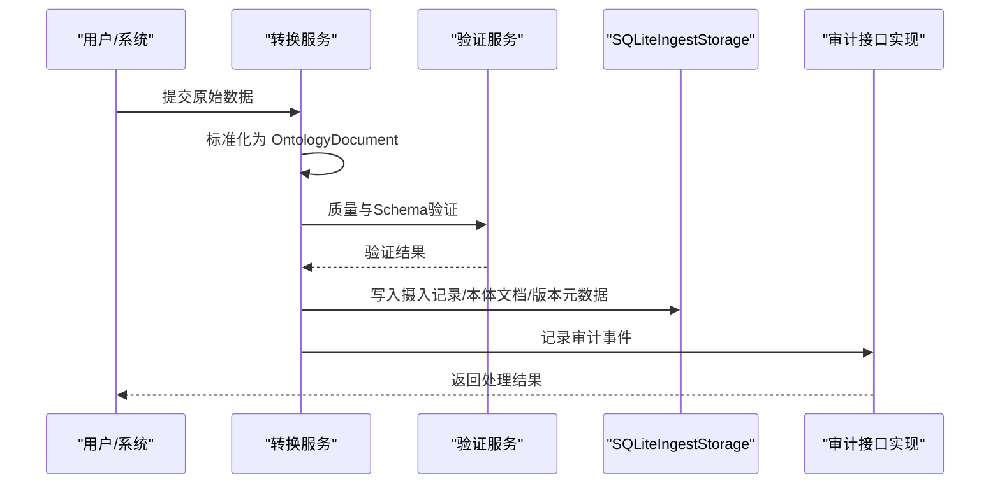
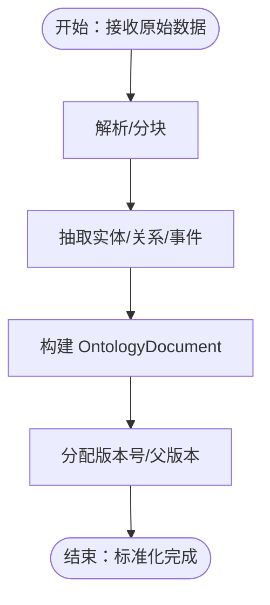
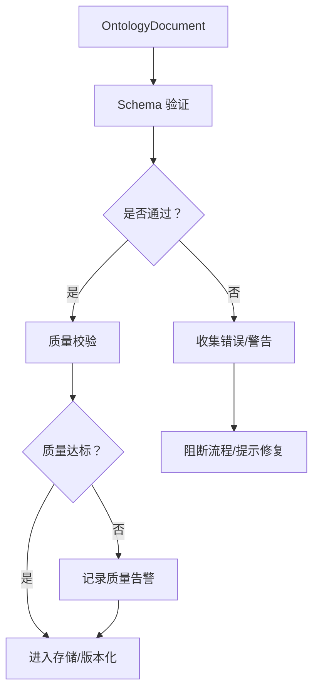
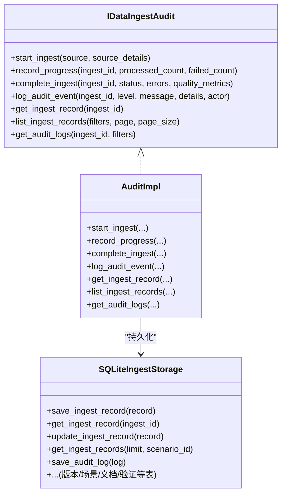
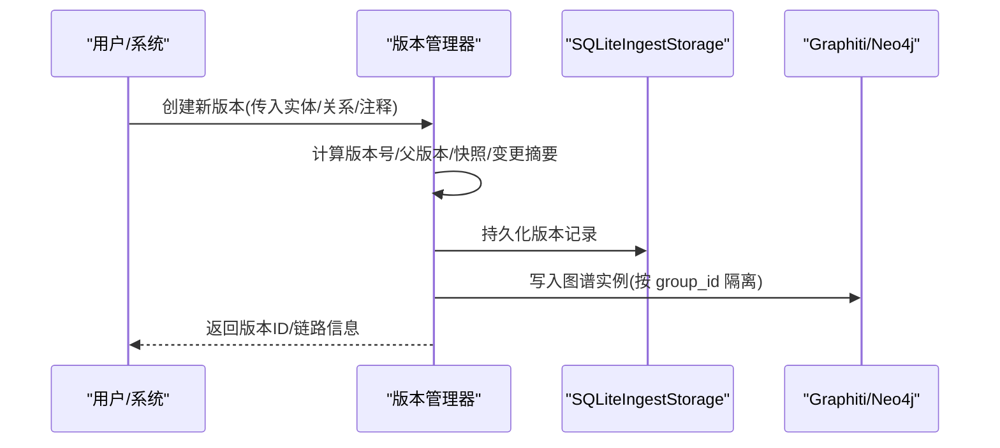
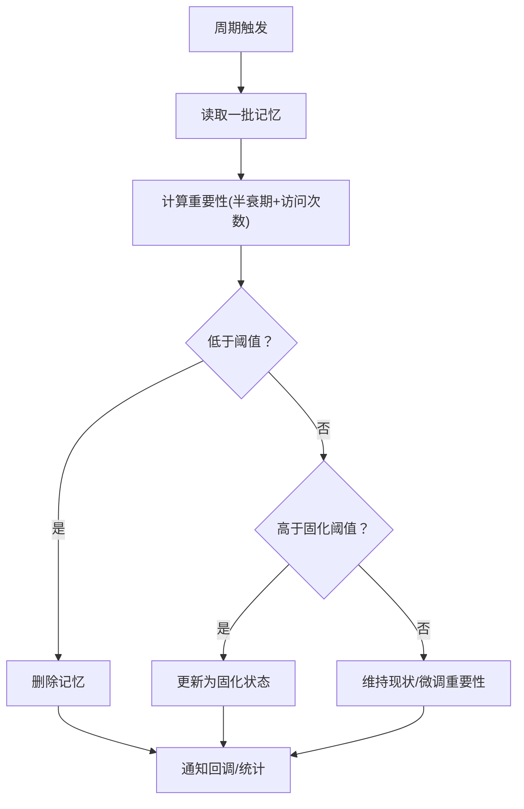
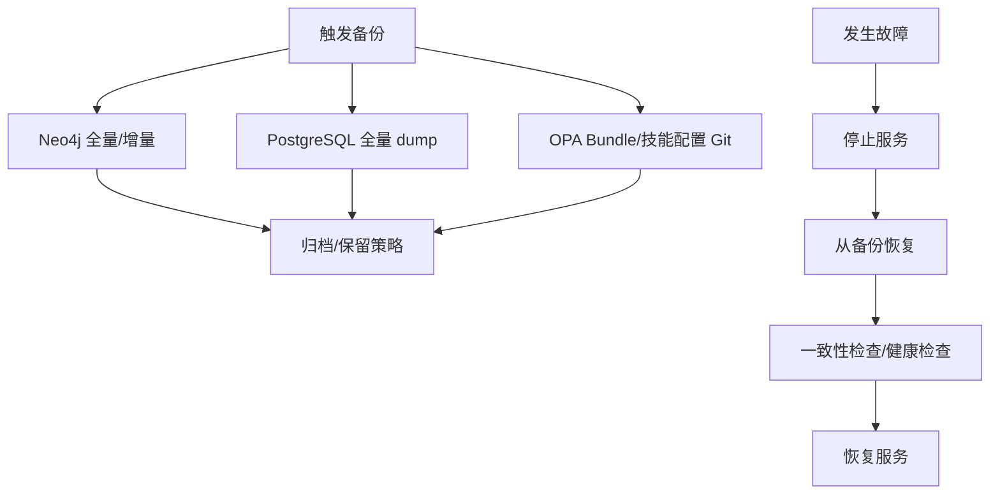
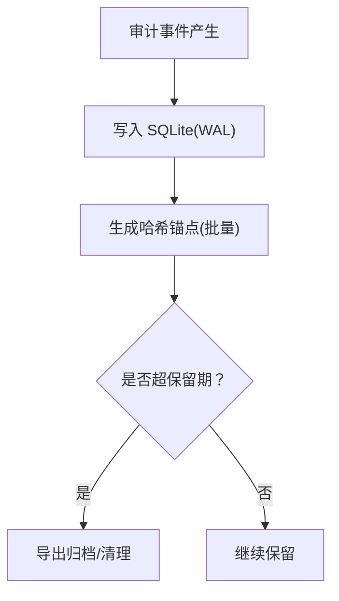
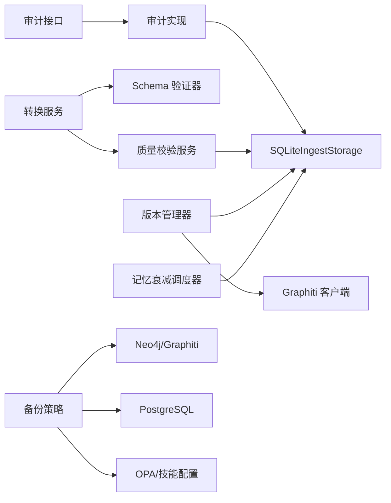

# 数据生命周期

<cite>
**本文引用的文件**
- [ARCHITECTURE_FULL_CHAIN_DEEP.md](file://docs/02-architecture/ARCHITECTURE_FULL_CHAIN_DEEP.md)
- [ARCHITECTURE_BIZ.md](file://docs/02-architecture/ARCHITECTURE_BIZ.md)
- [ARCHITECTURE_OPS.md](file://docs/02-architecture/ARCHITECTURE_OPS.md)
- [ADR-042_audit_log_storage_query.md](file://docs/07-adr/ADR-042_audit_log_storage_query.md)
- [ARCHITECTURE_EVOLVE.md](file://docs/02-architecture/ARCHITECTURE_EVOLVE.md)
- [ADR-032_standard_ontology_document_format.md](file://docs/07-adr/ADR-032_standard_ontology_document_format.md)
- [audit_logger.py](file://odap/infra/security/audit_logger.py)
- [sqlite_ingest_storage.py](file://odap/biz/core/ontology/storage/sqlite_ingest_storage.py)
- [audit.py](file://odap/biz/core/ontology/interfaces/audit.py)
- [audit.py](file://odap/biz/core/ontology/impl/audit.py)
- [document.py](file://odap/biz/core/ontology/schema/document.py)
- [transform_service.py](file://odap/biz/core/ontology/services/transform_service.py)
- [data_pipeline.py](file://odap/infra/data_pipeline.py)
- [decay_scheduler.py](file://odap/biz/platform/ontology_memory/services/decay_scheduler.py)
- [DESIGN.md](file://docs/03-modules/audit_log/DESIGN.md)
- [DESIGN.md](file://docs/03-modules/swarm_orchestrator/DESIGN.md)
- [fault_tolerance.py](file://odap/infra/resilience/fault_tolerance.py)
- [test_ontology_engine.py](file://tests/unit/test_ontology_engine.py)
- [test_ontology_memory.py](file://tests/unit/test_ontology_memory.py)
- [test_service_catalog.py](file://tests/unit/test_service_catalog.py)
- [test_semantic_map.py](file://tests/unit/test_semantic_map.py)
- [test_roles.py](file://tests/unit/test_roles.py)
</cite>

## 目录
1. [简介](#简介)
2. [项目结构](#项目结构)
3. [核心组件](#核心组件)
4. [架构总览](#架构总览)
5. [详细组件分析](#详细组件分析)
6. [依赖分析](#依赖分析)
7. [性能考量](#性能考量)
8. [故障排查指南](#故障排查指南)
9. [结论](#结论)
10. [附录](#附录)

## 简介
本文件面向ODAP平台，系统化梳理“数据生命周期”管理策略与实现，覆盖从数据创建、验证、存储、使用、归档、删除的全流程；阐述版本控制、历史记录、快照管理机制；明确清理策略、过期处理与存储回收；给出备份与恢复、灾难恢复方案；并结合合规与审计要求，为数据治理与合规团队提供可操作的实施参考。

## 项目结构
ODAP平台围绕“本体驱动”的数据处理链路组织，核心模块包括：
- 数据摄入与标准化：统一 OntologyDocument 格式，标准化来源、元数据、实体/关系/事件/行动/规则/约束等。
- 审计与记录：摄入记录、处理日志、审计事件、版本元数据等结构化存储。
- 版本与快照：本体版本链、变更摘要、差异对比、回滚能力。
- 质量与验证：Schema 验证、质量评分、规则校验。
- 清理与归档：内存/会话/实体的衰减与遗忘、审计日志保留策略。
- 备份与恢复：Neo4j/PostgreSQL/OPA/技能配置等对象的备份与恢复策略。

**章节来源**
- [ARCHITECTURE_FULL_CHAIN_DEEP.md: 1.2 核心数据模型:94-189](file://docs/02-architecture/ARCHITECTURE_FULL_CHAIN_DEEP.md#L94-L189)
- [ARCHITECTURE_BIZ.md: 13.6.1 数据摄入审计流程:1093-1103](file://docs/02-architecture/ARCHITECTURE_BIZ.md#L1093-L1103)
- [ARCHITECTURE_OPS.md: 3.2 Neo4j 备份:243-276](file://docs/02-architecture/ARCHITECTURE_OPS.md#L243-L276)

## 核心组件
- 统一数据模型：OntologyDocument，承载实体、关系、事件、行动、规则、约束，并内置版本引用与构建历史。
- 审计与记录：IDataIngestAudit 接口与实现，负责摄入任务的开始、进度、完成、审计事件记录与查询。
- 存储层：SQLiteIngestStorage，集中存储摄入记录、审计日志、本体文档、版本元数据、场景与文档、验证结果等。
- 版本管理：基于 OntologyVersion 的版本链、快照、变更摘要与差异对比。
- 质量与验证：Schema 验证器与质量校验服务，保障数据一致性与完整性。
- 清理与归档：记忆衰减调度器、审计日志保留策略。
- 备份与恢复：Neo4j/PostgreSQL/OPA/技能配置的备份与恢复策略。

**章节来源**
- [document.py: 212-279:212-279](file://odap/biz/core/ontology/schema/document.py#L212-L279)
- [audit.py: 8-91:8-91](file://odap/biz/core/ontology/interfaces/audit.py#L8-L91)
- [audit.py: 33-65:33-65](file://odap/biz/core/ontology/impl/audit.py#L33-L65)
- [sqlite_ingest_storage.py: 17-35:17-35](file://odap/biz/core/ontology/storage/sqlite_ingest_storage.py#L17-L35)
- [ARCHITECTURE_FULL_CHAIN_DEEP.md: 94-189:94-189](file://docs/02-architecture/ARCHITECTURE_FULL_CHAIN_DEEP.md#L94-L189)
- [ARCHITECTURE_BIZ.md: 1093-1103:1093-1103](file://docs/02-architecture/ARCHITECTURE_BIZ.md#L1093-L1103)

## 架构总览
ODAP平台的数据生命周期以“摄入—标准化—构建—存储—验证—版本—审计—使用—归档/删除”为主线，贯穿以下关键环节：
- 数据创建：统一 OntologyDocument 格式，确保来源、元数据、实体/关系/事件/行动/规则/约束完整。
- 数据验证：Schema 验证与质量校验，确保数据一致性与完整性。
- 数据存储：摄入记录、审计日志、本体文档、版本元数据、场景文档等集中于 SQLite；图谱实例通过 Graphiti 写入 Neo4j。
- 数据使用：通过查询服务、可视化与审计看板进行检索与分析。
- 数据归档与删除：记忆衰减与遗忘、审计日志保留策略、场景与文档的删除与级联清理。

**图表来源**
- [ARCHITECTURE_BIZ.md: 1116-1170:1116-1170](file://docs/02-architecture/ARCHITECTURE_BIZ.md#L1116-L1170)
- [transform_service.py: 441-475:441-475](file://odap/biz/core/ontology/services/transform_service.py#L441-L475)
- [sqlite_ingest_storage.py: 580-654:580-654](file://odap/biz/core/ontology/storage/sqlite_ingest_storage.py#L580-L654)
- [audit.py: 33-65:33-65](file://odap/biz/core/ontology/impl/audit.py#L33-L65)

**章节来源**
- [ARCHITECTURE_BIZ.md: 1116-1170:1116-1170](file://docs/02-architecture/ARCHITECTURE_BIZ.md#L1116-L1170)
- [transform_service.py: 441-475:441-475](file://odap/biz/core/ontology/services/transform_service.py#L441-L475)
- [sqlite_ingest_storage.py: 580-654:580-654](file://odap/biz/core/ontology/storage/sqlite_ingest_storage.py#L580-L654)
- [audit.py: 33-65:33-65](file://odap/biz/core/ontology/impl/audit.py#L33-L65)

## 详细组件分析

### 数据创建与标准化
- 统一格式：OntologyDocument 定义了标准字段与枚举类型，确保跨来源数据的一致性。
- 标准化流程：IngestionService 将原始数据解析、分块、抽取实体/关系/事件，并生成 OntologyDocument。
- 版本化：每次写入赋予版本号与父版本指针，形成版本链。

**图表来源**
- [ARCHITECTURE_FULL_CHAIN_DEEP.md: 523-631:523-631](file://docs/02-architecture/ARCHITECTURE_FULL_CHAIN_DEEP.md#L523-L631)
- [document.py: 212-279:212-279](file://odap/biz/core/ontology/schema/document.py#L212-L279)
- [ADR-032_standard_ontology_document_format.md: 227-236:227-236](file://docs/07-adr/ADR-032_standard_ontology_document_format.md#L227-L236)

**章节来源**
- [ARCHITECTURE_FULL_CHAIN_DEEP.md: 523-631:523-631](file://docs/02-architecture/ARCHITECTURE_FULL_CHAIN_DEEP.md#L523-L631)
- [document.py: 212-279:212-279](file://odap/biz/core/ontology/schema/document.py#L212-L279)
- [ADR-032_standard_ontology_document_format.md: 227-236:227-236](file://docs/07-adr/ADR-032_standard_ontology_document_format.md#L227-L236)

### 数据验证与质量保证
- Schema 验证：检查必填字段、类型合法性、实体唯一性、关系引用完整性等。
- 质量校验：对文档元数据、实体/关系/事件字段进行质量评分与告警。
- 单元测试：覆盖转换统计、质量验证、场景文档删除等关键路径。

**图表来源**
- [document.py: 418-486:418-486](file://odap/biz/core/ontology/schema/document.py#L418-L486)
- [transform_service.py: 441-475:441-475](file://odap/biz/core/ontology/services/transform_service.py#L441-L475)
- [test_ontology_engine.py: 50-83:50-83](file://tests/unit/test_ontology_engine.py#L50-L83)

**章节来源**
- [document.py: 418-486:418-486](file://odap/biz/core/ontology/schema/document.py#L418-L486)
- [transform_service.py: 441-475:441-475](file://odap/biz/core/ontology/services/transform_service.py#L441-L475)
- [test_ontology_engine.py: 50-83:50-83](file://tests/unit/test_ontology_engine.py#L50-L83)

### 存储与审计
- SQLiteIngestStorage：集中存储摄入记录、审计日志、本体文档、版本元数据、场景与文档、验证结果等。
- 审计接口：IDataIngestAudit 定义摄入任务的生命周期与审计事件记录；实现类负责持久化与查询。
- 审计日志：统一审计通道，支持异步/同步写入、批量、查询与统计。

**图表来源**
- [audit.py: 8-91:8-91](file://odap/biz/core/ontology/interfaces/audit.py#L8-L91)
- [audit.py: 33-65:33-65](file://odap/biz/core/ontology/impl/audit.py#L33-L65)
- [sqlite_ingest_storage.py: 580-800:580-800](file://odap/biz/core/ontology/storage/sqlite_ingest_storage.py#L580-L800)

**章节来源**
- [audit.py: 8-91:8-91](file://odap/biz/core/ontology/interfaces/audit.py#L8-L91)
- [audit.py: 33-65:33-65](file://odap/biz/core/ontology/impl/audit.py#L33-L65)
- [sqlite_ingest_storage.py: 580-800:580-800](file://odap/biz/core/ontology/storage/sqlite_ingest_storage.py#L580-L800)

### 版本控制、历史记录与快照
- 版本链：每个 OntologyDocument 写入后生成版本号与父版本指针，形成版本链。
- 快照与差异：版本管理器保存完整快照与变更摘要，支持版本对比与回滚。
- 场景与文档：场景表与场景文档表关联摄入文档，支持按场景的时间线与实体/关系聚合。

**图表来源**
- [ARCHITECTURE_FULL_CHAIN_DEEP.md: 1942-2156:1942-2156](file://docs/02-architecture/ARCHITECTURE_FULL_CHAIN_DEEP.md#L1942-L2156)
- [sqlite_ingest_storage.py: 296-352:296-352](file://odap/biz/core/ontology/storage/sqlite_ingest_storage.py#L296-L352)

**章节来源**
- [ARCHITECTURE_FULL_CHAIN_DEEP.md: 1942-2156:1942-2156](file://docs/02-architecture/ARCHITECTURE_FULL_CHAIN_DEEP.md#L1942-L2156)
- [sqlite_ingest_storage.py: 296-352:296-352](file://odap/biz/core/ontology/storage/sqlite_ingest_storage.py#L296-L352)

### 清理策略、过期处理与存储回收
- 记忆衰减：基于重要性阈值与半衰期的衰减调度器，定期将低重要性记忆删除、中等重要性记忆固化。
- 审计日志保留：按严重级别设定保留期，超期自动归档或清理。
- 场景与文档删除：支持场景删除与级联清理场景文档，避免碎片化数据残留。

**图表来源**
- [decay_scheduler.py: 61-102:61-102](file://odap/biz/platform/ontology_memory/services/decay_scheduler.py#L61-L102)
- [ADR-042_audit_log_storage_query.md: 94-101:94-101](file://docs/07-adr/ADR-042_audit_log_storage_query.md#L94-L101)
- [sqlite_ingest_storage.py: 422-430:422-430](file://odap/biz/core/ontology/storage/sqlite_ingest_storage.py#L422-L430)

**章节来源**
- [decay_scheduler.py: 61-102:61-102](file://odap/biz/platform/ontology_memory/services/decay_scheduler.py#L61-L102)
- [ADR-042_audit_log_storage_query.md: 94-101:94-101](file://docs/07-adr/ADR-042_audit_log_storage_query.md#L94-L101)
- [sqlite_ingest_storage.py: 422-430:422-430](file://odap/biz/core/ontology/storage/sqlite_ingest_storage.py#L422-L430)

### 备份策略、恢复流程与灾难恢复
- 备份对象与频率：Neo4j 全量/增量、PostgreSQL 全量 dump、OPA Bundle 与技能配置 Git 版本控制。
- 恢复步骤：停止服务、从备份恢复、运行一致性检查、健康检查通过后恢复服务。
- 灾难演练：按季度/半年进行 Neo4j/PostgreSQL 全站灾难恢复演练。

**图表来源**
- [ARCHITECTURE_OPS.md: 231-304:231-304](file://docs/02-architecture/ARCHITECTURE_OPS.md#L231-L304)

**章节来源**
- [ARCHITECTURE_OPS.md: 231-304:231-304](file://docs/02-architecture/ARCHITECTURE_OPS.md#L231-L304)

### 数据保留政策、合规与审计追踪
- 审计日志保留：DEBUG 7 天、INFO 90 天、WARN 180 天、ERROR/CRITICAL 永久，支持 SQLite+WAL 与归档。
- 防篡改：审计事件链通过哈希锚点机制保障完整性。
- 合规策略：OPA 策略引擎提供数据隐私与合规审计策略，支持策略执行监控与统计。

**图表来源**
- [ADR-042_audit_log_storage_query.md: 43-101:43-101](file://docs/07-adr/ADR-042_audit_log_storage_query.md#L43-L101)
- [DESIGN.md: 352-402:352-402](file://docs/03-modules/audit_log/DESIGN.md#L352-L402)
- [audit_logger.py: 19-378:19-378](file://odap/infra/security/audit_logger.py#L19-L378)

**章节来源**
- [ADR-042_audit_log_storage_query.md: 43-101:43-101](file://docs/07-adr/ADR-042_audit_log_storage_query.md#L43-L101)
- [DESIGN.md: 352-402:352-402](file://docs/03-modules/audit_log/DESIGN.md#L352-L402)
- [audit_logger.py: 19-378:19-378](file://odap/infra/security/audit_logger.py#L19-L378)

### 状态持久化与恢复（扩展）
- SwarmOrchestrator 状态持久化：支持 Agent 状态与任务检查点的保存与恢复，提升系统韧性与可恢复性。

**章节来源**
- [DESIGN.md: 636-781:636-781](file://docs/03-modules/swarm_orchestrator/DESIGN.md#L636-L781)

## 依赖分析
- 组件耦合：审计接口与实现解耦存储层；版本管理器依赖 SQLite 存储与 Graphiti 客户端；质量校验服务依赖 Schema 验证器。
- 外部依赖：Neo4j/Graphiti 用于图谱写入；OPA 用于策略执行；SQLite 用于结构化元数据与审计日志。
- 潜在风险：SQLite 单写者模型与 WAL 模式配合；审计日志通道异步批量写入降低延迟；故障恢复依赖备份策略与演练。

**图表来源**
- [audit.py: 8-91:8-91](file://odap/biz/core/ontology/interfaces/audit.py#L8-L91)
- [audit.py: 33-65:33-65](file://odap/biz/core/ontology/impl/audit.py#L33-L65)
- [sqlite_ingest_storage.py: 17-35:17-35](file://odap/biz/core/ontology/storage/sqlite_ingest_storage.py#L17-L35)
- [transform_service.py: 441-475:441-475](file://odap/biz/core/ontology/services/transform_service.py#L441-L475)
- [decay_scheduler.py: 17-102:17-102](file://odap/biz/platform/ontology_memory/services/decay_scheduler.py#L17-L102)
- [ARCHITECTURE_OPS.md: 231-304:231-304](file://docs/02-architecture/ARCHITECTURE_OPS.md#L231-L304)

**章节来源**
- [audit.py: 8-91:8-91](file://odap/biz/core/ontology/interfaces/audit.py#L8-L91)
- [audit.py: 33-65:33-65](file://odap/biz/core/ontology/impl/audit.py#L33-L65)
- [sqlite_ingest_storage.py: 17-35:17-35](file://odap/biz/core/ontology/storage/sqlite_ingest_storage.py#L17-L35)
- [transform_service.py: 441-475:441-475](file://odap/biz/core/ontology/services/transform_service.py#L441-L475)
- [decay_scheduler.py: 17-102:17-102](file://odap/biz/platform/ontology_memory/services/decay_scheduler.py#L17-L102)
- [ARCHITECTURE_OPS.md: 231-304:231-304](file://docs/02-architecture/ARCHITECTURE_OPS.md#L231-L304)

## 性能考量
- 写入性能：SQLite WAL 模式与批量写入，满足高吞吐审计日志写入；Neo4j/Graphiti 写入通过批处理与组隔离减少锁竞争。
- 查询能力：SQLite 支持索引与时间范围过滤；审计日志通过通道异步写入避免阻塞主流程。
- 可扩展性：模块化单体部署约束下，存储后端可插拔；必要时可平滑迁移到 PostgreSQL。

[本节为通用指导，无需特定文件引用]

## 故障排查指南
- 审计日志写入失败：检查审计通道初始化与事件循环；使用同步写入兜底。
- 数据摄入失败：查看摄入记录与处理日志，定位失败阶段与错误信息。
- 版本回滚：通过版本管理器对比差异，选择合适版本进行回滚。
- 记忆衰减异常：检查衰减调度器配置与回调通知，确认统计与阈值设置。
- 备份恢复：遵循备份策略与恢复步骤，完成一致性检查与健康检查。

**章节来源**
- [audit_logger.py: 137-147:137-147](file://odap/infra/security/audit_logger.py#L137-L147)
- [sqlite_ingest_storage.py: 615-654:615-654](file://odap/biz/core/ontology/storage/sqlite_ingest_storage.py#L615-L654)
- [ARCHITECTURE_FULL_CHAIN_DEEP.md: 1942-2156:1942-2156](file://docs/02-architecture/ARCHITECTURE_FULL_CHAIN_DEEP.md#L1942-L2156)
- [decay_scheduler.py: 104-117:104-117](file://odap/biz/platform/ontology_memory/services/decay_scheduler.py#L104-L117)
- [ARCHITECTURE_OPS.md: 267-276:267-276](file://docs/02-architecture/ARCHITECTURE_OPS.md#L267-L276)

## 结论
ODAP平台通过统一的数据模型、严格的验证与质量控制、完善的版本与快照管理、可追溯的审计与合规策略，以及稳健的备份与恢复机制，实现了从创建到销毁的全生命周期数据管理。该体系既满足当前业务需求，又具备良好的演进与扩展能力，适合数据治理与合规团队落地实施与持续优化。

[本节为总结性内容，无需特定文件引用]

## 附录
- 文档生命周期：文档从编写、评审、发布到维护与归档的流程，体现版本管理与知识沉淀。

**章节来源**
- [ARCHITECTURE_EVOLVE.md: 132-150:132-150](file://docs/02-architecture/ARCHITECTURE_EVOLVE.md#L132-L150)