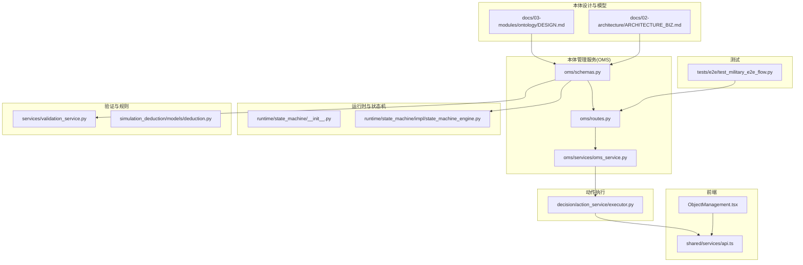
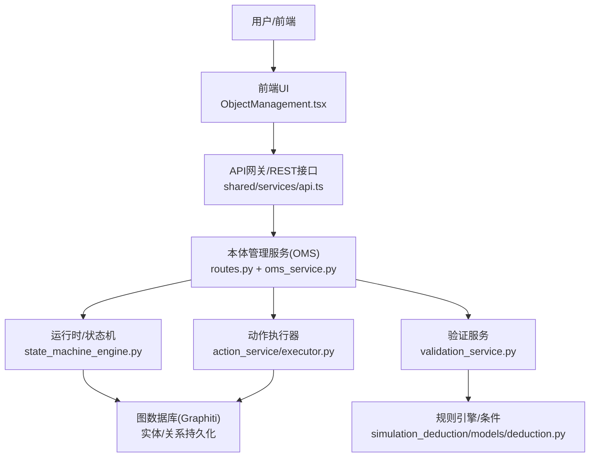
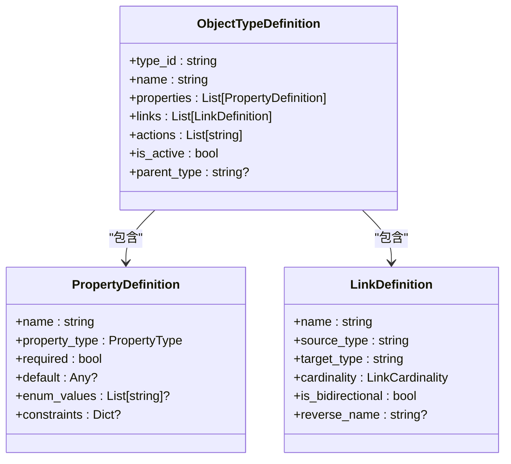
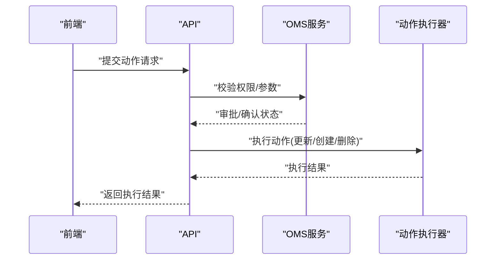
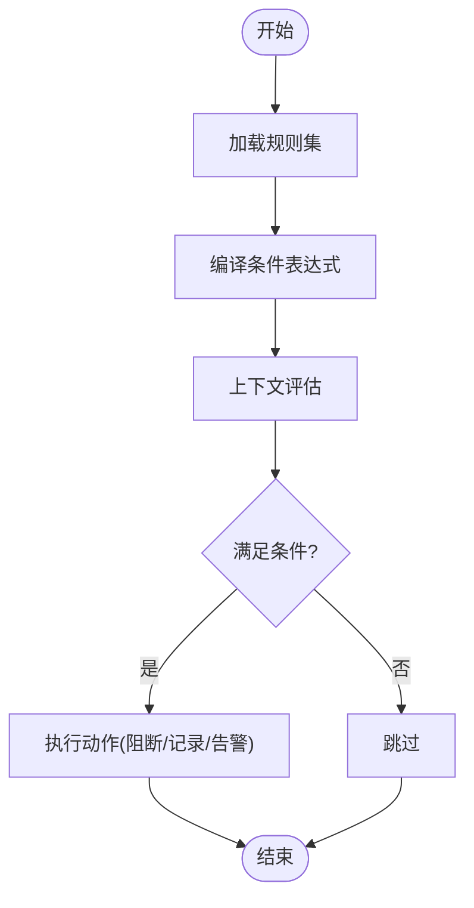
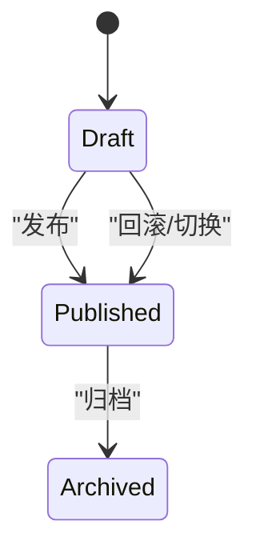
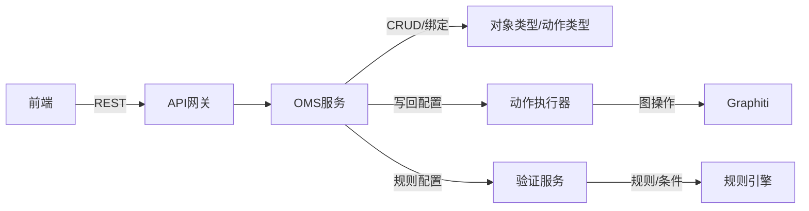

# 四层本体结构

<cite>
**本文引用的文件**
- [odap/biz/core/ontology/schema/domain.py](file://odap/biz/core/ontology/schema/domain.py)
- [odap/biz/core/ontology/oms/schemas.py](file://odap/biz/core/ontology/oms/schemas.py)
- [odap/biz/core/ontology/oms/routes.py](file://odap/biz/core/ontology/oms/routes.py)
- [odap/biz/core/ontology/oms/services/oms_service.py](file://odap/biz/core/ontology/oms/services/oms_service.py)
- [odap/biz/core/ontology/models/__init__.py](file://odap/biz/core/ontology/models/__init__.py)
- [odap/biz/core/ontology/models/ontology.py](file://odap/biz/core/ontology/models/ontology.py)
- [odap/biz/core/ontology/models/version.py](file://odap/biz/core/ontology/models/version.py)
- [odap/biz/core/ontology/services/__init__.py](file://odap/biz/core/ontology/services/__init__.py)
- [odap/biz/core/ontology/services/validation_service.py](file://odap/biz/core/ontology/services/validation_service.py)
- [odap/biz/core/ontology/runtime/state_machine/__init__.py](file://odap/biz/core/ontology/runtime/state_machine/__init__.py)
- [odap/biz/core/ontology/runtime/state_machine/impl/state_machine_engine.py](file://odap/biz/core/ontology/runtime/state_machine/impl/state_machine_engine.py)
- [odap/biz/decision/action_service/executor.py](file://odap/biz/decision/action_service/executor.py)
- [odap/biz/simulation/simulation_deduction/models/deduction.py](file://odap/biz/simulation/simulation_deduction/models/deduction.py)
- [docs/03-modules/ontology/DESIGN.md](file://docs/03-modules/ontology/DESIGN.md)
- [docs/02-architecture/ARCHITECTURE_BIZ.md](file://docs/02-architecture/ARCHITECTURE_BIZ.md)
- [frontend/src/modules/business/pages/ObjectManagement.tsx](file://frontend/src/modules/business/pages/ObjectManagement.tsx)
- [frontend/src/modules/shared/services/api.ts](file://frontend/src/modules/shared/services/api.ts)
- [tests/e2e/test_military_e2e_flow.py](file://tests/e2e/test_military_e2e_flow.py)
</cite>

## 目录
1. [引言](#引言)
2. [项目结构](#项目结构)
3. [核心组件](#核心组件)
4. [架构总览](#架构总览)
5. [详细组件分析](#详细组件分析)
6. [依赖分析](#依赖分析)
7. [性能考虑](#性能考虑)
8. [故障排查指南](#故障排查指南)
9. [结论](#结论)
10. [附录](#附录)

## 引言
本文件围绕“四层本体结构”进行系统化实现文档编制，聚焦以下四个层级及其相互关系：
- Object/Object Type：对象与对象类型，用于定义领域实体的类型与实例化
- Property/Property Type：属性与属性类型，用于描述对象的字段与取值范围
- Action/Action Type：动作与动作类型，用于定义可对对象执行的操作及其参数
- Rule/Rule Type：规则与规则类型，用于表达约束、校验与自动化决策

文档将从设计原理、实体定义、属性特征、关系建模、约束规则、继承与依赖关系、生命周期与状态转换、版本控制机制等方面展开，并结合前端与后端实现路径，给出可操作的示例与最佳实践。

## 项目结构
本体相关能力主要分布在以下模块：
- 本体模型与设计：docs/03-modules/ontology/DESIGN.md、docs/02-architecture/ARCHITECTURE_BIZ.md
- 本体管理服务（OMS）：odap/biz/core/ontology/oms/*
- 本体运行时与状态机：odap/biz/core/ontology/runtime/state_machine/*
- 验证与规则：odap/biz/core/ontology/services/validation_service.py、odap/biz/simulation/simulation_deduction/models/deduction.py
- 动作执行：odap/biz/decision/action_service/executor.py
- 前端交互：frontend/src/modules/business/pages/ObjectManagement.tsx、frontend/src/modules/shared/services/api.ts
- 测试用例：tests/e2e/test_military_e2e_flow.py

**图示来源**
- [docs/03-modules/ontology/DESIGN.md](file://docs/03-modules/ontology/DESIGN.md)
- [docs/02-architecture/ARCHITECTURE_BIZ.md](file://docs/02-architecture/ARCHITECTURE_BIZ.md)
- [odap/biz/core/ontology/oms/schemas.py](file://odap/biz/core/ontology/oms/schemas.py)
- [odap/biz/core/ontology/oms/routes.py](file://odap/biz/core/ontology/oms/routes.py)
- [odap/biz/core/ontology/oms/services/oms_service.py](file://odap/biz/core/ontology/oms/services/oms_service.py)
- [odap/biz/core/ontology/runtime/state_machine/impl/state_machine_engine.py](file://odap/biz/core/ontology/runtime/state_machine/impl/state_machine_engine.py)
- [odap/biz/core/ontology/services/validation_service.py](file://odap/biz/core/ontology/services/validation_service.py)
- [odap/biz/decision/action_service/executor.py](file://odap/biz/decision/action_service/executor.py)
- [frontend/src/modules/business/pages/ObjectManagement.tsx](file://frontend/src/modules/business/pages/ObjectManagement.tsx)
- [frontend/src/modules/shared/services/api.ts](file://frontend/src/modules/shared/services/api.ts)
- [tests/e2e/test_military_e2e_flow.py](file://tests/e2e/test_military_e2e_flow.py)

**章节来源**
- [docs/03-modules/ontology/DESIGN.md](file://docs/03-modules/ontology/DESIGN.md)
- [docs/02-architecture/ARCHITECTURE_BIZ.md](file://docs/02-architecture/ARCHITECTURE_BIZ.md)

## 核心组件
- 对象类型（Object Type）：由 OMS 定义，包含属性、链接、动作绑定等元数据；支持 CRUD 与绑定操作
- 属性类型（Property Type）：定义属性的类型、是否必填、默认值、枚举值、约束等
- 动作类型（Action Type）：定义可执行的动作、目标对象类型、参数、权限要求、确认需求等
- 规则类型（Rule/Rule Type）：定义验证规则、条件表达式、严重级别、执行动作等

上述组件共同构成四层本体的“类型层”，并通过运行时服务（状态机、验证、动作执行）实现“实例层”的生命周期与行为控制。

**章节来源**
- [odap/biz/core/ontology/oms/schemas.py](file://odap/biz/core/ontology/oms/schemas.py)
- [odap/biz/core/ontology/oms/routes.py](file://odap/biz/core/ontology/oms/routes.py)
- [odap/biz/core/ontology/oms/services/oms_service.py](file://odap/biz/core/ontology/oms/services/oms_service.py)
- [odap/biz/core/ontology/services/validation_service.py](file://odap/biz/core/ontology/services/validation_service.py)
- [odap/biz/decision/action_service/executor.py](file://odap/biz/decision/action_service/executor.py)

## 架构总览
四层本体结构在系统中的位置与交互如下：

**图示来源**
- [frontend/src/modules/business/pages/ObjectManagement.tsx](file://frontend/src/modules/business/pages/ObjectManagement.tsx)
- [frontend/src/modules/shared/services/api.ts](file://frontend/src/modules/shared/services/api.ts)
- [odap/biz/core/ontology/oms/routes.py](file://odap/biz/core/ontology/oms/routes.py)
- [odap/biz/core/ontology/oms/services/oms_service.py](file://odap/biz/core/ontology/oms/services/oms_service.py)
- [odap/biz/core/ontology/runtime/state_machine/impl/state_machine_engine.py](file://odap/biz/core/ontology/runtime/state_machine/impl/state_machine_engine.py)
- [odap/biz/core/ontology/services/validation_service.py](file://odap/biz/core/ontology/services/validation_service.py)
- [odap/biz/decision/action_service/executor.py](file://odap/biz/decision/action_service/executor.py)
- [odap/biz/simulation/simulation_deduction/models/deduction.py](file://odap/biz/simulation/simulation_deduction/models/deduction.py)

## 详细组件分析

### 对象与对象类型（Object/Object Type）
- 设计要点
  - 对象类型由 OMS 定义，包含属性列表、链接定义、动作绑定、图标/颜色、父子类型、激活状态等
  - 属性定义支持多种类型（字符串、整数、浮点、布尔、日期时间、地理点、JSON、引用等），并可设置默认值、枚举值、约束
  - 链接定义支持多种基数（1:1、1:N、N:1、N:N），可声明反向名称与双向关系
- 生命周期与状态
  - 类型可被创建、更新、停用/激活；支持与动作类型绑定/解绑
- 示例参考
  - 对象类型定义与字段结构：[oms/schemas.py](file://odap/biz/core/ontology/oms/schemas.py)
  - 对象类型CRUD与绑定路由：[oms/routes.py](file://odap/biz/core/ontology/oms/routes.py)
  - 服务封装与存储交互：[oms/services/oms_service.py](file://odap/biz/core/ontology/oms/services/oms_service.py)

**图示来源**
- [odap/biz/core/ontology/oms/schemas.py](file://odap/biz/core/ontology/oms/schemas.py)

**章节来源**
- [odap/biz/core/ontology/oms/schemas.py](file://odap/biz/core/ontology/oms/schemas.py)
- [odap/biz/core/ontology/oms/routes.py](file://odap/biz/core/ontology/oms/routes.py)
- [odap/biz/core/ontology/oms/services/oms_service.py](file://odap/biz/core/ontology/oms/services/oms_service.py)

### 属性与属性类型（Property/Property Type）
- 设计要点
  - 属性类型枚举覆盖常用数据类型与引用类型
  - 属性可声明必填、默认值、枚举集合、约束字典
- 应用场景
  - 在对象类型中声明属性，驱动前端渲染与后端校验
- 示例参考
  - 属性类型与属性定义：[oms/schemas.py](file://odap/biz/core/ontology/oms/schemas.py)

**章节来源**
- [odap/biz/core/ontology/oms/schemas.py](file://odap/biz/core/ontology/oms/schemas.py)

### 动作与动作类型（Action/Action Type）
- 设计要点
  - 动作类型定义目标对象类型、参数列表（名称、显示名、类型、是否必填、默认值、描述）、OPA策略、所需角色、写回配置、是否需要确认、是否激活
  - 支持与对象类型绑定，形成“对象类型 → 动作类型”的关联
- 生命周期与状态
  - 动作类型可被创建、更新、停用/激活；支持绑定/解绑
- 执行流程
  - 提交动作请求 → 审批/确认 → 执行器根据动作类型参数与目标对象执行相应操作（如更新属性、创建实体、删除实体等）
- 示例参考
  - 动作类型定义与参数：[oms/schemas.py](file://odap/biz/core/ontology/oms/schemas.py)
  - 动作类型CRUD与绑定路由：[oms/routes.py](file://odap/biz/core/ontology/oms/routes.py)
  - 动作执行器（更新/创建/删除）：[decision/action_service/executor.py](file://odap/biz/decision/action_service/executor.py)
  - 前端动作提交接口：[shared/services/api.ts](file://frontend/src/modules/shared/services/api.ts)
  - 端到端用例（创建动作类型）：[tests/e2e/test_military_e2e_flow.py](file://tests/e2e/test_military_e2e_flow.py)

**图示来源**
- [frontend/src/modules/shared/services/api.ts](file://frontend/src/modules/shared/services/api.ts)
- [odap/biz/core/ontology/oms/routes.py](file://odap/biz/core/ontology/oms/routes.py)
- [odap/biz/core/ontology/oms/services/oms_service.py](file://odap/biz/core/ontology/oms/services/oms_service.py)
- [odap/biz/decision/action_service/executor.py](file://odap/biz/decision/action_service/executor.py)

**章节来源**
- [odap/biz/core/ontology/oms/schemas.py](file://odap/biz/core/ontology/oms/schemas.py)
- [odap/biz/core/ontology/oms/routes.py](file://odap/biz/core/ontology/oms/routes.py)
- [odap/biz/decision/action_service/executor.py](file://odap/biz/decision/action_service/executor.py)
- [frontend/src/modules/shared/services/api.ts](file://frontend/src/modules/shared/services/api.ts)
- [tests/e2e/test_military_e2e_flow.py](file://tests/e2e/test_military_e2e_flow.py)

### 规则与规则类型（Rule/Rule Type）
- 设计要点
  - 规则类型支持实体/关系/属性等不同维度的校验
  - 规则包含名称、描述、严重级别、条件表达式、启用状态等
  - 条件类型包括规则条件、约束条件、自定义条件
- 验证流程
  - 规则注册 → 条件编译 → 上下文评估 → 执行动作（如阻断、记录、告警）
- 示例参考
  - 规则模型与条件类型：[simulation_deduction/models/deduction.py](file://odap/biz/simulation/simulation_deduction/models/deduction.py)
  - 验证服务封装与规则管理：[services/validation_service.py](file://odap/biz/core/ontology/services/validation_service.py)
  - 端到端用例（创建规则）：[tests/e2e/test_military_e2e_flow.py](file://tests/e2e/test_military_e2e_flow.py)

**图示来源**
- [odap/biz/core/ontology/services/validation_service.py](file://odap/biz/core/ontology/services/validation_service.py)
- [odap/biz/simulation/simulation_deduction/models/deduction.py](file://odap/biz/simulation/simulation_deduction/models/deduction.py)

**章节来源**
- [odap/biz/core/ontology/services/validation_service.py](file://odap/biz/core/ontology/services/validation_service.py)
- [odap/biz/simulation/simulation_deduction/models/deduction.py](file://odap/biz/simulation/simulation_deduction/models/deduction.py)
- [tests/e2e/test_military_e2e_flow.py](file://tests/e2e/test_military_e2e_flow.py)

### 四层结构的关系与继承
- 设计文档中提供了高层的“领域本体模型”与“实体分类”，体现了从抽象到具体的层次化建模思路
- 在本体管理层面，对象类型作为“类型层”，承载属性、链接、动作等元数据；动作类型与规则类型作为“行为层”和“约束层”，分别驱动执行与校验
- 继承与依赖
  - 对象类型可声明父类型（继承），以复用属性与动作
  - 动作类型绑定到对象类型，形成“类型 → 行为”的依赖
  - 规则类型与验证服务耦合，形成“规则 → 执行”的依赖

**章节来源**
- [docs/03-modules/ontology/DESIGN.md](file://docs/03-modules/ontology/DESIGN.md)
- [docs/02-architecture/ARCHITECTURE_BIZ.md](file://docs/02-architecture/ARCHITECTURE_BIZ.md)
- [odap/biz/core/ontology/oms/schemas.py](file://odap/biz/core/ontology/oms/schemas.py)

### 生命周期管理、状态转换与版本控制
- 生命周期与状态
  - 对象类型/动作类型：支持激活/停用、创建/更新/删除
  - 规则：支持启用/禁用、优先级、独占执行
  - 端到端用例展示了规则创建与查询流程
- 状态机与状态转换
  - 运行时状态机支持绑定动作类型，形成“状态机 → 动作类型”的关联
  - 状态机引擎负责状态与转换的持久化与读取
- 版本控制
  - 本体版本模型提供版本状态（草稿/发布/归档）与版本操作（创建/更新/删除/回滚/切换）
  - 验证结果与构建结果包含版本信息，便于追踪

**图示来源**
- [odap/biz/core/ontology/models/version.py](file://odap/biz/core/ontology/models/version.py)
- [odap/biz/core/ontology/runtime/state_machine/impl/state_machine_engine.py](file://odap/biz/core/ontology/runtime/state_machine/impl/state_machine_engine.py)

**章节来源**
- [odap/biz/core/ontology/models/version.py](file://odap/biz/core/ontology/models/version.py)
- [odap/biz/core/ontology/runtime/state_machine/impl/state_machine_engine.py](file://odap/biz/core/ontology/runtime/state_machine/impl/state_machine_engine.py)
- [tests/e2e/test_military_e2e_flow.py](file://tests/e2e/test_military_e2e_flow.py)

## 依赖分析
- 组件内聚与耦合
  - OMS 服务集中封装对象类型与动作类型的 CRUD 与绑定逻辑，降低上层调用复杂度
  - 验证服务与规则引擎解耦，便于独立扩展与替换
  - 动作执行器与图数据库交互，保持执行层的可插拔性
- 外部依赖与集成点
  - 前端通过统一 API 与后端交互
  - 端到端测试覆盖对象类型、动作类型、规则等关键路径

**图示来源**
- [odap/biz/core/ontology/oms/services/oms_service.py](file://odap/biz/core/ontology/oms/services/oms_service.py)
- [odap/biz/core/ontology/services/validation_service.py](file://odap/biz/core/ontology/services/validation_service.py)
- [odap/biz/decision/action_service/executor.py](file://odap/biz/decision/action_service/executor.py)
- [frontend/src/modules/shared/services/api.ts](file://frontend/src/modules/shared/services/api.ts)

**章节来源**
- [odap/biz/core/ontology/services/__init__.py](file://odap/biz/core/ontology/services/__init__.py)
- [odap/biz/core/ontology/models/__init__.py](file://odap/biz/core/ontology/models/__init__.py)

## 性能考虑
- 规则编译与缓存：规则条件建议编译后缓存，减少重复评估开销
- 状态机持久化：状态与转换频繁读写时，建议使用索引优化与批量写入
- 动作执行批量化：对同类动作进行批处理，降低图写入频率
- 前端渲染优化：对象类型与动作类型列表分页加载，避免一次性渲染过多节点

## 故障排查指南
- 对象类型/动作类型不存在
  - 检查 OMS 路由返回的错误码与消息，确认类型ID正确
  - 参考：[oms/routes.py](file://odap/biz/core/ontology/oms/routes.py)
- 动作执行失败
  - 核对动作参数、目标对象类型、所需角色与确认需求
  - 参考：[decision/action_service/executor.py](file://odap/biz/decision/action_service/executor.py)
- 规则未生效
  - 检查规则启用状态、优先级与条件表达式
  - 参考：[services/validation_service.py](file://odap/biz/core/ontology/services/validation_service.py)
- 端到端异常
  - 使用测试用例定位问题，逐步缩小范围
  - 参考：[tests/e2e/test_military_e2e_flow.py](file://tests/e2e/test_military_e2e_flow.py)

**章节来源**
- [odap/biz/core/ontology/oms/routes.py](file://odap/biz/core/ontology/oms/routes.py)
- [odap/biz/decision/action_service/executor.py](file://odap/biz/decision/action_service/executor.py)
- [odap/biz/core/ontology/services/validation_service.py](file://odap/biz/core/ontology/services/validation_service.py)
- [tests/e2e/test_military_e2e_flow.py](file://tests/e2e/test_military_e2e_flow.py)

## 结论
四层本体结构通过“类型层 + 行为层 + 约束层 + 运行时层”的协同，实现了从领域建模到执行落地的完整闭环。对象类型与动作类型定义了可操作的实体与行为，属性类型确保数据一致性，规则类型提供灵活的约束与自动化决策，状态机与版本控制保障系统的可演进性与可观测性。结合前端与后端的统一接口，该体系在实战场景中具备良好的可维护性与扩展性。

## 附录
- 前端对象与实体关系说明（帮助理解 Object/Object Type 与 Entity 的区别与联系）
  - 参考：[frontend/src/modules/business/pages/ObjectManagement.tsx](file://frontend/src/modules/business/pages/ObjectManagement.tsx)

**章节来源**
- [frontend/src/modules/business/pages/ObjectManagement.tsx](file://frontend/src/modules/business/pages/ObjectManagement.tsx)