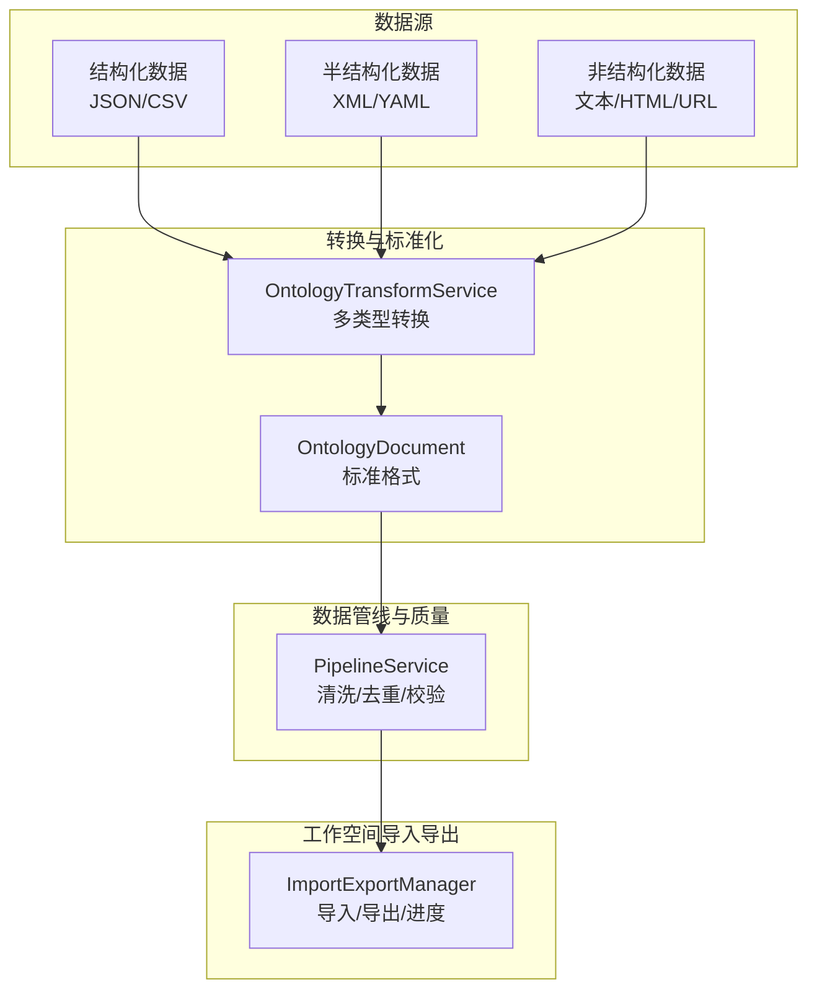
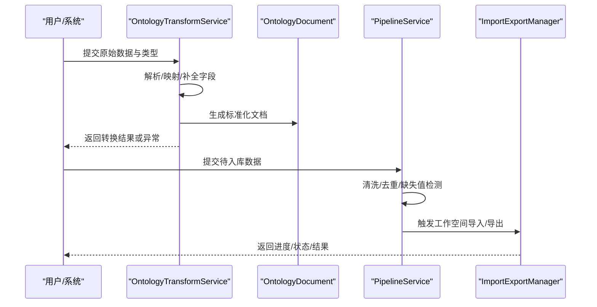
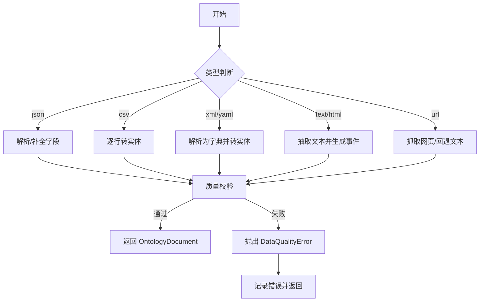
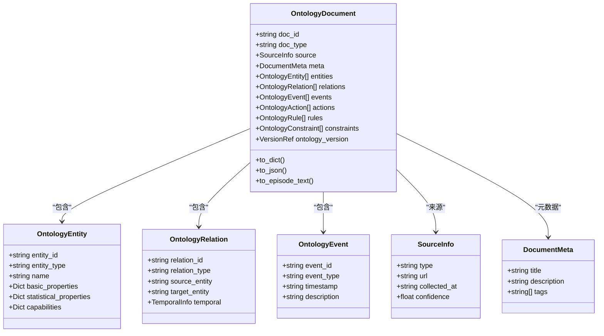
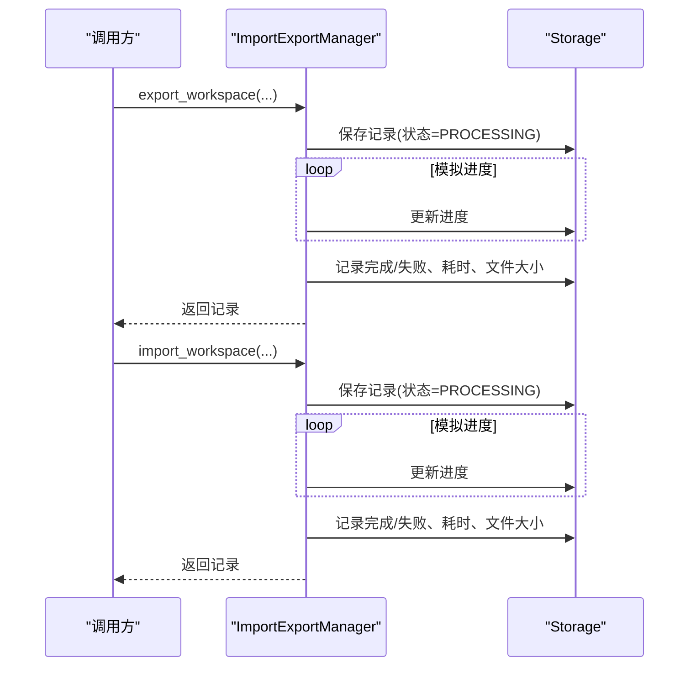
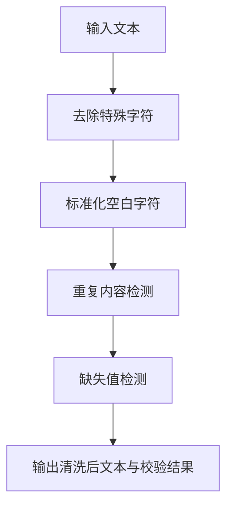

# 数据导入导出

<cite>
**本文引用的文件**
- [odap/biz/core/ontology/services/transform_service.py](file://odap/biz/core/ontology/services/transform_service.py)
- [odap/biz/core/ontology/schema/document.py](file://odap/biz/core/ontology/schema/document.py)
- [odap/biz/platform/workspace/impl/import_export.py](file://odap/biz/platform/workspace/impl/import_export.py)
- [odap/biz/platform/workspace/models/import_export.py](file://odap/biz/platform/workspace/models/import_export.py)
- [odap/biz/core/ontology/services/pipeline_service.py](file://odap/biz/core/ontology/services/pipeline_service.py)
- [docs/07-adr/ADR-032_standard_ontology_document_format.md](file://docs/07-adr/ADR-032_standard_ontology_document_format.md)
- [docs/02-architecture/ARCHITECTURE_FULL_CHAIN.md](file://docs/02-architecture/ARCHITECTURE_FULL_CHAIN.md)
- [docs/02-architecture/ARCHITECTURE_BIZ.md](file://docs/02-architecture/ARCHITECTURE_BIZ.md)
- [tests/unit/test_ontology_engine.py](file://tests/unit/test_ontology_engine.py)
</cite>

## 目录
1. [简介](#简介)
2. [项目结构](#项目结构)
3. [核心组件](#核心组件)
4. [架构总览](#架构总览)
5. [详细组件分析](#详细组件分析)
6. [依赖关系分析](#依赖关系分析)
7. [性能考量](#性能考量)
8. [故障排查指南](#故障排查指南)
9. [结论](#结论)
10. [附录](#附录)

## 简介
本文件面向“本体数据导入导出”能力，系统化说明以下内容：
- 支持的数据格式与转换规则（CSV、JSON、XML、YAML、文本、HTML、URL抓取等）
- 批量导入处理流程、错误处理机制与进度跟踪
- 数据转换映射规则、字段映射与类型转换策略
- 导出格式选项、过滤条件与输出控制
- 数据质量检查、重复数据处理与异常数据标记机制
- 导入导出过程中的性能优化与大文件处理策略
- 数据格式与 OntologyDocument JSON 标准的对应关系

## 项目结构
围绕导入导出的关键代码分布在如下模块：
- 转换与标准化：将多源数据转换为统一的 OntologyDocument 标准格式
- 工作空间导入导出：提供工作空间级别的导入导出与进度跟踪
- 数据管线与质量：清洗、去重、缺失值检测与质量校验
- 标准格式：统一的 OntologyDocument JSON Schema 与字段定义

**图表来源**
- [odap/biz/core/ontology/services/transform_service.py:40-118](file://odap/biz/core/ontology/services/transform_service.py#L40-L118)
- [odap/biz/core/ontology/schema/document.py:212-400](file://odap/biz/core/ontology/schema/document.py#L212-L400)
- [odap/biz/platform/workspace/impl/import_export.py:10-101](file://odap/biz/platform/workspace/impl/import_export.py#L10-L101)
- [odap/biz/core/ontology/services/pipeline_service.py:375-448](file://odap/biz/core/ontology/services/pipeline_service.py#L375-L448)

**章节来源**
- [odap/biz/core/ontology/services/transform_service.py:1-118](file://odap/biz/core/ontology/services/transform_service.py#L1-L118)
- [odap/biz/core/ontology/schema/document.py:1-120](file://odap/biz/core/ontology/schema/document.py#L1-L120)
- [odap/biz/platform/workspace/impl/import_export.py:1-164](file://odap/biz/platform/workspace/impl/import_export.py#L1-L164)
- [odap/biz/core/ontology/services/pipeline_service.py:375-448](file://odap/biz/core/ontology/services/pipeline_service.py#L375-L448)

## 核心组件
- OntologyTransformService：多类型数据到 OntologyDocument 的转换器，内置数据质量校验与错误处理
- OntologyDocument：统一的本体数据标准格式，定义实体、关系、事件、行动、规则、约束等结构
- ImportExportManager：工作空间导入导出管理器，提供进度跟踪、状态管理与错误记录
- PipelineService：数据清洗、去重与缺失值检测，保障数据质量

**章节来源**
- [odap/biz/core/ontology/services/transform_service.py:40-118](file://odap/biz/core/ontology/services/transform_service.py#L40-L118)
- [odap/biz/core/ontology/schema/document.py:212-400](file://odap/biz/core/ontology/schema/document.py#L212-L400)
- [odap/biz/platform/workspace/impl/import_export.py:10-101](file://odap/biz/platform/workspace/impl/import_export.py#L10-L101)
- [odap/biz/core/ontology/services/pipeline_service.py:375-448](file://odap/biz/core/ontology/services/pipeline_service.py#L375-L448)

## 架构总览
导入导出涉及“数据源 → 转换 → 标准化 → 质量校验 → 导出”的完整链路。前端通过摄入流程对接后端，后端将数据转换为 OntologyDocument，再进入工作空间导入导出流程。

**图表来源**
- [odap/biz/core/ontology/services/transform_service.py:68-118](file://odap/biz/core/ontology/services/transform_service.py#L68-L118)
- [odap/biz/core/ontology/schema/document.py:212-400](file://odap/biz/core/ontology/schema/document.py#L212-L400)
- [odap/biz/core/ontology/services/pipeline_service.py:375-448](file://odap/biz/core/ontology/services/pipeline_service.py#L375-L448)
- [odap/biz/platform/workspace/impl/import_export.py:16-101](file://odap/biz/platform/workspace/impl/import_export.py#L16-L101)

## 详细组件分析

### 组件A：多类型数据转换与标准化（OntologyTransformService）
- 支持类型：json、csv、xml、yaml、text、html、url；以及“结构化/半结构化/非结构化”泛型类型
- 转换流程：
  - JSON：字符串解析、数组首元素处理、字段补全
  - CSV：逐行转为实体，自动填充元数据
  - XML/YAML：解析为字典，按节点生成实体
  - 文本/HTML：抽取文本，生成事件
  - URL：抓取网页内容，回退为文本转换
- 质量校验：必填字段、实体 ID 唯一性、关系目标存在性、事件完整性
- 错误处理：统一异常封装，记录错误计数与消息

**图表来源**
- [odap/biz/core/ontology/services/transform_service.py:68-118](file://odap/biz/core/ontology/services/transform_service.py#L68-L118)
- [odap/biz/core/ontology/services/transform_service.py:119-334](file://odap/biz/core/ontology/services/transform_service.py#L119-L334)
- [odap/biz/core/ontology/services/transform_service.py:441-497](file://odap/biz/core/ontology/services/transform_service.py#L441-L497)

**章节来源**
- [odap/biz/core/ontology/services/transform_service.py:40-118](file://odap/biz/core/ontology/services/transform_service.py#L40-L118)
- [odap/biz/core/ontology/services/transform_service.py:119-334](file://odap/biz/core/ontology/services/transform_service.py#L119-L334)
- [odap/biz/core/ontology/services/transform_service.py:441-497](file://odap/biz/core/ontology/services/transform_service.py#L441-L497)

### 组件B：OntologyDocument 标准格式
- 字段定义：doc_id、doc_type、source、meta、entities、relations、events、actions、rules、constraints、ontology_version 等
- 验证器：必填字段校验、实体 ID 唯一性、关系目标存在性、事件完整性
- 序列化：to_dict、to_json、to_episode_text 等

**图表来源**
- [odap/biz/core/ontology/schema/document.py:212-400](file://odap/biz/core/ontology/schema/document.py#L212-L400)
- [odap/biz/core/ontology/schema/document.py:66-152](file://odap/biz/core/ontology/schema/document.py#L66-L152)

**章节来源**
- [odap/biz/core/ontology/schema/document.py:212-400](file://odap/biz/core/ontology/schema/document.py#L212-L400)
- [docs/07-adr/ADR-032_standard_ontology_document_format.md:24-226](file://docs/07-adr/ADR-032_standard_ontology_document_format.md#L24-L226)

### 组件C：工作空间导入导出（ImportExportManager）
- 功能：导出工作空间、导入工作空间、进度跟踪、状态管理、错误记录
- 进度：百分比进度、开始/结束时间、耗时、文件大小
- 控制：取消操作、记录查询、分页筛选

**图表来源**
- [odap/biz/platform/workspace/impl/import_export.py:16-101](file://odap/biz/platform/workspace/impl/import_export.py#L16-L101)
- [odap/biz/platform/workspace/models/import_export.py:18-34](file://odap/biz/platform/workspace/models/import_export.py#L18-L34)

**章节来源**
- [odap/biz/platform/workspace/impl/import_export.py:10-164](file://odap/biz/platform/workspace/impl/import_export.py#L10-L164)
- [odap/biz/platform/workspace/models/import_export.py:10-34](file://odap/biz/platform/workspace/models/import_export.py#L10-L34)

### 组件D：数据清洗与质量校验（PipelineService）
- 清洗：去除特殊字符、标准化空白字符
- 去重：词频统计计算重复比例
- 缺失值：关键字段与关键信息检测
- 结果：记录清洗前后对比与验证结果

**图表来源**
- [odap/biz/core/ontology/services/pipeline_service.py:402-448](file://odap/biz/core/ontology/services/pipeline_service.py#L402-L448)

**章节来源**
- [odap/biz/core/ontology/services/pipeline_service.py:375-448](file://odap/biz/core/ontology/services/pipeline_service.py#L375-L448)

### 组件E：数据格式与 OntologyDocument 对应关系
- JSON：支持直接传入对象或数组（取首个元素），自动补全必填字段
- CSV：逐行转为实体，实体类型为通用记录类型
- XML/YAML：解析为字典，按节点生成实体
- 文本/HTML：生成事件，事件类型为报告类
- URL：抓取网页内容，回退为文本转换
- 标准格式：遵循 ADR-032 的 OntologyDocument JSON Schema，包含实体、关系、事件、行动、规则、约束等

**章节来源**
- [odap/biz/core/ontology/services/transform_service.py:88-118](file://odap/biz/core/ontology/services/transform_service.py#L88-L118)
- [odap/biz/core/ontology/services/transform_service.py:119-334](file://odap/biz/core/ontology/services/transform_service.py#L119-L334)
- [docs/07-adr/ADR-032_standard_ontology_document_format.md:24-226](file://docs/07-adr/ADR-032_standard_ontology_document_format.md#L24-L226)

## 依赖关系分析
- 转换服务依赖 OntologyDocument 数据模型
- 数据管线依赖转换服务产出的标准文档
- 导入导出管理器依赖存储层以持久化进度与状态
- 前端摄入流程与后端转换/管线/导入导出形成闭环

**图表来源**
- [odap/biz/core/ontology/services/transform_service.py:125-149](file://odap/biz/core/ontology/services/transform_service.py#L125-L149)
- [odap/biz/core/ontology/schema/document.py:212-400](file://odap/biz/core/ontology/schema/document.py#L212-L400)
- [odap/biz/core/ontology/services/pipeline_service.py:375-448](file://odap/biz/core/ontology/services/pipeline_service.py#L375-L448)
- [odap/biz/platform/workspace/impl/import_export.py:13-32](file://odap/biz/platform/workspace/impl/import_export.py#L13-L32)

**章节来源**
- [odap/biz/core/ontology/services/transform_service.py:1-118](file://odap/biz/core/ontology/services/transform_service.py#L1-L118)
- [odap/biz/core/ontology/schema/document.py:1-120](file://odap/biz/core/ontology/schema/document.py#L1-L120)
- [odap/biz/platform/workspace/impl/import_export.py:1-164](file://odap/biz/platform/workspace/impl/import_export.py#L1-L164)

## 性能考量
- 转换与清洗：采用流式/增量处理思路，避免一次性加载大文档
- 并发与限流：在批量导入时控制并发度，防止内存与 CPU 波峰
- 存储与索引：对导入导出记录建立索引，支持分页与筛选
- 超时与重试：对长时间运行的转换与抓取设置超时与重试策略
- 前端进度：实时展示进度，提升用户体验

[本节为通用指导，无需特定文件引用]

## 故障排查指南
- 转换异常：捕获转换异常与数据质量异常，记录错误详情与来源类型
- 导入导出失败：检查文件格式、权限、存储空间与网络连通性
- 质量校验失败：关注实体 ID 重复、关系目标缺失、事件时间戳缺失等问题
- 进度卡顿：检查存储写入性能与并发度设置

**章节来源**
- [odap/biz/core/ontology/services/transform_service.py:23-38](file://odap/biz/core/ontology/services/transform_service.py#L23-L38)
- [odap/biz/platform/workspace/impl/import_export.py:48-96](file://odap/biz/platform/workspace/impl/import_export.py#L48-L96)
- [tests/unit/test_ontology_engine.py:50-73](file://tests/unit/test_ontology_engine.py#L50-L73)

## 结论
本方案通过统一的 OntologyDocument 标准格式，将多源数据（结构化/半结构化/非结构化）转换为可入库、可审计、可导出的标准化本体数据。配合数据清洗与质量校验、进度跟踪与错误处理，实现了高可靠、可扩展的导入导出能力。建议在生产环境中结合并发控制、超时与重试策略，确保大文件与高负载下的稳定性。

[本节为总结性内容，无需特定文件引用]

## 附录

### A. 支持的数据格式与转换规则
- JSON：对象或数组（取首个元素），自动补全必填字段
- CSV：逐行转实体，实体类型为通用记录类型
- XML/YAML：解析为字典，按节点生成实体
- 文本/HTML：生成事件，事件类型为报告类
- URL：抓取网页内容，回退为文本转换

**章节来源**
- [odap/biz/core/ontology/services/transform_service.py:88-118](file://odap/biz/core/ontology/services/transform_service.py#L88-L118)
- [odap/biz/core/ontology/services/transform_service.py:119-334](file://odap/biz/core/ontology/services/transform_service.py#L119-L334)

### B. 批量导入流程与进度跟踪
- 流程：解析数据 → 转换为 OntologyDocument → 质量校验 → 写入存储 → 导出记录
- 进度：百分比进度、开始/结束时间、耗时、文件大小
- 控制：取消操作、记录查询、分页筛选

**章节来源**
- [odap/biz/core/ontology/services/transform_service.py:68-118](file://odap/biz/core/ontology/services/transform_service.py#L68-L118)
- [odap/biz/platform/workspace/impl/import_export.py:16-101](file://odap/biz/platform/workspace/impl/import_export.py#L16-L101)
- [odap/biz/platform/workspace/models/import_export.py:18-34](file://odap/biz/platform/workspace/models/import_export.py#L18-L34)

### C. 数据质量检查与异常标记
- 必填字段：doc_id、doc_type、meta.title/description
- 实体校验：实体 ID 唯一性、实体字段完整性
- 关系校验：源/目标实体存在性
- 事件校验：事件 ID、时间戳完整性

**章节来源**
- [odap/biz/core/ontology/services/transform_service.py:441-497](file://odap/biz/core/ontology/services/transform_service.py#L441-L497)
- [odap/biz/core/ontology/schema/document.py:418-486](file://odap/biz/core/ontology/schema/document.py#L418-L486)

### D. 数据导出格式选项与过滤条件
- 导出范围：工作空间、资源、数据
- 输出控制：包含/排除资源、包含/排除数据、创建者
- 过滤条件：按工作空间、操作类型、状态、分页

**章节来源**
- [odap/biz/platform/workspace/impl/import_export.py:16-101](file://odap/biz/platform/workspace/impl/import_export.py#L16-L101)
- [odap/biz/platform/workspace/models/import_export.py:10-34](file://odap/biz/platform/workspace/models/import_export.py#L10-L34)

### E. 数据格式与 OntologyDocument JSON 对应关系
- JSON：直接映射为文档，自动补全字段
- CSV/XML/YAML/文本/HTML/URL：转换为实体/事件，最终形成标准文档

**章节来源**
- [docs/07-adr/ADR-032_standard_ontology_document_format.md:24-226](file://docs/07-adr/ADR-032_standard_ontology_document_format.md#L24-L226)
- [odap/biz/core/ontology/services/transform_service.py:335-379](file://odap/biz/core/ontology/services/transform_service.py#L335-L379)