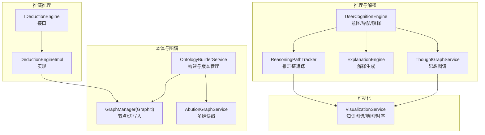
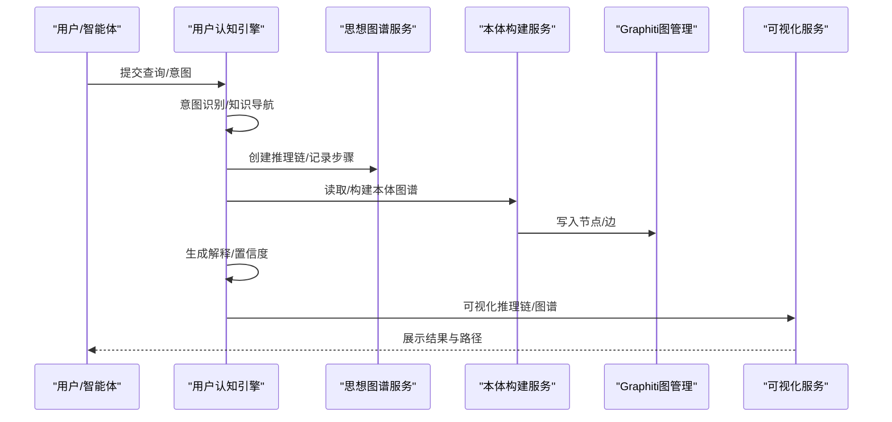
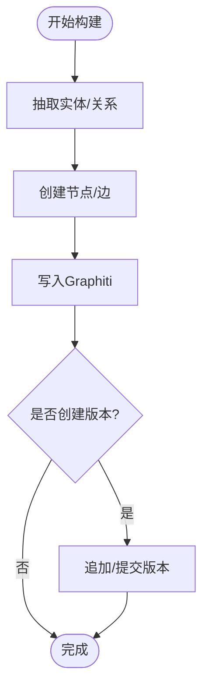
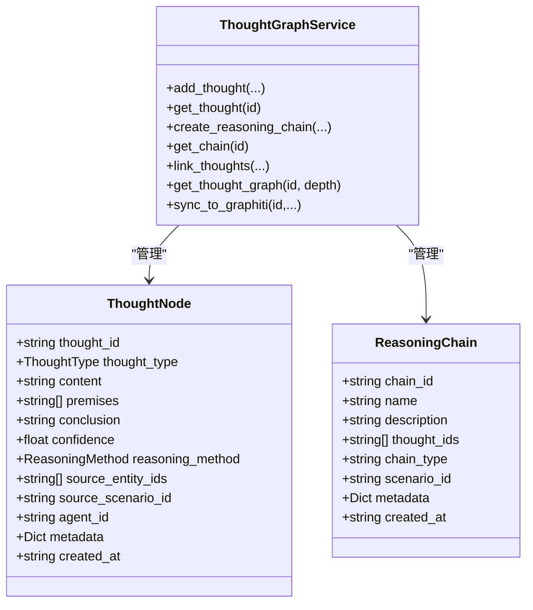
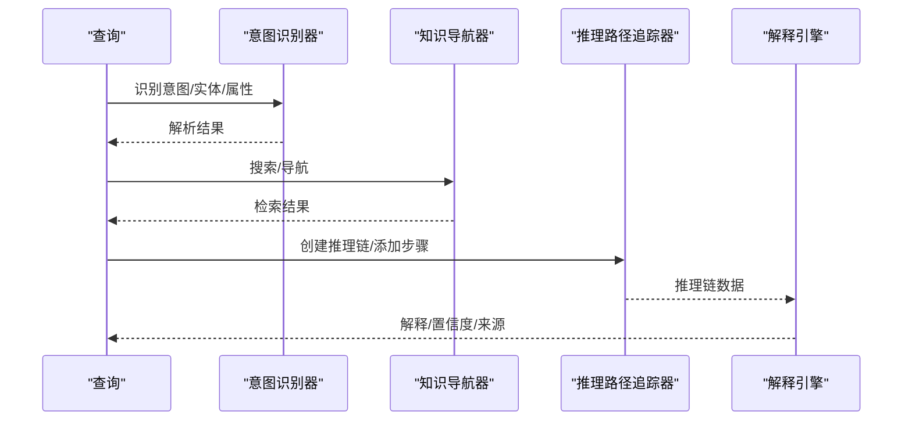
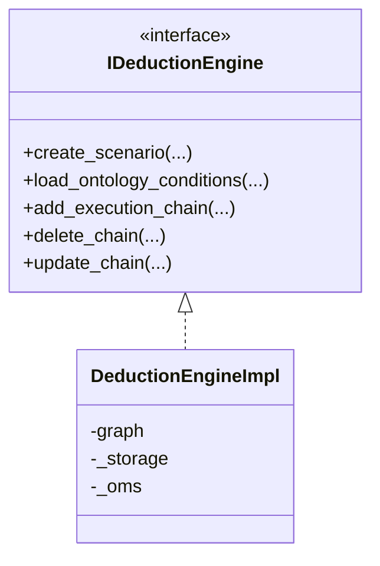
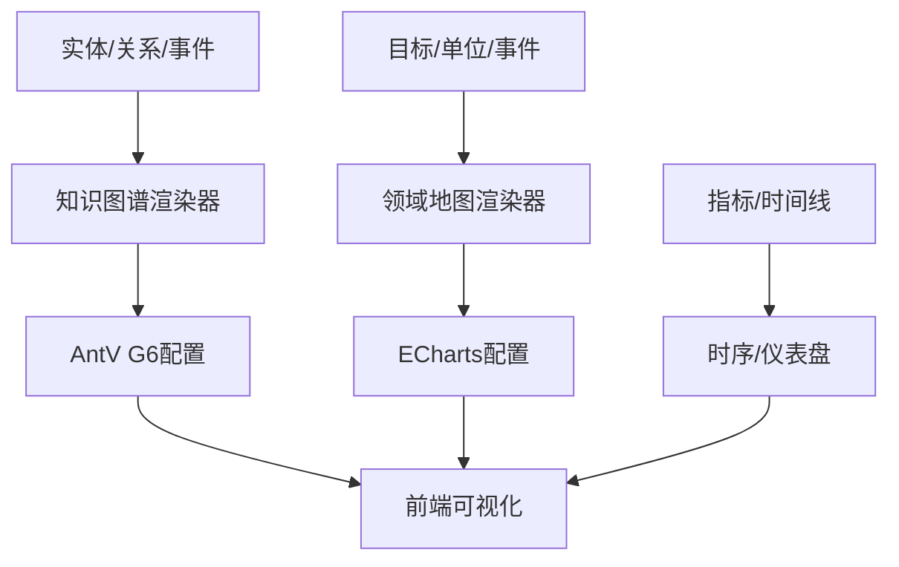
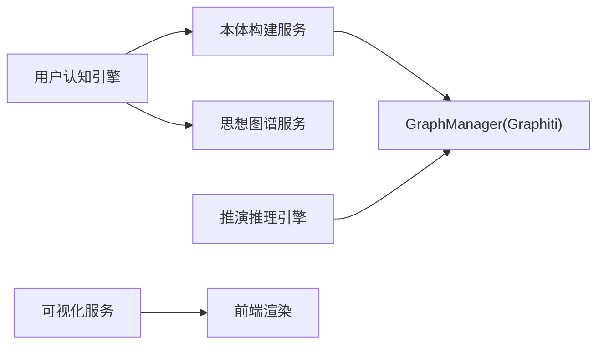

# 本体推理机制

<cite>
**本文档引用的文件**
- [odap/biz/core/cognition/user_cognition_engine.py](file://odap/biz/core/cognition/user_cognition_engine.py)
- [odap/biz/core/cognition/thought_graph/models/types.py](file://odap/biz/core/cognition/thought_graph/models/types.py)
- [odap/biz/core/cognition/thought_graph/services/thought_graph_service.py](file://odap/biz/core/cognition/thought_graph/services/thought_graph_service.py)
- [odap/biz/core/ontology/services/build_service.py](file://odap/biz/core/ontology/services/build_service.py)
- [odap/biz/core/ontology/ingestion_split/manual_input.py](file://odap/biz/core/ontology/ingestion_split/manual_input.py)
- [odap/biz/simulation/simulation_deduction/interfaces/deduction_engine.py](file://odap/biz/simulation/simulation_deduction/interfaces/deduction_engine.py)
- [odap/biz/simulation/simulation_deduction/impl/deduction_engine_impl.py](file://odap/biz/simulation/simulation_deduction/impl/deduction_engine_impl.py)
- [odap/biz/core/ontology/abution_graph/services/abution_graph_service.py](file://odap/biz/core/ontology/abution_graph/services/abution_graph_service.py)
- [odap/biz/core/ontology/abution_graph/api/routes.py](file://odap/biz/core/ontology/abution_graph/api/routes.py)
- [odap/infra/graph/thought_graph.py](file://odap/infra/graph/thought_graph.py)
- [docs/03-modules/visualization/DESIGN.md](file://docs/03-modules/visualization/DESIGN.md)
- [docs/03-modules/visualization/DESIGN_GRAPH_OPTIMIZATION.md](file://docs/03-modules/visualization/DESIGN_GRAPH_OPTIMIMIZATION.md)
- [odap/infra/monitoring/performance_monitor.py](file://odap/infra/monitoring/performance_monitor.py)
- [docs/06-dfx/DFX_DESIGN.md](file://docs/06-dfx/DFX_DESIGN.md)
- [AGENTS.md](file://AGENTS.md)
- [tests/unit/test_cognition.py](file://tests/unit/test_cognition.py)
- [tests/unit/test_thought_graph.py](file://tests/unit/test_thought_graph.py)
</cite>

## 目录
1. [简介](#简介)
2. [项目结构](#项目结构)
3. [核心组件](#核心组件)
4. [架构总览](#架构总览)
5. [详细组件分析](#详细组件分析)
6. [依赖分析](#依赖分析)
7. [性能考量](#性能考量)
8. [故障排查指南](#故障排查指南)
9. [结论](#结论)
10. [附录](#附录)

## 简介
本体推理机制围绕“基于本体的知识图谱”展开，通过本体构建、图谱同步、推理链追踪、解释生成与可视化展示，形成从数据到知识再到决策支持的完整闭环。系统支持概念推理（实体与属性）、关系推理（实体间关系与时序）、规则推理（业务规则与逻辑模型），并提供推理路径可视化、可解释性说明、性能监控与优化策略，满足大规模本体场景下的推理需求。

## 项目结构
本体推理机制涉及多模块协同：
- 本体构建与版本管理：负责从文档抽取实体/关系，写入图谱并创建版本
- 思想图谱与推理链：记录推理步骤、结论与置信度，支撑解释与可视化
- 推演推理引擎：面向模拟推演的执行链与条件加载
- 可视化模块：知识图谱、领域地图、时序与仪表盘等可视化
- 性能监控与优化：指标采集、缓存与渲染优化策略

**图表来源**
- [odap/biz/core/ontology/services/build_service.py:51-135](file://odap/biz/core/ontology/services/build_service.py#L51-L135)
- [odap/biz/core/ontology/abution_graph/services/abution_graph_service.py:63-74](file://odap/biz/core/ontology/abution_graph/services/abution_graph_service.py#L63-L74)
- [odap/biz/core/cognition/user_cognition_engine.py:787-800](file://odap/biz/core/cognition/user_cognition_engine.py#L787-L800)
- [odap/biz/core/cognition/thought_graph/services/thought_graph_service.py:1-167](file://odap/biz/core/cognition/thought_graph/services/thought_graph_service.py#L1-L167)
- [odap/biz/simulation/simulation_deduction/interfaces/deduction_engine.py:5-33](file://odap/biz/simulation/simulation_deduction/interfaces/deduction_engine.py#L5-L33)
- [odap/biz/simulation/simulation_deduction/impl/deduction_engine_impl.py:18-33](file://odap/biz/simulation/simulation_deduction/impl/deduction_engine_impl.py#L18-L33)
- [docs/03-modules/visualization/DESIGN.md:26-77](file://docs/03-modules/visualization/DESIGN.md#L26-L77)

**章节来源**
- [odap/biz/core/ontology/services/build_service.py:51-135](file://odap/biz/core/ontology/services/build_service.py#L51-L135)
- [odap/biz/core/ontology/abution_graph/services/abution_graph_service.py:63-74](file://odap/biz/core/ontology/abution_graph/services/abution_graph_service.py#L63-L74)
- [odap/biz/core/cognition/user_cognition_engine.py:787-800](file://odap/biz/core/cognition/user_cognition_engine.py#L787-L800)
- [odap/biz/core/cognition/thought_graph/services/thought_graph_service.py:1-167](file://odap/biz/core/cognition/thought_graph/services/thought_graph_service.py#L1-L167)
- [odap/biz/simulation/simulation_deduction/interfaces/deduction_engine.py:5-33](file://odap/biz/simulation/simulation_deduction/interfaces/deduction_engine.py#L5-L33)
- [odap/biz/simulation/simulation_deduction/impl/deduction_engine_impl.py:18-33](file://odap/biz/simulation/simulation_deduction/impl/deduction_engine_impl.py#L18-L33)
- [docs/03-modules/visualization/DESIGN.md:26-77](file://docs/03-modules/visualization/DESIGN.md#L26-L77)

## 核心组件
- 本体构建服务：从 OntologyDocument 抽取实体/关系，创建图谱节点/边，写入 Graphiti，并创建版本
- 思想图谱服务：以 ThoughtNode 和 ReasoningChain 为核心，支持推理链创建、链接与可视化
- 用户认知引擎：意图识别、知识导航、推理路径追踪、解释生成与角色视图
- 推演推理引擎：场景创建、本体条件加载、执行链管理与结果存储
- 可视化服务：知识图谱、领域地图、时序与仪表盘渲染
- 性能监控：指标采集、统计与装饰器监控

**章节来源**
- [odap/biz/core/ontology/services/build_service.py:51-135](file://odap/biz/core/ontology/services/build_service.py#L51-L135)
- [odap/biz/core/cognition/thought_graph/models/types.py:25-51](file://odap/biz/core/cognition/thought_graph/models/types.py#L25-L51)
- [odap/biz/core/cognition/thought_graph/services/thought_graph_service.py:1-167](file://odap/biz/core/cognition/thought_graph/services/thought_graph_service.py#L1-L167)
- [odap/biz/core/cognition/user_cognition_engine.py:787-800](file://odap/biz/core/cognition/user_cognition_engine.py#L787-L800)
- [odap/biz/simulation/simulation_deduction/interfaces/deduction_engine.py:5-33](file://odap/biz/simulation/simulation_deduction/interfaces/deduction_engine.py#L5-L33)
- [docs/03-modules/visualization/DESIGN.md:26-77](file://docs/03-modules/visualization/DESIGN.md#L26-L77)
- [odap/infra/monitoring/performance_monitor.py:12-184](file://odap/infra/monitoring/performance_monitor.py#L12-L184)

## 架构总览
本体推理机制以“本体构建—图谱同步—推理—解释—可视化”为主线，结合推演推理与性能监控，形成闭环。

**图表来源**
- [odap/biz/core/cognition/user_cognition_engine.py:787-800](file://odap/biz/core/cognition/user_cognition_engine.py#L787-L800)
- [odap/biz/core/cognition/thought_graph/services/thought_graph_service.py:67-108](file://odap/biz/core/cognition/thought_graph/services/thought_graph_service.py#L67-L108)
- [odap/biz/core/ontology/services/build_service.py:256-302](file://odap/biz/core/ontology/services/build_service.py#L256-L302)
- [docs/03-modules/visualization/DESIGN.md:26-77](file://docs/03-modules/visualization/DESIGN.md#L26-L77)

## 详细组件分析

### 本体构建与版本管理
- 实体/关系抽取：从 OntologyDocument 中提取实体与关系，事件转为实体并建立参与者关系
- 图谱写入：将节点与边写入 Graphiti，附带工作空间与场景上下文
- 版本管理：追加数据后提交锁定，生成版本号与提交信息

**图表来源**
- [odap/biz/core/ontology/services/build_service.py:51-135](file://odap/biz/core/ontology/services/build_service.py#L51-L135)
- [odap/biz/core/ontology/services/build_service.py:256-302](file://odap/biz/core/ontology/services/build_service.py#L256-L302)
- [odap/biz/core/ontology/services/build_service.py:303-354](file://odap/biz/core/ontology/services/build_service.py#L303-L354)

**章节来源**
- [odap/biz/core/ontology/services/build_service.py:51-135](file://odap/biz/core/ontology/services/build_service.py#L51-L135)
- [odap/biz/core/ontology/services/build_service.py:256-302](file://odap/biz/core/ontology/services/build_service.py#L256-L302)
- [odap/biz/core/ontology/services/build_service.py:303-354](file://odap/biz/core/ontology/services/build_service.py#L303-L354)

### 思想图谱与推理链
- 思想节点与推理链：定义推理类型、推理方法、置信度与元数据
- 推理链追踪：创建链、添加步骤、完成链并生成可视化数据
- 思想图谱服务：保存/查询思想节点与推理链，支持邻接遍历与同步至 Graphiti

**图表来源**
- [odap/biz/core/cognition/thought_graph/models/types.py:25-51](file://odap/biz/core/cognition/thought_graph/models/types.py#L25-L51)
- [odap/biz/core/cognition/thought_graph/services/thought_graph_service.py:1-167](file://odap/biz/core/cognition/thought_graph/services/thought_graph_service.py#L1-L167)

**章节来源**
- [odap/biz/core/cognition/thought_graph/models/types.py:8-51](file://odap/biz/core/cognition/thought_graph/models/types.py#L8-L51)
- [odap/biz/core/cognition/thought_graph/services/thought_graph_service.py:19-108](file://odap/biz/core/cognition/thought_graph/services/thought_graph_service.py#L19-L108)
- [odap/infra/graph/thought_graph.py:1-10](file://odap/infra/graph/thought_graph.py#L1-L10)

### 用户认知引擎与解释生成
- 意图识别：识别查询意图、实体与属性，生成解析结果
- 知识导航：基于查询服务或图客户端进行检索与邻接导航
- 推理路径追踪：创建推理链、记录步骤、生成可视化
- 解释生成：根据推理链与来源证据生成解释与替代解释

**图表来源**
- [odap/biz/core/cognition/user_cognition_engine.py:140-303](file://odap/biz/core/cognition/user_cognition_engine.py#L140-L303)
- [odap/biz/core/cognition/user_cognition_engine.py:468-561](file://odap/biz/core/cognition/user_cognition_engine.py#L468-L561)
- [odap/biz/core/cognition/user_cognition_engine.py:563-680](file://odap/biz/core/cognition/user_cognition_engine.py#L563-L680)

**章节来源**
- [odap/biz/core/cognition/user_cognition_engine.py:140-303](file://odap/biz/core/cognition/user_cognition_engine.py#L140-L303)
- [odap/biz/core/cognition/user_cognition_engine.py:468-561](file://odap/biz/core/cognition/user_cognition_engine.py#L468-L561)
- [odap/biz/core/cognition/user_cognition_engine.py:563-680](file://odap/biz/core/cognition/user_cognition_engine.py#L563-L680)

### 推演推理引擎
- 接口定义：场景创建、加载本体条件、添加/删除/更新执行链
- 实现要点：持有图管理器与 OMS，按场景维度组织执行链与条件

**图表来源**
- [odap/biz/simulation/simulation_deduction/interfaces/deduction_engine.py:5-33](file://odap/biz/simulation/simulation_deduction/interfaces/deduction_engine.py#L5-L33)
- [odap/biz/simulation/simulation_deduction/impl/deduction_engine_impl.py:18-33](file://odap/biz/simulation/simulation_deduction/impl/deduction_engine_impl.py#L18-L33)

**章节来源**
- [odap/biz/simulation/simulation_deduction/interfaces/deduction_engine.py:5-33](file://odap/biz/simulation/simulation_deduction/interfaces/deduction_engine.py#L5-L33)
- [odap/biz/simulation/simulation_deduction/impl/deduction_engine_impl.py:18-33](file://odap/biz/simulation/simulation_deduction/impl/deduction_engine_impl.py#L18-L33)

### 可视化与解释展示
- 知识图谱渲染：节点/边样式映射，力导向布局
- 领域地图/时序/仪表盘：多类型可视化模板
- 思想图谱可视化：推理链节点与边序列、结论节点

**图表来源**
- [docs/03-modules/visualization/DESIGN.md:162-221](file://docs/03-modules/visualization/DESIGN.md#L162-L221)
- [docs/03-modules/visualization/DESIGN.md:85-158](file://docs/03-modules/visualization/DESIGN.md#L85-L158)
- [docs/03-modules/visualization/DESIGN.md:41-77](file://docs/03-modules/visualization/DESIGN.md#L41-L77)

**章节来源**
- [docs/03-modules/visualization/DESIGN.md:162-221](file://docs/03-modules/visualization/DESIGN.md#L162-L221)
- [docs/03-modules/visualization/DESIGN.md:85-158](file://docs/03-modules/visualization/DESIGN.md#L85-L158)
- [docs/03-modules/visualization/DESIGN.md:41-77](file://docs/03-modules/visualization/DESIGN.md#L41-L77)

### 不确定性与验证机制
- 置信度与来源：解释引擎记录推理链置信度与证据来源
- 替代解释：生成不同前提下的替代结论
- 单元测试覆盖：解释生成、推理链可视化、思想图谱枚举转换等

**章节来源**
- [odap/biz/core/cognition/user_cognition_engine.py:563-680](file://odap/biz/core/cognition/user_cognition_engine.py#L563-L680)
- [tests/unit/test_cognition.py:346-379](file://tests/unit/test_cognition.py#L346-L379)
- [tests/unit/test_thought_graph.py:256-286](file://tests/unit/test_thought_graph.py#L256-L286)

## 依赖分析
- 模块耦合
  - 本体构建服务依赖 GraphManager 与版本管理器
  - 用户认知引擎依赖知识导航器、推理追踪器与解释引擎
  - 推演推理引擎依赖图管理器与 OMS
  - 可视化服务依赖前端渲染框架与后端数据
- 外部依赖
  - Graphiti 图数据库（节点/边写入与查询）
  - AntV G6/ECharts 等可视化库
  - WebSocket/Socket.IO 实现实时推演可视化

**图表来源**
- [odap/biz/core/ontology/services/build_service.py:256-302](file://odap/biz/core/ontology/services/build_service.py#L256-L302)
- [odap/biz/core/cognition/user_cognition_engine.py:787-800](file://odap/biz/core/cognition/user_cognition_engine.py#L787-L800)
- [odap/biz/simulation/simulation_deduction/impl/deduction_engine_impl.py:18-33](file://odap/biz/simulation/simulation_deduction/impl/deduction_engine_impl.py#L18-L33)
- [docs/03-modules/visualization/DESIGN.md:26-77](file://docs/03-modules/visualization/DESIGN.md#L26-L77)

**章节来源**
- [odap/biz/core/ontology/services/build_service.py:256-302](file://odap/biz/core/ontology/services/build_service.py#L256-L302)
- [odap/biz/core/cognition/user_cognition_engine.py:787-800](file://odap/biz/core/cognition/user_cognition_engine.py#L787-L800)
- [odap/biz/simulation/simulation_deduction/impl/deduction_engine_impl.py:18-33](file://odap/biz/simulation/simulation_deduction/impl/deduction_engine_impl.py#L18-L33)
- [docs/03-modules/visualization/DESIGN.md:26-77](file://docs/03-modules/visualization/DESIGN.md#L26-L77)

## 性能考量
- 指标采集与统计：提供统一的性能监控器，支持 LLM 调用、数据库查询、API 请求与工具执行的时延统计
- 缓存与预取：查询理解缓存、图谱三级缓存（内存/Redis/Disk）、检索结果预取
- 渲染优化：大图谱 LOD 分级渲染、Web Worker 布局、虚拟画布与 WebGL 模式
- 并发与容量：API 网关异步并发、连接池复用、Provider 限速与排队

**章节来源**
- [odap/infra/monitoring/performance_monitor.py:12-184](file://odap/infra/monitoring/performance_monitor.py#L12-L184)
- [docs/06-dfx/DFX_DESIGN.md:38-69](file://docs/06-dfx/DFX_DESIGN.md#L38-L69)
- [docs/03-modules/visualization/DESIGN_GRAPH_OPTIMIZATION.md:494-542](file://docs/03-modules/visualization/DESIGN_GRAPH_OPTIMIZATION.md#L494-L542)

## 故障排查指南
- 推理链可视化为空：检查推理链创建与步骤添加是否成功，确认链 ID 与节点 ID 一致
- 解释生成异常：核对来源证据与推理规则，确保置信度与替代解释生成逻辑正常
- 图谱写入失败：检查 GraphManager 初始化与权限，关注节点/边创建异常日志
- 可视化渲染卡顿：启用 LOD 分级渲染、Web Worker 布局与虚拟画布，降低节点数量或调整布局

**章节来源**
- [tests/unit/test_thought_graph.py:256-286](file://tests/unit/test_thought_graph.py#L256-L286)
- [tests/unit/test_cognition.py:346-379](file://tests/unit/test_cognition.py#L346-L379)
- [odap/biz/core/ontology/services/build_service.py:299-302](file://odap/biz/core/ontology/services/build_service.py#L299-L302)
- [docs/03-modules/visualization/DESIGN_GRAPH_OPTIMIZATION.md:494-542](file://docs/03-modules/visualization/DESIGN_GRAPH_OPTIMIZATION.md#L494-L542)

## 结论
本体推理机制通过“本体构建—图谱同步—推理链追踪—解释生成—可视化展示”的闭环，实现了从数据到知识再到决策支持的全过程。系统具备可解释性、可视化与性能优化能力，适用于复杂场景下的大规模本体推理与推演分析。

## 附录
- 场景与本体关系：场景绑定本体，本体多版本与语义地图、业务规则、逻辑模型关联，智能体问答检索范围限定在当前场景
- 推演关系类型：场景版本、执行、分析、分支合并、回滚、决策模拟等关系，支撑方案对比、敏感性分析与实时推演可视化

**章节来源**
- [AGENTS.md:642-669](file://AGENTS.md#L642-L669)
- [docs/03-modules/ontology/DESIGN.md:705-765](file://docs/03-modules/ontology/DESIGN.md#L705-L765)