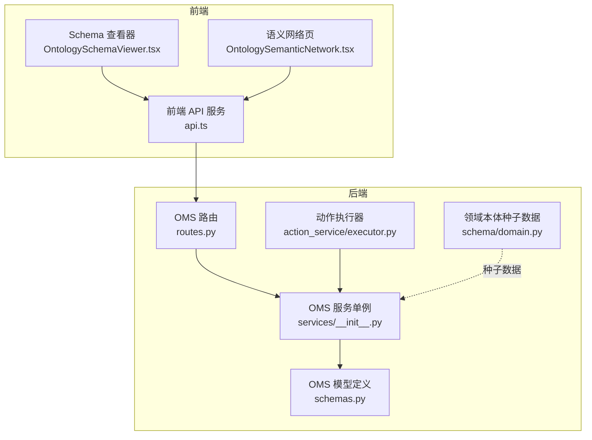
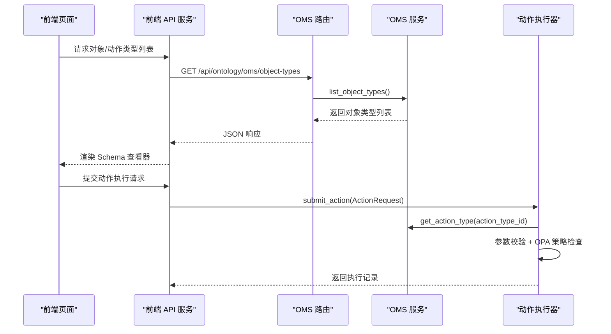
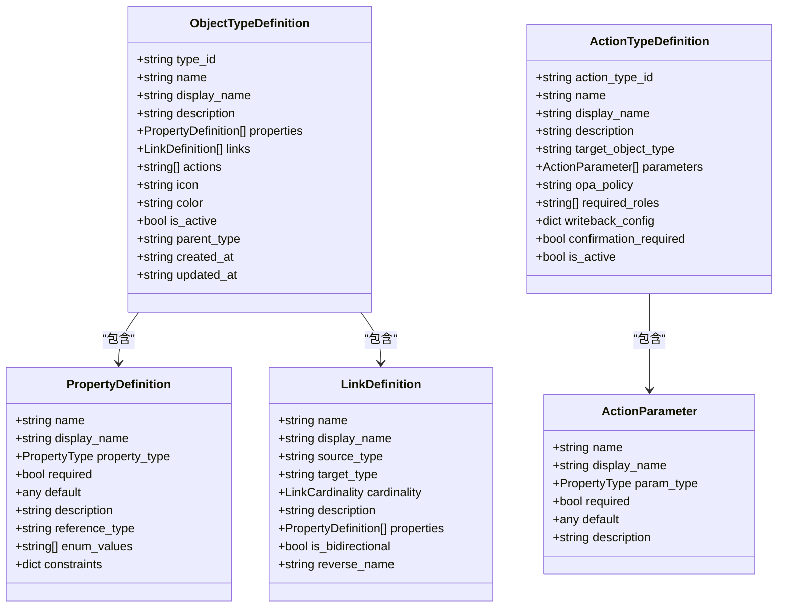
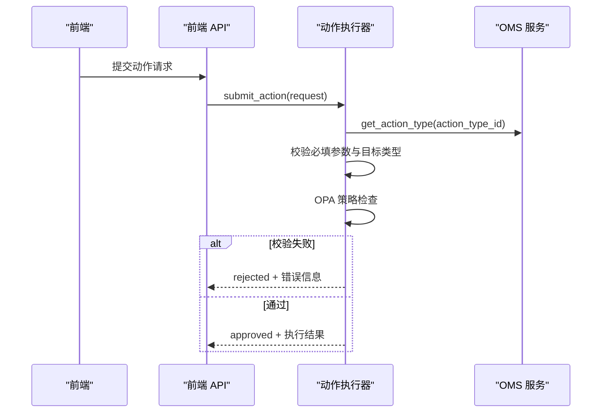
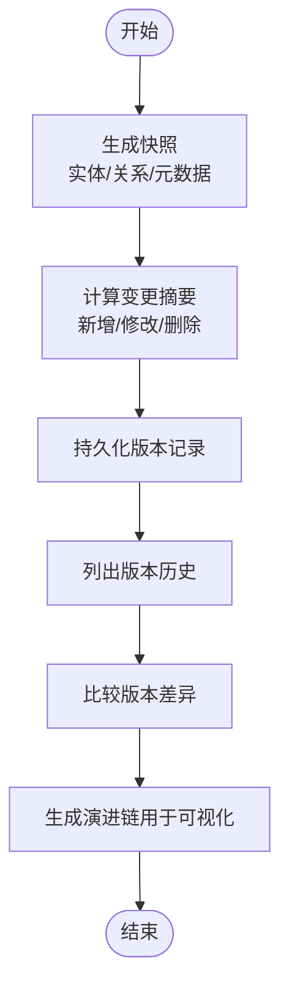
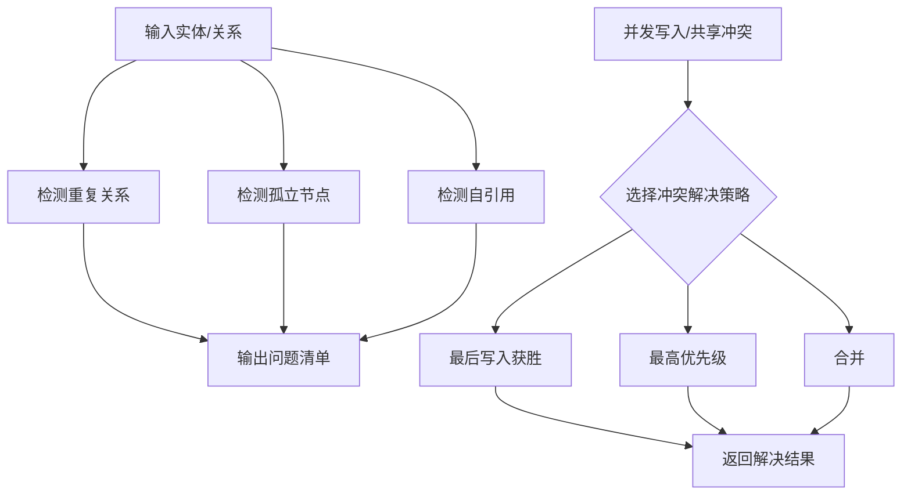
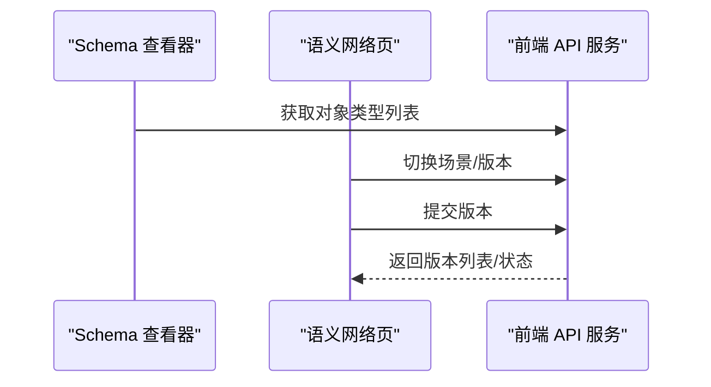
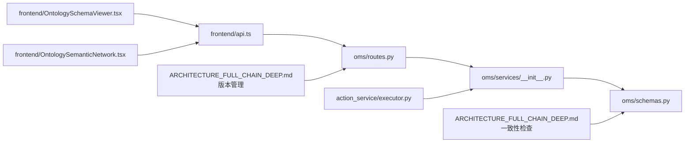

# 本体模型

<cite>
**本文引用的文件**
- [odap/biz/core/ontology/schema/domain.py](file://odap/biz/core/ontology/schema/domain.py)
- [docs/03-modules/ontology/DESIGN.md](file://docs/03-modules/ontology/DESIGN.md)
- [docs/02-architecture/ARCHITECTURE_FULL_CHAIN_DEEP.md](file://docs/02-architecture/ARCHITECTURE_FULL_CHAIN_DEEP.md)
- [docs/00-requirements/req-ok.md](file://docs/00-requirements/req-ok.md)
- [odap/biz/core/ontology/oms/schemas.py](file://odap/biz/core/ontology/oms/schemas.py)
- [odap/biz/core/ontology/oms/routes.py](file://odap/biz/core/ontology/oms/routes.py)
- [odap/biz/core/ontology/oms/services/__init__.py](file://odap/biz/core/ontology/oms/services/__init__.py)
- [odap/biz/decision/action_service/executor.py](file://odap/biz/decision/action_service/executor.py)
- [frontend/src/modules/shared/services/api.ts](file://frontend/src/modules/shared/services/api.ts)
- [frontend/src/modules/ontology/components/OntologySchemaViewer.tsx](file://frontend/src/modules/ontology/components/OntologySchemaViewer.tsx)
- [frontend/src/modules/ontology/pages/OntologySemanticNetwork.tsx](file://frontend/src/modules/ontology/pages/OntologySemanticNetwork.tsx)
- [frontend/src/modules/shared/types.ts](file://frontend/src/modules/shared/types.ts)
- [odap/biz/platform/ontology_memory/shared_workspace/services/consensus_engine.py](file://odap/biz/platform/ontology_memory/shared_workspace/services/consensus_engine.py)
- [tests/e2e/test_military_e2e_flow.py](file://tests/e2e/test_military_e2e_flow.py)
</cite>

## 目录
1. [简介](#简介)
2. [项目结构](#项目结构)
3. [核心组件](#核心组件)
4. [架构总览](#架构总览)
5. [详细组件分析](#详细组件分析)
6. [依赖分析](#依赖分析)
7. [性能考虑](#性能考虑)
8. [故障排查指南](#故障排查指南)
9. [结论](#结论)
10. [附录](#附录)

## 简介
本文件面向本体工程师与数据建模师，系统化阐述 OMS（Ontology Meta-Model）元模型框架的 Object/Property/Action/Rule 四层本体结构设计与实现，覆盖分类体系、属性定义、关系建模、版本管理、Schema 演进与兼容、数据验证与约束、导入导出与互操作、质量评估与一致性检查、冲突解决机制等主题，并提供权威建模指南与实施参考。

## 项目结构
OMS 元模型位于后端业务层的本体子系统中，围绕“对象类型”“动作类型”“属性/链接/函数/触发器”等核心概念提供元数据定义、API 路由与服务封装；前端提供本体 Schema 查看与版本管理交互；测试用例覆盖 E2E 场景下的对象/动作类型创建与验证规则持久化。

**图表来源**
- [odap/biz/core/ontology/oms/routes.py:10-99](file://odap/biz/core/ontology/oms/routes.py#L10-L99)
- [odap/biz/core/ontology/oms/schemas.py:1-136](file://odap/biz/core/ontology/oms/schemas.py#L1-L136)
- [odap/biz/core/ontology/oms/services/__init__.py:1-4](file://odap/biz/core/ontology/oms/services/__init__.py#L1-L4)
- [odap/biz/decision/action_service/executor.py:48-120](file://odap/biz/decision/action_service/executor.py#L48-L120)
- [frontend/src/modules/shared/services/api.ts:1581-1619](file://frontend/src/modules/shared/services/api.ts#L1581-L1619)
- [frontend/src/modules/ontology/components/OntologySchemaViewer.tsx:57-103](file://frontend/src/modules/ontology/components/OntologySchemaViewer.tsx#L57-L103)
- [frontend/src/modules/ontology/pages/OntologySemanticNetwork.tsx:329-372](file://frontend/src/modules/ontology/pages/OntologySemanticNetwork.tsx#L329-L372)
- [odap/biz/core/ontology/schema/domain.py:1-428](file://odap/biz/core/ontology/schema/domain.py#L1-L428)

**章节来源**
- [odap/biz/core/ontology/oms/routes.py:10-99](file://odap/biz/core/ontology/oms/routes.py#L10-L99)
- [odap/biz/core/ontology/oms/schemas.py:1-136](file://odap/biz/core/ontology/oms/schemas.py#L1-L136)
- [odap/biz/core/ontology/oms/services/__init__.py:1-4](file://odap/biz/core/ontology/oms/services/__init__.py#L1-L4)
- [frontend/src/modules/shared/services/api.ts:1581-1619](file://frontend/src/modules/shared/services/api.ts#L1581-L1619)
- [frontend/src/modules/ontology/components/OntologySchemaViewer.tsx:57-103](file://frontend/src/modules/ontology/components/OntologySchemaViewer.tsx#L57-L103)
- [frontend/src/modules/ontology/pages/OntologySemanticNetwork.tsx:329-372](file://frontend/src/modules/ontology/pages/OntologySemanticNetwork.tsx#L329-L372)
- [odap/biz/core/ontology/schema/domain.py:1-428](file://odap/biz/core/ontology/schema/domain.py#L1-L428)

## 核心组件
- 对象类型（Object Type）：定义实体分类、属性集合、链接关系、可用动作、图标与颜色等元信息。
- 属性（Property）：描述对象类型的字段，含类型、必填、默认值、枚举、引用类型、约束等。
- 动作（Action）：定义可对目标对象类型发起的操作，含参数、目标类型、权限策略、写回配置、确认要求等。
- 规则（Rule）：用于验证与约束的规则集，支持实体/关系/场景等层面的质量与一致性检查。
- 版本管理（Versioning）：基于工作空间的快照、对比、回滚与演进链管理，确保 Schema 的可追溯与兼容。
- 一致性检查（Consistency）：检测重复关系、孤立节点、自引用等问题，保障图谱结构健康。
- 冲突解决（Conflict Resolution）：在共享工作空间中提供多种冲突解决策略（如最后写入获胜、合并等）。

**章节来源**
- [odap/biz/core/ontology/oms/schemas.py:18-86](file://odap/biz/core/ontology/oms/schemas.py#L18-L86)
- [odap/biz/core/ontology/oms/schemas.py:49-70](file://odap/biz/core/ontology/oms/schemas.py#L49-L70)
- [docs/02-architecture/ARCHITECTURE_FULL_CHAIN_DEEP.md:1944-2156](file://docs/02-architecture/ARCHITECTURE_FULL_CHAIN_DEEP.md#L1944-L2156)
- [docs/02-architecture/ARCHITECTURE_FULL_CHAIN_DEEP.md:1460-1515](file://docs/02-architecture/ARCHITECTURE_FULL_CHAIN_DEEP.md#L1460-L1515)
- [odap/biz/platform/ontology_memory/shared_workspace/services/consensus_engine.py:124-145](file://odap/biz/platform/ontology_memory/shared_workspace/services/consensus_engine.py#L124-L145)

## 架构总览
OMS 元模型通过 FastAPI 路由暴露 CRUD 接口，服务层封装对象/动作类型的增删改查与绑定关系；前端通过统一 API 服务访问 OMS，提供 Schema 查看与版本切换；动作执行器在运行时依据 OMS 的动作类型定义进行参数校验与 OPA 策略检查；版本管理器负责本体快照、差异计算与演进链展示；一致性检查器与冲突解决引擎贯穿构建与共享阶段，保障质量与协作稳定。

**图表来源**
- [frontend/src/modules/shared/services/api.ts:1581-1619](file://frontend/src/modules/shared/services/api.ts#L1581-L1619)
- [odap/biz/core/ontology/oms/routes.py:13-99](file://odap/biz/core/ontology/oms/routes.py#L13-L99)
- [odap/biz/core/ontology/oms/services/__init__.py:1-4](file://odap/biz/core/ontology/oms/services/__init__.py#L1-L4)
- [odap/biz/decision/action_service/executor.py:48-120](file://odap/biz/decision/action_service/executor.py#L48-L120)

**章节来源**
- [frontend/src/modules/shared/services/api.ts:1581-1619](file://frontend/src/modules/shared/services/api.ts#L1581-L1619)
- [odap/biz/core/ontology/oms/routes.py:13-99](file://odap/biz/core/ontology/oms/routes.py#L13-L99)
- [odap/biz/decision/action_service/executor.py:48-120](file://odap/biz/decision/action_service/executor.py#L48-L120)

## 详细组件分析

### 组件A：OMS 数据模型与 API
- 模型定义：对象类型、属性、链接、动作参数、动作类型等 Pydantic 模型，统一约束字段与类型。
- 路由接口：提供对象类型与动作类型的增删改查、绑定/解绑等 REST 接口。
- 服务封装：OMS 服务单例对外提供统一访问入口，便于路由与执行器调用。

**图表来源**
- [odap/biz/core/ontology/oms/schemas.py:72-86](file://odap/biz/core/ontology/oms/schemas.py#L72-L86)
- [odap/biz/core/ontology/oms/schemas.py:18-28](file://odap/biz/core/ontology/oms/schemas.py#L18-L28)
- [odap/biz/core/ontology/oms/schemas.py:37-47](file://odap/biz/core/ontology/oms/schemas.py#L37-L47)
- [odap/biz/core/ontology/oms/schemas.py:49-56](file://odap/biz/core/ontology/oms/schemas.py#L49-L56)
- [odap/biz/core/ontology/oms/schemas.py:58-70](file://odap/biz/core/ontology/oms/schemas.py#L58-L70)

**章节来源**
- [odap/biz/core/ontology/oms/schemas.py:1-136](file://odap/biz/core/ontology/oms/schemas.py#L1-L136)
- [odap/biz/core/ontology/oms/routes.py:13-99](file://odap/biz/core/ontology/oms/routes.py#L13-L99)
- [odap/biz/core/ontology/oms/services/__init__.py:1-4](file://odap/biz/core/ontology/oms/services/__init__.py#L1-L4)

### 组件B：动作执行与参数校验流程
- 执行器在提交动作时，先从 OMS 获取动作类型定义，再进行参数必填性与目标类型匹配校验，随后执行 OPA 策略检查，最终根据结果更新记录状态。

**图表来源**
- [odap/biz/decision/action_service/executor.py:48-120](file://odap/biz/decision/action_service/executor.py#L48-L120)

**章节来源**
- [odap/biz/decision/action_service/executor.py:48-120](file://odap/biz/decision/action_service/executor.py#L48-L120)

### 组件C：版本管理与演进链
- 版本管理器负责创建版本快照、计算变更摘要、列出版本历史、比较版本差异、生成演进链，支撑前端版本切换与提交。

**图表来源**
- [docs/02-architecture/ARCHITECTURE_FULL_CHAIN_DEEP.md:1944-2156](file://docs/02-architecture/ARCHITECTURE_FULL_CHAIN_DEEP.md#L1944-L2156)

**章节来源**
- [docs/02-architecture/ARCHITECTURE_FULL_CHAIN_DEEP.md:1944-2156](file://docs/02-architecture/ARCHITECTURE_FULL_CHAIN_DEEP.md#L1944-L2156)
- [frontend/src/modules/ontology/pages/OntologySemanticNetwork.tsx:341-372](file://frontend/src/modules/ontology/pages/OntologySemanticNetwork.tsx#L341-L372)

### 组件D：一致性检查与冲突解决
- 一致性检查器检测重复关系、孤立节点、自引用等异常；冲突解决引擎支持多种策略（最后写入获胜、最高优先级、合并等）。

**图表来源**
- [docs/02-architecture/ARCHITECTURE_FULL_CHAIN_DEEP.md:1460-1515](file://docs/02-architecture/ARCHITECTURE_FULL_CHAIN_DEEP.md#L1460-L1515)
- [odap/biz/platform/ontology_memory/shared_workspace/services/consensus_engine.py:124-145](file://odap/biz/platform/ontology_memory/shared_workspace/services/consensus_engine.py#L124-L145)

**章节来源**
- [docs/02-architecture/ARCHITECTURE_FULL_CHAIN_DEEP.md:1460-1515](file://docs/02-architecture/ARCHITECTURE_FULL_CHAIN_DEEP.md#L1460-L1515)
- [odap/biz/platform/ontology_memory/shared_workspace/services/consensus_engine.py:124-145](file://odap/biz/platform/ontology_memory/shared_workspace/services/consensus_engine.py#L124-L145)

### 组件E：前端交互与可视化
- 前端提供本体 Schema 查看器与语义网络页，支持对象类型列表、动作类型查询、版本切换与提交、颜色与标签映射等。

**图表来源**
- [frontend/src/modules/ontology/components/OntologySchemaViewer.tsx:57-103](file://frontend/src/modules/ontology/components/OntologySchemaViewer.tsx#L57-L103)
- [frontend/src/modules/ontology/pages/OntologySemanticNetwork.tsx:329-372](file://frontend/src/modules/ontology/pages/OntologySemanticNetwork.tsx#L329-L372)
- [frontend/src/modules/shared/services/api.ts:1581-1619](file://frontend/src/modules/shared/services/api.ts#L1581-L1619)
- [frontend/src/modules/shared/types.ts:1-85](file://frontend/src/modules/shared/types.ts#L1-L85)

**章节来源**
- [frontend/src/modules/ontology/components/OntologySchemaViewer.tsx:57-103](file://frontend/src/modules/ontology/components/OntologySchemaViewer.tsx#L57-L103)
- [frontend/src/modules/ontology/pages/OntologySemanticNetwork.tsx:329-372](file://frontend/src/modules/ontology/pages/OntologySemanticNetwork.tsx#L329-L372)
- [frontend/src/modules/shared/services/api.ts:1581-1619](file://frontend/src/modules/shared/services/api.ts#L1581-L1619)
- [frontend/src/modules/shared/types.ts:1-85](file://frontend/src/modules/shared/types.ts#L1-L85)

## 依赖分析
- 路由依赖服务单例，服务单例封装 OMS 的对象/动作类型管理。
- 动作执行器依赖 OMS 获取动作类型定义，再结合参数校验与 OPA 策略。
- 前端 API 服务依赖后端路由，提供对象/动作类型 CRUD 与绑定操作。
- 版本管理器与一致性检查器分别服务于构建与协作阶段，保障 Schema 的演进与质量。

**图表来源**
- [odap/biz/core/ontology/oms/routes.py:10-99](file://odap/biz/core/ontology/oms/routes.py#L10-L99)
- [odap/biz/core/ontology/oms/services/__init__.py:1-4](file://odap/biz/core/ontology/oms/services/__init__.py#L1-L4)
- [odap/biz/core/ontology/oms/schemas.py:1-136](file://odap/biz/core/ontology/oms/schemas.py#L1-L136)
- [odap/biz/decision/action_service/executor.py:48-120](file://odap/biz/decision/action_service/executor.py#L48-L120)
- [frontend/src/modules/shared/services/api.ts:1581-1619](file://frontend/src/modules/shared/services/api.ts#L1581-L1619)
- [frontend/src/modules/ontology/components/OntologySchemaViewer.tsx:57-103](file://frontend/src/modules/ontology/components/OntologySchemaViewer.tsx#L57-L103)
- [frontend/src/modules/ontology/pages/OntologySemanticNetwork.tsx:329-372](file://frontend/src/modules/ontology/pages/OntologySemanticNetwork.tsx#L329-L372)
- [docs/02-architecture/ARCHITECTURE_FULL_CHAIN_DEEP.md:1944-2156](file://docs/02-architecture/ARCHITECTURE_FULL_CHAIN_DEEP.md#L1944-L2156)
- [docs/02-architecture/ARCHITECTURE_FULL_CHAIN_DEEP.md:1460-1515](file://docs/02-architecture/ARCHITECTURE_FULL_CHAIN_DEEP.md#L1460-L1515)

**章节来源**
- [odap/biz/core/ontology/oms/routes.py:10-99](file://odap/biz/core/ontology/oms/routes.py#L10-L99)
- [odap/biz/core/ontology/oms/services/__init__.py:1-4](file://odap/biz/core/ontology/oms/services/__init__.py#L1-L4)
- [odap/biz/decision/action_service/executor.py:48-120](file://odap/biz/decision/action_service/executor.py#L48-L120)
- [frontend/src/modules/shared/services/api.ts:1581-1619](file://frontend/src/modules/shared/services/api.ts#L1581-L1619)

## 性能考虑
- 模型校验与路由响应：Pydantic 模型在路由层进行参数校验，减少无效请求进入服务层。
- 执行器缓存：动作类型定义可在执行器内缓存，避免频繁查询 OMS。
- 前端分页与懒加载：版本列表与实体列表建议分页与按需加载，降低首屏压力。
- 一致性检查批处理：在批量构建时，可将重复关系、孤立节点检测合并为一次扫描。

[本节为通用指导，无需引用具体文件]

## 故障排查指南
- 对象/动作类型不存在：路由层返回 404，需检查 type_id/action_type_id 是否正确。
- 绑定失败：检查对象类型与动作类型是否存在，确保绑定接口参数正确。
- 动作执行被拒绝：查看参数校验与 OPA 策略返回，补齐必填参数或调整权限。
- 验证规则存储：通过测试用例验证规则持久化与读取功能，确保规则名称与条件正确。

**章节来源**
- [odap/biz/core/ontology/oms/routes.py:21-44](file://odap/biz/core/ontology/oms/routes.py#L21-L44)
- [odap/biz/core/ontology/oms/routes.py:56-80](file://odap/biz/core/ontology/oms/routes.py#L56-L80)
- [odap/biz/decision/action_service/executor.py:56-70](file://odap/biz/decision/action_service/executor.py#L56-L70)
- [tests/e2e/test_military_e2e_flow.py:420-438](file://tests/e2e/test_military_e2e_flow.py#L420-L438)

## 结论
OMS 元模型以清晰的四层结构（Object/Property/Action/Rule）支撑本体的定义、验证与执行；通过版本管理、一致性检查与冲突解决机制，保障 Schema 的演进与协作稳定性；前后端协同提供可视化的建模与版本管理体验。建议在实际落地中严格遵循模型约束、完善规则与策略、持续进行质量评估与一致性检查。

[本节为总结，无需引用具体文件]

## 附录

### A. 本体分类体系与属性定义
- 对象类型：包含基础属性、链接、动作、图标与颜色等元信息。
- 属性类型：字符串、整数、浮点、布尔、时间、地理点、JSON、引用等。
- 链接基数：一对一、一对多、多对一、多对多。
- 动作参数：名称、显示名、类型、必填、默认值、描述。

**章节来源**
- [odap/biz/core/ontology/oms/schemas.py:7-16](file://odap/biz/core/ontology/oms/schemas.py#L7-L16)
- [odap/biz/core/ontology/oms/schemas.py:30-35](file://odap/biz/core/ontology/oms/schemas.py#L30-L35)
- [odap/biz/core/ontology/oms/schemas.py:49-56](file://odap/biz/core/ontology/oms/schemas.py#L49-L56)
- [odap/biz/core/ontology/oms/schemas.py:72-86](file://odap/biz/core/ontology/oms/schemas.py#L72-L86)

### B. 本体版本管理策略
- 快照：保存实体、关系与元数据的完整快照。
- 比较：计算新增/修改/删除数量，生成差异结构。
- 演进链：用于前端可视化展示版本演进。
- 提交与切换：支持在工作空间内切换版本并提交新版本。

**章节来源**
- [docs/02-architecture/ARCHITECTURE_FULL_CHAIN_DEEP.md:1944-2156](file://docs/02-architecture/ARCHITECTURE_FULL_CHAIN_DEEP.md#L1944-L2156)
- [frontend/src/modules/ontology/pages/OntologySemanticNetwork.tsx:341-372](file://frontend/src/modules/ontology/pages/OntologySemanticNetwork.tsx#L341-L372)

### C. 数据验证规则与约束检查
- 实体验证：保护目标与威胁等级、经纬度范围等。
- 关系验证：关系类型与源/目标实体类别的约束。
- 模拟推演验证：参数 Schema、资源限制、状态机、时间一致性、指标与存储校验等。

**章节来源**
- [docs/03-modules/ontology/DESIGN.md:305-953](file://docs/03-modules/ontology/DESIGN.md#L305-L953)

### D. 导入导出格式与互操作性
- 导出：领域本体模型支持导出为 JSON，包含实体类型、角色、领域配置与版本信息。
- 导入：支持从 JSON 导入本体模型，注意该接口已标记为不推荐直接使用，建议通过 OMS 进行运行时类型管理。
- 前端互操作：通过统一 API 服务访问后端 OMS，实现本体 Schema 的查看与编辑。

**章节来源**
- [odap/biz/core/ontology/schema/domain.py:377-420](file://odap/biz/core/ontology/schema/domain.py#L377-L420)
- [frontend/src/modules/shared/services/api.ts:1581-1619](file://frontend/src/modules/shared/services/api.ts#L1581-L1619)

### E. 兼容性与可用性要求
- 兼容性：支持多场景、多数据源接入与 MCP 协议集成。
- 可用性：界面以用户体验为先，操作反馈及时，支持 Markdown 可视化编辑。

**章节来源**
- [docs/00-requirements/req-ok.md:478-499](file://docs/00-requirements/req-ok.md#L478-L499)