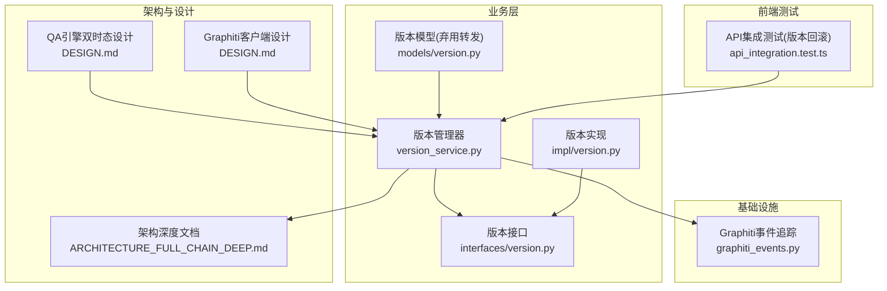
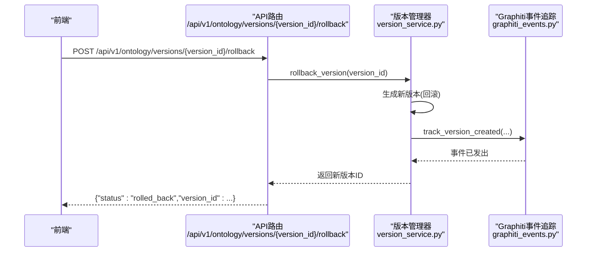
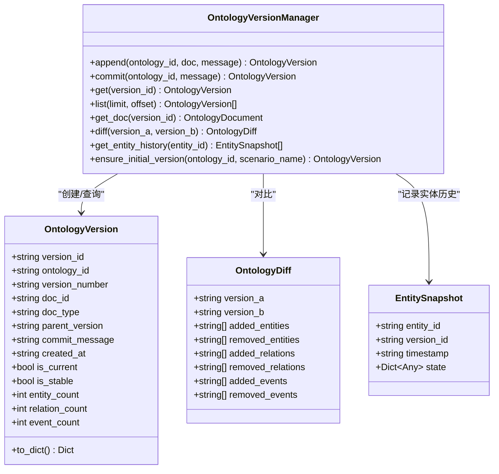
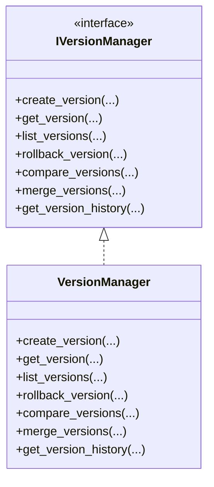
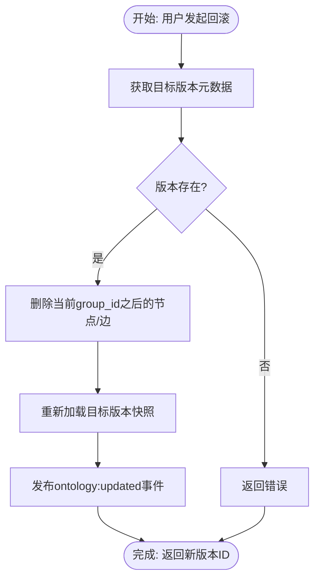
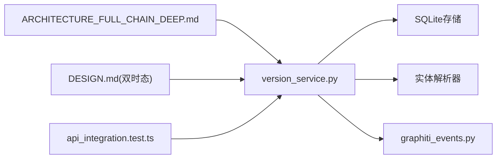

# 版本管理机制

<cite>
**本文引用的文件**
- [odap/biz/core/ontology/services/version_service.py](file://odap/biz/core/ontology/services/version_service.py)
- [odap/biz/core/ontology/models/version.py](file://odap/biz/core/ontology/models/version.py)
- [odap/biz/core/ontology/interfaces/version.py](file://odap/biz/core/ontology/interfaces/version.py)
- [odap/biz/core/ontology/impl/version.py](file://odap/biz/core/ontology/impl/version.py)
- [odap/biz/core/ontology/services/api_version.py](file://odap/biz/core/ontology/services/api_version.py)
- [odap/infra/logging/graphiti_events.py](file://odap/infra/logging/graphiti_events.py)
- [docs/02-architecture/ARCHITECTURE_FULL_CHAIN_DEEP.md](file://docs/02-architecture/ARCHITECTURE_FULL_CHAIN_DEEP.md)
- [docs/03-modules/qa_engine/DESIGN.md](file://docs/03-modules/qa_engine/DESIGN.md)
- [docs/03-modules/graphiti_client/DESIGN.md](file://docs/03-modules/graphiti_client/DESIGN.md)
- [frontend/src/test/api_integration.test.ts](file://frontend/src/test/api_integration.test.ts)
- [odap/biz/platform/ontology_memory/shared_workspace/api/consensus_routes.py](file://odap/biz/platform/ontology_memory/shared_workspace/api/consensus_routes.py)
</cite>

## 目录
1. [引言](#引言)
2. [项目结构](#项目结构)
3. [核心组件](#核心组件)
4. [架构概览](#架构概览)
5. [详细组件分析](#详细组件分析)
6. [依赖分析](#依赖分析)
7. [性能考虑](#性能考虑)
8. [故障排查指南](#故障排查指南)
9. [结论](#结论)
10. [附录](#附录)

## 引言
本文件面向“基于Graphiti双时态能力的版本控制系统”，系统化阐述版本生成、版本对比、版本回滚的设计与实现；解释版本链管理、版本历史查询、版本冲突检测与解决机制；给出版本迁移最佳实践与性能优化策略，并说明版本控制在多智能体协作中的作用与影响。

## 项目结构
围绕版本管理的关键代码分布在业务层（version_service.py）、模型与接口层（models/version.py、interfaces/version.py、impl/version.py），以及API版本控制（services/api_version.py）。同时，架构文档与模块设计文档提供了双时态查询、事件追踪与前端测试用例支撑。

**图表来源**
- [odap/biz/core/ontology/services/version_service.py:84-277](file://odap/biz/core/ontology/services/version_service.py#L84-L277)
- [odap/biz/core/ontology/interfaces/version.py:11-113](file://odap/biz/core/ontology/interfaces/version.py#L11-L113)
- [odap/biz/core/ontology/impl/version.py:13-167](file://odap/biz/core/ontology/impl/version.py#L13-L167)
- [odap/infra/logging/graphiti_events.py:238-281](file://odap/infra/logging/graphiti_events.py#L238-L281)
- [docs/02-architecture/ARCHITECTURE_FULL_CHAIN_DEEP.md:1922-1940](file://docs/02-architecture/ARCHITECTURE_FULL_CHAIN_DEEP.md#L1922-L1940)
- [docs/03-modules/qa_engine/DESIGN.md:551-615](file://docs/03-modules/qa_engine/DESIGN.md#L551-L615)
- [docs/03-modules/graphiti_client/DESIGN.md:14-121](file://docs/03-modules/graphiti_client/DESIGN.md#L14-L121)
- [frontend/src/test/api_integration.test.ts:173-182](file://frontend/src/test/api_integration.test.ts#L173-L182)

**章节来源**
- [odap/biz/core/ontology/services/version_service.py:1-503](file://odap/biz/core/ontology/services/version_service.py#L1-L503)
- [odap/biz/core/ontology/interfaces/version.py:1-113](file://odap/biz/core/ontology/interfaces/version.py#L1-L113)
- [odap/biz/core/ontology/impl/version.py:1-167](file://odap/biz/core/ontology/impl/version.py#L1-L167)
- [odap/biz/core/ontology/models/version.py:1-42](file://odap/biz/core/ontology/models/version.py#L1-L42)
- [odap/biz/core/ontology/services/api_version.py:1-267](file://odap/biz/core/ontology/services/api_version.py#L1-L267)
- [odap/infra/logging/graphiti_events.py:238-281](file://odap/infra/logging/graphiti_events.py#L238-L281)
- [docs/02-architecture/ARCHITECTURE_FULL_CHAIN_DEEP.md:1866-1940](file://docs/02-architecture/ARCHITECTURE_FULL_CHAIN_DEEP.md#L1866-L1940)
- [docs/03-modules/qa_engine/DESIGN.md:551-615](file://docs/03-modules/qa_engine/DESIGN.md#L551-L615)
- [docs/03-modules/graphiti_client/DESIGN.md:14-121](file://docs/03-modules/graphiti_client/DESIGN.md#L14-L121)
- [frontend/src/test/api_integration.test.ts:173-182](file://frontend/src/test/api_integration.test.ts#L173-L182)

## 核心组件
- 版本管理器（OntologyVersionManager）：负责版本生成、追加、提交、差异对比、历史查询与实体历史快照管理。
- 版本接口（IVersionManager）：定义版本管理的标准契约，便于替换实现。
- 版本实现（VersionManager）：基于SQLite存储的轻量实现，提供版本创建、回滚、合并与历史查询。
- 版本模型（VersionStatus/VersionOperation/VersionChange）：提供版本状态、操作类型与变更记录的数据结构。
- API版本控制（APIVersionController）：管理API版本演进与兼容性，提供迁移指南。
- Graphiti事件追踪：在版本创建时发出事件，便于审计与可观测性。

**章节来源**
- [odap/biz/core/ontology/services/version_service.py:84-277](file://odap/biz/core/ontology/services/version_service.py#L84-L277)
- [odap/biz/core/ontology/interfaces/version.py:11-113](file://odap/biz/core/ontology/interfaces/version.py#L11-L113)
- [odap/biz/core/ontology/impl/version.py:13-167](file://odap/biz/core/ontology/impl/version.py#L13-L167)
- [odap/biz/core/ontology/models/version.py:21-42](file://odap/biz/core/ontology/models/version.py#L21-L42)
- [odap/biz/core/ontology/services/api_version.py:53-267](file://odap/biz/core/ontology/services/api_version.py#L53-L267)
- [odap/infra/logging/graphiti_events.py:238-281](file://odap/infra/logging/graphiti_events.py#L238-L281)

## 架构概览
版本管理与Graphiti双时态能力协同工作：Graphiti提供valid_time（有效时间）与transaction_time（事务时间）的时序存储与查询能力，业务层通过版本管理器进行版本生成、对比与回滚；前端通过API路由触发版本操作，后端持久化并发布事件。

**图表来源**
- [docs/02-architecture/ARCHITECTURE_FULL_CHAIN_DEEP.md:1922-1940](file://docs/02-architecture/ARCHITECTURE_FULL_CHAIN_DEEP.md#L1922-L1940)
- [odap/biz/core/ontology/services/version_service.py:206-277](file://odap/biz/core/ontology/services/version_service.py#L206-L277)
- [odap/infra/logging/graphiti_events.py:238-281](file://odap/infra/logging/graphiti_events.py#L238-L281)

**章节来源**
- [docs/02-architecture/ARCHITECTURE_FULL_CHAIN_DEEP.md:1866-1940](file://docs/02-architecture/ARCHITECTURE_FULL_CHAIN_DEEP.md#L1866-L1940)
- [odap/biz/core/ontology/services/version_service.py:206-277](file://odap/biz/core/ontology/services/version_service.py#L206-L277)
- [odap/infra/logging/graphiti_events.py:238-281](file://odap/infra/logging/graphiti_events.py#L238-L281)

## 详细组件分析

### 版本管理器（OntologyVersionManager）
- 两种操作模式
  - append：将新数据追加到当前版本快照，不改变版本ID与版本号，适合热写入。
  - commit：锁定当前版本并创建新版本，版本号按语义规则递增。
- 版本链管理
  - 通过parent_version_id形成单向链表，支持版本历史查询与可视化。
- 差异对比
  - 对比实体、关系与事件集合，输出新增/删除项清单。
- 实体历史快照
  - 记录实体在不同版本的状态快照，便于追溯实体演变。

**图表来源**
- [odap/biz/core/ontology/services/version_service.py:27-71](file://odap/biz/core/ontology/services/version_service.py#L27-L71)
- [odap/biz/core/ontology/services/version_service.py:84-277](file://odap/biz/core/ontology/services/version_service.py#L84-L277)

**章节来源**
- [odap/biz/core/ontology/services/version_service.py:152-277](file://odap/biz/core/ontology/services/version_service.py#L152-L277)

### 版本接口与实现
- IVersionManager：定义创建、获取、列出、回滚、对比、合并、历史查询等标准方法。
- VersionManager（impl）：基于SQLite存储的实现，提供版本创建、回滚、合并与历史查询。

**图表来源**
- [odap/biz/core/ontology/interfaces/version.py:11-113](file://odap/biz/core/ontology/interfaces/version.py#L11-L113)
- [odap/biz/core/ontology/impl/version.py:13-167](file://odap/biz/core/ontology/impl/version.py#L13-L167)

**章节来源**
- [odap/biz/core/ontology/interfaces/version.py:11-113](file://odap/biz/core/ontology/interfaces/version.py#L11-L113)
- [odap/biz/core/ontology/impl/version.py:13-167](file://odap/biz/core/ontology/impl/version.py#L13-L167)

### 双时态查询与版本回滚
- 双时态查询模式
  - 截至某时刻查询（point-in-time）
  - 时间范围查询（range）
  - 实体演变查询（evolution）
  - 当时已知查询（as-known-at）
- 版本回滚
  - 通过API路由触发，删除当前group_id之后的节点与边，重新加载目标版本快照，并发布事件。

**图表来源**
- [docs/02-architecture/ARCHITECTURE_FULL_CHAIN_DEEP.md:1927-1940](file://docs/02-architecture/ARCHITECTURE_FULL_CHAIN_DEEP.md#L1927-L1940)
- [docs/03-modules/qa_engine/DESIGN.md:551-615](file://docs/03-modules/qa_engine/DESIGN.md#L551-L615)

**章节来源**
- [docs/02-architecture/ARCHITECTURE_FULL_CHAIN_DEEP.md:1922-1940](file://docs/02-architecture/ARCHITECTURE_FULL_CHAIN_DEEP.md#L1922-L1940)
- [docs/03-modules/qa_engine/DESIGN.md:551-615](file://docs/03-modules/qa_engine/DESIGN.md#L551-L615)

### 版本对比与差异计算
- 对比维度：实体ID集合、关系ID集合、事件ID集合。
- 输出：新增/删除的实体、关系、事件清单，便于前端渲染与人工审阅。

**章节来源**
- [odap/biz/core/ontology/services/version_service.py:402-425](file://odap/biz/core/ontology/services/version_service.py#L402-L425)

### 版本链管理与历史查询
- 版本链：以parent_version_id指针形成单向链，支持版本历史可视化与演进分析。
- 历史查询：按创建时间倒序列出版本，便于前端展示版本树与统计指标。

**章节来源**
- [odap/biz/core/ontology/services/version_service.py:382-438](file://odap/biz/core/ontology/services/version_service.py#L382-L438)

### 冲突检测与解决机制
- 冲突检测：在多智能体协作或并发写入场景下，通过共识路由接口提供冲突解决策略。
- 解决策略：通过统一的冲突解决策略枚举与路由接口，实现自动或人工干预的冲突消解。

**章节来源**
- [odap/biz/platform/ontology_memory/shared_workspace/api/consensus_routes.py:115-130](file://odap/biz/platform/ontology_memory/shared_workspace/api/consensus_routes.py#L115-L130)

### 版本迁移最佳实践
- API版本控制：通过APIVersionController管理端点版本与兼容性，生成迁移指南，降低升级成本。
- 迁移步骤：遵循“端点路径调整、响应格式适配、进度查询对接”的三步法。
- 兼容性检查：利用兼容性检查结果识别破坏性变更，制定回滚预案。

**章节来源**
- [odap/biz/core/ontology/services/api_version.py:183-231](file://odap/biz/core/ontology/services/api_version.py#L183-L231)

## 依赖分析
- 版本管理器依赖SQLite存储与实体解析器，负责版本持久化与快照合并。
- 双时态查询依赖Graphiti客户端设计文档中的valid_time/transaction_time字段。
- 前端测试验证了版本回滚API的调用路径与响应格式。

**图表来源**
- [odap/biz/core/ontology/services/version_service.py:100-106](file://odap/biz/core/ontology/services/version_service.py#L100-L106)
- [docs/02-architecture/ARCHITECTURE_FULL_CHAIN_DEEP.md:1922-1940](file://docs/02-architecture/ARCHITECTURE_FULL_CHAIN_DEEP.md#L1922-L1940)
- [docs/03-modules/qa_engine/DESIGN.md:551-615](file://docs/03-modules/qa_engine/DESIGN.md#L551-L615)
- [frontend/src/test/api_integration.test.ts:173-182](file://frontend/src/test/api_integration.test.ts#L173-L182)

**章节来源**
- [odap/biz/core/ontology/services/version_service.py:100-106](file://odap/biz/core/ontology/services/version_service.py#L100-L106)
- [docs/02-architecture/ARCHITECTURE_FULL_CHAIN_DEEP.md:1922-1940](file://docs/02-architecture/ARCHITECTURE_FULL_CHAIN_DEEP.md#L1922-L1940)
- [docs/03-modules/qa_engine/DESIGN.md:551-615](file://docs/03-modules/qa_engine/DESIGN.md#L551-L615)
- [frontend/src/test/api_integration.test.ts:173-182](file://frontend/src/test/api_integration.test.ts#L173-L182)

## 性能考虑
- 存储效率
  - 追加模式（append）避免频繁写入，减少事务开销；仅在commit时生成新版本。
  - 实体历史快照按需记录，避免冗余快照膨胀。
- 查询性能
  - 双时态查询通过valid_time与transaction_time过滤，建议在索引层面配合时间列建立索引。
  - 对大图谱的对比与回滚操作建议分批处理，避免一次性加载过多节点/关系。
- 可观测性
  - 版本创建事件通过Graphiti事件追踪记录，便于审计与性能监控。

[本节为通用性能指导，无需特定文件引用]

## 故障排查指南
- 版本回滚失败
  - 检查目标版本是否存在；确认当前group_id清理与新快照加载流程是否执行。
  - 查看事件追踪日志，确认事件是否正确发出。
- 版本对比异常
  - 确认两个版本的文档快照是否完整；检查实体/关系ID集合是否为空。
- 冲突问题
  - 使用共识路由接口查看冲突解决结果；核对策略参数与返回状态。

**章节来源**
- [odap/biz/platform/ontology_memory/shared_workspace/api/consensus_routes.py:115-130](file://odap/biz/platform/ontology_memory/shared_workspace/api/consensus_routes.py#L115-L130)
- [odap/infra/logging/graphiti_events.py:238-281](file://odap/infra/logging/graphiti_events.py#L238-L281)

## 结论
本版本管理机制以Graphiti双时态能力为核心，结合业务层的版本管理器与SQLite存储，实现了版本生成、对比、回滚与历史查询的完整闭环。通过API版本控制与前端测试用例，保证了系统的可演进性与可验证性；在多智能体协作场景中，版本链与冲突解决机制为协同治理提供了坚实基础。

[本节为总结性内容，无需特定文件引用]

## 附录
- 双时态查询模式参考：point-in-time、time-range、evolution、as-known-at。
- Graphiti双时态字段：valid_time、transaction_time。
- 前端版本回滚测试用例：验证API调用与响应格式。

**章节来源**
- [docs/03-modules/qa_engine/DESIGN.md:551-615](file://docs/03-modules/qa_engine/DESIGN.md#L551-L615)
- [docs/03-modules/graphiti_client/DESIGN.md:14-121](file://docs/03-modules/graphiti_client/DESIGN.md#L14-L121)
- [frontend/src/test/api_integration.test.ts:173-182](file://frontend/src/test/api_integration.test.ts#L173-L182)