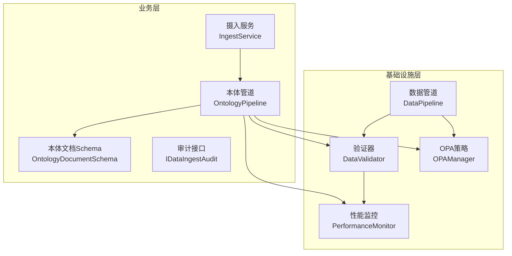
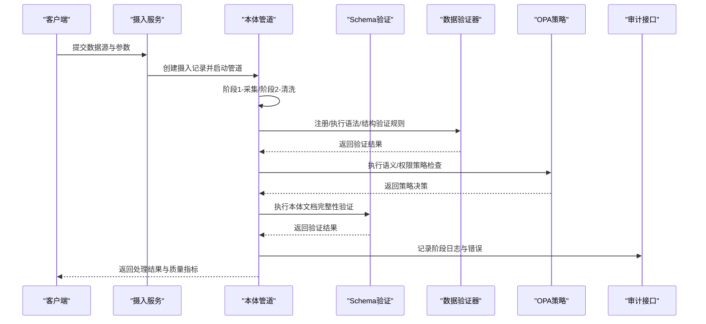
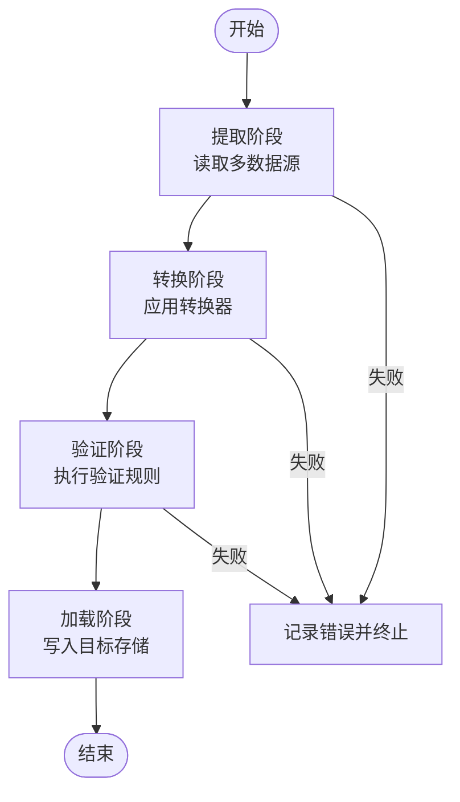
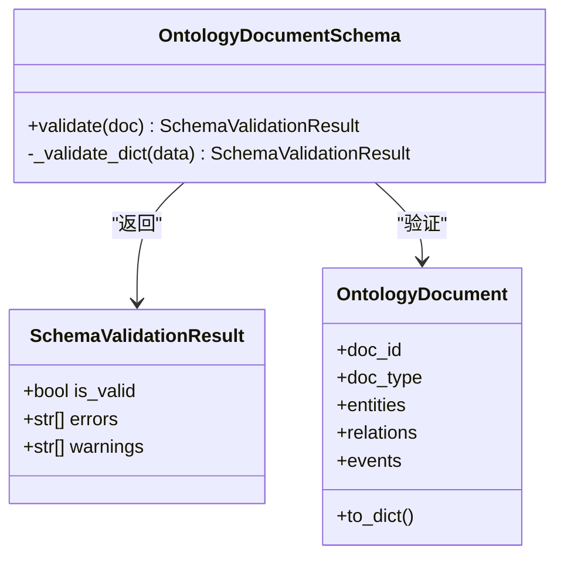
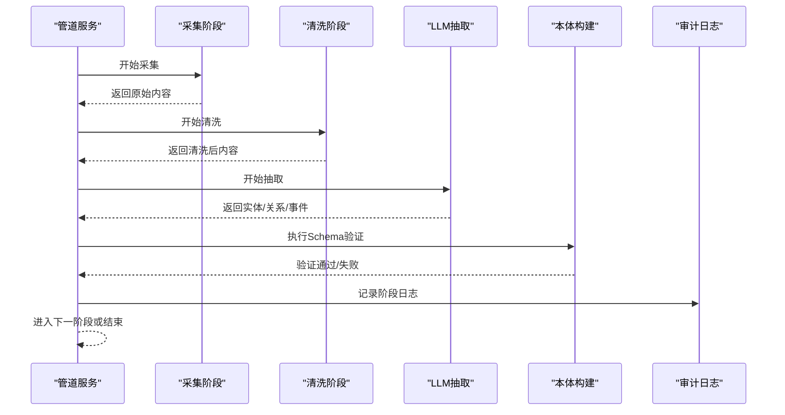
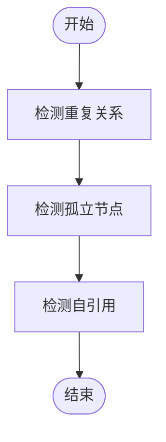
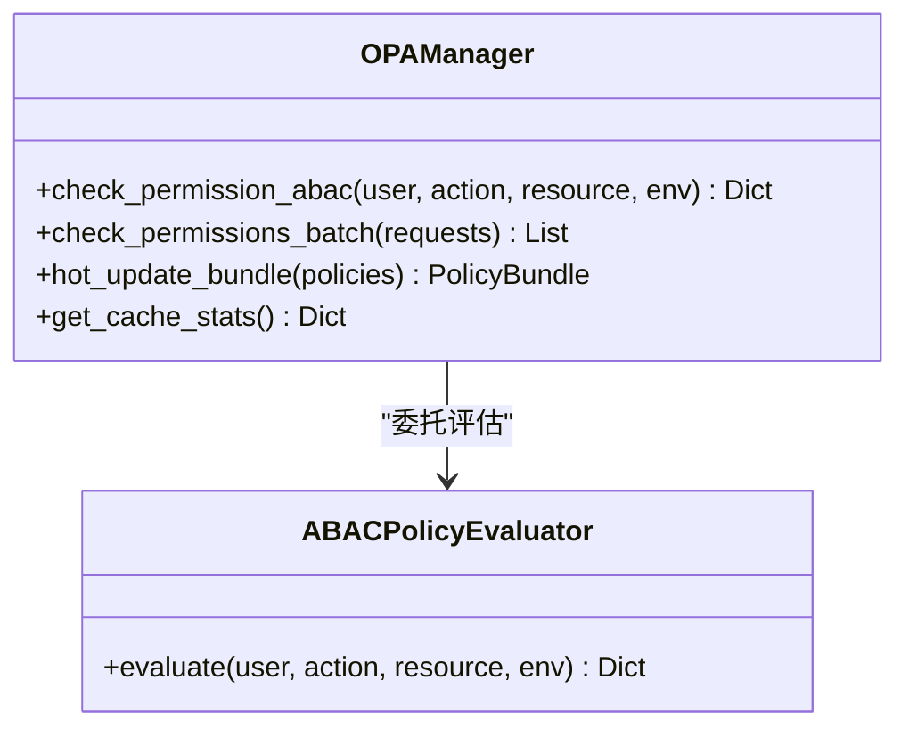
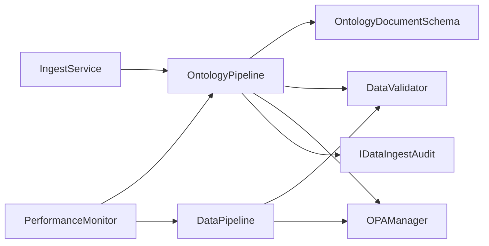

# 验证规则体系

<cite>
**本文档引用的文件**
- [data_pipeline.py](file://odap/infra/data_pipeline.py)
- [pipeline_service.py](file://odap/biz/core/ontology/services/pipeline_service.py)
- [document.py](file://odap/biz/core/ontology/schema/document.py)
- [ingest_service.py](file://odap/biz/core/ontology/services/ingest_service.py)
- [audit.py](file://odap/biz/core/ontology/interfaces/audit.py)
- [retry.py](file://docs/02-architecture/ARCHITECTURE_FULL_CHAIN_DEEP.md)
- [consistency.py](file://docs/02-architecture/ARCHITECTURE_FULL_CHAIN_DEEP.md)
- [DESIGN.md](file://docs/03-modules/opa_policy/DESIGN.md)
- [opa_service.py](file://odap/infra/opa/opa_service.py)
- [performance_monitor.py](file://odap/infra/monitoring/performance_monitor.py)
- [routes.py](file://odap/biz/integration/frontend_compat/api/routes.py)
- [ARCHITECTURE_BIZ.md](file://docs/02-architecture/ARCHITECTURE_BIZ.md)
</cite>

## 目录
1. [引言](#引言)
2. [项目结构](#项目结构)
3. [核心组件](#核心组件)
4. [架构总览](#架构总览)
5. [详细组件分析](#详细组件分析)
6. [依赖关系分析](#依赖关系分析)
7. [性能考虑](#性能考虑)
8. [故障排查指南](#故障排查指南)
9. [结论](#结论)
10. [附录](#附录)

## 引言
本文件面向“本体验证规则体系”，系统化阐述数据验证的多层次架构与执行机制，覆盖语法验证、语义验证、完整性验证与一致性验证；明确规则定义方式、执行顺序与优先级策略；给出业务数据、技术数据、新闻数据等不同数据类型的特定规则与处理策略；建立验证失败的错误处理与用户反馈机制；提供性能优化与批量验证方案，并说明验证规则在数据摄入管道中的集成方式。

## 项目结构
验证规则体系贯穿基础设施层与业务层：
- 基础设施层：统一数据管道与验证器（语法/结构），性能监控与OPA策略执行（语义/权限）。
- 业务层：本体文档Schema验证（完整性），本体构建管道（语义/结构），摄入服务（数据来源与预处理）。

**图表来源**
- [data_pipeline.py:275-426](file://odap/infra/data_pipeline.py#L275-L426)
- [pipeline_service.py:1-200](file://odap/biz/core/ontology/services/pipeline_service.py#L1-L200)
- [document.py:418-493](file://odap/biz/core/ontology/schema/document.py#L418-L493)
- [opa_service.py:455-717](file://odap/infra/opa/opa_service.py#L455-L717)

**章节来源**
- [data_pipeline.py:1-120](file://odap/infra/data_pipeline.py#L1-L120)
- [pipeline_service.py:1-120](file://odap/biz/core/ontology/services/pipeline_service.py#L1-L120)

## 核心组件
- 数据管道与验证器：负责多数据源接入、转换与验证，提供统一的验证规则注册与执行接口。
- 本体文档Schema验证：对本体文档进行结构与语义完整性校验。
- 本体构建管道：串联采集、清洗、LLM抽取、本体构建、版本管理、图谱生成等阶段，并内置质量控制与审计。
- OPA策略执行：提供ABAC策略评估、批量权限检查与缓存，支撑语义与权限层面的验证。
- 性能监控：对关键路径进行采样统计，辅助性能优化与容量规划。
- 审计与反馈：记录摄入与处理过程，支持错误追踪与用户反馈。

**章节来源**
- [data_pipeline.py:253-426](file://odap/infra/data_pipeline.py#L253-L426)
- [document.py:418-493](file://odap/biz/core/ontology/schema/document.py#L418-L493)
- [pipeline_service.py:190-340](file://odap/biz/core/ontology/services/pipeline_service.py#L190-L340)
- [opa_service.py:455-717](file://odap/infra/opa/opa_service.py#L455-L717)
- [performance_monitor.py:12-184](file://odap/infra/monitoring/performance_monitor.py#L12-L184)

## 架构总览
验证规则体系在数据摄入全链路中分层实施：

**图表来源**
- [ingest_service.py:330-520](file://odap/biz/core/ontology/services/ingest_service.py#L330-L520)
- [pipeline_service.py:215-340](file://odap/biz/core/ontology/services/pipeline_service.py#L215-L340)
- [document.py:418-493](file://odap/biz/core/ontology/schema/document.py#L418-L493)
- [data_pipeline.py:253-426](file://odap/infra/data_pipeline.py#L253-L426)
- [audit.py:8-45](file://odap/biz/core/ontology/interfaces/audit.py#L8-L45)

## 详细组件分析

### 数据管道与验证器（语法/结构验证）
- 统一数据模型：DataRecord承载内容、元数据与格式信息。
- 阶段化流水线：EXTRACT → TRANSFORM → VALIDATE → LOAD，每个阶段独立统计与错误记录。
- 验证器接口：规则以函数形式注册，返回None表示通过，否则返回错误信息；支持批量记录验证。
- 执行顺序：先提取，再转换，然后验证，最后加载；任一阶段失败即终止后续阶段并记录错误。

**图表来源**
- [data_pipeline.py:275-426](file://odap/infra/data_pipeline.py#L275-L426)

**章节来源**
- [data_pipeline.py:50-120](file://odap/infra/data_pipeline.py#L50-L120)
- [data_pipeline.py:253-426](file://odap/infra/data_pipeline.py#L253-L426)

### 本体文档Schema验证（完整性验证）
- 验证范围：文档ID、类型、元信息、实体ID唯一性、实体/关系/事件字段完整性与一致性。
- 结果结构：返回验证是否通过、错误列表与警告列表，便于分级处理。
- 与管道集成：在本体构建阶段前执行，失败抛出自定义异常并阻断后续流程。

**图表来源**
- [document.py:418-493](file://odap/biz/core/ontology/schema/document.py#L418-L493)

**章节来源**
- [document.py:418-493](file://odap/biz/core/ontology/schema/document.py#L418-L493)

### 本体构建管道（语义验证与质量控制）
- 阶段划分：采集、清洗、LLM抽取、本体构建、版本管理、图谱生成。
- 清洗规则：去特殊字符、标准化空白、重复检测、缺失值检测。
- 审计与日志：每个阶段记录开始/结束时间、耗时、状态与错误，支持查询与回溯。
- 与Schema验证联动：在构建阶段前执行完整性验证，失败即终止并记录错误。

**图表来源**
- [pipeline_service.py:215-340](file://odap/biz/core/ontology/services/pipeline_service.py#L215-L340)
- [pipeline_service.py:345-447](file://odap/biz/core/ontology/services/pipeline_service.py#L345-L447)
- [pipeline_service.py:449-684](file://odap/biz/core/ontology/services/pipeline_service.py#L449-L684)
- [document.py:418-493](file://odap/biz/core/ontology/schema/document.py#L418-L493)

**章节来源**
- [pipeline_service.py:215-340](file://odap/biz/core/ontology/services/pipeline_service.py#L215-L340)
- [pipeline_service.py:345-447](file://odap/biz/core/ontology/services/pipeline_service.py#L345-L447)
- [pipeline_service.py:449-684](file://odap/biz/core/ontology/services/pipeline_service.py#L449-L684)

### 一致性检查（一致性验证）
- 检测维度：重复关系、孤立节点、自引用。
- 输出：结构化问题列表，包含类型、ID与消息，便于修复与告警。

**图表来源**
- [consistency.py:1460-1515](file://docs/02-architecture/ARCHITECTURE_FULL_CHAIN_DEEP.md#L1460-L1515)

**章节来源**
- [consistency.py:1460-1515](file://docs/02-architecture/ARCHITECTURE_FULL_CHAIN_DEEP.md#L1460-L1515)

### OPA策略执行（语义/权限验证）
- 支持ABAC策略评估、策略Bundle热更新、策略沙箱模拟。
- 批量权限检查与缓存，提升吞吐与稳定性。
- 与管道集成：在敏感操作或策略驱动环节调用，返回允许/拒绝及原因。

**图表来源**
- [opa_service.py:455-717](file://odap/infra/opa/opa_service.py#L455-L717)

**章节来源**
- [opa_service.py:455-717](file://odap/infra/opa/opa_service.py#L455-L717)
- [DESIGN.md:538-586](file://docs/03-modules/opa_policy/DESIGN.md#L538-L586)

### 性能监控与优化
- 指标采集：对LLM调用、数据库查询、API请求、工具执行等进行采样。
- 统计输出：均值、中位数、分位数等，支持导出与可视化。
- 装饰器用法：对关键函数进行自动监控埋点。

**章节来源**
- [performance_monitor.py:12-184](file://odap/infra/monitoring/performance_monitor.py#L12-L184)

### 错误处理与用户反馈
- 错误分类：解析错误、抽取错误、超时错误等，支持指数退避重试。
- 审计记录：统一记录摄入任务状态、错误与质量指标，便于回溯。
- 前端反馈：通过兼容API记录动作反馈，支持用户侧可观测性。

**章节来源**
- [retry.py:932-983](file://docs/02-architecture/ARCHITECTURE_FULL_CHAIN_DEEP.md#L932-L983)
- [audit.py:8-45](file://odap/biz/core/ontology/interfaces/audit.py#L8-L45)
- [routes.py:1575-1610](file://odap/biz/integration/frontend_compat/api/routes.py#L1575-L1610)

## 依赖关系分析

**图表来源**
- [data_pipeline.py:275-426](file://odap/infra/data_pipeline.py#L275-L426)
- [pipeline_service.py:1-120](file://odap/biz/core/ontology/services/pipeline_service.py#L1-L120)
- [document.py:418-493](file://odap/biz/core/ontology/schema/document.py#L418-L493)
- [opa_service.py:455-717](file://odap/infra/opa/opa_service.py#L455-L717)
- [audit.py:8-45](file://odap/biz/core/ontology/interfaces/audit.py#L8-L45)
- [performance_monitor.py:12-184](file://odap/infra/monitoring/performance_monitor.py#L12-L184)

**章节来源**
- [data_pipeline.py:275-426](file://odap/infra/data_pipeline.py#L275-L426)
- [pipeline_service.py:1-120](file://odap/biz/core/ontology/services/pipeline_service.py#L1-L120)
- [document.py:418-493](file://odap/biz/core/ontology/schema/document.py#L418-L493)
- [opa_service.py:455-717](file://odap/infra/opa/opa_service.py#L455-L717)
- [audit.py:8-45](file://odap/biz/core/ontology/interfaces/audit.py#L8-L45)
- [performance_monitor.py:12-184](file://odap/infra/monitoring/performance_monitor.py#L12-L184)

## 性能考虑
- 批量验证与并发：数据管道支持规则级批量验证；OPA提供批量权限检查与缓存，降低延迟与抖动。
- 监控与采样：通过性能监控器对关键路径进行采样统计，识别瓶颈并指导优化。
- 重试与退避：针对可重试异常（如LLM超时）采用指数退避，避免雪崩效应。
- 优化建议：
  - 将昂贵规则拆分为短路优先级，先执行低成本规则。
  - 对重复/孤立/自引用等批处理一致性检查采用并行化。
  - 利用OPA缓存与策略Bundle热更新，减少策略下发开销。

**章节来源**
- [DESIGN.md:538-586](file://docs/03-modules/opa_policy/DESIGN.md#L538-L586)
- [performance_monitor.py:12-184](file://odap/infra/monitoring/performance_monitor.py#L12-L184)
- [retry.py:932-983](file://docs/02-architecture/ARCHITECTURE_FULL_CHAIN_DEEP.md#L932-L983)

## 故障排查指南
- 验证失败定位
  - 查看阶段结果与错误列表：数据管道与本体管道均记录阶段状态与错误详情。
  - 本体Schema验证：根据错误/警告列表逐项修正字段与关系。
- 策略执行异常
  - 检查OPA服务连通性与策略加载状态；必要时回滚策略Bundle。
  - 使用策略沙箱模拟，快速验证策略变更影响。
- 审计与回溯
  - 通过审计接口查询摄入任务状态、错误与质量指标，结合时间戳定位问题。
- 用户反馈
  - 通过前端兼容API记录动作反馈，形成闭环改进。

**章节来源**
- [data_pipeline.py:300-426](file://odap/infra/data_pipeline.py#L300-L426)
- [document.py:418-493](file://odap/biz/core/ontology/schema/document.py#L418-L493)
- [opa_service.py:455-717](file://odap/infra/opa/opa_service.py#L455-L717)
- [audit.py:8-45](file://odap/biz/core/ontology/interfaces/audit.py#L8-L45)
- [routes.py:1575-1610](file://odap/biz/integration/frontend_compat/api/routes.py#L1575-L1610)

## 结论
本验证规则体系通过“语法/结构”“语义/权限”“完整性/一致性”的分层设计，结合数据管道、本体Schema验证与OPA策略执行，在保证数据质量的同时兼顾性能与可观测性。通过明确的执行顺序、优先级策略与错误处理机制，能够有效支撑业务数据、技术数据与新闻数据等多类型数据的高质量摄入与治理。

## 附录
- 不同数据类型的处理策略
  - 业务数据：强调Schema完整性与关系一致性，结合OPA策略进行权限校验。
  - 技术数据：侧重语法正确性与结构规范化，配合性能监控识别异常。
  - 新闻数据：在采集与抽取阶段加强清洗与去噪，利用一致性检查剔除冗余与孤立信息。
- 集成要点
  - 在摄入服务中统一入口，按数据类型选择适配器与验证规则。
  - 在本体管道中嵌入Schema验证与一致性检查，确保输出质量。
  - 通过审计接口与前端反馈形成闭环，持续改进规则与策略。

**章节来源**
- [ARCHITECTURE_BIZ.md:440-484](file://docs/02-architecture/ARCHITECTURE_BIZ.md#L440-L484)