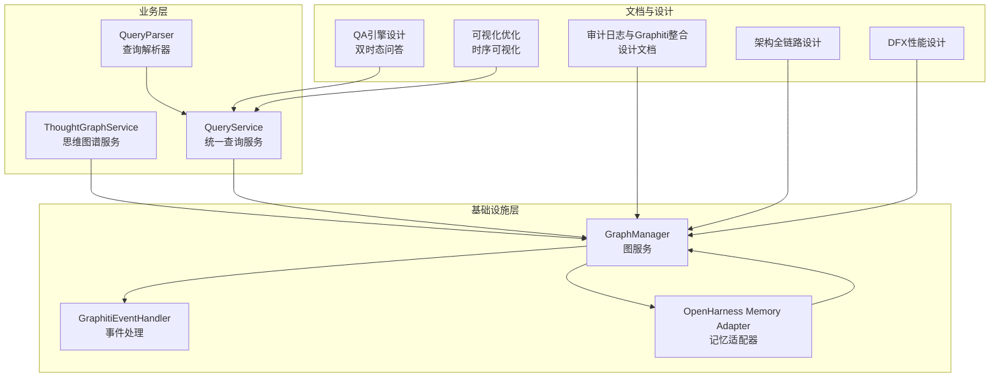
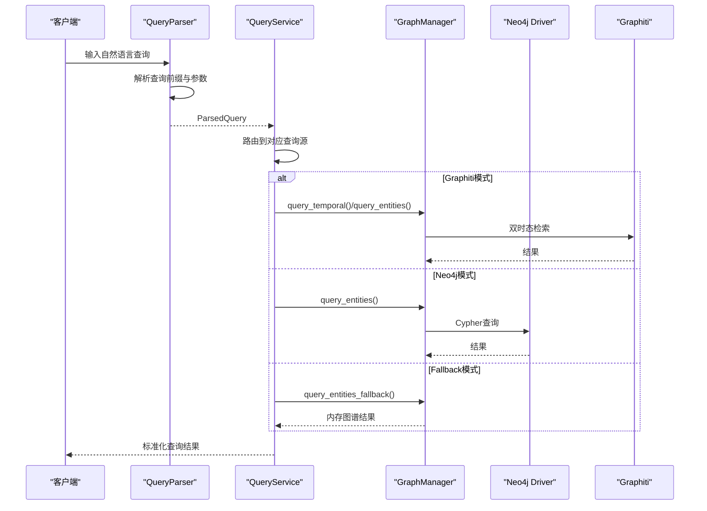
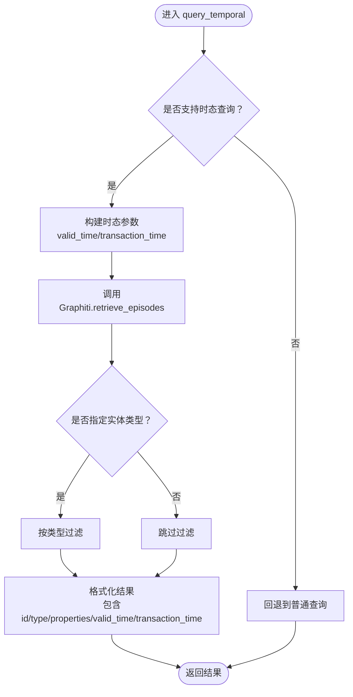
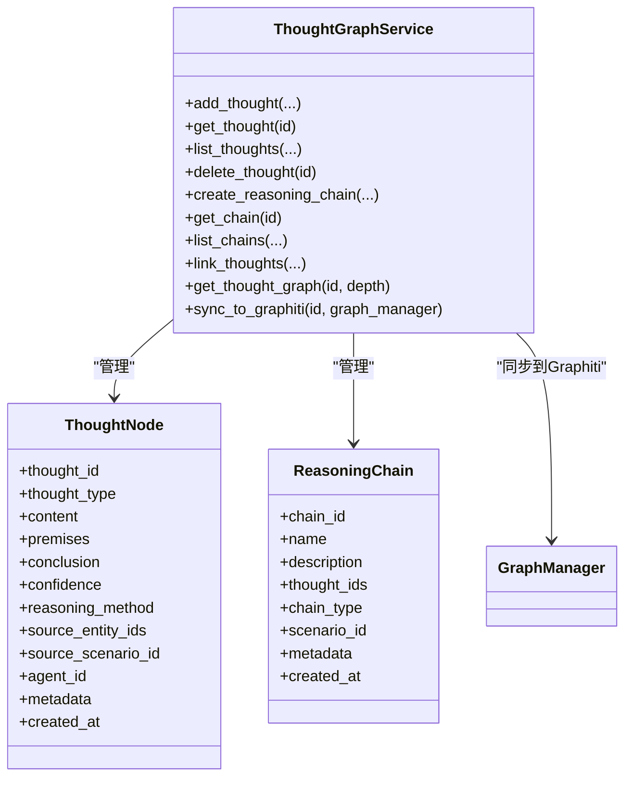
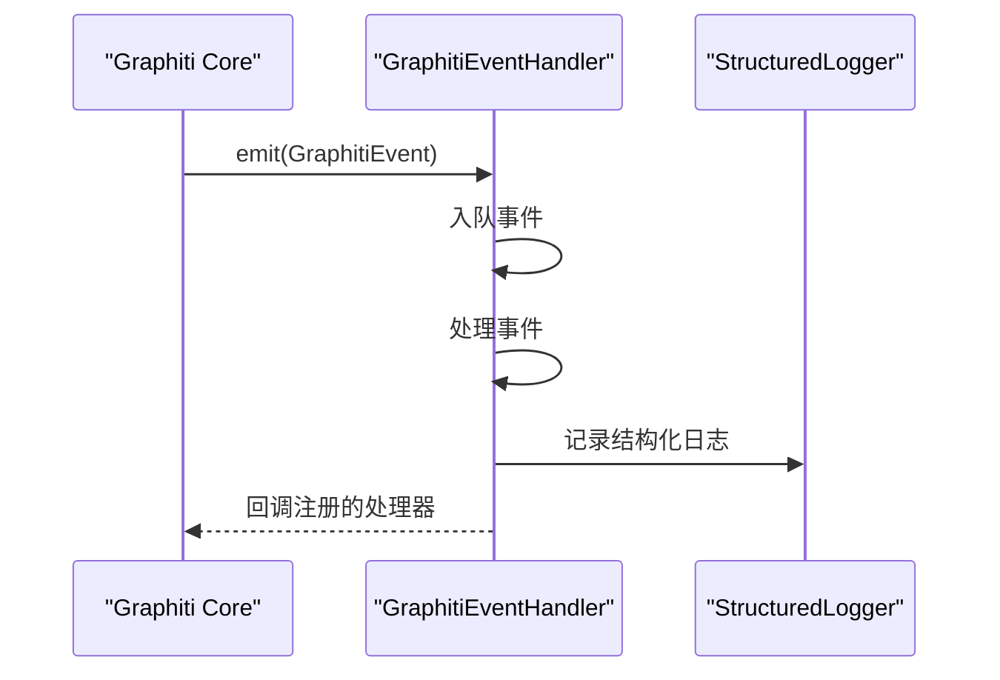
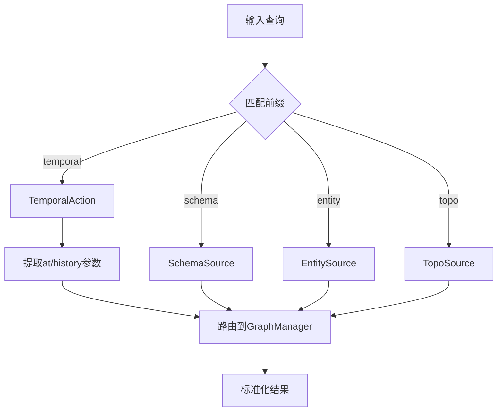
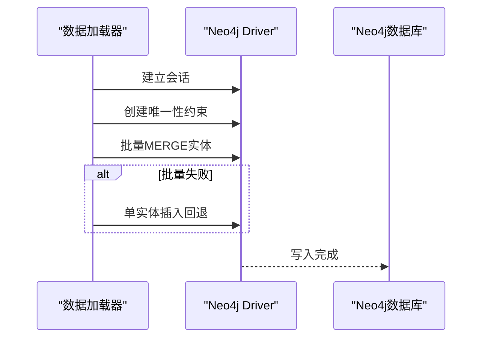
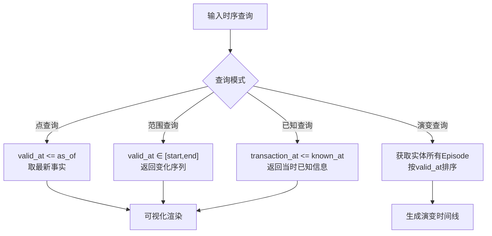
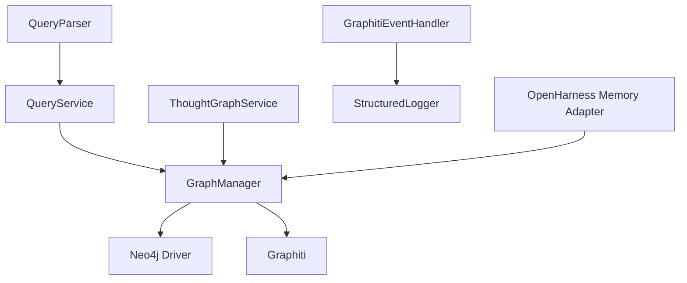

# Graphiti双时态知识图谱

<cite>
**本文档引用的文件**
- [graph_service.py](file://odap/infra/graph/graph_service.py)
- [thought_graph_service.py](file://odap/biz/core/cognition/thought_graph/services/thought_graph_service.py)
- [graphiti_events.py](file://odap/infra/logging/graphiti_events.py)
- [GRAPHITI_INTEGRATION.md](file://docs/03-modules/audit_log/GRAPHITI_INTEGRATION.md)
- [DESIGN.md](file://docs/03-modules/qa_engine/DESIGN.md)
- [DESIGN_GRAPH_OPTIMIZATION.md](file://docs/03-modules/visualization/DESIGN_GRAPH_OPTIMIZATION.md)
- [routes.py](file://odap/infra/query/routes.py)
- [service.py](file://odap/infra/query/service.py)
- [parser.py](file://odap/infra/query/parser.py)
- [protocols.py](file://odap/infra/query/protocols.py)
- [ARCHITECTURE_FULL_CHAIN_DEEP.md](file://docs/02-architecture/ARCHITECTURE_FULL_CHAIN_DEEP.md)
- [DFX_DESIGN.md](file://docs/06-dfx/DFX_DESIGN.md)
- [memory_adapter.py](file://odap/infra/openharness/memory_adapter.py)
</cite>

## 目录
1. [简介](#简介)
2. [项目结构](#项目结构)
3. [核心组件](#核心组件)
4. [架构总览](#架构总览)
5. [详细组件分析](#详细组件分析)
6. [依赖关系分析](#依赖关系分析)
7. [性能考量](#性能考量)
8. [故障排查指南](#故障排查指南)
9. [结论](#结论)
10. [附录](#附录)

## 简介
本文件面向Graphiti双时态知识图谱的技术文档，系统阐述其在时序推理、思维图谱、图数据库查询优化、与Neo4j集成与数据同步、以及性能调优方面的实现与最佳实践。文档重点覆盖以下主题：
- 双时态数据建模：valid_time（有效时间）与transaction_time（事务时间）的定义与应用
- 图服务架构：三层降级策略（Graphiti → Neo4j Driver → NetworkX fallback）
- 思维图谱：基于Graphiti的思考节点与推理链管理
- 图数据库查询优化：索引、连接池、缓存与批量操作
- 与Neo4j集成：Cypher查询、数据同步与迁移
- 时序数据分析：时态查询模式、可视化与案例
- 图模式设计、索引策略与大规模数据处理

## 项目结构
项目采用模块化分层架构，核心围绕图服务、查询解析、思维图谱、审计日志与可视化展开。与Graphiti相关的模块主要分布在以下路径：
- odap/infra/graph：图服务与事件集成
- odap/biz/core/cognition/thought_graph：思维图谱服务
- odap/infra/query：统一查询服务与解析器
- docs/03-modules：模块设计文档（含审计日志、可视化、QA引擎等）

**图表来源**
- [graph_service.py](file://odap/infra/graph/graph_service.py)
- [thought_graph_service.py](file://odap/biz/core/cognition/thought_graph/services/thought_graph_service.py)
- [graphiti_events.py](file://odap/infra/logging/graphiti_events.py)
- [routes.py](file://odap/infra/query/routes.py)
- [service.py](file://odap/infra/query/service.py)
- [parser.py](file://odap/infra/query/parser.py)
- [GRAPHITI_INTEGRATION.md](file://docs/03-modules/audit_log/GRAPHITI_INTEGRATION.md)
- [DESIGN.md](file://docs/03-modules/qa_engine/DESIGN.md)
- [DESIGN_GRAPH_OPTIMIZATION.md](file://docs/03-modules/visualization/DESIGN_GRAPH_OPTIMIZATION.md)
- [ARCHITECTURE_FULL_CHAIN_DEEP.md](file://docs/02-architecture/ARCHITECTURE_FULL_CHAIN_DEEP.md)
- [DFX_DESIGN.md](file://docs/06-dfx/DFX_DESIGN.md)

**章节来源**
- [graph_service.py](file://odap/infra/graph/graph_service.py)
- [routes.py](file://odap/infra/query/routes.py)
- [service.py](file://odap/infra/query/service.py)
- [parser.py](file://odap/infra/query/parser.py)

## 核心组件
本节聚焦Graphiti双时态知识图谱的核心组件与其职责：
- GraphManager：三层降级连接（Graphiti → Neo4j Driver → NetworkX fallback），负责图谱初始化、实体查询、更新与时态查询
- ThoughtGraphService：思维图谱服务，管理思考节点与推理链，并可同步至Graphiti
- GraphitiEventHandler：事件处理与实体追踪，将Graphiti核心事件接入结构化日志系统
- QueryService/QueryParser：统一查询服务与解析器，支持schema/entity/topo/temporal四种查询源
- Audit Log与可视化：审计日志以Graphiti本体存储，可视化支持时序滑块与LOD渲染

**章节来源**
- [graph_service.py](file://odap/infra/graph/graph_service.py)
- [thought_graph_service.py](file://odap/biz/core/cognition/thought_graph/services/thought_graph_service.py)
- [graphiti_events.py](file://odap/infra/logging/graphiti_events.py)
- [service.py](file://odap/infra/query/service.py)
- [parser.py](file://odap/infra/query/parser.py)

## 架构总览
Graphiti双时态知识图谱的架构围绕“三层降级”与“统一查询”两大支柱：
- 三层降级：优先使用Graphiti（双时态知识图谱），其次Neo4j Driver直连，最后NetworkX回退
- 统一查询：通过QueryService抽象多种查询源（schema/entity/topo/temporal），解析器将自然语言查询映射为具体动作与参数
- 事件驱动：Graphiti事件通过EventHandler接入结构化日志，支持实体生命周期追踪
- 与Neo4j集成：通过Cypher直接操作与索引约束，实现高效查询与数据迁移

**图表来源**
- [parser.py](file://odap/infra/query/parser.py)
- [service.py](file://odap/infra/query/service.py)
- [graph_service.py](file://odap/infra/graph/graph_service.py)

**章节来源**
- [graph_service.py](file://odap/infra/graph/graph_service.py)
- [service.py](file://odap/infra/query/service.py)
- [parser.py](file://odap/infra/query/parser.py)

## 详细组件分析

### 图服务（GraphManager）与双时态查询
- 三层降级策略：优先尝试Graphiti（双时态知识图谱），若不可用则降级到Neo4j Driver直连，最后回退到NetworkX内存图谱
- 双时态查询接口：query_temporal支持valid_time与transaction_time参数，返回符合时态条件的实体列表
- 实体查询与更新：query_entities/_query_entities_neo4j/_query_entities_fallback支持多租户过滤与区域过滤
- 连接池与断路器：实现连接池管理、空闲清理、失败计数与恢复逻辑
- 性能监控：记录查询耗时、缓存命中率与连接池状态

**图表来源**
- [graph_service.py](file://odap/infra/graph/graph_service.py)

**章节来源**
- [graph_service.py](file://odap/infra/graph/graph_service.py)

### 思维图谱（ThoughtGraphService）与Graphiti同步
- 思考节点与推理链管理：支持添加、查询、删除、链接思考节点，构建推理链
- 同步至Graphiti：将思考节点以实体形式写入Graphiti，便于统一检索与分析
- 存储抽象：通过ThoughtGraphStorage实现持久化，支持扩展

**图表来源**
- [thought_graph_service.py](file://odap/biz/core/cognition/thought_graph/services/thought_graph_service.py)

**章节来源**
- [thought_graph_service.py](file://odap/biz/core/cognition/thought_graph/services/thought_graph_service.py)

### 事件处理与审计日志（GraphitiEventHandler）
- 事件类型：实体创建/更新/删除、关系创建/更新/删除、快照创建、版本创建、查询执行等
- 事件处理：异步队列处理，结构化日志输出，支持注册多个处理器
- 实体追踪：跟踪实体生命周期事件，记录到时序数据库

**图表来源**
- [graphiti_events.py](file://odap/infra/logging/graphiti_events.py)

**章节来源**
- [graphiti_events.py](file://odap/infra/logging/graphiti_events.py)

### 统一查询服务与解析器
- 查询源：schema、entity、topo、temporal四类
- 解析器：将自然语言查询解析为ParsedQuery，提取filters、action与action_params
- 查询服务：根据查询源路由到对应实现，支持历史查询与时间点查询

**图表来源**
- [parser.py](file://odap/infra/query/parser.py)
- [service.py](file://odap/infra/query/service.py)
- [protocols.py](file://odap/infra/query/protocols.py)

**章节来源**
- [parser.py](file://odap/infra/query/parser.py)
- [service.py](file://odap/infra/query/service.py)
- [protocols.py](file://odap/infra/query/protocols.py)

### 与Neo4j集成与数据同步
- 直连模式：通过Neo4j Driver执行Cypher，支持批量加载、唯一性约束与索引
- 数据迁移：将模拟数据批量写入Neo4j，支持回退到单实体插入
- 审计日志：以Graphiti本体存储，统一查询接口，支持过滤与分页

**图表来源**
- [graph_service.py](file://odap/infra/graph/graph_service.py)
- [GRAPHITI_INTEGRATION.md](file://docs/03-modules/audit_log/GRAPHITI_INTEGRATION.md)

**章节来源**
- [graph_service.py](file://odap/infra/graph/graph_service.py)
- [GRAPHITI_INTEGRATION.md](file://docs/03-modules/audit_log/GRAPHITI_INTEGRATION.md)

### 时序数据分析与可视化
- 时序查询模式：支持“截至某时间点”、“时间范围内变化”、“实体演变历程”、“根据某时信息回答”
- 时序可视化：前端滑块按valid_time过滤节点与边，支持WebGL与LOD渲染优化
- 时序窗口查询：OpenHarness Memory Adapter支持按时间窗口查询Graphiti记忆

**图表来源**
- [DESIGN.md](file://docs/03-modules/qa_engine/DESIGN.md)
- [DESIGN_GRAPH_OPTIMIZATION.md](file://docs/03-modules/visualization/DESIGN_GRAPH_OPTIMIZATION.md)
- [memory_adapter.py](file://odap/infra/openharness/memory_adapter.py)

**章节来源**
- [DESIGN.md](file://docs/03-modules/qa_engine/DESIGN.md)
- [DESIGN_GRAPH_OPTIMIZATION.md](file://docs/03-modules/visualization/DESIGN_GRAPH_OPTIMIZATION.md)
- [memory_adapter.py](file://odap/infra/openharness/memory_adapter.py)

## 依赖关系分析
- 组件耦合：GraphManager与Neo4j Driver、Graphiti紧密耦合；QueryService通过协议接口解耦不同查询源
- 外部依赖：Neo4j Driver、graphiti-core、NetworkX、结构化日志系统
- 潜在风险：断路器与连接池超时、批量写入失败回退、事件处理队列阻塞

**图表来源**
- [graph_service.py](file://odap/infra/graph/graph_service.py)
- [service.py](file://odap/infra/query/service.py)
- [parser.py](file://odap/infra/query/parser.py)
- [thought_graph_service.py](file://odap/biz/core/cognition/thought_graph/services/thought_graph_service.py)
- [graphiti_events.py](file://odap/infra/logging/graphiti_events.py)
- [memory_adapter.py](file://odap/infra/openharness/memory_adapter.py)

**章节来源**
- [graph_service.py](file://odap/infra/graph/graph_service.py)
- [service.py](file://odap/infra/query/service.py)
- [parser.py](file://odap/infra/query/parser.py)
- [thought_graph_service.py](file://odap/biz/core/cognition/thought_graph/services/thought_graph_service.py)
- [graphiti_events.py](file://odap/infra/logging/graphiti_events.py)
- [memory_adapter.py](file://odap/infra/openharness/memory_adapter.py)

## 性能考量
- 连接池与断路器：限制最大连接数、空闲超时与失败阈值，避免雪崩效应
- 批量操作：Neo4j批量MERGE与回退单实体插入，减少网络往返
- 索引与约束：为实体类型、ID与时间字段建立索引，提升查询性能
- 缓存与预热：Graphiti三级缓存（内存→Redis→磁盘）、连接池预热
- 查询优化：针对复杂查询采用并行化RAG检索、流式输出与自适应策略

**章节来源**
- [graph_service.py](file://odap/infra/graph/graph_service.py)
- [ARCHITECTURE_FULL_CHAIN_DEEP.md](file://docs/02-architecture/ARCHITECTURE_FULL_CHAIN_DEEP.md)
- [DFX_DESIGN.md](file://docs/06-dfx/DFX_DESIGN.md)

## 故障排查指南
- 连接失败：检查Neo4j Driver连接、认证信息与网络可达性；观察断路器状态与失败计数
- 查询超时：查看连接池大小与超时设置，确认是否存在长时间事务；启用批量查询与缓存
- 事件处理积压：检查事件队列容量与处理任务状态，必要时增加队列容量或处理线程
- 审计日志异常：确认Graphiti连接状态、实体创建与关系建立是否成功，检查Cypher查询语法

**章节来源**
- [graph_service.py](file://odap/infra/graph/graph_service.py)
- [graphiti_events.py](file://odap/infra/logging/graphiti_events.py)
- [GRAPHITI_INTEGRATION.md](file://docs/03-modules/audit_log/GRAPHITI_INTEGRATION.md)

## 结论
Graphiti双时态知识图谱通过三层降级策略与统一查询服务，实现了在复杂场景下的高可用与高性能。结合Neo4j的Cypher查询与索引优化、事件驱动的日志体系、以及思维图谱与可视化优化，项目形成了完整的时序推理与知识管理能力。建议在生产环境中持续优化连接池与缓存策略，完善索引与查询计划分析，并加强事件处理与审计日志的可观测性。

## 附录
- 图模式设计要点：实体类型标签、唯一性约束、关系类型与方向、时间戳字段命名规范
- 索引策略：节点类型与ID索引、复合索引（边source/target）、时间字段索引
- 大规模数据处理：批量写入、分片加载、增量同步、定期压缩与归档
- Cypher查询示例：实体查询、关系遍历、时间范围过滤、历史版本检索（参见审计日志与统一查询服务中的Cypher片段）

**章节来源**
- [GRAPHITI_INTEGRATION.md](file://docs/03-modules/audit_log/GRAPHITI_INTEGRATION.md)
- [routes.py](file://odap/infra/query/routes.py)
- [service.py](file://odap/infra/query/service.py)
- [parser.py](file://odap/infra/query/parser.py)