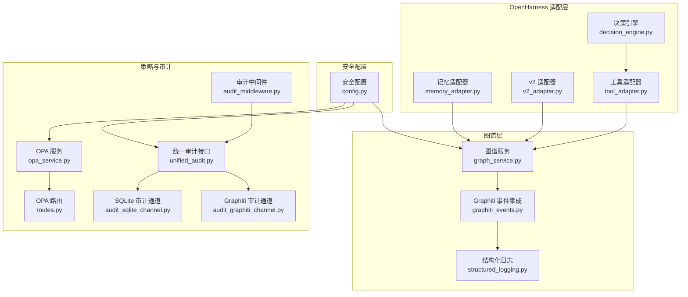
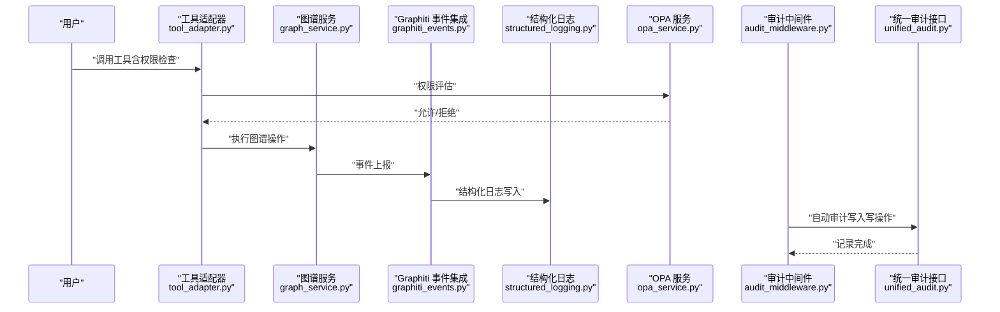
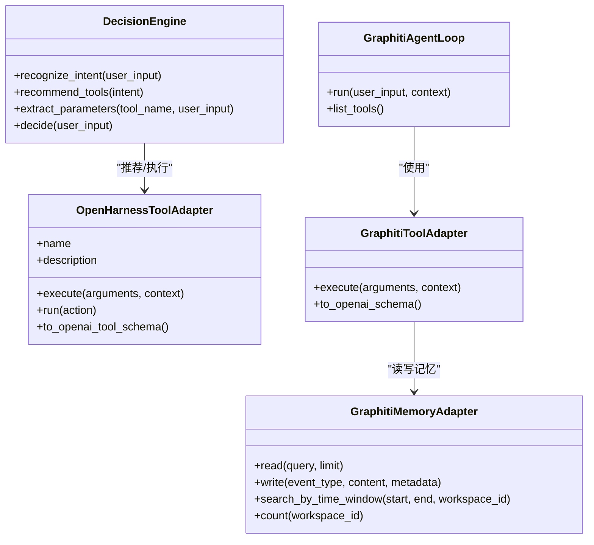
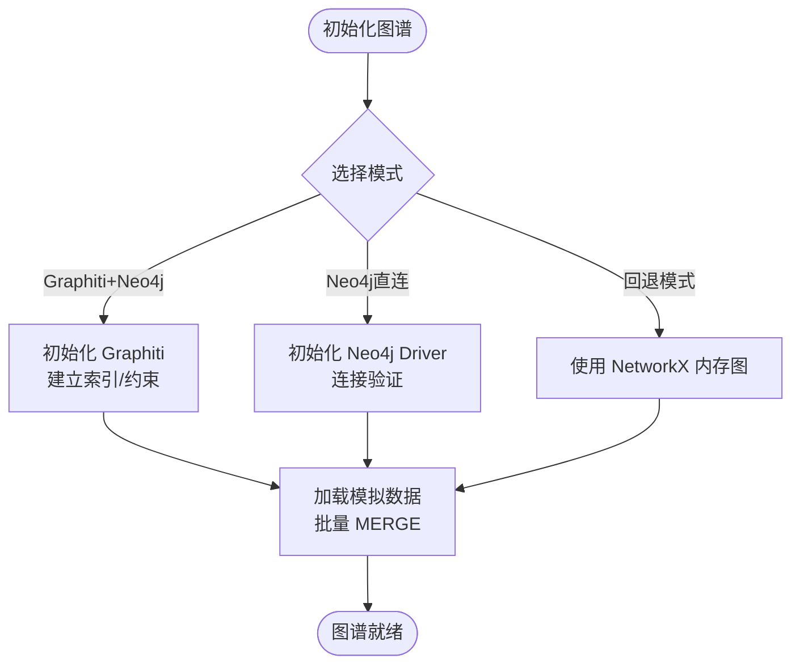
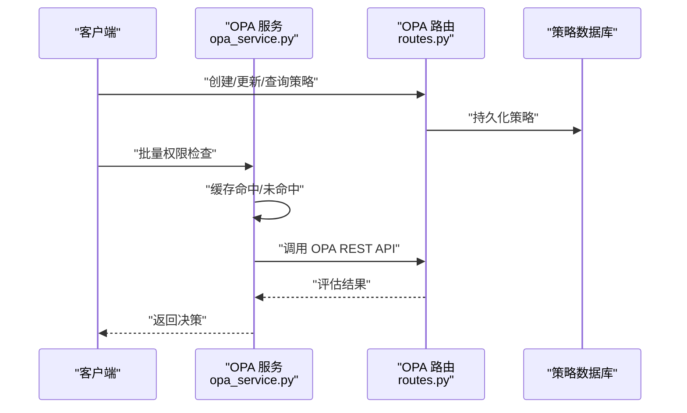
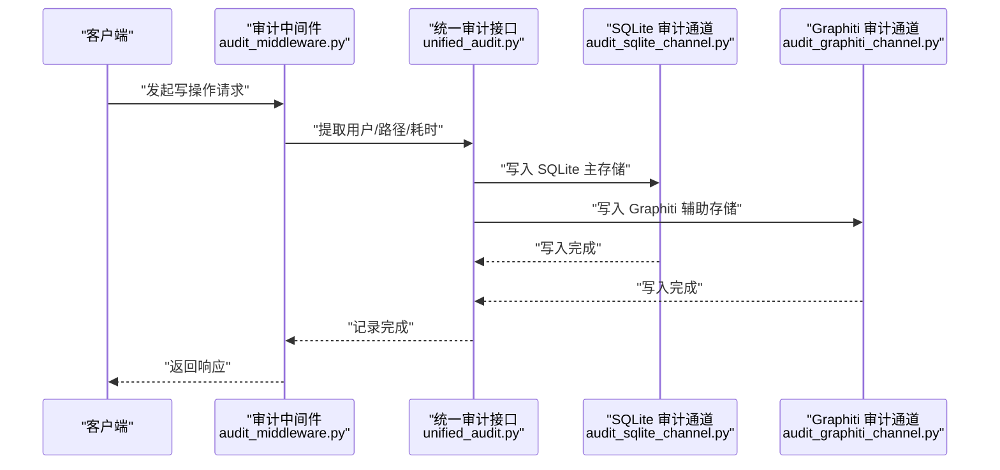
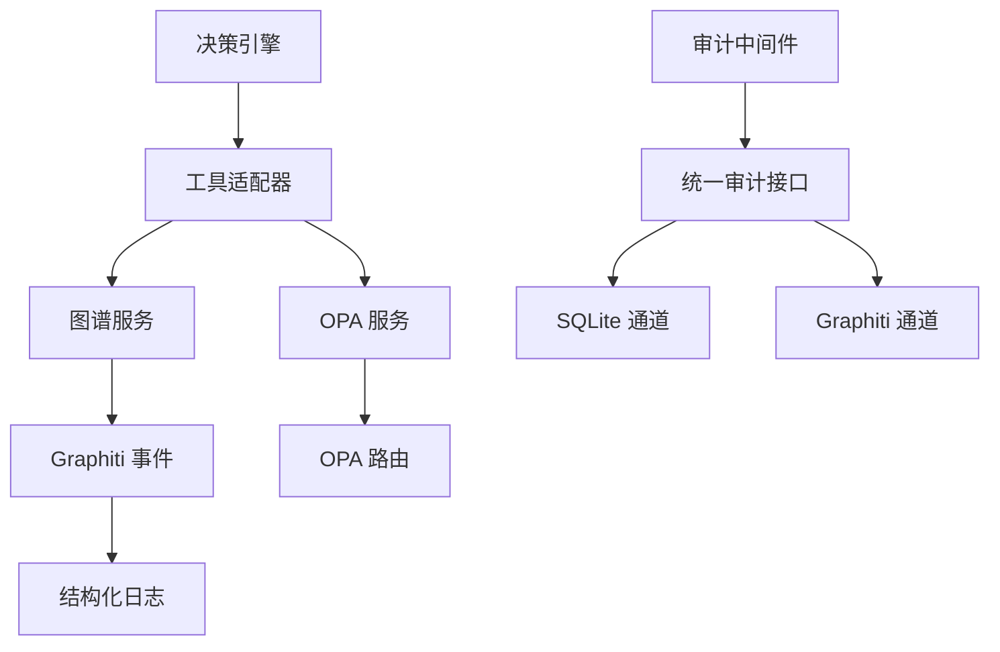

# L1 基础设施层

<cite>
**本文档引用的文件**
- [decision_engine.py](file://odap/infra/openharness/decision_engine.py)
- [graph_service.py](file://odap/infra/graph/graph_service.py)
- [opa_service.py](file://odap/infra/opa/opa_service.py)
- [graphiti_events.py](file://odap/infra/logging/graphiti_events.py)
- [audit_logger.py](file://odap/infra/security/audit_logger.py)
- [unified_audit.py](file://odap/infra/security/unified_audit.py)
- [audit_middleware.py](file://odap/infra/middleware/audit_middleware.py)
- [routes.py](file://odap/infra/opa/routes.py)
- [config.py](file://odap/infra/security/config.py)
- [structured_logging.py](file://odap/infra/logging/structured_logging.py)
- [audit_sqlite_channel.py](file://odap/infra/security/audit_sqlite_channel.py)
- [audit_graphiti_channel.py](file://odap/infra/security/audit_graphiti_channel.py)
- [v2_adapter.py](file://odap/infra/openharness/v2_adapter.py)
- [tool_adapter.py](file://odap/infra/openharness/tool_adapter.py)
- [memory_adapter.py](file://odap/infra/openharness/memory_adapter.py)
</cite>

## 目录
1. [简介](#简介)
2. [项目结构](#项目结构)
3. [核心组件](#核心组件)
4. [架构总览](#架构总览)
5. [详细组件分析](#详细组件分析)
6. [依赖关系分析](#依赖关系分析)
7. [性能考虑](#性能考虑)
8. [故障排查指南](#故障排查指南)
9. [结论](#结论)
10. [附录](#附录)

## 简介
本文件面向 ODAP 平台 L1 基础设施层，系统化梳理并说明以下关键子系统的设计与实现：
- OpenHarness Agent Loop：Agent 决策与执行循环，简化 Agent 开发与工具编排
- Graphiti 双时态知识图谱：提供时序推理与多模式图谱能力
- OPA 策略治理引擎：基于 ABAC 的权限控制与策略热更新
- 审计日志系统：统一审计通道与中间件，满足合规与追踪需求

文档重点阐述各组件的核心功能、技术特点、集成方式、数据流与安全机制，并给出配置示例与最佳实践。

## 项目结构
L1 基础设施层主要分布在 odap/infra 下的多个子模块：
- openharness：Agent Loop 适配与工具桥接
- graph：Graphiti 图谱管理与三层降级
- opa：OPA 权限与策略管理
- logging：结构化日志与 Graphiti 事件集成
- security：审计日志、中间件与安全配置
- middleware：审计中间件
- llm：LLM 客户端（被 OpenHarness 适配器复用）

**图表来源**
- [decision_engine.py:1-330](file://odap/infra/openharness/decision_engine.py#L1-L330)
- [tool_adapter.py:1-488](file://odap/infra/openharness/tool_adapter.py#L1-L488)
- [v2_adapter.py:1-528](file://odap/infra/openharness/v2_adapter.py#L1-L528)
- [memory_adapter.py:1-64](file://odap/infra/openharness/memory_adapter.py#L1-L64)
- [graph_service.py:1-800](file://odap/infra/graph/graph_service.py#L1-L800)
- [graphiti_events.py:1-282](file://odap/infra/logging/graphiti_events.py#L1-L282)
- [structured_logging.py:1-403](file://odap/infra/logging/structured_logging.py#L1-L403)
- [opa_service.py:1-750](file://odap/infra/opa/opa_service.py#L1-L750)
- [routes.py:1-422](file://odap/infra/opa/routes.py#L1-L422)
- [unified_audit.py:1-406](file://odap/infra/security/unified_audit.py#L1-L406)
- [audit_middleware.py:1-112](file://odap/infra/middleware/audit_middleware.py#L1-L112)
- [audit_sqlite_channel.py:1-449](file://odap/infra/security/audit_sqlite_channel.py#L1-L449)
- [audit_graphiti_channel.py:1-314](file://odap/infra/security/audit_graphiti_channel.py#L1-L314)
- [config.py:1-80](file://odap/infra/security/config.py#L1-L80)

**章节来源**
- [decision_engine.py:1-330](file://odap/infra/openharness/decision_engine.py#L1-L330)
- [graph_service.py:1-800](file://odap/infra/graph/graph_service.py#L1-L800)
- [opa_service.py:1-750](file://odap/infra/opa/opa_service.py#L1-L750)
- [graphiti_events.py:1-282](file://odap/infra/logging/graphiti_events.py#L1-L282)
- [unified_audit.py:1-406](file://odap/infra/security/unified_audit.py#L1-L406)
- [audit_middleware.py:1-112](file://odap/infra/middleware/audit_middleware.py#L1-L112)
- [routes.py:1-422](file://odap/infra/opa/routes.py#L1-L422)
- [config.py:1-80](file://odap/infra/security/config.py#L1-L80)
- [structured_logging.py:1-403](file://odap/infra/logging/structured_logging.py#L1-L403)
- [audit_sqlite_channel.py:1-449](file://odap/infra/security/audit_sqlite_channel.py#L1-L449)
- [audit_graphiti_channel.py:1-314](file://odap/infra/security/audit_graphiti_channel.py#L1-L314)
- [v2_adapter.py:1-528](file://odap/infra/openharness/v2_adapter.py#L1-L528)
- [tool_adapter.py:1-488](file://odap/infra/openharness/tool_adapter.py#L1-L488)
- [memory_adapter.py:1-64](file://odap/infra/openharness/memory_adapter.py#L1-L64)

## 核心组件
- OpenHarness Agent Loop：通过工具适配器将领域技能暴露为可调用工具，结合决策引擎或 LLM 实现“意图识别—工具推荐—参数提取—执行—观察”的闭环 Agent Loop。
- Graphiti 双时态知识图谱：提供三层降级（Graphiti + Neo4j → Neo4j 直连 → NetworkX 回退），支持实体/关系查询、时序版本与 Episode 管理，具备断路器与连接池等鲁棒性机制。
- OPA 策略治理引擎：支持 ABAC 策略评估、策略 Bundle 热更新、策略沙箱与批量权限检查，提供缓存与历史记录，保障 fail-close 安全边界。
- 审计日志系统：统一审计通道（SQLite 主存储 + Graphiti 辅助存储），中间件自动记录写操作，支持结构化日志与时序数据库存储。

**章节来源**
- [decision_engine.py:1-330](file://odap/infra/openharness/decision_engine.py#L1-L330)
- [graph_service.py:1-800](file://odap/infra/graph/graph_service.py#L1-L800)
- [opa_service.py:1-750](file://odap/infra/opa/opa_service.py#L1-L750)
- [unified_audit.py:1-406](file://odap/infra/security/unified_audit.py#L1-L406)
- [audit_middleware.py:1-112](file://odap/infra/middleware/audit_middleware.py#L1-L112)

## 架构总览
下图展示 L1 基础设施层的关键交互：Agent Loop 通过工具适配器调用图谱服务；图谱服务与 Graphiti 事件集成对接结构化日志；OPA 提供权限决策；审计中间件与统一审计接口共同保证合规与可追溯。

**图表来源**
- [tool_adapter.py:1-488](file://odap/infra/openharness/tool_adapter.py#L1-L488)
- [graph_service.py:1-800](file://odap/infra/graph/graph_service.py#L1-L800)
- [graphiti_events.py:1-282](file://odap/infra/logging/graphiti_events.py#L1-L282)
- [structured_logging.py:1-403](file://odap/infra/logging/structured_logging.py#L1-L403)
- [opa_service.py:1-750](file://odap/infra/opa/opa_service.py#L1-L750)
- [audit_middleware.py:1-112](file://odap/infra/middleware/audit_middleware.py#L1-L112)
- [unified_audit.py:1-406](file://odap/infra/security/unified_audit.py#L1-L406)

## 详细组件分析

### OpenHarness Agent Loop（Agent 决策与执行）
- 决策引擎：基于规则与正则的意图识别、工具推荐与参数提取，支持工作空间与实体类型映射，输出思考过程便于可观测性。
- 工具适配器：将领域技能适配为 OpenHarness Tool，兼容 v1/v2 接口，支持权限检查与执行统计。
- v2 适配器：基于 OpenHarness v2 BaseTool 架构，构建完整的 Agent Loop，支持 LLM 决策与工具执行。
- 记忆适配器：将 Graphiti 双时态图谱作为长期记忆，支持按时间窗口检索与写入 Episode。

**图表来源**
- [decision_engine.py:1-330](file://odap/infra/openharness/decision_engine.py#L1-L330)
- [tool_adapter.py:1-488](file://odap/infra/openharness/tool_adapter.py#L1-L488)
- [v2_adapter.py:1-528](file://odap/infra/openharness/v2_adapter.py#L1-L528)
- [memory_adapter.py:1-64](file://odap/infra/openharness/memory_adapter.py#L1-L64)

**章节来源**
- [decision_engine.py:1-330](file://odap/infra/openharness/decision_engine.py#L1-L330)
- [tool_adapter.py:1-488](file://odap/infra/openharness/tool_adapter.py#L1-L488)
- [v2_adapter.py:1-528](file://odap/infra/openharness/v2_adapter.py#L1-L528)
- [memory_adapter.py:1-64](file://odap/infra/openharness/memory_adapter.py#L1-L64)

### Graphiti 双时态知识图谱
- 三层降级策略：Graphiti + Neo4j → Neo4j 直连 → NetworkX 回退，确保在依赖缺失时仍可运行。
- 连接池与断路器：连接池管理、空闲清理、断路器阈值与恢复，提升稳定性与性能。
- 时序与版本：Episode 管理、版本快照、时序查询，支持实体/关系的时态分析。
- 事件集成：将 Graphiti 核心事件接入结构化日志系统，统一追踪与审计。

**图表来源**
- [graph_service.py:1-800](file://odap/infra/graph/graph_service.py#L1-L800)
- [graphiti_events.py:1-282](file://odap/infra/logging/graphiti_events.py#L1-L282)
- [structured_logging.py:1-403](file://odap/infra/logging/structured_logging.py#L1-L403)

**章节来源**
- [graph_service.py:1-800](file://odap/infra/graph/graph_service.py#L1-L800)
- [graphiti_events.py:1-282](file://odap/infra/logging/graphiti_events.py#L1-L282)
- [structured_logging.py:1-403](file://odap/infra/logging/structured_logging.py#L1-L403)

### OPA 策略治理引擎
- ABAC 策略评估：基于角色、属性与环境条件进行权限判定，内置多种限制规则（如禁止攻击民用设施）。
- 策略 Bundle 管理：支持 Bundle 热更新、版本回滚与历史记录，保障策略演进的安全可控。
- 策略沙箱：支持 What-If 分析与策略模拟，便于策略设计与验证。
- 批量权限检查与缓存：提升高并发场景下的响应性能与稳定性。

**图表来源**
- [opa_service.py:1-750](file://odap/infra/opa/opa_service.py#L1-L750)
- [routes.py:1-422](file://odap/infra/opa/routes.py#L1-L422)

**章节来源**
- [opa_service.py:1-750](file://odap/infra/opa/opa_service.py#L1-L750)
- [routes.py:1-422](file://odap/infra/opa/routes.py#L1-L422)

### 审计日志系统
- 统一审计接口：提供装饰器与便捷函数，自动记录写操作，支持 SQLite 主存储与 Graphiti 辅助存储。
- 审计中间件：拦截写操作请求，提取用户、路径、耗时等信息，统一写入审计通道。
- 审计通道：SQLite 通道支持异步缓冲、批量落盘与 WAL 模式；Graphiti 通道将审计事件图谱化，便于时序与关联分析。
- 防篡改校验：事件写入时计算校验和，保障审计完整性。

**图表来源**
- [audit_middleware.py:1-112](file://odap/infra/middleware/audit_middleware.py#L1-L112)
- [unified_audit.py:1-406](file://odap/infra/security/unified_audit.py#L1-L406)
- [audit_sqlite_channel.py:1-449](file://odap/infra/security/audit_sqlite_channel.py#L1-L449)
- [audit_graphiti_channel.py:1-314](file://odap/infra/security/audit_graphiti_channel.py#L1-L314)

**章节来源**
- [audit_middleware.py:1-112](file://odap/infra/middleware/audit_middleware.py#L1-L112)
- [unified_audit.py:1-406](file://odap/infra/security/unified_audit.py#L1-L406)
- [audit_sqlite_channel.py:1-449](file://odap/infra/security/audit_sqlite_channel.py#L1-L449)
- [audit_graphiti_channel.py:1-314](file://odap/infra/security/audit_graphiti_channel.py#L1-L314)

## 依赖关系分析
- 组件耦合与内聚
  - OpenHarness 适配层与图谱服务强耦合，通过工具适配器与记忆适配器实现解耦。
  - OPA 服务与策略路由通过 REST API 解耦，支持热更新与远程评估。
  - 审计中间件与统一审计接口通过通道抽象解耦，支持多后端存储。
- 外部依赖与集成点
  - Graphiti/Neo4j：图谱核心依赖，提供时序与关系能力。
  - LLM 客户端：为 Agent Loop 提供决策能力，可替换为不同供应商。
  - OPA Server：可选外部服务，支持远程策略评估与热更新。
- 潜在循环依赖
  - 当前模块间通过接口与工厂模式解耦，未发现循环依赖迹象。

**图表来源**
- [decision_engine.py:1-330](file://odap/infra/openharness/decision_engine.py#L1-L330)
- [tool_adapter.py:1-488](file://odap/infra/openharness/tool_adapter.py#L1-L488)
- [graph_service.py:1-800](file://odap/infra/graph/graph_service.py#L1-L800)
- [graphiti_events.py:1-282](file://odap/infra/logging/graphiti_events.py#L1-L282)
- [structured_logging.py:1-403](file://odap/infra/logging/structured_logging.py#L1-L403)
- [opa_service.py:1-750](file://odap/infra/opa/opa_service.py#L1-L750)
- [routes.py:1-422](file://odap/infra/opa/routes.py#L1-L422)
- [audit_middleware.py:1-112](file://odap/infra/middleware/audit_middleware.py#L1-L112)
- [unified_audit.py:1-406](file://odap/infra/security/unified_audit.py#L1-L406)
- [audit_sqlite_channel.py:1-449](file://odap/infra/security/audit_sqlite_channel.py#L1-L449)
- [audit_graphiti_channel.py:1-314](file://odap/infra/security/audit_graphiti_channel.py#L1-L314)

**章节来源**
- [tool_adapter.py:1-488](file://odap/infra/openharness/tool_adapter.py#L1-L488)
- [graph_service.py:1-800](file://odap/infra/graph/graph_service.py#L1-L800)
- [opa_service.py:1-750](file://odap/infra/opa/opa_service.py#L1-L750)
- [unified_audit.py:1-406](file://odap/infra/security/unified_audit.py#L1-L406)

## 性能考虑
- 图谱层
  - 连接池与断路器：合理设置最大连接数、空闲超时与失败阈值，避免雪崩效应。
  - 批量加载与索引：使用批量 MERGE 与索引/约束，减少写放大与查询延迟。
- OPA 层
  - 缓存策略：利用键生成与 TTL 控制，降低重复评估成本。
  - 批量检查：合并请求以减少网络往返。
- 审计层
  - SQLite WAL 模式与批量落盘：提升并发写入性能与可靠性。
  - 通道分离：主存储（SQLite）与辅助存储（Graphiti）分工明确，避免阻塞。
- 日志层
  - 结构化日志缓冲与异步写入：降低对业务线程的影响。
  - 时序数据库后端：支持高效的时间序列分析与可视化。

[本节为通用指导，无需特定文件分析]

## 故障排查指南
- 图谱连接异常
  - 现象：连接失败、超时或回退到 NetworkX。
  - 排查：检查 Neo4j URI/凭据、网络连通性与断路器状态；查看连接池清理与回收日志。
  - 参考：[graph_service.py:1-800](file://odap/infra/graph/graph_service.py#L1-L800)
- OPA 评估失败
  - 现象：远程 OPA 不可用，回退到本地评估或 Mock。
  - 排查：确认 OPA URL、健康检查与策略上传；检查缓存命中率与历史记录。
  - 参考：[opa_service.py:1-750](file://odap/infra/opa/opa_service.py#L1-L750)
- 审计写入失败
  - 现象：审计中间件写入失败或 SQLite 通道异常。
  - 排查：检查 WAL 模式、批量缓冲与 flush 策略；核对校验和与索引。
  - 参考：[audit_middleware.py:1-112](file://odap/infra/middleware/audit_middleware.py#L1-L112)、[audit_sqlite_channel.py:1-449](file://odap/infra/security/audit_sqlite_channel.py#L1-L449)
- 日志写入异常
  - 现象：结构化日志无法写入时序数据库。
  - 排查：确认后端驱动安装、连接参数与缓冲刷新策略。
  - 参考：[structured_logging.py:1-403](file://odap/infra/logging/structured_logging.py#L1-L403)

**章节来源**
- [graph_service.py:1-800](file://odap/infra/graph/graph_service.py#L1-L800)
- [opa_service.py:1-750](file://odap/infra/opa/opa_service.py#L1-L750)
- [audit_middleware.py:1-112](file://odap/infra/middleware/audit_middleware.py#L1-L112)
- [audit_sqlite_channel.py:1-449](file://odap/infra/security/audit_sqlite_channel.py#L1-L449)
- [structured_logging.py:1-403](file://odap/infra/logging/structured_logging.py#L1-L403)

## 结论
ODAP 平台 L1 基础设施层通过 OpenHarness Agent Loop、Graphiti 双时态知识图谱、OPA 策略治理引擎与审计日志系统，构建了高可用、可扩展、可审计的底层能力。各组件职责清晰、接口解耦、具备完善的降级与安全机制，既满足复杂业务场景的灵活性，又确保合规与安全边界。

[本节为总结性内容，无需特定文件分析]

## 附录

### 配置示例与最佳实践
- 安全配置（安全配置模块）
  - 设置 LLM、Neo4j、JWT、CORS、日志级别与文件等关键参数。
  - 建议：生产环境务必修改默认密钥与密码，启用 HTTPS 与最小权限原则。
  - 参考：[config.py:1-80](file://odap/infra/security/config.py#L1-L80)
- OpenHarness 集成
  - 使用工具适配器将领域技能暴露为可调用工具，结合决策引擎或 LLM 实现 Agent Loop。
  - 建议：为每个工具提供清晰的描述与参数模型，开启权限检查与执行统计。
  - 参考：[tool_adapter.py:1-488](file://odap/infra/openharness/tool_adapter.py#L1-L488)、[v2_adapter.py:1-528](file://odap/infra/openharness/v2_adapter.py#L1-L528)
- 图谱服务
  - 在容器环境中优先使用 Graphiti + Neo4j；本地开发可回退到 NetworkX。
  - 建议：启用连接池与断路器，合理设置批量加载与索引策略。
  - 参考：[graph_service.py:1-800](file://odap/infra/graph/graph_service.py#L1-L800)
- OPA 策略
  - 使用策略 Bundle 管理策略版本与热更新，配合策略沙箱进行 What-If 分析。
  - 建议：为关键操作配置多重限制与审计追踪，定期审查策略有效性。
  - 参考：[opa_service.py:1-750](file://odap/infra/opa/opa_service.py#L1-L750)、[routes.py:1-422](file://odap/infra/opa/routes.py#L1-L422)
- 审计与合规
  - 启用审计中间件自动记录写操作，统一使用 SQLite 主存储与 Graphiti 辅助存储。
  - 建议：定期备份审计数据，配置告警与合规报表，确保可追溯性。
  - 参考：[audit_middleware.py:1-112](file://odap/infra/middleware/audit_middleware.py#L1-L112)、[unified_audit.py:1-406](file://odap/infra/security/unified_audit.py#L1-L406)

**章节来源**
- [config.py:1-80](file://odap/infra/security/config.py#L1-L80)
- [tool_adapter.py:1-488](file://odap/infra/openharness/tool_adapter.py#L1-L488)
- [v2_adapter.py:1-528](file://odap/infra/openharness/v2_adapter.py#L1-L528)
- [graph_service.py:1-800](file://odap/infra/graph/graph_service.py#L1-L800)
- [opa_service.py:1-750](file://odap/infra/opa/opa_service.py#L1-L750)
- [routes.py:1-422](file://odap/infra/opa/routes.py#L1-L422)
- [audit_middleware.py:1-112](file://odap/infra/middleware/audit_middleware.py#L1-L112)
- [unified_audit.py:1-406](file://odap/infra/security/unified_audit.py#L1-L406)