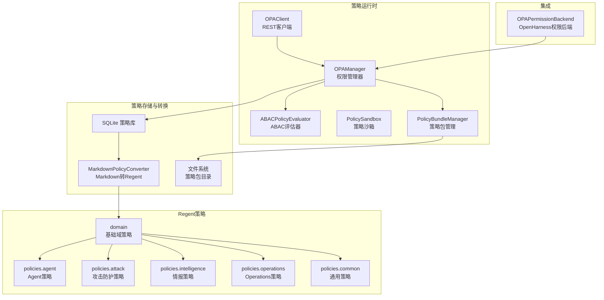
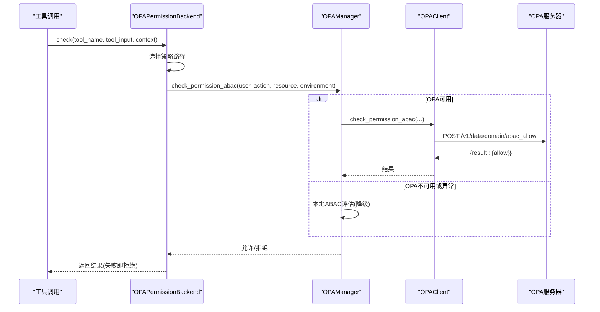
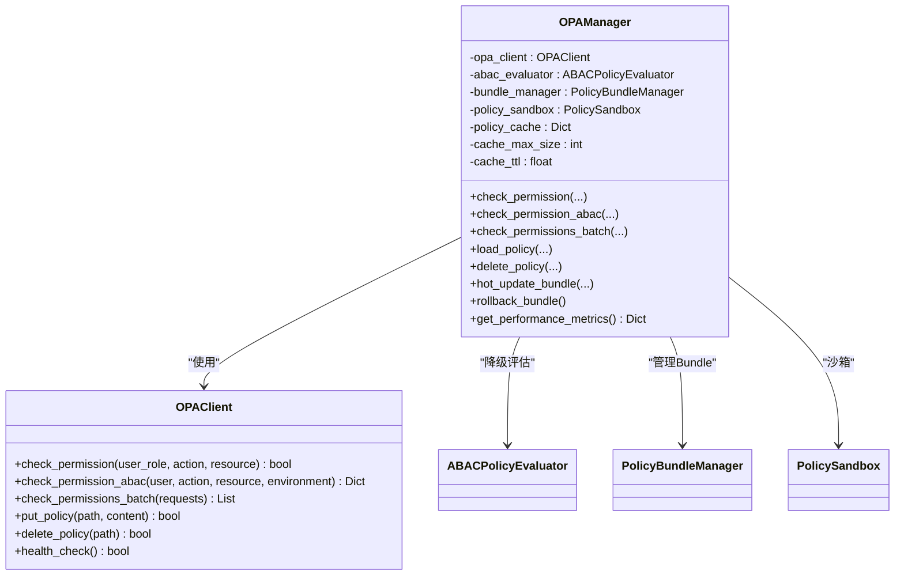
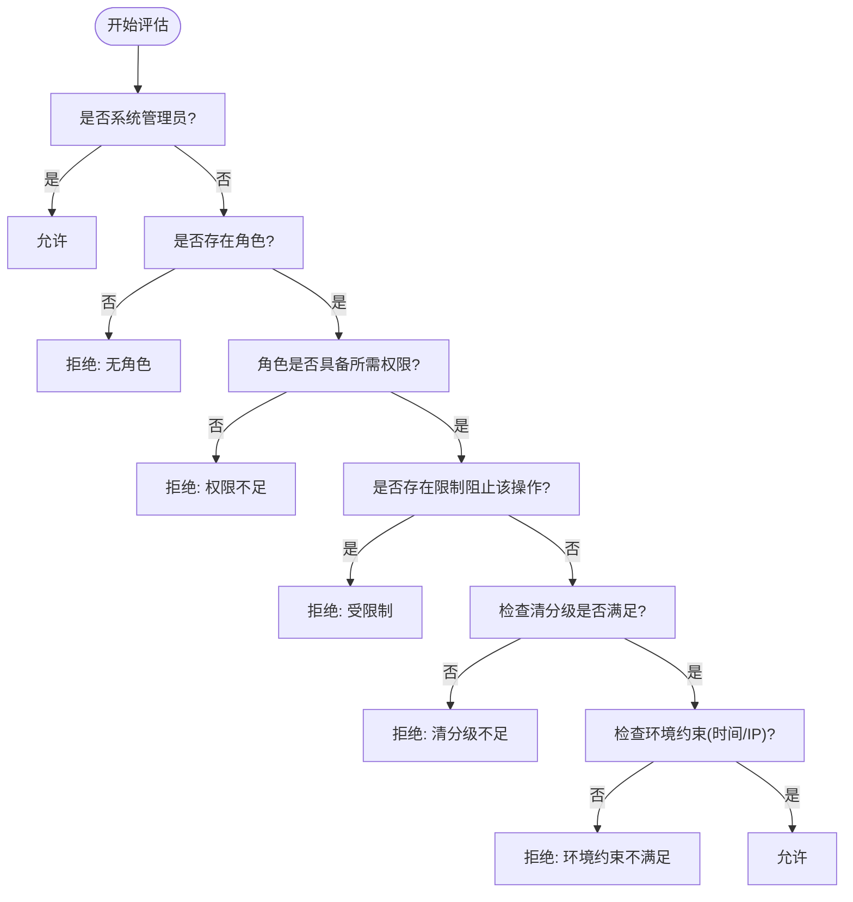
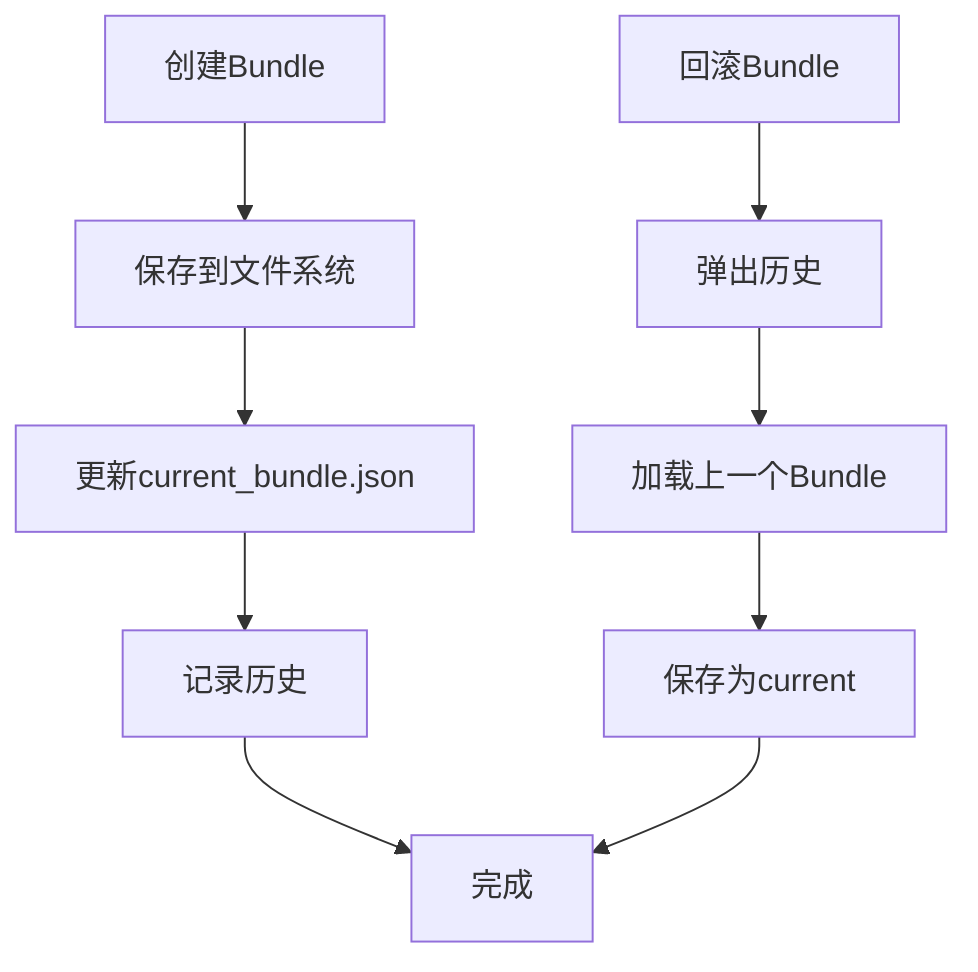
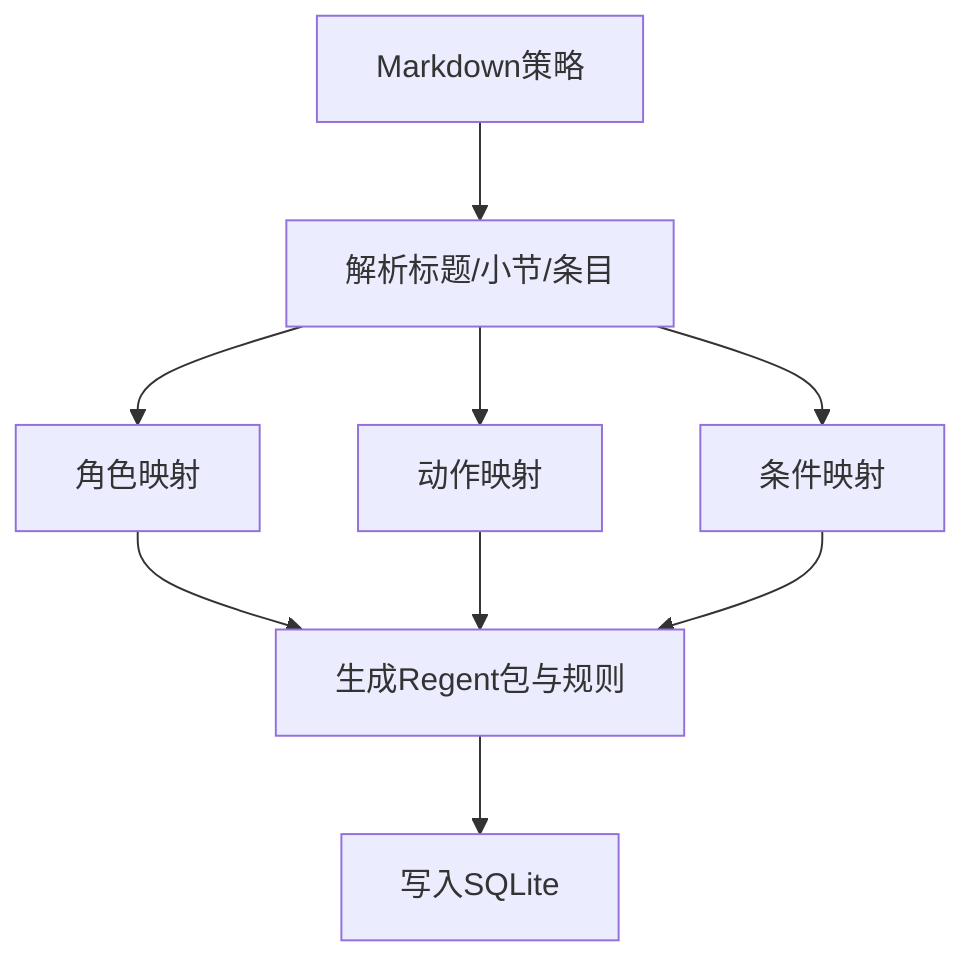
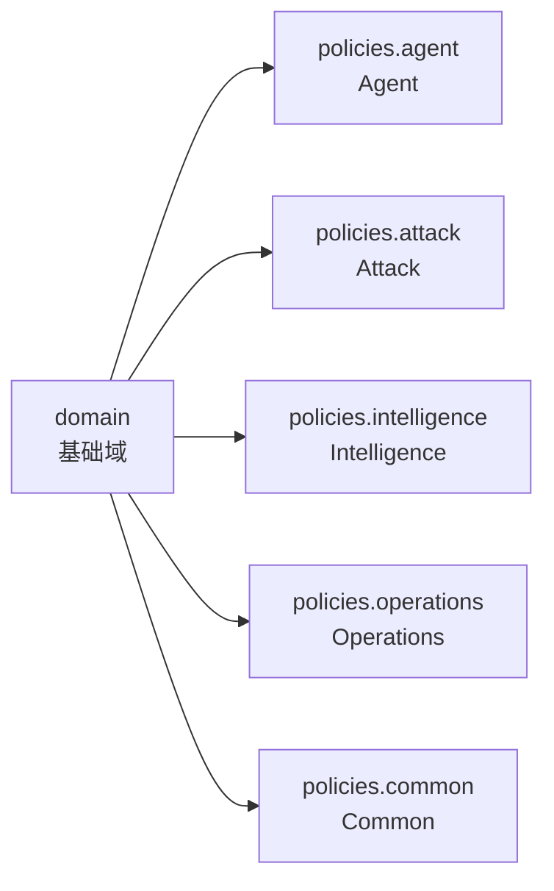
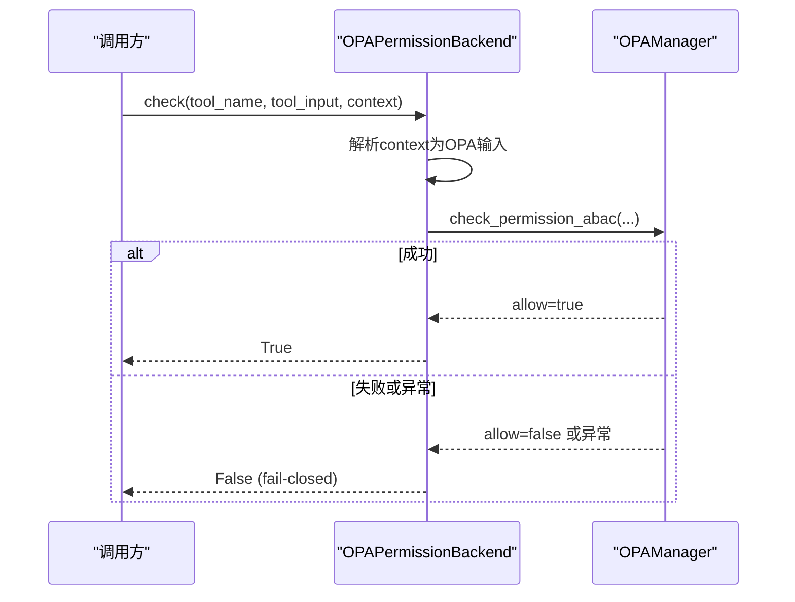
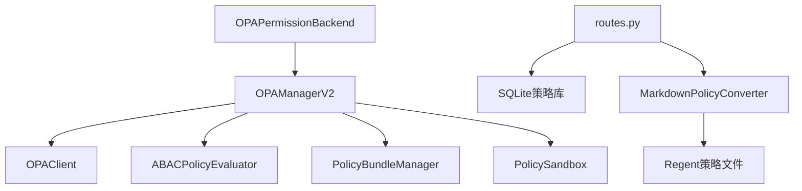

# OPA策略治理引擎

<cite>
**本文档引用的文件**
- [odap/infra/opa/opa_service.py](file://odap/infra/opa/opa_service.py)
- [odap/infra/opa/routes.py](file://odap/infra/opa/routes.py)
- [odap/infra/opa/opa_policy.rego](file://odap/infra/opa/opa_policy.rego)
- [odap/infra/opa/policies/common/default.rego](file://odap/infra/opa/policies/common/default.rego)
- [odap/infra/opa/policies/common/input.rego](file://odap/infra/opa/policies/common/input.rego)
- [odap/infra/opa/policies/agent/commander.rego](file://odap/infra/opa/policies/agent/commander.rego)
- [odap/infra/opa/policies/attack/allow.rego](file://odap/infra/opa/policies/attack/allow.rego)
- [odap/infra/opa/policies/intelligence/allow.rego](file://odap/infra/opa/policies/intelligence/allow.rego)
- [odap/infra/opa/policies/operations/allow.rego](file://odap/infra/opa/policies/operations/allow.rego)
- [odap/infra/openharness/permission_backend.py](file://odap/infra/openharness/permission_backend.py)
</cite>

## 目录
1. [简介](#简介)
2. [项目结构](#项目结构)
3. [核心组件](#核心组件)
4. [架构总览](#架构总览)
5. [详细组件分析](#详细组件分析)
6. [依赖关系分析](#依赖关系分析)
7. [性能考虑](#性能考虑)
8. [故障排除指南](#故障排除指南)
9. [结论](#结论)
10. [附录](#附录)

## 简介
本文件为OPA策略治理引擎的技术文档，聚焦于fail-close安全边界的设计与实现，涵盖Regent策略语言的语法特性、策略编译与执行机制、策略包管理、策略加载与热更新流程，以及Agent策略、攻击防护、智能体权限、Operations权限等领域的策略实现。同时提供策略编写示例、调试方法、性能优化技巧、与认证系统的集成方式、实时策略评估与审计日志记录机制。

## 项目结构
OPA策略治理引擎主要由以下模块构成：
- 策略运行时与客户端：OPA运行时客户端封装、ABAC评估器、策略沙箱、缓存与历史记录
- 策略存储与转换：SQLite策略数据库、Markdown到Regent转换器
- Regent策略文件：基础域策略与各领域策略（Agent、Attack、Intelligence、Operations、Common）
- OpenHarness权限后端：将工具调用与OPA策略进行桥接，实现fail-closed

**图示来源**
- [odap/infra/opa/opa_service.py:373-450](file://odap/infra/opa/opa_service.py#L373-L450)
- [odap/infra/opa/routes.py:17-94](file://odap/infra/opa/routes.py#L17-L94)
- [odap/infra/openharness/permission_backend.py:7-28](file://odap/infra/openharness/permission_backend.py#L7-L28)

**章节来源**
- [odap/infra/opa/opa_service.py:1-120](file://odap/infra/opa/opa_service.py#L1-L120)
- [odap/infra/opa/routes.py:1-40](file://odap/infra/opa/routes.py#L1-L40)

## 核心组件
- OPA运行时客户端：封装OPA REST API，支持权限检查、批量检查、策略上传/删除、健康检查
- 权限管理器：统一接入OPA或本地ABAC评估，提供缓存、历史记录、版本管理、热更新与回滚
- ABAC评估器：本地ABAC策略评估，用于Mock模式与降级
- 策略沙箱：策略模拟与What-If分析，支持错误捕获与执行时间统计
- 策略包管理：策略Bundle的创建、持久化、当前版本维护与回滚
- 策略存储与转换：SQLite存储策略元数据与内容，Markdown到Regent转换器
- OpenHarness权限后端：将工具调用映射到具体策略，实现fail-closed

**章节来源**
- [odap/infra/opa/opa_service.py:373-717](file://odap/infra/opa/opa_service.py#L373-L717)
- [odap/infra/opa/routes.py:166-244](file://odap/infra/opa/routes.py#L166-L244)
- [odap/infra/openharness/permission_backend.py:7-76](file://odap/infra/openharness/permission_backend.py#L7-L76)

## 架构总览
OPA策略治理引擎通过以下路径实现fail-close安全边界：
- 请求进入OpenHarness权限后端，根据工具名称选择对应策略
- 若OPA可用则调用REST API进行实时评估；若不可用或异常则fail-closed返回拒绝
- 权限管理器负责缓存命中、降级策略与历史记录
- 策略通过文件系统或数据库进行管理，并支持热更新与回滚

**图示来源**
- [odap/infra/openharness/permission_backend.py:40-76](file://odap/infra/openharness/permission_backend.py#L40-L76)
- [odap/infra/opa/opa_service.py:559-583](file://odap/infra/opa/opa_service.py#L559-L583)
- [odap/infra/opa/opa_service.py:394-407](file://odap/infra/opa/opa_service.py#L394-L407)

## 详细组件分析

### OPA运行时客户端与权限管理器
- OPAClient：封装OPA REST API，支持权限检查、批量检查、策略上传/删除、健康检查
- OPAManager：统一入口，负责缓存、降级、历史记录、版本管理、热更新与回滚
- 缓存策略：MD5键、TTL过期、LRU淘汰、命中率统计
- 降级策略：Mock ABAC评估与本地评估，保证fail-closed

**图示来源**
- [odap/infra/opa/opa_service.py:373-450](file://odap/infra/opa/opa_service.py#L373-L450)
- [odap/infra/opa/opa_service.py:455-717](file://odap/infra/opa/opa_service.py#L455-L717)

**章节来源**
- [odap/infra/opa/opa_service.py:373-717](file://odap/infra/opa/opa_service.py#L373-L717)

### ABAC策略评估器与策略沙箱
- ABAC策略评估器：基于角色、权限、限制与环境约束进行评估
- 策略沙箱：支持策略模拟与What-If分析，捕获异常并统计执行时间

**图示来源**
- [odap/infra/opa/opa_service.py:114-225](file://odap/infra/opa/opa_service.py#L114-L225)

**章节来源**
- [odap/infra/opa/opa_service.py:114-225](file://odap/infra/opa/opa_service.py#L114-L225)
- [odap/infra/opa/opa_service.py:316-371](file://odap/infra/opa/opa_service.py#L316-L371)

### 策略包管理与热更新
- 策略Bundle：版本、修订、策略集合、元数据、校验和
- 管理器：创建Bundle、持久化、设置current、历史记录、回滚
- 热更新：创建新版本Bundle并更新current，保留历史以便回滚

**图示来源**
- [odap/infra/opa/opa_service.py:227-314](file://odap/infra/opa/opa_service.py#L227-L314)

**章节来源**
- [odap/infra/opa/opa_service.py:227-314](file://odap/infra/opa/opa_service.py#L227-L314)

### 策略存储与转换（Markdown→Regent）
- SQLite策略库：存储策略元数据与Regent内容，支持启用/禁用状态与版本演进
- Markdown转换器：解析中文Markdown描述，生成标准Regent策略包与规则

**图示来源**
- [odap/infra/opa/routes.py:242-422](file://odap/infra/opa/routes.py#L242-L422)
- [odap/infra/opa/routes.py:17-94](file://odap/infra/opa/routes.py#L17-L94)

**章节来源**
- [odap/infra/opa/routes.py:166-244](file://odap/infra/opa/routes.py#L166-L244)
- [odap/infra/opa/routes.py:242-422](file://odap/infra/opa/routes.py#L242-L422)

### Regent策略语言与语法特性
- 基础域策略：角色定义、权限映射、主规则allow、限制检查、调试辅助规则
- 领域策略：
  - Agent策略：按智能体角色与动作授权
  - Attack策略：攻击目标保护、武器参数校验、拒绝原因
  - Intelligence策略：情报相关动作的权限矩阵
  - Operations策略：Operations动作的权限矩阵
  - Common策略：默认拒绝、通用动作白名单、风险等级判定

**图示来源**
- [odap/infra/opa/opa_policy.rego:11-137](file://odap/infra/opa/opa_policy.rego#L11-L137)
- [odap/infra/opa/policies/agent/commander.rego:1-35](file://odap/infra/opa/policies/agent/commander.rego#L1-L35)
- [odap/infra/opa/policies/attack/allow.rego:1-52](file://odap/infra/opa/policies/attack/allow.rego#L1-L52)
- [odap/infra/opa/policies/intelligence/allow.rego:1-37](file://odap/infra/opa/policies/intelligence/allow.rego#L1-L37)
- [odap/infra/opa/policies/operations/allow.rego:1-45](file://odap/infra/opa/policies/operations/allow.rego#L1-L45)
- [odap/infra/opa/policies/common/default.rego:1-26](file://odap/infra/opa/policies/common/default.rego#L1-L26)
- [odap/infra/opa/policies/common/input.rego:1-30](file://odap/infra/opa/policies/common/input.rego#L1-L30)

**章节来源**
- [odap/infra/opa/opa_policy.rego:11-137](file://odap/infra/opa/opa_policy.rego#L11-L137)
- [odap/infra/opa/policies/agent/commander.rego:1-35](file://odap/infra/opa/policies/agent/commander.rego#L1-L35)
- [odap/infra/opa/policies/attack/allow.rego:1-52](file://odap/infra/opa/policies/attack/allow.rego#L1-L52)
- [odap/infra/opa/policies/intelligence/allow.rego:1-37](file://odap/infra/opa/policies/intelligence/allow.rego#L1-L37)
- [odap/infra/opa/policies/operations/allow.rego:1-45](file://odap/infra/opa/policies/operations/allow.rego#L1-L45)
- [odap/infra/opa/policies/common/default.rego:1-26](file://odap/infra/opa/policies/common/default.rego#L1-L26)
- [odap/infra/opa/policies/common/input.rego:1-30](file://odap/infra/opa/policies/common/input.rego#L1-L30)

### OpenHarness权限后端与fail-closed集成
- 策略映射：工具名称到策略路径的映射表，默认策略
- fail-closed：当OPA不可用或异常时，拒绝所有请求
- 上下文输入：用户角色、ID、目标、武器、环境等

**图示来源**
- [odap/infra/openharness/permission_backend.py:40-76](file://odap/infra/openharness/permission_backend.py#L40-L76)

**章节来源**
- [odap/infra/openharness/permission_backend.py:7-76](file://odap/infra/openharness/permission_backend.py#L7-L76)

## 依赖关系分析
- 组件耦合
  - OPAPermissionBackend依赖OPAManagerV2，形成策略执行入口
  - OPAManager依赖OPAClient、ABACPolicyEvaluator、PolicyBundleManager、PolicySandbox
  - 策略转换器依赖Markdown解析与Regent生成
- 外部依赖
  - OPA REST API：权限评估、策略上传/删除
  - SQLite：策略元数据持久化
  - 文件系统：策略Bundle持久化

**图示来源**
- [odap/infra/openharness/permission_backend.py:26-38](file://odap/infra/openharness/permission_backend.py#L26-L38)
- [odap/infra/opa/opa_service.py:466-489](file://odap/infra/opa/opa_service.py#L466-L489)
- [odap/infra/opa/routes.py:17-94](file://odap/infra/opa/routes.py#L17-L94)

**章节来源**
- [odap/infra/opa/opa_service.py:455-717](file://odap/infra/opa/opa_service.py#L455-L717)
- [odap/infra/opa/routes.py:166-244](file://odap/infra/opa/routes.py#L166-L244)

## 性能考虑
- 缓存优化
  - 缓存键：用户ID、角色、动作、资源类型与ID的哈希
  - TTL与容量：可配置的TTL与最大容量，满载时LRU淘汰
  - 命中率：统计命中/未命中次数，计算命中率
- 批量检查：支持批量请求合并，减少网络往返
- 降级策略：OPA不可用时走本地ABAC评估，避免阻塞
- 策略热更新：Bundle版本化，快速切换与回滚，降低停机风险

**章节来源**
- [odap/infra/opa/opa_service.py:501-537](file://odap/infra/opa/opa_service.py#L501-L537)
- [odap/infra/opa/opa_service.py:585-598](file://odap/infra/opa/opa_service.py#L585-L598)
- [odap/infra/opa/opa_service.py:678-714](file://odap/infra/opa/opa_service.py#L678-L714)

## 故障排除指南
- OPA不可用或超时
  - 现象：OPA调用异常，触发降级
  - 排查：检查OPA URL、网络连通性、健康检查接口
  - 处置：启用Mock模式或修复OPA服务
- 策略加载失败
  - 现象：策略上传/自动加载失败
  - 排查：检查策略内容格式、包名、语法
  - 处置：修正Regent策略或回滚到上一版本
- 缓存命中异常
  - 现象：命中率低或缓存未生效
  - 排查：核对缓存键生成、TTL设置、并发访问
  - 处置：调整缓存参数或清理缓存
- 权限后端fail-closed
  - 现象：OPA异常导致拒绝所有请求
  - 排查：检查后端日志、OPA状态
  - 处置：恢复OPA或临时放宽策略

**章节来源**
- [odap/infra/opa/opa_service.py:546-554](file://odap/infra/opa/opa_service.py#L546-L554)
- [odap/infra/opa/opa_service.py:684-695](file://odap/infra/opa/opa_service.py#L684-L695)
- [odap/infra/openharness/permission_backend.py:54-68](file://odap/infra/openharness/permission_backend.py#L54-L68)

## 结论
本OPA策略治理引擎通过fail-closed设计、Regent策略语言、策略包管理与热更新机制，实现了可演进、可观测、可降级的安全边界。结合OpenHarness权限后端，能够将工具调用与策略精确绑定，确保在OPA异常时仍维持安全默认。建议在生产环境中配合监控与审计，持续优化缓存与策略结构，保障性能与安全性。

## 附录

### 策略编写示例（步骤说明）
- 在策略库中新增策略记录，填写名称、描述、分类与Markdown内容
- 提交后自动转换为Regent策略并持久化
- 通过OPA REST API上传或由管理器自动加载
- 使用策略沙箱进行What-If分析与模拟验证

**章节来源**
- [odap/infra/opa/routes.py:137-164](file://odap/infra/opa/routes.py#L137-L164)
- [odap/infra/opa/routes.py:184-220](file://odap/infra/opa/routes.py#L184-L220)
- [odap/infra/opa/opa_service.py:684-695](file://odap/infra/opa/opa_service.py#L684-L695)

### 调试方法
- 使用OPA CLI评估：参考策略文件中的测试注释，传入input进行评估
- 查看决策摘要：基础域策略提供decision_reason规则，便于定位拒绝原因
- 启用策略沙箱：对新策略进行模拟执行，获取执行时间与错误信息

**章节来源**
- [odap/infra/opa/opa_policy.rego:118-130](file://odap/infra/opa/opa_policy.rego#L118-L130)
- [odap/infra/opa/opa_service.py:322-348](file://odap/infra/opa/opa_service.py#L322-L348)

### 性能优化技巧
- 合理设置缓存参数：根据QPS与响应时间调整TTL与容量
- 使用批量检查：合并多个权限请求，减少网络开销
- 策略拆分：将复杂策略拆分为领域策略，提升可维护性与评估效率
- 热更新演练：在测试环境先行验证，降低生产风险

**章节来源**
- [odap/infra/opa/opa_service.py:473-478](file://odap/infra/opa/opa_service.py#L473-L478)
- [odap/infra/opa/opa_service.py:585-598](file://odap/infra/opa/opa_service.py#L585-L598)
- [odap/infra/opa/opa_service.py:649-660](file://odap/infra/opa/opa_service.py#L649-L660)

### 策略与认证系统的集成
- 输入上下文：用户角色、ID、目标、武器、环境等
- 策略映射：工具名称到策略路径的映射表
- fail-closed：后端异常时拒绝请求，确保安全默认

**章节来源**
- [odap/infra/openharness/permission_backend.py:40-76](file://odap/infra/openharness/permission_backend.py#L40-L76)

### 实时策略评估与审计日志
- 实时评估：通过OPA REST API进行即时决策
- 历史记录：记录每次决策的时间、用户、动作、资源与结果
- 指标统计：缓存命中率、版本信息、历史数量等

**章节来源**
- [odap/infra/opa/opa_service.py:622-629](file://odap/infra/opa/opa_service.py#L622-L629)
- [odap/infra/opa/opa_service.py:707-714](file://odap/infra/opa/opa_service.py#L707-L714)