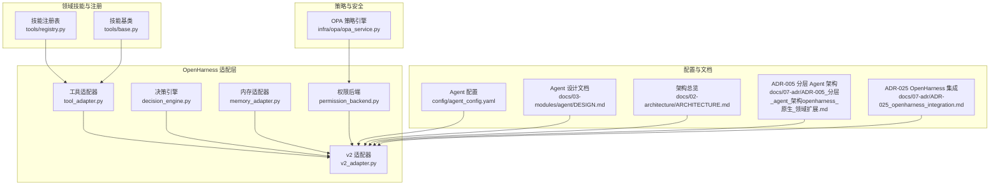
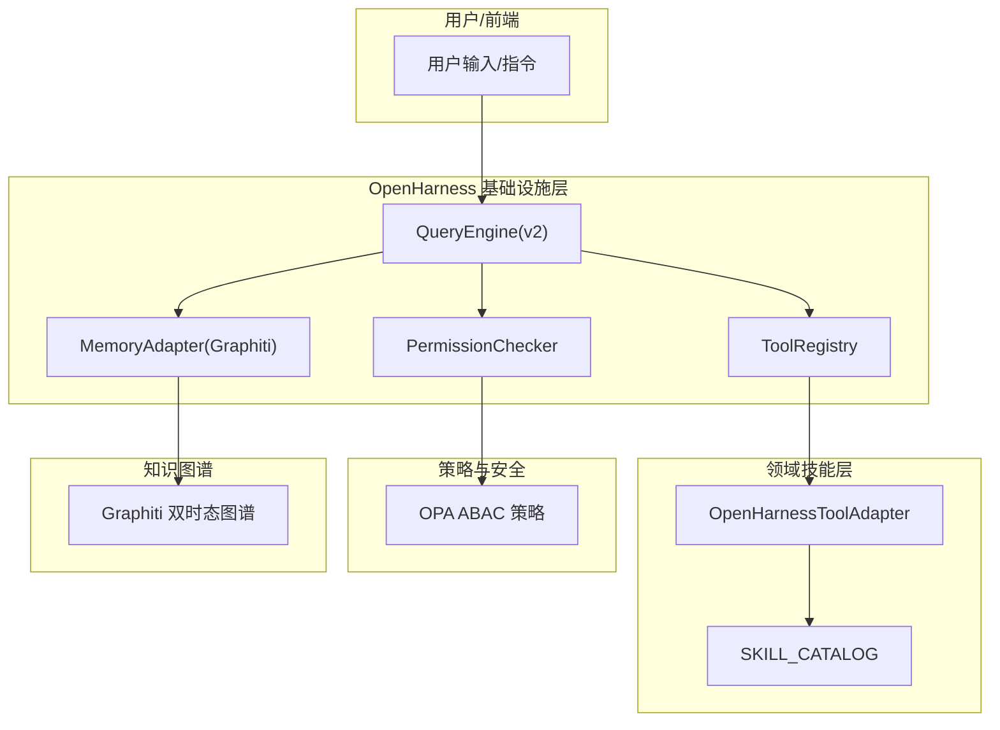
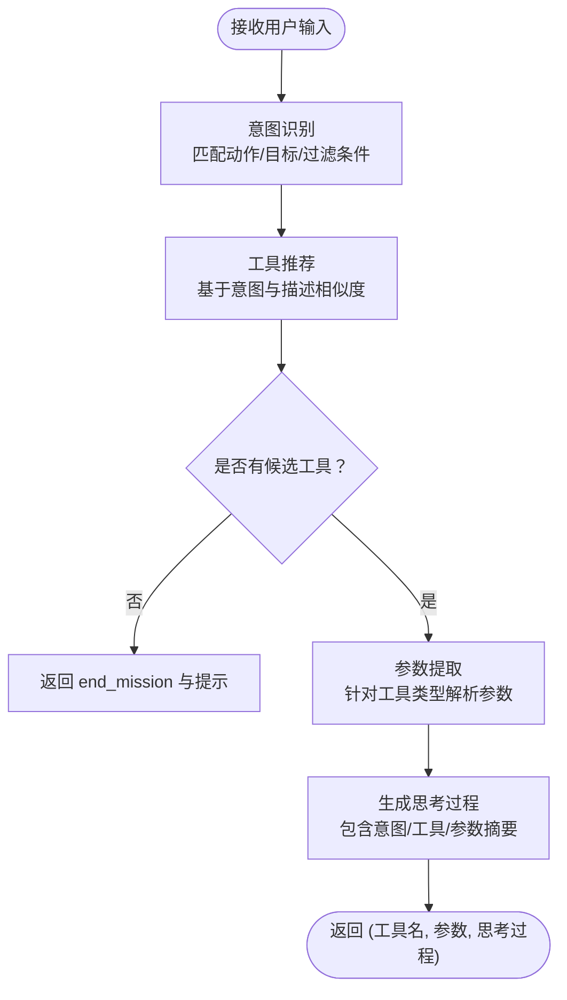
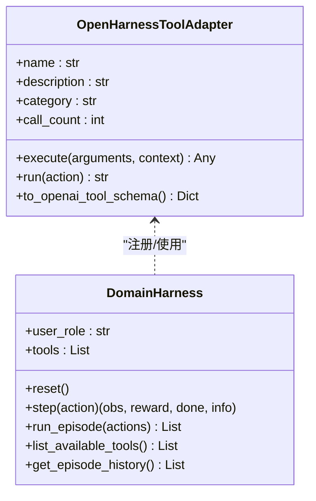
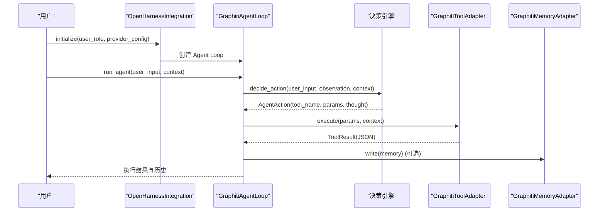
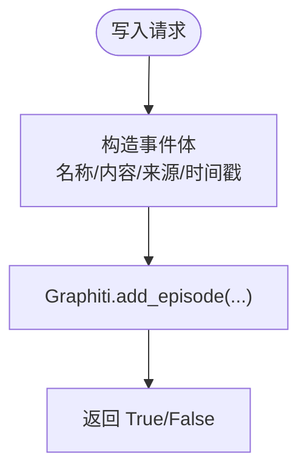
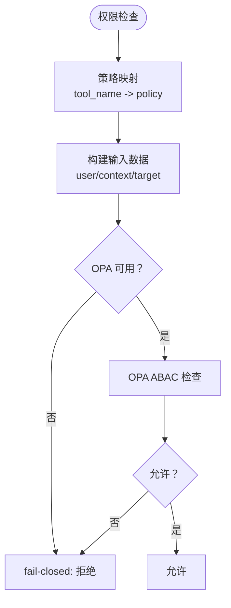
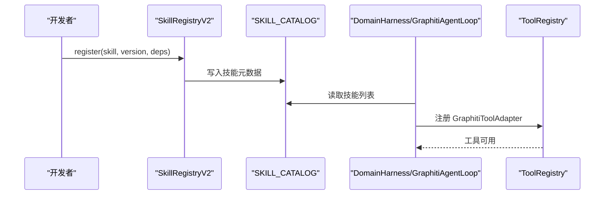
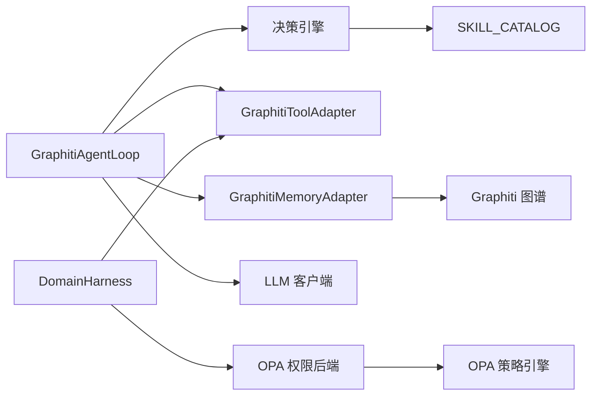

# OpenHarness Agent Loop

<cite>
**本文引用的文件**   
- [odap/infra/openharness/decision_engine.py](file://odap/infra/openharness/decision_engine.py)
- [odap/infra/openharness/tool_adapter.py](file://odap/infra/openharness/tool_adapter.py)
- [odap/infra/openharness/memory_adapter.py](file://odap/infra/openharness/memory_adapter.py)
- [odap/infra/openharness/permission_backend.py](file://odap/infra/openharness/permission_backend.py)
- [odap/infra/openharness/v2_adapter.py](file://odap/infra/openharness/v2_adapter.py)
- [odap/tools/registry.py](file://odap/tools/registry.py)
- [odap/tools/base.py](file://odap/tools/base.py)
- [odap/infra/opa/opa_service.py](file://odap/infra/opa/opa_service.py)
- [config/agent_config.yaml](file://config/agent_config.yaml)
- [docs/03-modules/agent/DESIGN.md](file://docs/03-modules/agent/DESIGN.md)
- [docs/02-architecture/ARCHITECTURE.md](file://docs/02-architecture/ARCHITECTURE.md)
- [docs/07-adr/ADR-005_分层_agent_架构openharness_原生_领域扩展.md](file://docs/07-adr/ADR-005_分层_agent_架构openharness_原生_领域扩展.md)
- [docs/07-adr/ADR-025_openharness_integration.md](file://docs/07-adr/ADR-025_openharness_integration.md)
</cite>

## 目录
1. [简介](#简介)
2. [项目结构](#项目结构)
3. [核心组件](#核心组件)
4. [架构总览](#架构总览)
5. [详细组件分析](#详细组件分析)
6. [依赖分析](#依赖分析)
7. [性能考虑](#性能考虑)
8. [故障排查指南](#故障排查指南)
9. [结论](#结论)
10. [附录](#附录)

## 简介
本文件面向“OpenHarness Agent Loop”在本体驱动分析决策平台（ODAP）中的落地实现，系统化阐述如何利用 OpenHarness 作为智能体基础设施，简化 Agent 开发与编排。重点覆盖：
- 决策引擎：意图识别、工具推荐、参数提取与多轮对话管理
- 工具适配器：将领域技能（Skills）无缝适配为 OpenHarness 可调用工具，并兼容 v1/v2 接口
- 内存适配器：以 Graphiti 双时态图谱作为长期记忆，支撑时序检索与历史回溯
- 权限后端：基于 OPA 的 ABAC 策略引擎，提供 fail-closed 的安全访问控制
- Agent Loop 生命周期与任务调度：基于 OpenHarness v2 的 QueryEngine/ToolRegistry/PermissionChecker 架构
- 跨域集成能力：与 Graphiti 知识图谱、OPA 策略引擎、MCP 协议等的统一接入
- v2 适配器改进：更健壮的错误处理、性能指标与可观测性、可扩展的工具注册与执行链路

## 项目结构
围绕 OpenHarness Agent Loop 的核心代码位于 odap/infra/openharness 目录，配合 odap/tools 技能体系与 odap/infra/opa 权限系统，形成“工具适配—Agent Loop—权限控制—知识记忆”的闭环。

**图表来源**
- [odap/infra/openharness/decision_engine.py:1-330](file://odap/infra/openharness/decision_engine.py#L1-L330)
- [odap/infra/openharness/tool_adapter.py:1-488](file://odap/infra/openharness/tool_adapter.py#L1-L488)
- [odap/infra/openharness/memory_adapter.py:1-64](file://odap/infra/openharness/memory_adapter.py#L1-L64)
- [odap/infra/openharness/permission_backend.py:1-83](file://odap/infra/openharness/permission_backend.py#L1-L83)
- [odap/infra/openharness/v2_adapter.py:1-528](file://odap/infra/openharness/v2_adapter.py#L1-L528)
- [odap/tools/registry.py:1-53](file://odap/tools/registry.py#L1-L53)
- [odap/tools/base.py:1-720](file://odap/tools/base.py#L1-L720)
- [odap/infra/opa/opa_service.py:1-750](file://odap/infra/opa/opa_service.py#L1-L750)
- [config/agent_config.yaml:1-23](file://config/agent_config.yaml#L1-L23)
- [docs/03-modules/agent/DESIGN.md:1-409](file://docs/03-modules/agent/DESIGN.md#L1-L409)
- [docs/02-architecture/ARCHITECTURE.md:1-626](file://docs/02-architecture/ARCHITECTURE.md#L1-L626)
- [docs/07-adr/ADR-005_分层_agent_架构openharness_原生_领域扩展.md:15-77](file://docs/07-adr/ADR-005_分层_agent_架构openharness_原生_领域扩展.md#L15-L77)
- [docs/07-adr/ADR-025_openharness_integration.md:1-41](file://docs/07-adr/ADR-025_openharness_integration.md#L1-L41)

**章节来源**
- [odap/infra/openharness/decision_engine.py:1-330](file://odap/infra/openharness/decision_engine.py#L1-L330)
- [odap/infra/openharness/tool_adapter.py:1-488](file://odap/infra/openharness/tool_adapter.py#L1-L488)
- [odap/infra/openharness/memory_adapter.py:1-64](file://odap/infra/openharness/memory_adapter.py#L1-L64)
- [odap/infra/openharness/permission_backend.py:1-83](file://odap/infra/openharness/permission_backend.py#L1-L83)
- [odap/infra/openharness/v2_adapter.py:1-528](file://odap/infra/openharness/v2_adapter.py#L1-L528)
- [odap/tools/registry.py:1-53](file://odap/tools/registry.py#L1-L53)
- [odap/tools/base.py:1-720](file://odap/tools/base.py#L1-L720)
- [odap/infra/opa/opa_service.py:1-750](file://odap/infra/opa/opa_service.py#L1-L750)
- [config/agent_config.yaml:1-23](file://config/agent_config.yaml#L1-L23)
- [docs/03-modules/agent/DESIGN.md:1-409](file://docs/03-modules/agent/DESIGN.md#L1-L409)
- [docs/02-architecture/ARCHITECTURE.md:1-626](file://docs/02-architecture/ARCHITECTURE.md#L1-L626)
- [docs/07-adr/ADR-005_分层_agent_架构openharness_原生_领域扩展.md:15-77](file://docs/07-adr/ADR-005_分层_agent_架构openharness_原生_领域扩展.md#L15-L77)
- [docs/07-adr/ADR-025_openharness_integration.md:1-41](file://docs/07-adr/ADR-025_openharness_integration.md#L1-L41)

## 核心组件
- 决策引擎：基于规则与模式匹配的意图识别、工具推荐与参数提取，支持多轮对话与置信度评分
- 工具适配器：将领域技能（SKILL_CATALOG）适配为 OpenHarness Tool，兼容 v1/v2 接口，提供统一的 execute/run 与 schema 导出
- 内存适配器：以 Graphiti 双时态图谱为记忆载体，支持检索、写入、时间窗口查询与计数
- 权限后端：基于 OPA 的 ABAC 策略，提供 fail-closed 的权限检查与错误处理
- v2 适配器：基于 OpenHarness v2 的 QueryEngine/ToolRegistry/PermissionChecker，构建完整的 Agent Loop 生命周期与任务调度

**章节来源**
- [odap/infra/openharness/decision_engine.py:25-330](file://odap/infra/openharness/decision_engine.py#L25-L330)
- [odap/infra/openharness/tool_adapter.py:83-488](file://odap/infra/openharness/tool_adapter.py#L83-L488)
- [odap/infra/openharness/memory_adapter.py:8-64](file://odap/infra/openharness/memory_adapter.py#L8-L64)
- [odap/infra/openharness/permission_backend.py:7-83](file://odap/infra/openharness/permission_backend.py#L7-L83)
- [odap/infra/openharness/v2_adapter.py:90-528](file://odap/infra/openharness/v2_adapter.py#L90-L528)

## 架构总览
OpenHarness Agent Loop 在 ODAP 中承担“智能体基础设施层”，向上承载领域 Agent（情报/指挥/执行），向下对接 Graphiti 知识图谱与 OPA 策略引擎，通过工具注册与权限检查实现安全可控的自动化任务执行。

**图表来源**
- [odap/infra/openharness/v2_adapter.py:250-287](file://odap/infra/openharness/v2_adapter.py#L250-L287)
- [odap/infra/openharness/tool_adapter.py:292-310](file://odap/infra/openharness/tool_adapter.py#L292-L310)
- [odap/infra/openharness/memory_adapter.py:11-19](file://odap/infra/openharness/memory_adapter.py#L11-L19)
- [odap/infra/opa/opa_service.py:373-450](file://odap/infra/opa/opa_service.py#L373-L450)
- [docs/02-architecture/ARCHITECTURE.md:448-456](file://docs/02-architecture/ARCHITECTURE.md#L448-L456)

**章节来源**
- [docs/02-architecture/ARCHITECTURE.md:448-456](file://docs/02-architecture/ARCHITECTURE.md#L448-L456)
- [docs/07-adr/ADR-005_分层_agent_架构openharness_原生_领域扩展.md:15-77](file://docs/07-adr/ADR-005_分层_agent_架构openharness_原生_领域扩展.md#L15-L77)
- [docs/07-adr/ADR-025_openharness_integration.md:27-41](file://docs/07-adr/ADR-025_openharness_integration.md#L27-L41)

## 详细组件分析

### 决策引擎（Intent Recognition + Tool Recommendation）
- 意图识别：基于中文/英文关键词的正则匹配，识别 query/analyze/create/update/delete 等动作类别
- 工具推荐：依据意图与目标，结合工具描述进行相似度打分，返回候选工具与置信度
- 参数提取：针对不同工具提取实体 ID、区域、数量限制、关键词等参数
- 多轮对话：通过置信度与工作空间关键字判定，维持上下文连贯性

**图表来源**
- [odap/infra/openharness/decision_engine.py:99-323](file://odap/infra/openharness/decision_engine.py#L99-L323)

**章节来源**
- [odap/infra/openharness/decision_engine.py:25-330](file://odap/infra/openharness/decision_engine.py#L25-L330)

### 工具适配器（Skill → Tool 适配）
- v2 适配：基于 OpenHarness v2 BaseTool 接口，动态生成输入模型，统一 execute 返回结构
- v1 兼容：提供 run 方法，兼容旧版 OpenHarness core.harness
- Schema 导出：支持 OpenAI function calling 格式，便于 LLM 直接调用
- 错误处理：捕获异常并返回 ToolResult/JSON 结构，包含工具名、执行耗时与调用次数

**图表来源**
- [odap/infra/openharness/tool_adapter.py:83-194](file://odap/infra/openharness/tool_adapter.py#L83-L194)
- [odap/infra/openharness/tool_adapter.py:217-406](file://odap/infra/openharness/tool_adapter.py#L217-L406)

**章节来源**
- [odap/infra/openharness/tool_adapter.py:1-488](file://odap/infra/openharness/tool_adapter.py#L1-L488)

### v2 适配器（Agent Loop 生命周期与任务调度）
- GraphitiToolAdapter：将 SKILL_CATALOG 中的技能封装为 OpenHarness v2 BaseTool，支持 execute 异步调用与错误处理
- GraphitiAgentLoop：构建 Agent Loop，包含工具构建、决策引擎初始化、动作决策、执行与历史记录
- OpenHarnessIntegration：全局集成管理器，负责初始化 LLM 客户端与 Agent Loop，提供运行状态查询

**图表来源**
- [odap/infra/openharness/v2_adapter.py:171-279](file://odap/infra/openharness/v2_adapter.py#L171-L279)
- [odap/infra/openharness/v2_adapter.py:417-474](file://odap/infra/openharness/v2_adapter.py#L417-L474)

**章节来源**
- [odap/infra/openharness/v2_adapter.py:1-528](file://odap/infra/openharness/v2_adapter.py#L1-L528)

### 内存适配器（Graphiti 双时态记忆）
- 读取：基于 Graphiti 搜索接口，返回带分数的内容列表
- 写入：将事件以“记忆_事件类型”命名写入图谱，携带来源描述与 UTC 时间戳
- 时间窗口查询：按 valid_time 查询时态片段
- 删除/计数：删除接口记录但不实际删除，提供实体计数辅助

**图表来源**
- [odap/infra/openharness/memory_adapter.py:25-37](file://odap/infra/openharness/memory_adapter.py#L25-L37)

**章节来源**
- [odap/infra/openharness/memory_adapter.py:1-64](file://odap/infra/openharness/memory_adapter.py#L1-L64)

### 权限后端（OPA ABAC 策略）
- 策略映射：将工具名映射到 OPA 策略路径，提供默认策略兜底
- ABAC 检查：基于用户角色、工具输入、目标与环境进行权限评估
- fail-closed：OPA 不可用时默认拒绝，异常时同样拒绝并记录错误

**图表来源**
- [odap/infra/openharness/permission_backend.py:40-68](file://odap/infra/openharness/permission_backend.py#L40-L68)
- [odap/infra/opa/opa_service.py:394-406](file://odap/infra/opa/opa_service.py#L394-L406)

**章节来源**
- [odap/infra/openharness/permission_backend.py:1-83](file://odap/infra/openharness/permission_backend.py#L1-L83)
- [odap/infra/opa/opa_service.py:1-750](file://odap/infra/opa/opa_service.py#L1-L750)

### 技能注册与工具注册流程
- 旧式注册：register_skill 写入 SKILL_CATALOG，同时写入 SkillRegistry（兼容）
- 新式注册：BaseSkill 子类 + SkillRegistryV2，支持热插拔、版本管理、健康监控
- 工具注册：DomainHarness/GraphitiAgentLoop 从 SKILL_CATALOG 构建工具列表，注册至 ToolRegistry

**图表来源**
- [odap/tools/registry.py:26-38](file://odap/tools/registry.py#L26-L38)
- [odap/tools/base.py:599-720](file://odap/tools/base.py#L599-L720)
- [odap/infra/openharness/tool_adapter.py:292-310](file://odap/infra/openharness/tool_adapter.py#L292-L310)
- [odap/infra/openharness/v2_adapter.py:199-214](file://odap/infra/openharness/v2_adapter.py#L199-L214)

**章节来源**
- [odap/tools/registry.py:1-53](file://odap/tools/registry.py#L1-L53)
- [odap/tools/base.py:1-720](file://odap/tools/base.py#L1-L720)
- [odap/infra/openharness/tool_adapter.py:292-310](file://odap/infra/openharness/tool_adapter.py#L292-L310)
- [odap/infra/openharness/v2_adapter.py:199-214](file://odap/infra/openharness/v2_adapter.py#L199-L214)

## 依赖分析
- 组件耦合
  - GraphitiAgentLoop 依赖决策引擎、工具适配器、内存适配器与 LLM 客户端
  - DomainHarness 依赖工具适配器与 OPA 权限后端
  - 决策引擎依赖 SKILL_CATALOG 与工具描述
  - 权限后端依赖 OPA 策略引擎
- 外部依赖
  - OpenHarness v2（QueryEngine/ToolRegistry/PermissionChecker）
  - Graphiti（双时态图谱）
  - OPA（ABAC 策略引擎）
  - LLM Provider（通过配置文件与客户端工厂）

**图表来源**
- [odap/infra/openharness/v2_adapter.py:182-197](file://odap/infra/openharness/v2_adapter.py#L182-L197)
- [odap/infra/openharness/tool_adapter.py:292-310](file://odap/infra/openharness/tool_adapter.py#L292-L310)
- [odap/infra/openharness/permission_backend.py:26-38](file://odap/infra/openharness/permission_backend.py#L26-L38)
- [odap/infra/openharness/memory_adapter.py:11-19](file://odap/infra/openharness/memory_adapter.py#L11-L19)

**章节来源**
- [odap/infra/openharness/v2_adapter.py:1-528](file://odap/infra/openharness/v2_adapter.py#L1-L528)
- [odap/infra/openharness/tool_adapter.py:1-488](file://odap/infra/openharness/tool_adapter.py#L1-L488)
- [odap/infra/openharness/permission_backend.py:1-83](file://odap/infra/openharness/permission_backend.py#L1-L83)
- [odap/infra/openharness/memory_adapter.py:1-64](file://odap/infra/openharness/memory_adapter.py#L1-L64)

## 性能考虑
- 工具执行耗时与调用次数统计：工具适配器记录每次执行耗时与累计调用次数，便于性能观测与优化
- 决策引擎置信度评分：通过意图与目标匹配提升工具选择准确性，减少无效调用
- OPA 缓存：OPA 管理器内置缓存与命中率统计，降低策略评估开销
- Agent Loop 步数上限：防止无限循环，默认最大步数可配置

**章节来源**
- [odap/infra/openharness/tool_adapter.py:115-194](file://odap/infra/openharness/tool_adapter.py#L115-L194)
- [odap/infra/openharness/v2_adapter.py:193-194](file://odap/infra/openharness/v2_adapter.py#L193-L194)
- [odap/infra/opa/opa_service.py:524-536](file://odap/infra/opa/opa_service.py#L524-L536)

## 故障排查指南
- OpenHarness 不可用
  - 现象：导入失败或模拟模式
  - 处理：检查 OPENHARNESS_PATH 与 openharness/src 是否存在；确认 v1/v2 版本导入分支
- 工具不存在
  - 现象：step 返回工具不存在错误
  - 处理：确认工具名称与 SKILL_CATALOG 一致；检查 DomainHarness 工具构建流程
- 权限拒绝
  - 现象：OPA 返回拒绝或 fail-closed
  - 处理：检查用户角色与策略映射；确认 OPA 服务可用；查看策略版本与 Bundle
- 内存写入失败
  - 现象：GraphitiMemoryAdapter 返回 False
  - 处理：检查 GraphManager 初始化与图谱写入权限；确认时间戳与时区

**章节来源**
- [odap/infra/openharness/tool_adapter.py:64-76](file://odap/infra/openharness/tool_adapter.py#L64-L76)
- [odap/infra/openharness/v2_adapter.py:344-346](file://odap/infra/openharness/v2_adapter.py#L344-L346)
- [odap/infra/openharness/permission_backend.py:54-68](file://odap/infra/openharness/permission_backend.py#L54-L68)
- [odap/infra/openharness/memory_adapter.py:35-37](file://odap/infra/openharness/memory_adapter.py#L35-L37)

## 结论
OpenHarness Agent Loop 通过“工具适配—决策引擎—权限控制—知识记忆”的一体化设计，显著降低了 Agent 开发与编排的复杂度。v2 适配器进一步提升了错误处理、可观测性与扩展性，配合 Graphiti 双时态记忆与 OPA ABAC 策略，实现了安全、可控、可扩展的智能体执行闭环。结合 ODAP 的工作空间隔离与技能热插拔机制，可在多场景下快速复用与演进。

## 附录

### 配置示例
- LLM Provider 配置（config/agent_config.yaml）
  - default_provider: openai
  - providers:
    - openai: 启用，模型 deepseek-ai/deepseek-v4-pro，温度 0.7，基础 URL
    - anthropic: 禁用
    - http: 禁用

**章节来源**
- [config/agent_config.yaml:1-23](file://config/agent_config.yaml#L1-L23)

### 工具注册流程（最佳实践）
- 使用 SkillRegistryV2 注册 BaseSkill 子类，支持热插拔与版本管理
- 通过 OpenHarnessToolAdapter 将技能适配为 Tool，确保输入模型与执行返回结构一致
- 在 DomainHarness/GraphitiAgentLoop 中从 SKILL_CATALOG 构建工具列表并注册至 ToolRegistry

**章节来源**
- [odap/tools/base.py:599-720](file://odap/tools/base.py#L599-L720)
- [odap/infra/openharness/tool_adapter.py:292-310](file://odap/infra/openharness/tool_adapter.py#L292-L310)
- [odap/infra/openharness/v2_adapter.py:199-214](file://odap/infra/openharness/v2_adapter.py#L199-L214)

### 与 Graphiti 知识图谱的集成
- 内存适配器通过 Graphiti 的 add_episode/query_temporal/search 等接口实现读写与检索
- Agent Loop 可在执行过程中将中间结果写入图谱，支持后续时序推理与历史回溯

**章节来源**
- [odap/infra/openharness/memory_adapter.py:21-49](file://odap/infra/openharness/memory_adapter.py#L21-L49)

### 安全访问控制机制
- 权限后端基于 OPA 的 ABAC 策略，fail-closed 设计确保未知或异常情况下的安全
- 支持策略热更新与回滚，提供策略沙箱与 What-If 分析能力

**章节来源**
- [odap/infra/openharness/permission_backend.py:1-83](file://odap/infra/openharness/permission_backend.py#L1-L83)
- [odap/infra/opa/opa_service.py:227-371](file://odap/infra/opa/opa_service.py#L227-L371)