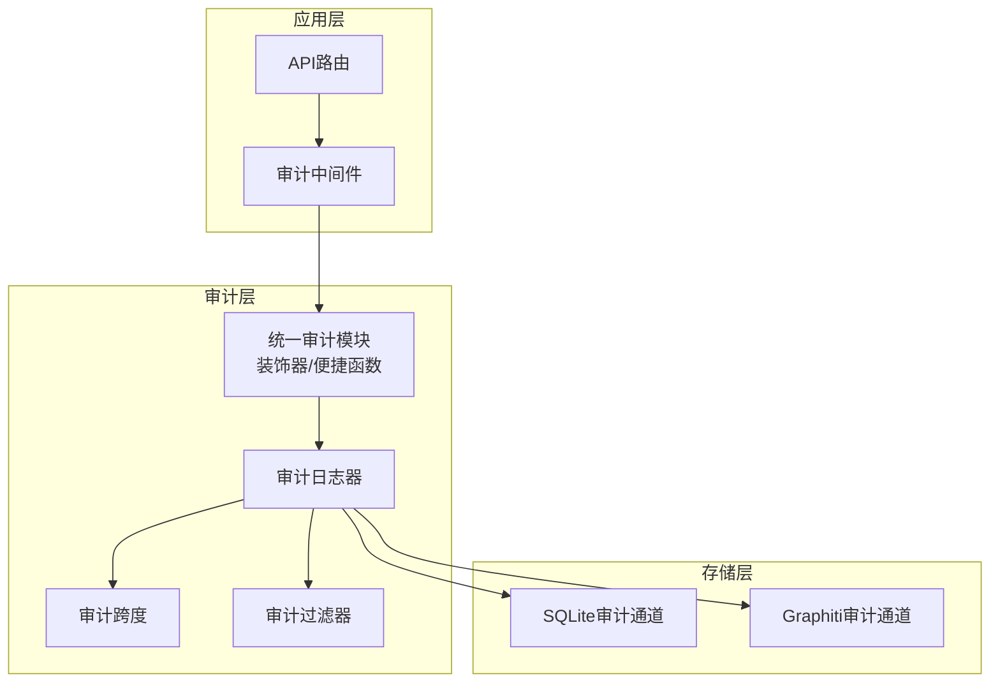
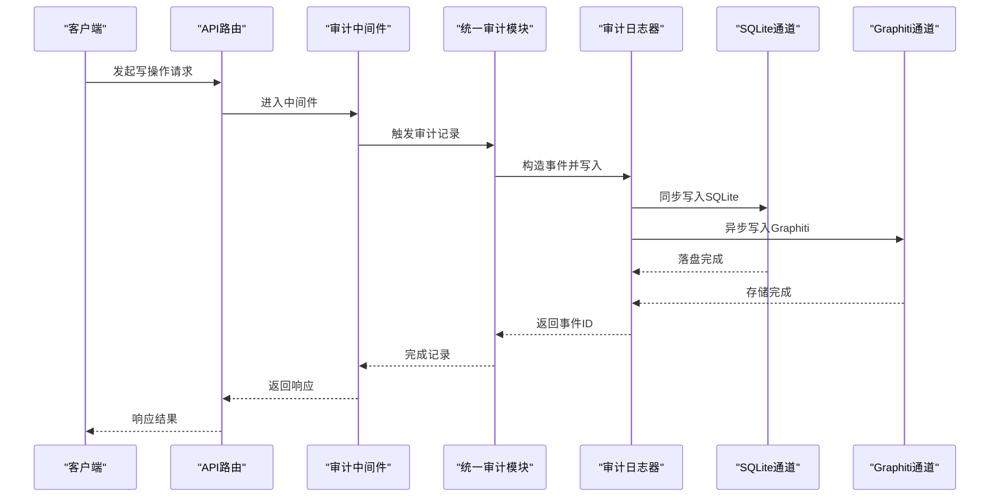
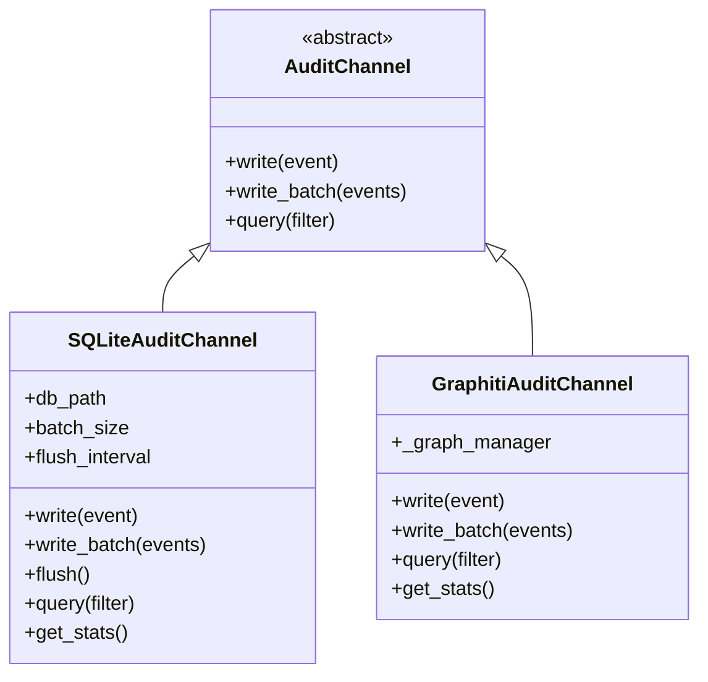
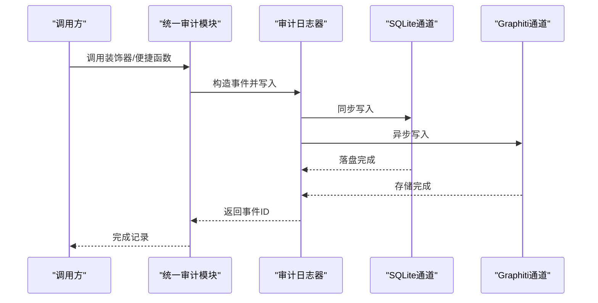
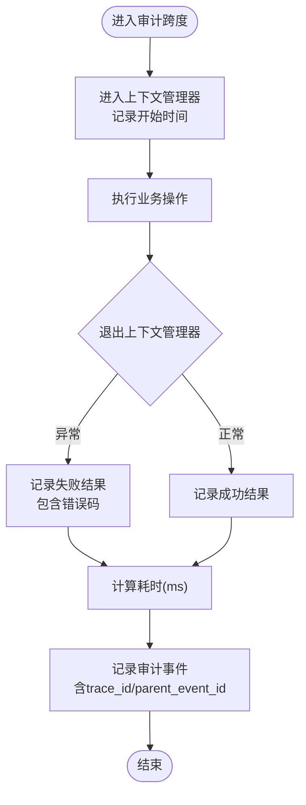
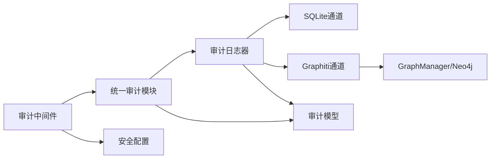

# 审计日志系统

<cite>
**本文引用的文件**
- [设计文档](file://docs/03-modules/audit_log/DESIGN.md)
- [Graphiti集成文档](file://docs/03-modules/audit_log/GRAPHITI_INTEGRATION.md)
- [审计模型](file://odap/infra/security/audit_models.py)
- [审计日志器](file://odap/infra/security/audit_logger.py)
- [SQLite审计通道](file://odap/infra/security/audit_sqlite_channel.py)
- [Graphiti审计通道](file://odap/infra/security/audit_graphiti_channel.py)
- [统一审计模块](file://odap/infra/security/unified_audit.py)
- [审计跨度](file://odap/infra/security/audit_span.py)
- [审计中间件](file://odap/infra/middleware/audit_middleware.py)
- [安全配置](file://odap/infra/security/config.py)
</cite>

## 目录
1. [简介](#简介)
2. [项目结构](#项目结构)
3. [核心组件](#核心组件)
4. [架构总览](#架构总览)
5. [详细组件分析](#详细组件分析)
6. [依赖分析](#依赖分析)
7. [性能考量](#性能考量)
8. [故障排查指南](#故障排查指南)
9. [结论](#结论)
10. [附录](#附录)

## 简介
本文件面向审计日志系统，围绕合规性与可追溯性的目标，系统化阐述审计通道设计、日志格式规范、存储策略、SQLite与Graphiti两种通道的实现差异与适用场景；深入解析审计跨度（Span）在分布式追踪中的作用与性能监控集成；提供配置示例、查询方法与分析工具，并说明与OPA策略的集成思路、实时审计与批量处理的平衡策略。

## 项目结构
审计日志系统位于基础设施层，横切于各业务模块之上，提供统一的审计能力：
- 数据模型与过滤器：定义审计事件、事件类型、严重级别、资源与结果等结构化字段，以及查询过滤器。
- 审计通道：抽象通道接口，分别实现SQLite与Graphiti两种存储后端。
- 审计日志器：封装异步写入、批量聚合、采样、上下文绑定与追踪ID注入。
- 统一审计模块：对外暴露简化的装饰器与便捷函数，兼顾标准日志与Graphiti主存储。
- 审计中间件：自动拦截写操作，补充追踪ID与用户信息，触发审计记录。
- 审计跨度：用于追踪耗时操作，支持嵌套与因果链，便于性能分析与问题定位。

**图表来源**
- [审计中间件:51-112](file://odap/infra/middleware/audit_middleware.py#L51-L112)
- [统一审计模块:89-340](file://odap/infra/security/unified_audit.py#L89-L340)
- [审计日志器:19-262](file://odap/infra/security/audit_logger.py#L19-L262)
- [审计跨度:16-200](file://odap/infra/security/audit_span.py#L16-L200)
- [SQLite审计通道:36-449](file://odap/infra/security/audit_sqlite_channel.py#L36-L449)
- [Graphiti审计通道:15-314](file://odap/infra/security/audit_graphiti_channel.py#L15-L314)

**章节来源**
- [设计文档:24-38](file://docs/03-modules/audit_log/DESIGN.md#L24-L38)
- [统一审计模块:89-340](file://odap/infra/security/unified_audit.py#L89-L340)
- [审计中间件:51-112](file://odap/infra/middleware/audit_middleware.py#L51-L112)

## 核心组件
- 审计事件模型：包含事件ID、时间戳、事件类型、严重级别、来源、操作者、动作、资源、结果、上下文、工作空间ID、追踪ID、父事件ID、耗时、校验与签名等字段，满足合规与可追溯需求。
- 审计通道：抽象接口定义写入、批量写入与查询；SQLite通道提供WAL模式、批量缓冲与校验链；Graphiti通道将审计日志作为本体实体与关系存储，支持图遍历与时态分析。
- 审计日志器：异步写入、批量聚合、采样、自动填充上下文与追踪ID，支持便捷的错误/成功记录方法。
- 统一审计模块：提供装饰器与便捷函数，同时记录到标准日志与Graphiti主存储，简化API调用。
- 审计中间件：自动拦截写操作，提取用户与追踪ID，触发审计记录。
- 审计跨度：用于追踪耗时操作，支持嵌套与因果链，便于性能分析与问题定位。

**章节来源**
- [审计模型:110-148](file://odap/infra/security/audit_models.py#L110-L148)
- [审计通道接口:17-34](file://odap/infra/security/audit_sqlite_channel.py#L17-L34)
- [SQLite通道实现:36-449](file://odap/infra/security/audit_sqlite_channel.py#L36-L449)
- [Graphiti通道实现:15-314](file://odap/infra/security/audit_graphiti_channel.py#L15-L314)
- [审计日志器:19-262](file://odap/infra/security/audit_logger.py#L19-L262)
- [统一审计模块:89-340](file://odap/infra/security/unified_audit.py#L89-L340)
- [审计中间件:51-112](file://odap/infra/middleware/audit_middleware.py#L51-L112)
- [审计跨度:16-200](file://odap/infra/security/audit_span.py#L16-L200)

## 架构总览
审计系统遵循“横切关注点”原则，贯穿应用层、审计层与存储层：
- 应用层通过中间件与装饰器自动触发审计；
- 审计层负责事件构造、上下文注入、采样与写入；
- 存储层提供SQLite主存储与Graphiti补充存储，满足不同场景的查询与分析需求。

**图表来源**
- [审计中间件:51-112](file://odap/infra/middleware/audit_middleware.py#L51-L112)
- [统一审计模块:89-340](file://odap/infra/security/unified_audit.py#L89-L340)
- [审计日志器:19-262](file://odap/infra/security/audit_logger.py#L19-L262)
- [SQLite审计通道:108-140](file://odap/infra/security/audit_sqlite_channel.py#L108-L140)
- [Graphiti审计通道:45-97](file://odap/infra/security/audit_graphiti_channel.py#L45-L97)

## 详细组件分析

### 审计通道：SQLite通道 vs Graphiti通道
- SQLite通道
  - 设计要点：WAL模式提升并发；批量缓冲与定时刷新；JSON字段序列化；校验链保证不可篡改。
  - 存储策略：关系表结构，建立多字段索引；支持SQL查询与分页；适合标准审计、合规要求与防篡改场景。
  - 性能特征：异步写入+批量落盘，吞吐量高；查询延迟低；可靠性高（WAL+同步写入）。
- Graphiti通道
  - 设计要点：将审计日志作为本体实体（AuditLog）与相关实体（用户、资源、服务）建立关系（EXECUTED/AFFECTED/GENERATED），支持图遍历与时态查询。
  - 存储策略：复用Neo4j持久化；提供Cypher查询与搜索功能；适合图分析、时态查询与多本体关联场景。
  - 性能特征：异步写入；可结合缓存与索引优化；查询能力更强但需考虑图遍历成本。

**图表来源**
- [审计通道接口:17-34](file://odap/infra/security/audit_sqlite_channel.py#L17-L34)
- [SQLite通道实现:36-449](file://odap/infra/security/audit_sqlite_channel.py#L36-L449)
- [Graphiti通道实现:15-314](file://odap/infra/security/audit_graphiti_channel.py#L15-L314)

**章节来源**
- [设计文档:274-320](file://docs/03-modules/audit_log/DESIGN.md#L274-L320)
- [SQLite通道实现:36-449](file://odap/infra/security/audit_sqlite_channel.py#L36-L449)
- [Graphiti通道实现:15-314](file://odap/infra/security/audit_graphiti_channel.py#L15-L314)
- [Graphiti集成文档:27-112](file://docs/03-modules/audit_log/GRAPHITI_INTEGRATION.md#L27-L112)

### 审计日志器与统一审计模块
- 审计日志器：支持异步/同步写入、批量聚合、便捷的错误/成功记录方法；自动填充追踪ID、工作空间ID与上下文；提供查询与统计接口。
- 统一审计模块：提供装饰器与便捷函数，同时记录到标准日志与Graphiti主存储；简化API调用，保留向后兼容。

**图表来源**
- [统一审计模块:89-340](file://odap/infra/security/unified_audit.py#L89-L340)
- [审计日志器:19-262](file://odap/infra/security/audit_logger.py#L19-L262)
- [SQLite审计通道:108-140](file://odap/infra/security/audit_sqlite_channel.py#L108-L140)
- [Graphiti审计通道:45-97](file://odap/infra/security/audit_graphiti_channel.py#L45-L97)

**章节来源**
- [审计日志器:19-262](file://odap/infra/security/audit_logger.py#L19-L262)
- [统一审计模块:89-340](file://odap/infra/security/unified_audit.py#L89-L340)

### 审计跨度（Span）与分布式追踪
- 审计跨度：自动记录开始/结束时间，计算耗时，支持嵌套与因果链；可设置结果与上下文；在上下文退出时自动记录审计事件。
- 分布式追踪：统一审计模块与中间件注入追踪ID；审计跨度可继承追踪ID与父事件ID，形成跨服务的追踪链。
- 性能监控：通过耗时字段与查询过滤器，支持性能分析与瓶颈定位。

**图表来源**
- [审计跨度:124-156](file://odap/infra/security/audit_span.py#L124-L156)

**章节来源**
- [审计跨度:16-200](file://odap/infra/security/audit_span.py#L16-L200)
- [统一审计模块:89-166](file://odap/infra/security/unified_audit.py#L89-L166)
- [审计中间件:72-78](file://odap/infra/middleware/audit_middleware.py#L72-L78)

### 查询与可视化接口
- REST API：提供审计事件查询、事件详情、时间线视图、追踪链查询、统计与导出等接口。
- 查询过滤器：支持时间范围、事件类型、严重级别、操作者、资源、工作空间、追踪ID、结果状态与关键词搜索；支持分页与排序。
- 统一查询：统一审计模块提供简化查询函数，支持按用户、服务、动作过滤。

**章节来源**
- [设计文档:405-437](file://docs/03-modules/audit_log/DESIGN.md#L405-L437)
- [统一审计模块:342-377](file://odap/infra/security/unified_audit.py#L342-L377)

### 防篡改设计
- 校验链：每个事件记录时计算校验和，形成链式校验，任何篡改都能被检测；SQLite通道提供校验和字段与完整性报告。
- 防篡改策略：WAL模式与同步写入（CRITICAL级别）提升可靠性；校验和与签名字段预留。

**章节来源**
- [设计文档:441-470](file://docs/03-modules/audit_log/DESIGN.md#L441-L470)
- [SQLite通道实现:322-351](file://odap/infra/security/audit_sqlite_channel.py#L322-L351)

### 与OPA策略的集成
- 策略执行与审计：OPA策略执行结果可作为审计事件的上下文或结果字段，便于合规审计与追溯。
- Fail-Close与审计：策略拒绝时记录审计事件，包含策略包名、输入摘要、允许状态与执行时间，支持统计与告警。
- 集成建议：在策略检查前后记录审计事件，确保所有策略决策过程可追溯。

**章节来源**
- [设计文档:474-511](file://docs/03-modules/audit_log/DESIGN.md#L474-L511)
- [OPA设计文档:23-642](file://docs/03-modules/opa_policy/DESIGN.md#L23-L642)

## 依赖分析
- 组件耦合：审计日志器依赖通道接口；统一审计模块依赖通道与模型；中间件依赖统一审计模块；跨度依赖日志器。
- 外部依赖：Graphiti通道依赖GraphManager与Neo4j驱动；SQLite通道依赖sqlite3与json；中间件依赖JWT解码。
- 循环依赖：当前实现未发现循环依赖，模块边界清晰。

**图表来源**
- [审计中间件:51-112](file://odap/infra/middleware/audit_middleware.py#L51-L112)
- [统一审计模块:89-340](file://odap/infra/security/unified_audit.py#L89-L340)
- [审计日志器:19-262](file://odap/infra/security/audit_logger.py#L19-L262)
- [SQLite审计通道:36-449](file://odap/infra/security/audit_sqlite_channel.py#L36-L449)
- [Graphiti审计通道:15-314](file://odap/infra/security/audit_graphiti_channel.py#L15-L314)
- [安全配置:29-79](file://odap/infra/security/config.py#L29-L79)

**章节来源**
- [审计中间件:51-112](file://odap/infra/middleware/audit_middleware.py#L51-L112)
- [统一审计模块:89-340](file://odap/infra/security/unified_audit.py#L89-L340)
- [审计日志器:19-262](file://odap/infra/security/audit_logger.py#L19-L262)
- [SQLite审计通道:36-449](file://odap/infra/security/audit_sqlite_channel.py#L36-L449)
- [Graphiti审计通道:15-314](file://odap/infra/security/audit_graphiti_channel.py#L15-L314)
- [安全配置:29-79](file://odap/infra/security/config.py#L29-L79)

## 性能考量
- 写入延迟：<5ms（异步）；内存通道缓冲+批量落盘；WAL模式提升并发。
- 查询延迟：<200ms（P95）；分区索引+时间范围剪枝。
- 吞吐量：>10K events/s；批量写入+WAL模式。
- 存储效率：压缩率>60%；JSON列压缩+冷数据归档。
- 可靠性：零丢失；WAL+同步写入（CRITICAL级别）。
- Graphiti通道：异步存储、缓存机制、索引优化、批量处理与异步存储。

**章节来源**
- [设计文档:514-523](file://docs/03-modules/audit_log/DESIGN.md#L514-L523)
- [Graphiti集成文档:246-251](file://docs/03-modules/audit_log/GRAPHITI_INTEGRATION.md#L246-L251)

## 故障排查指南
- 中间件无法记录：检查排除路径与方法类型；确认JWT解码与用户提取逻辑。
- SQLite通道写入失败：检查数据库路径、WAL模式与索引；查看批量刷新与异常回滚。
- Graphiti通道写入失败：检查GraphManager初始化与Neo4j驱动；确认实体与关系创建。
- 统一审计模块异常：检查通道实例与同步协程执行；查看日志输出与异常捕获。
- 查询结果为空：核对过滤条件与索引；确认时间范围与关键字匹配。

**章节来源**
- [审计中间件:51-112](file://odap/infra/middleware/audit_middleware.py#L51-L112)
- [SQLite审计通道:108-140](file://odap/infra/security/audit_sqlite_channel.py#L108-L140)
- [Graphiti审计通道:45-97](file://odap/infra/security/audit_graphiti_channel.py#L45-L97)
- [统一审计模块:89-340](file://odap/infra/security/unified_audit.py#L89-L340)

## 结论
审计日志系统通过统一的事件模型、通道抽象与中间件/装饰器自动拦截，实现了高可靠、可追溯与合规的审计能力。SQLite通道满足标准审计与防篡改需求，Graphiti通道提供图分析与时态查询能力。审计跨度与分布式追踪集成，配合查询与统计接口，为性能监控与问题定位提供支撑。与OPA策略的集成进一步强化了合规与可追溯性。通过合理配置与查询策略，可在实时审计与批量处理之间取得平衡。

## 附录

### 配置示例
- 安全配置：Neo4j连接、JWT密钥、日志级别与文件等。
- 中间件：排除路径与方法类型、追踪ID注入与用户提取。
- 统一审计：装饰器与便捷函数的使用方式与参数。

**章节来源**
- [安全配置:29-79](file://odap/infra/security/config.py#L29-L79)
- [审计中间件:51-112](file://odap/infra/middleware/audit_middleware.py#L51-L112)
- [统一审计模块:89-340](file://odap/infra/security/unified_audit.py#L89-L340)

### 查询方法与分析工具
- REST API：事件查询、详情、时间线、追踪链、统计与导出。
- 过滤器：时间范围、事件类型、严重级别、操作者、资源、工作空间、追踪ID、结果状态与关键词搜索。
- 分析工具：基于SQLite的SQL查询与索引优化；基于Graphiti的Cypher查询与图遍历。

**章节来源**
- [设计文档:405-437](file://docs/03-modules/audit_log/DESIGN.md#L405-L437)
- [SQLite审计通道:195-320](file://odap/infra/security/audit_sqlite_channel.py#L195-L320)
- [Graphiti审计通道:172-242](file://odap/infra/security/audit_graphiti_channel.py#L172-L242)

### 实时审计与批量处理的平衡策略
- 实时审计：中间件与装饰器自动拦截写操作，确保关键操作可追溯。
- 批量处理：通道批量缓冲与定时刷新，降低I/O开销；Graphiti通道异步写入，避免阻塞业务线程。
- 采样策略：DEBUG级别可采样，减少冗余日志；重要事件强制记录。
- 存储策略：SQLite主存储满足合规与防篡改；Graphiti补充存储满足图分析与时态查询。

**章节来源**
- [设计文档:160-223](file://docs/03-modules/audit_log/DESIGN.md#L160-L223)
- [统一审计模块:89-340](file://odap/infra/security/unified_audit.py#L89-L340)
- [审计中间件:51-112](file://odap/infra/middleware/audit_middleware.py#L51-L112)