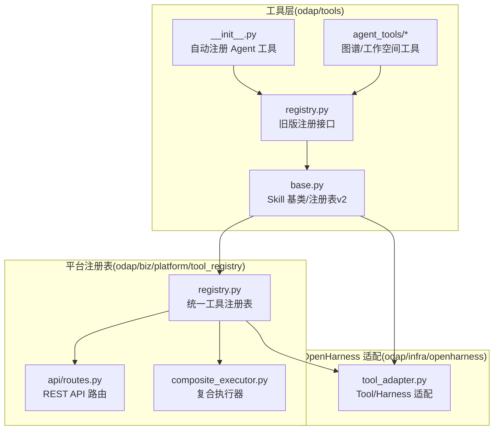
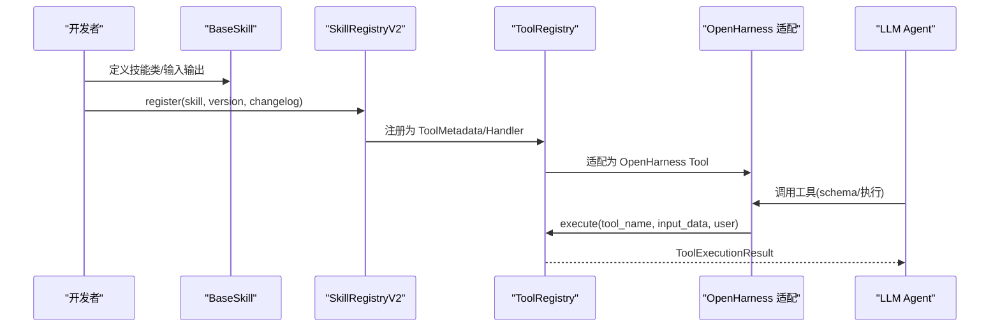
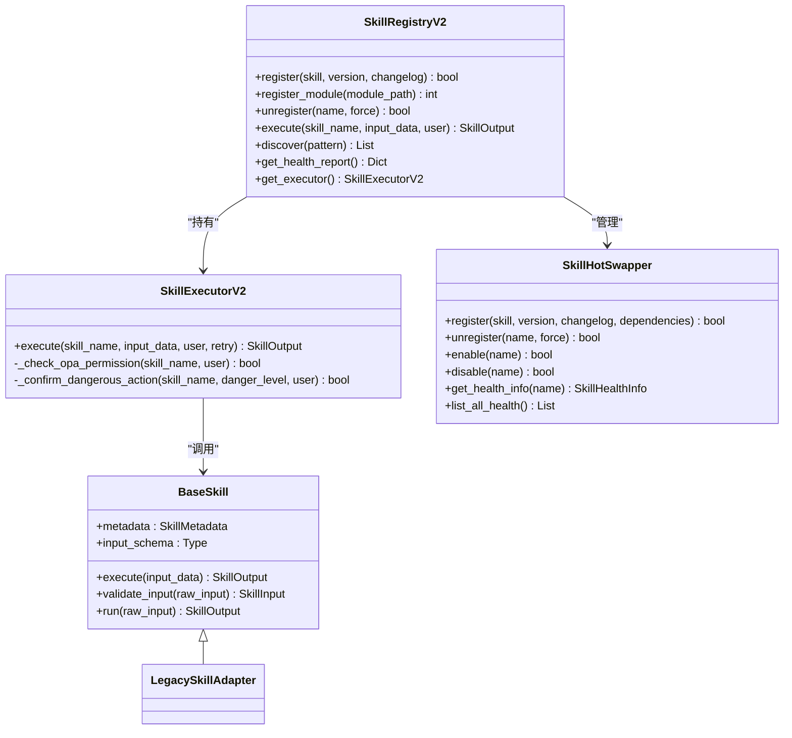
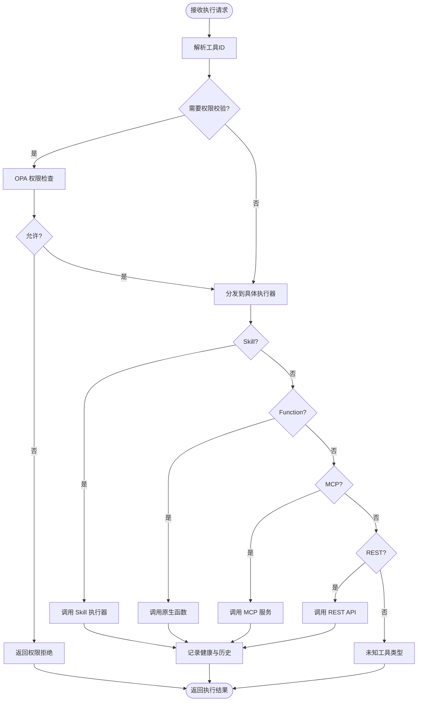
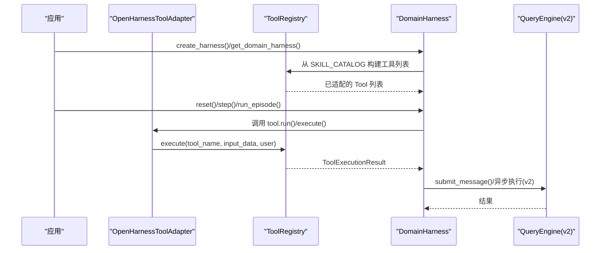
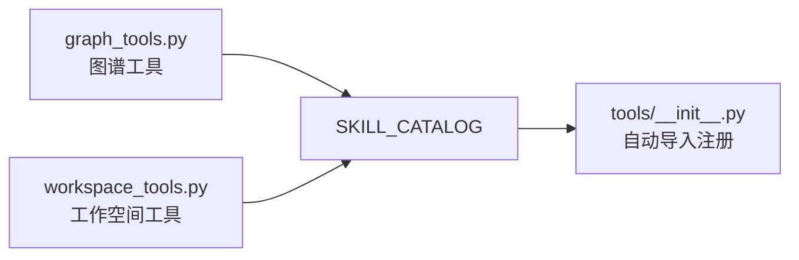
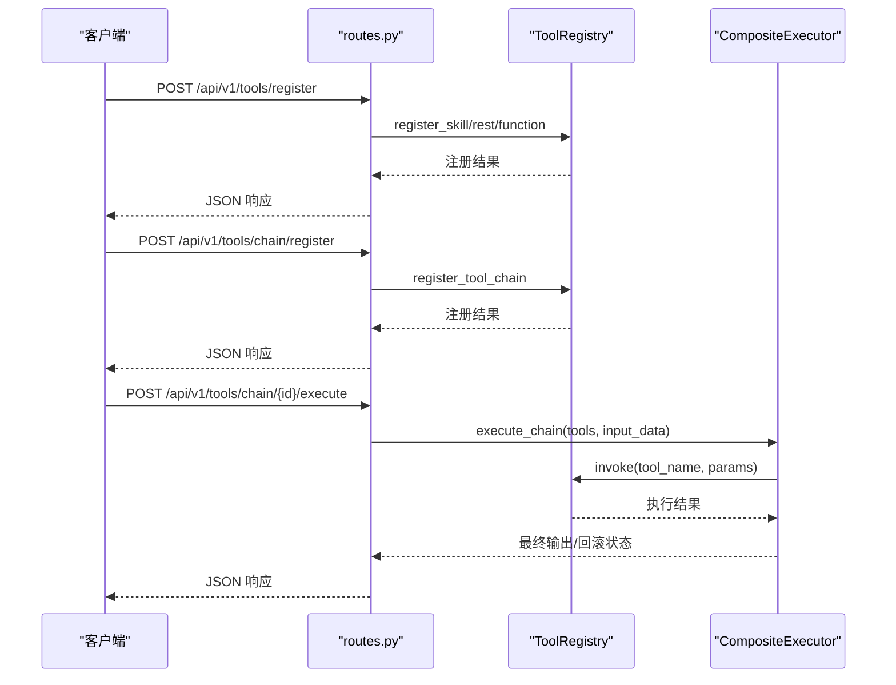
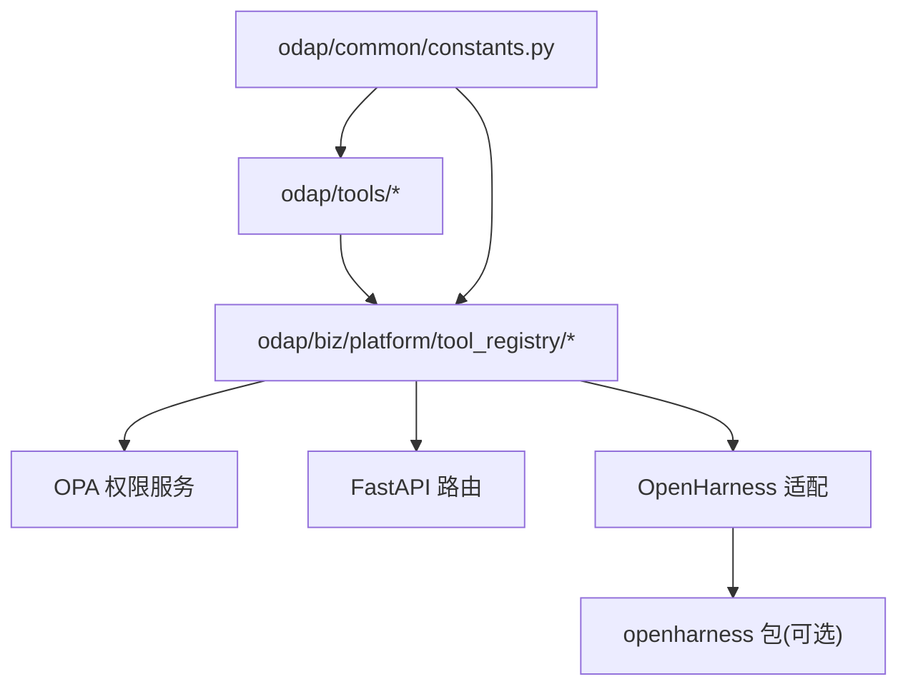

# L2 领域工具层

<cite>
**本文引用的文件**
- [odap/tools/base.py](file://odap/tools/base.py)
- [odap/tools/registry.py](file://odap/tools/registry.py)
- [odap/tools/__init__.py](file://odap/tools/__init__.py)
- [odap/biz/platform/tool_registry/registry.py](file://odap/biz/platform/tool_registry/registry.py)
- [odap/biz/platform/tool_registry/api/routes.py](file://odap/biz/platform/tool_registry/api/routes.py)
- [odap/biz/platform/tool_registry/composite_executor.py](file://odap/biz/platform/tool_registry/composite_executor.py)
- [odap/infra/openharness/tool_adapter.py](file://odap/infra/openharness/tool_adapter.py)
- [odap/tools/agent_tools/graph_tools.py](file://odap/tools/agent_tools/graph_tools.py)
- [odap/tools/agent_tools/workspace_tools.py](file://odap/tools/agent_tools/workspace_tools.py)
- [odap/common/constants.py](file://odap/common/constants.py)
</cite>

## 目录
1. [简介](#简介)
2. [项目结构](#项目结构)
3. [核心组件](#核心组件)
4. [架构总览](#架构总览)
5. [详细组件分析](#详细组件分析)
6. [依赖分析](#依赖分析)
7. [性能考虑](#性能考虑)
8. [故障排查指南](#故障排查指南)
9. [结论](#结论)
10. [附录](#附录)

## 简介
本文件面向 ODAP 平台 L2 领域工具层，系统性阐述 Python Skills 的架构设计与可插拔特性，详解工具注册表工作机制、工具基类设计模式与生命周期管理，说明领域工具如何作为原生 Tool 接口接入 OpenHarness，并实现领域特定的功能扩展。文档同时覆盖工具开发规范、注册流程、依赖管理与性能优化策略，并提供开发示例与集成指南。

## 项目结构
领域工具层位于 odap/tools 与 odap/biz/platform/tool_registry 两大子系统中：
- odap/tools：提供 Skill 基类、输入输出模型、注册表与各类领域工具（Agent 工具、分析工具等），并内置自动注册机制。
- odap/biz/platform/tool_registry：统一工具注册表，支持 Skill、MCP、REST、Function 四类工具，提供发现、执行、健康监控、工具链编排与 API 路由。
- odap/infra/openharness：OpenHarness 适配层，将 ODAP 的 BaseSkill 适配为 OpenHarness Tool/Harness，打通 LLM Agent Loop。
- odap/common：通用常量与状态码定义，支撑跨模块一致性。

**图表来源**
- [odap/tools/base.py:1-720](file://odap/tools/base.py#L1-L720)
- [odap/tools/registry.py:1-53](file://odap/tools/registry.py#L1-L53)
- [odap/tools/__init__.py:1-35](file://odap/tools/__init__.py#L1-L35)
- [odap/biz/platform/tool_registry/registry.py:1-1000](file://odap/biz/platform/tool_registry/registry.py#L1-L1000)
- [odap/biz/platform/tool_registry/api/routes.py:1-310](file://odap/biz/platform/tool_registry/api/routes.py#L1-L310)
- [odap/biz/platform/tool_registry/composite_executor.py:1-93](file://odap/biz/platform/tool_registry/composite_executor.py#L1-L93)
- [odap/infra/openharness/tool_adapter.py:1-488](file://odap/infra/openharness/tool_adapter.py#L1-L488)

**章节来源**
- [odap/tools/base.py:1-720](file://odap/tools/base.py#L1-L720)
- [odap/tools/registry.py:1-53](file://odap/tools/registry.py#L1-L53)
- [odap/tools/__init__.py:1-35](file://odap/tools/__init__.py#L1-L35)
- [odap/biz/platform/tool_registry/registry.py:1-1000](file://odap/biz/platform/tool_registry/registry.py#L1-L1000)
- [odap/biz/platform/tool_registry/api/routes.py:1-310](file://odap/biz/platform/tool_registry/api/routes.py#L1-L310)
- [odap/biz/platform/tool_registry/composite_executor.py:1-93](file://odap/biz/platform/tool_registry/composite_executor.py#L1-L93)
- [odap/infra/openharness/tool_adapter.py:1-488](file://odap/infra/openharness/tool_adapter.py#L1-L488)

## 核心组件
- Skill 基类与输入输出模型：提供统一抽象、标准化输出信封、输入校验与执行计时。
- 注册表 v2：支持热插拔、版本管理、健康监控、OPA 权限桥接与执行器。
- 统一工具注册表：统一管理 Skill/MCP/REST/Function，提供发现、执行、工具链与健康报告。
- OpenHarness 适配：将 BaseSkill 适配为 OpenHarness Tool/Harness，暴露给 LLM Agent Loop。
- 领域工具集：Agent 工具（图谱/工作空间）、分析/可视化/规划/政策等工具模块。

**章节来源**
- [odap/tools/base.py:31-161](file://odap/tools/base.py#L31-L161)
- [odap/tools/base.py:599-720](file://odap/tools/base.py#L599-L720)
- [odap/biz/platform/tool_registry/registry.py:403-800](file://odap/biz/platform/tool_registry/registry.py#L403-L800)
- [odap/infra/openharness/tool_adapter.py:83-402](file://odap/infra/openharness/tool_adapter.py#L83-L402)

## 架构总览
ODAP 领域工具层通过“工具基类 + 注册表 + 统一注册表 + OpenHarness 适配”的分层设计，实现：
- 可插拔：支持动态加载模块中的所有 BaseSkill 子类，热插拔与版本管理。
- 可发现：基于语义标签、能力、分类与关键字的多维发现。
- 可编排：工具链编排与回滚执行器，保障复杂流程的可靠性。
- 可治理：OPA 权限桥接、健康监控与告警阈值。
- 可集成：无缝对接 OpenHarness，将领域技能暴露为原生 Tool。

**图表来源**
- [odap/tools/base.py:599-720](file://odap/tools/base.py#L599-L720)
- [odap/biz/platform/tool_registry/registry.py:403-800](file://odap/biz/platform/tool_registry/registry.py#L403-L800)
- [odap/infra/openharness/tool_adapter.py:83-402](file://odap/infra/openharness/tool_adapter.py#L83-L402)

## 详细组件分析

### 组件A：Skill 基类与注册表 v2
- 设计要点
  - 标准化输入输出：SkillInput/SkillOutput 提供统一契约；输出包含 success/data/error/skill_name/execution_time/request_id。
  - 可选基类：BaseSkill 为可选升级，旧式裸函数通过 LegacySkillAdapter 兼容。
  - v2 增强：状态枚举、版本管理、健康监控、热插拔、执行器与 OPA 权限桥接。
- 生命周期
  - 注册：通过 SkillRegistryV2.register/module 加载；支持动态模块扫描。
  - 执行：SkillExecutorV2.execute，含 OPA 权限检查、危险级别确认、重试与健康指标更新。
  - 卸载/启停：SkillHotSwapper 支持禁用/启用/强制卸载。
- 性能与安全
  - 执行计时与平均耗时统计；重试次数与延迟可配置；危险级别需确认或管理员角色。
  - OPA 权限检查可选，按元数据 opa_action 与 requires_opa_check 控制。

**图表来源**
- [odap/tools/base.py:64-230](file://odap/tools/base.py#L64-L230)
- [odap/tools/base.py:362-597](file://odap/tools/base.py#L362-L597)
- [odap/tools/base.py:599-720](file://odap/tools/base.py#L599-L720)

**章节来源**
- [odap/tools/base.py:31-161](file://odap/tools/base.py#L31-L161)
- [odap/tools/base.py:239-296](file://odap/tools/base.py#L239-L296)
- [odap/tools/base.py:307-597](file://odap/tools/base.py#L307-L597)
- [odap/tools/base.py:599-720](file://odap/tools/base.py#L599-L720)

### 组件B：统一工具注册表（ToolRegistry）
- 能力范围
  - 管理四类工具：Skill、MCP、REST、Function；统一元数据 ToolMetadata 与 ToolRegistration。
  - 语义发现：基于名称、描述、标签、能力与关键字的综合检索。
  - 健康监控：记录调用次数、成功率、平均耗时与告警阈值。
  - 工具链：Step 映射、条件判断、上下文传递与失败回滚。
- 执行流程
  - 权限检查（OPA）→ 分发到具体执行器（Skill/Function/MCP/REST）→ 更新健康与历史 → 返回 ToolExecutionResult。

**图表来源**
- [odap/biz/platform/tool_registry/registry.py:579-663](file://odap/biz/platform/tool_registry/registry.py#L579-L663)
- [odap/biz/platform/tool_registry/registry.py:773-800](file://odap/biz/platform/tool_registry/registry.py#L773-L800)

**章节来源**
- [odap/biz/platform/tool_registry/registry.py:403-800](file://odap/biz/platform/tool_registry/registry.py#L403-L800)
- [odap/biz/platform/tool_registry/registry.py:216-394](file://odap/biz/platform/tool_registry/registry.py#L216-L394)

### 组件C：OpenHarness 适配（OpenHarnessToolAdapter / DomainHarness）
- 适配目标
  - 将 BaseSkill/裸函数适配为 OpenHarness Tool，兼容 v1 与 v2 接口。
  - DomainHarness 将所有已注册 Skill 暴露为工具，支持 episode 循环、奖励与历史记录。
- 集成要点
  - 自动导入 openharness 包，优先 v2；失败回退至模拟模式。
  - 生成 OpenAI function calling schema，便于 LLM 函数调用。
  - 支持异步 QueryEngine（v2）与同步执行（v1）。

**图表来源**
- [odap/infra/openharness/tool_adapter.py:217-402](file://odap/infra/openharness/tool_adapter.py#L217-L402)
- [odap/infra/openharness/tool_adapter.py:83-194](file://odap/infra/openharness/tool_adapter.py#L83-L194)
- [odap/biz/platform/tool_registry/registry.py:579-663](file://odap/biz/platform/tool_registry/registry.py#L579-L663)

**章节来源**
- [odap/infra/openharness/tool_adapter.py:1-488](file://odap/infra/openharness/tool_adapter.py#L1-L488)

### 组件D：领域工具（Agent 工具）
- 图谱工具：实体查询、关系查询、图谱分析、全文搜索、实体详情。
- 工作空间工具：工作空间列表、详情查询、摘要报告。
- 注册机制：通过 register_skill 写入 SKILL_CATALOG，自动在工具包初始化时导入并注册。

**图表来源**
- [odap/tools/agent_tools/graph_tools.py:1-198](file://odap/tools/agent_tools/graph_tools.py#L1-L198)
- [odap/tools/agent_tools/workspace_tools.py:1-135](file://odap/tools/agent_tools/workspace_tools.py#L1-L135)
- [odap/tools/__init__.py:10-25](file://odap/tools/__init__.py#L10-L25)

**章节来源**
- [odap/tools/agent_tools/graph_tools.py:1-198](file://odap/tools/agent_tools/graph_tools.py#L1-L198)
- [odap/tools/agent_tools/workspace_tools.py:1-135](file://odap/tools/agent_tools/workspace_tools.py#L1-L135)
- [odap/tools/__init__.py:10-25](file://odap/tools/__init__.py#L10-L25)

### 组件E：工具注册表 API 与复合执行器
- API 路由：提供工具注册、发现、执行、工具链注册/执行、健康报告与执行历史查询。
- 复合执行器：顺序执行工具链，支持每步回滚函数，异常即回滚并返回失败信息。

**图表来源**
- [odap/biz/platform/tool_registry/api/routes.py:75-232](file://odap/biz/platform/tool_registry/api/routes.py#L75-L232)
- [odap/biz/platform/tool_registry/composite_executor.py:7-93](file://odap/biz/platform/tool_registry/composite_executor.py#L7-L93)

**章节来源**
- [odap/biz/platform/tool_registry/api/routes.py:1-310](file://odap/biz/platform/tool_registry/api/routes.py#L1-L310)
- [odap/biz/platform/tool_registry/composite_executor.py:1-93](file://odap/biz/platform/tool_registry/composite_executor.py#L1-L93)

## 依赖分析
- 模块耦合
  - odap/tools 与 odap/biz/platform/tool_registry：前者提供技能与注册表，后者统一管理与对外服务。
  - odap/infra/openharness：依赖 openharness 包，适配工具与 Harness。
  - odap/common：提供通用常量与状态码，被上层模块引用。
- 外部依赖
  - openharness（可选）：v1 或 v2，若不可用则进入模拟模式。
  - FastAPI：统一注册表 API 路由。
  - OPA：权限检查（可选）。

**图表来源**
- [odap/biz/platform/tool_registry/registry.py:43-47](file://odap/biz/platform/tool_registry/registry.py#L43-L47)
- [odap/infra/openharness/tool_adapter.py:38-77](file://odap/infra/openharness/tool_adapter.py#L38-L77)
- [odap/common/constants.py:1-56](file://odap/common/constants.py#L1-L56)

**章节来源**
- [odap/biz/platform/tool_registry/registry.py:1-100](file://odap/biz/platform/tool_registry/registry.py#L1-L100)
- [odap/infra/openharness/tool_adapter.py:1-77](file://odap/infra/openharness/tool_adapter.py#L1-L77)
- [odap/common/constants.py:1-56](file://odap/common/constants.py#L1-L56)

## 性能考虑
- 执行计时与统计：技能执行耗时、平均耗时、成功率与失败率，便于健康监控与性能优化。
- 重试机制：可配置重试次数与延迟，降低瞬时故障影响。
- 异步执行：v2 QueryEngine 支持异步消息提交，提升吞吐。
- 健康阈值：错误率与平均延迟阈值触发降级/告警，保障系统稳定性。
- 工具链回滚：失败即回滚，避免状态污染。

[本节为通用指导，无需特定文件引用]

## 故障排查指南
- OpenHarness 未安装
  - 现象：提示未安装或导入失败，进入模拟模式。
  - 处理：安装 openharness 或在容器中正确挂载源码路径。
- 权限拒绝
  - 现象：执行返回 Permission denied。
  - 处理：检查 requires_opa_check 与 opa_action，确保用户角色具备相应权限。
- 工具不存在
  - 现象：执行报错 Tool not found。
  - 处理：确认工具名与注册表一致，或使用 discover 接口验证。
- 执行历史与健康报告
  - 使用 /api/v1/tools/history 与 /api/v1/tools/health 获取最近执行与整体健康状况。
- 常量与状态码
  - 使用 odap/common/constants.py 中的 HTTPStatus/ErrorCode 保证响应一致性。

**章节来源**
- [odap/infra/openharness/tool_adapter.py:38-77](file://odap/infra/openharness/tool_adapter.py#L38-L77)
- [odap/biz/platform/tool_registry/registry.py:579-663](file://odap/biz/platform/tool_registry/registry.py#L579-L663)
- [odap/biz/platform/tool_registry/api/routes.py:273-299](file://odap/biz/platform/tool_registry/api/routes.py#L273-L299)
- [odap/common/constants.py:14-37](file://odap/common/constants.py#L14-L37)

## 结论
ODAP 平台 L2 领域工具层通过“技能基类 + 注册表 v2 + 统一注册表 + OpenHarness 适配”的架构，实现了领域工具的可插拔、可发现、可编排与可治理。结合 OPA 权限与健康监控，既能满足复杂业务场景下的功能扩展，又能保障系统的安全性与稳定性。建议在实际开发中遵循统一的输入输出契约、严格的权限标注与版本管理，充分利用工具链与 API 能力，实现端到端的领域智能应用。

[本节为总结，无需特定文件引用]

## 附录

### 开发规范与最佳实践
- 输入输出契约
  - 使用 SkillInput/SkillOutput，确保输出包含 success/data/error/skill_name/execution_time/request_id。
  - 输入 schema 通过 input_schema 字段声明，便于自动校验与文档生成。
- 元数据与分类
  - 在 metadata 中明确 name/description/category/danger_level/version/opa_action/require_opa_check。
  - 分类建议参考 intelligence/operations/analysis/recommendation/visualization/planning/policy/computation/ontology/task_management。
- 权限与安全
  - 对高危操作设置 danger_level，并在需要时开启 requires_opa_check 与 opa_action。
  - 危险级别为 high/critical 时，需管理员角色或用户确认。
- 版本与热插拔
  - 使用 SkillRegistryV2.register 注册，支持版本管理与热插拔。
  - 卸载需谨慎，force=true 仅在无调用时使用。
- OpenHarness 集成
  - 优先使用 BaseSkill，适配器自动兼容旧式裸函数。
  - 导出 OpenAI function schema，便于 LLM 函数调用。

**章节来源**
- [odap/tools/base.py:38-58](file://odap/tools/base.py#L38-L58)
- [odap/tools/base.py:64-111](file://odap/tools/base.py#L64-L111)
- [odap/tools/base.py:511-519](file://odap/tools/base.py#L511-L519)
- [odap/infra/openharness/tool_adapter.py:83-194](file://odap/infra/openharness/tool_adapter.py#L83-L194)

### 注册流程与依赖管理
- 旧式注册
  - 通过 register_skill 写入 SKILL_CATALOG，并同步注册到 SkillRegistry。
- 新式注册
  - 使用 SkillRegistryV2.register 或 register_module 动态加载模块内所有 BaseSkill 子类。
- 依赖管理
  - 通过 SkillRegistration.dependencies 声明依赖，确保加载顺序与可用性。
  - 统一注册表支持 MCP/REST/Function 注册，便于跨系统集成。

**章节来源**
- [odap/tools/registry.py:26-38](file://odap/tools/registry.py#L26-L38)
- [odap/tools/base.py:616-644](file://odap/tools/base.py#L616-L644)
- [odap/biz/platform/tool_registry/registry.py:426-537](file://odap/biz/platform/tool_registry/registry.py#L426-L537)

### 性能优化策略
- 执行优化
  - 合理设置重试次数与延迟，避免雪崩效应。
  - 对高延迟工具启用缓存或预热，减少首次调用开销。
- 健康与告警
  - 设置合理的错误率与延迟阈值，及时发现与隔离问题工具。
- 工具链优化
  - 使用工具链条件判断与映射，减少无效调用。
  - 失败回滚保障幂等性，避免资源泄漏。

**章节来源**
- [odap/tools/base.py:464-566](file://odap/tools/base.py#L464-L566)
- [odap/biz/platform/tool_registry/registry.py:304-401](file://odap/biz/platform/tool_registry/registry.py#L304-L401)
- [odap/biz/platform/tool_registry/composite_executor.py:7-93](file://odap/biz/platform/tool_registry/composite_executor.py#L7-L93)

### 工具开发示例与集成指南
- 示例：图谱工具
  - 参考 graph_tools.py 中的 query_entities/query_relations/analyze_graph/search_graph/get_entity_details，使用 register_skill 注册到 SKILL_CATALOG。
- 示例：工作空间工具
  - 参考 workspace_tools.py 中的 list_workspaces/get_workspace_info/create_workspace_summary，同样通过 register_skill 注册。
- 集成 OpenHarness
  - 使用 DomainHarness 构建工具列表，或直接使用 OpenHarnessToolAdapter 将任意 handler 适配为 Tool。
  - 通过 export_tool_schemas 导出 OpenAI function calling schema，供 LLM 函数调用。

**章节来源**
- [odap/tools/agent_tools/graph_tools.py:15-198](file://odap/tools/agent_tools/graph_tools.py#L15-L198)
- [odap/tools/agent_tools/workspace_tools.py:15-135](file://odap/tools/agent_tools/workspace_tools.py#L15-L135)
- [odap/infra/openharness/tool_adapter.py:292-402](file://odap/infra/openharness/tool_adapter.py#L292-L402)