# L3-L4 业务层

<cite>
**本文引用的文件**
- [swarm_orchestrator.py](file://odap/biz/core/agent/swarm_orchestrator.py)
- [agent_factory.py](file://odap/biz/core/agent/agent_factory.py)
- [version_service.py](file://odap/biz/core/ontology/services/version_service.py)
- [pipeline.py](file://odap/biz/decision/decision_pipeline/pipeline.py)
- [executor.py](file://odap/biz/decision/action_service/executor.py)
- [simulator_service.py](file://odap/biz/simulation/event_simulator/services/simulator_service.py)
- [workspace_service.py](file://odap/biz/platform/workspace/services/workspace_service.py)
- [workspace.py](file://odap/biz/platform/workspace/impl/workspace.py)
- [user_cognition_engine.py](file://odap/biz/core/cognition/user_cognition_engine.py)
- [state_machine_engine.py](file://odap/biz/core/ontology/runtime/state_machine/impl/state_machine_engine.py)
- [sqlite_state_machine_storage.py](file://odap/biz/core/ontology/runtime/state_machine/storage/sqlite_state_machine_storage.py)
- [sqlite_runtime_storage.py](file://odap/biz/core/ontology/runtime/storage/sqlite_runtime_storage.py)
- [consensus_engine.py](file://odap/biz/platform/ontology_memory/shared_workspace/services/consensus_engine.py)
- [decay_scheduler.py](file://odap/biz/platform/ontology_memory/services/decay_scheduler.py)
- [decay_routes.py](file://odap/biz/platform/ontology_memory/api/decay_routes.py)
- [state_propagation_engine.py](file://odap/biz/core/ontology/runtime/impl/state_propagation_engine.py)
- [__init__.py（Agent核心）](file://odap/biz/core/agent/__init__.py)
- [__init__.py（本体引擎）](file://odap/biz/core/ontology/__init__.py)
- [__init__.py（决策管道）](file://odap/biz/decision/decision_pipeline/__init__.py)
- [__init__.py（事件模拟器）](file://odap/biz/simulation/event_simulator/__init__.py)
- [__init__.py（工作空间）](file://odap/biz/platform/workspace/__init__.py)
</cite>

## 更新摘要
**所做更改**
- 新增StateMachine存储层（内存衰减调度器）章节，介绍状态机引擎和SQLite存储实现
- 新增Runtime存储层（共识机制引擎）章节，详细说明运行时状态管理和共识投票机制
- 更新架构总览图，反映新增的六层架构设计
- 新增状态管理和运行时协调能力的详细分析
- 更新依赖关系图，包含新的存储层和共识机制

## 目录
1. [引言](#引言)
2. [项目结构](#项目结构)
3. [核心组件](#核心组件)
4. [架构总览](#架构总览)
5. [详细组件分析](#详细组件分析)
6. [依赖分析](#依赖分析)
7. [性能考量](#性能考量)
8. [故障排查指南](#故障排查指南)
9. [结论](#结论)
10. [附录](#附录)

## 引言
本文件面向 ODAP 平台 L3-L4 业务层，聚焦以下关键子系统：Agent 协同系统（DomainSwarm）、本体管理引擎（版本管理）、决策支持系统（决策管道与动作执行）、工作空间管理（含隔离与导入导出）、仿真推演系统（事件模拟器）以及新增的状态管理与运行时协调系统。文档旨在阐明各模块职责、交互关系与数据流转，解释 Agent 编排与 Swarm 协作机制、本体版本管理策略、决策管道设计、工作空间隔离原理、事件模拟器实现以及状态机引擎和共识机制的工作原理，并提供业务逻辑流程图、数据模型与 API 接口概览，以及集成与扩展指南。

## 项目结构
L3-L4 业务层位于 odap/biz 下，按"核心能力-平台能力-仿真能力"分层组织，现已扩展为六层架构：
- 核心能力：Agent 协同、本体管理、认知引擎
- 状态管理层：StateMachine存储层（内存衰减调度器）
- 运行时层：Runtime存储层（共识机制引擎）
- 平台能力：工作空间、会话记忆、角色权限
- 仿真能力：事件模拟器、反馈闭环、可视化

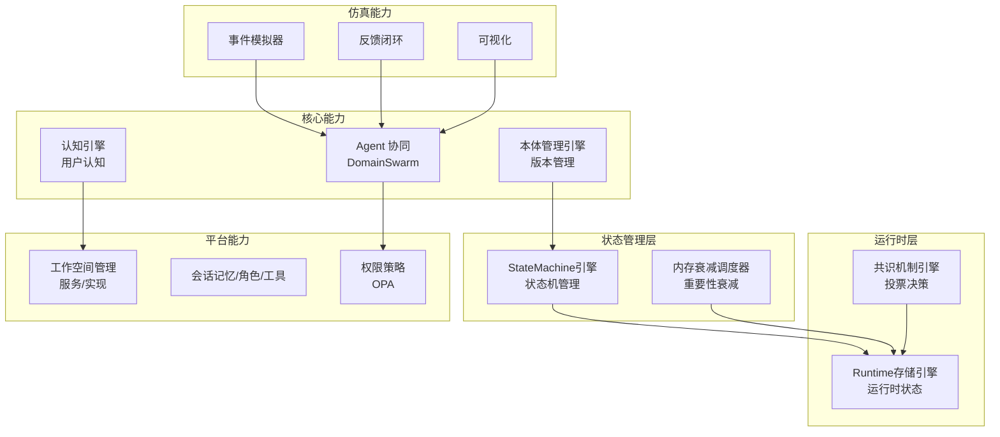

**图表来源**
- [state_machine_engine.py:9-34](file://odap/biz/core/ontology/runtime/state_machine/impl/state_machine_engine.py#L9-L34)
- [sqlite_state_machine_storage.py:7-36](file://odap/biz/core/ontology/runtime/state_machine/storage/sqlite_state_machine_storage.py#L7-L36)
- [sqlite_runtime_storage.py:11-152](file://odap/biz/core/ontology/runtime/storage/sqlite_runtime_storage.py#L11-L152)
- [consensus_engine.py:45-52](file://odap/biz/platform/ontology_memory/shared_workspace/services/consensus_engine.py#L45-L52)
- [decay_scheduler.py:17-43](file://odap/biz/platform/ontology_memory/services/decay_scheduler.py#L17-L43)

**章节来源**
- [swarm_orchestrator.py:1-687](file://odap/biz/core/agent/swarm_orchestrator.py#L1-L687)
- [version_service.py:1-503](file://odap/biz/core/ontology/services/version_service.py#L1-L503)
- [pipeline.py:1-283](file://odap/biz/decision/decision_pipeline/pipeline.py#L1-L283)
- [executor.py:1-297](file://odap/biz/decision/action_service/executor.py#L1-L297)
- [simulator_service.py:1-134](file://odap/biz/simulation/event_simulator/services/simulator_service.py#L1-L134)
- [workspace_service.py:1-304](file://odap/biz/platform/workspace/services/workspace_service.py#L1-L304)
- [workspace.py:1-178](file://odap/biz/platform/workspace/impl/workspace.py#L1-L178)
- [user_cognition_engine.py:1-800](file://odap/biz/core/cognition/user_cognition_engine.py#L1-L800)

## 核心组件
- Agent 协同系统（DomainSwarm）：实现三 Agent（Commander/Intelligence/Operations）的 OODA 循环，支持流式进度输出、检查点持久化、健康监控与故障恢复。
- 本体管理引擎（版本管理）：提供追加写入与提交写入的双模式版本链，语义版本号递增，SQLite 存储，支持差异对比与实体历史追踪。
- 决策支持系统：决策管道（分析-决策-校验-执行-反馈），动作执行器（参数校验、OPA 权限检查、图谱写回与写回钩子）。
- 工作空间管理：工作空间生命周期管理、成员管理、绑定本体（含共享检测）、导入导出。
- 仿真推演系统：事件模板与生成、时间控制、触发器机制、事件列表与时间推进。
- **新增** 状态机引擎：基于状态机模型管理对象状态转换，支持条件守卫、角色验证和手动审批。
- **新增** 内存衰减调度器：自动管理本体记忆的重要性衰减，支持批量处理和统计监控。
- **新增** 共识机制引擎：提供多种投票策略的分布式共识算法，支持冲突解决和提案管理。

**章节来源**
- [swarm_orchestrator.py:288-658](file://odap/biz/core/agent/swarm_orchestrator.py#L288-L658)
- [version_service.py:84-277](file://odap/biz/core/ontology/services/version_service.py#L84-L277)
- [pipeline.py:13-139](file://odap/biz/decision/decision_pipeline/pipeline.py#L13-L139)
- [executor.py:10-175](file://odap/biz/decision/action_service/executor.py#L10-L175)
- [workspace_service.py:10-304](file://odap/biz/platform/workspace/services/workspace_service.py#L10-L304)
- [workspace.py:10-178](file://odap/biz/platform/workspace/impl/workspace.py#L10-L178)
- [simulator_service.py:9-134](file://odap/biz/simulation/event_simulator/services/simulator_service.py#L9-L134)
- [state_machine_engine.py:9-34](file://odap/biz/core/ontology/runtime/state_machine/impl/state_machine_engine.py#L9-L34)
- [decay_scheduler.py:17-43](file://odap/biz/platform/ontology_memory/services/decay_scheduler.py#L17-L43)
- [consensus_engine.py:45-52](file://odap/biz/platform/ontology_memory/shared_workspace/services/consensus_engine.py#L45-L52)

## 架构总览
L3-L4 业务层通过"模块化服务 + 统一基础设施"的方式实现松耦合高内聚。Agent 协同以 DomainSwarm 为核心，调用查询服务、图管理、健康监控与故障恢复；本体版本管理通过统一存储与解析器保障版本一致性；决策管道串联语义检索、推荐引擎、OPA 策略与动作执行；工作空间提供资源隔离与本体共享；事件模拟器为仿真闭环提供事件驱动与时间控制；**新增的状态机引擎和共识机制**为系统提供状态管理和分布式协调能力。

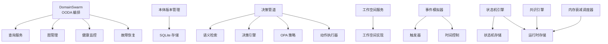

**图表来源**
- [swarm_orchestrator.py:288-658](file://odap/biz/core/agent/swarm_orchestrator.py#L288-L658)
- [version_service.py:100-106](file://odap/biz/core/ontology/services/version_service.py#L100-L106)
- [pipeline.py:13-62](file://odap/biz/decision/decision_pipeline/pipeline.py#L13-L62)
- [executor.py:10-46](file://odap/biz/decision/action_service/executor.py#L10-L46)
- [workspace_service.py:10-15](file://odap/biz/platform/workspace/services/workspace_service.py#L10-L15)
- [workspace.py:10-15](file://odap/biz/platform/workspace/impl/workspace.py#L10-L15)
- [simulator_service.py:9-16](file://odap/biz/simulation/event_simulator/services/simulator_service.py#L9-L16)
- [state_machine_engine.py:9-34](file://odap/biz/core/ontology/runtime/state_machine/impl/state_machine_engine.py#L9-L34)
- [sqlite_runtime_storage.py:11-152](file://odap/biz/core/ontology/runtime/storage/sqlite_runtime_storage.py#L11-L152)
- [consensus_engine.py:45-52](file://odap/biz/platform/ontology_memory/shared_workspace/services/consensus_engine.py#L45-L52)
- [decay_scheduler.py:17-43](file://odap/biz/platform/ontology_memory/services/decay_scheduler.py#L17-L43)

## 详细组件分析

### Agent 协同系统（DomainSwarm）
- 职责划分
  - Intelligence Agent：情报收集与威胁分析，产出态势摘要与威胁等级。
  - Commander Agent：基于态势生成决策选项，必要时要求人工确认。
  - Operations Agent：执行命令，支持确认回调与批量目标执行。
- OODA 循环
  - Observe（感知）：调用 Intelligence 收集情报。
  - Orient（理解）：结合 RAG 上下文进行态势理解。
  - Decide（决策）：Commander 生成推荐动作与是否需要确认。
  - Act（执行）：Operations 执行动作，支持写回与反馈闭环。
- 编排与追踪
  - 提供流式进度输出（观察/理解/决策/执行阶段）。
  - 支持检查点持久化、健康监控与故障恢复实例。
  - 提供 MissionResult 结果封装与历史记录。
- 交互关系
  - 依赖查询服务（RAG）、图管理（Episode 写入）、OPA（权限）、健康监控与故障恢复。

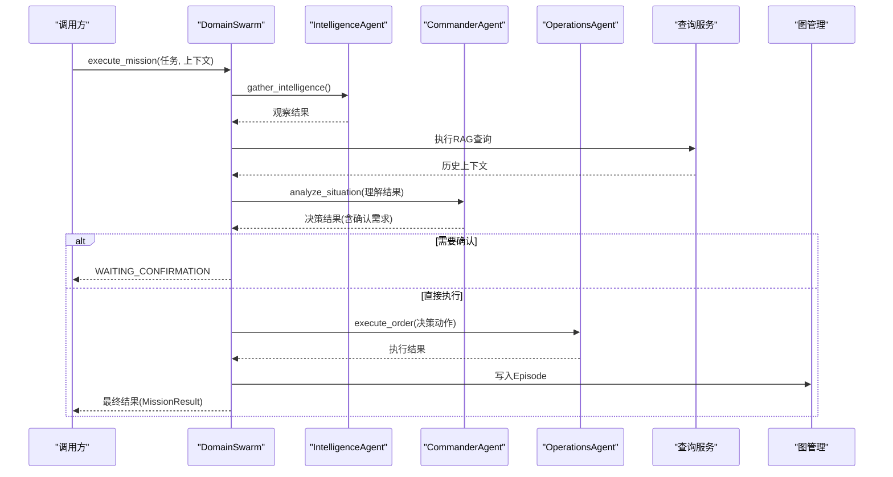

**图表来源**
- [swarm_orchestrator.py:379-456](file://odap/biz/core/agent/swarm_orchestrator.py#L379-L456)
- [swarm_orchestrator.py:568-613](file://odap/biz/core/agent/swarm_orchestrator.py#L568-L613)

**章节来源**
- [swarm_orchestrator.py:102-180](file://odap/biz/core/agent/swarm_orchestrator.py#L102-L180)
- [swarm_orchestrator.py:182-237](file://odap/biz/core/agent/swarm_orchestrator.py#L182-L237)
- [swarm_orchestrator.py:239-286](file://odap/biz/core/agent/swarm_orchestrator.py#L239-L286)
- [swarm_orchestrator.py:288-658](file://odap/biz/core/agent/swarm_orchestrator.py#L288-L658)

### 本体管理引擎（版本管理）
- 版本策略
  - 追加模式（append）：热写入自动触发，版本ID不变，仅合并快照。
  - 提交模式（commit）：锁定当前版本并创建新版本，语义版本 minor 递增。
- 数据模型
  - 版本快照（OntologyVersion）：包含版本ID、版本号、父版本、统计计数等。
  - 差异（OntologyDiff）：实体/关系/事件增删对比。
  - 实体历史（EntitySnapshot）：实体跨版本状态快照。
- 存储与解析
  - 使用 SQLite 统一存储，EntityResolver 负责解析与合并。
- API 与流程
  - append：合并新文档到当前快照，更新实体历史。
  - commit：锁定旧版本，创建新版本并继承快照。
  - get/list/diff/get_entity_history：查询与对比接口。
  - ensure_initial_version：确保初始版本存在。

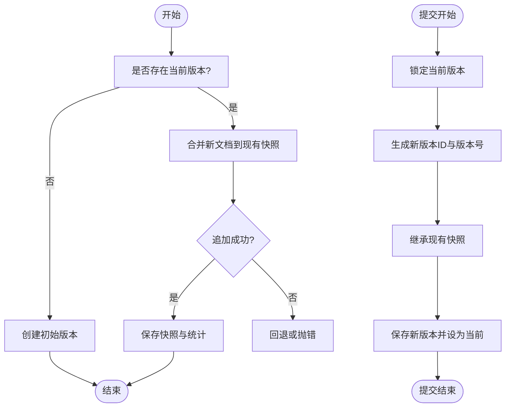

**图表来源**
- [version_service.py:152-204](file://odap/biz/core/ontology/services/version_service.py#L152-L204)
- [version_service.py:206-277](file://odap/biz/core/ontology/services/version_service.py#L206-L277)

**章节来源**
- [version_service.py:27-71](file://odap/biz/core/ontology/services/version_service.py#L27-L71)
- [version_service.py:84-277](file://odap/biz/core/ontology/services/version_service.py#L84-L277)
- [version_service.py:375-430](file://odap/biz/core/ontology/services/version_service.py#L375-L430)

### 决策支持系统（决策管道与动作执行）
- 决策管道（DecisionPipeline）
  - 阶段：Analyze（理解）→ Decide（决策）→ Validate（策略校验）→ Perform（执行）→ Feedback（反馈）。
  - 依赖：语义检索器、决策推荐引擎、OPA 管理器、动作执行器、反馈循环。
  - 失败策略：阶段失败即终止后续阶段，记录错误。
- 动作执行器（ActionExecutor）
  - 参数校验：必填参数与目标类型匹配。
  - OPA 权限检查：ABAC 策略，fail-closed。
  - 执行与写回：根据动作类型更新图谱或通用属性，支持写回钩子（Webhook/Graph）。
  - 反馈闭环：执行成功后触发反馈循环。

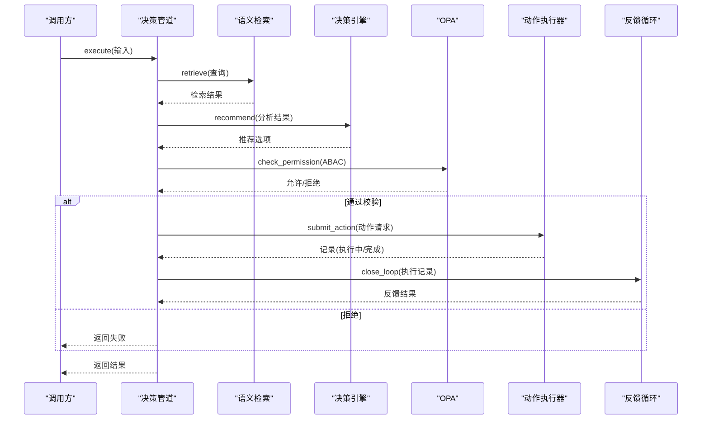

**图表来源**
- [pipeline.py:64-139](file://odap/biz/decision/decision_pipeline/pipeline.py#L64-L139)
- [executor.py:48-175](file://odap/biz/decision/action_service/executor.py#L48-L175)

**章节来源**
- [pipeline.py:13-139](file://odap/biz/decision/decision_pipeline/pipeline.py#L13-L139)
- [executor.py:10-175](file://odap/biz/decision/action_service/executor.py#L10-L175)

### 工作空间管理（隔离与导入导出）
- 服务层（WorkspaceService）
  - 生命周期：创建/获取/更新/删除/激活/停用。
  - 成员管理：添加/移除成员。
  - 列表与筛选：分页、按状态/类型/拥有者过滤。
  - 导入导出：记录创建、进度跟踪。
- 实现层（WorkspaceManager）
  - 存储交互：保存/更新/删除/列表。
  - 绑定本体：支持私有与共享本体，检测共享工作空间。
- 隔离原理
  - 通过 WorkspaceId 限定查询与操作范围，避免跨域访问。
  - 导入导出支持资源与数据开关，便于可控迁移。

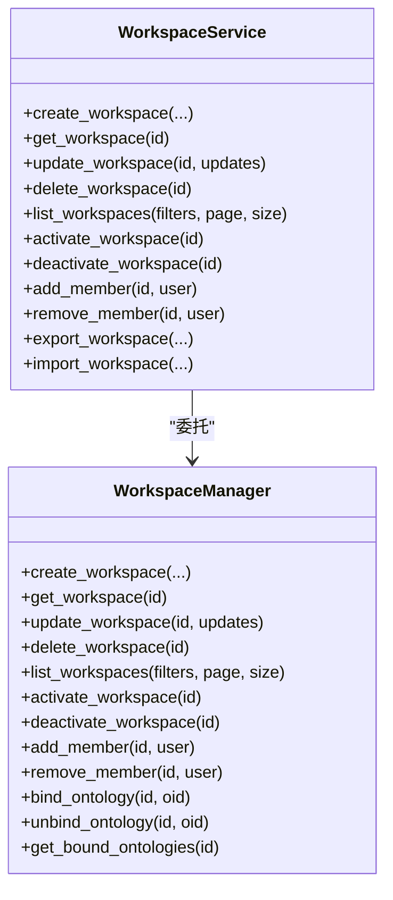

**图表来源**
- [workspace_service.py:10-304](file://odap/biz/platform/workspace/services/workspace_service.py#L10-L304)
- [workspace.py:10-178](file://odap/biz/platform/workspace/impl/workspace.py#L10-L178)

**章节来源**
- [workspace_service.py:10-304](file://odap/biz/platform/workspace/services/workspace_service.py#L10-L304)
- [workspace.py:10-178](file://odap/biz/platform/workspace/impl/workspace.py#L10-L178)

### 事件模拟器（仿真推演）
- 模板与事件
  - 模板：事件类型与数据模式定义。
  - 事件：基于模板生成，记录类型与时间戳。
- 时间控制
  - 速度与暂停状态，支持推进时钟并触发条件。
- 触发器
  - 基于时间或事件数量阈值触发，记录触发次数与启用状态。
- API
  - 创建模板、列出模板、生成事件、列出事件、设置/获取时间控制、推进时钟、注册触发器。

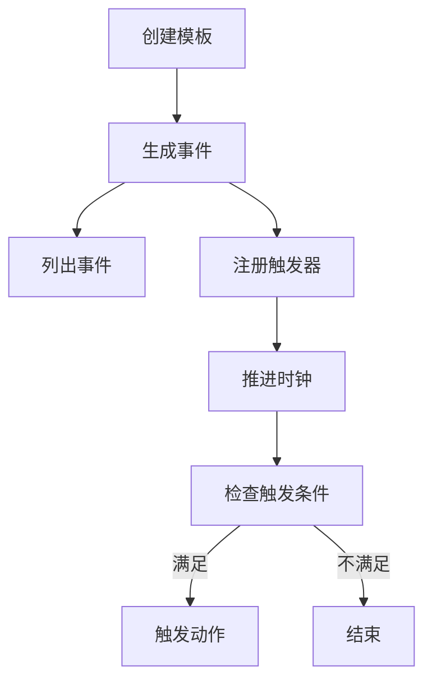

**图表来源**
- [simulator_service.py:18-65](file://odap/biz/simulation/event_simulator/services/simulator_service.py#L18-L65)
- [simulator_service.py:78-104](file://odap/biz/simulation/event_simulator/services/simulator_service.py#L78-L104)
- [simulator_service.py:106-134](file://odap/biz/simulation/event_simulator/services/simulator_service.py#L106-L134)

**章节来源**
- [simulator_service.py:9-134](file://odap/biz/simulation/event_simulator/services/simulator_service.py#L9-L134)

### 用户认知引擎（概念性概述）
- 模块组成：意图识别、知识导航、推理链追踪、解释引擎、角色视图管理。
- 能力：意图解析、实体抽取、知识检索、图谱导航、推理链可视化、解释"为什么"、角色视图配置。
- 设计要点：模块化职责清晰，支持缓存与历史追踪，提供可视化推理链。

（本节为概念性说明，不直接分析具体代码文件）

### **新增** 状态机引擎（StateMachine）
- 状态机模型
  - 状态定义：支持初始状态、普通状态、终止状态等类型。
  - 转换规则：定义状态间的转换条件和触发动作。
  - 守卫机制：支持角色验证、条件检查和手动审批。
- 存储与管理
  - SQLite 存储：状态机定义和当前状态持久化。
  - 对象状态跟踪：为每个对象维护独立的状态映射。
  - 行为绑定：将状态机与特定对象类型关联。
- 核心功能
  - 状态转换：根据动作类型和上下文执行状态转换。
  - 条件验证：支持复杂条件表达式的安全求值。
  - 侧效应执行：转换时自动执行预定义的副作用操作。

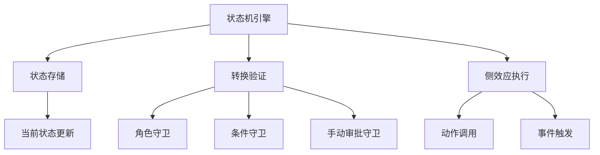

**图表来源**
- [state_machine_engine.py:62-107](file://odap/biz/core/ontology/runtime/state_machine/impl/state_machine_engine.py#L62-L107)
- [state_machine_engine.py:181-186](file://odap/biz/core/ontology/runtime/state_machine/impl/state_machine_engine.py#L181-L186)
- [sqlite_state_machine_storage.py:45-64](file://odap/biz/core/ontology/runtime/state_machine/storage/sqlite_state_machine_storage.py#L45-L64)

**章节来源**
- [state_machine_engine.py:9-34](file://odap/biz/core/ontology/runtime/state_machine/impl/state_machine_engine.py#L9-L34)
- [state_machine_engine.py:36-61](file://odap/biz/core/ontology/runtime/state_machine/impl/state_machine_engine.py#L36-L61)
- [state_machine_engine.py:62-134](file://odap/biz/core/ontology/runtime/state_machine/impl/state_machine_engine.py#L62-L134)
- [sqlite_state_machine_storage.py:7-36](file://odap/biz/core/ontology/runtime/state_machine/storage/sqlite_state_machine_storage.py#L7-L36)
- [sqlite_state_machine_storage.py:45-111](file://odap/biz/core/ontology/runtime/state_machine/storage/sqlite_state_machine_storage.py#L45-L111)

### **新增** 内存衰减调度器（Memory Decay Scheduler）
- 衰减策略
  - 时间衰减：基于半衰期的时间指数衰减。
  - 访问增强：根据访问频率动态提升重要性。
  - 阈值管理：最小重要性和整合阈值控制处理策略。
- 自动化管理
  - 批量处理：支持配置化的批处理大小。
  - 后台运行：线程池支持持续的内存清理。
  - 回调通知：处理事件的回调机制。
- 统计监控
  - 处理统计：衰减、整合、遗忘的数量统计。
  - 运行状态：最后运行时间和配置信息。
  - API 接口：启动、停止、配置更新和状态查询。

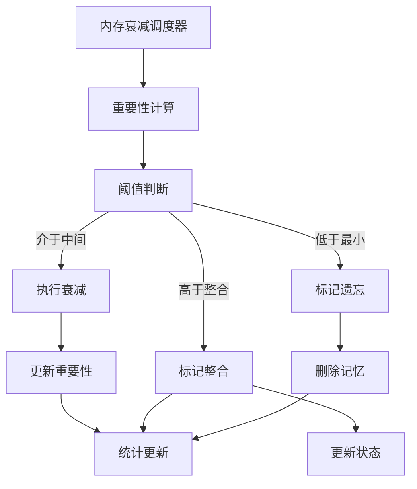

**图表来源**
- [decay_scheduler.py:61-102](file://odap/biz/platform/ontology_memory/services/decay_scheduler.py#L61-L102)
- [decay_scheduler.py:119-131](file://odap/biz/platform/ontology_memory/services/decay_scheduler.py#L119-L131)
- [decay_routes.py:17-37](file://odap/biz/platform/ontology_memory/api/decay_routes.py#L17-L37)

**章节来源**
- [decay_scheduler.py:8-15](file://odap/biz/platform/ontology_memory/services/decay_scheduler.py#L8-L15)
- [decay_scheduler.py:17-43](file://odap/biz/platform/ontology_memory/services/decay_scheduler.py#L17-L43)
- [decay_scheduler.py:61-102](file://odap/biz/platform/ontology_memory/services/decay_scheduler.py#L61-L102)
- [decay_routes.py:1-37](file://odap/biz/platform/ontology_memory/api/decay_routes.py#L1-L37)
- [decay_routes.py:40-71](file://odap/biz/platform/ontology_memory/api/decay_routes.py#L40-L71)

### **新增** 共识机制引擎（Consensus Engine）
- 投票策略
  - 多数原则：超过半数同意即通过。
  - 一致原则：全体同意或全体拒绝。
  - 加权原则：基于权重的加权投票。
  - 超多数原则：需要三分之二多数。
- 冲突解决
  - 最后写入优先：选择时间戳最新的值。
  - 首写入优先：选择时间戳最早值。
  - 最高优先级：选择优先级最高的值。
  - 合并策略：按时间顺序合并所有值。
- 提案管理
  - 提案创建：支持设置提案主题、提议值和截止时间。
  - 投票管理：跟踪投票者、权重和理由。
  - 状态跟踪：pending、approved、rejected、expired 状态。
  - 结果解析：自动计算投票结果和最终值。

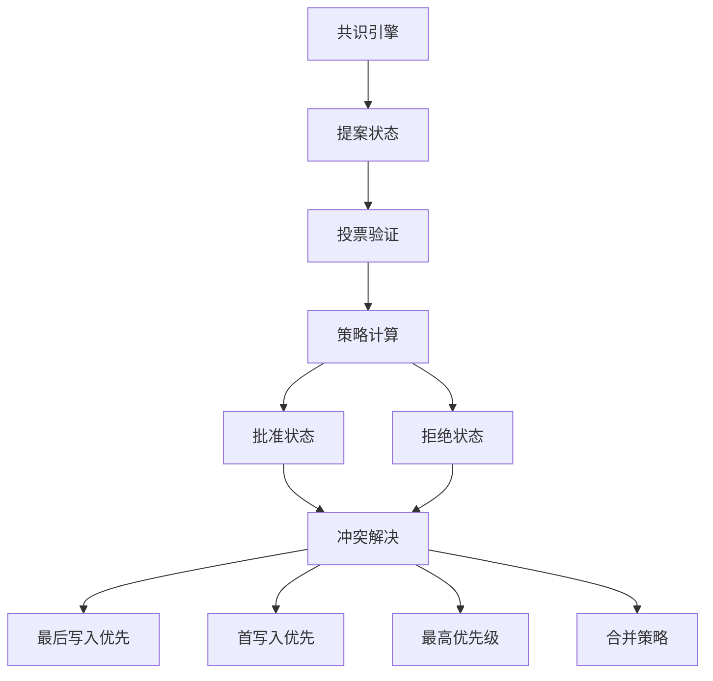

**图表来源**
- [consensus_engine.py:61-73](file://odap/biz/platform/ontology_memory/shared_workspace/services/consensus_engine.py#L61-L73)
- [consensus_engine.py:74-89](file://odap/biz/platform/ontology_memory/shared_workspace/services/consensus_engine.py#L74-L89)
- [consensus_engine.py:147-198](file://odap/biz/platform/ontology_memory/shared_workspace/services/consensus_engine.py#L147-L198)
- [consensus_engine.py:124-146](file://odap/biz/platform/ontology_memory/shared_workspace/services/consensus_engine.py#L124-L146)

**章节来源**
- [consensus_engine.py:7-19](file://odap/biz/platform/ontology_memory/shared_workspace/services/consensus_engine.py#L7-L19)
- [consensus_engine.py:21-43](file://odap/biz/platform/ontology_memory/shared_workspace/services/consensus_engine.py#L21-L43)
- [consensus_engine.py:61-111](file://odap/biz/platform/ontology_memory/shared_workspace/services/consensus_engine.py#L61-L111)
- [consensus_engine.py:124-146](file://odap/biz/platform/ontology_memory/shared_workspace/services/consensus_engine.py#L124-L146)

### **新增** 运行时存储层（Runtime Storage）
- 数据模型
  - 函数定义：本体函数的元数据和实现信息。
  - 动作契约：操作的读写集合和前置后置条件。
  - 状态传播图：对象间状态转换关系。
  - 变更记录：操作的历史变更追踪。
  - 世界状态快照：场景的全局状态快照。
  - 聚合定义：数据聚合和统计规则。
  - 动作触发器：条件触发的动作执行器。
  - 触发执行：触发器的执行历史和结果。
- 存储特性
  - 关系型数据库：SQLite 支持复杂查询和事务。
  - 索引优化：多字段索引提升查询性能。
  - JSON 字段：支持复杂数据结构的存储。
  - 类型约束：严格的字段类型和约束定义。

**章节来源**
- [sqlite_runtime_storage.py:11-152](file://odap/biz/core/ontology/runtime/storage/sqlite_runtime_storage.py#L11-L152)
- [sqlite_runtime_storage.py:159-231](file://odap/biz/core/ontology/runtime/storage/sqlite_runtime_storage.py#L159-L231)
- [sqlite_runtime_storage.py:235-307](file://odap/biz/core/ontology/runtime/storage/sqlite_runtime_storage.py#L235-L307)
- [sqlite_runtime_storage.py:311-356](file://odap/biz/core/ontology/runtime/storage/sqlite_runtime_storage.py#L311-L356)
- [sqlite_runtime_storage.py:368-417](file://odap/biz/core/ontology/runtime/storage/sqlite_runtime_storage.py#L368-L417)
- [sqlite_runtime_storage.py:421-476](file://odap/biz/core/ontology/runtime/storage/sqlite_runtime_storage.py#L421-L476)
- [sqlite_runtime_storage.py:479-533](file://odap/biz/core/ontology/runtime/storage/sqlite_runtime_storage.py#L479-L533)
- [sqlite_runtime_storage.py:537-609](file://odap/biz/core/ontology/runtime/storage/sqlite_runtime_storage.py#L537-L609)
- [sqlite_runtime_storage.py:613-665](file://odap/biz/core/ontology/runtime/storage/sqlite_runtime_storage.py#L613-L665)

### **新增** 状态传播引擎（State Propagation Engine）
- 引擎职责
  - 状态传播建模：构建对象间状态转换的图结构。
  - 变更追踪：记录所有状态变更的历史和影响。
  - 传播计算：计算状态变更对相关对象的影响范围。
  - 冲突检测：识别和处理并发状态变更的冲突。
- 核心功能
  - 图构建：基于动作契约和状态定义构建传播图。
  - 边定义：定义状态转换的边和传播条件。
  - 变更记录：记录每次状态变更的详细信息。
  - 影响分析：分析状态变更对其他对象的影响。

**章节来源**
- [state_propagation_engine.py:13-15](file://odap/biz/core/ontology/runtime/impl/state_propagation_engine.py#L13-L15)

## 依赖分析
- 模块内聚与耦合
  - DomainSwarm 与基础设施（查询、图、健康监控、故障恢复）强耦合，但通过依赖注入与延迟加载降低直接耦合度。
  - 决策管道通过属性延迟加载引入外部组件，具备良好的可替换性。
  - 工作空间服务与实现分离，便于扩展存储后端。
  - **新增** 状态机引擎依赖 SQLite 存储和表达式求值器。
  - **新增** 内存衰减调度器依赖存储接口和回调机制。
  - **新增** 共识引擎采用单例模式管理全局状态。
- 外部依赖
  - OPA 策略引擎（OPAManager/OPAManagerV2）贯穿权限校验。
  - 图管理（GraphManager）与查询服务（QueryService）支撑本体与知识检索。
  - SQLite 存储用于版本、状态机和运行时数据。
  - **新增** 线程池支持内存衰减的后台处理。

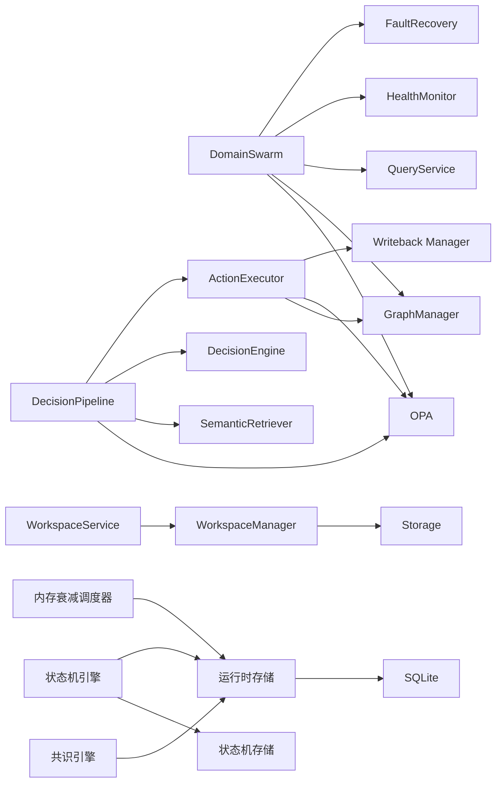

**图表来源**
- [swarm_orchestrator.py:294-306](file://odap/biz/core/agent/swarm_orchestrator.py#L294-L306)
- [pipeline.py:22-62](file://odap/biz/decision/decision_pipeline/pipeline.py#L22-L62)
- [executor.py:17-46](file://odap/biz/decision/action_service/executor.py#L17-L46)
- [workspace.py:14](file://odap/biz/platform/workspace/impl/workspace.py#L14)
- [state_machine_engine.py:10-11](file://odap/biz/core/ontology/runtime/state_machine/impl/state_machine_engine.py#L10-L11)
- [sqlite_runtime_storage.py:11-15](file://odap/biz/core/ontology/runtime/storage/sqlite_runtime_storage.py#L11-L15)
- [consensus_engine.py:45-52](file://odap/biz/platform/ontology_memory/shared_workspace/services/consensus_engine.py#L45-L52)
- [decay_scheduler.py:32-37](file://odap/biz/platform/ontology_memory/services/decay_scheduler.py#L32-L37)

**章节来源**
- [swarm_orchestrator.py:294-306](file://odap/biz/core/agent/swarm_orchestrator.py#L294-L306)
- [pipeline.py:22-62](file://odap/biz/decision/decision_pipeline/pipeline.py#L22-L62)
- [executor.py:17-46](file://odap/biz/decision/action_service/executor.py#L17-L46)
- [workspace.py:14](file://odap/biz/platform/workspace/impl/workspace.py#L14)

## 性能考量
- 并行与超时：DomainSwarm 配置最大并行 Agent 数与任务超时，避免阻塞。
- 缓存与降级：知识导航优先使用查询服务，失败回退至图客户端；决策管道在推荐引擎不可用时走回退路径。
- 存储与序列化：版本管理与动作记录采用 JSON/字典序列化，注意大对象的内存占用与 I/O 压力。
- 监控与可观测：健康监控与追踪收集器提供成功率、平均耗时与最近轨迹，便于定位瓶颈。
- **新增** 状态机查询优化：SQLite 索引支持状态机的快速查找和过滤。
- **新增** 内存衰减批处理：配置化的批处理大小平衡处理效率和系统负载。
- **新增** 共识计算优化：投票策略的快速计算和缓存机制。

## 故障排查指南
- Agent 协同
  - 观察/理解/决策/执行任一阶段报错，检查对应 Agent 的状态与日志；确认 Graphiti 连接与 Episode 写入是否异常。
  - 使用检查点持久化与历史记录定位中断点。
- 决策管道
  - Analyze 失败：检查语义检索器可用性与查询构造。
  - Decide 失败：关注推荐引擎异常与回退路径。
  - Validate 失败：核对 OPA 策略与 ABAC 参数（用户、动作、资源、环境）。
  - Perform 失败：查看动作执行器参数校验、OPA 拒绝原因与写回异常。
- 工作空间
  - 成员变更/绑定本体异常：检查存储层与共享检测逻辑。
  - 导入导出卡住：核对记录状态与进度字段。
- 事件模拟器
  - 触发器未触发：检查条件类型与阈值设置；确认时间推进与当前时间。
- **新增** 状态机引擎
  - 状态转换失败：检查守卫条件和角色验证；确认状态机定义的完整性。
  - 对象状态不一致：验证当前状态映射和初始状态设置。
- **新增** 内存衰减调度器
  - 衰减循环异常：检查存储连接和批处理配置；确认回调函数的正确性。
  - 统计数据异常：验证重要性计算公式和阈值设置。
- **新增** 共识引擎
  - 投票冲突：检查投票权重和策略配置；确认提案状态的有效性。
  - 冲突解决失败：验证冲突值的格式和冲突解决策略。

**章节来源**
- [swarm_orchestrator.py:439-450](file://odap/biz/core/agent/swarm_orchestrator.py#L439-L450)
- [pipeline.py:82-85](file://odap/biz/decision/decision_pipeline/pipeline.py#L82-L85)
- [executor.py:85-91](file://odap/biz/decision/action_service/executor.py#L85-L91)
- [workspace.py:58-74](file://odap/biz/platform/workspace/impl/workspace.py#L58-L74)
- [simulator_service.py:116-134](file://odap/biz/simulation/event_simulator/services/simulator_service.py#L116-L134)
- [state_machine_engine.py:74-97](file://odap/biz/core/ontology/runtime/state_machine/impl/state_machine_engine.py#L74-L97)
- [decay_scheduler.py:61-102](file://odap/biz/platform/ontology_memory/services/decay_scheduler.py#L61-L102)
- [consensus_engine.py:90-94](file://odap/biz/platform/ontology_memory/shared_workspace/services/consensus_engine.py#L90-L94)

## 结论
L3-L4 业务层通过模块化设计实现了 Agent 协同、本体版本管理、决策管道、工作空间与仿真推演的有机整合。**新增的状态机引擎和共识机制**进一步增强了系统的状态管理和分布式协调能力。DomainSwarm 将 OODA 循环工程化落地，版本管理提供稳健的数据演进机制，决策管道与动作执行器形成"理解-决策-执行-反馈"的闭环，工作空间保障资源隔离与可移植性，事件模拟器为仿真与演练提供基础能力，**状态机引擎支持复杂的业务流程建模，内存衰减调度器提供智能的记忆管理，共识机制引擎实现去中心化的决策协调**。整体架构具备良好的扩展性与可维护性。

## 附录
- 模块导出入口
  - Agent 核心：DomainSwarm
  - 本体引擎：IngestService、OntologyBuilderService、OntologyVersionManager、ValidationService
  - 决策管道：DecisionPipeline
  - 事件模拟器：EventSimulatorService
  - 工作空间：WorkspaceService、IsolationService
  - **新增** 状态机引擎：StateMachineEngine、SQLiteStateMachineStorage
  - **新增** 运行时存储：SQLiteRuntimeStorage
  - **新增** 共识引擎：ConsensusEngine
  - **新增** 内存衰减：MemoryDecayScheduler、DecayConfig

**章节来源**
- [__init__.py（Agent核心）:1-5](file://odap/biz/core/agent/__init__.py#L1-L5)
- [__init__.py（本体引擎）:1-19](file://odap/biz/core/ontology/__init__.py#L1-L19)
- [__init__.py（决策管道）:1-1](file://odap/biz/decision/decision_pipeline/__init__.py#L1-L1)
- [__init__.py（事件模拟器）:1-8](file://odap/biz/simulation/event_simulator/__init__.py#L1-L8)
- [__init__.py（工作空间）:1-10](file://odap/biz/platform/workspace/__init__.py#L1-L10)