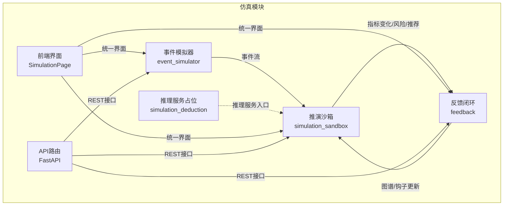
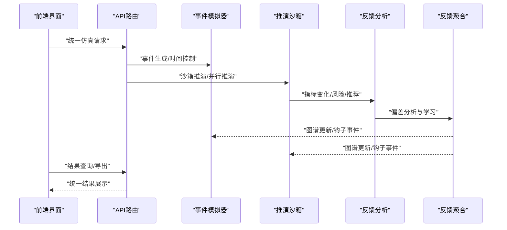
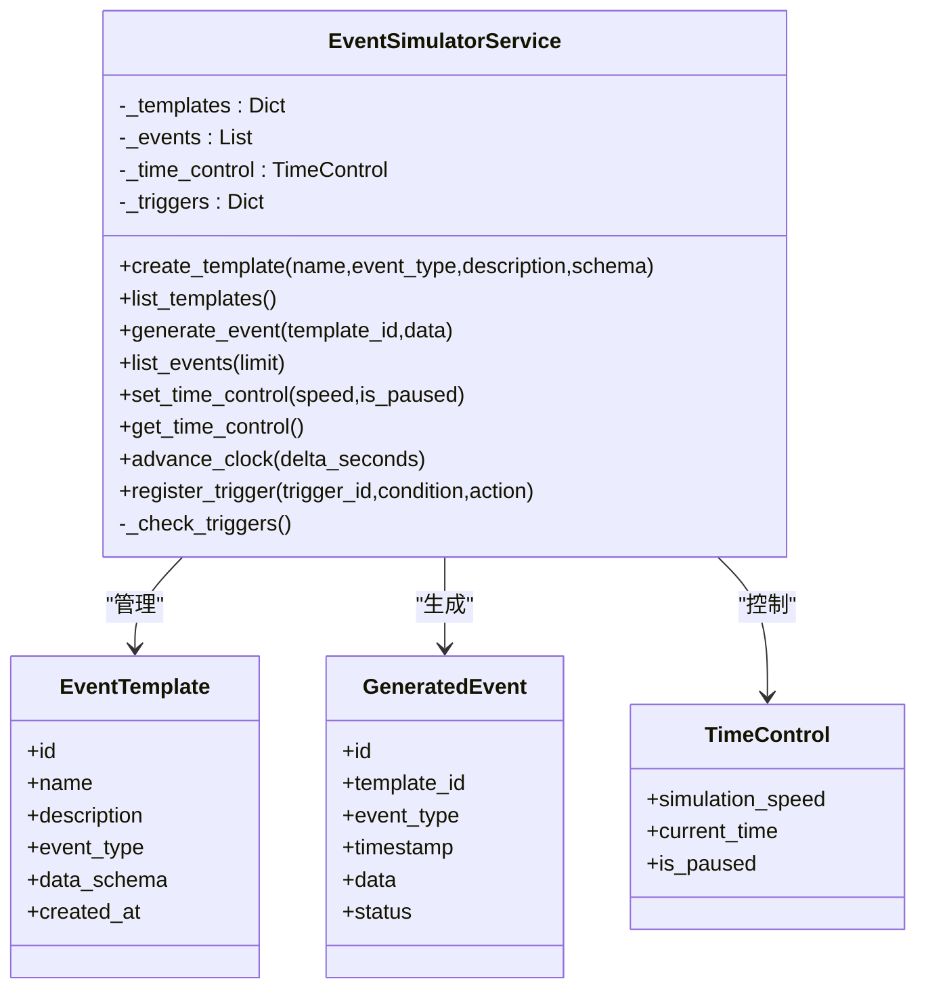
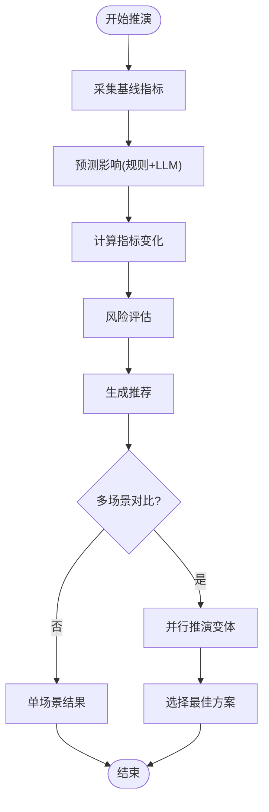
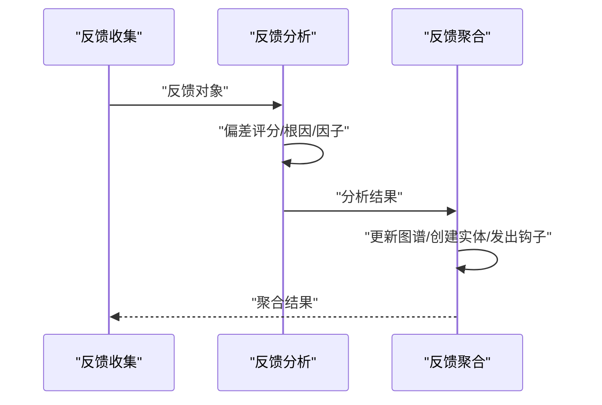
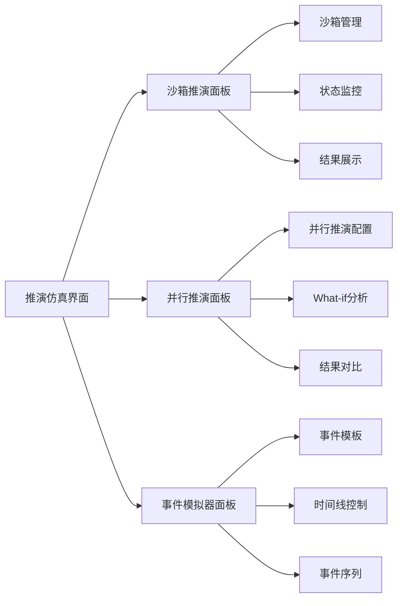
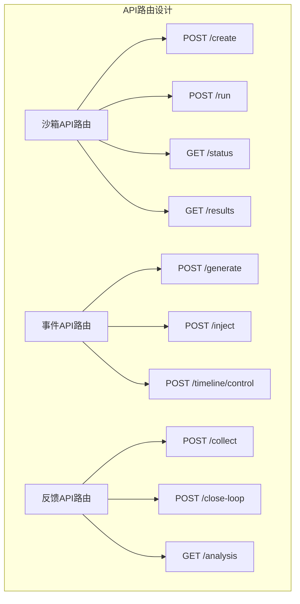
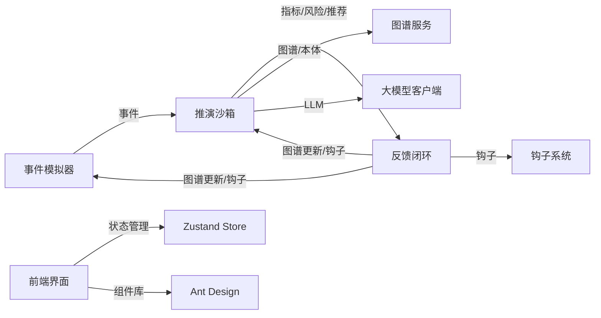

# 仿真反馈系统

<cite>
**本文引用的文件**
- [odap/biz/simulation/event_simulator/services/simulator_service.py](file://odap/biz/simulation/event_simulator/services/simulator_service.py)
- [odap/biz/simulation/event_simulator/models/event.py](file://odap/biz/simulation/event_simulator/models/event.py)
- [odap/biz/simulation/simulation_sandbox/sandbox.py](file://odap/biz/simulation/simulation_sandbox/sandbox.py)
- [odap/biz/simulation/simulation_sandbox/schemas.py](file://odap/biz/simulation/simulation_sandbox/schemas.py)
- [odap/biz/simulation/feedback/loop.py](file://odap/biz/simulation/feedback/loop.py)
- [odap/biz/simulation/feedback/collector.py](file://odap/biz/simulation/feedback/collector.py)
- [odap/biz/simulation/feedback/analyzer.py](file://odap/biz/simulation/feedback/analyzer.py)
- [odap/biz/simulation/feedback/aggregator.py](file://odap/biz/simulation/feedback/aggregator.py)
- [odap/biz/simulation/feedback/models.py](file://odap/biz/simulation/feedback/models.py)
- [odap/biz/simulation/simulation_deduction/__init__.py](file://odap/biz/simulation/simulation_deduction/__init__.py)
- [odap/biz/simulation/__init__.py](file://odap/biz/simulation/__init__.py)
- [odap/biz/simulation/simulation_sandbox/api/routes.py](file://odap/biz/simulation/simulation_sandbox/api/routes.py)
- [odap/biz/simulation/event_simulator/api/routes.py](file://odap/biz/simulation/event_simulator/api/routes.py)
- [odap/biz/simulation/feedback/api/routes.py](file://odap/biz/simulation/feedback/api/routes.py)
- [frontend/src/modules/simulation/pages/SimulationPage.tsx](file://frontend/src/modules/simulation/pages/SimulationPage.tsx)
- [frontend/src/modules/simulation/stores/simulationStore.ts](file://frontend/src/modules/simulation/stores/simulationStore.ts)
- [frontend/src/modules/simulation/locales/zh-CN/simulation.json](file://frontend/src/modules/simulation/locales/zh-CN/simulation.json)
</cite>

## 更新摘要
**所做更改**
- 更新了仿真功能的界面组织结构，从分散的功能整合到统一的"推演仿真"菜单下
- 新增了前端仿真页面的统一界面设计，包含沙箱推演、并行推演和事件模拟器三个主要功能面板
- 完善了仿真API路由的后端接口设计，支持完整的仿真生命周期管理
- 增强了仿真系统的可视化展示和交互体验

## 目录
1. [引言](#引言)
2. [项目结构](#项目结构)
3. [核心组件](#核心组件)
4. [架构总览](#架构总览)
5. [详细组件分析](#详细组件分析)
6. [界面组织变更](#界面组织变更)
7. [API接口设计](#api接口设计)
8. [依赖分析](#依赖分析)
9. [性能考虑](#性能考虑)
10. [故障排查指南](#故障排查指南)
11. [结论](#结论)
12. [附录](#附录)

## 引言
本文件面向"仿真反馈系统"的设计与实现，围绕三大核心模块展开：事件模拟器（EventSimulator）、推演沙箱（SimulationSandbox）与反馈闭环（FeedbackLoop）。经过最新的界面重组，仿真和建模能力已重新组织到新的"推演仿真"菜单下，整合了之前分散的功能到统一界面，包括沙箱仿真、事件仿真、策略推演等功能，提供更连贯的不同类型仿真活动工作流程。

文档将从系统架构、数据流、处理逻辑、集成点、错误处理与性能优化等方面进行深入解析，并提供仿真流程设计、多场景并行推演、结果可视化与验证机制的实践指导，以及场景配置与自定义推演算法的开发示例。

## 项目结构
仿真反馈系统位于 odap/biz/simulation 子模块下，按功能域划分如下：
- event_simulator：事件生成与时间控制，支持模板化事件与触发器
- simulation_sandbox：What-if推演沙箱，提供基线采集、影响预测、风险评估与推荐
- feedback：反馈闭环，包含收集、分析、聚合与图谱/钩子更新
- simulation_deduction：推理服务入口（当前为空实现占位）

**更新** 仿真功能现已整合到统一的"推演仿真"菜单下，前端提供统一的界面入口和工作流程。

**图表来源**
- [odap/biz/simulation/event_simulator/services/simulator_service.py:1-134](file://odap/biz/simulation/event_simulator/services/simulator_service.py#L1-L134)
- [odap/biz/simulation/simulation_sandbox/sandbox.py:1-511](file://odap/biz/simulation/simulation_sandbox/sandbox.py#L1-L511)
- [odap/biz/simulation/feedback/loop.py:1-45](file://odap/biz/simulation/feedback/loop.py#L1-L45)
- [odap/biz/simulation/simulation_deduction/__init__.py:1-12](file://odap/biz/simulation/simulation_deduction/__init__.py#L1-L12)
- [frontend/src/modules/simulation/pages/SimulationPage.tsx:585-622](file://frontend/src/modules/simulation/pages/SimulationPage.tsx#L585-L622)

**章节来源**
- [odap/biz/simulation/event_simulator/services/simulator_service.py:1-134](file://odap/biz/simulation/event_simulator/services/simulator_service.py#L1-L134)
- [odap/biz/simulation/simulation_sandbox/sandbox.py:1-511](file://odap/biz/simulation/simulation_sandbox/sandbox.py#L1-L511)
- [odap/biz/simulation/feedback/loop.py:1-45](file://odap/biz/simulation/feedback/loop.py#L1-L45)
- [odap/biz/simulation/simulation_deduction/__init__.py:1-12](file://odap/biz/simulation/simulation_deduction/__init__.py#L1-L12)

## 核心组件
- 事件模拟器（EventSimulator）
  - 负责事件模板管理、事件生成、事件列表查询与时间控制（速度、暂停、推进时钟）
  - 支持基于时间或事件计数的触发器注册与触发检测
- 推演沙箱（SimulationSandbox）
  - 提供 What-if 场景推演：基线采集、影响预测（规则+LLM）、风险评估、推荐生成
  - 支持多方案对比与最佳方案选择
  - 提供计划分支与回滚能力
- 反馈闭环（FeedbackLoop）
  - 封装收集、分析、聚合三阶段，输出学习与图谱/钩子更新结果
  - 支持历史查询与模式识别

**更新** 界面层新增了统一的"推演仿真"菜单，整合了沙箱推演、并行推演和事件模拟器三个核心功能，提供更连贯的用户体验。

**章节来源**
- [odap/biz/simulation/event_simulator/services/simulator_service.py:9-134](file://odap/biz/simulation/event_simulator/services/simulator_service.py#L9-L134)
- [odap/biz/simulation/simulation_sandbox/sandbox.py:14-511](file://odap/biz/simulation/simulation_sandbox/sandbox.py#L14-L511)
- [odap/biz/simulation/feedback/loop.py:12-45](file://odap/biz/simulation/feedback/loop.py#L12-L45)
- [frontend/src/modules/simulation/pages/SimulationPage.tsx:585-622](file://frontend/src/modules/simulation/pages/SimulationPage.tsx#L585-L622)

## 架构总览
系统以"事件驱动 + 推演 + 反馈闭环"为主线，事件模拟器提供时序与事件输入，推演沙箱产出指标变化与风险评估，反馈闭环将偏差与经验沉淀到图谱与钩子系统，形成持续改进的闭环。

**更新** 新的界面架构通过统一的"推演仿真"菜单提供了一致的用户体验，三个核心功能模块通过标签页形式组织，支持在同一界面内进行不同类型的仿真活动。

**图表来源**
- [frontend/src/modules/simulation/pages/SimulationPage.tsx:585-622](file://frontend/src/modules/simulation/pages/SimulationPage.tsx#L585-L622)
- [odap/biz/simulation/simulation_sandbox/api/routes.py:11-100](file://odap/biz/simulation/simulation_sandbox/api/routes.py#L11-L100)
- [odap/biz/simulation/event_simulator/api/routes.py:17-189](file://odap/biz/simulation/event_simulator/api/routes.py#L17-L189)
- [odap/biz/simulation/feedback/api/routes.py:52-188](file://odap/biz/simulation/feedback/api/routes.py#L52-L188)

## 详细组件分析

### 事件模拟器（EventSimulator）工作原理
- 模板管理：创建/列举事件模板，模板包含类型与数据模式
- 事件生成：基于模板生成事件，记录事件类型与时间戳
- 时间控制：设置仿真速度与暂停状态；推进时钟并触发条件检查
- 触发器：支持基于时间与事件计数的触发条件，触发后统计次数

**图表来源**
- [odap/biz/simulation/event_simulator/services/simulator_service.py:9-134](file://odap/biz/simulation/event_simulator/services/simulator_service.py#L9-L134)
- [odap/biz/simulation/event_simulator/models/event.py:10-36](file://odap/biz/simulation/event_simulator/models/event.py#L10-L36)

**章节来源**
- [odap/biz/simulation/event_simulator/services/simulator_service.py:18-134](file://odap/biz/simulation/event_simulator/services/simulator_service.py#L18-L134)
- [odap/biz/simulation/event_simulator/models/event.py:10-36](file://odap/biz/simulation/event_simulator/models/event.py#L10-L36)

### 推演沙箱（SimulationSandbox）工作原理
- What-if 推演流程
  - 基线采集：从图谱与本体服务获取目标实体属性与统计属性
  - 影响预测：加载规则影响，必要时调用 LLM 补充间接影响
  - 指标变化计算：基于基线与预测影响计算变化量
  - 风险评估：依据行动类型与变化幅度评估整体风险
  - 推荐生成：规则建议与 LLM 综合建议
- 多场景对比：支持多个变体参数并行推演，比较风险与推荐
- 计划分支与回滚：支持计划版本分支与回滚，便于实验与审计

**图表来源**
- [odap/biz/simulation/simulation_sandbox/sandbox.py:56-119](file://odap/biz/simulation/simulation_sandbox/sandbox.py#L56-L119)
- [odap/biz/simulation/simulation_sandbox/sandbox.py:147-174](file://odap/biz/simulation/simulation_sandbox/sandbox.py#L147-L174)
- [odap/biz/simulation/simulation_sandbox/sandbox.py:324-346](file://odap/biz/simulation/simulation_sandbox/sandbox.py#L324-L346)
- [odap/biz/simulation/simulation_sandbox/sandbox.py:348-426](file://odap/biz/simulation/simulation_sandbox/sandbox.py#L348-L426)

**章节来源**
- [odap/biz/simulation/simulation_sandbox/sandbox.py:56-119](file://odap/biz/simulation/simulation_sandbox/sandbox.py#L56-L119)
- [odap/biz/simulation/simulation_sandbox/sandbox.py:147-174](file://odap/biz/simulation/simulation_sandbox/sandbox.py#L147-L174)
- [odap/biz/simulation/simulation_sandbox/sandbox.py:324-426](file://odap/biz/simulation/simulation_sandbox/sandbox.py#L324-L426)
- [odap/biz/simulation/simulation_sandbox/schemas.py:21-48](file://odap/biz/simulation/simulation_sandbox/schemas.py#L21-L48)

### 反馈闭环（FeedbackLoop）工作原理
- 闭环流程：收集 → 分析 → 聚合与更新
  - 收集：动作结果、决策反馈、结果偏差、经验教训
  - 分析：按反馈类型识别偏差、根因与严重度
  - 聚合：更新图谱实体属性、创建反馈实体、发出钩子事件
- 历史查询与模式识别：支持按来源、类型、严重度过滤与排序，识别重复来源与高频根因

**图表来源**
- [odap/biz/simulation/feedback/loop.py:18-30](file://odap/biz/simulation/feedback/loop.py#L18-L30)
- [odap/biz/simulation/feedback/collector.py:13-100](file://odap/biz/simulation/feedback/collector.py#L13-L100)
- [odap/biz/simulation/feedback/analyzer.py:9-99](file://odap/biz/simulation/feedback/analyzer.py#L9-L99)
- [odap/biz/simulation/feedback/aggregator.py:34-62](file://odap/biz/simulation/feedback/aggregator.py#L34-L62)

**章节来源**
- [odap/biz/simulation/feedback/loop.py:12-45](file://odap/biz/simulation/feedback/loop.py#L12-L45)
- [odap/biz/simulation/feedback/collector.py:9-135](file://odap/biz/simulation/feedback/collector.py#L9-L135)
- [odap/biz/simulation/feedback/analyzer.py:9-174](file://odap/biz/simulation/feedback/analyzer.py#L9-L174)
- [odap/biz/simulation/feedback/aggregator.py:9-114](file://odap/biz/simulation/feedback/aggregator.py#L9-L114)
- [odap/biz/simulation/feedback/models.py:8-41](file://odap/biz/simulation/feedback/models.py#L8-L41)

## 界面组织变更
**更新** 仿真功能已重新组织到统一的"推演仿真"菜单下，提供更连贯的用户体验：

### 统一界面设计
- **沙箱推演面板**：提供沙箱管理、状态监控和推演结果展示
- **并行推演面板**：支持多场景对比和What-if分析
- **事件模拟器面板**：集成事件模板管理、时间线控制和事件序列生成

### 标签页组织
前端通过Ant Design的Tabs组件实现三个主要功能面板的切换：
- 沙箱推演（ExperimentOutlined图标）
- 并行推演（ThunderboltOutlined图标）
- 事件模拟器（ClockCircleOutlined图标）

**图表来源**
- [frontend/src/modules/simulation/pages/SimulationPage.tsx:585-622](file://frontend/src/modules/simulation/pages/SimulationPage.tsx#L585-L622)
- [frontend/src/modules/simulation/pages/SimulationPage.tsx:330-425](file://frontend/src/modules/simulation/pages/SimulationPage.tsx#L330-L425)
- [frontend/src/modules/simulation/pages/SimulationPage.tsx:427-495](file://frontend/src/modules/simulation/pages/SimulationPage.tsx#L427-L495)
- [frontend/src/modules/simulation/pages/SimulationPage.tsx:497-583](file://frontend/src/modules/simulation/pages/SimulationPage.tsx#L497-L583)

**章节来源**
- [frontend/src/modules/simulation/pages/SimulationPage.tsx:585-622](file://frontend/src/modules/simulation/pages/SimulationPage.tsx#L585-L622)
- [frontend/src/modules/simulation/pages/SimulationPage.tsx:330-583](file://frontend/src/modules/simulation/pages/SimulationPage.tsx#L330-L583)

## API接口设计
**更新** 新增了完整的RESTful API接口设计，支持仿真系统的完整生命周期管理：

### 沙箱管理API
- POST `/api/simulation/sandbox`：创建沙箱
- POST `/api/simulation/sandbox/{sandbox_id}/run`：运行推演
- GET `/api/simulation/sandbox/{sandbox_id}/status`：获取沙箱状态
- GET `/api/simulation/sandbox/{sandbox_id}/results`：获取推演结果
- DELETE `/api/simulation/sandbox/{sandbox_id}`：销毁沙箱
- GET `/api/simulation/sandbox`：列出沙箱

### 事件模拟器API
- POST `/api/event-simulator/generate`：生成事件序列
- POST `/api/event-simulator/inject`：注入事件
- POST `/api/event-simulator/timeline`：创建时间线
- POST `/api/event-simulator/clock/control`：时钟控制
- GET `/api/event-simulator/templates`：列出模板
- POST `/api/event-simulator/templates`：创建模板
- DELETE `/api/event-simulator/templates/{template_id}`：删除模板

### 反馈闭环API
- POST `/api/feedback/collect`：收集反馈
- POST `/api/feedback/close-loop`：关闭反馈循环
- POST `/api/feedback/action`：提交动作反馈
- GET `/api/feedback/analysis/{task_id}`：分析反馈
- GET `/api/feedback/aggregate`：聚合反馈
- GET `/api/feedback/decision/{decision_id}`：获取决策反馈

**图表来源**
- [odap/biz/simulation/simulation_sandbox/api/routes.py:11-100](file://odap/biz/simulation/simulation_sandbox/api/routes.py#L11-L100)
- [odap/biz/simulation/event_simulator/api/routes.py:17-189](file://odap/biz/simulation/event_simulator/api/routes.py#L17-L189)
- [odap/biz/simulation/feedback/api/routes.py:52-188](file://odap/biz/simulation/feedback/api/routes.py#L52-L188)

**章节来源**
- [odap/biz/simulation/simulation_sandbox/api/routes.py:1-100](file://odap/biz/simulation/simulation_sandbox/api/routes.py#L1-L100)
- [odap/biz/simulation/event_simulator/api/routes.py:1-189](file://odap/biz/simulation/event_simulator/api/routes.py#L1-L189)
- [odap/biz/simulation/feedback/api/routes.py:1-188](file://odap/biz/simulation/feedback/api/routes.py#L1-L188)

## 依赖分析
- 组件内聚与耦合
  - 事件模拟器内部以模板、事件、时间控制为核心，耦合度低，扩展性强
  - 推演沙箱依赖图谱与本体服务，耦合外部基础设施；通过延迟导入降低启动期成本
  - 反馈闭环由收集、分析、聚合三部分组成，职责清晰，便于替换与扩展
- 外部依赖
  - 图谱服务：用于实体查询、更新与反馈实体创建
  - 钩子系统：用于事件广播与外部集成
  - LLM 客户端：用于补充影响与生成推荐（可选）
- **更新** 前端依赖：Zustand状态管理和Ant Design组件库，提供响应式界面和用户体验

**图表来源**
- [odap/biz/simulation/simulation_sandbox/sandbox.py:230-283](file://odap/biz/simulation/simulation_sandbox/sandbox.py#L230-L283)
- [odap/biz/simulation/feedback/aggregator.py:14-32](file://odap/biz/simulation/feedback/aggregator.py#L14-L32)
- [frontend/src/modules/simulation/stores/simulationStore.ts:1-248](file://frontend/src/modules/simulation/stores/simulationStore.ts#L1-L248)

**章节来源**
- [odap/biz/simulation/simulation_sandbox/sandbox.py:230-283](file://odap/biz/simulation/simulation_sandbox/sandbox.py#L230-L283)
- [odap/biz/simulation/feedback/aggregator.py:14-32](file://odap/biz/simulation/feedback/aggregator.py#L14-L32)
- [frontend/src/modules/simulation/stores/simulationStore.ts:1-248](file://frontend/src/modules/simulation/stores/simulationStore.ts#L1-L248)

## 性能考虑
- 事件生成与时间推进
  - 使用内存列表存储事件，查询限制数量，避免无限增长
  - 触发器检查遍历所有已注册触发器，建议在高并发场景下引入索引或异步调度
- 推演沙箱
  - 延迟初始化图谱与 LLM 客户端，失败时降级为空，保证可用性
  - 影响预测与推荐生成涉及外部 LLM，建议引入超时与重试策略
  - 多场景对比可并行执行，注意资源配额与队列限流
- 反馈闭环
  - 聚合阶段的图谱更新与钩子发射可能阻塞主流程，建议异步化与批量提交
  - 模式识别与历史查询应限制返回条数与排序字段，避免全表扫描
- **更新** 前端性能优化
  - Zustand状态管理减少不必要的组件重渲染
  - Ant Design组件按需加载，优化首屏性能
  - 异步加载和分页显示大量数据

## 故障排查指南
- 事件模拟器
  - 模板不存在：生成事件会返回错误，检查模板 ID 与创建流程
  - 触发器未触发：确认条件类型与目标时间/阈值设置
- 推演沙箱
  - LLM 初始化失败：检查环境变量与网络连通性，确认降级路径
  - 影响规则缺失：确认规则文件存在或使用默认规则
  - 图谱查询异常：检查实体类型与属性是否存在
- 反馈闭环
  - 收集阶段：确认反馈类型与严重度映射正确
  - 分析阶段：偏差评分与根因识别依赖输入数据结构，确保字段完整
  - 聚合阶段：图谱更新与钩子发射异常需查看日志定位
- **更新** 前端故障排查
  - 状态管理：检查Zustand store的状态更新是否正确
  - API调用：确认后端接口响应格式和错误处理
  - 用户界面：验证Ant Design组件的配置和样式

**章节来源**
- [odap/biz/simulation/event_simulator/services/simulator_service.py:47-51](file://odap/biz/simulation/event_simulator/services/simulator_service.py#L47-L51)
- [odap/biz/simulation/simulation_sandbox/sandbox.py:46-54](file://odap/biz/simulation/simulation_sandbox/sandbox.py#L46-L54)
- [odap/biz/simulation/feedback/collector.py:19-36](file://odap/biz/simulation/feedback/collector.py#L19-L36)
- [odap/biz/simulation/feedback/analyzer.py:21-47](file://odap/biz/simulation/feedback/analyzer.py#L21-L47)
- [odap/biz/simulation/feedback/aggregator.py:44-62](file://odap/biz/simulation/feedback/aggregator.py#L44-L62)
- [frontend/src/modules/simulation/stores/simulationStore.ts:64-125](file://frontend/src/modules/simulation/stores/simulationStore.ts#L64-L125)

## 结论
仿真反馈系统通过事件模拟器提供可控的时序与事件输入，借助推演沙箱完成指标变化、风险评估与推荐生成，并以反馈闭环将偏差与经验沉淀至图谱与钩子系统，形成持续改进的闭环。经过界面重组，仿真和建模能力已整合到统一的"推演仿真"菜单下，提供更连贯的用户体验和更高效的仿真工作流程。系统具备良好的模块化与可扩展性，适合在复杂推演场景中进行多方案并行对比与结果验证。

## 附录

### 仿真流程设计
- 事件生成算法
  - 基于模板生成事件，支持结构化数据与时间戳
  - 时间推进与触发器联动，支持时间与事件计数两类触发
- 推演引擎架构
  - 规则驱动与 LLM 增强相结合，兼顾确定性与灵活性
  - 多场景并行推演，支持变体参数对比与最佳方案选择
- 反馈收集机制
  - 动作结果、决策质量、结果偏差与经验教训四类反馈
  - 自动化偏差评分与根因识别，支持历史查询与模式发现
- 分析处理器
  - 偏差分析：数值差异、状态不一致、执行错误等
  - 风险评估：基于行动类型与变化幅度的综合评估
  - 推荐生成：规则建议与 LLM 综合建议

**章节来源**
- [odap/biz/simulation/event_simulator/services/simulator_service.py:47-134](file://odap/biz/simulation/event_simulator/services/simulator_service.py#L47-L134)
- [odap/biz/simulation/simulation_sandbox/sandbox.py:56-119](file://odap/biz/simulation/simulation_sandbox/sandbox.py#L56-L119)
- [odap/biz/simulation/feedback/collector.py:13-100](file://odap/biz/simulation/feedback/collector.py#L13-L100)
- [odap/biz/simulation/feedback/analyzer.py:9-99](file://odap/biz/simulation/feedback/analyzer.py#L9-L99)

### What-if 分析方法
- 基线采集：从图谱与本体服务获取目标实体属性与统计属性
- 影响预测：加载规则影响，必要时调用 LLM 补充间接影响
- 指标变化：基于基线与预测影响计算变化量
- 风险评估：依据行动类型与变化幅度评估整体风险
- 推荐生成：规则建议与 LLM 综合建议

**章节来源**
- [odap/biz/simulation/simulation_sandbox/sandbox.py:121-174](file://odap/biz/simulation/simulation_sandbox/sandbox.py#L121-L174)
- [odap/biz/simulation/simulation_sandbox/sandbox.py:324-426](file://odap/biz/simulation/simulation_sandbox/sandbox.py#L324-L426)

### 多场景并行推演
- 单场景推演：基线 → 预测 → 变化 → 风险 → 推荐
- 多场景对比：对同一目标的不同参数组合进行并行推演，比较风险与推荐，选择最佳方案
- 计划分支与回滚：支持计划版本分支与回滚，便于实验与审计

**章节来源**
- [odap/biz/simulation/simulation_sandbox/sandbox.py:99-119](file://odap/biz/simulation/simulation_sandbox/sandbox.py#L99-L119)
- [odap/biz/simulation/simulation_sandbox/sandbox.py:187-225](file://odap/biz/simulation/simulation_sandbox/sandbox.py#L187-L225)

### 结果可视化展示
- 指标变化：以 before/after/delta 展示关键指标变化
- 风险评估：以风险等级与风险因子列表呈现
- 推荐生成：简明的行动建议与注意事项
- 历史对比：通过反馈历史与模式识别辅助决策

**章节来源**
- [odap/biz/simulation/simulation_sandbox/schemas.py:13-48](file://odap/biz/simulation/simulation_sandbox/schemas.py#L13-L48)
- [odap/biz/simulation/feedback/analyzer.py:101-133](file://odap/biz/simulation/feedback/analyzer.py#L101-L133)

### 性能优化策略
- 事件与反馈存储：限制查询数量与返回条数，避免内存膨胀
- 推演并行化：多场景对比可并行执行，注意资源配额与队列限流
- 异步化：反馈聚合阶段的图谱更新与钩子发射建议异步化
- LLM 调用：引入超时与重试策略，必要时缓存常用提示词
- **更新** 前端优化：Zustand状态管理、组件懒加载、虚拟滚动等

**章节来源**
- [odap/biz/simulation/event_simulator/services/simulator_service.py:67-76](file://odap/biz/simulation/event_simulator/services/simulator_service.py#L67-L76)
- [odap/biz/simulation/feedback/aggregator.py:34-62](file://odap/biz/simulation/feedback/aggregator.py#L34-L62)
- [odap/biz/simulation/simulation_sandbox/sandbox.py:230-283](file://odap/biz/simulation/simulation_sandbox/sandbox.py#L230-L283)
- [frontend/src/modules/simulation/stores/simulationStore.ts:47-247](file://frontend/src/modules/simulation/stores/simulationStore.ts#L47-L247)

### 结果验证机制
- 偏差评分：针对动作结果、结果偏差与决策反馈分别计算偏差分数
- 根因识别：自动识别超时、权限、目标缺失、参数漂移等根因
- 模式发现：识别重复来源与高频根因，辅助系统性改进

**章节来源**
- [odap/biz/simulation/feedback/analyzer.py:21-99](file://odap/biz/simulation/feedback/analyzer.py#L21-L99)
- [odap/biz/simulation/feedback/analyzer.py:101-133](file://odap/biz/simulation/feedback/analyzer.py#L101-L133)

### 仿真场景配置指南
- 事件模板配置：定义事件类型与数据模式
- 时间控制：设置仿真速度与暂停状态
- 触发器配置：设置时间或事件计数触发条件
- 推演场景配置：指定目标对象、行动类型、参数与变体参数
- 风险与规则配置：通过规则文件或默认规则定义风险等级与影响规则

**章节来源**
- [odap/biz/simulation/event_simulator/models/event.py:10-36](file://odap/biz/simulation/event_simulator/models/event.py#L10-L36)
- [odap/biz/simulation/simulation_sandbox/sandbox.py:285-322](file://odap/biz/simulation/simulation_sandbox/sandbox.py#L285-L322)
- [odap/biz/simulation/simulation_sandbox/sandbox.py:380-426](file://odap/biz/simulation/simulation_sandbox/sandbox.py#L380-L426)

### 自定义推演算法开发示例
- 扩展影响规则：在规则文件中添加新的行动类型与指标影响映射
- 自定义风险评估：根据业务需求调整风险等级判定逻辑
- 自定义推荐生成：在 LLM 提示词中加入领域知识，提升推荐质量
- 自定义反馈分析：扩展偏差分析逻辑，支持新的反馈类型与根因识别

**章节来源**
- [odap/biz/simulation/simulation_sandbox/sandbox.py:285-322](file://odap/biz/simulation/simulation_sandbox/sandbox.py#L285-L322)
- [odap/biz/simulation/simulation_sandbox/sandbox.py:380-426](file://odap/biz/simulation/simulation_sandbox/sandbox.py#L380-L426)
- [odap/biz/simulation/feedback/analyzer.py:9-99](file://odap/biz/simulation/feedback/analyzer.py#L9-L99)

### 界面本地化支持
**更新** 新增了完整的国际化支持，包括中文和英文界面文本：

- 中文界面文本：包含推演仿真、沙箱推演、并行推演、事件模拟器等核心功能的本地化标签
- 英文界面文本：提供国际化的界面支持
- 统一的界面命名规范：确保不同语言环境下的一致用户体验

**章节来源**
- [frontend/src/modules/simulation/locales/zh-CN/simulation.json:1-36](file://frontend/src/modules/simulation/locales/zh-CN/simulation.json#L1-L36)