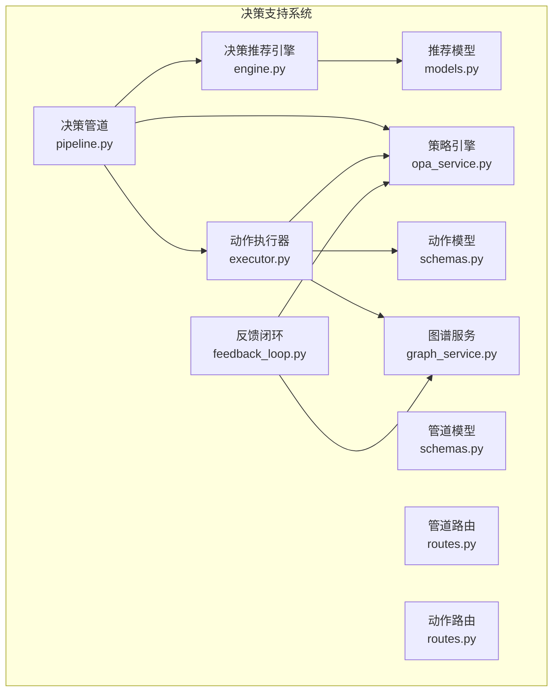
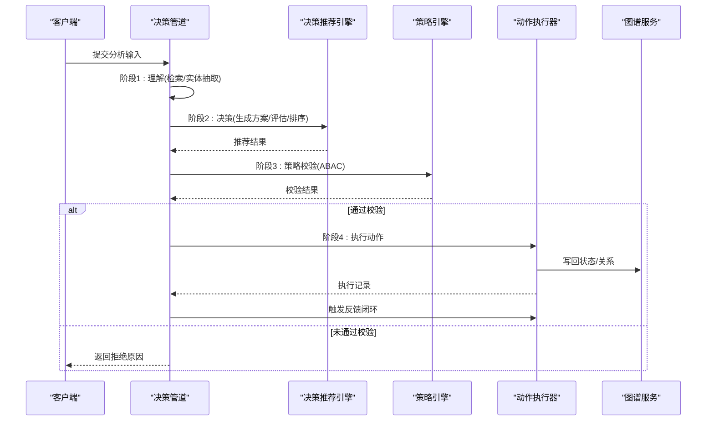
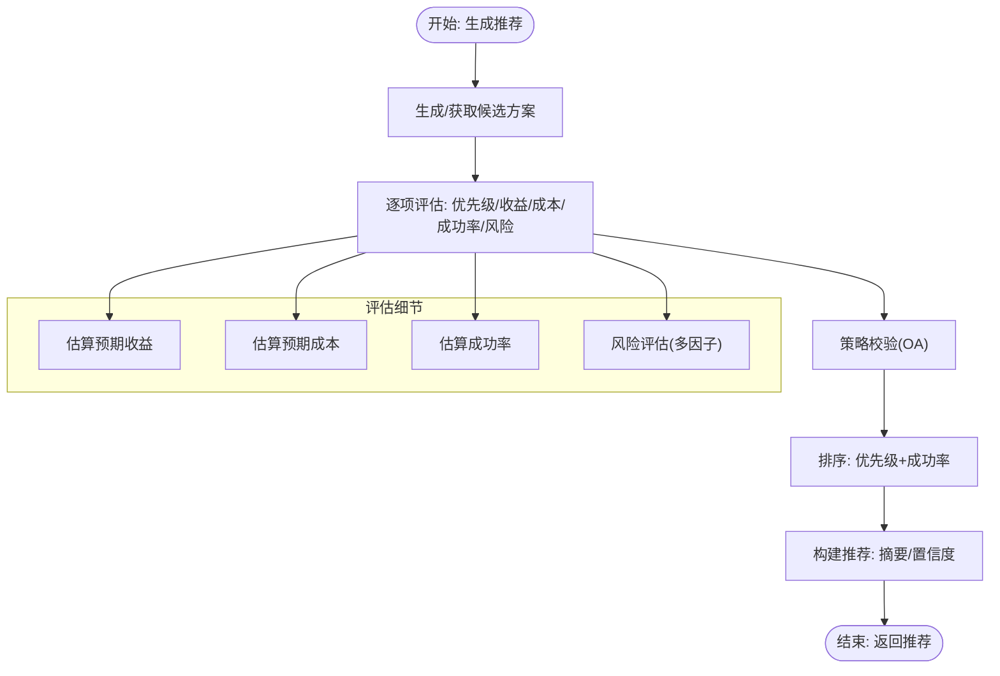
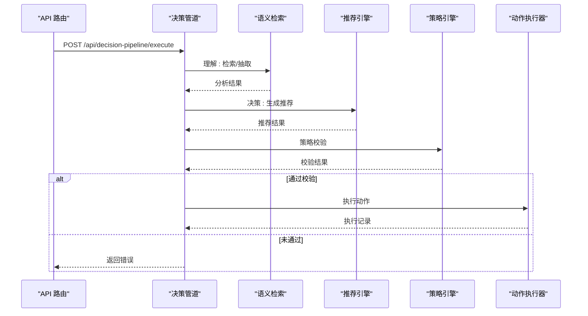
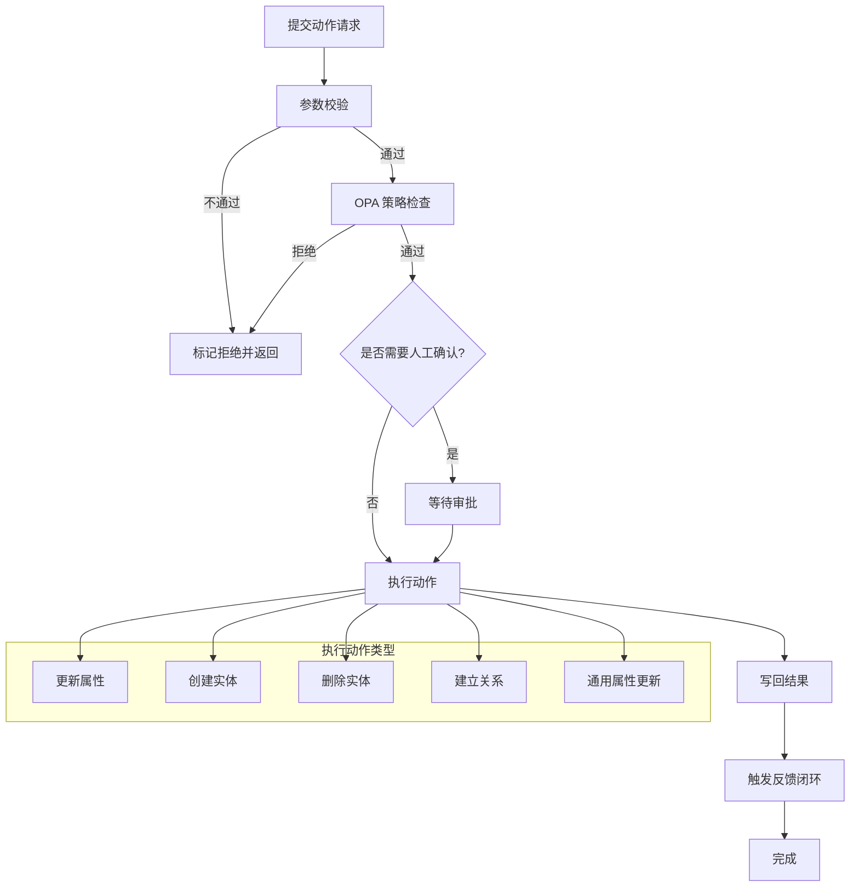
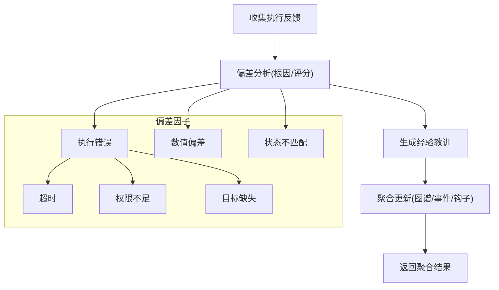
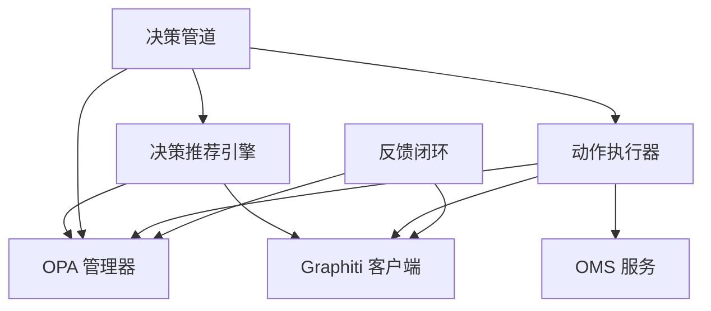
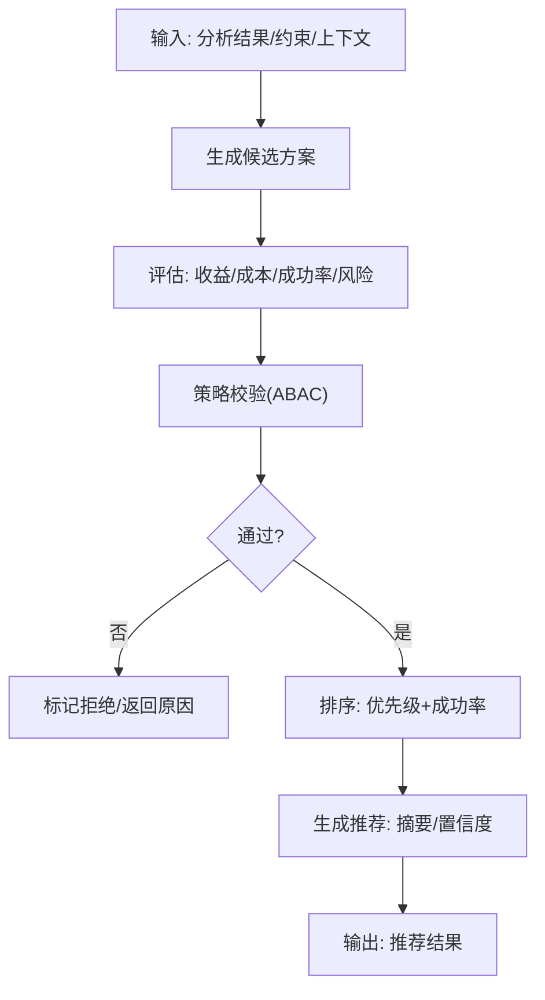

# 决策支持系统

<cite>
**本文档引用的文件**
- [engine.py](file://odap/biz/decision/decision_recommendation/engine.py)
- [models.py](file://odap/biz/decision/decision_recommendation/models.py)
- [pipeline.py](file://odap/biz/decision/decision_pipeline/pipeline.py)
- [schemas.py](file://odap/biz/decision/decision_pipeline/schemas.py)
- [routes.py](file://odap/biz/decision/decision_pipeline/routes.py)
- [executor.py](file://odap/biz/decision/action_service/executor.py)
- [schemas.py](file://odap/biz/decision/action_service/schemas.py)
- [routes.py](file://odap/biz/decision/action_service/routes.py)
- [feedback_loop.py](file://odap/biz/decision/action_service/feedback_loop.py)
- [opa_service.py](file://odap/infra/opa/opa_service.py)
- [graph_service.py](file://odap/infra/graph/graph_service.py)
- [ARCHITECTURE.md](file://docs/02-architecture/ARCHITECTURE.md)
</cite>

## 目录
1. [简介](#简介)
2. [项目结构](#项目结构)
3. [核心组件](#核心组件)
4. [架构总览](#架构总览)
5. [详细组件分析](#详细组件分析)
6. [依赖关系分析](#依赖关系分析)
7. [性能考虑](#性能考虑)
8. [故障排查指南](#故障排查指南)
9. [结论](#结论)
10. [附录](#附录)

## 简介
本文件面向决策支持系统，围绕决策推荐引擎、决策管道设计与动作执行机制展开，系统性阐述 DecisionRecommendation 推荐算法、DecisionPipeline 决策流程与 ActionService 动作执行器的工作原理，并补充风险评估模型、方案生成算法与执行跟踪机制。文档提供决策流程图、算法实现要点与性能优化策略，同时给出系统集成指南与自定义决策规则开发示例。

## 项目结构
决策支持系统位于 odap/biz/decision 下，包含三个核心子模块：
- decision_recommendation：决策推荐引擎与数据模型
- decision_pipeline：决策管道，串联理解、决策、策略校验、执行与反馈
- action_service：动作执行器、路由与反馈闭环

**图表来源**
- [engine.py:34-603](file://odap/biz/decision/decision_recommendation/engine.py#L34-L603)
- [models.py:38-244](file://odap/biz/decision/decision_recommendation/models.py#L38-L244)
- [pipeline.py:13-283](file://odap/biz/decision/decision_pipeline/pipeline.py#L13-L283)
- [schemas.py:14-74](file://odap/biz/decision/decision_pipeline/schemas.py#L14-L74)
- [routes.py:10-29](file://odap/biz/decision/decision_pipeline/routes.py#L10-L29)
- [executor.py:10-297](file://odap/biz/decision/action_service/executor.py#L10-L297)
- [schemas.py:17-57](file://odap/biz/decision/action_service/schemas.py#L17-L57)
- [routes.py:13-55](file://odap/biz/decision/action_service/routes.py#L13-L55)
- [feedback_loop.py:290-311](file://odap/biz/decision/action_service/feedback_loop.py#L290-L311)
- [opa_service.py:455-750](file://odap/infra/opa/opa_service.py#L455-L750)
- [graph_service.py:71-800](file://odap/infra/graph/graph_service.py#L71-L800)

**章节来源**
- [engine.py:1-603](file://odap/biz/decision/decision_recommendation/engine.py#L1-L603)
- [pipeline.py:1-283](file://odap/biz/decision/decision_pipeline/pipeline.py#L1-L283)
- [executor.py:1-297](file://odap/biz/decision/action_service/executor.py#L1-L297)
- [feedback_loop.py:1-311](file://odap/biz/decision/action_service/feedback_loop.py#L1-L311)
- [opa_service.py:1-750](file://odap/infra/opa/opa_service.py#L1-L750)
- [graph_service.py:1-800](file://odap/infra/graph/graph_service.py#L1-L800)

## 核心组件
- 决策推荐引擎（DecisionRecommendationEngine）
  - 职责：接收理解阶段分析结果，生成候选方案，评估优先级与风险，进行策略校验，排序并输出推荐结论
  - 关键算法：优先级评分、预期收益/成本估算、成功率估算、风险评估、理由生成、证据检索
- 决策管道（DecisionPipeline）
  - 职责：封装 OADP 四阶段流程（理解→决策→策略校验→执行→反馈），协调引擎、策略与执行器
  - 关键流程：阶段状态管理、回退机制、OPA 校验、动作执行
- 动作执行器（ActionExecutor）
  - 职责：校验动作参数与目标类型，调用 OPA 策略，执行动作并写回结果，触发反馈闭环
  - 关键流程：参数校验、OPA 检查、执行、写回、反馈

**章节来源**
- [engine.py:34-123](file://odap/biz/decision/decision_recommendation/engine.py#L34-L123)
- [pipeline.py:13-139](file://odap/biz/decision/decision_pipeline/pipeline.py#L13-L139)
- [executor.py:10-92](file://odap/biz/decision/action_service/executor.py#L10-L92)

## 架构总览
系统遵循 OADP 闭环（感知→理解→决策→执行），结合本体驱动与知识图谱推理，通过策略引擎（OPA）保障安全边界，默认 fail-closed。动作执行后进入反馈闭环，形成持续改进。

**图表来源**
- [pipeline.py:64-139](file://odap/biz/decision/decision_pipeline/pipeline.py#L64-L139)
- [engine.py:63-123](file://odap/biz/decision/decision_recommendation/engine.py#L63-L123)
- [executor.py:48-92](file://odap/biz/decision/action_service/executor.py#L48-L92)
- [opa_service.py:394-407](file://odap/infra/opa/opa_service.py#L394-L407)
- [graph_service.py:758-794](file://odap/infra/graph/graph_service.py#L758-L794)

**章节来源**
- [ARCHITECTURE.md:98-134](file://docs/02-architecture/ARCHITECTURE.md#L98-L134)

## 详细组件分析

### 决策推荐引擎（DecisionRecommendationEngine）
- 输入：RecommendationRequest（分析结果、约束、上下文）
- 输出：DecisionRecommendation（推荐方案、备选、摘要、置信度）
- 核心算法
  - 候选方案生成：若请求提供方案则复用，否则基于分析结果生成默认方案
  - 优先级评分：收益权重×预期收益 + 成本权重×(100-预期成本) + 成功率权重×成功率
  - 成本/收益/成功率估算：基于分析结果与约束条件
  - 风险评估：多因子加权综合评分，输出风险等级与缓解建议
  - 策略校验：调用 OPA（ABAC）校验动作与参数，更新方案状态
  - 排序与摘要：过滤拒绝方案，按优先级与成功率排序，生成推荐摘要与置信度
  - 反馈记录：将执行结果写入知识图谱，支持闭环学习

**图表来源**
- [engine.py:125-426](file://odap/biz/decision/decision_recommendation/engine.py#L125-L426)

**章节来源**
- [engine.py:63-123](file://odap/biz/decision/decision_recommendation/engine.py#L63-L123)
- [models.py:38-244](file://odap/biz/decision/decision_recommendation/models.py#L38-L244)

### 决策管道（DecisionPipeline）
- 职责：封装 OADP 四阶段流程，管理阶段状态，协调引擎与执行器
- 关键点
  - 理解阶段：通过语义检索获取上下文，抽取实体与模式
  - 决策阶段：调用推荐引擎生成推荐，或回退到基于本体的动作类型生成
  - 策略校验：OPA ABAC 权限检查，fail-closed
  - 执行阶段：提交动作请求给执行器
  - 反馈阶段：执行完成后触发反馈闭环

**图表来源**
- [routes.py:10-29](file://odap/biz/decision/decision_pipeline/routes.py#L10-L29)
- [pipeline.py:64-139](file://odap/biz/decision/decision_pipeline/pipeline.py#L64-L139)

**章节来源**
- [pipeline.py:13-139](file://odap/biz/decision/decision_pipeline/pipeline.py#L13-L139)
- [schemas.py:14-74](file://odap/biz/decision/decision_pipeline/schemas.py#L14-L74)

### 动作执行器（ActionExecutor）
- 职责：动作生命周期管理（校验→策略→执行→写回→反馈）
- 关键流程
  - 参数校验：必填参数检查、目标类型匹配
  - OPA 检查：按动作类型策略进行 ABAC 校验
  - 执行：根据动作类型调用图谱服务更新实体/关系
  - 写回：可选写回（Webhook/图谱）
  - 反馈：执行完成后触发反馈闭环

**图表来源**
- [executor.py:48-175](file://odap/biz/decision/action_service/executor.py#L48-L175)
- [schemas.py:17-57](file://odap/biz/decision/action_service/schemas.py#L17-L57)

**章节来源**
- [executor.py:10-175](file://odap/biz/decision/action_service/executor.py#L10-L175)
- [routes.py:13-55](file://odap/biz/decision/action_service/routes.py#L13-L55)

### 反馈闭环（FeedbackLoop）
- 收集：从执行记录提取结果/错误
- 分析：偏差评分、根因分析（超时/权限/目标缺失/数值差异等）
- 聚合：更新图谱实体状态、创建反馈事件、发出钩子事件
- 输出：聚合结果（图谱更新/事件创建/钩子发射）

**图表来源**
- [feedback_loop.py:23-300](file://odap/biz/decision/action_service/feedback_loop.py#L23-L300)

**章节来源**
- [feedback_loop.py:290-311](file://odap/biz/decision/action_service/feedback_loop.py#L290-L311)

## 依赖关系分析
- 决策推荐引擎依赖
  - OPA 管理器：用于策略校验
  - Graphiti 客户端：用于 RAG 增强（证据检索）
- 决策管道依赖
  - 语义检索器：理解阶段的数据来源
  - 决策推荐引擎：生成推荐
  - OPA 管理器：策略校验
  - 动作执行器：执行推荐动作
  - 反馈闭环：执行后的闭环处理
- 动作执行器依赖
  - OMS 服务：动作类型定义与参数约束
  - 图谱服务：实体/关系更新
  - OPA 管理器：策略校验
  - 写回管理器：可选写回

**图表来源**
- [engine.py:46-59](file://odap/biz/decision/decision_recommendation/engine.py#L46-L59)
- [pipeline.py:22-62](file://odap/biz/decision/decision_pipeline/pipeline.py#L22-L62)
- [executor.py:24-46](file://odap/biz/decision/action_service/executor.py#L24-L46)
- [feedback_loop.py:23-32](file://odap/biz/decision/action_service/feedback_loop.py#L23-L32)

**章节来源**
- [engine.py:34-62](file://odap/biz/decision/decision_recommendation/engine.py#L34-L62)
- [pipeline.py:13-62](file://odap/biz/decision/decision_pipeline/pipeline.py#L13-L62)
- [executor.py:10-46](file://odap/biz/decision/action_service/executor.py#L10-L46)

## 性能考虑
- 缓存与降级
  - OPA 管理器内置缓存与命中率统计，支持热更新策略包与回滚
  - 图谱服务支持三层降级（Graphiti→Neo4j Driver→NetworkX），具备断路器与连接池
- 异步与并发
  - 决策推荐引擎与动作执行器均采用异步方法，减少阻塞
  - 执行器内部对写回与反馈采用异步处理，避免阻塞主流程
- 算法复杂度
  - 优先级排序为 O(n log n)，风险评估与策略校验为 O(n)
  - 建议在大规模候选方案时限制 top-k 或引入早期剪枝

**章节来源**
- [opa_service.py:511-714](file://odap/infra/opa/opa_service.py#L511-L714)
- [graph_service.py:145-443](file://odap/infra/graph/graph_service.py#L145-L443)
- [engine.py:397-426](file://odap/biz/decision/decision_recommendation/engine.py#L397-L426)

## 故障排查指南
- OPA 相关
  - 现象：策略校验失败或返回拒绝
  - 排查：检查策略包版本、环境变量、OPA 服务器连通性；查看 fail-closed 错误信息
- 动作执行
  - 现象：动作被拒绝或执行失败
  - 排查：核对参数校验错误、目标类型不匹配、OPA 拒绝原因；查看执行结果与写回状态
- 图谱更新
  - 现象：实体属性未更新或关系未建立
  - 排查：确认图谱连接状态、断路器状态、回退模式；检查写回配置
- 反馈闭环
  - 现象：反馈未写入或事件未发出
  - 排查：检查反馈聚合器日志、钩子注册状态、图谱写入异常

**章节来源**
- [opa_service.py:538-683](file://odap/infra/opa/opa_service.py#L538-L683)
- [executor.py:85-91](file://odap/biz/decision/action_service/executor.py#L85-L91)
- [graph_service.py:370-443](file://odap/infra/graph/graph_service.py#L370-L443)
- [feedback_loop.py:177-212](file://odap/biz/decision/action_service/feedback_loop.py#L177-L212)

## 结论
本决策支持系统以 OADP 闭环为核心，通过决策推荐引擎生成高质量方案，借助策略引擎保障安全边界，配合动作执行器与反馈闭环实现“可执行、可验证、可改进”的决策流程。系统具备良好的扩展性与鲁棒性，适合在多领域场景中落地。

## 附录

### 决策流程图（算法实现）

**图表来源**
- [engine.py:63-123](file://odap/biz/decision/decision_recommendation/engine.py#L63-L123)

### 集成指南
- API 端点
  - 决策管道：POST /api/decision-pipeline/execute
  - 动作服务：POST /api/actions/submit、POST /api/actions/{record_id}/approve、GET /api/actions/records
- 配置要点
  - OPA 服务地址与策略包：通过环境变量或配置注入
  - 图谱连接：Neo4j URI/凭据，Graphiti 可选
  - 动作类型与参数：通过 OMS 服务定义，动作执行器自动校验

**章节来源**
- [routes.py:10-29](file://odap/biz/decision/decision_pipeline/routes.py#L10-L29)
- [routes.py:13-55](file://odap/biz/decision/action_service/routes.py#L13-L55)

### 自定义决策规则开发示例
- 自定义推荐类型
  - 在推荐模型中扩展 RecommendationType，如资源分配、优先级排序等
  - 在推荐引擎中扩展推断逻辑与评分权重
- 自定义策略规则
  - 通过 OPA 管理器上传/更新策略包，或使用策略沙箱进行 What-If 分析
  - 在动作类型定义中绑定 OPA 策略，执行器自动调用
- 自定义动作类型
  - 在 OMS 中定义动作类型与参数约束，执行器按类型路由到对应图谱操作
- 自定义反馈规则
  - 在反馈分析器中扩展偏差因子与根因判定逻辑，提升闭环质量

**章节来源**
- [models.py:14-20](file://odap/biz/decision/decision_recommendation/models.py#L14-L20)
- [opa_service.py:316-371](file://odap/infra/opa/opa_service.py#L316-L371)
- [executor.py:103-137](file://odap/biz/decision/action_service/executor.py#L103-L137)
- [feedback_loop.py:54-153](file://odap/biz/decision/action_service/feedback_loop.py#L54-L153)